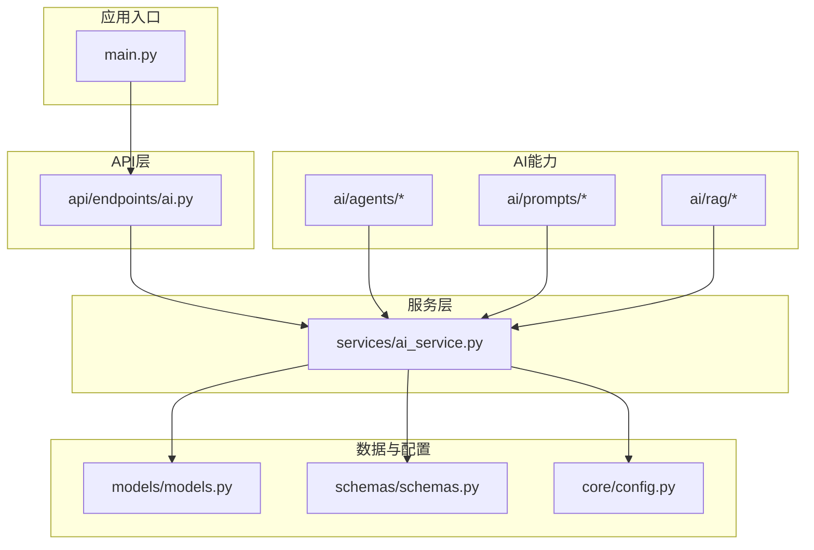
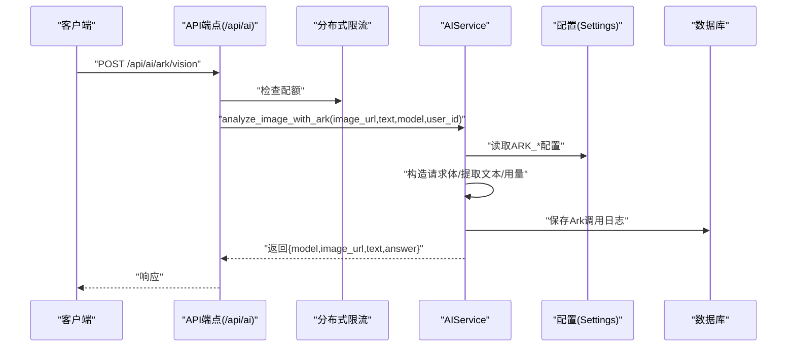
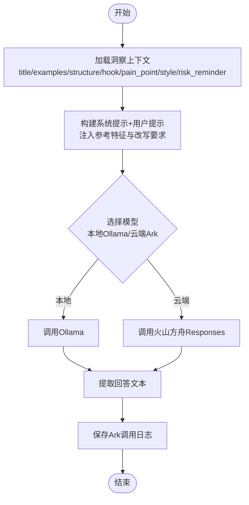
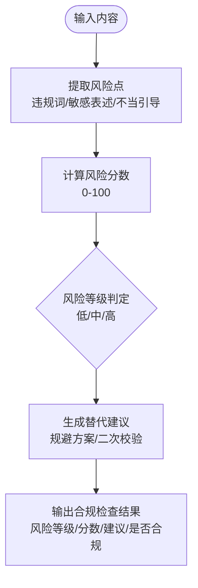
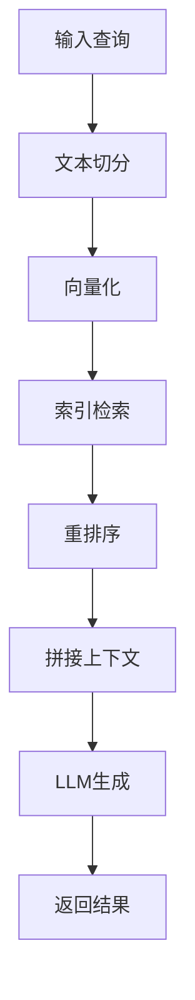
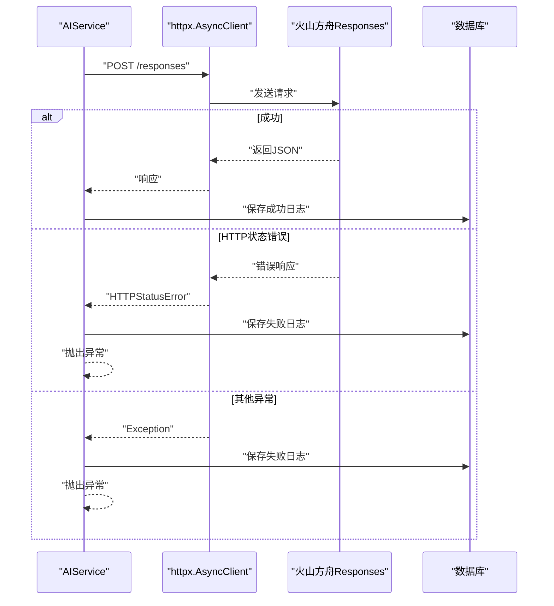
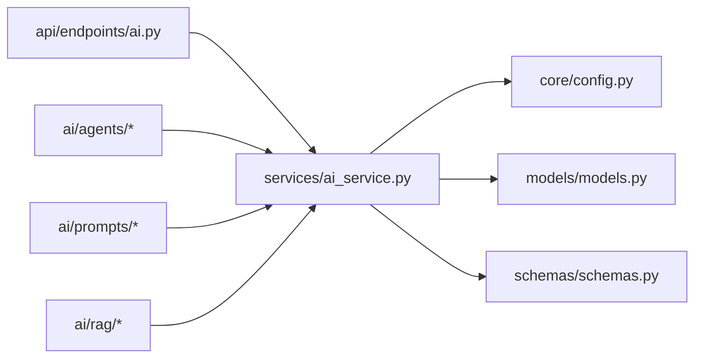
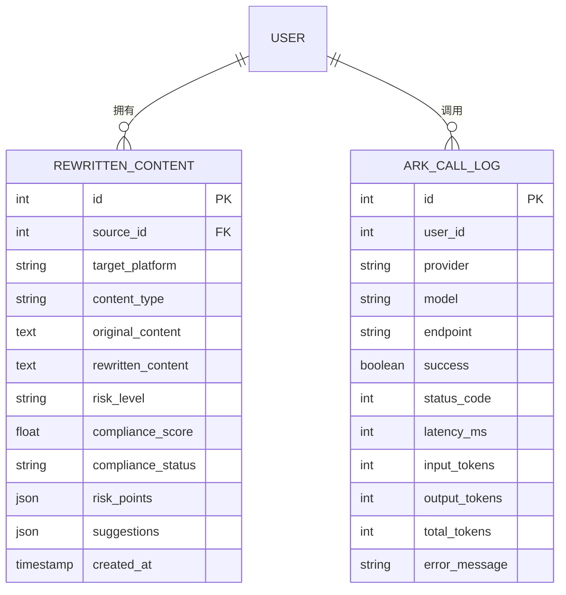

# AI内容处理系统

<cite>
**本文引用的文件**
- [backend/app/main.py](file://backend/app/main.py)
- [backend/app/ai/__init__.py](file://backend/app/ai/__init__.py)
- [backend/app/ai/agents/rewrite_agent.py](file://backend/app/ai/agents/rewrite_agent.py)
- [backend/app/ai/agents/compliance_agent.py](file://backend/app/ai/agents/compliance_agent.py)
- [backend/app/ai/prompts/compliance_review_v1.txt](file://backend/app/ai/prompts/compliance_review_v1.txt)
- [backend/app/ai/prompts/rewrite_douyin_v1.txt](file://backend/app/ai/prompts/rewrite_douyin_v1.txt)
- [backend/app/ai/rag/chunker.py](file://backend/app/ai/rag/chunker.py)
- [backend/app/ai/rag/embedder.py](file://backend/app/ai/rag/embedder.py)
- [backend/app/ai/rag/reranker.py](file://backend/app/ai/rag/reranker.py)
- [backend/app/ai/rag/retriever.py](file://backend/app/ai/rag/retriever.py)
- [backend/app/api/endpoints/ai.py](file://backend/app/api/endpoints/ai.py)
- [backend/app/services/ai_service.py](file://backend/app/services/ai_service.py)
- [backend/app/schemas/schemas.py](file://backend/app/schemas/schemas.py)
- [backend/app/core/config.py](file://backend/app/core/config.py)
- [backend/app/models/models.py](file://backend/app/models/models.py)
</cite>

## 目录
1. [简介](#简介)
2. [项目结构](#项目结构)
3. [核心组件](#核心组件)
4. [架构总览](#架构总览)
5. [详细组件分析](#详细组件分析)
6. [依赖分析](#依赖分析)
7. [性能考虑](#性能考虑)
8. [故障排查指南](#故障排查指南)
9. [结论](#结论)
10. [附录](#附录)

## 简介
本技术文档面向“智获客AI内容处理系统”，围绕AI内容改写、合规性检查与风险评估、智能优化建议、RAG检索增强生成（RAG）、AI模型集成与提示工程、输出质量控制、配置参数、调用接口与返回格式、与外部AI服务（火山方舟）集成及错误处理策略、性能基准测试与最佳实践进行系统化说明。文档以代码为依据，辅以图示帮助不同背景读者理解系统设计与实现。

## 项目结构
后端采用FastAPI框架，模块化组织如下：
- 应用入口与路由：主应用入口位于backend/app/main.py；API路由集中在backend/app/api/endpoints/ai.py。
- AI能力：
  - 代理与提示：agents目录存放改写代理与合规代理；prompts目录存放提示词模板。
  - RAG工具：chunker、embedder、reranker、retriever提供文本切分、向量化、重排序与检索能力。
- 服务层：services/ai_service.py封装LLM调用、火山方舟响应解析与日志记录。
- 数据模型与Schema：models/models.py定义数据库表结构；schemas/schemas.py定义请求/响应模型。
- 配置：core/config.py集中管理AI模型、限流、Redis、火山方舟等配置。

图表来源
- [backend/app/main.py](file://backend/app/main.py)
- [backend/app/api/endpoints/ai.py](file://backend/app/api/endpoints/ai.py)
- [backend/app/services/ai_service.py](file://backend/app/services/ai_service.py)
- [backend/app/ai/agents/rewrite_agent.py](file://backend/app/ai/agents/rewrite_agent.py)
- [backend/app/ai/prompts/compliance_review_v1.txt](file://backend/app/ai/prompts/compliance_review_v1.txt)
- [backend/app/ai/rag/chunker.py](file://backend/app/ai/rag/chunker.py)
- [backend/app/core/config.py](file://backend/app/core/config.py)
- [backend/app/models/models.py](file://backend/app/models/models.py)
- [backend/app/schemas/schemas.py](file://backend/app/schemas/schemas.py)

章节来源
- [backend/app/main.py](file://backend/app/main.py)
- [backend/app/api/endpoints/ai.py](file://backend/app/api/endpoints/ai.py)
- [backend/app/core/config.py](file://backend/app/core/config.py)

## 核心组件
- AI服务层（AIService）
  - 统一LLM调用入口，支持本地Ollama与云端火山方舟（Ark）两种模式。
  - 提供图像多模态分析、文本改写、结构抽取、评论回复生成等能力。
  - 对外暴露ark调用日志持久化与使用量统计。
- API端点（/api/ai）
  - 提供图像分析（Ark Vision）、旧版改写接口迁移提示、插件采集接口迁移提示。
  - 使用分布式限流保护Ark调用。
- 数据模型与Schema
  - RewrittenContent、ArkCallLog等模型支撑改写结果、合规评分、调用日志等数据持久化。
  - AIRewriteRequest/AIRewriteResponse、ArkVisionRequest/ArkVisionResponse等定义接口契约。
- 配置（Settings）
  - Ollama基础地址与模型、是否启用云模型、火山方舟API Key、Base URL、超时、限流参数、Redis限流开关与Key前缀等。

章节来源
- [backend/app/services/ai_service.py](file://backend/app/services/ai_service.py)
- [backend/app/api/endpoints/ai.py](file://backend/app/api/endpoints/ai.py)
- [backend/app/schemas/schemas.py](file://backend/app/schemas/schemas.py)
- [backend/app/models/models.py](file://backend/app/models/models.py)
- [backend/app/core/config.py](file://backend/app/core/config.py)

## 架构总览
系统通过API层接收请求，经鉴权与限流后交由服务层调用LLM或火山方舟；服务层负责提示工程、上下文注入、输出解析与日志记录；最终将结构化结果写入数据库并返回给客户端。

图表来源
- [backend/app/api/endpoints/ai.py](file://backend/app/api/endpoints/ai.py)
- [backend/app/services/ai_service.py](file://backend/app/services/ai_service.py)
- [backend/app/core/config.py](file://backend/app/core/config.py)
- [backend/app/models/models.py](file://backend/app/models/models.py)

## 详细组件分析

### AI内容改写实现原理
- 改写能力
  - 小红书风格改写、抖音脚本改写、知乎回答改写，均通过统一call_llm方法调用本地或云端模型。
  - 支持基于洞察上下文（insight_ctx）注入参考标题、结构、钩子、痛点、风格与风险提醒，形成“参考特征”块，避免直接复制原文。
- 提示工程
  - 系统提示（System Prompt）强调平台风格与合规约束，用户提示（Prompt）给出具体改写要求与字数限制。
  - 提示词模板位于ai/prompts目录，便于版本化与维护。
- 输出质量控制
  - 通过严格的风险词禁用列表与平台风格约束，结合结构化JSON解析（如结构抽取）保障输出质量。

图表来源
- [backend/app/services/ai_service.py](file://backend/app/services/ai_service.py)
- [backend/app/ai/prompts/compliance_review_v1.txt](file://backend/app/ai/prompts/compliance_review_v1.txt)
- [backend/app/ai/prompts/rewrite_douyin_v1.txt](file://backend/app/ai/prompts/rewrite_douyin_v1.txt)

章节来源
- [backend/app/services/ai_service.py](file://backend/app/services/ai_service.py)
- [backend/app/ai/prompts/compliance_review_v1.txt](file://backend/app/ai/prompts/compliance_review_v1.txt)
- [backend/app/ai/prompts/rewrite_douyin_v1.txt](file://backend/app/ai/prompts/rewrite_douyin_v1.txt)

### 合规性检查机制与风险评估算法
- 合规检查
  - 提供合规检查请求/响应模型，返回风险等级、风险分数、风险点列表、建议与合规状态。
  - 合规代理位于agents/compliance_agent.py，当前返回占位字符串，实际逻辑可扩展至对改写结果进行风险点识别与替代建议生成。
- 风险评估
  - 风险点包括违规承诺、敏感表述、不当引导等；建议包含规避方案与二次校验要点。
  - 与改写流程串联：先改写，再合规检查，最后输出带风险等级与建议的结果。

图表来源
- [backend/app/ai/agents/compliance_agent.py](file://backend/app/ai/agents/compliance_agent.py)
- [backend/app/schemas/schemas.py](file://backend/app/schemas/schemas.py)

章节来源
- [backend/app/ai/agents/compliance_agent.py](file://backend/app/ai/agents/compliance_agent.py)
- [backend/app/schemas/schemas.py](file://backend/app/schemas/schemas.py)

### 智能优化建议的生成逻辑与决策过程
- 建议来源
  - 洞察上下文（insight_ctx）中的参考特征（标题、结构、钩子、痛点、风格、风险提醒）作为优化建议的基础。
  - AIService在改写时将这些特征注入提示，确保输出贴近高互动/合规范式。
- 决策过程
  - 优先保证合规性与平台风格，其次追求可读性与转化意图；当存在冲突时，以合规优先。
  - 对高风险内容，强制加入风险提醒与规避建议，并在输出中体现风险等级。

章节来源
- [backend/app/services/ai_service.py](file://backend/app/services/ai_service.py)
- [backend/app/schemas/schemas.py](file://backend/app/schemas/schemas.py)

### RAG检索增强生成工作流程与性能优化
- 当前实现
  - RAG工具（chunker、embedder、reranker、retriever）目前返回占位值，尚未接入实际检索链路。
- 建议流程（概念性）
  - 文本切分 → 向量化 → 索引检索 → 重排序 → 上下文拼接 → LLM生成 → 日志与缓存。
- 性能优化
  - 切分策略：按语义段落与长度阈值切分，避免过长片段影响检索质量。
  - 向量化：选择轻量模型或本地嵌入，减少网络延迟。
  - 重排序：基于BM25与向量混合打分，提高召回相关性。
  - 缓存：热点检索结果与向量向缓存，降低重复请求成本。

图表来源
- [backend/app/ai/rag/chunker.py](file://backend/app/ai/rag/chunker.py)
- [backend/app/ai/rag/embedder.py](file://backend/app/ai/rag/embedder.py)
- [backend/app/ai/rag/reranker.py](file://backend/app/ai/rag/reranker.py)
- [backend/app/ai/rag/retriever.py](file://backend/app/ai/rag/retriever.py)

章节来源
- [backend/app/ai/rag/chunker.py](file://backend/app/ai/rag/chunker.py)
- [backend/app/ai/rag/embedder.py](file://backend/app/ai/rag/embedder.py)
- [backend/app/ai/rag/reranker.py](file://backend/app/ai/rag/reranker.py)
- [backend/app/ai/rag/retriever.py](file://backend/app/ai/rag/retriever.py)

### AI模型集成、提示工程与输出质量控制
- 模型集成
  - 本地：Ollama，通过HTTP客户端调用/generate接口，设置温度、超时等参数。
  - 云端：火山方舟Responses，通过Authorization头与JSON负载调用，支持多模态输入（图片+文本）。
- 提示工程
  - 系统提示明确角色与平台风格；用户提示给出具体要求（如字数、语气、结构、风险禁用词）。
  - 洞察上下文动态注入，避免模板化过度导致“复制原文”。
- 输出质量控制
  - 解析Ark响应时兼容多种输出结构，回退到JSON字符串，保证稳定性。
  - 对JSON解析失败的场景保留原始响应，便于后续人工复核。

章节来源
- [backend/app/services/ai_service.py](file://backend/app/services/ai_service.py)
- [backend/app/ai/prompts/compliance_review_v1.txt](file://backend/app/ai/prompts/compliance_review_v1.txt)
- [backend/app/ai/prompts/rewrite_douyin_v1.txt](file://backend/app/ai/prompts/rewrite_douyin_v1.txt)

### 配置参数、调用接口与返回格式
- 配置参数（Settings）
  - AI模型：OLLAMA_BASE_URL、OLLAMA_MODEL、USE_CLOUD_MODEL
  - 火山方舟：ARK_API_KEY、ARK_BASE_URL、ARK_MODEL、ARK_TIMEOUT_SECONDS
  - 限流：ARK_VISION_RATE_LIMIT_PER_MINUTE、ARK_VISION_RATE_LIMIT_WINDOW_SECONDS、USE_REDIS_RATE_LIMIT、REDIS_URL、RATE_LIMIT_KEY_PREFIX
- 接口与返回
  - 图像分析（Ark Vision）
    - 方法与路径：POST /api/ai/ark/vision
    - 请求体：ArkVisionRequest（image_url、text、model）
    - 返回体：ArkVisionResponse（model、image_url、text、answer）
  - 旧版改写接口
    - 已下线，返回迁移提示（指向v2或v1新接口）
  - 旧版插件采集接口
    - 已下线，返回迁移提示（指向v1员工投稿或关键词采集任务）

章节来源
- [backend/app/core/config.py](file://backend/app/core/config.py)
- [backend/app/api/endpoints/ai.py](file://backend/app/api/endpoints/ai.py)
- [backend/app/schemas/schemas.py](file://backend/app/schemas/schemas.py)

### 与外部AI服务集成与错误处理策略
- 集成方式
  - 通过httpx异步客户端发起请求，设置超时与信任环境；成功时解析JSON，失败时捕获HTTPStatusError与通用异常。
- 错误处理
  - 记录请求ID、场景、用户ID、模型、耗时、Token用量与错误详情。
  - 将调用日志持久化至ArkCallLog，便于审计与计费追踪。
  - 对Ark API错误与异常分别记录警告与异常日志，并抛出统一异常信息。

图表来源
- [backend/app/services/ai_service.py](file://backend/app/services/ai_service.py)
- [backend/app/models/models.py](file://backend/app/models/models.py)

章节来源
- [backend/app/services/ai_service.py](file://backend/app/services/ai_service.py)
- [backend/app/models/models.py](file://backend/app/models/models.py)

## 依赖分析
- 组件耦合
  - API端点仅依赖安全校验与限流，业务逻辑委托给AIService，保持高内聚低耦合。
  - AIService依赖配置与数据库（Ark调用日志），对外屏蔽外部服务细节。
- 外部依赖
  - httpx用于异步HTTP调用；SQLAlchemy用于ORM与日志持久化。
- 潜在循环依赖
  - 当前未发现循环导入；各模块职责清晰。

图表来源
- [backend/app/api/endpoints/ai.py](file://backend/app/api/endpoints/ai.py)
- [backend/app/services/ai_service.py](file://backend/app/services/ai_service.py)
- [backend/app/core/config.py](file://backend/app/core/config.py)
- [backend/app/models/models.py](file://backend/app/models/models.py)
- [backend/app/schemas/schemas.py](file://backend/app/schemas/schemas.py)
- [backend/app/ai/agents/rewrite_agent.py](file://backend/app/ai/agents/rewrite_agent.py)
- [backend/app/ai/prompts/compliance_review_v1.txt](file://backend/app/ai/prompts/compliance_review_v1.txt)
- [backend/app/ai/rag/chunker.py](file://backend/app/ai/rag/chunker.py)

章节来源
- [backend/app/api/endpoints/ai.py](file://backend/app/api/endpoints/ai.py)
- [backend/app/services/ai_service.py](file://backend/app/services/ai_service.py)
- [backend/app/core/config.py](file://backend/app/core/config.py)

## 性能考虑
- 异步I/O
  - 使用httpx.AsyncClient减少阻塞，提升并发处理能力。
- 超时与重试
  - 设置合理超时时间（如ARK_TIMEOUT_SECONDS），对关键路径增加指数退避重试策略。
- 缓存与限流
  - Redis分布式限流保护Ark调用，避免突发流量压垮外部服务。
- 日志与监控
  - Ark调用日志包含耗时、Token用量与错误码，便于性能分析与成本控制。
- RAG优化
  - 切分与向量化并行化；重排序采用轻量策略；缓存热点结果。

[本节为通用指导，无需列出章节来源]

## 故障排查指南
- 常见问题
  - Ark API Key未配置：调用将抛出异常，检查配置项ARK_API_KEY。
  - 火山方舟响应解析失败：服务会回退到JSON字符串，同时记录详细错误日志。
  - 限流触发：检查USE_REDIS_RATE_LIMIT与REDIS_URL配置，确认限流键前缀与窗口设置。
- 定位手段
  - 查看Ark调用日志（ArkCallLog）：包含请求ID、用户ID、模型、耗时、Token用量与错误信息。
  - 检查服务端日志：区分HTTP错误与通用异常，快速定位问题类型。

章节来源
- [backend/app/services/ai_service.py](file://backend/app/services/ai_service.py)
- [backend/app/models/models.py](file://backend/app/models/models.py)
- [backend/app/core/config.py](file://backend/app/core/config.py)

## 结论
系统以AIService为核心，统一抽象本地与云端模型调用，结合提示工程与洞察上下文，实现多平台风格的高质量内容改写；通过Ark调用日志与限流策略保障稳定性与可观测性；RAG模块预留扩展空间，未来可与检索链路深度集成。建议尽快补齐合规代理与RAG工具的实际实现，并完善性能基准测试与告警体系。

[本节为总结性内容，无需列出章节来源]

## 附录

### 数据模型概览（与AI相关）

图表来源
- [backend/app/models/models.py](file://backend/app/models/models.py)

章节来源
- [backend/app/models/models.py](file://backend/app/models/models.py)