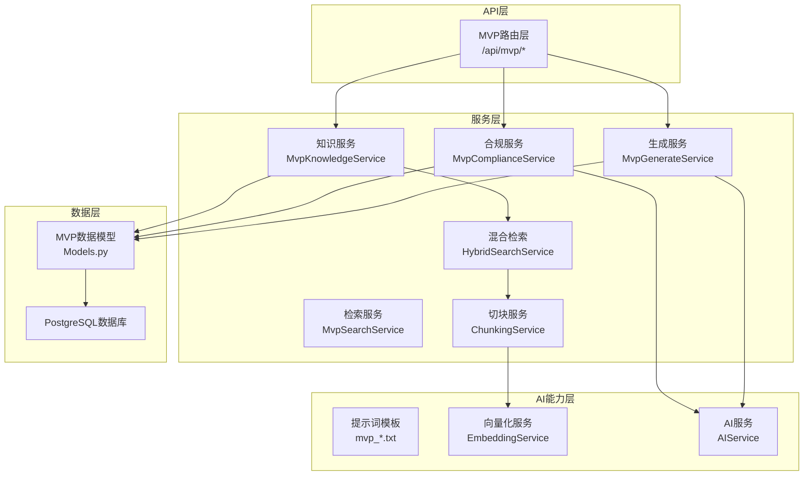
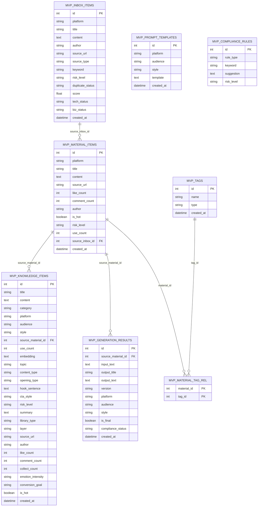
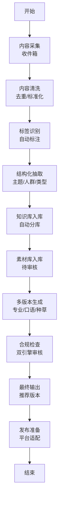
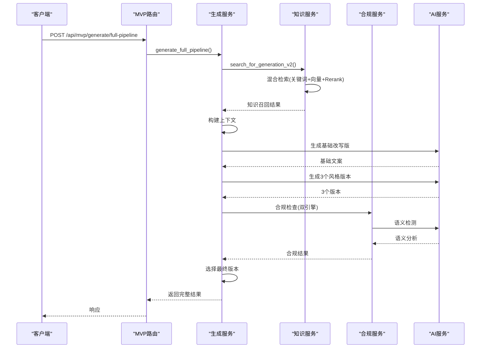
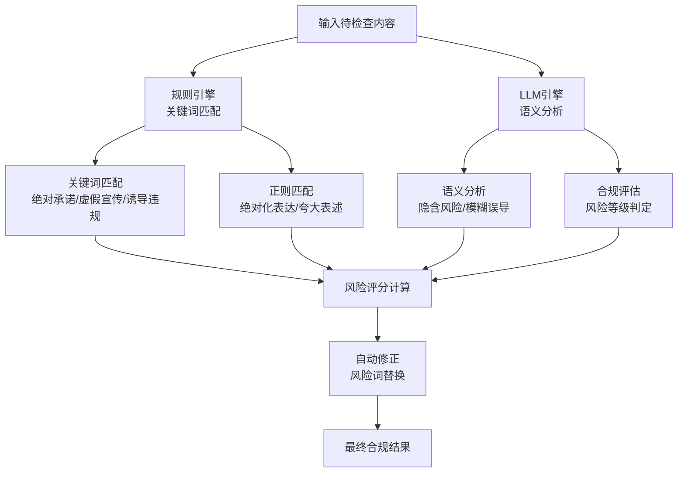
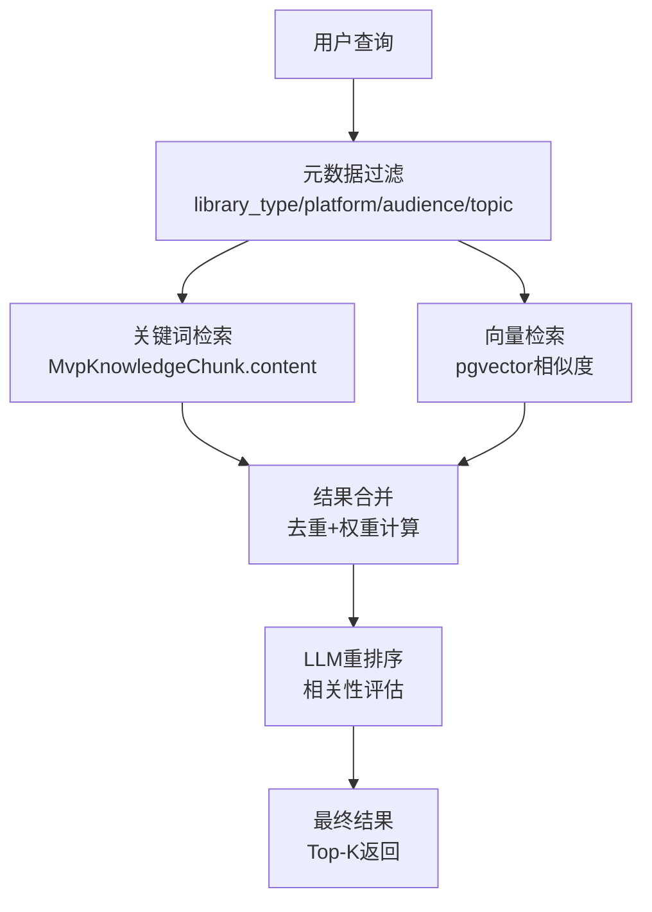
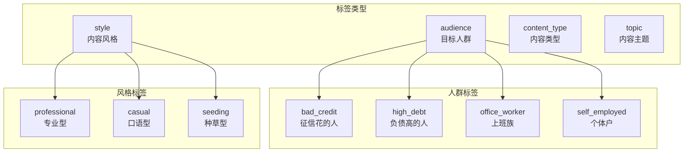

# AI内容处理系统

<cite>
**本文引用的文件**
- [backend/app/main.py](file://backend/app/main.py)
- [backend/app/api/endpoints/mvp_routes.py](file://backend/app/api/endpoints/mvp_routes.py)
- [backend/app/services/mvp_generate_service.py](file://backend/app/services/mvp_generate_service.py)
- [backend/app/services/mvp_compliance_service.py](file://backend/app/services/mvp_compliance_service.py)
- [backend/app/services/mvp_rewrite_service.py](file://backend/app/services/mvp_rewrite_service.py)
- [backend/app/services/mvp_knowledge_service.py](file://backend/app/services/mvp_knowledge_service.py)
- [backend/app/services/mvp_search_service.py](file://backend/app/services/mvp_search_service.py)
- [backend/app/services/hybrid_search_service.py](file://backend/app/services/hybrid_search_service.py)
- [backend/app/services/chunking_service.py](file://backend/app/services/chunking_service.py)
- [backend/app/ai/prompts/mvp_general_v1.txt](file://backend/app/ai/prompts/mvp_general_v1.txt)
- [backend/app/ai/prompts/mvp_hot_rewrite_v1.txt](file://backend/app/ai/prompts/mvp_hot_rewrite_v1.txt)
- [backend/app/ai/prompts/mvp_compliance_rewrite_v1.txt](file://backend/app/ai/prompts/mvp_compliance_rewrite_v1.txt)
- [backend/app/schemas/mvp_schemas.py](file://backend/app/schemas/mvp_schemas.py)
- [backend/app/models/models.py](file://backend/app/models/models.py)
- [backend/alembic/versions/20260328_02_add_mvp_core_tables.py](file://backend/alembic/versions/20260328_02_add_mvp_core_tables.py)
</cite>

## 更新摘要
**所做更改**
- 完全重写了系统架构，从原有的AI内容处理系统转换为MVP的AI生成和合规检查系统
- 新增了完整的MVP数据模型和数据库表结构
- 实现了从收件箱到素材库再到知识库的完整内容处理流水线
- 集成了混合检索（关键词+向量+Rerank）的RAG系统
- 新增了多版本内容生成、合规检查、爆款仿写等核心功能
- 完善了标签系统、知识库分库管理和自动入库管道

## 目录
1. [简介](#简介)
2. [系统架构概览](#系统架构概览)
3. [MVP核心数据模型](#mvp核心数据模型)
4. [内容处理流水线](#内容处理流水线)
5. [AI生成系统](#ai生成系统)
6. [合规检查系统](#合规检查系统)
7. [知识库与RAG系统](#知识库与rag系统)
8. [混合检索与向量化](#混合检索与向量化)
9. [标签与内容分类](#标签与内容分类)
10. [API接口与使用指南](#api接口与使用指南)
11. [性能优化与最佳实践](#性能优化与最佳实践)
12. [故障排查与监控](#故障排查与监控)
13. [总结](#总结)

## 简介
智获客AI内容处理系统现已升级为MVP（最小可行产品）版本，提供完整的AI内容生成、合规检查和知识管理能力。系统采用现代化的微服务架构，支持多平台内容生成、智能合规审核、RAG检索增强和自动化内容处理流水线。

新系统的核心特性包括：
- **多版本内容生成**：支持专业型、口语型、种草型三种风格的自动内容生成
- **智能合规检查**：双引擎合规审核（规则匹配+大模型语义检测）
- **RAG检索增强**：混合检索系统（关键词+向量+重排序）
- **自动化流水线**：从收件箱采集到知识库管理的完整内容处理流程
- **知识库分库管理**：按内容类型和用途的结构化知识管理

## 系统架构概览
新系统采用分层架构设计，主要分为四个层次：

**图表来源**
- [backend/app/api/endpoints/mvp_routes.py](file://backend/app/api/endpoints/mvp_routes.py)
- [backend/app/services/mvp_generate_service.py](file://backend/app/services/mvp_generate_service.py)
- [backend/app/services/mvp_compliance_service.py](file://backend/app/services/mvp_compliance_service.py)
- [backend/app/services/mvp_knowledge_service.py](file://backend/app/services/mvp_knowledge_service.py)
- [backend/app/services/hybrid_search_service.py](file://backend/app/services/hybrid_search_service.py)
- [backend/app/services/chunking_service.py](file://backend/app/services/chunking_service.py)

## MVP核心数据模型
系统采用全新的MVP数据模型，支持完整的收件箱-素材库-知识库-生成结果管理：

**图表来源**
- [backend/app/models/models.py](file://backend/app/models/models.py)
- [backend/alembic/versions/20260328_02_add_mvp_core_tables.py](file://backend/alembic/versions/20260328_02_add_mvp_core_tables.py)

**章节来源**
- [backend/app/models/models.py](file://backend/app/models/models.py)
- [backend/alembic/versions/20260328_02_add_mvp_core_tables.py](file://backend/alembic/versions/20260328_02_add_mvp_core_tables.py)

## 内容处理流水线
系统提供完整的自动化内容处理流水线，从内容采集到最终生成：

**章节来源**
- [backend/app/services/mvp_knowledge_service.py](file://backend/app/services/mvp_knowledge_service.py)
- [backend/app/services/mvp_generate_service.py](file://backend/app/services/mvp_generate_service.py)
- [backend/app/api/endpoints/mvp_routes.py](file://backend/app/api/endpoints/mvp_routes.py)

## AI生成系统
MVP生成系统提供强大的多版本内容生成能力，支持三种核心风格：

### 生成流程
系统采用"知识检索→上下文编排→多版本生成→合规审核→最终选择"的完整流程：

**图表来源**
- [backend/app/services/mvp_generate_service.py](file://backend/app/services/mvp_generate_service.py)
- [backend/app/services/mvp_knowledge_service.py](file://backend/app/services/mvp_knowledge_service.py)
- [backend/app/services/mvp_compliance_service.py](file://backend/app/services/mvp_compliance_service.py)

### 多版本生成策略
系统支持三种核心风格的自动内容生成：

| 风格类型 | 适用平台 | 特点描述 | 输出要求 |
|---------|---------|----------|----------|
| 专业型(professional) | 知乎、公众号 | 数据驱动、逻辑清晰、术语精准 | 专业分析、数据支撑、理性客观 |
| 口语型(casual) | 抖音、视频号 | 短句为主、接地气、代入感强 | 口语化表达、节奏感强、情感共鸣 |
| 种草型(seeding) | 小红书、微博 | 情感共鸣、场景化描述、真实分享 | emoji装饰、好奇心驱动、互动引导 |

**章节来源**
- [backend/app/services/mvp_generate_service.py](file://backend/app/services/mvp_generate_service.py)
- [backend/app/ai/prompts/mvp_general_v1.txt](file://backend/app/ai/prompts/mvp_general_v1.txt)

## 合规检查系统
MVP合规检查系统采用双引擎架构，确保内容的安全性和合规性：

### 双引擎合规架构

**图表来源**
- [backend/app/services/mvp_compliance_service.py](file://backend/app/services/mvp_compliance_service.py)

### 风险等级评估
系统采用多层次的风险评估机制：

| 风险级别 | 分数范围 | 特征描述 | 处理建议 |
|---------|---------|----------|----------|
| 低风险(low) | 0-24分 | 基本合规，少量轻微风险 | 直接发布 |
| 中风险(medium) | 25-49分 | 存在中等程度风险点 | 修改后发布 |
| 高风险(high) | 50分以上 | 严重违规风险，多处高危表达 | 需要人工审核 |

**章节来源**
- [backend/app/services/mvp_compliance_service.py](file://backend/app/services/mvp_compliance_service.py)

## 知识库与RAG系统
MVP系统提供完整的知识库管理和RAG检索能力：

### 知识库分库管理
系统将知识库分为七个核心分库：

| 分库类型 | 描述 | 示例内容 | 使用场景 |
|---------|------|----------|----------|
| 爆款内容库 | 高质量案例和热门内容 | 成功案例、爆款文案 | 内容仿写、风格学习 |
| 行业话术库 | 通用行业表达和话术 | 专业术语、表达技巧 | 语言润色、风格统一 |
| 平台规则库 | 各平台内容规范和限制 | 平台审核规则、违规案例 | 平台适配、合规检查 |
| 人群画像库 | 目标受众特征和洞察 | 人群标签、行为特征 | 精准定位、个性化内容 |
| 账号定位库 | 账号角色和语气模板 | 账号定位、说话方式 | 角色扮演、风格保持 |
| 提示词库 | 生成和优化提示词模板 | 提示词模板、优化策略 | AI内容生成、质量提升 |
| 审核规则库 | 合规审核规则和标准 | 风险词、审核标准 | 合规检查、风险规避 |

**章节来源**
- [backend/app/services/mvp_knowledge_service.py](file://backend/app/services/mvp_knowledge_service.py)
- [backend/app/models/models.py](file://backend/app/models/models.py)

## 混合检索与向量化
MVP系统实现了先进的混合检索架构，结合关键词、向量和语义理解：

### 混合检索架构

**图表来源**
- [backend/app/services/hybrid_search_service.py](file://backend/app/services/hybrid_search_service.py)

### 向量化策略
系统采用多策略向量化：

| 策略类型 | 切块方式 | 适用内容 | 特点 |
|---------|----------|----------|------|
| 帖子级(post) | 完整内容作为一个chunk | 爆款内容、完整文案 | 保持完整性，适合语义理解 |
| 段落级(paragraph) | 按段落/句子切分 | 论述内容、知识条目 | 细粒度检索，提高准确性 |
| 规则级(rule) | 每条规则独立存储 | 合规规则、操作指南 | 精确匹配，便于规则检索 |
| 模板级(template) | 完整模板内容 | 提示词模板、话术模板 | 保持模板完整性，便于复用 |

**章节来源**
- [backend/app/services/hybrid_search_service.py](file://backend/app/services/hybrid_search_service.py)
- [backend/app/services/chunking_service.py](file://backend/app/services/chunking_service.py)

## 标签与内容分类
MVP系统提供智能化的标签管理和内容分类：

### 标签系统

**图表来源**
- [backend/app/services/mvp_knowledge_service.py](file://backend/app/services/mvp_knowledge_service.py)

### 自动内容抽取
系统支持自动化的结构化内容抽取：

| 抽取维度 | 抽取内容 | 抽取方法 |
|---------|----------|----------|
| 主题(topic) | 贷款/征信/网贷/公积金 | 关键词匹配+语义分析 |
| 人群(audience) | 征信花/负债高/上班族/个体户 | 人群关键词识别 |
| 内容类型(content_type) | 案例/知识/规则/模板 | 文本特征分析 |
| 开头类型(opening_type) | 提问/数据/故事/痛点 | 文本结构分析 |
| 钩子句(hook_sentence) | 第一句内容 | 句子边界识别 |
| CTA类型(cta_style) | 私信/评论/关注 | 引导词识别 |
| 风险等级(risk_level) | 低/中/高 | 敏感词检测 |
| 摘要(summary) | 内容摘要 | 截取+清理 |

**章节来源**
- [backend/app/services/mvp_knowledge_service.py](file://backend/app/services/mvp_knowledge_service.py)

## API接口与使用指南
MVP系统提供RESTful API接口，支持完整的AI内容处理流程：

### 核心API接口

#### 收件箱管理
- `GET /api/mvp/inbox` - 列出收件箱条目
- `GET /api/mvp/inbox/{item_id}` - 获取收件箱条目详情
- `POST /api/mvp/inbox/{item_id}/to-material` - 转入素材库
- `POST /api/mvp/inbox/{item_id}/mark-hot` - 标记爆款
- `POST /api/mvp/inbox/{item_id}/discard` - 废弃条目

#### 素材库管理
- `GET /api/mvp/materials` - 列出素材库
- `GET /api/mvp/materials/{material_id}` - 获取素材详情
- `POST /api/mvp/materials` - 创建素材
- `POST /api/mvp/materials/{material_id}/build-knowledge` - 从素材构建知识
- `POST /api/mvp/materials/{material_id}/rewrite` - 爆款仿写
- `POST /api/mvp/materials/{material_id}/tags` - 更新素材标签

#### 知识库管理
- `GET /api/mvp/knowledge` - 列出知识库
- `GET /api/mvp/knowledge/{knowledge_id}` - 获取知识条目
- `GET /api/mvp/knowledge/chunks/{knowledge_id}` - 获取知识切块
- `POST /api/mvp/knowledge/reindex` - 重建索引
- `POST /api/mvp/knowledge/search` - 搜索知识库

#### AI生成接口
- `POST /api/mvp/generate` - 多版本内容生成
- `POST /api/mvp/generate/final` - 完整主链路生成
- `POST /api/mvp/generate/full-pipeline` - 全流程内容生成

#### 合规检查
- `POST /api/mvp/compliance/check` - 合规检查

#### 自动入库管道
- `POST /api/mvp/raw-contents/auto-pipeline` - 自动入库
- `POST /api/mvp/raw-contents/auto-pipeline/batch` - 批量自动入库

**章节来源**
- [backend/app/api/endpoints/mvp_routes.py](file://backend/app/api/endpoints/mvp_routes.py)
- [backend/app/schemas/mvp_schemas.py](file://backend/app/schemas/mvp_schemas.py)

## 性能优化与最佳实践
MVP系统在性能和可扩展性方面采用了多项优化措施：

### 性能优化策略
1. **异步处理**：大量使用async/await模式，提升并发处理能力
2. **缓存机制**：Redis缓存热点数据和检索结果
3. **分页查询**：大数据量场景下的分页处理
4. **连接池**：数据库连接池管理，减少连接开销
5. **批量操作**：支持批量入库和批量处理

### 最佳实践建议
1. **内容质量控制**：建立内容质量评估指标
2. **合规监控**：定期审查合规规则的有效性
3. **性能监控**：建立系统性能监控和告警机制
4. **数据备份**：定期备份关键数据
5. **版本管理**：提示词模板和规则的版本控制

## 故障排查与监控
MVP系统提供了完善的故障排查和监控机制：

### 常见问题诊断
1. **API调用失败**：检查网络连接、认证信息和请求格式
2. **生成结果异常**：验证输入参数、检查AI服务可用性
3. **合规检查错误**：确认合规规则配置和LLM服务状态
4. **检索性能问题**：检查向量化服务和数据库索引

### 监控指标
- 系统响应时间
- API调用成功率
- AI服务调用次数
- 数据库查询性能
- 内存和CPU使用率

## 总结
智获客AI内容处理系统已成功升级为MVP版本，提供了完整的AI内容生成、合规检查和知识管理能力。新系统采用现代化的架构设计，支持多平台内容生成、智能合规审核、RAG检索增强和自动化内容处理流水线。

核心优势包括：
- **完整的处理流水线**：从内容采集到最终发布的自动化流程
- **强大的AI生成能力**：多版本内容生成和智能优化
- **严格的合规保障**：双引擎合规检查确保内容安全
- **先进的检索系统**：混合检索提供精准的知识召回
- **灵活的扩展性**：模块化设计支持功能扩展和定制

系统为金融获客内容创作提供了强有力的技术支撑，显著提升了内容质量和生产效率。