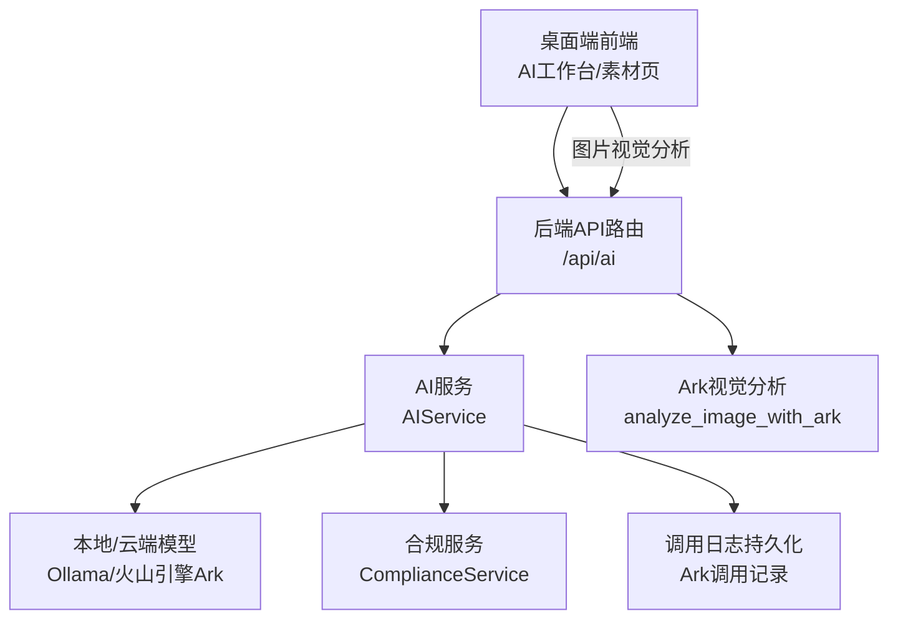
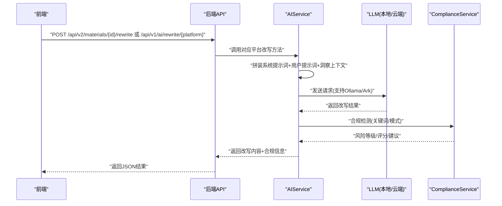
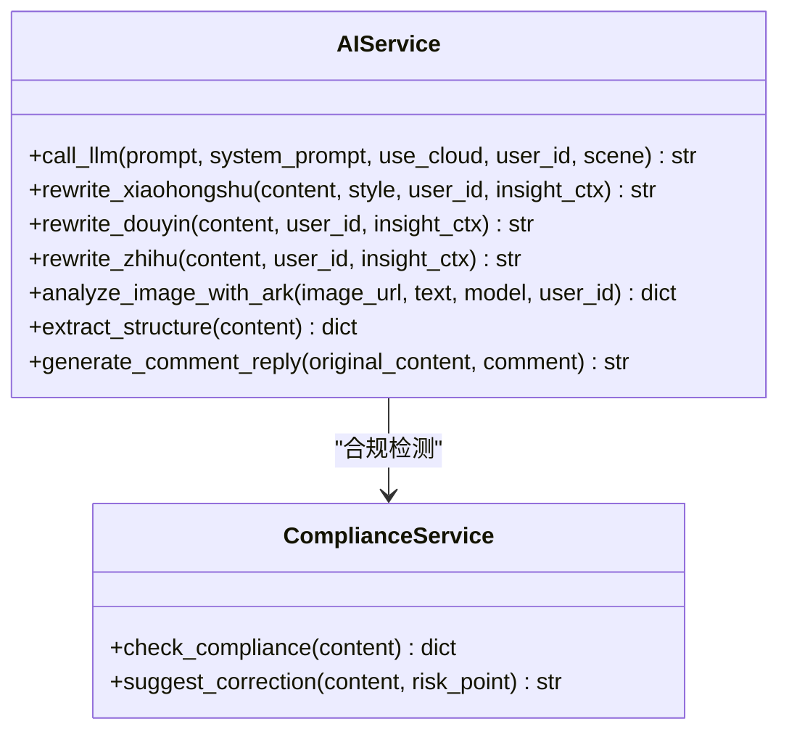
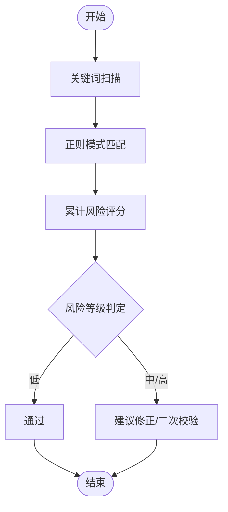
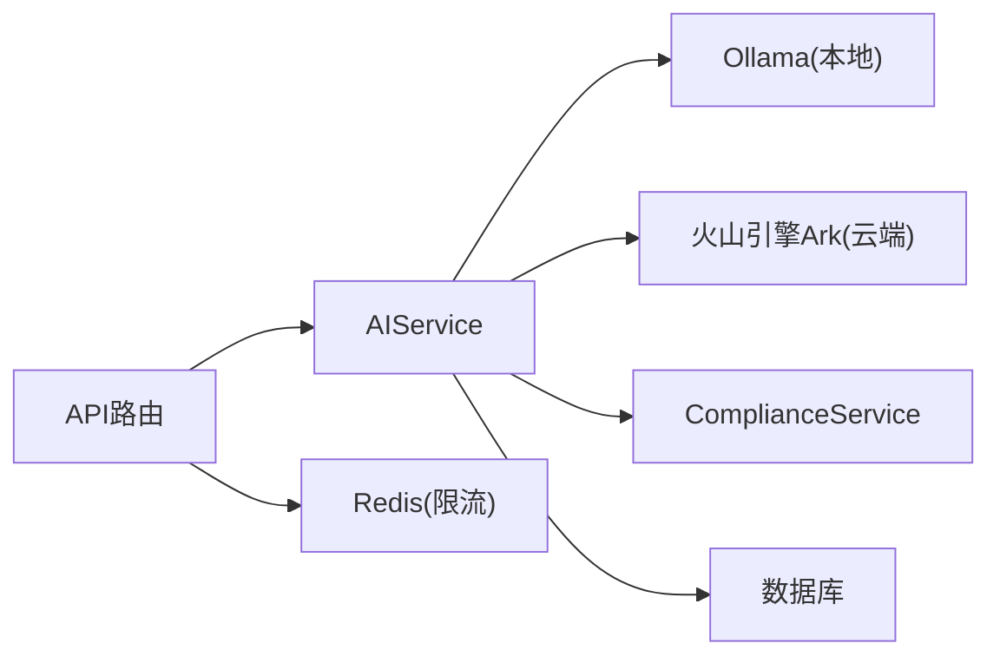

# AI内容改写

<cite>
**本文引用的文件**
- [backend/app/services/ai_service.py](file://backend/app/services/ai_service.py)
- [backend/app/api/endpoints/ai.py](file://backend/app/api/endpoints/ai.py)
- [backend/app/schemas/schemas.py](file://backend/app/schemas/schemas.py)
- [backend/app/core/config.py](file://backend/app/core/config.py)
- [backend/app/services/compliance_service.py](file://backend/app/services/compliance_service.py)
- [backend/app/ai/prompts/rewrite_douyin_v1.txt](file://backend/app/ai/prompts/rewrite_douyin_v1.txt)
- [backend/app/ai/prompts/rewrite_xhs_v1.txt](file://backend/app/ai/prompts/rewrite_xhs_v1.txt)
- [backend/app/rules/local/douyin.yaml](file://backend/app/rules/local/douyin.yaml)
- [backend/app/rules/local/xiaohongshu.yaml](file://backend/app/rules/local/xiaohongshu.yaml)
- [backend/app/rules/local/zhihu.yaml](file://backend/app/rules/local/zhihu.yaml)
- [backend/app/ai/rag/chunker.py](file://backend/app/ai/rag/chunker.py)
- [backend/app/ai/rag/embedder.py](file://backend/app/ai/rag/embedder.py)
- [backend/app/ai/rag/retriever.py](file://backend/app/ai/rag/retriever.py)
- [backend/app/integrations/volcengine/ark_client.py](file://backend/app/integrations/volcengine/ark_client.py)
- [desktop/src/pages/ai-workbench/AIWorkbenchPage.tsx](file://desktop/src/pages/ai-workbench/AIWorkbenchPage.tsx)
- [desktop/src/pages/materials/MaterialsPage.tsx](file://desktop/src/pages/materials/MaterialsPage.tsx)
</cite>

## 目录
1. [简介](#简介)
2. [项目结构](#项目结构)
3. [核心组件](#核心组件)
4. [架构总览](#架构总览)
5. [详细组件分析](#详细组件分析)
6. [依赖分析](#依赖分析)
7. [性能考虑](#性能考虑)
8. [故障排查指南](#故障排查指南)
9. [结论](#结论)
10. [附录](#附录)

## 简介
本技术文档围绕“智获客”的AI内容改写能力展开，重点覆盖多平台内容改写算法的实现原理与工程实践，包括小红书风格改写、抖音短视频脚本生成、知乎专业回答生成等场景。文档从系统架构、Agent工作流、提示工程设计、平台约束、质量控制与合规过滤、输出格式标准化、调用示例与参数配置、到性能优化建议进行全面阐述，帮助研发与产品团队高效理解与扩展该能力。

## 项目结构
后端采用FastAPI + SQLAlchemy架构，AI改写能力主要由服务层封装，前端通过页面发起请求，后端统一接入本地或火山引擎云模型，结合合规服务与洞察上下文进行风格引导与质量控制。

图表来源
- [backend/app/api/endpoints/ai.py:17-103](file://backend/app/api/endpoints/ai.py#L17-L103)
- [backend/app/services/ai_service.py:15-304](file://backend/app/services/ai_service.py#L15-L304)
- [backend/app/services/compliance_service.py:5-113](file://backend/app/services/compliance_service.py#L5-L113)

章节来源
- [backend/app/api/endpoints/ai.py:17-103](file://backend/app/api/endpoints/ai.py#L17-L103)
- [backend/app/services/ai_service.py:15-304](file://backend/app/services/ai_service.py#L15-L304)
- [backend/app/core/config.py:71-85](file://backend/app/core/config.py#L71-L85)

## 核心组件
- AIService：封装LLM调用（本地Ollama或云端火山引擎Ark），支持系统提示词与用户提示词拼接、Ark响应解析与用量统计、图片视觉分析、内容结构抽取、评论回复生成等。
- ComplianceService：提供关键词与模式匹配的合规检测，输出风险等级、评分、风险点与修正建议。
- API路由：提供AI相关接口，包含旧版改写接口的下线提示与新的物料改写入口指引。
- 提示词与规则：平台专用提示词与本地规则文件，支撑风格与合规约束。
- RAG组件：文本切分、向量化、检索占位实现，便于后续接入知识库增强改写质量。
- 前端集成：AI工作台与素材页提供改写触发、结果展示与错误提示。

章节来源
- [backend/app/services/ai_service.py:15-460](file://backend/app/services/ai_service.py#L15-L460)
- [backend/app/services/compliance_service.py:5-113](file://backend/app/services/compliance_service.py#L5-L113)
- [backend/app/api/endpoints/ai.py:17-103](file://backend/app/api/endpoints/ai.py#L17-L103)
- [backend/app/ai/prompts/rewrite_douyin_v1.txt:1-1](file://backend/app/ai/prompts/rewrite_douyin_v1.txt#L1-L1)
- [backend/app/ai/prompts/rewrite_xhs_v1.txt:1-1](file://backend/app/ai/prompts/rewrite_xhs_v1.txt#L1-L1)
- [backend/app/rules/local/douyin.yaml:1-4](file://backend/app/rules/local/douyin.yaml#L1-L4)
- [backend/app/rules/local/xiaohongshu.yaml:1-4](file://backend/app/rules/local/xiaohongshu.yaml#L1-L4)
- [backend/app/rules/local/zhihu.yaml:1-4](file://backend/app/rules/local/zhihu.yaml#L1-L4)
- [backend/app/ai/rag/chunker.py:1-3](file://backend/app/ai/rag/chunker.py#L1-L3)
- [backend/app/ai/rag/embedder.py:1-3](file://backend/app/ai/rag/embedder.py#L1-L3)
- [backend/app/ai/rag/retriever.py:1-3](file://backend/app/ai/rag/retriever.py#L1-L3)
- [desktop/src/pages/ai-workbench/AIWorkbenchPage.tsx:28-72](file://desktop/src/pages/ai-workbench/AIWorkbenchPage.tsx#L28-L72)
- [desktop/src/pages/materials/MaterialsPage.tsx:167-217](file://desktop/src/pages/materials/MaterialsPage.tsx#L167-L217)

## 架构总览
AI改写整体流程：前端选择内容与目标平台，后端构造系统提示词与用户提示词，注入洞察上下文与平台规则，调用LLM生成改写内容，再经合规服务评估，最终返回结果与合规信息。

图表来源
- [backend/app/services/ai_service.py:305-420](file://backend/app/services/ai_service.py#L305-L420)
- [backend/app/services/compliance_service.py:24-71](file://backend/app/services/compliance_service.py#L24-L71)
- [backend/app/api/endpoints/ai.py:36-63](file://backend/app/api/endpoints/ai.py#L36-L63)

## 详细组件分析

### AIService：多平台改写与质量控制
- 多模型适配：支持本地Ollama与火山引擎Ark两种路径，依据配置动态切换；Ark路径包含请求日志与用量统计。
- 平台改写方法：
  - 小红书改写：注入“高互动标题参考”“常用结构”“开头钉子类型”“目标群体痛点”“参考风格”“风险提醒”等洞察上下文，强调口语化、emoji、钩子与引导动作。
  - 抖音脚本改写：强调前3秒钉子、短句节奏、60秒语速、结尾引导动作，限制字数与禁用违规承诺词。
  - 知乎回答改写：强调专业性、逻辑结构、分析过程与风险提醒，避免承诺类词语。
- 图片视觉分析：支持Ark多模态输入，返回结构化答案。
- 内容结构抽取：将输入内容解析为主话题、受众、痛点、结构、钩子、潜在反驳等关键元素。
- 评论回复生成：提供三种自然风格的回复选项，避免销售化与骚扰。

图表来源
- [backend/app/services/ai_service.py:15-460](file://backend/app/services/ai_service.py#L15-L460)
- [backend/app/services/compliance_service.py:5-113](file://backend/app/services/compliance_service.py#L5-L113)

章节来源
- [backend/app/services/ai_service.py:15-460](file://backend/app/services/ai_service.py#L15-L460)
- [backend/app/services/compliance_service.py:5-113](file://backend/app/services/compliance_service.py#L5-L113)

### 提示工程与平台约束
- 系统提示词：为不同平台设定角色定位，确保语气与风格一致。
- 用户提示词：针对平台特性定制要求，如小红书的emoji与引导动作、抖音的节奏与字数限制、知乎的专业性与风险提醒。
- 平台规则文件：以YAML形式定义平台规则，作为改写约束的一部分，未来可扩展为动态加载与版本管理。
- 提示词文件：提供平台级提示词模板，便于统一风格与合规口径。

章节来源
- [backend/app/ai/prompts/rewrite_douyin_v1.txt:1-1](file://backend/app/ai/prompts/rewrite_douyin_v1.txt#L1-L1)
- [backend/app/ai/prompts/rewrite_xhs_v1.txt:1-1](file://backend/app/ai/prompts/rewrite_xhs_v1.txt#L1-L1)
- [backend/app/rules/local/douyin.yaml:1-4](file://backend/app/rules/local/douyin.yaml#L1-L4)
- [backend/app/rules/local/xiaohongshu.yaml:1-4](file://backend/app/rules/local/xiaohongshu.yaml#L1-L4)
- [backend/app/rules/local/zhihu.yaml:1-4](file://backend/app/rules/local/zhihu.yaml#L1-L4)

### 合规与质量控制
- 合规检测：内置敏感词表与正则模式，识别“绝对承诺”“过度自信”“敏感金融术语”等风险点，计算风险评分并给出建议。
- 输出修正：提供关键词替换建议，辅助人工修正。
- Ark调用日志：记录请求ID、场景、耗时、Token用量与错误信息，便于审计与成本分析。

图表来源
- [backend/app/services/compliance_service.py:24-71](file://backend/app/services/compliance_service.py#L24-L71)

章节来源
- [backend/app/services/compliance_service.py:5-113](file://backend/app/services/compliance_service.py#L5-L113)
- [backend/app/services/ai_service.py:269-304](file://backend/app/services/ai_service.py#L269-L304)

### API与前端集成
- 旧版改写接口已下线，提供迁移指引至新接口。
- 前端页面通过AI工作台与素材页触发改写，接收改写结果与合规信息，处理错误提示与状态反馈。

章节来源
- [backend/app/api/endpoints/ai.py:27-33](file://backend/app/api/endpoints/ai.py#L27-L33)
- [desktop/src/pages/ai-workbench/AIWorkbenchPage.tsx:28-72](file://desktop/src/pages/ai-workbench/AIWorkbenchPage.tsx#L28-L72)
- [desktop/src/pages/materials/MaterialsPage.tsx:167-217](file://desktop/src/pages/materials/MaterialsPage.tsx#L167-L217)

## 依赖分析
- 组件耦合：AIService对外暴露统一调用入口，内部依赖模型服务与合规服务；API路由仅负责鉴权与限流，职责清晰。
- 外部依赖：Ollama与火山引擎Ark；Redis用于分布式限流；数据库用于Ark调用日志持久化。
- 规则与提示：平台规则与提示词文件独立于代码，便于灰度与迭代。

图表来源
- [backend/app/api/endpoints/ai.py:18-24](file://backend/app/api/endpoints/ai.py#L18-L24)
- [backend/app/services/ai_service.py:18-22](file://backend/app/services/ai_service.py#L18-L22)
- [backend/app/core/config.py:86-89](file://backend/app/core/config.py#L86-L89)

章节来源
- [backend/app/api/endpoints/ai.py:18-24](file://backend/app/api/endpoints/ai.py#L18-L24)
- [backend/app/services/ai_service.py:18-22](file://backend/app/services/ai_service.py#L18-L22)
- [backend/app/core/config.py:86-89](file://backend/app/core/config.py#L86-L89)

## 性能考虑
- 模型选择：本地Ollama适合低延迟与隐私场景；云端Ark适合更强推理与多模态需求。
- 超时与重试：合理设置超时时间与日志埋点，便于定位慢请求。
- 限流策略：对Ark视觉分析等高成本接口启用分布式限流，避免资源过载。
- 日志与监控：Ark调用日志包含Token用量与时延，可用于成本与性能分析。
- 文本切分与RAG：当前RAG组件为占位实现，建议后续引入分块、嵌入与检索模块，提升知识增强效果。

章节来源
- [backend/app/services/ai_service.py:44-61](file://backend/app/services/ai_service.py#L44-L61)
- [backend/app/services/ai_service.py:132-239](file://backend/app/services/ai_service.py#L132-L239)
- [backend/app/api/endpoints/ai.py:18-24](file://backend/app/api/endpoints/ai.py#L18-L24)
- [backend/app/ai/rag/chunker.py:1-3](file://backend/app/ai/rag/chunker.py#L1-L3)
- [backend/app/ai/rag/embedder.py:1-3](file://backend/app/ai/rag/embedder.py#L1-L3)
- [backend/app/ai/rag/retriever.py:1-3](file://backend/app/ai/rag/retriever.py#L1-L3)

## 故障排查指南
- 模型不可达：检查Ollama地址与模型名，或确认云端Ark密钥与基础URL配置。
- 请求超时：增大超时阈值或优化提示词长度，减少不必要的上下文。
- 合规不通过：根据风险点与建议进行关键词替换与语言调整。
- 限流告警：检查Redis连接与限流窗口配置，必要时扩容限流阈值。
- 日志定位：查看Ark调用日志中的请求ID、场景、耗时与错误信息，快速定位问题。

章节来源
- [backend/app/core/config.py:71-85](file://backend/app/core/config.py#L71-L85)
- [backend/app/services/ai_service.py:132-239](file://backend/app/services/ai_service.py#L132-L239)
- [backend/app/services/compliance_service.py:24-71](file://backend/app/services/compliance_service.py#L24-L71)

## 结论
本方案通过统一的AIService抽象，将多平台改写、合规检测与日志监控整合，形成可扩展、可观测、可治理的AI内容改写体系。平台提示词与规则文件提供了灵活的风格与合规约束，配合洞察上下文实现风格引导与质量控制。建议后续完善RAG与规则引擎，持续优化提示词与风控策略，以提升跨平台一致性与合规稳定性。

## 附录

### 接口与调用示例（路径指引）
- 旧版改写接口已下线，迁移指引见：
  - [backend/app/api/endpoints/ai.py:27-33](file://backend/app/api/endpoints/ai.py#L27-L33)
- 小红书改写（POST）：
  - [backend/app/api/endpoints/ai.py:36-43](file://backend/app/api/endpoints/ai.py#L36-L43)
- 抖音改写（POST）：
  - [backend/app/api/endpoints/ai.py:46-53](file://backend/app/api/endpoints/ai.py#L46-L53)
- 知乎改写（POST）：
  - [backend/app/api/endpoints/ai.py:56-63](file://backend/app/api/endpoints/ai.py#L56-L63)
- 图片视觉分析（POST）：
  - [backend/app/api/endpoints/ai.py:87-103](file://backend/app/api/endpoints/ai.py#L87-L103)

### 参数与配置
- AIService调用参数：
  - [backend/app/services/ai_service.py:24-37](file://backend/app/services/ai_service.py#L24-L37)
- 平台改写请求体（AIRewriteRequest）：
  - [backend/app/schemas/schemas.py:111-120](file://backend/app/schemas/schemas.py#L111-L120)
- 配置项（模型、Ark、限流、Redis等）：
  - [backend/app/core/config.py:71-89](file://backend/app/core/config.py#L71-L89)

### 输出与合规字段
- 改写响应（AIRewriteResponse）：
  - [backend/app/schemas/schemas.py:122-134](file://backend/app/schemas/schemas.py#L122-L134)
- 合规检查（ComplianceCheckResponse）：
  - [backend/app/schemas/schemas.py:150-161](file://backend/app/schemas/schemas.py#L150-L161)

### 前端调用示例（路径指引）
- AI工作台改写触发：
  - [desktop/src/pages/ai-workbench/AIWorkbenchPage.tsx:39-57](file://desktop/src/pages/ai-workbench/AIWorkbenchPage.tsx#L39-L57)
- 素材页改写结果回填：
  - [desktop/src/pages/materials/MaterialsPage.tsx:167-182](file://desktop/src/pages/materials/MaterialsPage.tsx#L167-L182)