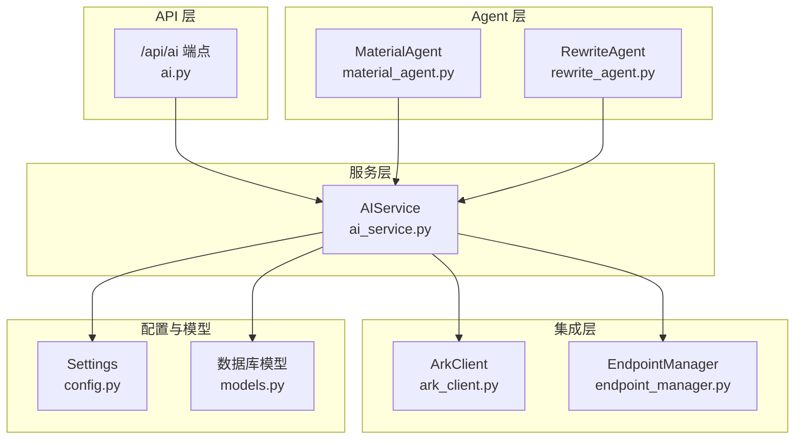
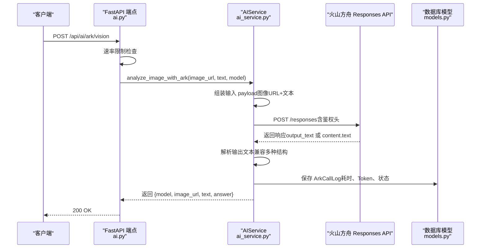
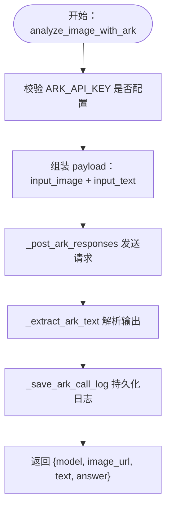
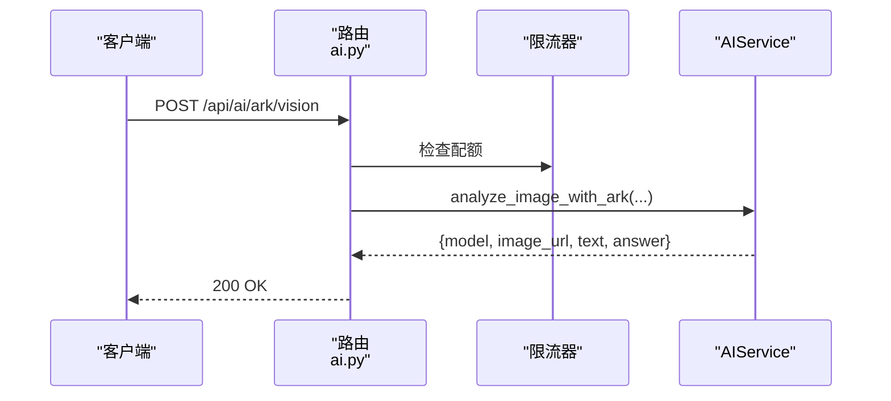
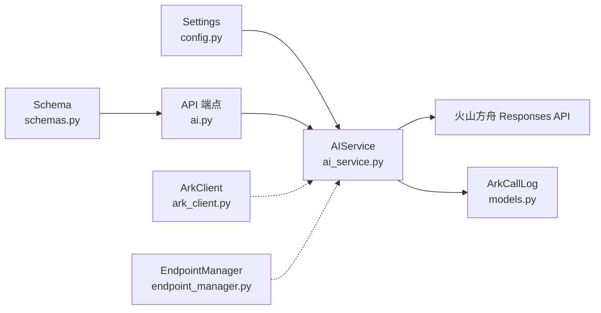

# 多模态AI集成

<cite>
**本文引用的文件**
- [backend/app/services/ai_service.py](file://backend/app/services/ai_service.py)
- [backend/app/api/endpoints/ai.py](file://backend/app/api/endpoints/ai.py)
- [backend/app/schemas/schemas.py](file://backend/app/schemas/schemas.py)
- [backend/app/core/config.py](file://backend/app/core/config.py)
- [backend/app/models/models.py](file://backend/app/models/models.py)
- [backend/app/integrations/volcengine/ark_client.py](file://backend/app/integrations/volcengine/ark_client.py)
- [backend/app/integrations/volcengine/endpoint_manager.py](file://backend/app/integrations/volcengine/endpoint_manager.py)
- [backend/app/ai/agents/material_agent.py](file://backend/app/ai/agents/material_agent.py)
- [backend/app/ai/agents/rewrite_agent.py](file://backend/app/ai/agents/rewrite_agent.py)
</cite>

## 目录
1. [引言](#引言)
2. [项目结构](#项目结构)
3. [核心组件](#核心组件)
4. [架构总览](#架构总览)
5. [详细组件分析](#详细组件分析)
6. [依赖关系分析](#依赖关系分析)
7. [性能考量](#性能考量)
8. [故障排查指南](#故障排查指南)
9. [结论](#结论)
10. [附录](#附录)

## 引言
本技术文档围绕“智获客”的多模态AI集成功能展开，重点解释图像内容分析与文本描述的结合处理、视觉内容理解、文本上下文关联与多模态推理机制。文档详细说明火山方舟多模态 Responses API 的调用流程（图像URL处理、文本提示工程与输出结果解析），并阐述多模态内容改写的实现策略（视觉元素描述、文本风格转换与跨模态一致性保证）。最后给出图像分析在内容创作中的典型应用场景（产品展示、场景描述与视觉引导）以及多模态调用示例、参数配置与效果验证方法。

## 项目结构
后端采用 FastAPI + SQLAlchemy 架构，多模态能力通过 AIService 封装火山方舟 Responses API，并在 API 层暴露 /api/ai/ark/vision 接口。配置项集中于 Settings，模型与持久化日志由数据库模型支持。集成层包含火山引擎客户端与端点管理器，Agent 层提供物料与改写代理的扩展入口。

图表来源
- [backend/app/api/endpoints/ai.py:87-103](file://backend/app/api/endpoints/ai.py#L87-L103)
- [backend/app/services/ai_service.py:15-304](file://backend/app/services/ai_service.py#L15-L304)
- [backend/app/integrations/volcengine/ark_client.py:1-4](file://backend/app/integrations/volcengine/ark_client.py#L1-L4)
- [backend/app/integrations/volcengine/endpoint_manager.py:1-3](file://backend/app/integrations/volcengine/endpoint_manager.py#L1-L3)
- [backend/app/core/config.py:71-84](file://backend/app/core/config.py#L71-L84)
- [backend/app/models/models.py:269-304](file://backend/app/models/models.py#L269-L304)
- [backend/app/ai/agents/material_agent.py:1-3](file://backend/app/ai/agents/material_agent.py#L1-L3)
- [backend/app/ai/agents/rewrite_agent.py:1-3](file://backend/app/ai/agents/rewrite_agent.py#L1-L3)

章节来源
- [backend/app/api/endpoints/ai.py:1-103](file://backend/app/api/endpoints/ai.py#L1-L103)
- [backend/app/services/ai_service.py:15-304](file://backend/app/services/ai_service.py#L15-L304)
- [backend/app/core/config.py:71-84](file://backend/app/core/config.py#L71-L84)
- [backend/app/models/models.py:269-304](file://backend/app/models/models.py#L269-L304)

## 核心组件
- AIService：封装多模态与文本生成调用，负责火山方舟 Responses API 请求构建、鉴权、超时控制、错误处理与调用日志持久化。
- API 端点 /api/ai/ark/vision：对外暴露图像+文本多模态分析接口，内置速率限制。
- Schema：定义 ArkVisionRequest/Response 数据契约，确保请求与响应结构一致。
- Settings：集中管理火山方舟 API Key、基础地址、模型、超时与速率限制等配置。
- 数据库模型：ArkCallLog 用于记录每次 Ark 调用的耗时、Token 使用与错误信息。
- Agent 层：预留物料与改写代理扩展点，便于后续接入多模态内容改写工作流。

章节来源
- [backend/app/services/ai_service.py:15-304](file://backend/app/services/ai_service.py#L15-L304)
- [backend/app/api/endpoints/ai.py:87-103](file://backend/app/api/endpoints/ai.py#L87-L103)
- [backend/app/schemas/schemas.py:136-147](file://backend/app/schemas/schemas.py#L136-L147)
- [backend/app/core/config.py:71-84](file://backend/app/core/config.py#L71-L84)
- [backend/app/models/models.py:269-304](file://backend/app/models/models.py#L269-L304)
- [backend/app/ai/agents/material_agent.py:1-3](file://backend/app/ai/agents/material_agent.py#L1-L3)
- [backend/app/ai/agents/rewrite_agent.py:1-3](file://backend/app/ai/agents/rewrite_agent.py#L1-L3)

## 架构总览
多模态调用链路从 API 端点进入，经 AIService 组装火山方舟 Responses 请求，发送至火山方舟服务，解析响应并提取文本，同时记录调用日志。速率限制与鉴权贯穿整个链路。

图表来源
- [backend/app/api/endpoints/ai.py:87-103](file://backend/app/api/endpoints/ai.py#L87-L103)
- [backend/app/services/ai_service.py:93-131](file://backend/app/services/ai_service.py#L93-L131)
- [backend/app/models/models.py:269-304](file://backend/app/models/models.py#L269-L304)

## 详细组件分析

### AIService：多模态与文本生成服务
- 多模态分析入口：analyze_image_with_ark
  - 输入：image_url、text、model（可选）、user_id
  - 构建 payload：包含 input_image 与 input_text 两类内容
  - 调用 _post_ark_responses 发送请求，设置 Authorization 与 Content-Type
  - 解析输出：_extract_ark_text 兼容 output_text 与 content[].text 等结构
  - 输出：标准化字典 {model, image_url, text, answer}
- 文本生成入口：call_llm
  - 支持本地 Ollama 与云端火山方舟（Ark）双通道
  - 场景参数 scene 用于限流与统计
- 错误处理与日志：_post_ark_responses 捕获 HTTPStatusError 与通用异常，统一记录 ArkCallLog
- Token 统计：_extract_ark_usage 提取 input_tokens、output_tokens、total_tokens

图表来源
- [backend/app/services/ai_service.py:93-131](file://backend/app/services/ai_service.py#L93-L131)
- [backend/app/services/ai_service.py:132-240](file://backend/app/services/ai_service.py#L132-L240)
- [backend/app/services/ai_service.py:241-267](file://backend/app/services/ai_service.py#L241-L267)
- [backend/app/services/ai_service.py:269-304](file://backend/app/services/ai_service.py#L269-L304)

章节来源
- [backend/app/services/ai_service.py:93-131](file://backend/app/services/ai_service.py#L93-L131)
- [backend/app/services/ai_service.py:132-240](file://backend/app/services/ai_service.py#L132-L240)
- [backend/app/services/ai_service.py:241-267](file://backend/app/services/ai_service.py#L241-L267)
- [backend/app/services/ai_service.py:269-304](file://backend/app/services/ai_service.py#L269-L304)

### API 端点：/api/ai/ark/vision
- 速率限制：基于 Redis 的分布式限流，每分钟配额与窗口可配置
- 权限校验：依赖 verify_token 获取当前用户
- 调用 AIService.analyze_image_with_ark，传入 image_url、text、model 与 user_id
- 返回 ArkVisionResponse

图表来源
- [backend/app/api/endpoints/ai.py:87-103](file://backend/app/api/endpoints/ai.py#L87-L103)

章节来源
- [backend/app/api/endpoints/ai.py:87-103](file://backend/app/api/endpoints/ai.py#L87-L103)

### Schema：ArkVisionRequest/Response
- ArkVisionRequest：image_url（必填）、text（默认提示）、model（可选）
- ArkVisionResponse：model、image_url、text、answer

章节来源
- [backend/app/schemas/schemas.py:136-147](file://backend/app/schemas/schemas.py#L136-L147)

### 配置：Settings（火山方舟相关）
- ARK_API_KEY：鉴权密钥
- ARK_BASE_URL：火山方舟 API 基础地址
- ARK_MODEL：默认模型名称
- ARK_TIMEOUT_SECONDS：请求超时秒数
- ARK_VISION_RATE_LIMIT_PER_MINUTE / WINDOW_SECONDS：图像多模态分析速率限制
- USE_REDIS_RATE_LIMIT / REDIS_URL / RATE_LIMIT_KEY_PREFIX：限流开关与 Redis 连接

章节来源
- [backend/app/core/config.py:71-84](file://backend/app/core/config.py#L71-L84)

### 数据模型：ArkCallLog
- 记录字段：user_id、scene、provider、model、endpoint、success、status_code、latency_ms、tokens、error_message
- 作用：审计与监控火山方舟调用质量

章节来源
- [backend/app/models/models.py:269-304](file://backend/app/models/models.py#L269-L304)

### Agent 层：物料与改写代理
- material_agent.py / rewrite_agent.py：当前为占位实现，后续可用于接入多模态内容改写与物料治理工作流

章节来源
- [backend/app/ai/agents/material_agent.py:1-3](file://backend/app/ai/agents/material_agent.py#L1-L3)
- [backend/app/ai/agents/rewrite_agent.py:1-3](file://backend/app/ai/agents/rewrite_agent.py#L1-L3)

## 依赖关系分析
- AIService 依赖 Settings（配置）、httpx（HTTP 客户端）、数据库会话（持久化日志）
- API 端点依赖 AIService、Schema、DistributedRateLimiter
- 集成层 ArkClient 与 EndpointManager 当前为轻量占位，便于未来扩展
- Agent 层与 AIService 解耦，便于独立演进

图表来源
- [backend/app/core/config.py:71-84](file://backend/app/core/config.py#L71-L84)
- [backend/app/schemas/schemas.py:136-147](file://backend/app/schemas/schemas.py#L136-L147)
- [backend/app/api/endpoints/ai.py:87-103](file://backend/app/api/endpoints/ai.py#L87-L103)
- [backend/app/services/ai_service.py:15-304](file://backend/app/services/ai_service.py#L15-L304)
- [backend/app/models/models.py:269-304](file://backend/app/models/models.py#L269-L304)
- [backend/app/integrations/volcengine/ark_client.py:1-4](file://backend/app/integrations/volcengine/ark_client.py#L1-L4)
- [backend/app/integrations/volcengine/endpoint_manager.py:1-3](file://backend/app/integrations/volcengine/endpoint_manager.py#L1-L3)

章节来源
- [backend/app/services/ai_service.py:15-304](file://backend/app/services/ai_service.py#L15-L304)
- [backend/app/api/endpoints/ai.py:87-103](file://backend/app/api/endpoints/ai.py#L87-L103)
- [backend/app/core/config.py:71-84](file://backend/app/core/config.py#L71-L84)
- [backend/app/models/models.py:269-304](file://backend/app/models/models.py#L269-L304)

## 性能考量
- 超时控制：ARK_TIMEOUT_SECONDS 控制单次请求最长等待时间，避免阻塞
- 速率限制：ARK_VISION_RATE_LIMIT_PER_MINUTE 与窗口参数限制高频调用
- 日志与监控：ArkCallLog 记录延迟与 Token 使用，便于容量规划与成本优化
- 重试与降级：当前未实现自动重试，建议在上层业务或网关层增加指数退避重试策略

## 故障排查指南
- 配置缺失
  - 现象：抛出“未配置 ARK_API_KEY”
  - 处理：在 .env 中补齐 ARK_API_KEY、ARN_BASE_URL、ARN_MODEL
- 请求失败
  - 现象：HTTPStatusError 或通用异常，ArkCallLog 中 error_message 记录详情
  - 处理：检查网络连通性、鉴权头是否正确、请求体格式是否符合 Responses API 规范
- 输出为空或非预期
  - 现象：_extract_ark_text 无法解析，回退为 JSON 字符串
  - 处理：确认 Responses API 返回结构，必要时调整系统提示词以引导稳定输出
- 限流触发
  - 现象：429 Too Many Requests
  - 处理：降低调用频率或提升配额，或在客户端实现退避重试

章节来源
- [backend/app/services/ai_service.py:71-72](file://backend/app/services/ai_service.py#L71-L72)
- [backend/app/services/ai_service.py:191-239](file://backend/app/services/ai_service.py#L191-L239)
- [backend/app/services/ai_service.py:241-259](file://backend/app/services/ai_service.py#L241-L259)
- [backend/app/api/endpoints/ai.py:18-24](file://backend/app/api/endpoints/ai.py#L18-L24)

## 结论
本项目通过 AIService 将火山方舟 Responses API 与 FastAPI 端点解耦，实现了图像+文本的多模态分析能力，并配套速率限制与调用日志，满足内容创作与合规审核的多模态需求。Agent 层与模型层预留扩展点，便于后续接入更复杂的多模态改写与内容治理工作流。

## 附录

### 多模态调用示例（步骤说明）
- 步骤 1：准备图像 URL 与文本提示
  - 图像 URL：可为公网可访问链接
  - 文本提示：例如“你看到了什么？”或针对业务场景的引导式问题
- 步骤 2：构造请求体
  - ArkVisionRequest：image_url、text、model（可选）
- 步骤 3：调用 /api/ai/ark/vision
  - 方法：POST
  - 头部：Authorization 与 Content-Type（由服务端自动设置）
  - 响应：ArkVisionResponse，包含 answer
- 步骤 4：解析与应用
  - 将 answer 作为视觉内容理解的结果，结合业务规则进行二次加工或改写

章节来源
- [backend/app/api/endpoints/ai.py:87-103](file://backend/app/api/endpoints/ai.py#L87-L103)
- [backend/app/schemas/schemas.py:136-147](file://backend/app/schemas/schemas.py#L136-L147)
- [backend/app/services/ai_service.py:93-131](file://backend/app/services/ai_service.py#L93-L131)

### 参数配置清单
- 必填项
  - ARK_API_KEY：火山方舟鉴权密钥
  - ARK_BASE_URL：火山方舟 API 基础地址
  - ARK_MODEL：模型名称
- 可选项
  - ARK_TIMEOUT_SECONDS：请求超时秒数
  - ARK_VISION_RATE_LIMIT_PER_MINUTE / ARK_VISION_RATE_LIMIT_WINDOW_SECONDS：图像多模态分析速率限制
  - USE_REDIS_RATE_LIMIT / REDIS_URL / RATE_LIMIT_KEY_PREFIX：限流开关与 Redis 连接

章节来源
- [backend/app/core/config.py:71-84](file://backend/app/core/config.py#L71-L84)

### 效果验证方法
- 成功路径
  - 响应码：200
  - 字段：answer 应为可读文本，answer 非空
- 失败路径
  - 响应码：4xx/5xx
  - 日志：ArkCallLog 中记录 error_message、status_code、latency_ms
- 成本与性能
  - 观察 ArkCallLog 中 total_tokens 与 latency_ms，评估模型与提示词优化空间

章节来源
- [backend/app/services/ai_service.py:163-189](file://backend/app/services/ai_service.py#L163-L189)
- [backend/app/services/ai_service.py:191-239](file://backend/app/services/ai_service.py#L191-L239)
- [backend/app/models/models.py:269-304](file://backend/app/models/models.py#L269-L304)