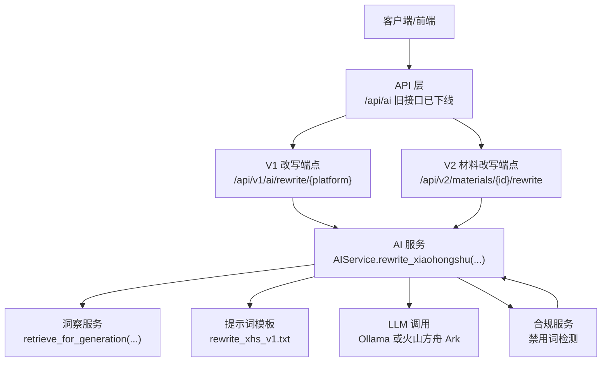
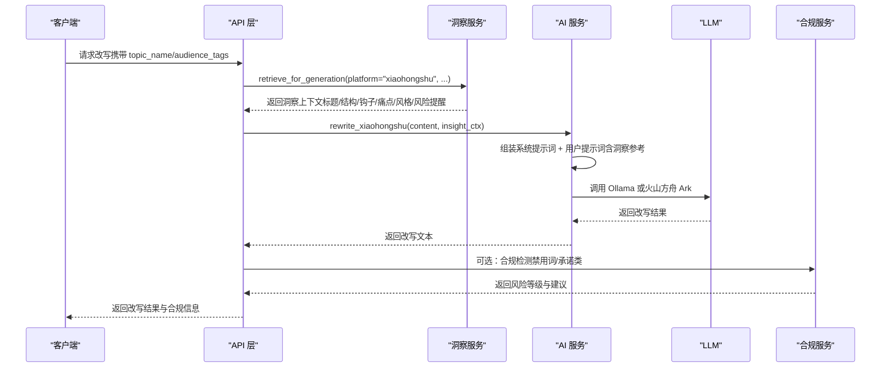
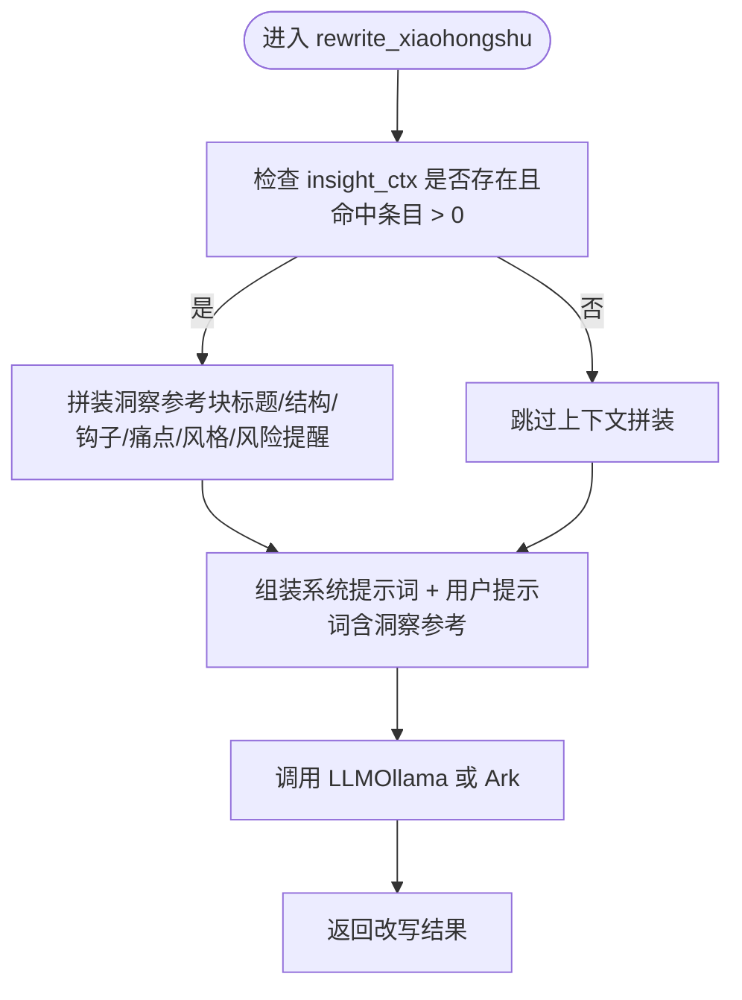
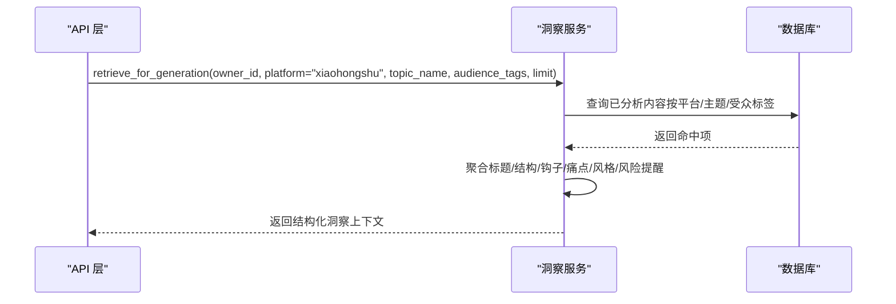
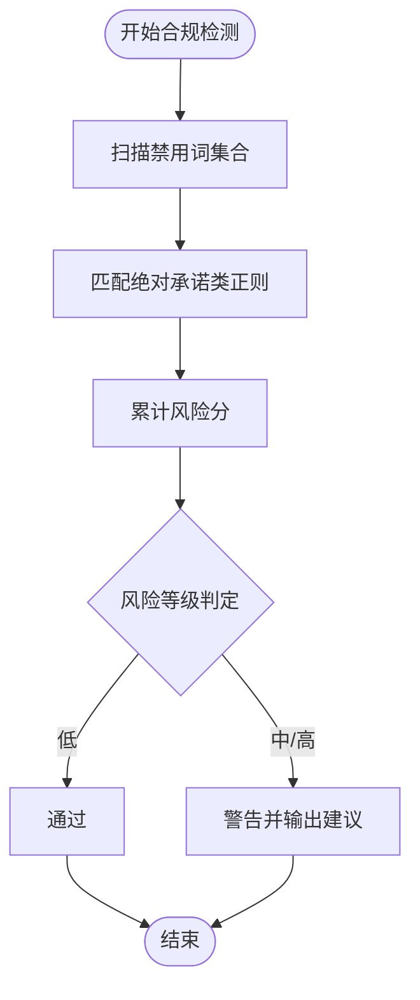
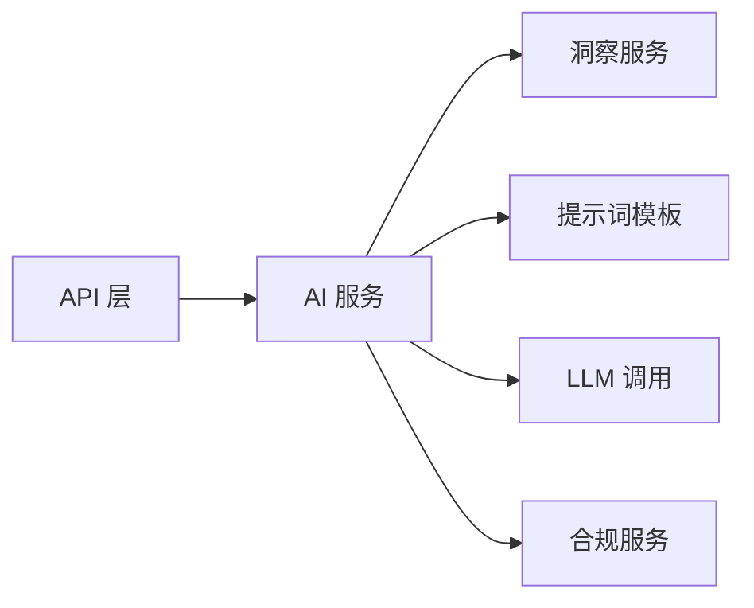

# 小红书风格改写

<cite>
**本文引用的文件**
- [backend/app/services/ai_service.py](file://backend/app/services/ai_service.py)
- [backend/app/api/endpoints/ai.py](file://backend/app/api/endpoints/ai.py)
- [backend/app/services/insight_service.py](file://backend/app/services/insight_service.py)
- [backend/app/services/compliance_service.py](file://backend/app/services/compliance_service.py)
- [backend/app/schemas/schemas.py](file://backend/app/schemas/schemas.py)
- [backend/app/rule/local/xiaohongshu.yaml](file://backend/app/rules/local/xiaohongshu.yaml)
- [backend/app/ai/prompts/rewrite_xhs_v1.txt](file://backend/app/ai/prompts/rewrite_xhs_v1.txt)
- [backend/app/ai/prompts/rewrite_douyin_v1.txt](file://backend/app/ai/prompts/rewrite_douyin_v1.txt)
- [backend/变更说明_2026-03-23_洞察中心与改写联动.md](file://backend/变更说明_2026-03-23_洞察中心与改写联动.md)
</cite>

## 目录
1. [简介](#简介)
2. [项目结构](#项目结构)
3. [核心组件](#核心组件)
4. [架构总览](#架构总览)
5. [详细组件分析](#详细组件分析)
6. [依赖关系分析](#依赖关系分析)
7. [性能考量](#性能考量)
8. [故障排查指南](#故障排查指南)
9. [结论](#结论)
10. [附录](#附录)

## 简介
本技术文档聚焦“小红书风格改写”能力，系统阐述其算法实现与工程实践，包括：
- 口语化表达转换策略
- Emoji 使用策略
- 钩子开头设计原则
- 洞察上下文集成（高互动标题参考、常用结构模板、开头钩子类型、目标群体痛点分析、风险提醒）
- 平台合规与禁用词过滤机制
- 改写质量评估标准（字数、情感、互动引导）
- 调用示例、参数配置与改写效果对比分析

## 项目结构
围绕小红书改写的核心代码分布在以下模块：
- 服务层：AI 服务封装 LLM 调用、改写流程与提示词拼装
- API 层：对外暴露改写端点（已迁移至新路由）
- 洞察服务：内容采集、清洗、AI 分析、主题聚类与检索召回
- 合规服务：禁用词检测与风险评分
- 规则与提示词：平台规则与改写提示词
- 数据模型：请求/响应结构定义

图表来源
- [backend/app/api/endpoints/ai.py:36-63](file://backend/app/api/endpoints/ai.py#L36-L63)
- [backend/app/services/ai_service.py:305-347](file://backend/app/services/ai_service.py#L305-L347)
- [backend/app/services/insight_service.py:554-638](file://backend/app/services/insight_service.py#L554-L638)
- [backend/app/ai/prompts/rewrite_xhs_v1.txt:1-1](file://backend/app/ai/prompts/rewrite_xhs_v1.txt#L1-L1)

章节来源
- [backend/app/api/endpoints/ai.py:1-103](file://backend/app/api/endpoints/ai.py#L1-L103)
- [backend/app/services/ai_service.py:1-460](file://backend/app/services/ai_service.py#L1-L460)
- [backend/app/services/insight_service.py:1-659](file://backend/app/services/insight_service.py#L1-L659)

## 核心组件
- AIService.rewrite_xiaohongshu：面向小红书的改写入口，支持注入洞察上下文，拼装系统提示词与用户提示词，并调用 LLM 生成内容。
- InsightService.retrieve_for_generation：基于主题与受众标签检索高互动内容，抽取标题、结构、钩子、痛点、风格与风险提醒，形成结构化参考。
- ComplianceService：提供禁用词检测与风险评分，辅助改写后的内容合规校验。
- API 层：提供旧版改写端点（已下线），并指引迁移至新端点；新端点由材料服务或工作台服务调用 AIService 完成改写。

章节来源
- [backend/app/services/ai_service.py:305-347](file://backend/app/services/ai_service.py#L305-L347)
- [backend/app/services/insight_service.py:554-638](file://backend/app/services/insight_service.py#L554-L638)
- [backend/app/services/compliance_service.py:1-113](file://backend/app/services/compliance_service.py#L1-L113)
- [backend/app/api/endpoints/ai.py:36-63](file://backend/app/api/endpoints/ai.py#L36-L63)

## 架构总览
小红书改写采用“提示词驱动 + 上下文检索 + LLM 生成 + 合规校验”的流水线式架构。洞察服务负责提供风格与结构参考，AI 服务负责组织提示词并调用模型，合规服务在生成后进行关键词与承诺类风险检测。

图表来源
- [backend/app/api/endpoints/ai.py:121-135](file://backend/app/api/endpoints/ai.py#L121-L135)
- [backend/app/services/insight_service.py:554-638](file://backend/app/services/insight_service.py#L554-L638)
- [backend/app/services/ai_service.py:305-347](file://backend/app/services/ai_service.py#L305-L347)
- [backend/app/services/compliance_service.py:24-71](file://backend/app/services/compliance_service.py#L24-L71)

## 详细组件分析

### AIService.rewrite_xiaohongshu 实现要点
- 系统提示词：强调“小红书专业运营创作者，擅长贷款/金融业务内容创作”，确保角色设定与风格一致。
- 上下文注入：当洞察上下文存在且命中条目数大于零时，自动拼装“高互动标题参考”“常用结构”“开头钉子类型”“目标群体直击痛点”“参考风格”“风险提醒”等参考块。
- 用户提示词：包含改写要求（口语化、适当 emoji、开头吸睛、结尾引导、字数限制、禁用词等），并以“原始内容”作为输入主体。
- LLM 调用：优先使用云模型（火山方舟 Ark），否则回退本地 Ollama；调用时附带场景标识，便于日志与用量追踪。
- 返回：改写后的文本。

图表来源
- [backend/app/services/ai_service.py:305-347](file://backend/app/services/ai_service.py#L305-L347)

章节来源
- [backend/app/services/ai_service.py:305-347](file://backend/app/services/ai_service.py#L305-L347)

### 洞察上下文集成
- 检索维度：基于主题名与受众标签，优先按平台与主题过滤，其次放宽至全量已分析内容。
- 输出字段：高互动标题示例、常用结构模板、开头钩子类型、CTA 类型、目标群体痛点、风格汇总、风险提醒、命中条目数。
- 使用策略：仅抽取结构化结论，不返回原文，避免直接抄袭；并在提示词中明确“仅供学习风格，不要复制原文”。

图表来源
- [backend/app/services/insight_service.py:554-638](file://backend/app/services/insight_service.py#L554-L638)

章节来源
- [backend/app/services/insight_service.py:554-638](file://backend/app/services/insight_service.py#L554-L638)

### 合规与禁用词过滤
- 禁用词集合：包含“绝对承诺/过度自信/敏感金融术语”等类别，用于识别高风险表达。
- 检测逻辑：逐项扫描禁用词，匹配绝对承诺类正则，累计风险分，划分风险等级（低/中/高）。
- 建议输出：针对每类风险给出替换建议与修改方向；最终输出是否合规与改进建议列表。

图表来源
- [backend/app/services/compliance_service.py:24-94](file://backend/app/services/compliance_service.py#L24-L94)

章节来源
- [backend/app/services/compliance_service.py:1-113](file://backend/app/services/compliance_service.py#L1-L113)

### 平台规则与提示词
- 平台规则：小红书规则文件定义平台与版本信息，当前为空规则集，后续可扩展平台特定约束。
- 提示词模板：小红书改写提示词强调“自然、真实、合规”的种草文案风格；抖音改写提示词强调“短句节奏强、易读、合规”的口播风格。

章节来源
- [backend/app/rule/local/xiaohongshu.yaml:1-4](file://backend/app/rules/local/xiaohongshu.yaml#L1-L4)
- [backend/app/ai/prompts/rewrite_xhs_v1.txt:1-1](file://backend/app/ai/prompts/rewrite_xhs_v1.txt#L1-L1)
- [backend/app/ai/prompts/rewrite_douyin_v1.txt:1-1](file://backend/app/ai/prompts/rewrite_douyin_v1.txt#L1-L1)

### 调用示例与参数配置
- 接口迁移：旧版 /api/ai/rewrite/* 已下线，迁移指引指向 /api/v2/materials/{id}/rewrite 或 /api/v1/ai/rewrite/{platform}。
- 请求体关键字段：
  - content_id：源内容 ID
  - target_platform：目标平台（如 xiaohongshu）
  - content_type：内容类型（如 post）
  - style：风格（如 casual）
  - marketing_strength：营销强度（low/medium/high）
  - target_audience：目标受众
  - topic_name：关联洞察主题名（用于检索洞察上下文）
  - audience_tags：受众标签数组（用于检索洞察上下文）

章节来源
- [backend/app/api/endpoints/ai.py:27-33](file://backend/app/api/endpoints/ai.py#L27-L33)
- [backend/app/schemas/schemas.py:111-120](file://backend/app/schemas/schemas.py#L111-L120)

### 改写质量评估标准
- 字数控制：小红书改写要求不超过 1000 字；抖音口播脚本不超过 300 字（60 秒语速）。
- 情感表达：通过“自然口语风”“适当加入 emoji”提升可读性与亲和力。
- 互动引导：要求结尾带有明确引导动作（评论/收藏/点赞），增强用户参与。
- 合规性：禁止使用“一定放款”“100% 下款”等违规承诺类表达；结合合规服务进行风险评分与建议。

章节来源
- [backend/app/services/ai_service.py:339-345](file://backend/app/services/ai_service.py#L339-L345)
- [backend/app/services/compliance_service.py:24-71](file://backend/app/services/compliance_service.py#L24-L71)

### 改写效果对比分析
- 同一原始内容在不同平台的风格差异：
  - 小红书：强调“个人分享调调”“开头吸睛”“结尾引导”，适合图文笔记风格。
  - 抖音：强调“短句节奏强”“3 秒内钉子”“口播化”，适合短视频脚本风格。
- 洞察上下文对风格一致性的影响：当提供“高互动标题参考”“常用结构模板”“痛点直击”等上下文时，改写结果更贴近高互动内容的风格与结构，有助于提升相似度与可复用性。

章节来源
- [backend/app/services/ai_service.py:348-384](file://backend/app/services/ai_service.py#L348-L384)
- [backend/app/services/insight_service.py:554-638](file://backend/app/services/insight_service.py#L554-L638)

## 依赖关系分析
- AIService 依赖 InsightService 提供的结构化参考，以及提示词模板与 LLM 能力。
- API 层不再直接处理改写逻辑，仅负责路由与限流；改写由 AIService 执行。
- 合规服务独立于改写流程，可在生成后进行二次校验。

图表来源
- [backend/app/api/endpoints/ai.py:1-103](file://backend/app/api/endpoints/ai.py#L1-L103)
- [backend/app/services/ai_service.py:1-460](file://backend/app/services/ai_service.py#L1-L460)
- [backend/app/services/insight_service.py:1-659](file://backend/app/services/insight_service.py#L1-L659)
- [backend/app/services/compliance_service.py:1-113](file://backend/app/services/compliance_service.py#L1-L113)

章节来源
- [backend/app/api/endpoints/ai.py:1-103](file://backend/app/api/endpoints/ai.py#L1-L103)
- [backend/app/services/ai_service.py:1-460](file://backend/app/services/ai_service.py#L1-L460)
- [backend/app/services/insight_service.py:1-659](file://backend/app/services/insight_service.py#L1-L659)
- [backend/app/services/compliance_service.py:1-113](file://backend/app/services/compliance_service.py#L1-L113)

## 性能考量
- LLM 调用超时与重试：Ollama 与火山方舟 Ark 的调用均设置合理超时时间，异常路径记录调用日志与用量，便于定位性能瓶颈。
- 限流与并发：图像视觉分析端点具备分布式限流，避免突发流量冲击。
- 上下文规模控制：洞察上下文按上限截断（标题/结构/钩子/痛点等），减少提示词长度，提高生成稳定性与速度。

章节来源
- [backend/app/services/ai_service.py:39-61](file://backend/app/services/ai_service.py#L39-L61)
- [backend/app/api/endpoints/ai.py:18-24](file://backend/app/api/endpoints/ai.py#L18-L24)

## 故障排查指南
- 旧接口已下线：若调用 /api/ai/rewrite/*，将收到 410 错误并提示迁移路径。
- LLM 调用失败：检查 Ollama 或火山方舟 Ark 的配置与网络连通性；查看 Ark 调用日志与用量记录。
- 合规不通过：根据合规服务返回的风险点与建议进行修改，优先替换绝对承诺类表达与敏感金融术语。
- 洞察上下文无效：确认 topic_name 与 audience_tags 是否正确传入，检查洞察服务检索逻辑与命中数量。

章节来源
- [backend/app/api/endpoints/ai.py:27-33](file://backend/app/api/endpoints/ai.py#L27-L33)
- [backend/app/services/ai_service.py:132-239](file://backend/app/services/ai_service.py#L132-L239)
- [backend/app/services/compliance_service.py:24-94](file://backend/app/services/compliance_service.py#L24-L94)
- [backend/app/services/insight_service.py:554-638](file://backend/app/services/insight_service.py#L554-L638)

## 结论
小红书风格改写通过“提示词 + 洞察上下文 + LLM 生成 + 合规校验”的闭环，实现了风格化、合规化与高互动性的内容生产。洞察服务提供的高互动标题、结构模板、钩子类型与痛点分析，显著提升了改写的一致性与可复用性；合规服务保障内容在金融类敏感领域的安全表达。建议在实际使用中结合主题与受众标签，动态选择洞察上下文，并在生成后进行合规校验与人工审核。

## 附录
- 迁移指引：旧版 /api/ai/rewrite/* 已下线，请迁移至 /api/v2/materials/{id}/rewrite 或 /api/v1/ai/rewrite/{platform}。
- 变更说明：详见“洞察中心与改写联动”文档，其中明确了请求体字段扩展、提示词中文化与洞察上下文注入策略。

章节来源
- [backend/app/api/endpoints/ai.py:27-33](file://backend/app/api/endpoints/ai.py#L27-L33)
- [backend/变更说明_2026-03-23_洞察中心与改写联动.md:98-147](file://backend/变更说明_2026-03-23_洞察中心与改写联动.md#L98-L147)