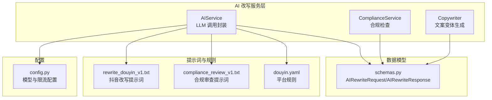
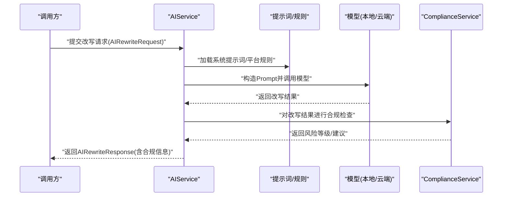
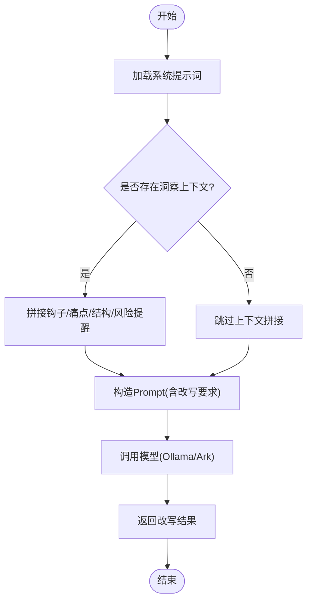
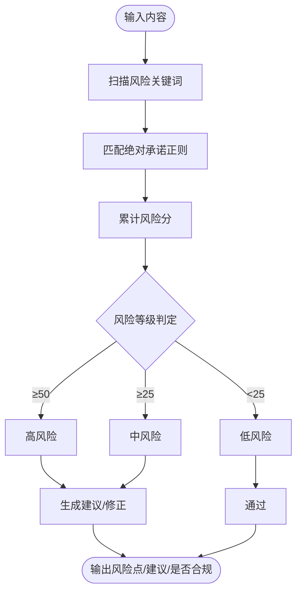
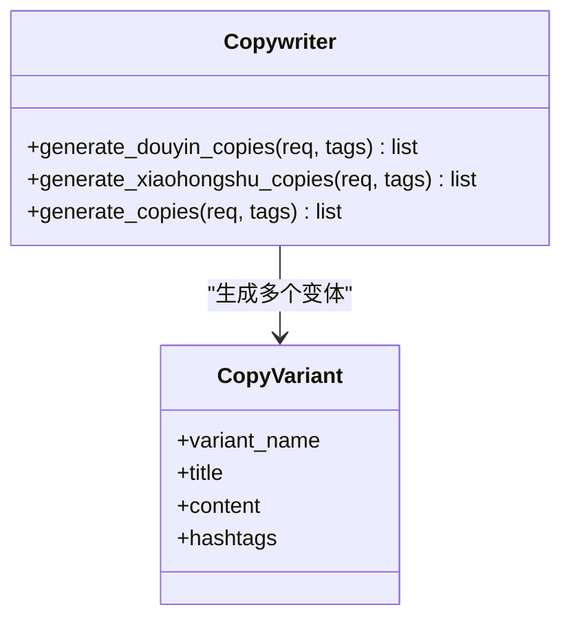
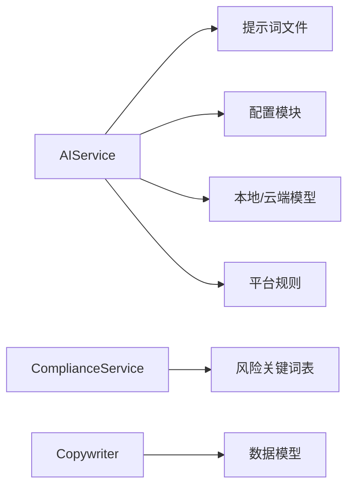

# 抖音短视频脚本改写

<cite>
**本文引用的文件**   
- [backend/app/ai/prompts/rewrite_douyin_v1.txt](file://backend/app/ai/prompts/rewrite_douyin_v1.txt)
- [backend/app/ai/prompts/compliance_review_v1.txt](file://backend/app/ai/prompts/compliance_review_v1.txt)
- [backend/app/services/ai_service.py](file://backend/app/services/ai_service.py)
- [backend/app/services/compliance_service.py](file://backend/app/services/compliance_service.py)
- [backend/app/services/copywriter.py](file://backend/app/services/copywriter.py)
- [backend/app/schemas/schemas.py](file://backend/app/schemas/schemas.py)
- [backend/app/core/config.py](file://backend/app/core/config.py)
- [backend/app/rules/local/douyin.yaml](file://backend/app/rules/local/douyin.yaml)
- [backend/app/ai/rag/chunker.py](file://backend/app/ai/rag/chunker.py)
- [backend/app/ai/agents/rewrite_agent.py](file://backend/app/ai/agents/rewrite_agent.py)
</cite>

## 目录
1. [引言](#引言)
2. [项目结构](#项目结构)
3. [核心组件](#核心组件)
4. [架构总览](#架构总览)
5. [详细组件分析](#详细组件分析)
6. [依赖分析](#依赖分析)
7. [性能考虑](#性能考虑)
8. [故障排查指南](#故障排查指南)
9. [结论](#结论)
10. [附录](#附录)

## 引言
本技术文档围绕“抖音短视频脚本改写”能力进行系统化梳理，重点覆盖以下方面：
- 算法实现与流程：口播化表达转换、节奏感控制、3秒钩子设计
- 平台特性与用户行为：注意力持续时间、信息密度、互动引导策略
- 脚本结构模板：开头吸引力、中间信息传递、结尾行动号召
- 合规性与风控：违规承诺词过滤、金融产品推广限制
- 实施示例：脚本生成、时长控制、效果评估

## 项目结构
后端采用分层架构，AI改写能力由服务层统一编排，提示词与规则分别沉淀在独立模块，便于扩展与维护。

图示来源
- [backend/app/services/ai_service.py:15-384](file://backend/app/services/ai_service.py#L15-L384)
- [backend/app/services/compliance_service.py:5-113](file://backend/app/services/compliance_service.py#L5-L113)
- [backend/app/services/copywriter.py:79-127](file://backend/app/services/copywriter.py#L79-L127)
- [backend/app/ai/prompts/rewrite_douyin_v1.txt:1-1](file://backend/app/ai/prompts/rewrite_douyin_v1.txt#L1-L1)
- [backend/app/ai/prompts/compliance_review_v1.txt:1-1](file://backend/app/ai/prompts/compliance_review_v1.txt#L1-L1)
- [backend/app/rules/local/douyin.yaml:1-4](file://backend/app/rules/local/douyin.yaml#L1-L4)
- [backend/app/schemas/schemas.py:110-134](file://backend/app/schemas/schemas.py#L110-L134)
- [backend/app/core/config.py:71-84](file://backend/app/core/config.py#L71-L84)

章节来源
- [backend/app/services/ai_service.py:15-384](file://backend/app/services/ai_service.py#L15-L384)
- [backend/app/services/compliance_service.py:5-113](file://backend/app/services/compliance_service.py#L5-L113)
- [backend/app/services/copywriter.py:79-127](file://backend/app/services/copywriter.py#L79-L127)
- [backend/app/ai/prompts/rewrite_douyin_v1.txt:1-1](file://backend/app/ai/prompts/rewrite_douyin_v1.txt#L1-L1)
- [backend/app/ai/prompts/compliance_review_v1.txt:1-1](file://backend/app/ai/prompts/compliance_review_v1.txt#L1-L1)
- [backend/app/rules/local/douyin.yaml:1-4](file://backend/app/rules/local/douyin.yaml#L1-L4)
- [backend/app/schemas/schemas.py:110-134](file://backend/app/schemas/schemas.py#L110-L134)
- [backend/app/core/config.py:71-84](file://backend/app/core/config.py#L71-L84)

## 核心组件
- AIService：封装本地/云端模型调用，负责将提示词与输入内容组合后发送至模型，提取文本并记录用量。
- ComplianceService：基于关键词与正则模式进行合规扫描，给出风险等级、风险点与修正建议。
- Copywriter：针对抖音口播场景生成多个文案变体，强调短句、节奏与钩子。
- 提示词与规则：通过提示词文件定义改写风格与要求，通过平台规则文件承载平台约束。
- 数据模型：AIRewriteRequest/AIRewriteResponse用于改写请求与响应的数据契约。

章节来源
- [backend/app/services/ai_service.py:15-384](file://backend/app/services/ai_service.py#L15-L384)
- [backend/app/services/compliance_service.py:5-113](file://backend/app/services/compliance_service.py#L5-L113)
- [backend/app/services/copywriter.py:79-127](file://backend/app/services/copywriter.py#L79-L127)
- [backend/app/schemas/schemas.py:110-134](file://backend/app/schemas/schemas.py#L110-L134)

## 架构总览
抖音短视频脚本改写流程从“素材分析”到“合规检查”，再到“LLM改写”与“文案变体生成”，最终形成可发布的脚本。

图示来源
- [backend/app/services/ai_service.py:24-91](file://backend/app/services/ai_service.py#L24-L91)
- [backend/app/ai/prompts/rewrite_douyin_v1.txt:1-1](file://backend/app/ai/prompts/rewrite_douyin_v1.txt#L1-L1)
- [backend/app/ai/prompts/compliance_review_v1.txt:1-1](file://backend/app/ai/prompts/compliance_review_v1.txt#L1-L1)
- [backend/app/services/compliance_service.py:24-71](file://backend/app/services/compliance_service.py#L24-L71)
- [backend/app/schemas/schemas.py:122-134](file://backend/app/schemas/schemas.py#L122-L134)

## 详细组件分析

### AIService（LLM 改写编排）
- 角色定位：统一管理本地 Ollama 与火山引擎（Ark）两种推理路径，支持系统提示词注入与用量统计。
- 抖音改写要点：
  - 系统提示词强调“抗音短视频剧本专家，擅长金融获客类内容”
  - 支持注入洞察上下文（如钩子类型、痛点、结构参考、风险提醒），作为风格与结构指导
  - 明确改写要求：口播化、3秒钩子、短句节奏、字数限制、禁用违规承诺词
- 输出：返回改写后的脚本文本，供后续合规检查与展示。

图示来源
- [backend/app/services/ai_service.py:348-384](file://backend/app/services/ai_service.py#L348-L384)

章节来源
- [backend/app/services/ai_service.py:15-384](file://backend/app/services/ai_service.py#L15-L384)

### ComplianceService（合规检查）
- 关键机制：
  - 风险关键词表：覆盖“绝对承诺”“敏感金融术语”“过度自信”等类别
  - 正则模式：识别“100%通过”“保证结果”等绝对承诺表达
  - 风险评分与等级：根据命中数量与模式匹配程度计算风险分，划分低/中/高风险
  - 建议与修正：提供替换建议与逐词修正示例
- 抖音平台适配：结合平台规则文件与提示词中的“禁用违规承诺词”要求，确保输出合规。

图示来源
- [backend/app/services/compliance_service.py:24-94](file://backend/app/services/compliance_service.py#L24-L94)

章节来源
- [backend/app/services/compliance_service.py:5-113](file://backend/app/services/compliance_service.py#L5-L113)
- [backend/app/rules/local/douyin.yaml:1-4](file://backend/app/rules/local/douyin.yaml#L1-L4)

### Copywriter（抖音口播文案变体）
- 设计目标：面向抖音短视频口播场景，强调短句、节奏与钩子，兼顾合规与可读性
- 变体策略：
  - 口播版1：强调“顺序错误”“关键一点”等痛点与钩子
  - 口播版2：突出“先别急”“先看这个”等引导与节奏
  - 安全版：聚焦“真实成本/还款节奏/不同人群适配”等稳健表达
- 标题与话题：结合主题标签与人群标签，生成高相关性标题与话题标签

图示来源
- [backend/app/services/copywriter.py:79-127](file://backend/app/services/copywriter.py#L79-L127)

章节来源
- [backend/app/services/copywriter.py:79-127](file://backend/app/services/copywriter.py#L79-L127)

### 提示词与规则
- rewrite_douyin_v1.txt：定义抖音口播改写助手的角色与输出要求（短句节奏、易读、合规）
- compliance_review_v1.txt：定义合规审查助手的角色与职责（识别风险表达与替代建议）
- douyin.yaml：平台规则入口（当前为空，预留扩展）

章节来源
- [backend/app/ai/prompts/rewrite_douyin_v1.txt:1-1](file://backend/app/ai/prompts/rewrite_douyin_v1.txt#L1-L1)
- [backend/app/ai/prompts/compliance_review_v1.txt:1-1](file://backend/app/ai/prompts/compliance_review_v1.txt#L1-L1)
- [backend/app/rules/local/douyin.yaml:1-4](file://backend/app/rules/local/douyin.yaml#L1-L4)

### 数据模型（AIRewriteRequest/AIRewriteResponse）
- 请求模型：包含内容ID、目标平台、内容类型、风格、营销强度、受众标签、主题名称等
- 响应模型：包含改写后内容、风险等级、合规分数、合规状态与创建时间

章节来源
- [backend/app/schemas/schemas.py:110-134](file://backend/app/schemas/schemas.py#L110-L134)

### RAG 组件（片段切分）
- chunker：将输入文本按策略切分为片段，支撑检索增强与上下文组织
- 当前实现为简单切分，便于后续接入向量化与重排序

章节来源
- [backend/app/ai/rag/chunker.py:1-3](file://backend/app/ai/rag/chunker.py#L1-L3)

### 代理组件（占位）
- rewrite_agent：当前为占位实现，未来可扩展为独立Agent编排节点

章节来源
- [backend/app/ai/agents/rewrite_agent.py:1-3](file://backend/app/ai/agents/rewrite_agent.py#L1-L3)

## 依赖分析
- AIService 依赖提示词文件与平台配置，调用本地或云端模型，返回文本并记录用量
- ComplianceService 独立于模型，仅依赖关键词表与正则
- Copywriter 依赖数据模型与标签结果，生成多变体文案
- 配置模块提供模型地址、超时、限流等参数

图示来源
- [backend/app/services/ai_service.py:15-384](file://backend/app/services/ai_service.py#L15-L384)
- [backend/app/services/compliance_service.py:5-113](file://backend/app/services/compliance_service.py#L5-L113)
- [backend/app/services/copywriter.py:79-127](file://backend/app/services/copywriter.py#L79-L127)
- [backend/app/core/config.py:71-84](file://backend/app/core/config.py#L71-L84)

章节来源
- [backend/app/services/ai_service.py:15-384](file://backend/app/services/ai_service.py#L15-L384)
- [backend/app/services/compliance_service.py:5-113](file://backend/app/services/compliance_service.py#L5-L113)
- [backend/app/services/copywriter.py:79-127](file://backend/app/services/copywriter.py#L79-L127)
- [backend/app/core/config.py:71-84](file://backend/app/core/config.py#L71-L84)

## 性能考虑
- 推理路径选择：优先使用本地 Ollama 降低网络延迟；在云端可用时切换至火山引擎，注意超时与用量统计
- 提示词与上下文控制：合理裁剪洞察上下文，避免超出模型上下文窗口
- 合规前置：在改写前进行关键词扫描，减少无效重试
- 限流与配额：利用配置中的限流参数与Redis限流，避免突发流量导致的不稳定

## 故障排查指南
- 模型调用异常
  - 现象：调用失败或超时
  - 排查：确认模型服务可达、API密钥与基础URL配置正确、超时参数合理
  - 参考
    - [backend/app/services/ai_service.py:39-62](file://backend/app/services/ai_service.py#L39-L62)
    - [backend/app/core/config.py:76-84](file://backend/app/core/config.py#L76-L84)
- 合规检查误报/漏报
  - 现象：风险评分与预期不符
  - 排查：核对风险关键词表与正则模式，必要时扩展自定义风险词
  - 参考
    - [backend/app/services/compliance_service.py:24-94](file://backend/app/services/compliance_service.py#L24-L94)
- 输出不符合抖音风格
  - 现象：节奏感不足、钩子不明显、字数超限
  - 排查：调整系统提示词与改写要求，确保3秒钩子与短句节奏明确
  - 参考
    - [backend/app/services/ai_service.py:348-384](file://backend/app/services/ai_service.py#L348-L384)
    - [backend/app/ai/prompts/rewrite_douyin_v1.txt:1-1](file://backend/app/ai/prompts/rewrite_douyin_v1.txt#L1-L1)

章节来源
- [backend/app/services/ai_service.py:39-62](file://backend/app/services/ai_service.py#L39-L62)
- [backend/app/core/config.py:76-84](file://backend/app/core/config.py#L76-L84)
- [backend/app/services/compliance_service.py:24-94](file://backend/app/services/compliance_service.py#L24-L94)
- [backend/app/services/ai_service.py:348-384](file://backend/app/services/ai_service.py#L348-L384)
- [backend/app/ai/prompts/rewrite_douyin_v1.txt:1-1](file://backend/app/ai/prompts/rewrite_douyin_v1.txt#L1-L1)

## 结论
抖音短视频脚本改写能力通过“提示词+规则+LLM”的组合实现，既保证内容的口播化与节奏感，又通过合规检查与平台规则约束规避风险。Copywriter提供多变体输出，满足不同风格与受众需求。建议在生产环境中完善平台规则、扩展风险词库，并持续优化提示词与上下文注入策略。

## 附录

### 抖音平台内容特点与用户行为
- 注意力持续时间：短视频注意力窗口极短，需在3秒内建立钩子
- 信息密度：短句、高频断句、口语化表达更易传播
- 互动引导：结尾明确行动号召（点赞、收藏、评论、私信等）

### 脚本结构模板
- 开头（3秒钩子）：直击痛点/制造冲突/抛出问题
- 中间（信息传递）：给出步骤/对比/成本分析
- 结尾（行动号召）：引导互动/留下联系方式/设置下次内容预告

### 合规性与风险规避
- 违规承诺词过滤：禁止“100%通过”“秒批”“包过”等绝对承诺
- 金融产品推广限制：避免对结果做出确定性承诺，建议使用条件化语言
- 风险提醒：在脚本中嵌入风险提示与免责声明

### 示例与评估
- 示例：基于素材生成3个抖音口播变体，分别强调“顺序错误”“先看这个”“真实成本”
- 时长控制：按60秒口播语速控制字数，建议不超过300字
- 效果评估：通过合规分数、风险等级、互动指标（点赞/收藏/评论/私信）综合评估

章节来源
- [backend/app/services/copywriter.py:79-127](file://backend/app/services/copywriter.py#L79-L127)
- [backend/app/services/ai_service.py:348-384](file://backend/app/services/ai_service.py#L348-L384)
- [backend/app/services/compliance_service.py:24-94](file://backend/app/services/compliance_service.py#L24-L94)