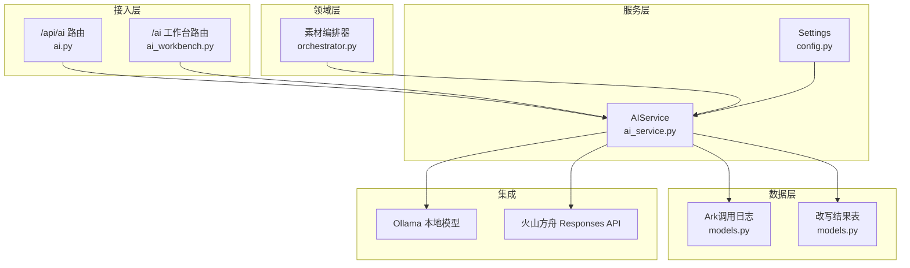
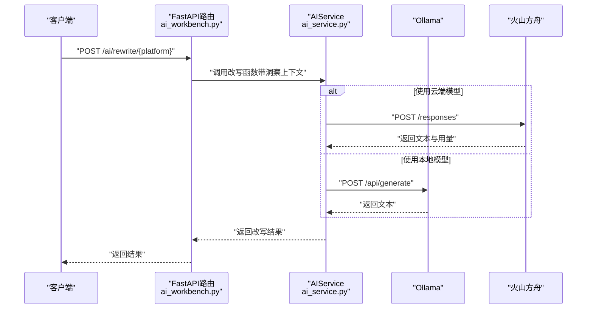
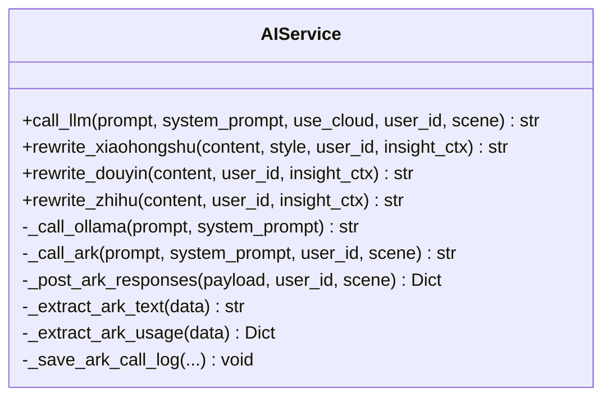
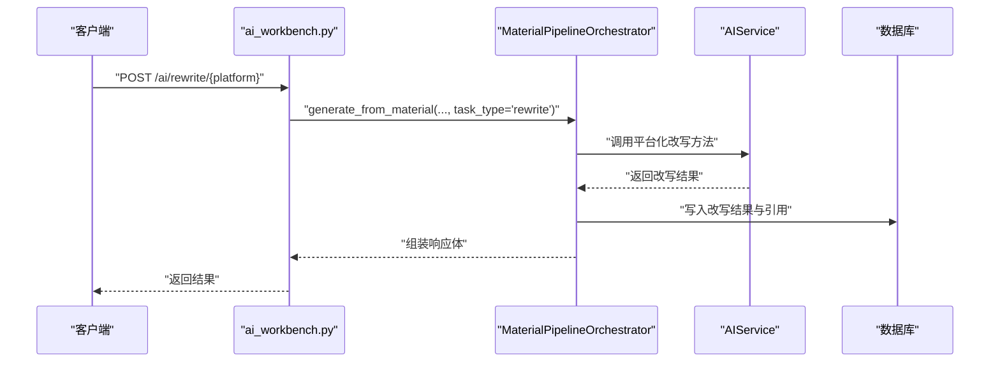
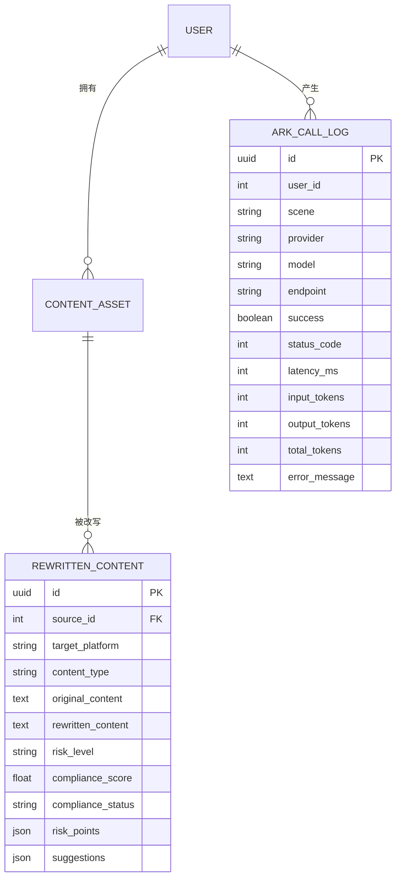
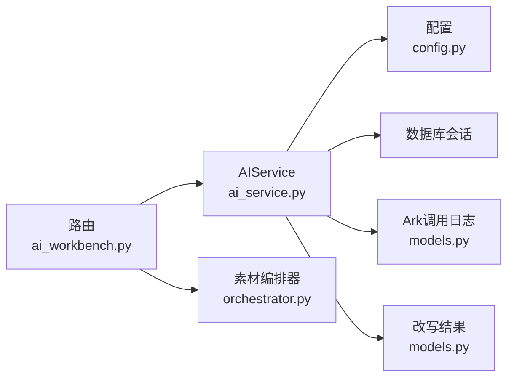

# 改写Agent系统

<cite>
**本文引用的文件**
- [backend/app/ai/agents/rewrite_agent.py](file://backend/app/ai/agents/rewrite_agent.py)
- [backend/app/services/ai_service.py](file://backend/app/services/ai_service.py)
- [backend/app/core/config.py](file://backend/app/core/config.py)
- [backend/app/api/endpoints/ai.py](file://backend/app/api/endpoints/ai.py)
- [backend/app/api/v1/endpoints/ai_workbench.py](file://backend/app/api/v1/endpoints/ai_workbench.py)
- [backend/app/models/models.py](file://backend/app/models/models.py)
- [backend/app/integrations/volcengine/ark_client.py](file://backend/app/integrations/volcengine/ark_client.py)
- [backend/app/timeseries/ai_tasks.py](file://backend/app/tasks/ai_tasks.py)
- [backend/app/rate_limit.py](file://backend/app/core/rate_limit.py)
- [backend/app/schemas/schemas.py](file://backend/app/schemas/schemas.py)
- [backend/app/domains/acquisition/orchestrator.py](file://backend/app/domains/acquisition/orchestrator.py)
- [backend/app/domains/ai_workbench/ai_service.py](file://backend/app/domains/ai_workbench/ai_service.py)
- [backend/app/ai/prompts/rewrite_xhs_v1.txt](file://backend/app/ai/prompts/rewrite_xhs_v1.txt)
- [backend/app/ai/prompts/rewrite_douyin_v1.txt](file://backend/app/ai/prompts/rewrite_douyin_v1.txt)
- [backend/app/rules/local/xiaohongshu.yaml](file://backend/app/rules/local/xiaohongshu.yaml)
</cite>

## 目录
1. [简介](#简介)
2. [项目结构](#项目结构)
3. [核心组件](#核心组件)
4. [架构总览](#架构总览)
5. [详细组件分析](#详细组件分析)
6. [依赖分析](#依赖分析)
7. [性能考虑](#性能考虑)
8. [故障排查指南](#故障排查指南)
9. [结论](#结论)
10. [附录](#附录)

## 简介
本技术文档围绕“智获客”平台的改写Agent系统展开，重点阐释其核心架构设计、工作流程、状态管理与决策机制，并详细说明如何通过AIService进行模型调用（本地Ollama模型与云端火山方舟模型），以及错误处理、重试策略与超时管理。同时，文档覆盖改写任务的生命周期管理，从任务创建到结果返回的完整流程，并提供Agent配置参数、性能监控指标与调试方法，帮助开发者与运维人员快速理解与优化该系统。

## 项目结构
改写Agent系统主要由以下层次构成：
- 接入层：FastAPI路由，负责接收外部请求并进行鉴权与限流。
- 服务层：AIService封装LLM调用细节，支持本地Ollama与云端火山方舟模型。
- 领域层：素材编排与生成流程，结合洞察上下文指导改写。
- 数据层：模型调用日志、改写结果持久化与用户关联。
- 配置层：统一的Settings提供模型与限流参数。

图表来源
- [backend/app/api/endpoints/ai.py:1-103](file://backend/app/api/endpoints/ai.py#L1-L103)
- [backend/app/api/v1/endpoints/ai_workbench.py:1-118](file://backend/app/api/v1/endpoints/ai_workbench.py#L1-L118)
- [backend/app/services/ai_service.py:1-460](file://backend/app/services/ai_service.py#L1-L460)
- [backend/app/core/config.py:71-85](file://backend/app/core/config.py#L71-L85)
- [backend/app/models/models.py:156-182](file://backend/app/models/models.py#L156-L182)

章节来源
- [backend/app/api/endpoints/ai.py:1-103](file://backend/app/api/endpoints/ai.py#L1-L103)
- [backend/app/api/v1/endpoints/ai_workbench.py:1-118](file://backend/app/api/v1/endpoints/ai_workbench.py#L1-L118)
- [backend/app/services/ai_service.py:1-460](file://backend/app/services/ai_service.py#L1-L460)
- [backend/app/core/config.py:71-85](file://backend/app/core/config.py#L71-L85)
- [backend/app/models/models.py:156-182](file://backend/app/models/models.py#L156-L182)

## 核心组件
- AIService：统一的LLM调用服务，负责选择本地或云端模型、发送请求、解析响应、提取用量与持久化调用日志。
- FastAPI路由：提供旧版与新版改写接口，其中旧版接口已下线，新版通过工作台路由对接素材编排器。
- 素材编排器：基于MaterialPipelineOrchestrator，将素材与洞察上下文整合，驱动AIService生成多平台改写内容。
- 配置系统：集中管理Ollama与火山方舟的访问地址、模型名称、超时时间与限流参数。
- 数据模型：包含Ark调用日志与改写结果表，支撑可观测性与审计。

章节来源
- [backend/app/services/ai_service.py:15-460](file://backend/app/services/ai_service.py#L15-L460)
- [backend/app/api/v1/endpoints/ai_workbench.py:28-51](file://backend/app/api/v1/endpoints/ai_workbench.py#L28-L51)
- [backend/app/core/config.py:71-85](file://backend/app/core/config.py#L71-L85)
- [backend/app/models/models.py:156-182](file://backend/app/models/models.py#L156-L182)

## 架构总览
改写Agent系统采用“路由-服务-模型”的分层架构。接入层负责鉴权与限流，服务层统一对接本地与云端模型，领域层负责素材与洞察的编排，数据层记录调用与产出。系统通过配置中心统一管理模型参数与限流策略，确保在不同环境下的一致行为。

图表来源
- [backend/app/api/v1/endpoints/ai_workbench.py:54-78](file://backend/app/api/v1/endpoints/ai_workbench.py#L54-L78)
- [backend/app/services/ai_service.py:24-91](file://backend/app/services/ai_service.py#L24-L91)
- [backend/app/core/config.py:71-85](file://backend/app/core/config.py#L71-L85)

## 详细组件分析

### AIService：模型调用与决策
- 模型选择策略
  - 优先使用云端火山方舟Responses API，当未配置API Key或显式关闭USE_CLOUD_MODEL时回退至本地Ollama。
  - 云端调用通过统一的_post_ark_responses封装，包含超时控制、异常分类与用量统计。
- 本地模型调用
  - 通过httpx异步客户端向Ollama发起POST请求，设置固定温度与非流式返回。
- 云端模型调用
  - 组装多模态输入payload，调用Responses API，解析兼容的文本输出与用量信息。
- 错误处理与日志
  - 对HTTP状态错误与通用异常分别捕获，记录调用日志并持久化到数据库。
  - 日志包含请求ID、场景、用户ID、模型、耗时与Token用量等关键指标。
- 平台化改写方法
  - 提供针对小红书、抖音、知乎的改写方法，均通过call_llm统一调度。
  - 支持可选的洞察上下文，动态拼接参考特征块以指导风格与合规性。

图表来源
- [backend/app/services/ai_service.py:15-460](file://backend/app/services/ai_service.py#L15-L460)

章节来源
- [backend/app/services/ai_service.py:15-460](file://backend/app/services/ai_service.py#L15-L460)
- [backend/app/core/config.py:71-85](file://backend/app/core/config.py#L71-L85)

### 路由与工作流：从请求到结果
- 旧版接口已下线，迁移指引指向新路由。
- 新版工作台路由
  - /ai/rewrite/xiaohongshu：调用_material_pipeline_orchestrator.generate_from_material，传入平台、受众与任务类型“rewrite”。
  - 返回原始内容、改写结果、是否使用洞察、引用数量与生成任务ID等字段。
- 限流策略
  - 对火山方舟视觉分析接口应用分布式限流，避免突发流量冲击。

图表来源
- [backend/app/api/v1/endpoints/ai_workbench.py:28-51](file://backend/app/api/v1/endpoints/ai_workbench.py#L28-L51)
- [backend/app/domains/acquisition/orchestrator.py](file://backend/app/domains/acquisition/orchestrator.py)
- [backend/app/domains/ai_workbench/ai_service.py](file://backend/app/domains/ai_workbench/ai_service.py)

章节来源
- [backend/app/api/v1/endpoints/ai_workbench.py:54-78](file://backend/app/api/v1/endpoints/ai_workbench.py#L54-L78)
- [backend/app/api/endpoints/ai.py:36-63](file://backend/app/api/endpoints/ai.py#L36-L63)

### 配置参数与限流
- 模型与超时
  - OLLAMA_BASE_URL、OLLAMA_MODEL、USE_CLOUD_MODEL：控制本地模型访问与回退策略。
  - ARK_API_KEY、ARK_BASE_URL、ARK_MODEL、ARK_TIMEOUT_SECONDS：控制云端模型访问与超时。
- 限流
  - ARK_VISION_RATE_LIMIT_PER_MINUTE、ARK_VISION_RATE_LIMIT_WINDOW_SECONDS：对视觉分析接口进行速率限制。
  - USE_REDIS_RATE_LIMIT、REDIS_URL、RATE_LIMIT_KEY_PREFIX：启用Redis分布式限流。
- 文件上传
  - MAX_UPLOAD_SIZE、UPLOAD_DIR：限制与存储路径。

章节来源
- [backend/app/core/config.py:71-85](file://backend/app/core/config.py#L71-L85)
- [backend/app/api/endpoints/ai.py:18-25](file://backend/app/api/endpoints/ai.py#L18-L25)

### 数据模型与持久化
- Ark调用日志
  - 记录请求ID、场景、用户ID、模型、端点、成功状态、HTTP状态码、延迟毫秒数与Token用量。
- 改写结果
  - 关联源素材，记录目标平台、内容类型、原始内容、改写内容、合规评分与建议等。

图表来源
- [backend/app/models/models.py:156-182](file://backend/app/models/models.py#L156-L182)
- [backend/app/models/models.py:26-26](file://backend/app/models/models.py#L26-L26)

章节来源
- [backend/app/models/models.py:156-182](file://backend/app/models/models.py#L156-L182)

### Agent实现现状与扩展建议
- 当前Agent实现
  - 后端存在一个占位Agent文件，实际改写能力由AIService与工作台路由承担。
- 扩展方向
  - 在Agent中引入状态机（如待处理、生成中、已完成、失败），并在AIService回调中更新状态。
  - 将重试与超时策略下沉至Agent，结合指数退避与熔断机制提升鲁棒性。
  - 引入任务队列与异步执行，配合状态查询接口，实现长耗时改写的可观测性。

章节来源
- [backend/app/ai/agents/rewrite_agent.py:1-3](file://backend/app/ai/agents/rewrite_agent.py#L1-L3)

## 依赖分析
- 组件耦合
  - 路由依赖AIService与MaterialPipelineOrchestrator；AIService依赖配置与数据库会话；日志与改写结果作为副作用写入数据库。
- 外部依赖
  - Ollama本地模型与火山方舟Responses API；Redis用于分布式限流。
- 循环依赖
  - 当前结构清晰，未发现循环导入；若后续在Agent中引入状态持久化，需避免与AIService形成双向依赖。

图表来源
- [backend/app/api/v1/endpoints/ai_workbench.py:28-51](file://backend/app/api/v1/endpoints/ai_workbench.py#L28-L51)
- [backend/app/services/ai_service.py:15-460](file://backend/app/services/ai_service.py#L15-L460)
- [backend/app/core/config.py:71-85](file://backend/app/core/config.py#L71-L85)
- [backend/app/models/models.py:156-182](file://backend/app/models/models.py#L156-L182)

章节来源
- [backend/app/api/v1/endpoints/ai_workbench.py:28-51](file://backend/app/api/v1/endpoints/ai_workbench.py#L28-L51)
- [backend/app/services/ai_service.py:15-460](file://backend/app/services/ai_service.py#L15-L460)
- [backend/app/core/config.py:71-85](file://backend/app/core/config.py#L71-L85)
- [backend/app/models/models.py:156-182](file://backend/app/models/models.py#L156-L182)

## 性能考虑
- 超时与并发
  - 云端调用通过ARK_TIMEOUT_SECONDS控制超时；本地调用默认60秒超时，可根据模型规模调整。
  - 建议在路由层增加请求级超时与取消信号，避免长时间占用连接。
- 限流与削峰
  - 对火山方舟视觉分析接口应用分布式限流，防止突发流量导致下游不稳定。
- 资源复用
  - httpx异步客户端按请求创建，建议在AIService中复用连接池以降低握手开销。
- 观测性
  - 通过Ark调用日志记录延迟与Token用量，结合数据库指标进行容量规划与成本控制。

章节来源
- [backend/app/services/ai_service.py:157-190](file://backend/app/services/ai_service.py#L157-L190)
- [backend/app/api/endpoints/ai.py:18-25](file://backend/app/api/endpoints/ai.py#L18-L25)
- [backend/app/core/config.py:80-85](file://backend/app/core/config.py#L80-L85)

## 故障排查指南
- 常见错误与定位
  - 云端模型调用失败：检查ARK_API_KEY、ARK_BASE_URL与网络连通性；查看Ark调用日志中的状态码与错误消息。
  - 本地模型调用失败：确认Ollama服务可用与模型名称正确；关注AIService抛出的异常信息。
  - 超时与重试：云端调用受ARK_TIMEOUT_SECONDS限制；可在客户端侧配置最大重试次数与超时时间。
- 日志与指标
  - Ark调用日志包含请求ID、场景、用户ID、模型、耗时与Token用量，便于定位慢请求与异常。
  - 改写结果表记录合规评分与建议，辅助质量评估。
- 限流告警
  - 若触发视觉分析限流，应检查限流阈值与Redis配置，必要时扩容或调整窗口大小。

章节来源
- [backend/app/services/ai_service.py:191-239](file://backend/app/services/ai_service.py#L191-L239)
- [backend/app/models/models.py:156-182](file://backend/app/models/models.py#L156-L182)
- [backend/app/api/endpoints/ai.py:18-25](file://backend/app/api/endpoints/ai.py#L18-L25)

## 结论
改写Agent系统通过清晰的分层设计与统一的AIService实现了本地与云端模型的无缝切换。配合工作台路由与素材编排器，系统能够基于洞察上下文生成多平台合规内容。通过配置中心与限流策略，系统在不同环境下具备良好的可移植性与稳定性。未来可在Agent中引入状态管理、重试与超时策略以及异步执行，进一步提升系统的可观测性与可靠性。

## 附录

### 配置参数一览
- 模型与超时
  - OLLAMA_BASE_URL、OLLAMA_MODEL、USE_CLOUD_MODEL
  - ARK_API_KEY、ARK_BASE_URL、ARK_MODEL、ARK_TIMEOUT_SECONDS
- 限流
  - ARK_VISION_RATE_LIMIT_PER_MINUTE、ARK_VISION_RATE_LIMIT_WINDOW_SECONDS
  - USE_REDIS_RATE_LIMIT、REDIS_URL、RATE_LIMIT_KEY_PREFIX
- 文件上传
  - MAX_UPLOAD_SIZE、UPLOAD_DIR

章节来源
- [backend/app/core/config.py:71-85](file://backend/app/core/config.py#L71-L85)

### 性能监控指标
- Ark调用日志字段
  - 请求ID、场景、用户ID、模型、端点、成功状态、HTTP状态码、延迟毫秒数、输入/输出/总Token用量、错误消息
- 改写结果字段
  - 目标平台、内容类型、原始内容、改写内容、风险等级、合规评分、合规状态、风险点、建议

章节来源
- [backend/app/services/ai_service.py:269-304](file://backend/app/services/ai_service.py#L269-L304)
- [backend/app/models/models.py:156-182](file://backend/app/models/models.py#L156-L182)

### 调试方法
- 启用DEBUG模式与日志级别，观察AIService内部调用链路与异常堆栈。
- 在客户端侧配置合理的超时与重试策略，结合请求ID进行跨服务追踪。
- 使用数据库查询Ark调用日志与改写结果，验证模型选择与输出质量。

章节来源
- [backend/app/core/config.py:25-25](file://backend/app/core/config.py#L25-L25)
- [backend/app/services/ai_service.py:148-190](file://backend/app/services/ai_service.py#L148-L190)
- [backend/app/models/models.py:156-182](file://backend/app/models/models.py#L156-L182)