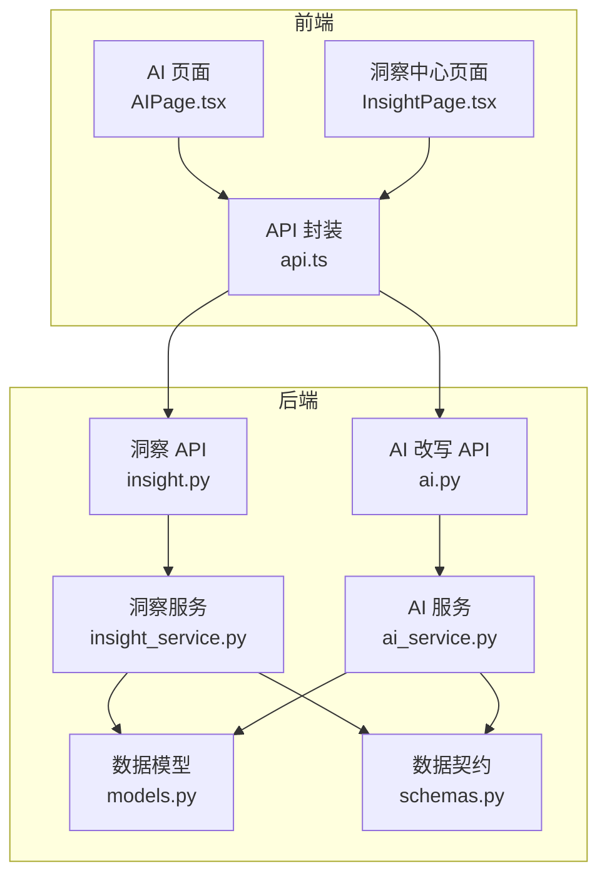
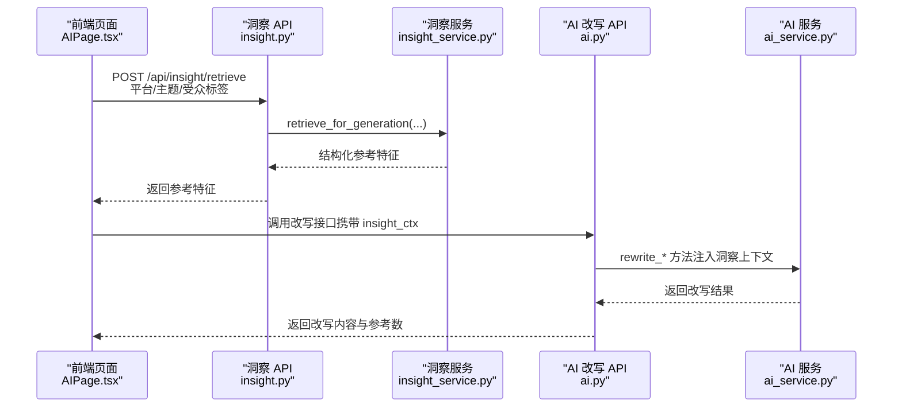
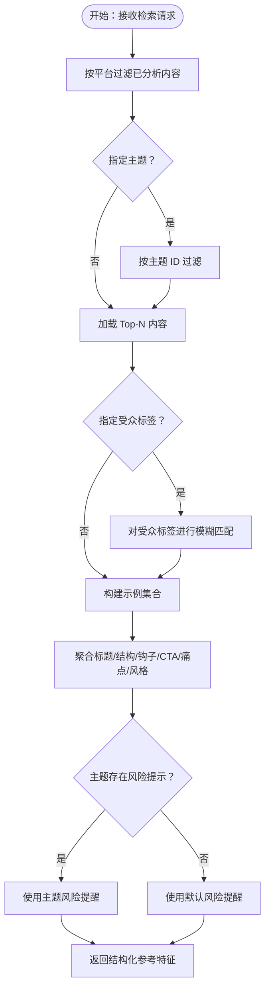
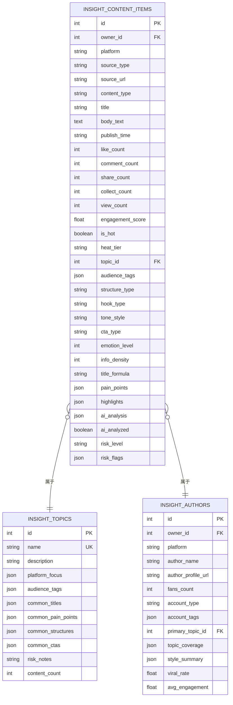
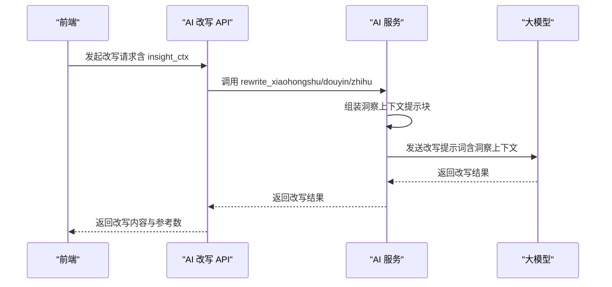
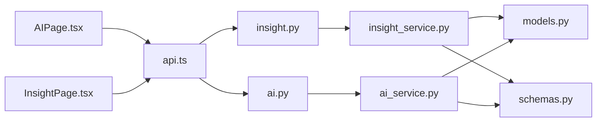

# 洞察上下文集成

<cite>
**本文引用的文件**
- [backend/app/services/insight_service.py](file://backend/app/services/insight_service.py)
- [backend/app/api/endpoints/insight.py](file://backend/app/api/endpoints/insight.py)
- [backend/app/services/ai_service.py](file://backend/app/services/ai_service.py)
- [backend/app/models/models.py](file://backend/app/models/models.py)
- [backend/app/schemas/schemas.py](file://backend/app/schemas/schemas.py)
- [backend/app/api/endpoints/ai.py](file://backend/app/api/endpoints/ai.py)
- [desktop/src/pages/InsightPage.tsx](file://desktop/src/pages/InsightPage.tsx)
- [desktop/src/pages/AIPage.tsx](file://desktop/src/pages/AIPage.tsx)
- [desktop/src/lib/api.ts](file://desktop/src/lib/api.ts)
- [变更说明_2026-03-23_洞察中心与改写联动.md](file://变更说明_2026-03-23_洞察中心与改写联动.md)
</cite>

## 目录
1. [简介](#简介)
2. [项目结构](#项目结构)
3. [核心组件](#核心组件)
4. [架构总览](#架构总览)
5. [详细组件分析](#详细组件分析)
6. [依赖关系分析](#依赖关系分析)
7. [性能考量](#性能考量)
8. [故障排查指南](#故障排查指南)
9. [结论](#结论)
10. [附录](#附录)

## 简介
本技术文档围绕“洞察上下文集成”能力，系统阐述智获客在内容改写中如何利用洞察数据驱动风格特征与个性化推荐。文档涵盖以下要点：
- 洞察数据在内容改写中的作用机制：历史内容分析、风格特征提取、个性化推荐策略
- 洞察上下文的数据结构设计：标题示例、结构模板、钩子类型、痛点分析、风格总结的组织方式
- 上下文信息的动态加载与实时更新机制：缓存策略与版本管理
- 洞察数据对改写质量的影响评估：风格一致性、用户偏好匹配、效果提升分析
- 具体的上下文集成示例、数据格式规范与性能优化建议

## 项目结构
洞察上下文集成涉及后端服务、API 端点、前端页面与接口封装，形成“前端请求 → 后端检索召回 → AI 改写注入”的闭环。

图表来源
- [backend/app/api/endpoints/insight.py:1-410](file://backend/app/api/endpoints/insight.py#L1-L410)
- [backend/app/services/insight_service.py:1-659](file://backend/app/services/insight_service.py#L1-L659)
- [backend/app/api/endpoints/ai.py:1-103](file://backend/app/api/endpoints/ai.py#L1-L103)
- [backend/app/services/ai_service.py:320-460](file://backend/app/services/ai_service.py#L320-L460)
- [backend/app/models/models.py:810-928](file://backend/app/models/models.py#L810-L928)
- [backend/app/schemas/schemas.py:877-953](file://backend/app/schemas/schemas.py#L877-L953)
- [desktop/src/pages/AIPage.tsx:1-200](file://desktop/src/pages/AIPage.tsx#L1-L200)
- [desktop/src/pages/InsightPage.tsx:1-531](file://desktop/src/pages/InsightPage.tsx#L1-L531)
- [desktop/src/lib/api.ts:500-604](file://desktop/src/lib/api.ts#L500-L604)

章节来源
- [backend/app/api/endpoints/insight.py:1-410](file://backend/app/api/endpoints/insight.py#L1-L410)
- [backend/app/services/insight_service.py:1-659](file://backend/app/services/insight_service.py#L1-L659)
- [backend/app/api/endpoints/ai.py:1-103](file://backend/app/api/endpoints/ai.py#L1-L103)
- [backend/app/services/ai_service.py:320-460](file://backend/app/services/ai_service.py#L320-L460)
- [backend/app/models/models.py:810-928](file://backend/app/models/models.py#L810-L928)
- [backend/app/schemas/schemas.py:877-953](file://backend/app/schemas/schemas.py#L877-L953)
- [desktop/src/pages/AIPage.tsx:1-200](file://desktop/src/pages/AIPage.tsx#L1-L200)
- [desktop/src/pages/InsightPage.tsx:1-531](file://desktop/src/pages/InsightPage.tsx#L1-L531)
- [desktop/src/lib/api.ts:500-604](file://desktop/src/lib/api.ts#L500-L604)

## 核心组件
- 洞察服务（InsightService）：负责内容入库、热度评分、主题与账号画像、AI 分析、知识库聚合与检索召回
- 洞察 API（insight.py）：暴露主题、内容、作者、统计、检索召回等 REST 接口
- AI 服务（ai_service.py）：封装改写方法，将洞察上下文注入提示词
- 数据模型（models.py）：定义洞察内容项、主题、作者档案、采集任务等实体
- 数据契约（schemas.py）：定义洞察检索请求/响应、改写请求/响应等数据结构
- 前端页面与 API 封装：AI 页面与洞察中心页面通过 api.ts 调用后端接口

章节来源
- [backend/app/services/insight_service.py:57-659](file://backend/app/services/insight_service.py#L57-L659)
- [backend/app/api/endpoints/insight.py:1-410](file://backend/app/api/endpoints/insight.py#L1-L410)
- [backend/app/services/ai_service.py:320-460](file://backend/app/services/ai_service.py#L320-L460)
- [backend/app/models/models.py:810-928](file://backend/app/models/models.py#L810-L928)
- [backend/app/schemas/schemas.py:877-953](file://backend/app/schemas/schemas.py#L877-L953)
- [desktop/src/pages/AIPage.tsx:1-200](file://desktop/src/pages/AIPage.tsx#L1-L200)
- [desktop/src/pages/InsightPage.tsx:1-531](file://desktop/src/pages/InsightPage.tsx#L1-L531)
- [desktop/src/lib/api.ts:500-604](file://desktop/src/lib/api.ts#L500-L604)

## 架构总览
洞察上下文集成的关键流程如下：
- 前端在 AI 改写页面发起改写请求，携带目标平台与洞察主题/受众标签
- 后端通过 /api/insight/retrieve 获取结构化参考特征（标题示例、结构模板、钩子类型、痛点、风格汇总、风险提醒）
- AI 服务将洞察上下文注入改写提示词，调用大模型生成改写内容
- 前端展示改写结果，并提示是否参考了洞察库

图表来源
- [backend/app/api/endpoints/insight.py:379-397](file://backend/app/api/endpoints/insight.py#L379-L397)
- [backend/app/services/insight_service.py:553-638](file://backend/app/services/insight_service.py#L553-L638)
- [backend/app/api/endpoints/ai.py:1-103](file://backend/app/api/endpoints/ai.py#L1-L103)
- [backend/app/services/ai_service.py:320-460](file://backend/app/services/ai_service.py#L320-L460)
- [desktop/src/pages/AIPage.tsx:33-51](file://desktop/src/pages/AIPage.tsx#L33-L51)
- [desktop/src/lib/api.ts:500-514](file://desktop/src/lib/api.ts#L500-L514)

## 详细组件分析

### 洞察服务与检索召回
- 内容入库与热度评分：基于互动数据计算互动分与热度分层，用于排序与筛选
- 主题与账号画像：支持主题创建、内容聚合、账号爆款率与风格分布统计
- AI 分析：调用 LLM 提取结构、钩子、痛点、风格等特征，并更新主题知识库
- 检索召回：按平台/主题/受众标签召回结构化参考，仅返回分析结论，不返回原文

图表来源
- [backend/app/services/insight_service.py:553-638](file://backend/app/services/insight_service.py#L553-L638)

章节来源
- [backend/app/services/insight_service.py:43-638](file://backend/app/services/insight_service.py#L43-L638)

### 数据模型与数据结构
- 洞察内容项（InsightContentItem）：统一承载平台、账号、内容、互动、AI 分析、风控等字段
- 主题（InsightTopic）：主题名称、平台聚焦、受众标签、风险提示、知识库字段（标题示例、痛点、结构、CTA）
- 作者档案（InsightAuthorProfile）：粉丝数、账号定位、主要主题、风格分布、爆款率、平均互动分
- 洞察检索请求/响应：平台、主题名、受众标签、限制数量、返回标题示例、结构示例、钩子示例、CTA 示例、痛点示例、风格汇总、风险提醒、参考数

图表来源
- [backend/app/models/models.py:810-928](file://backend/app/models/models.py#L810-L928)

章节来源
- [backend/app/models/models.py:810-928](file://backend/app/models/models.py#L810-L928)
- [backend/app/schemas/schemas.py:877-953](file://backend/app/schemas/schemas.py#L877-L953)

### AI 改写上下文注入
- 将检索得到的结构化参考特征拼装为提示词块，注入到不同平台的改写提示词中
- 小红书：强调标题示例、结构模板、钩子类型、痛点、风格汇总、风险提醒
- 抖音：强调钩子类型、痛点、结构参考、风险提醒
- 知乎：强调痛点、结构参考、风格汇总、风险提醒

图表来源
- [backend/app/services/ai_service.py:320-460](file://backend/app/services/ai_service.py#L320-L460)
- [backend/app/api/endpoints/ai.py:1-103](file://backend/app/api/endpoints/ai.py#L1-L103)
- [desktop/src/pages/AIPage.tsx:33-51](file://desktop/src/pages/AIPage.tsx#L33-L51)

章节来源
- [backend/app/services/ai_service.py:320-460](file://backend/app/services/ai_service.py#L320-L460)
- [backend/app/api/endpoints/ai.py:1-103](file://backend/app/api/endpoints/ai.py#L1-L103)
- [desktop/src/pages/AIPage.tsx:33-51](file://desktop/src/pages/AIPage.tsx#L33-L51)

### 前端集成与交互
- AI 页面：展示改写结果，提示是否参考了洞察库以及参考数量
- 洞察中心页面：提供内容库、主题知识库、检索召回、导入内容等能力
- API 封装：提供 retrieveInsightContext 等函数，供前端调用

章节来源
- [desktop/src/pages/AIPage.tsx:1-200](file://desktop/src/pages/AIPage.tsx#L1-L200)
- [desktop/src/pages/InsightPage.tsx:1-531](file://desktop/src/pages/InsightPage.tsx#L1-L531)
- [desktop/src/lib/api.ts:500-514](file://desktop/src/lib/api.ts#L500-L514)
- [变更说明_2026-03-23_洞察中心与改写联动.md:149-235](file://变更说明_2026-03-23_洞察中心与改写联动.md#L149-L235)

## 依赖关系分析
- 洞察 API 依赖洞察服务进行检索召回与统计
- AI 改写 API 依赖 AI 服务进行上下文注入与改写
- 洞察服务依赖数据模型与数据契约进行持久化与序列化
- 前端通过 API 封装调用后端接口，实现洞察上下文的动态加载与实时更新

图表来源
- [backend/app/api/endpoints/insight.py:1-410](file://backend/app/api/endpoints/insight.py#L1-L410)
- [backend/app/services/insight_service.py:1-659](file://backend/app/services/insight_service.py#L1-L659)
- [backend/app/api/endpoints/ai.py:1-103](file://backend/app/api/endpoints/ai.py#L1-L103)
- [backend/app/services/ai_service.py:320-460](file://backend/app/services/ai_service.py#L320-L460)
- [backend/app/models/models.py:810-928](file://backend/app/models/models.py#L810-L928)
- [backend/app/schemas/schemas.py:877-953](file://backend/app/schemas/schemas.py#L877-L953)
- [desktop/src/lib/api.ts:500-604](file://desktop/src/lib/api.ts#L500-L604)
- [desktop/src/pages/AIPage.tsx:1-200](file://desktop/src/pages/AIPage.tsx#L1-L200)
- [desktop/src/pages/InsightPage.tsx:1-531](file://desktop/src/pages/InsightPage.tsx#L1-L531)

章节来源
- [backend/app/api/endpoints/insight.py:1-410](file://backend/app/api/endpoints/insight.py#L1-L410)
- [backend/app/services/insight_service.py:1-659](file://backend/app/services/insight_service.py#L1-L659)
- [backend/app/api/endpoints/ai.py:1-103](file://backend/app/api/endpoints/ai.py#L1-L103)
- [backend/app/services/ai_service.py:320-460](file://backend/app/services/ai_service.py#L320-L460)
- [backend/app/models/models.py:810-928](file://backend/app/models/models.py#L810-L928)
- [backend/app/schemas/schemas.py:877-953](file://backend/app/schemas/schemas.py#L877-L953)
- [desktop/src/lib/api.ts:500-604](file://desktop/src/lib/api.ts#L500-L604)
- [desktop/src/pages/AIPage.tsx:1-200](file://desktop/src/pages/AIPage.tsx#L1-L200)
- [desktop/src/pages/InsightPage.tsx:1-531](file://desktop/src/pages/InsightPage.tsx#L1-L531)

## 性能考量
- 检索召回性能
  - 使用数据库索引与排序（按互动分倒序）减少扫描成本
  - 对受众标签采用 JSON 字段模糊匹配，限制匹配标签数量（最多 3 个）
  - 未命中时降级为不限平台的召回，保证可用性
- 批量分析限流
  - 对批量 AI 分析设置分布式速率限制，避免瞬时峰值
- 前端渲染优化
  - 洞察中心页面对示例集合去重与上限控制（标题、结构、钩子、CTA、痛点、风格汇总）
  - 检索结果仅返回结构化参考，避免传输原文导致的网络与内存压力

章节来源
- [backend/app/services/insight_service.py:553-638](file://backend/app/services/insight_service.py#L553-L638)
- [backend/app/api/endpoints/insight.py:234-302](file://backend/app/api/endpoints/insight.py#L234-L302)
- [backend/app/schemas/schemas.py:877-953](file://backend/app/schemas/schemas.py#L877-L953)

## 故障排查指南
- 洞察检索为空
  - 检查是否存在已分析内容（ai_analyzed=True）
  - 若未命中，确认是否降级为不限平台的召回
- AI 分析失败
  - 查看批量分析任务状态与错误日志
  - 确认 LLM 返回是否包含有效 JSON
- 前端未显示洞察参考
  - 确认 /api/insight/retrieve 是否正确返回 reference_count
  - 检查前端是否正确展示 insight_reference_count

章节来源
- [backend/app/services/insight_service.py:553-638](file://backend/app/services/insight_service.py#L553-L638)
- [backend/app/api/endpoints/insight.py:234-302](file://backend/app/api/endpoints/insight.py#L234-L302)
- [desktop/src/pages/AIPage.tsx:152-162](file://desktop/src/pages/AIPage.tsx#L152-L162)

## 结论
洞察上下文集成为内容改写提供了可解释、可追踪、可扩展的风格与结构参考。通过主题知识库与账号画像的持续更新，系统实现了对用户偏好的精准匹配与风格一致性保障。结合前端的动态加载与实时反馈，整体提升了改写效率与质量。

## 附录

### 数据格式规范
- 洞察检索请求
  - 字段：platform（必填）、topic_name（可选）、audience_tags（可选，最多 3 个）、limit（默认 5，范围 1-20）
- 洞察检索响应
  - 字段：topic_name、platform、title_examples、structure_examples、hook_examples、cta_examples、pain_point_examples、style_summary、risk_reminder、reference_count

章节来源
- [backend/app/schemas/schemas.py:877-897](file://backend/app/schemas/schemas.py#L877-L897)

### 上下文集成示例
- 小红书改写提示词注入
  - 标题示例、结构模板、钩子类型、痛点、风格汇总、风险提醒
- 抖音改写提示词注入
  - 钩子类型、痛点、结构参考、风险提醒
- 知乎改写提示词注入
  - 痛点、结构参考、风格汇总、风险提醒

章节来源
- [backend/app/services/ai_service.py:320-460](file://backend/app/services/ai_service.py#L320-L460)