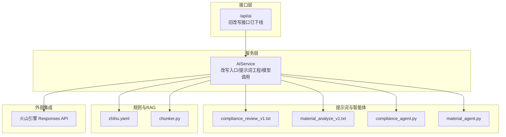
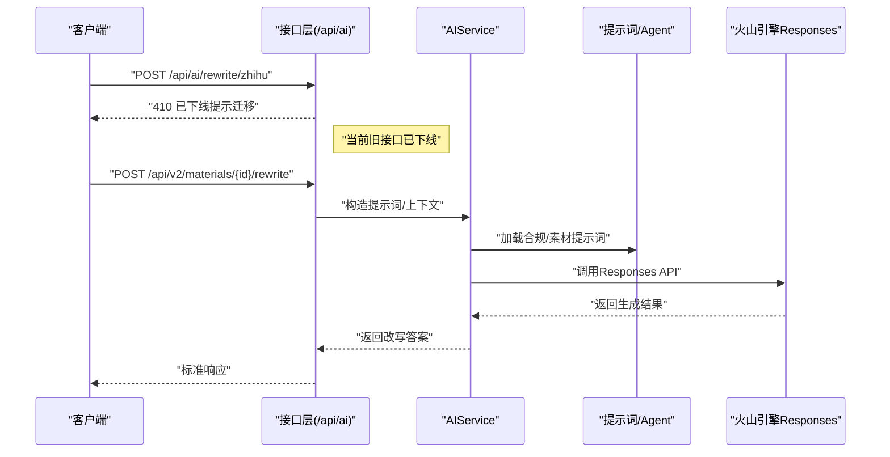
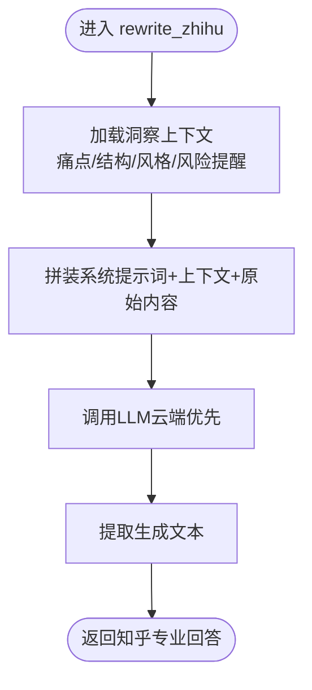
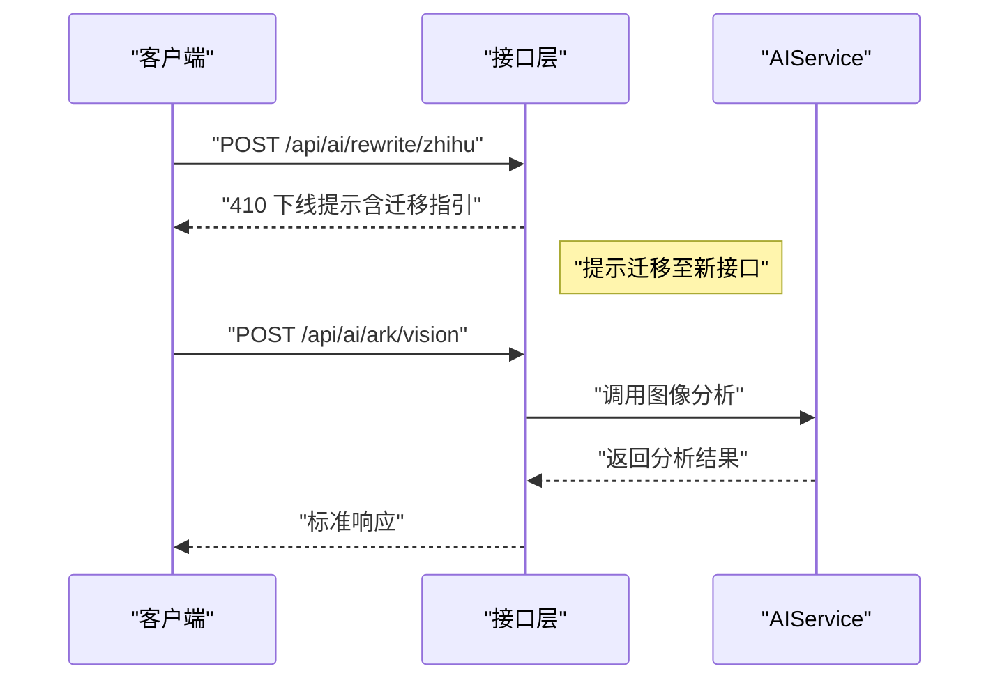
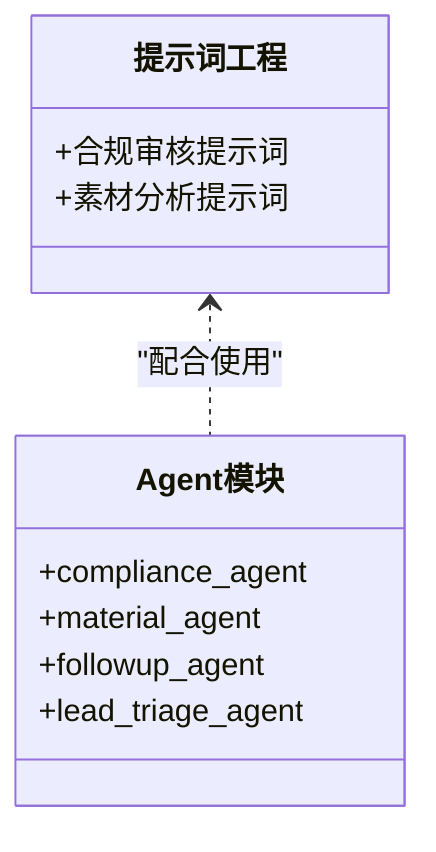
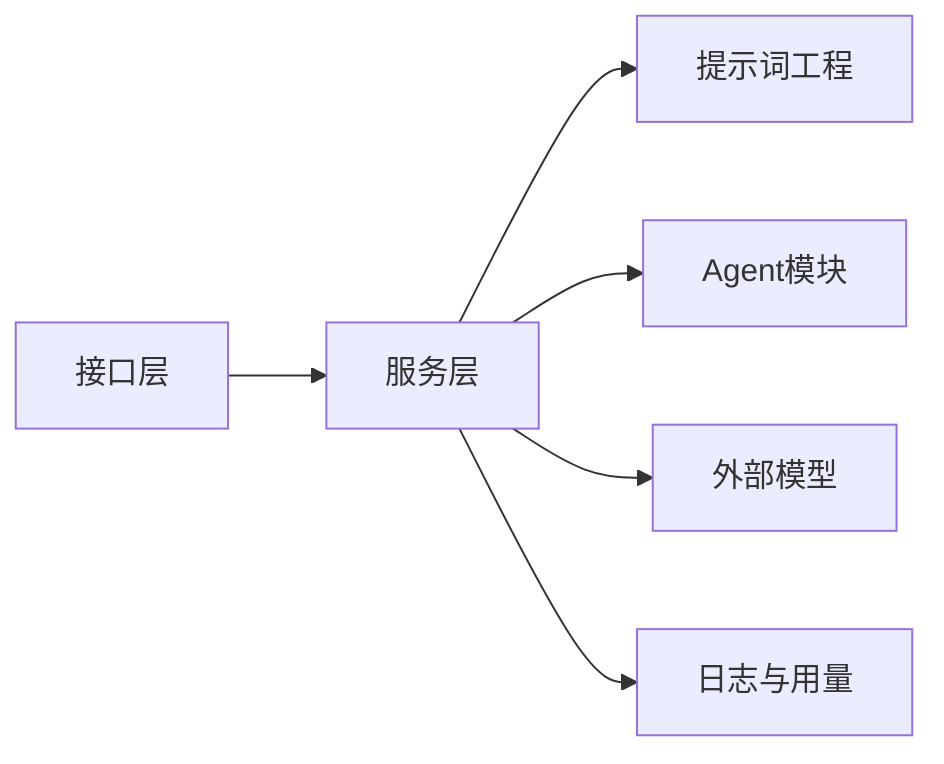

# 知乎专业回答改写

<cite>
**本文引用的文件**
- [backend/app/services/ai_service.py](file://backend/app/services/ai_service.py)
- [backend/app/api/endpoints/ai.py](file://backend/app/api/endpoints/ai.py)
- [backend/app/ai/prompts/compliance_review_v1.txt](file://backend/app/ai/prompts/compliance_review_v1.txt)
- [backend/app/ai/prompts/material_analyze_v1.txt](file://backend/app/ai/prompts/material_analyze_v1.txt)
- [backend/app/ai/agents/compliance_agent.py](file://backend/app/ai/agents/compliance_agent.py)
- [backend/app/ai/agents/material_agent.py](file://backend/app/ai/agents/material_agent.py)
- [backend/app/ai/rag/chunker.py](file://backend/app/ai/rag/chunker.py)
- [backend/app/rule/local/zhihu.yaml](file://backend/app/rules/local/zhihu.yaml)
- [docs/architecture/ai-architecture.md](file://docs/architecture/ai-architecture.md)
</cite>

## 目录
1. [简介](#简介)
2. [项目结构](#项目结构)
3. [核心组件](#核心组件)
4. [架构总览](#架构总览)
5. [详细组件分析](#详细组件分析)
6. [依赖关系分析](#依赖关系分析)
7. [性能考量](#性能考量)
8. [故障排查指南](#故障排查指南)
9. [结论](#结论)
10. [附录](#附录)

## 简介
本技术文档聚焦“智获客”在知乎平台的专业内容改写能力，围绕“逻辑结构化表达、分析过程展示、理性提醒机制”的回答生成范式，系统阐述面向金融信贷领域的专业术语转换与合规处理流程，并给出标准化回答结构（问题分析、论据支撑、风险提醒、结论总结）的设计要点与实施路径。同时，结合现有代码实现，说明当前改写服务的接口形态、提示词工程、外部模型对接与日志追踪机制，帮助读者快速理解与落地。

## 项目结构
围绕“知乎专业回答改写”，后端关键位置如下：
- 服务层：AI服务封装了多平台改写入口与通用LLM调用逻辑
- 接口层：对外暴露AI相关接口，包含对旧接口的迁移提示
- 提示词与智能体：提示词文件与Agent模块预留扩展点
- 规则与RAG：平台规则配置与文本切分工具
- 架构文档：AI子系统组织结构概览

图表来源
- [backend/app/api/endpoints/ai.py:17-63](file://backend/app/api/endpoints/ai.py#L17-L63)
- [backend/app/services/ai_service.py:15-304](file://backend/app/services/ai_service.py#L15-L304)
- [backend/app/ai/prompts/compliance_review_v1.txt:1-1](file://backend/app/ai/prompts/compliance_review_v1.txt#L1-L1)
- [backend/app/ai/prompts/material_analyze_v1.txt:1-1](file://backend/app/ai/prompts/material_analyze_v1.txt#L1-L1)
- [backend/app/ai/agents/compliance_agent.py:1-3](file://backend/app/ai/agents/compliance_agent.py#L1-L3)
- [backend/app/ai/agents/material_agent.py:1-3](file://backend/app/ai/agents/material_agent.py#L1-L3)
- [backend/app/rule/local/zhihu.yaml:1-4](file://backend/app/rules/local/zhihu.yaml#L1-L4)
- [backend/app/ai/rag/chunker.py:1-3](file://backend/app/ai/rag/chunker.py#L1-L3)

章节来源
- [docs/architecture/ai-architecture.md:1-7](file://docs/architecture/ai-architecture.md#L1-L7)
- [backend/app/api/endpoints/ai.py:17-63](file://backend/app/api/endpoints/ai.py#L17-L63)
- [backend/app/services/ai_service.py:15-304](file://backend/app/services/ai_service.py#L15-L304)

## 核心组件
- AIService：封装LLM调用（本地Ollama或云端火山引擎），提供多平台改写入口（如知乎、小红书、抖音），支持基于洞察上下文的风格与结构引导，以及通用结构抽取能力。
- 接口层：对外提供AI相关接口，当前旧改写接口已下线并提示迁移至新接口；图像视觉分析接口仍可用。
- 提示词工程：合规审核与素材分析两类提示词文件，用于指导模型输出结构化结果与风险识别。
- Agent模块：合规、素材、跟进、线索分流等Agent预留实现，便于后续扩展。
- 规则与RAG：平台规则配置文件与文本切分工具，支撑内容治理与检索增强。

章节来源
- [backend/app/services/ai_service.py:15-460](file://backend/app/services/ai_service.py#L15-L460)
- [backend/app/api/endpoints/ai.py:17-103](file://backend/app/api/endpoints/ai.py#L17-L103)
- [backend/app/ai/prompts/compliance_review_v1.txt:1-1](file://backend/app/ai/prompts/compliance_review_v1.txt#L1-L1)
- [backend/app/ai/prompts/material_analyze_v1.txt:1-1](file://backend/app/ai/prompts/material_analyze_v1.txt#L1-L1)
- [backend/app/ai/agents/compliance_agent.py:1-3](file://backend/app/ai/agents/compliance_agent.py#L1-L3)
- [backend/app/ai/agents/material_agent.py:1-3](file://backend/app/ai/agents/material_agent.py#L1-L3)
- [backend/app/rule/local/zhihu.yaml:1-4](file://backend/app/rules/local/zhihu.yaml#L1-L4)
- [backend/app/ai/rag/chunker.py:1-3](file://backend/app/ai/rag/chunker.py#L1-L3)

## 架构总览
知乎专业回答改写的核心流程由“接口层—服务层—提示词/智能体—外部模型”构成。接口层负责鉴权与限流，服务层负责提示词拼装、上下文注入与模型调用，提示词与Agent模块提供结构化输出与合规能力，外部模型通过火山引擎Responses API提供生成能力。

图表来源
- [backend/app/api/endpoints/ai.py:56-63](file://backend/app/api/endpoints/ai.py#L56-L63)
- [backend/app/services/ai_service.py:386-420](file://backend/app/services/ai_service.py#L386-L420)

## 详细组件分析

### AIService：改写与提示词工程
- 多平台改写入口
  - rewrite_zhihu：面向知乎专业回答的改写入口，支持注入洞察上下文（痛点、结构、风格、风险提醒），并以“专业、逻辑清晰、有分析过程、理性提醒与风险说明”为核心约束。
  - rewrite_xiaohongshu、rewrite_douyin：其他平台改写入口，体现差异化风格与结构要求。
- 提示词工程
  - 系统提示词：限定角色身份（如“知乎专业回答作者”），确保输出风格与专业度。
  - 上下文注入：从洞察上下文中抽取“目标群体痛点、内容结构参考、同类内容风格、风险提醒”等要素，拼接为上下文块，避免直接复制原文。
  - 合规约束：明确禁用“担保、承诺类违规词语”，并在要求中强调合规性。
- 模型调用
  - 优先使用云端火山引擎Responses API（当配置可用时），否则回退到本地Ollama。
  - 统一的日志记录与用量统计，便于审计与成本控制。
- 结构抽取
  - extract_structure：对任意内容进行结构化抽取，返回主题、受众、痛点、结构、钩子、潜在反对意见等要素，便于后续改写与优化。

图表来源
- [backend/app/services/ai_service.py:386-420](file://backend/app/services/ai_service.py#L386-L420)
- [backend/app/services/ai_service.py:393](file://backend/app/services/ai_service.py#L393)
- [backend/app/services/ai_service.py:404](file://backend/app/services/ai_service.py#L404)

章节来源
- [backend/app/services/ai_service.py:15-460](file://backend/app/services/ai_service.py#L15-L460)

### 接口层：迁移提示与限流
- 旧改写接口已下线：对 /api/ai/rewrite/* 的请求统一返回410，并提示迁移至新接口（如 /api/v2/materials/{id}/rewrite 或 /api/v1/ai/rewrite/{platform}）。
- 图像视觉分析接口：保留 /api/ai/ark/vision，支持速率限制与用户鉴权。

图表来源
- [backend/app/api/endpoints/ai.py:27-33](file://backend/app/api/endpoints/ai.py#L27-L33)
- [backend/app/api/endpoints/ai.py:56-63](file://backend/app/api/endpoints/ai.py#L56-L63)
- [backend/app/api/endpoints/ai.py:87-103](file://backend/app/api/endpoints/ai.py#L87-L103)

章节来源
- [backend/app/api/endpoints/ai.py:17-103](file://backend/app/api/endpoints/ai.py#L17-L103)

### 提示词与智能体：合规与素材分析
- 合规审核提示词：用于识别风险表达并提供替代建议，保障内容合规。
- 素材分析提示词：输出结构化结果（主题、目标人群、痛点、亮点、风险点），为改写提供输入。
- Agent模块：合规Agent、素材Agent等预留实现，便于后续扩展为独立工作流或编排。

图表来源
- [backend/app/ai/prompts/compliance_review_v1.txt:1-1](file://backend/app/ai/prompts/compliance_review_v1.txt#L1-L1)
- [backend/app/ai/prompts/material_analyze_v1.txt:1-1](file://backend/app/ai/prompts/material_analyze_v1.txt#L1-L1)
- [backend/app/ai/agents/compliance_agent.py:1-3](file://backend/app/ai/agents/compliance_agent.py#L1-L3)
- [backend/app/ai/agents/material_agent.py:1-3](file://backend/app/ai/agents/material_agent.py#L1-L3)

章节来源
- [backend/app/ai/prompts/compliance_review_v1.txt:1-1](file://backend/app/ai/prompts/compliance_review_v1.txt#L1-L1)
- [backend/app/ai/prompts/material_analyze_v1.txt:1-1](file://backend/app/ai/prompts/material_analyze_v1.txt#L1-L1)
- [backend/app/ai/agents/compliance_agent.py:1-3](file://backend/app/ai/agents/compliance_agent.py#L1-L3)
- [backend/app/ai/agents/material_agent.py:1-3](file://backend/app/ai/agents/material_agent.py#L1-L3)

### 平台规则与RAG：内容治理与检索增强
- 平台规则：zhihu.yaml 作为知乎平台规则配置入口，当前为空规则集，可用于后续注入合规与风格约束。
- 文本切分：chunker.py 提供基础文本切分能力，为后续检索增强与知识召回做准备。

章节来源
- [backend/app/rule/local/zhihu.yaml:1-4](file://backend/app/rules/local/zhihu.yaml#L1-L4)
- [backend/app/ai/rag/chunker.py:1-3](file://backend/app/ai/rag/chunker.py#L1-L3)

## 依赖关系分析
- 组件耦合
  - 接口层仅负责鉴权与限流，不直接参与业务逻辑，耦合度低。
  - 服务层集中封装提示词工程、模型调用与日志记录，内聚性高。
  - 提示词与Agent模块为纯函数/轻量逻辑，便于替换与扩展。
- 外部依赖
  - 火山引擎Responses API：作为主要生成能力来源，需关注可用性与配额。
  - Redis限流：用于图像视觉分析接口的速率控制。
- 潜在循环依赖
  - 当前未见循环导入；Agent模块为占位实现，不会引入循环。

图表来源
- [backend/app/api/endpoints/ai.py:17-103](file://backend/app/api/endpoints/ai.py#L17-L103)
- [backend/app/services/ai_service.py:15-304](file://backend/app/services/ai_service.py#L15-L304)

章节来源
- [backend/app/api/endpoints/ai.py:17-103](file://backend/app/api/endpoints/ai.py#L17-L103)
- [backend/app/services/ai_service.py:15-304](file://backend/app/services/ai_service.py#L15-L304)

## 性能考量
- 模型调用延迟与吞吐
  - 使用异步HTTP客户端减少阻塞；云端优先策略提升稳定性。
  - 通过日志记录请求耗时、Token用量，便于容量规划与成本控制。
- 限流与稳定性
  - 图像视觉分析接口采用分布式限流，避免突发流量冲击。
- 文本切分与检索
  - chunker提供基础切分能力，后续可接入更细粒度的切分策略与向量化嵌入，提升检索质量。

## 故障排查指南
- 410 已下线
  - 现象：访问 /api/ai/rewrite/* 返回410。
  - 处理：按提示迁移至新接口（如 /api/v2/materials/{id}/rewrite）。
- 模型调用失败
  - 火山引擎Responses API错误：检查AK配置、网络连通性与配额。
  - 本地Ollama不可用：确认服务状态与模型可用性。
- 日志定位
  - 查看ark调用日志记录字段（用户ID、场景、模型、耗时、Token用量、错误信息）以定位问题。

章节来源
- [backend/app/api/endpoints/ai.py:27-33](file://backend/app/api/endpoints/ai.py#L27-L33)
- [backend/app/services/ai_service.py:132-239](file://backend/app/services/ai_service.py#L132-L239)
- [backend/app/services/ai_service.py:269-303](file://backend/app/services/ai_service.py#L269-L303)

## 结论
知乎专业回答改写以“结构化表达+分析过程+理性提醒+合规约束”为核心，通过提示词工程与洞察上下文注入，实现面向金融信贷领域的专业化改写。当前接口层已迁移旧改写接口，服务层提供统一的LLM调用与日志追踪能力。建议后续完善Agent编排、平台规则注入与检索增强，持续提升内容质量与合规水平。

## 附录

### 回答结构标准化设计
- 问题分析：明确背景、受众与核心矛盾
- 论据支撑：数据、案例、权威来源
- 风险提醒：客观警示、合规提示
- 结论总结：可操作建议、边界说明

### 金融信贷术语转换与合规处理
- 术语转换：将口语化表达转化为专业表述，避免误导性承诺
- 合规约束：严格禁用“担保、承诺类违规词语”，强化理性提醒
- 规则注入：通过zhihu.yaml维护平台规则，逐步纳入合规与风格约束

### 回答生成示例与评估方法
- 示例路径
  - 知乎改写入口：[rewrite_zhihu:386-420](file://backend/app/services/ai_service.py#L386-L420)
  - 结构抽取入口：[extract_structure:440-460](file://backend/app/services/ai_service.py#L440-L460)
- 评估维度
  - 专业度：术语准确性、逻辑严密性
  - 结构化：是否包含问题分析、论据、风险提醒、结论
  - 合规性：是否符合禁用条款与风险提醒要求