# MVP AI内容生成系统

<cite>
**本文档引用的文件**
- [backend/README.md](file://backend/README.md)
- [backend/pyproject.toml](file://backend/pyproject.toml)
- [backend/main.py](file://backend/main.py)
- [backend/app/main.py](file://backend/app/main.py)
- [backend/backend.spec](file://backend/backend.spec)
- [backend/app/services/mvp_generate_service.py](file://backend/app/services/mvp_generate_service.py)
- [backend/app/services/mvp_rewrite_service.py](file://backend/app/services/mvp_rewrite_service.py)
- [backend/app/services/mvp_inbox_service.py](file://backend/app/services/mvp_inbox_service.py)
- [backend/app/services/mvp_knowledge_service.py](file://backend/app/services/mvp_knowledge_service.py)
- [backend/app/services/feedback_service.py](file://backend/app/services/feedback_service.py)
- [backend/app/services/knowledge_graph_service.py](file://backend/app/services/knowledge_graph_service.py)
- [backend/app/services/model_manager_service.py](file://backend/app/services/model_manager_service.py)
- [backend/app/schemas/mvp_schemas.py](file://backend/app/schemas/mvp_schemas.py)
- [backend/app/api/endpoints/mvp_routes.py](file://backend/app/api/endpoints/mvp_routes.py)
- [backend/app/models/models.py](file://backend/app/models/models.py)
- [backend/app/ai/prompts/mvp_general_v1.txt](file://backend/app/ai/prompts/mvp_general_v1.txt)
- [backend/app/ai/prompts/mvp_hot_rewrite_v1.txt](file://backend/app/ai/prompts/mvp_hot_rewrite_v1.txt)
- [backend/app/core/config.py](file://backend/app/core/config.py)
- [backend/alembic/versions/20260329_04_feedback_loop.py](file://backend/alembic/versions/20260329_04_feedback_loop.py)
- [backend/alembic/versions/20260329_05_knowledge_graph.py](file://backend/alembic/versions/20260329_05_knowledge_graph.py)
- [backend/alembic/versions/20260329_06_restore_pgvector.py](file://backend/alembic/versions/20260329_06_restore_pgvector.py)
- [backend/alembic/versions/20260328_01_extend_generation_task_structured_outputs.py](file://backend/alembic/versions/20260328_01_extend_generation_task_structured_outputs.py)
</cite>

## 更新摘要
**所做更改**
- 新增基础改写版本作为第一个选项，提供知识库增强的高质量初稿
- 集成双引擎合规检查到生成流程中，包括规则匹配和大模型语义检测
- 增强反馈驱动的内容生成优化机制
- 增强知识图谱检索能力，支持图增强搜索
- 新增模型管理服务，支持多模型池配置
- 更新生成流程以支持模型选择和权重调整
- 新增知识质量评分和权重管理机制

## 目录
1. [简介](#简介)
2. [项目结构](#项目结构)
3. [核心组件](#核心组件)
4. [架构概览](#架构概览)
5. [详细组件分析](#详细组件分析)
6. [反馈驱动优化系统](#反馈驱动优化系统)
7. [知识图谱增强检索](#知识图谱增强检索)
8. [模型管理系统](#模型管理系统)
9. [合规检查集成](#合规检查集成)
10. [依赖关系分析](#依赖关系分析)
11. [性能考虑](#性能考虑)
12. [故障排除指南](#故障排除指南)
13. [结论](#结论)

## 简介

MVP AI内容生成系统是一个基于FastAPI构建的智能内容创作平台，专为金融行业内容营销设计。该系统集成了AI驱动的内容生成、合规审核、知识管理和素材处理等功能，旨在帮助用户高效创建符合各平台调性的获客内容。

系统采用现代化的技术栈，包括FastAPI + PostgreSQL + SQLAlchemy + Pydantic + Ollama + Redis，提供了完整的端到端内容创作解决方案。核心功能涵盖内容采集、结构化处理、多风格生成、合规检查和发布管理等环节。

**更新** 新增基础改写版本作为第一个选项，提供知识库增强的高质量初稿；集成双引擎合规检查到生成流程中，包括规则匹配和大模型语义检测；新增反馈驱动的内容优化机制、知识图谱增强检索能力和模型管理服务，进一步提升了系统的智能化水平和用户体验。

## 项目结构

该项目采用模块化架构设计，主要分为以下几个核心层次：

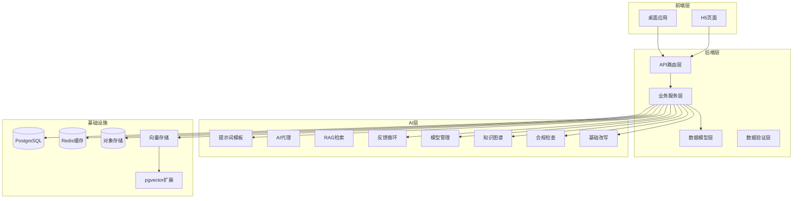

**图表来源**
- [backend/main.py:1-138](file://backend/main.py#L1-L138)
- [backend/app/api/endpoints/mvp_routes.py:1-686](file://backend/app/api/endpoints/mvp_routes.py#L1-L686)

**章节来源**
- [backend/README.md:90-107](file://backend/README.md#L90-L107)
- [backend/pyproject.toml:1-47](file://backend/pyproject.toml#L1-L47)

## 核心组件

### 1. 收件箱管理系统
负责内容采集、筛选和初步处理，支持多平台内容来源的统一管理。

### 2. 素材库管理
提供内容存储、标签管理和版本控制功能，支持内容的结构化组织和检索。

### 3. 知识库系统
构建行业知识体系，包含爆款内容、平台规则、风险提示等多个维度的知识库。

### 4. AI生成引擎
核心的AI内容生成服务，支持多风格、多平台的内容创作。

### 5. 合规审核系统
**更新** 内置双引擎合规检查机制，包括规则匹配和大模型语义检测，确保生成内容符合监管要求。

### 6. 基础改写服务
**新增** 基于知识库上下文生成高质量基础改写版本，作为多风格版本生成的起点。

### 7. 反馈优化系统
**新增** 基于用户反馈的学习系统，自动优化知识库质量和生成效果。

### 8. 知识图谱系统
**新增** 支持知识条目间的关系建模和图增强检索。

### 9. 模型管理系统
**新增** 多模型池配置和管理，支持本地Ollama和云端模型切换。

**章节来源**
- [backend/app/services/mvp_inbox_service.py:1-136](file://backend/app/services/mvp_inbox_service.py#L1-L136)
- [backend/app/services/mvp_material_service.py:1-200](file://backend/app/services/mvp_material_service.py#L1-L200)
- [backend/app/services/mvp_knowledge_service.py:1-794](file://backend/app/services/mvp_knowledge_service.py#L1-L794)
- [backend/app/services/mvp_generate_service.py:1-802](file://backend/app/services/mvp_generate_service.py#L1-L802)
- [backend/app/services/mvp_rewrite_service.py:1-166](file://backend/app/services/mvp_rewrite_service.py#L1-L166)
- [backend/app/services/feedback_service.py:1-486](file://backend/app/services/feedback_service.py#L1-L486)
- [backend/app/services/knowledge_graph_service.py:1-621](file://backend/app/services/knowledge_graph_service.py#L1-L621)
- [backend/app/services/model_manager_service.py:1-396](file://backend/app/services/model_manager_service.py#L1-L396)

## 架构概览

系统采用分层架构设计，确保各组件间的松耦合和高内聚：

```mermaid
graph TD
subgraph "表现层"
WebUI[Web界面]
MobileUI[移动端界面]
end
subgraph "API网关层"
Router[路由分发]
Auth[身份认证]
RateLimit[限流控制]
end
subgraph "业务逻辑层"
InboxSvc[MVP收件箱服务]
MaterialSvc[MVP素材服务]
KnowledgeSvc[MVP知识服务]
GenerateSvc[MVP生成服务]
RewriteSvc[MVP改写服务]
ComplianceSvc[MVP合规服务]
FeedbackSvc[反馈优化服务]
ModelMgrSvc[模型管理服务]
KnowledgeGraphSvc[知识图谱服务]
BaseRewriteSvc[基础改写服务]
end
subgraph "数据访问层"
DB[PostgreSQL数据库]
Cache[Redis缓存]
Vector[向量存储]
PGVector[pgvector扩展]
End
subgraph "AI服务层"
LLM[大语言模型]
Embedding[向量嵌入]
OCR[光学字符识别]
Cloud[火山方舟]
Local[本地Ollama]
end
WebUI --> Router
MobileUI --> Router
Router --> Auth
Router --> InboxSvc
Router --> MaterialSvc
Router --> KnowledgeSvc
Router --> GenerateSvc
Router --> RewriteSvc
Router --> ComplianceSvc
Router --> FeedbackSvc
Router --> ModelMgrSvc
Router --> KnowledgeGraphSvc
Router --> BaseRewriteSvc
InboxSvc --> DB
MaterialSvc --> DB
KnowledgeSvc --> DB
GenerateSvc --> LLM
GenerateSvc --> Embedding
GenerateSvc --> Cloud
GenerateSvc --> Local
FeedbackSvc --> DB
FeedbackSvc --> PGVector
ModelMgrSvc --> Local
ModelMgrSvc --> Cloud
KnowledgeGraphSvc --> PGVector
ComplianceSvc --> DB
BaseRewriteSvc --> LLM
BaseRewriteSvc --> Embedding
BaseRewriteSvc --> Cloud
BaseRewriteSvc --> Local
DB --> Vector
DB --> Cache
```

**图表来源**
- [backend/app/api/endpoints/mvp_routes.py:28-686](file://backend/app/api/endpoints/mvp_routes.py#L28-L686)
- [backend/app/services/mvp_generate_service.py:15-802](file://backend/app/services/mvp_generate_service.py#L15-L802)

## 详细组件分析

### AI生成服务组件

AI生成服务是系统的核心组件，实现了完整的多版本内容生成流程：

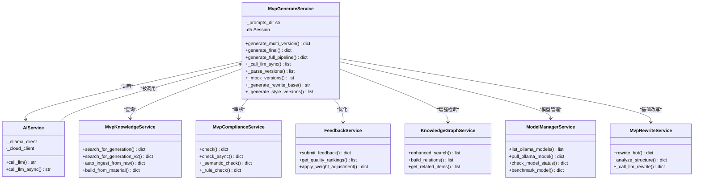

**图表来源**
- [backend/app/services/mvp_generate_service.py:15-802](file://backend/app/services/mvp_generate_service.py#L15-L802)
- [backend/app/services/mvp_knowledge_service.py:13-794](file://backend/app/services/mvp_knowledge_service.py#L13-L794)
- [backend/app/services/feedback_service.py:16-486](file://backend/app/services/feedback_service.py#L16-L486)
- [backend/app/services/knowledge_graph_service.py:30-621](file://backend/app/services/knowledge_graph_service.py#L30-L621)
- [backend/app/services/model_manager_service.py:22-396](file://backend/app/services/model_manager_service.py#L22-L396)

#### 全流程生成序列图

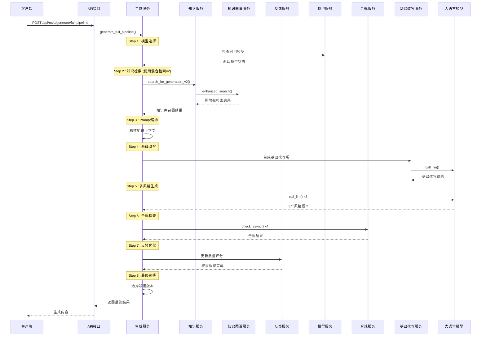

**图表来源**
- [backend/app/services/mvp_generate_service.py:242-393](file://backend/app/services/mvp_generate_service.py#L242-L393)

**章节来源**
- [backend/app/services/mvp_generate_service.py:15-802](file://backend/app/services/mvp_generate_service.py#L15-L802)

### 基础改写服务

**新增** 基础改写服务专门处理知识库增强的基础改写版本生成：

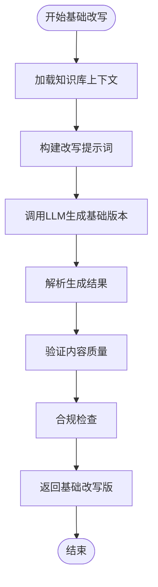

**图表来源**
- [backend/app/services/mvp_generate_service.py:441-517](file://backend/app/services/mvp_generate_service.py#L441-L517)

**章节来源**
- [backend/app/services/mvp_generate_service.py:441-517](file://backend/app/services/mvp_generate_service.py#L441-L517)

### 爆款仿写服务

爆款仿写服务专门处理内容结构分析和仿写生成：


**图表来源**
- [backend/app/services/mvp_rewrite_service.py:17-166](file://backend/app/services/mvp_rewrite_service.py#L17-L166)

**章节来源**
- [backend/app/services/mvp_rewrite_service.py:12-166](file://backend/app/services/mvp_rewrite_service.py#L12-L166)

### 知识库管理系统

知识库系统实现了多维度的知识管理和检索功能：

```mermaid
erDiagram
MVP_KNOWLEDGE_ITEM {
int id PK
string title
text content
string category
string platform
string audience
string style
int source_material_id FK
int use_count
datetime created_at
string library_type
string layer
string risk_level
string topic
string content_type
string opening_type
string hook_sentence
string cta_style
string summary
string source_url
string author
}
MVP_MATERIAL_ITEM {
int id PK
string platform
string title
text content
string source_url
string author
string risk_level
int source_inbox_id FK
int use_count
datetime created_at
}
MVP_TAG {
int id PK
string name
string type
datetime created_at
}
MVP_MATERIAL_TAG_REL {
int material_id FK
int tag_id FK
}
MVP_KNOWLEDGE_ITEM }o--|| MVP_MATERIAL_ITEM : "来源于"
MVP_MATERIAL_ITEM }o--o{ MVP_TAG : "关联"
}
```

**图表来源**
- [backend/app/models/models.py:1-200](file://backend/app/models/models.py#L1-L200)

**章节来源**
- [backend/app/services/mvp_knowledge_service.py:13-794](file://backend/app/services/mvp_knowledge_service.py#L13-L794)

## 反馈驱动优化系统

**新增** 反馈驱动优化系统通过收集用户反馈自动优化生成质量和知识库质量。

### 反馈收集与处理

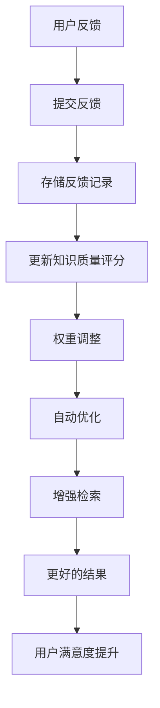

### 质量评分机制

系统实现了一套完整的质量评分和权重调整机制：

| 评分等级 | 质量范围 | 权重倍数 | 描述 |
|---------|---------|---------|------|
| 优秀 | 0.8-1.0 | ×1.5 | 高质量内容，优先推荐 |
| 良好 | 0.6-0.8 | ×1.2 | 质量稳定，正常使用 |
| 一般 | 0.3-0.6 | ×1.0 | 需要改进的内容 |
| 较差 | 0.1-0.3 | ×0.5 | 低质量内容，降权处理 |
| 冷数据 | 0.0-0.1 | ×0.3 | 30天未使用，标记清理 |

**章节来源**
- [backend/app/services/feedback_service.py:16-486](file://backend/app/services/feedback_service.py#L16-L486)

## 知识图谱增强检索

**新增** 知识图谱系统通过关系建模和图遍历提供增强的检索能力。

### 关系类型定义

系统支持以下五种关系类型：

1. **相似主题 (similar_topic)** - 基于向量相似度发现
2. **同人群 (same_audience)** - 共享目标受众
3. **同平台 (same_platform)** - 共享发布平台
4. **互补内容 (complementary)** - 不同但相关的主题
5. **衍生关系 (derived_from)** - 派生或参考内容

### 图增强检索流程

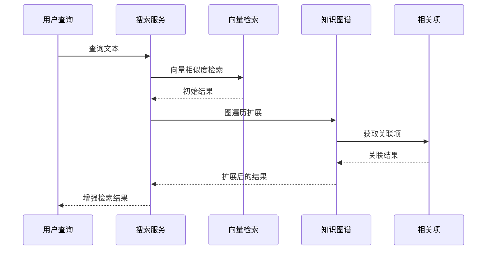

### 主题聚类分析

系统能够自动发现和分析主题簇：

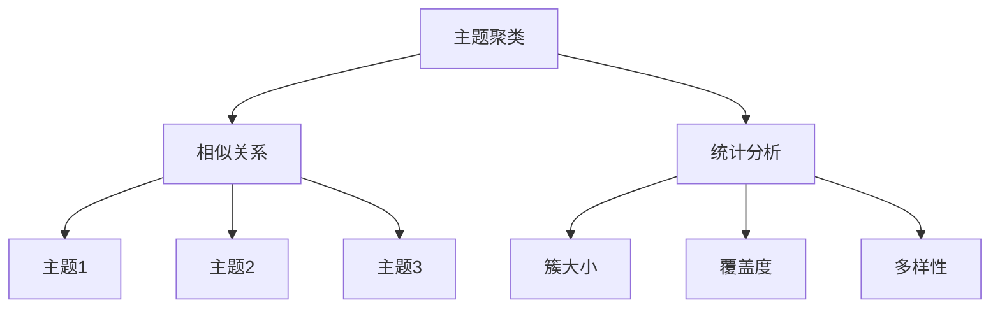

**章节来源**
- [backend/app/services/knowledge_graph_service.py:30-621](file://backend/app/services/knowledge_graph_service.py#L30-L621)

## 模型管理系统

**新增** 模型管理系统支持多模型池配置和动态管理。

### 模型池配置

系统支持两种类型的模型池：

#### Embedding模型池
| 模型名称 | 提供商 | 维度 | 描述 | 用途 |
|---------|-------|------|------|------|
| doubao-embedding-large-text | 火山方舟 | 2048 | 优先使用 | 向量检索 |
| nomic-embed-text | Ollama | 768 | 降级备选 | 本地嵌入 |
| qwen3-embedding | Ollama | 1024 | 通义模型 | 多样化选择 |
| all-minilm | Ollama | 384 | 最小化模型 | 轻量级任务 |

#### LLM模型池
| 模型名称 | 提供商 | 描述 | 用途 |
|---------|-------|------|------|
| qwen2.5 | Ollama | 本地通义千问 | 主要生成模型 |
| doubao-1-5-pro-32k | 火山方舟 | 豆包专业模型 | 云端生成 |

### 模型管理功能

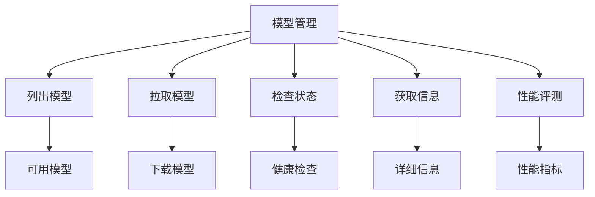

**章节来源**
- [backend/app/services/model_manager_service.py:22-396](file://backend/app/services/model_manager_service.py#L22-L396)
- [backend/app/core/config.py:87-133](file://backend/app/core/config.py#L87-L133)

## 合规检查集成

**更新** 系统集成了双引擎合规检查机制，包括规则匹配和大模型语义检测，确保生成内容符合监管要求。

### 合规检查流程

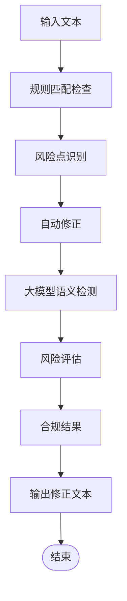

### 双引擎合规检查

系统采用双引擎合规检查机制：

#### 规则匹配引擎
- **关键词匹配**：基于预定义关键词库进行匹配
- **正则表达式**：检测绝对承诺、夸大宣传等违规表达
- **风险评分**：根据风险级别计算风险分数

#### 大模型语义检测引擎
- **隐含风险识别**：检测变相的绝对承诺和模糊表达
- **合规建议**：提供具体的修改建议
- **风险点标注**：标注风险点的严重程度

### 合规检查结果结构

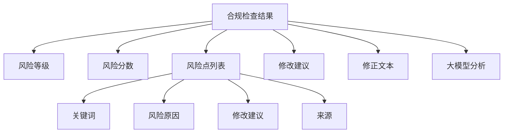

**章节来源**
- [backend/app/services/mvp_compliance_service.py:14-425](file://backend/app/services/mvp_compliance_service.py#L14-L425)

## 依赖关系分析

系统采用模块化设计，各组件间依赖关系清晰：

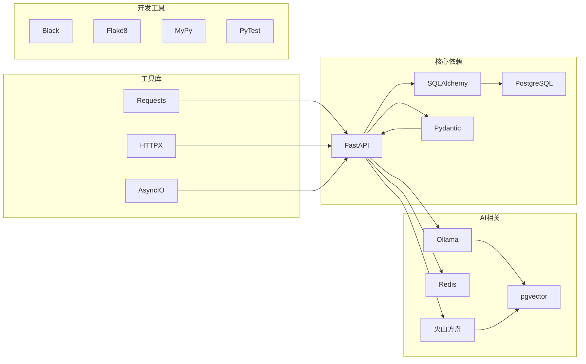

**图表来源**
- [backend/pyproject.toml:7-31](file://backend/pyproject.toml#L7-L31)

**章节来源**
- [backend/pyproject.toml:1-47](file://backend/pyproject.toml#L1-L47)

## 性能考虑

### 1. 数据库优化
- 使用PostgreSQL作为主数据库，支持复杂查询和事务处理
- 实现索引优化和查询缓存机制
- 支持分页查询和条件过滤

### 2. AI服务优化
- 实现异步调用机制，避免阻塞等待
- 集成Redis缓存，减少重复计算
- 支持本地Ollama和云端模型切换

### 3. 文件处理优化
- 使用流式处理大文件
- 实现增量备份和恢复机制
- 支持并发处理多个任务

### 4. **新增** 基础改写优化
- 基础改写版本作为第一个选项，减少用户等待时间
- 并发执行多风格版本生成，提高整体效率
- 缓存知识库上下文，避免重复计算

### 5. **新增** 合规检查优化
- 双引擎并发检查，提高检查效率
- 异步后台合规检测，不阻塞主流程
- 风险点合并和去重，减少重复处理

### 6. **新增** 知识图谱优化
- pgvector扩展提供高效的向量相似度计算
- 关系索引优化图遍历性能
- 批量关系构建支持大规模知识库

### 7. **新增** 模型管理优化
- 模型状态缓存减少API调用
- 性能基准测试支持模型选择
- 多模型池配置提高系统弹性

## 故障排除指南

### 常见问题及解决方案

#### 1. 数据库连接问题
- **症状**：应用启动时报数据库连接错误
- **解决方案**：检查DATABASE_URL配置，确认PostgreSQL服务正常运行

#### 2. AI模型调用失败
- **症状**：内容生成接口返回错误
- **解决方案**：检查Ollama服务状态，确认模型加载完成

#### 3. Redis连接问题
- **症状**：限流功能异常
- **解决方案**：检查Redis服务器状态和连接配置

#### 4. 文件上传失败
- **症状**：素材上传报错
- **解决方案**：检查存储权限和磁盘空间

#### 5. **新增** 基础改写版本生成失败
- **症状**：生成流程中断，无法获得基础改写版
- **解决方案**：检查知识库上下文构建，确认LLM调用正常

#### 6. **新增** 合规检查异常
- **症状**：合规检查返回错误或超时
- **解决方案**：检查合规规则配置，确认大模型服务可用

#### 7. **新增** 知识图谱构建失败
- **症状**：关系构建报错或pgvector相关错误
- **解决方案**：检查pgvector扩展安装，确认向量维度配置正确

#### 8. **新增** 模型管理异常
- **症状**：模型列表为空或拉取失败
- **解决方案**：检查Ollama服务状态，确认网络连接正常

**章节来源**
- [backend/README.md:223-244](file://backend/README.md#L223-L244)

## 结论

MVP AI内容生成系统是一个功能完整、架构清晰的智能内容创作平台。系统通过模块化设计实现了内容采集、处理、生成、审核和发布的完整闭环，为金融行业的内容营销提供了强有力的技术支撑。

**更新** 系统现已集成多项重要功能：基础改写版本作为第一个选项提供高质量初稿，双引擎合规检查确保内容合规性，反馈驱动优化、知识图谱增强检索和模型管理三大核心能力显著提升了系统的智能化水平和用户体验。

系统的主要优势包括：
- **完整的功能覆盖**：从内容采集到发布的全链路支持
- **智能化程度高**：集成AI生成、反馈优化、知识图谱、模型管理和合规检查
- **扩展性强**：模块化设计便于功能扩展和维护
- **技术先进**：采用最新的技术栈和最佳实践
- **学习能力强**：通过用户反馈持续优化生成质量
- **检索能力强大**：基于知识图谱的智能检索和推荐
- **模型管理灵活**：支持多模型池配置和动态管理
- **合规保障完善**：双引擎合规检查确保内容安全合规
- **用户体验优化**：基础改写版本提供更好的初始体验

未来可以考虑的功能增强方向：
- 增强多模态内容处理能力
- 优化AI生成质量和效率
- 扩展更多平台的内容适配
- 加强数据分析和洞察功能
- 集成更多AI模型和算法
- 增强实时协作和版本管理功能
- 扩展合规检查的覆盖范围和深度