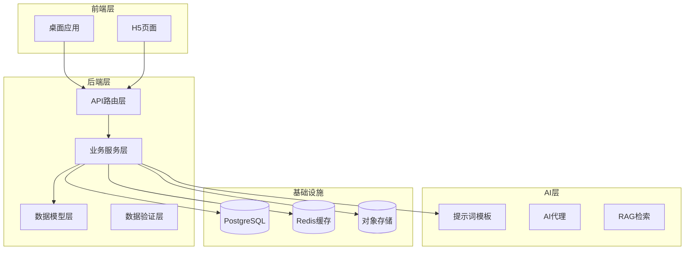
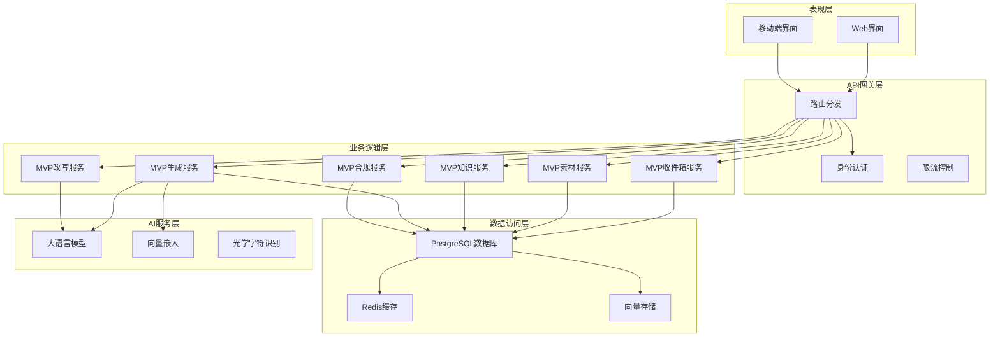
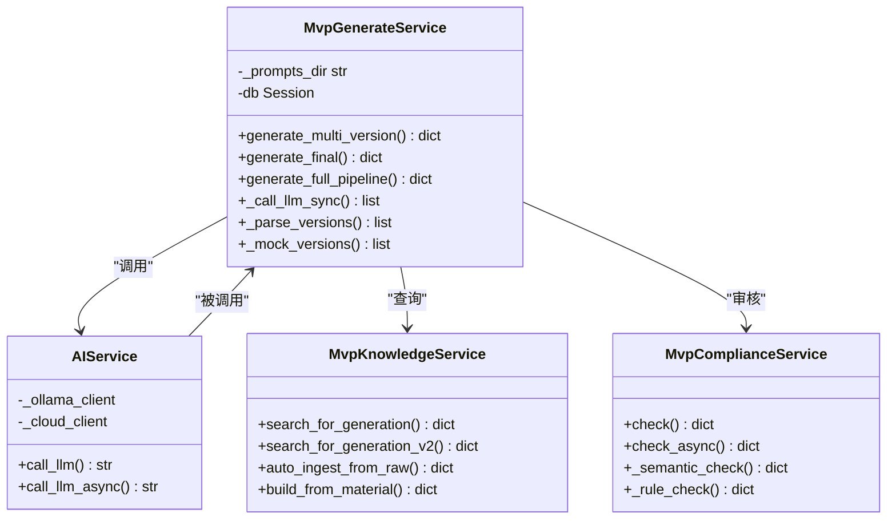
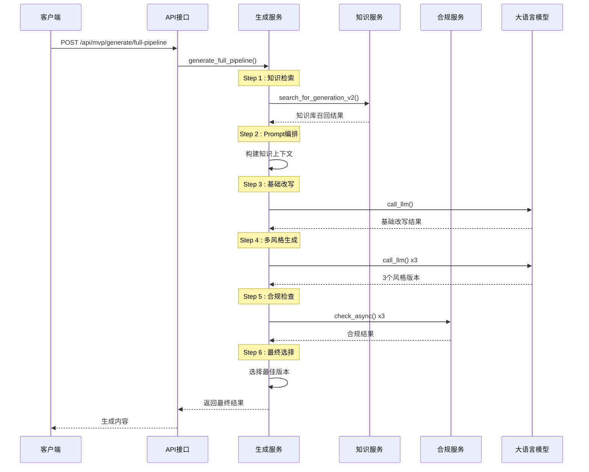
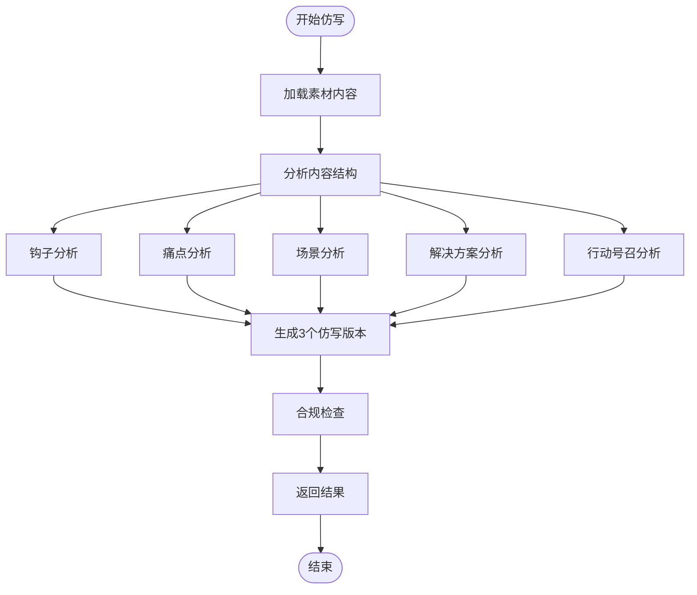
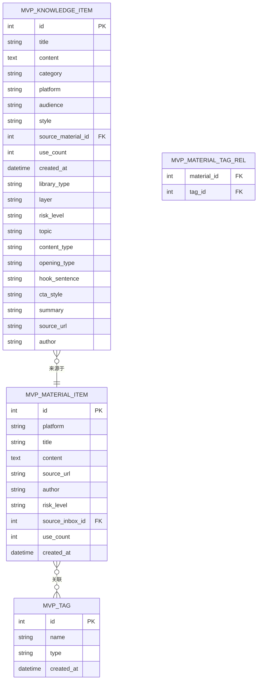
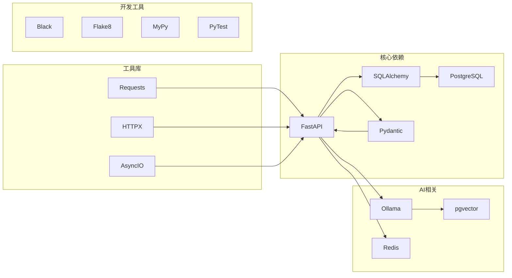

# MVP AI内容生成系统

<cite>
**本文档引用的文件**
- [backend/README.md](file://backend/README.md)
- [backend/pyproject.toml](file://backend/pyproject.toml)
- [backend/main.py](file://backend/main.py)
- [backend/app/main.py](file://backend/app/main.py)
- [backend/backend.spec](file://backend/backend.spec)
- [backend/app/services/mvp_generate_service.py](file://backend/app/services/mvp_generate_service.py)
- [backend/app/services/mvp_rewrite_service.py](file://backend/app/services/mvp_rewrite_service.py)
- [backend/app/services/mvp_inbox_service.py](file://backend/app/services/mvp_inbox_service.py)
- [backend/app/services/mvp_knowledge_service.py](file://backend/app/services/mvp_knowledge_service.py)
- [backend/app/schemas/mvp_schemas.py](file://backend/app/schemas/mvp_schemas.py)
- [backend/app/api/endpoints/mvp_routes.py](file://backend/app/api/endpoints/mvp_routes.py)
- [backend/app/models/models.py](file://backend/app/models/models.py)
- [backend/app/ai/prompts/mvp_general_v1.txt](file://backend/app/ai/prompts/mvp_general_v1.txt)
- [backend/app/ai/prompts/mvp_hot_rewrite_v1.txt](file://backend/app/ai/prompts/mvp_hot_rewrite_v1.txt)
</cite>

## 目录
1. [简介](#简介)
2. [项目结构](#项目结构)
3. [核心组件](#核心组件)
4. [架构概览](#架构概览)
5. [详细组件分析](#详细组件分析)
6. [依赖关系分析](#依赖关系分析)
7. [性能考虑](#性能考虑)
8. [故障排除指南](#故障排除指南)
9. [结论](#结论)

## 简介

MVP AI内容生成系统是一个基于FastAPI构建的智能内容创作平台，专为金融行业内容营销设计。该系统集成了AI驱动的内容生成、合规审核、知识管理和素材处理等功能，旨在帮助用户高效创建符合各平台调性的获客内容。

系统采用现代化的技术栈，包括FastAPI + PostgreSQL + SQLAlchemy + Pydantic + Ollama + Redis，提供了完整的端到端内容创作解决方案。核心功能涵盖内容采集、结构化处理、多风格生成、合规检查和发布管理等环节。

## 项目结构

该项目采用模块化架构设计，主要分为以下几个核心层次：

**图表来源**
- [backend/main.py:1-138](file://backend/main.py#L1-L138)
- [backend/app/api/endpoints/mvp_routes.py:1-686](file://backend/app/api/endpoints/mvp_routes.py#L1-L686)

**章节来源**
- [backend/README.md:90-107](file://backend/README.md#L90-L107)
- [backend/pyproject.toml:1-47](file://backend/pyproject.toml#L1-L47)

## 核心组件

### 1. 收件箱管理系统
负责内容采集、筛选和初步处理，支持多平台内容来源的统一管理。

### 2. 素材库管理
提供内容存储、标签管理和版本控制功能，支持内容的结构化组织和检索。

### 3. 知识库系统
构建行业知识体系，包含爆款内容、平台规则、风险提示等多个维度的知识库。

### 4. AI生成引擎
核心的AI内容生成服务，支持多风格、多平台的内容创作。

### 5. 合规审核系统
内置双重合规检查机制，确保生成内容符合监管要求。

**章节来源**
- [backend/app/services/mvp_inbox_service.py:1-136](file://backend/app/services/mvp_inbox_service.py#L1-L136)
- [backend/app/services/mvp_material_service.py:1-200](file://backend/app/services/mvp_material_service.py#L1-L200)
- [backend/app/services/mvp_knowledge_service.py:1-794](file://backend/app/services/mvp_knowledge_service.py#L1-L794)
- [backend/app/services/mvp_generate_service.py:1-802](file://backend/app/services/mvp_generate_service.py#L1-L802)

## 架构概览

系统采用分层架构设计，确保各组件间的松耦合和高内聚：

**图表来源**
- [backend/app/api/endpoints/mvp_routes.py:28-686](file://backend/app/api/endpoints/mvp_routes.py#L28-L686)
- [backend/app/services/mvp_generate_service.py:15-802](file://backend/app/services/mvp_generate_service.py#L15-L802)

## 详细组件分析

### AI生成服务组件

AI生成服务是系统的核心组件，实现了完整的多版本内容生成流程：

**图表来源**
- [backend/app/services/mvp_generate_service.py:15-802](file://backend/app/services/mvp_generate_service.py#L15-L802)
- [backend/app/services/mvp_knowledge_service.py:13-794](file://backend/app/services/mvp_knowledge_service.py#L13-L794)

#### 全流程生成序列图

**图表来源**
- [backend/app/services/mvp_generate_service.py:242-393](file://backend/app/services/mvp_generate_service.py#L242-L393)

**章节来源**
- [backend/app/services/mvp_generate_service.py:15-802](file://backend/app/services/mvp_generate_service.py#L15-L802)

### 爆款仿写服务

爆款仿写服务专门处理内容结构分析和仿写生成：

**图表来源**
- [backend/app/services/mvp_rewrite_service.py:17-166](file://backend/app/services/mvp_rewrite_service.py#L17-L166)

**章节来源**
- [backend/app/services/mvp_rewrite_service.py:12-166](file://backend/app/services/mvp_rewrite_service.py#L12-L166)

### 知识库管理系统

知识库系统实现了多维度的知识管理和检索功能：

**图表来源**
- [backend/app/models/models.py:1-200](file://backend/app/models/models.py#L1-L200)

**章节来源**
- [backend/app/services/mvp_knowledge_service.py:13-794](file://backend/app/services/mvp_knowledge_service.py#L13-L794)

## 依赖关系分析

系统采用模块化设计，各组件间依赖关系清晰：

**图表来源**
- [backend/pyproject.toml:7-31](file://backend/pyproject.toml#L7-L31)

**章节来源**
- [backend/pyproject.toml:1-47](file://backend/pyproject.toml#L1-L47)

## 性能考虑

### 1. 数据库优化
- 使用PostgreSQL作为主数据库，支持复杂查询和事务处理
- 实现索引优化和查询缓存机制
- 支持分页查询和条件过滤

### 2. AI服务优化
- 实现异步调用机制，避免阻塞等待
- 集成Redis缓存，减少重复计算
- 支持本地Ollama和云端模型切换

### 3. 文件处理优化
- 使用流式处理大文件
- 实现增量备份和恢复机制
- 支持并发处理多个任务

## 故障排除指南

### 常见问题及解决方案

#### 1. 数据库连接问题
- **症状**：应用启动时报数据库连接错误
- **解决方案**：检查DATABASE_URL配置，确认PostgreSQL服务正常运行

#### 2. AI模型调用失败
- **症状**：内容生成接口返回错误
- **解决方案**：检查Ollama服务状态，确认模型加载完成

#### 3. Redis连接问题
- **症状**：限流功能异常
- **解决方案**：检查Redis服务器状态和连接配置

#### 4. 文件上传失败
- **症状**：素材上传报错
- **解决方案**：检查存储权限和磁盘空间

**章节来源**
- [backend/README.md:223-244](file://backend/README.md#L223-L244)

## 结论

MVP AI内容生成系统是一个功能完整、架构清晰的智能内容创作平台。系统通过模块化设计实现了内容采集、处理、生成、审核和发布的完整闭环，为金融行业的内容营销提供了强有力的技术支撑。

系统的主要优势包括：
- **完整的功能覆盖**：从内容采集到发布的全链路支持
- **智能化程度高**：集成AI生成和合规审核功能
- **扩展性强**：模块化设计便于功能扩展和维护
- **技术先进**：采用最新的技术栈和最佳实践

未来可以考虑的功能增强方向：
- 增强多模态内容处理能力
- 优化AI生成质量和效率
- 扩展更多平台的内容适配
- 加强数据分析和洞察功能