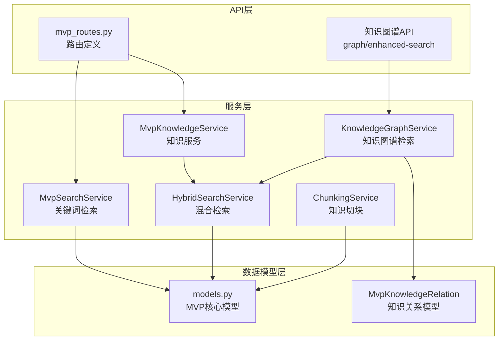
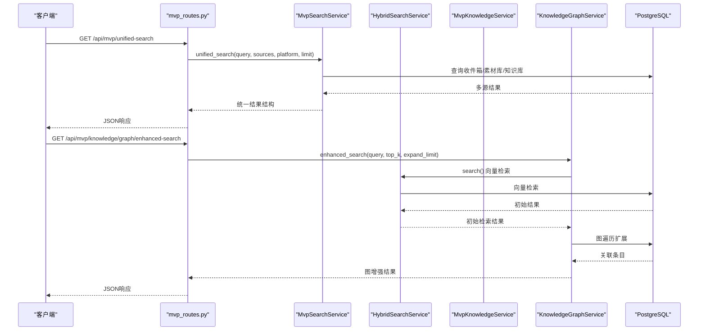
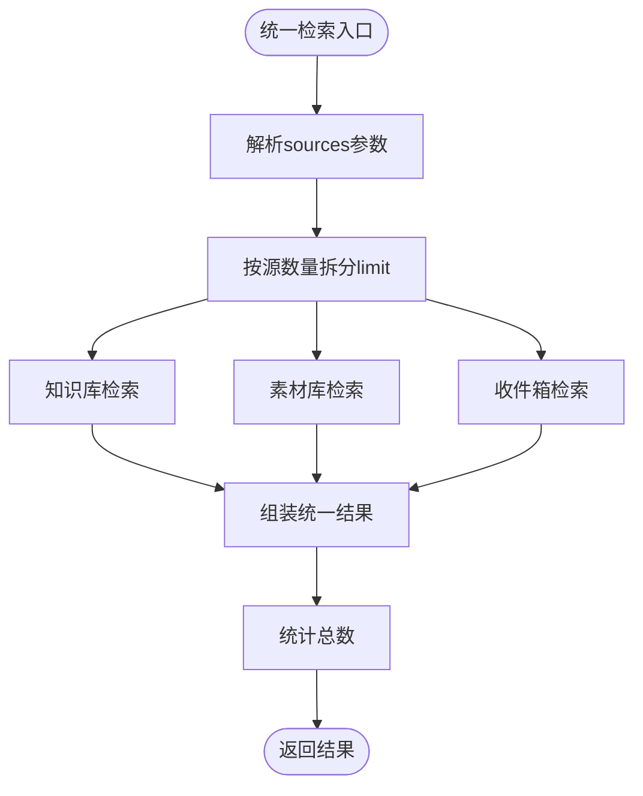
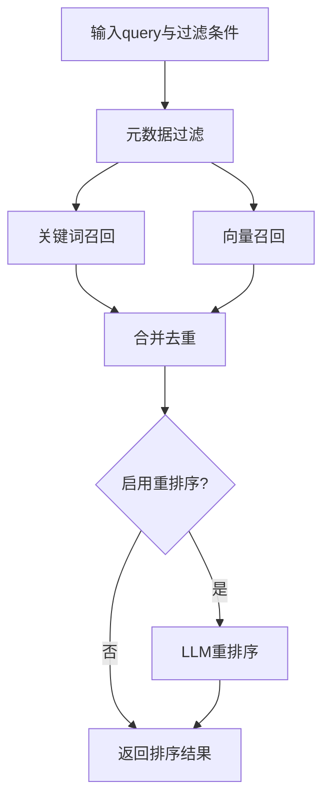
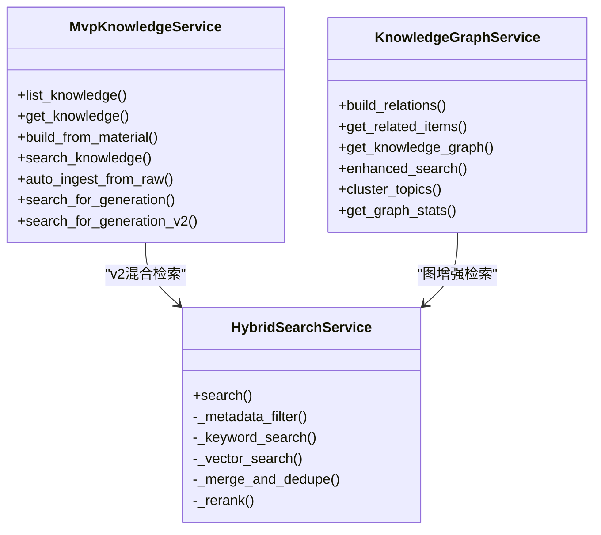
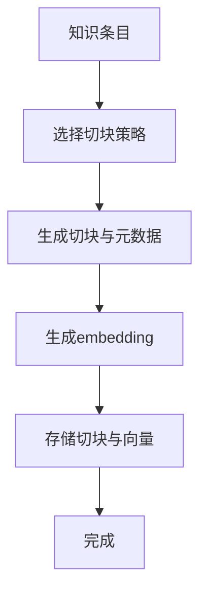
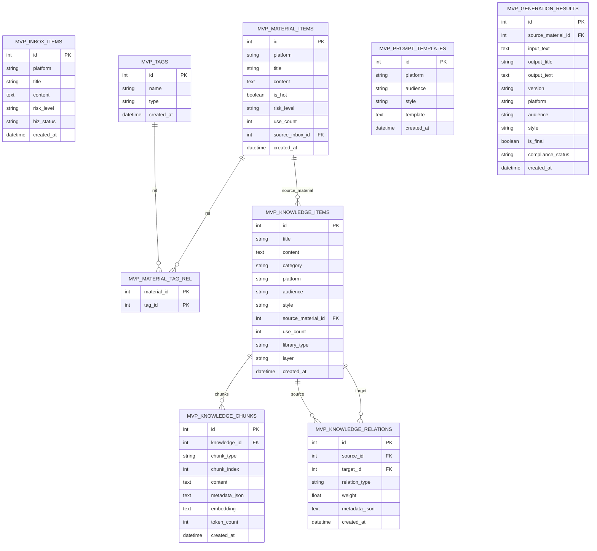
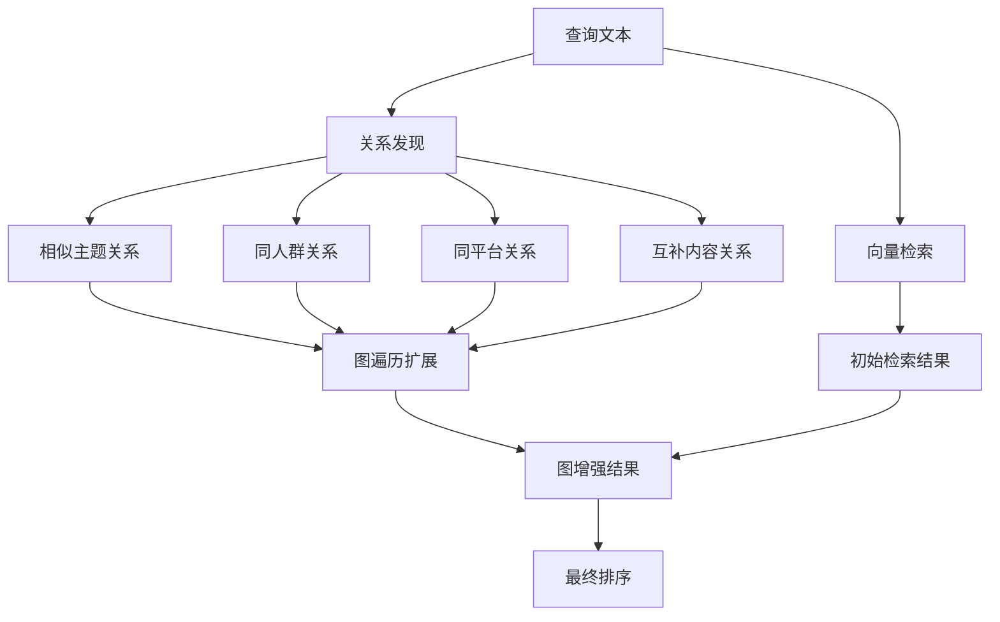
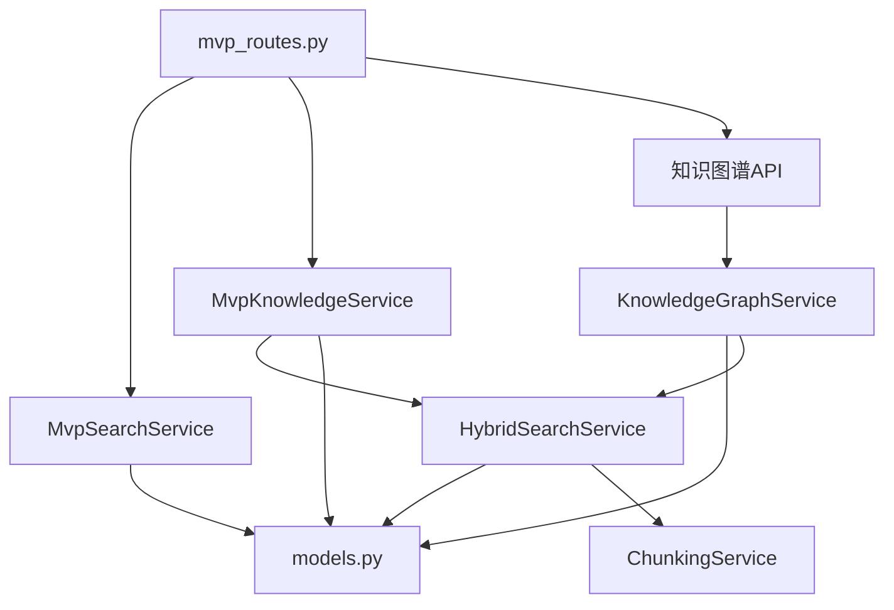

# MVP搜索检索系统

<cite>
**本文档引用的文件**
- [mvp_search_service.py](file://backend/app/services/mvp_search_service.py)
- [mvp_schemas.py](file://backend/app/schemas/mvp_schemas.py)
- [mvp_routes.py](file://backend/app/api/endpoints/mvp_routes.py)
- [mvp_knowledge_service.py](file://backend/app/services/mvp_knowledge_service.py)
- [models.py](file://backend/app/models/models.py)
- [hybrid_search_service.py](file://backend/app/services/hybrid_search_service.py)
- [chunking_service.py](file://backend/app/services/chunking_service.py)
- [knowledge_graph_service.py](file://backend/app/services/knowledge_graph_service.py)
- [README.md](file://backend/README.md)
- [README.md](file://README.md)
</cite>

## 更新摘要
**变更内容**
- 新增知识图谱检索能力，支持图遍历和关系发现功能
- 增强混合检索算法，集成图增强检索模式
- 新增知识关系建模和管理功能
- 扩展API端点以支持知识图谱操作

## 目录
1. [简介](#简介)
2. [项目结构](#项目结构)
3. [核心组件](#核心组件)
4. [架构总览](#架构总览)
5. [详细组件分析](#详细组件分析)
6. [知识图谱检索系统](#知识图谱检索系统)
7. [依赖关系分析](#依赖关系分析)
8. [性能考虑](#性能考虑)
9. [故障排除指南](#故障排除指南)
10. [结论](#结论)

## 简介
本项目为「MVP搜索检索系统」，围绕收件箱、素材库、知识库三大核心数据源提供统一检索能力，并预留向量化检索能力。系统采用关键词匹配与向量检索相结合的混合检索策略，支持多维度元数据过滤、关键词召回、向量相似度匹配、结果重排序等能力，旨在为内容创作与合规审核提供高效的知识检索支撑。

**更新** 新增知识图谱检索能力，通过关系建模和图遍历技术，增强混合检索算法，支持相似主题发现、同人群/同平台关联、互补内容推荐等功能。

## 项目结构
后端采用 FastAPI + SQLAlchemy 架构，MVP搜索检索系统位于 `backend/app/services/` 与 `backend/app/api/endpoints/` 目录中，核心模型定义于 `backend/app/models/models.py`，并配套向量化检索所需的切块与嵌入服务。

**图表来源**
- [mvp_routes.py:1-1401](file://backend/app/api/endpoints/mvp_routes.py#L1-L1401)
- [knowledge_graph_service.py:30-621](file://backend/app/services/knowledge_graph_service.py#L30-L621)
- [models.py:1172-1190](file://backend/app/models/models.py#L1172-L1190)

**章节来源**
- [README.md:90-107](file://backend/README.md#L90-L107)
- [README.md:255-306](file://README.md#L255-L306)

## 核心组件
- 搜索服务（MvpSearchService）：提供收件箱、素材库、知识库的关键词检索，支持多条件过滤与分页，统一检索接口整合多源结果。
- 混合检索服务（HybridSearchService）：基于元数据过滤 + 关键词召回 + 向量召回 + 合并去重 + 重排序的完整流程，支持可插拔的rerank。
- 知识服务（MvpKnowledgeService）：负责知识条目的构建、检索与结构化抽取，支持v1关键词检索与v2混合检索降级。
- 知识切块服务（ChunkingService）：按分库策略对知识进行切块，生成embedding并入库，为向量检索做准备。
- **知识图谱服务（KnowledgeGraphService）**：**新增** 提供知识条目关系建模、图遍历检索、相似主题发现、关系发现等功能。
- 数据模型（models.py）：定义MVP核心表结构，包括收件箱、素材库、知识库、知识切块、**知识关系**等。

**章节来源**
- [mvp_search_service.py:7-177](file://backend/app/services/mvp_search_service.py#L7-L177)
- [hybrid_search_service.py:42-395](file://backend/app/services/hybrid_search_service.py#L42-L395)
- [mvp_knowledge_service.py:13-794](file://backend/app/services/mvp_knowledge_service.py#L13-L794)
- [chunking_service.py:26-249](file://backend/app/services/chunking_service.py#L26-L249)
- [knowledge_graph_service.py:30-621](file://backend/app/services/knowledge_graph_service.py#L30-L621)
- [models.py:937-1190](file://backend/app/models/models.py#L937-L1190)

## 架构总览
系统采用「API路由 → 服务层 → 数据模型」的分层架构，搜索检索贯穿关键词与向量两条路径，并通过统一的检索接口对外提供能力。

**更新** 新增知识图谱检索流程，支持图增强检索模式，结合向量检索和关系发现技术。

**图表来源**
- [mvp_routes.py:1380-1401](file://backend/app/api/endpoints/mvp_routes.py#L1380-L1401)
- [knowledge_graph_service.py:428-499](file://backend/app/services/knowledge_graph_service.py#L428-L499)
- [hybrid_search_service.py:49-110](file://backend/app/services/hybrid_search_service.py#L49-L110)

## 详细组件分析

### 搜索服务（MvpSearchService）
- 关键词检索：支持平台、受众、热度等条件过滤，最多取前5个关键词进行模糊匹配，按使用频次排序。
- 统一检索：整合知识库、素材库、收件箱三类结果，按来源字段标注，支持limit拆分。
- 建议与热词：提供搜索建议与热门关键词，辅助用户输入与检索优化。

**图表来源**
- [mvp_search_service.py:75-131](file://backend/app/services/mvp_search_service.py#L75-L131)

**章节来源**
- [mvp_search_service.py:11-177](file://backend/app/services/mvp_search_service.py#L11-L177)

### 混合检索服务（HybridSearchService）
- 元数据过滤：按library_type、platform、audience、topic、content_type等过滤知识条目ID集合。
- 关键词召回：在知识切块表中按关键词匹配召回。
- 向量召回：生成查询向量，与有embedding的切块计算余弦相似度。
- 合并去重：先关键词后向量，去重并保留最高分，再取前K条。
- 重排序：调用LLM对候选进行重排序，提升相关性。

**图表来源**
- [hybrid_search_service.py:49-110](file://backend/app/services/hybrid_search_service.py#L49-L110)
- [hybrid_search_service.py:280-371](file://backend/app/services/hybrid_search_service.py#L280-L371)

**章节来源**
- [hybrid_search_service.py:42-395](file://backend/app/services/hybrid_search_service.py#L42-L395)

### 知识服务（MvpKnowledgeService）
- 知识检索：v1关键词检索并更新use_count；v2混合检索，支持library_type、platform、audience、topic等维度召回。
- 自动入库：从原始内容抽取结构化字段，推断分库类型与层级，创建知识条目并触发切块向量化。
- 生成召回：为内容生成提供多维度知识召回，包括爆款内容、人群洞察、平台规则、风险规避、语气模板、CTA模板等。

**图表来源**
- [mvp_knowledge_service.py:13-794](file://backend/app/services/mvp_knowledge_service.py#L13-L794)
- [hybrid_search_service.py:42-395](file://backend/app/services/hybrid_search_service.py#L42-L395)
- [knowledge_graph_service.py:30-621](file://backend/app/services/knowledge_graph_service.py#L30-L621)

**章节来源**
- [mvp_knowledge_service.py:17-794](file://backend/app/services/mvp_knowledge_service.py#L17-L794)

### 知识切块服务（ChunkingService）
- 切块策略：按library_type选择策略（帖子级、段落级、规则级、模板级），生成切块元数据。
- 向量化：调用embedding服务生成向量，存储至知识切块表，供向量检索使用。
- 重新切块：删除旧切块后按新策略重建，确保检索质量。

**图表来源**
- [chunking_service.py:33-101](file://backend/app/services/chunking_service.py#L33-L101)
- [chunking_service.py:102-244](file://backend/app/services/chunking_service.py#L102-L244)

**章节来源**
- [chunking_service.py:26-249](file://backend/app/services/chunking_service.py#L26-L249)

### 数据模型（MVP核心表）
- 收件箱条目（MvpInboxItem）：采集内容进入的第一站，包含平台、标题、内容、风险等级、业务状态等。
- 素材库条目（MvpMaterialItem）：经过筛选的优质素材，包含热度、风险等级、使用计数等。
- 知识库条目（MvpKnowledgeItem）：结构化的可复用知识，包含分类、受众、风格、主题、内容类型、分库类型、层级等增强字段。
- 知识切块（MvpKnowledgeChunk）：支持向量检索的切块表，包含切块类型、元数据、向量、token计数等。
- **知识关系（MvpKnowledgeRelation）**：**新增** 知识条目间的关系表，支持相似主题、同人群、同平台、互补内容等关系建模。

**图表来源**
- [models.py:937-1190](file://backend/app/models/models.py#L937-L1190)

**章节来源**
- [models.py:937-1190](file://backend/app/models/models.py#L937-L1190)

## 知识图谱检索系统

**新增章节** 系统集成了完整的知识图谱检索能力，通过关系建模和图遍历技术增强传统混合检索算法。

### 知识图谱服务（KnowledgeGraphService）
- **关系建模**：自动发现并建立知识条目间的多种关系类型，包括相似主题、同人群、同平台、互补内容等。
- **图遍历**：支持1跳关系查询，获取关联知识条目，用于扩展检索范围。
- **图增强检索**：结合向量检索和关系发现，提供更丰富的检索结果。
- **主题聚类**：基于关系图发现主题簇，支持知识组织和发现。
- **图统计分析**：提供图谱规模、连接度、关系分布等统计信息。

**图表来源**
- [knowledge_graph_service.py:428-499](file://backend/app/services/knowledge_graph_service.py#L428-L499)

### 关系类型与权重
系统支持以下关系类型：
- **相似主题（similar_topic）**：基于向量相似度发现，权重0.8以上
- **同人群（same_audience）**：基于受众字段匹配，权重0.6
- **同平台（same_platform）**：基于平台字段匹配，权重0.5
- **互补内容（complementary）**：基于不同分库类型但相同主题，权重0.7
- **衍生关系（derived_from）**：基于内容衍生关系，权重0.4-0.8

### API端点
新增的知识图谱相关API端点：
- `GET /api/mvp/knowledge/graph/enhanced-search`：图增强检索
- `GET /api/mvp/knowledge/graph/data`：获取知识图谱数据
- `GET /api/mvp/knowledge/graph/stats`：获取图谱统计信息
- `POST /api/mvp/knowledge/graph/build-relations`：批量构建关系

**章节来源**
- [knowledge_graph_service.py:30-621](file://backend/app/services/knowledge_graph_service.py#L30-L621)
- [mvp_routes.py:1380-1401](file://backend/app/api/endpoints/mvp_routes.py#L1380-L1401)

## 依赖关系分析
- API路由依赖服务层：统一检索、知识检索、重建索引、**知识图谱检索**等端点均委托给对应服务。
- 服务层依赖数据模型：所有查询与更新操作基于SQLAlchemy模型。
- 混合检索依赖嵌入服务：向量检索需要embedding服务生成向量。
- 知识服务依赖混合检索：v2检索通过混合检索服务实现。
- **知识图谱服务依赖混合检索**：图增强检索结合向量检索和关系发现。

**图表来源**
- [mvp_routes.py:1-1401](file://backend/app/api/endpoints/mvp_routes.py#L1-L1401)
- [knowledge_graph_service.py:30-621](file://backend/app/services/knowledge_graph_service.py#L30-L621)

**章节来源**
- [mvp_routes.py:1-1401](file://backend/app/api/endpoints/mvp_routes.py#L1-L1401)
- [mvp_search_service.py:1-177](file://backend/app/services/mvp_search_service.py#L1-L177)
- [mvp_knowledge_service.py:1-794](file://backend/app/services/mvp_knowledge_service.py#L1-L794)
- [hybrid_search_service.py:1-395](file://backend/app/services/hybrid_search_service.py#L1-L395)
- [chunking_service.py:1-249](file://backend/app/services/chunking_service.py#L1-L249)
- [models.py:937-1190](file://backend/app/models/models.py#L937-L1190)

## 性能考虑
- 关键词检索：对LIKE查询进行限制（最多5个关键词），并按use_count排序，减少无效匹配。
- 向量检索：限制候选切块数量（如200），避免大规模向量计算；向量维度与存储类型可根据部署环境调整。
- 合并去重：先关键词后向量，去重后取前K条，降低重排序成本。
- 重排序：默认启用rerank，但限定候选数量（如20条），平衡准确性与性能。
- 分库策略：不同library_type采用不同的切块策略，提高检索粒度与召回质量。
- **图遍历优化**：限制扩展数量（如每条结果扩展3个相关条目），避免深度遍历导致的性能问题。
- **关系发现降级**：当pgvector扩展不可用时，优雅降级到基于元数据的关系发现。

## 故障排除指南
- 检索无结果：检查过滤条件是否过于严格，确认元数据过滤是否命中知识条目。
- 向量检索失败：确认embedding服务可用，检查切块表中embedding字段是否为空。
- 重建索引异常：检查知识条目是否存在，确认切块与向量生成过程的日志。
- 统一检索结果为空：确认sources参数与limit拆分是否合理，检查各源的过滤条件。
- **图检索异常**：检查知识关系表是否已建立，确认关系权重是否有效，验证图遍历逻辑。
- **关系发现失败**：确认pgvector扩展安装正确，检查embedding向量是否生成成功。

**章节来源**
- [mvp_search_service.py:132-177](file://backend/app/services/mvp_search_service.py#L132-L177)
- [hybrid_search_service.py:312-371](file://backend/app/services/hybrid_search_service.py#L312-L371)
- [mvp_knowledge_service.py:492-611](file://backend/app/services/mvp_knowledge_service.py#L492-L611)
- [knowledge_graph_service.py:125-133](file://backend/app/services/knowledge_graph_service.py#L125-L133)

## 结论
MVP搜索检索系统通过关键词与向量双路径融合，结合元数据过滤与重排序机制，提供了高效、可扩展的知识检索能力。**新增的知识图谱检索系统进一步增强了系统的智能化水平，通过关系建模和图遍历技术，实现了相似主题发现、同人群关联、互补内容推荐等功能。**系统以清晰的分层架构组织代码，配合完善的模型与服务，能够满足内容创作与合规审核场景下的多源检索需求，并为后续的向量化能力演进和智能推荐奠定了坚实基础。