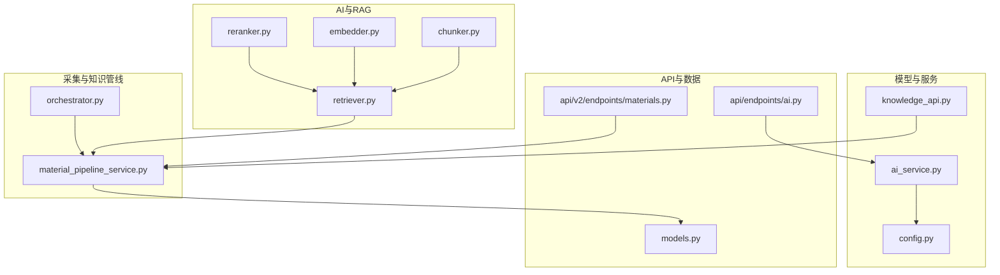
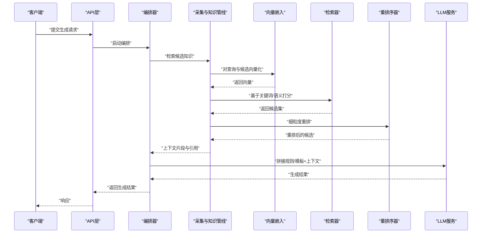
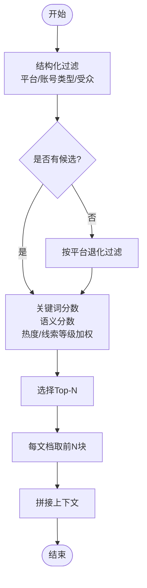
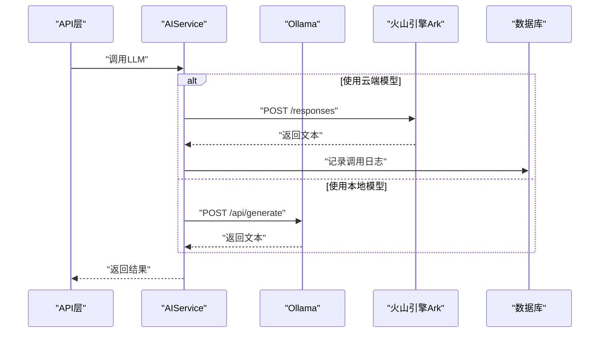
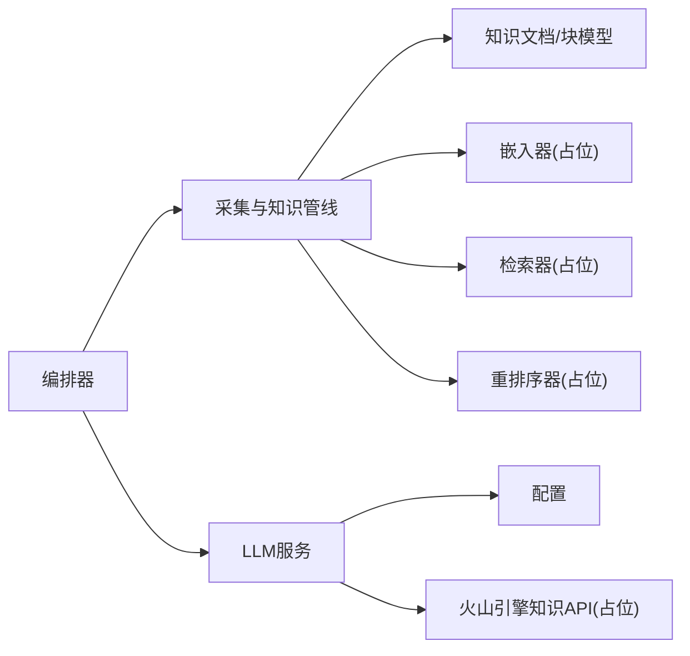
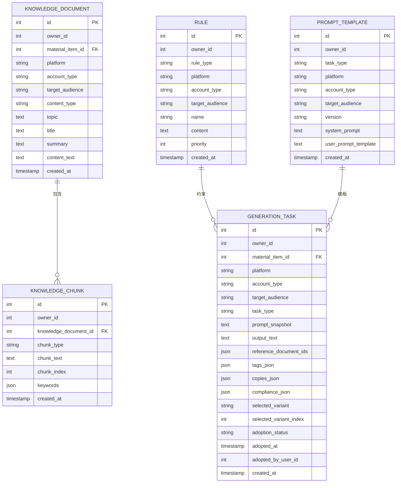

# RAG检索增强生成

<cite>
**本文引用的文件**
- [backend/app/ai/rag/chunker.py](file://backend/app/ai/rag/chunker.py)
- [backend/app/ai/rag/embedder.py](file://backend/app/ai/rag/embedder.py)
- [backend/app/ai/rag/reranker.py](file://backend/app/ai/rag/reranker.py)
- [backend/app/ai/rag/retriever.py](file://backend/app/ai/rag/retriever.py)
- [backend/app/ai/__init__.py](file://backend/app/ai/__init__.py)
- [backend/app/services/ai_service.py](file://backend/app/services/ai_service.py)
- [backend/app/api/endpoints/ai.py](file://backend/app/api/endpoints/ai.py)
- [backend/app/core/config.py](file://backend/app/core/config.py)
- [backend/app/services/collector/material_pipeline_service.py](file://backend/app/services/collector/material_pipeline_service.py)
- [backend/app/models/models.py](file://backend/app/models/models.py)
- [backend/app/integrations/volcengine/knowledge_api.py](file://backend/app/integrations/volcengine/knowledge_api.py)
- [backend/alembic/versions/20260327_02_add_material_knowledge_pipeline.py](file://backend/alembic/versions/20260327_02_add_material_knowledge_pipeline.py)
- [backend/app/domains/acquisition/orchestrator.py](file://backend/app/domains/acquisition/orchestrator.py)
- [backend/app/api/v2/endpoints/materials.py](file://backend/app/api/v2/endpoints/materials.py)
</cite>

## 目录
1. [简介](#简介)
2. [项目结构](#项目结构)
3. [核心组件](#核心组件)
4. [架构总览](#架构总览)
5. [详细组件分析](#详细组件分析)
6. [依赖分析](#依赖分析)
7. [性能考虑](#性能考虑)
8. [故障排查指南](#故障排查指南)
9. [结论](#结论)
10. [附录](#附录)

## 简介
本技术文档面向“智获客”RAG（检索增强生成）系统，围绕知识库构建、多阶段检索、重排序与上下文融合、向量化与相似度检索、以及生成质量控制进行系统化说明。文档同时给出配置参数、性能指标与扩展建议，并覆盖知识库维护、增量更新与版本管理策略。

## 项目结构
RAG相关能力主要分布在以下模块：
- AI工具与RAG组件：文本切分、向量嵌入、重排序、检索入口
- 采集与知识管线：从采集到知识文档与块的落库与检索
- LLM服务：本地Ollama与火山引擎Ark模型调用
- API层：对外暴露图像视觉分析等能力
- 数据模型：知识文档、知识块、规则、提示词模板、生成任务等

图示来源
- [backend/app/ai/rag/chunker.py:1-3](file://backend/app/ai/rag/chunker.py#L1-L3)
- [backend/app/ai/rag/embedder.py:1-3](file://backend/app/ai/rag/embedder.py#L1-L3)
- [backend/app/ai/rag/reranker.py:1-3](file://backend/app/ai/rag/reranker.py#L1-L3)
- [backend/app/ai/rag/retriever.py:1-3](file://backend/app/ai/rag/retriever.py#L1-L3)
- [backend/app/services/collector/material_pipeline_service.py:1393-1436](file://backend/app/services/collector/material_pipeline_service.py#L1393-L1436)
- [backend/app/services/ai_service.py:15-460](file://backend/app/services/ai_service.py#L15-L460)
- [backend/app/api/endpoints/ai.py:1-103](file://backend/app/api/endpoints/ai.py#L1-L103)
- [backend/app/core/config.py:71-84](file://backend/app/core/config.py#L71-L84)
- [backend/app/integrations/volcengine/knowledge_api.py:1-4](file://backend/app/integrations/volcengine/knowledge_api.py#L1-L4)
- [backend/app/models/models.py:644-683](file://backend/app/models/models.py#L644-L683)
- [backend/app/domains/acquisition/orchestrator.py:11-22](file://backend/app/domains/acquisition/orchestrator.py#L11-L22)
- [backend/app/api/v2/endpoints/materials.py:109-138](file://backend/app/api/v2/endpoints/materials.py#L109-L138)

章节来源
- [backend/app/ai/rag/chunker.py:1-3](file://backend/app/ai/rag/chunker.py#L1-L3)
- [backend/app/ai/rag/embedder.py:1-3](file://backend/app/ai/rag/embedder.py#L1-L3)
- [backend/app/ai/rag/reranker.py:1-3](file://backend/app/ai/rag/reranker.py#L1-L3)
- [backend/app/ai/rag/retriever.py:1-3](file://backend/app/ai/rag/retriever.py#L1-L3)
- [backend/app/services/collector/material_pipeline_service.py:1393-1436](file://backend/app/services/collector/material_pipeline_service.py#L1393-L1436)
- [backend/app/services/ai_service.py:15-460](file://backend/app/services/ai_service.py#L15-L460)
- [backend/app/api/endpoints/ai.py:1-103](file://backend/app/api/endpoints/ai.py#L1-L103)
- [backend/app/core/config.py:71-84](file://backend/app/core/config.py#L71-L84)
- [backend/app/integrations/volcengine/knowledge_api.py:1-4](file://backend/app/integrations/volcengine/knowledge_api.py#L1-L4)
- [backend/app/models/models.py:644-683](file://backend/app/models/models.py#L644-L683)
- [backend/app/domains/acquisition/orchestrator.py:11-22](file://backend/app/domains/acquisition/orchestrator.py#L11-L22)
- [backend/app/api/v2/endpoints/materials.py:109-138](file://backend/app/api/v2/endpoints/materials.py#L109-L138)

## 核心组件
- 文本切分器：将输入文本切分为片段，便于后续嵌入与检索
- 向量嵌入器：对文本生成向量表示
- 重排序器：对候选集进行细粒度重排
- 检索器：聚合上述能力并返回候选
- 知识文档与知识块：持久化知识与分块
- 规则与提示词模板：生成边界约束与提示工程
- 生成任务：记录生成输出与引用文档
- LLM服务：封装本地与云端模型调用
- 火山引擎知识检索：外部知识检索接口占位

章节来源
- [backend/app/ai/rag/chunker.py:1-3](file://backend/app/ai/rag/chunker.py#L1-L3)
- [backend/app/ai/rag/embedder.py:1-3](file://backend/app/ai/rag/embedder.py#L1-L3)
- [backend/app/ai/rag/reranker.py:1-3](file://backend/app/ai/rag/reranker.py#L1-L3)
- [backend/app/ai/rag/retriever.py:1-3](file://backend/app/ai/rag/retriever.py#L1-L3)
- [backend/app/models/models.py:644-683](file://backend/app/models/models.py#L644-L683)
- [backend/app/models/models.py:686-722](file://backend/app/models/models.py#L686-L722)
- [backend/app/models/models.py:724-751](file://backend/app/models/models.py#L724-L751)
- [backend/app/services/ai_service.py:15-460](file://backend/app/services/ai_service.py#L15-L460)
- [backend/app/integrations/volcengine/knowledge_api.py:1-4](file://backend/app/integrations/volcengine/knowledge_api.py#L1-L4)

## 架构总览
RAG工作流由“采集→清洗→知识化→检索→重排序→上下文融合→生成”构成。系统通过材料项与知识文档建立知识库，检索阶段结合关键词与语义相似度打分，最终将精选上下文与规则/提示模板融合进生成请求。

图示来源
- [backend/app/domains/acquisition/orchestrator.py:11-22](file://backend/app/domains/acquisition/orchestrator.py#L11-L22)
- [backend/app/services/collector/material_pipeline_service.py:1393-1436](file://backend/app/services/collector/material_pipeline_service.py#L1393-L1436)
- [backend/app/ai/rag/embedder.py:1-3](file://backend/app/ai/rag/embedder.py#L1-L3)
- [backend/app/ai/rag/retriever.py:1-3](file://backend/app/ai/rag/retriever.py#L1-L3)
- [backend/app/ai/rag/reranker.py:1-3](file://backend/app/ai/rag/reranker.py#L1-L3)
- [backend/app/services/ai_service.py:15-460](file://backend/app/services/ai_service.py#L15-L460)

## 详细组件分析

### 文本切分策略
- 切分器当前实现为直接返回整段文本，未做分句/分段处理。实际部署中应结合业务内容形态选择合适的切分策略（如按句子、段落或固定长度滑窗），以平衡召回与上下文连贯性。

章节来源
- [backend/app/ai/rag/chunker.py:1-3](file://backend/app/ai/rag/chunker.py#L1-L3)

### 向量嵌入与相似度检索
- 当前嵌入器返回零向量占位，未接入具体嵌入模型。检索器返回空列表，未实现向量检索。
- 实际系统建议：
  - 选择适配中文场景的嵌入模型，维度可按模型默认（如384/768）。
  - 使用向量库（如FAISS、Pinecone、Weaviate）存储向量并支持近似最近邻检索。
  - 相似度计算采用余弦距离或点积，结合BM25混合检索提升鲁棒性。

章节来源
- [backend/app/ai/rag/embedder.py:1-3](file://backend/app/ai/rag/embedder.py#L1-L3)
- [backend/app/ai/rag/retriever.py:1-3](file://backend/app/ai/rag/retriever.py#L1-L3)

### 多阶段检索流程
- 初步检索：基于平台/账号类型/受众的结构化过滤，限定候选范围；若无候选，则退化到仅按平台过滤。
- 重排序：综合关键词匹配分数、语义相似度、热度与线索等级进行加权打分。
- 上下文融合：取每篇知识文档的前若干块作为上下文，拼接到生成提示中。

图示来源
- [backend/app/services/collector/material_pipeline_service.py:1393-1436](file://backend/app/services/collector/material_pipeline_service.py#L1393-L1436)
- [backend/app/models/models.py:644-683](file://backend/app/models/models.py#L644-L683)

章节来源
- [backend/app/services/collector/material_pipeline_service.py:1393-1436](file://backend/app/services/collector/material_pipeline_service.py#L1393-L1436)
- [backend/app/models/models.py:644-683](file://backend/app/models/models.py#L644-L683)

### 重排序与上下文融合
- 重排序采用关键词重叠率与序列相似度的加权组合，并叠加热度与线索等级的置信增益。
- 上下文融合：每篇知识文档最多取若干块，按块序号排序，确保上下文顺序一致。

章节来源
- [backend/app/services/collector/material_pipeline_service.py:1381-1436](file://backend/app/services/collector/material_pipeline_service.py#L1381-L1436)
- [backend/app/models/models.py:667-683](file://backend/app/models/models.py#L667-L683)

### 向量化模型选择与优化
- 维度：依据所选嵌入模型确定；建议在保证精度前提下优先较小维度以降低存储与检索成本。
- 相似度：优先使用余弦相似度；可结合标量混合（BM25）提升召回稳定性。
- 性能调优：
  - 向量索引：选择合适索引（IVF/PQ/Flat）与量化策略。
  - 批量预处理：对知识库定期批量向量化并缓存。
  - 查询加速：采用查询预检索（粗排）+精排策略，减少向量库扫描规模。

（本节为通用指导，不直接分析具体文件）

### 检索增强生成工作机制
- 检索结果整合：将重排后的知识块与规则、提示模板拼接为生成上下文。
- 上下文窗口管理：根据模型上下文长度限制，裁剪或截断上下文，必要时采用分段生成。
- 生成质量控制：通过合规规则与提示词模板约束输出，结合生成任务记录引用文档以便溯源。

章节来源
- [backend/app/models/models.py:686-722](file://backend/app/models/models.py#L686-L722)
- [backend/app/models/models.py:724-751](file://backend/app/models/models.py#L724-L751)
- [backend/app/services/ai_service.py:15-460](file://backend/app/services/ai_service.py#L15-L460)

### LLM服务与外部集成
- 本地模型：通过Ollama调用本地模型，支持温度等参数设置。
- 云端模型：通过火山引擎Ark Responses API调用，具备限流与用量统计。
- 图像视觉分析：支持图文联合输入，返回文本答案。

图示来源
- [backend/app/services/ai_service.py:24-91](file://backend/app/services/ai_service.py#L24-L91)
- [backend/app/api/endpoints/ai.py:87-103](file://backend/app/api/endpoints/ai.py#L87-L103)
- [backend/app/core/config.py:71-84](file://backend/app/core/config.py#L71-L84)

章节来源
- [backend/app/services/ai_service.py:15-460](file://backend/app/services/ai_service.py#L15-L460)
- [backend/app/api/endpoints/ai.py:1-103](file://backend/app/api/endpoints/ai.py#L1-L103)
- [backend/app/core/config.py:71-84](file://backend/app/core/config.py#L71-L84)

### 火山引擎知识检索接口
- 当前为占位实现，返回空列表。后续可对接火山引擎知识检索API，将外部知识纳入候选池。

章节来源
- [backend/app/integrations/volcengine/knowledge_api.py:1-4](file://backend/app/integrations/volcengine/knowledge_api.py#L1-L4)

## 依赖分析
- 组件耦合：
  - 编排器依赖采集与知识管线，负责串联“检索→生成”主链路。
  - LLM服务独立于检索实现，便于替换不同推理后端。
  - 知识文档与知识块模型定义了检索与生成的数据结构。
- 外部依赖：
  - 火山引擎Ark API用于云端模型与视觉分析。
  - 向量库与检索服务为可插拔组件，当前在RAG组件中以占位形式存在。

图示来源
- [backend/app/domains/acquisition/orchestrator.py:11-22](file://backend/app/domains/acquisition/orchestrator.py#L11-L22)
- [backend/app/services/collector/material_pipeline_service.py:1393-1436](file://backend/app/services/collector/material_pipeline_service.py#L1393-L1436)
- [backend/app/models/models.py:644-683](file://backend/app/models/models.py#L644-L683)
- [backend/app/services/ai_service.py:15-460](file://backend/app/services/ai_service.py#L15-L460)
- [backend/app/core/config.py:71-84](file://backend/app/core/config.py#L71-L84)
- [backend/app/integrations/volcengine/knowledge_api.py:1-4](file://backend/app/integrations/volcengine/knowledge_api.py#L1-L4)

章节来源
- [backend/app/domains/acquisition/orchestrator.py:11-22](file://backend/app/domains/acquisition/orchestrator.py#L11-L22)
- [backend/app/services/collector/material_pipeline_service.py:1393-1436](file://backend/app/services/collector/material_pipeline_service.py#L1393-L1436)
- [backend/app/models/models.py:644-683](file://backend/app/models/models.py#L644-L683)
- [backend/app/services/ai_service.py:15-460](file://backend/app/services/ai_service.py#L15-L460)
- [backend/app/core/config.py:71-84](file://backend/app/core/config.py#L71-L84)
- [backend/app/integrations/volcengine/knowledge_api.py:1-4](file://backend/app/integrations/volcengine/knowledge_api.py#L1-L4)

## 性能考虑
- 检索性能：
  - 对知识库定期批量向量化，建立高效索引。
  - 查询阶段先粗排（如关键词/BM25）再精排（向量）。
- 生成性能：
  - 控制上下文长度，避免超出模型上下文窗口。
  - 使用缓存与并发限流，结合Redis实现分布式速率限制。
- 存储与IO：
  - 知识块按文档拆分，支持增量更新与热数据缓存。
  - 生成任务持久化，便于回溯与复用。

（本节为通用指导，不直接分析具体文件）

## 故障排查指南
- Ark API调用失败：
  - 检查AK配置与超时设置；查看调用日志记录的错误信息与耗时。
- Ollama调用异常：
  - 确认本地服务可达与模型可用；检查请求体与温度参数。
- 检索无结果：
  - 核对结构化过滤条件是否过于严格；确认知识库是否已入库。
- 生成内容不符合规范：
  - 检查规则与提示词模板是否正确注入；核对生成任务中的引用文档。

章节来源
- [backend/app/services/ai_service.py:132-240](file://backend/app/services/ai_service.py#L132-L240)
- [backend/app/api/endpoints/ai.py:87-103](file://backend/app/api/endpoints/ai.py#L87-L103)
- [backend/app/core/config.py:71-84](file://backend/app/core/config.py#L71-L84)

## 结论
本系统以“采集→知识化→检索→生成”的流水线为核心，通过结构化过滤与语义打分实现多阶段检索，结合规则与提示模板保障生成质量。当前RAG组件处于占位状态，建议尽快接入向量嵌入与检索服务，并完善知识库的增量更新与版本管理策略，以支撑生产级应用。

## 附录

### 配置参数
- 本地模型
  - OLLAMA_BASE_URL：本地Ollama服务地址
  - OLLAMA_MODEL：本地模型名称
- 云端模型（火山引擎）
  - ARK_API_KEY：鉴权密钥
  - ARK_BASE_URL：Ark API基础地址
  - ARK_MODEL：模型名称
  - ARK_TIMEOUT_SECONDS：请求超时
  - ARK_VISION_RATE_LIMIT_PER_MINUTE / ARK_VISION_RATE_LIMIT_WINDOW_SECONDS：图像视觉分析限流
- Redis与限流
  - USE_REDIS_RATE_LIMIT：是否启用Redis限流
  - REDIS_URL：Redis连接串
  - RATE_LIMIT_KEY_PREFIX：限流键前缀

章节来源
- [backend/app/core/config.py:71-89](file://backend/app/core/config.py#L71-L89)

### 数据模型概览
- 知识文档：承载标题、摘要、正文与所属材料项
- 知识块：文档分块，记录块类型、文本与索引
- 规则：生成边界约束
- 提示词模板：任务级系统提示与用户模板
- 生成任务：记录输出、引用文档与合规信息

图示来源
- [backend/app/models/models.py:644-683](file://backend/app/models/models.py#L644-L683)
- [backend/app/models/models.py:686-722](file://backend/app/models/models.py#L686-L722)
- [backend/app/models/models.py:724-751](file://backend/app/models/models.py#L724-L751)

章节来源
- [backend/app/models/models.py:644-683](file://backend/app/models/models.py#L644-L683)
- [backend/app/models/models.py:686-722](file://backend/app/models/models.py#L686-L722)
- [backend/app/models/models.py:724-751](file://backend/app/models/models.py#L724-L751)

### 知识库维护与版本管理
- 增量更新：基于材料项变更触发知识文档重建，仅更新受影响块，保留稳定块以减少重算。
- 版本管理：提示词模板与规则采用版本字段，生成任务记录引用文档ID，便于回溯与审计。
- 迁移脚本：通过Alembic迁移创建知识文档与知识块表，确保数据库结构演进可控。

章节来源
- [backend/alembic/versions/20260327_02_add_material_knowledge_pipeline.py:164-182](file://backend/alembic/versions/20260327_02_add_material_knowledge_pipeline.py#L164-L182)
- [backend/app/models/models.py:705-722](file://backend/app/models/models.py#L705-L722)
- [backend/app/models/models.py:724-751](file://backend/app/models/models.py#L724-L751)