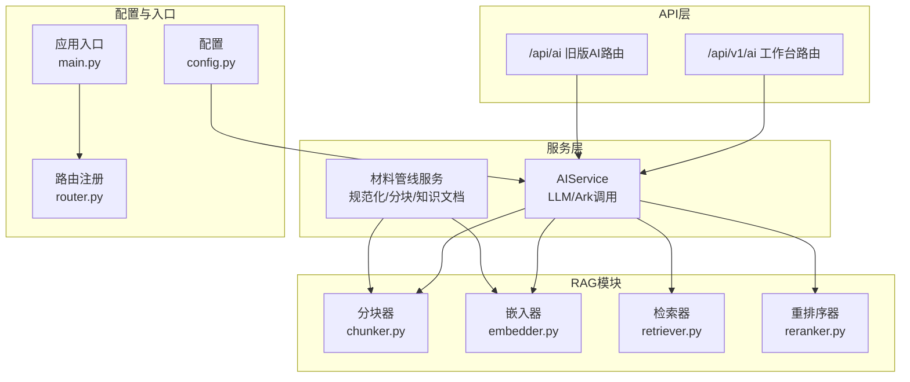
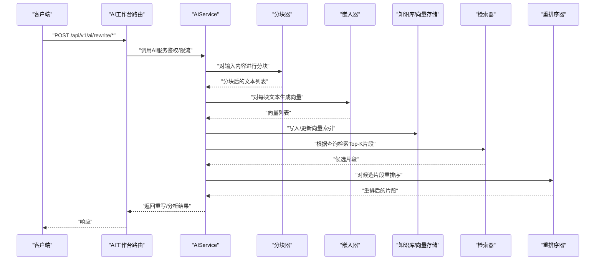
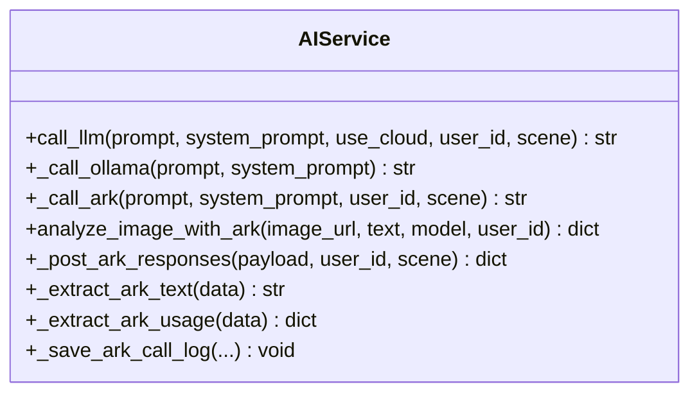
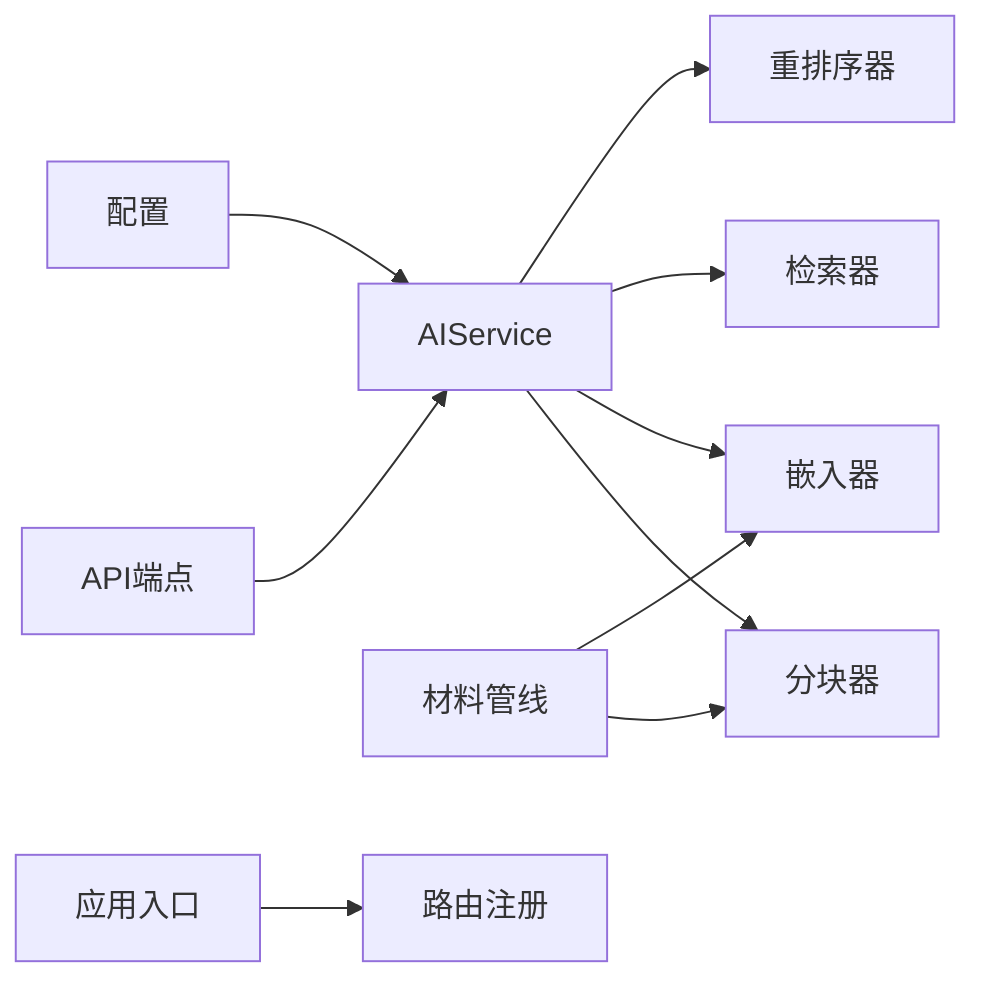

# 向量嵌入技术

<cite>
**本文引用的文件**
- [backend/app/ai/rag/embedder.py](file://backend/app/ai/rag/embedder.py)
- [backend/app/ai/rag/chunker.py](file://backend/app/ai/rag/chunker.py)
- [backend/app/ai/rag/retriever.py](file://backend/app/ai/rag/retriever.py)
- [backend/app/ai/rag/reranker.py](file://backend/app/ai/rag/reranker.py)
- [backend/app/services/ai_service.py](file://backend/app/services/ai_service.py)
- [backend/app/domains/ai_workbench/ai_service.py](file://backend/app/domains/ai_workbench/ai_service.py)
- [backend/app/api/endpoints/ai.py](file://backend/app/api/endpoints/ai.py)
- [backend/app/api/v1/endpoints/ai_workbench.py](file://backend/app/api/v1/endpoints/ai_workbench.py)
- [backend/app/core/config.py](file://backend/app/core/config.py)
- [backend/main.py](file://backend/main.py)
- [backend/app/api/router.py](file://backend/app/api/router.py)
- [backend/app/services/collector/material_pipeline_service.py](file://backend/app/services/collector/material_pipeline_service.py)
</cite>

## 目录
1. [引言](#引言)
2. [项目结构](#项目结构)
3. [核心组件](#核心组件)
4. [架构总览](#架构总览)
5. [详细组件分析](#详细组件分析)
6. [依赖关系分析](#依赖关系分析)
7. [性能考量](#性能考量)
8. [故障排查指南](#故障排查指南)
9. [结论](#结论)
10. [附录](#附录)

## 引言
本文件面向“智获客”的向量嵌入技术，聚焦于RAG（检索增强生成）链路中的文本分块、嵌入、检索与重排序模块的设计与实现现状，并结合现有AI服务与API路由，给出可操作的参数配置、性能优化与缓存策略建议。由于当前仓库中嵌入器实现为占位函数，本文在不臆造代码的前提下，基于现有文件进行严谨分析，并提供可落地的工程实践指导。

## 项目结构
围绕向量嵌入与RAG能力，后端主要由以下层次构成：
- RAG模块：提供分块、嵌入、检索、重排序的接口定义（当前为占位实现）
- AI服务层：封装本地与云端模型调用、图像视觉分析、调用日志与限流
- API层：对外暴露AI工作台与旧版AI接口，统一鉴权与限流
- 核心配置：集中管理模型基座、超时、限流与存储路径等参数
- 材料管线：负责内容规范化、分块与知识文档构建，为检索提供基础数据

图表来源
- [backend/app/api/v1/endpoints/ai_workbench.py:1-118](file://backend/app/api/v1/endpoints/ai_workbench.py#L1-L118)
- [backend/app/api/endpoints/ai.py:1-103](file://backend/app/api/endpoints/ai.py#L1-L103)
- [backend/app/services/ai_service.py:1-460](file://backend/app/services/ai_service.py#L1-L460)
- [backend/app/ai/rag/chunker.py:1-3](file://backend/app/ai/rag/chunker.py#L1-L3)
- [backend/app/ai/rag/embedder.py:1-3](file://backend/app/ai/rag/embedder.py#L1-L3)
- [backend/app/ai/rag/retriever.py:1-3](file://backend/app/ai/rag/retriever.py#L1-L3)
- [backend/app/ai/rag/reranker.py:1-3](file://backend/app/ai/rag/reranker.py#L1-L3)
- [backend/app/core/config.py:1-103](file://backend/app/core/config.py#L1-L103)
- [backend/main.py:1-138](file://backend/main.py#L1-L138)
- [backend/app/api/router.py:1-35](file://backend/app/api/router.py#L1-L35)

章节来源
- [backend/app/api/router.py:1-35](file://backend/app/api/router.py#L1-L35)
- [backend/main.py:1-138](file://backend/main.py#L1-L138)

## 核心组件
- 分块器（chunker.py）：将长文本切分为固定长度或段落边界内的子文本列表，用于后续嵌入与检索
- 嵌入器（embedder.py）：将文本转换为向量表示，当前实现返回占位向量
- 检索器（retriever.py）：从知识库中检索与查询语句最相关的片段
- 重排序器（reranker.py）：对候选片段进行细粒度重排，提升最终排序质量
- AI服务（ai_service.py）：封装Ollama与火山引擎Ark模型调用，支持图像视觉分析与调用量统计
- 材料管线（material_pipeline_service.py）：负责内容规范化、关键词抽取、分块与知识文档构建

章节来源
- [backend/app/ai/rag/chunker.py:1-3](file://backend/app/ai/rag/chunker.py#L1-L3)
- [backend/app/ai/rag/embedder.py:1-3](file://backend/app/ai/rag/embedder.py#L1-L3)
- [backend/app/ai/rag/retriever.py:1-3](file://backend/app/ai/rag/retriever.py#L1-L3)
- [backend/app/ai/rag/reranker.py:1-3](file://backend/app/ai/rag/reranker.py#L1-L3)
- [backend/app/services/ai_service.py:1-460](file://backend/app/services/ai_service.py#L1-L460)
- [backend/app/services/collector/material_pipeline_service.py:1-800](file://backend/app/services/collector/material_pipeline_service.py#L1-L800)

## 架构总览
下图展示从API请求到RAG处理的关键流程，以及与AI服务、配置的关系：

图表来源
- [backend/app/api/v1/endpoints/ai_workbench.py:1-118](file://backend/app/api/v1/endpoints/ai_workbench.py#L1-L118)
- [backend/app/services/ai_service.py:1-460](file://backend/app/services/ai_service.py#L1-L460)
- [backend/app/ai/rag/chunker.py:1-3](file://backend/app/ai/rag/chunker.py#L1-L3)
- [backend/app/ai/rag/embedder.py:1-3](file://backend/app/ai/rag/embedder.py#L1-L3)
- [backend/app/ai/rag/retriever.py:1-3](file://backend/app/ai/rag/retriever.py#L1-L3)
- [backend/app/ai/rag/reranker.py:1-3](file://backend/app/ai/rag/reranker.py#L1-L3)

## 详细组件分析

### 分块器（chunker.py）
- 职责：将输入文本按段落与长度进行切分，保证每块文本具备语义完整性与可控长度
- 当前实现：占位函数，返回单块或空列表
- 建议实现要点：
  - 段落分割优先，避免跨段截断
  - 控制最大长度，预留少量重叠以增强召回
  - 支持特殊格式（如Markdown/HTML）的结构化保留

章节来源
- [backend/app/ai/rag/chunker.py:1-3](file://backend/app/ai/rag/chunker.py#L1-L3)

### 嵌入器（embedder.py）
- 职责：将文本转换为数值向量，作为检索与相似度计算的基础
- 当前实现：占位函数，返回零向量或空向量
- 数学与工程建议：
  - 维度选择：依据下游向量数据库与硬件资源确定（如384/512/768/1024）
  - 归一化：可选L2归一化，便于余弦相似度计算
  - 批量嵌入：减少网络/模型调用开销
  - 缓存：对重复文本进行向量缓存，降低重复计算

章节来源
- [backend/app/ai/rag/embedder.py:1-3](file://backend/app/ai/rag/embedder.py#L1-L3)

### 检索器（retriever.py）
- 职责：基于查询向量在向量库中检索Top-K候选
- 当前实现：占位函数，返回空列表
- 建议实现要点：
  - 查询向量化与文档向量化保持一致
  - 支持多种相似度度量（余弦、内积、点积归一化）
  - 可引入过滤条件（时间范围、平台、标签）

章节来源
- [backend/app/ai/rag/retriever.py:1-3](file://backend/app/ai/rag/retriever.py#L1-L3)

### 重排序器（reranker.py）
- 职责：对候选片段进行细粒度重排，提升最终排序质量
- 当前实现：占位函数，直接返回原列表
- 建议实现要点：
  - 使用交叉编码器（cross-encoder）对查询与候选进行细粒度打分
  - 结合关键词匹配、段落边界与上下文一致性

章节来源
- [backend/app/ai/rag/reranker.py:1-3](file://backend/app/ai/rag/reranker.py#L1-L3)

### AI服务（ai_service.py）
- 职责：封装本地Ollama与云端Ark模型调用，支持图像视觉分析与调用量统计
- 关键点：
  - 本地模型调用：构造请求体并处理响应
  - 云端模型调用：通过Ark Responses API发送消息并解析输出
  - 日志记录：持久化Ark调用日志，包含耗时、Token用量与错误信息
  - 错误处理：HTTP异常与通用异常均进行记录与抛出

图表来源
- [backend/app/services/ai_service.py:1-460](file://backend/app/services/ai_service.py#L1-L460)

章节来源
- [backend/app/services/ai_service.py:1-460](file://backend/app/services/ai_service.py#L1-L460)

### 材料管线（material_pipeline_service.py）
- 职责：内容规范化、分块、知识文档构建，为RAG提供结构化数据
- 关键点：
  - 规范化：清洗HTML、去噪行、标准化文本
  - 分块：按段落与长度切分，控制最大块数
  - 知识文档：构建文档实体与分块实体，便于检索与溯源

章节来源
- [backend/app/services/collector/material_pipeline_service.py:1-800](file://backend/app/services/collector/material_pipeline_service.py#L1-L800)

### API层与路由（ai.py、ai_workbench.py）
- 职责：对外提供AI工作台与旧版AI接口，统一鉴权与分布式限流
- 关键点：
  - 旧版接口已下线，提示迁移至新接口
  - 新版接口支持Ark视觉分析与内容改写（通过材料管线编排）

章节来源
- [backend/app/api/endpoints/ai.py:1-103](file://backend/app/api/endpoints/ai.py#L1-L103)
- [backend/app/api/v1/endpoints/ai_workbench.py:1-118](file://backend/app/api/v1/endpoints/ai_workbench.py#L1-L118)

## 依赖关系分析
- 组件耦合：
  - API层依赖AIService；AIService依赖RAG模块（待实现）
  - 材料管线与RAG模块存在潜在耦合点（分块与向量化）
- 外部依赖：
  - 配置项集中于Settings，涵盖模型基座、超时、限流与Redis
  - 应用入口注册路由并启动FastAPI

图表来源
- [backend/app/api/endpoints/ai.py:1-103](file://backend/app/api/endpoints/ai.py#L1-L103)
- [backend/app/api/v1/endpoints/ai_workbench.py:1-118](file://backend/app/api/v1/endpoints/ai_workbench.py#L1-L118)
- [backend/app/services/ai_service.py:1-460](file://backend/app/services/ai_service.py#L1-L460)
- [backend/app/ai/rag/chunker.py:1-3](file://backend/app/ai/rag/chunker.py#L1-L3)
- [backend/app/ai/rag/embedder.py:1-3](file://backend/app/ai/rag/embedder.py#L1-L3)
- [backend/app/ai/rag/retriever.py:1-3](file://backend/app/ai/rag/retriever.py#L1-L3)
- [backend/app/ai/rag/reranker.py:1-3](file://backend/app/ai/rag/reranker.py#L1-L3)
- [backend/app/core/config.py:1-103](file://backend/app/core/config.py#L1-L103)
- [backend/main.py:1-138](file://backend/main.py#L1-L138)
- [backend/app/api/router.py:1-35](file://backend/app/api/router.py#L1-L35)

章节来源
- [backend/app/core/config.py:1-103](file://backend/app/core/config.py#L1-L103)
- [backend/main.py:1-138](file://backend/main.py#L1-L138)

## 性能考量
- 嵌入性能
  - 批量处理：将多个文本合并为批次，减少模型调用次数
  - 向量维度：根据硬件与检索延迟权衡维度大小
  - 缓存策略：对高频重复文本建立向量缓存，命中则跳过计算
- 检索与重排序
  - 检索阶段采用粗排（ANN/HNSW/FAISS），重排序阶段使用交叉编码器
  - 过滤与分页：结合标签、时间范围与平台进行过滤，限制返回数量
- 网络与超时
  - 合理设置Ark与Ollama的超时阈值，避免阻塞
  - 对外暴露的API增加速率限制，防止突发流量冲击后端
- 内存与并发
  - 分块大小与批大小需与可用内存匹配，避免OOM
  - 并发控制与队列长度应与CPU/GPU能力相适应

## 故障排查指南
- Ark调用失败
  - 现象：HTTP状态码异常或抛出异常
  - 排查：检查API Key、Base URL、超时设置与网络连通性
  - 记录：调用日志包含耗时、Token用量与错误详情
- Ollama调用失败
  - 现象：模型不可用或响应异常
  - 排查：确认模型名称、本地服务状态与端口可达
- 重写接口迁移
  - 现象：旧版接口返回410并提示迁移
  - 处理：按照提示迁移到新版接口路径

章节来源
- [backend/app/services/ai_service.py:1-460](file://backend/app/services/ai_service.py#L1-L460)
- [backend/app/api/endpoints/ai.py:1-103](file://backend/app/api/endpoints/ai.py#L1-L103)

## 结论
当前仓库的RAG模块处于占位实现阶段，嵌入器、检索器与重排序器均为占位函数。建议尽快完成以下工作：
- 实现分块器与嵌入器的具体逻辑，确保与向量数据库兼容
- 在检索与重排序阶段引入高效算法与交叉编码器
- 完善缓存与增量更新机制，结合材料管线的数据流
- 优化配置项与限流策略，保障线上稳定性与性能

## 附录

### 参数配置指南（节选）
- 模型与调用
  - Ollama基座URL与模型名
  - 是否启用云端模型与Ark相关参数（Key、Base URL、模型名、超时）
- 限流与Redis
  - 视觉分析限流配额与窗口
  - Redis限流开关与连接串
- 文件上传
  - 最大上传大小与上传目录

章节来源
- [backend/app/core/config.py:1-103](file://backend/app/core/config.py#L1-L103)

### 嵌入质量评估指标（建议）
- 语义相似度：使用余弦相似度衡量查询与候选的接近程度
- 分类准确率：对候选片段进行人工标注，评估检索Top-K命中率
- 检索精度：在问答或改写场景中，统计最终输出中包含关键信息的比例

### 嵌入缓存策略与增量更新（建议）
- 缓存策略
  - 基于文本哈希的向量缓存，命中即返回
  - 失效策略：按时间或版本号触发重建
- 增量更新
  - 仅对新增或变更的分块重新嵌入
  - 批量写入向量库，定期compact与重建索引