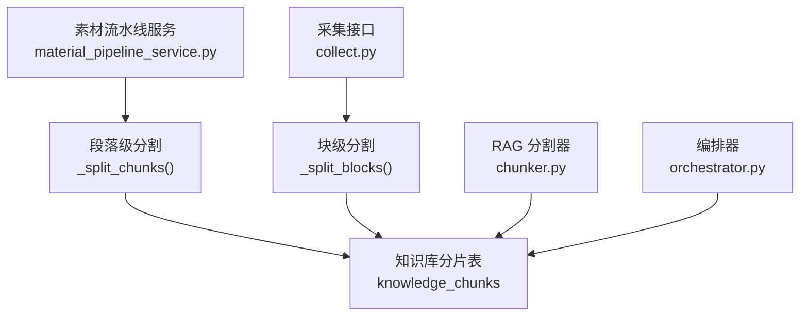
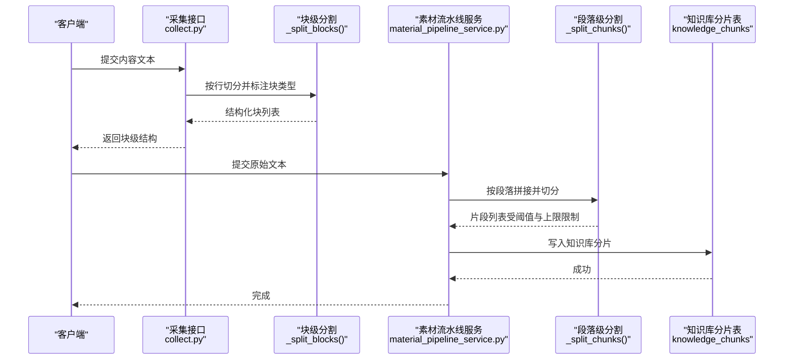
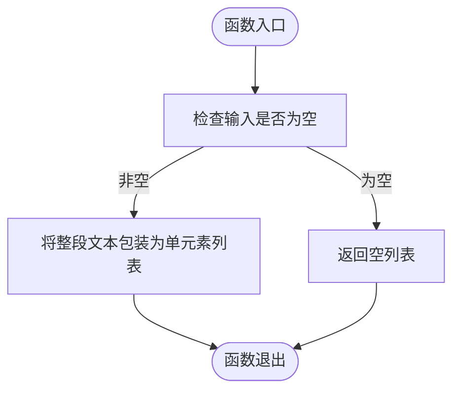
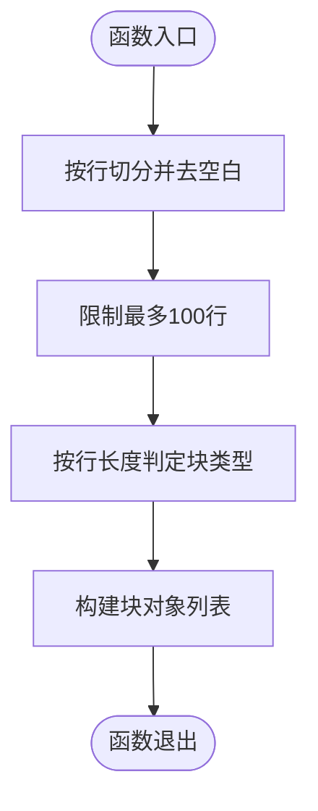
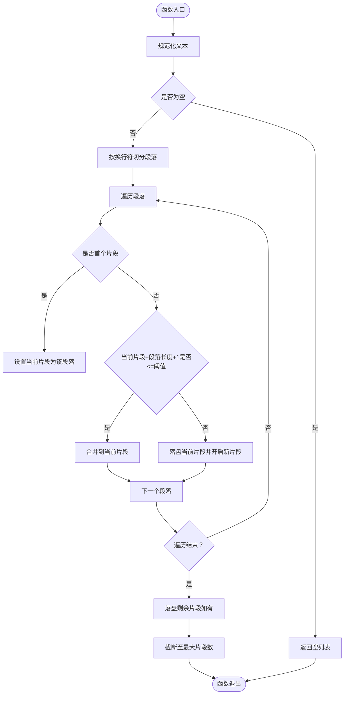
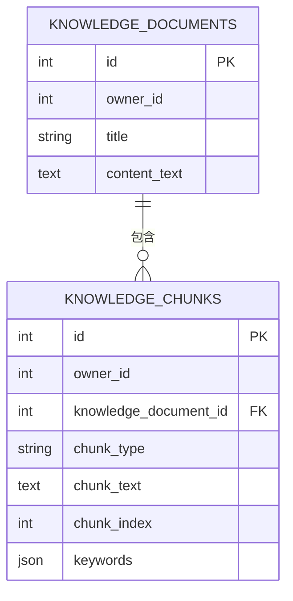
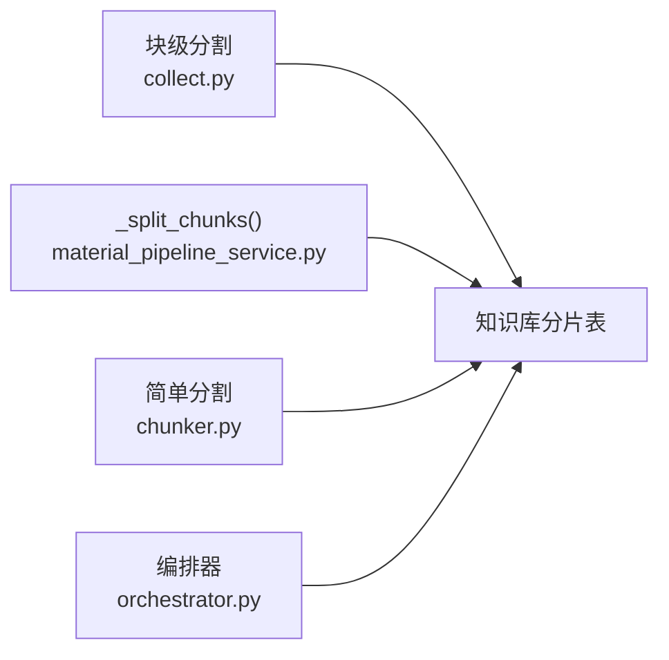

# 文档分割策略

<cite>
**本文引用的文件**
- [chunker.py](file://backend/app/ai/rag/chunker.py)
- [material_pipeline_service.py](file://backend/app/services/collector/material_pipeline_service.py)
- [collect.py](file://backend/app/api/v2/endpoints/collect.py)
- [20260327_02_add_material_knowledge_pipeline.py](file://backend/alembic/versions/20260327_02_add_material_knowledge_pipeline.py)
- [orchestrator.py](file://backend/app/domains/acquisition/orchestrator.py)
- [test_main.py](file://backend/test_main.py)
- [test_material_pipeline_postgres_regression.py](file://backend/test_material_pipeline_postgres_regression.py)
</cite>

## 目录
1. [引言](#引言)
2. [项目结构](#项目结构)
3. [核心组件](#核心组件)
4. [架构总览](#架构总览)
5. [详细组件分析](#详细组件分析)
6. [依赖分析](#依赖分析)
7. [性能考虑](#性能考虑)
8. [故障排查指南](#故障排查指南)
9. [结论](#结论)
10. [附录](#附录)

## 引言
本技术文档围绕“智获客”的文档分割策略进行系统化梳理，重点解释文本分割算法的设计原理、实现细节与工程实践。当前系统在 RAG 知识库构建环节采用两类文本分割路径：
- 简单文本分割：用于将原始内容切分为若干片段，便于后续嵌入与检索。
- 块级分割：用于将网页内容按行/段落切分为结构化块，便于前端渲染与交互。

本文将从输入验证、空值处理、边界控制、策略选择、参数配置、质量评估与性能优化等方面，给出可操作的指导与最佳实践。

## 项目结构
与“文档分割策略”直接相关的核心文件与职责如下：
- backend/app/ai/rag/chunker.py：提供基础的“简单文本分割”能力，将整段文本作为单一片段返回，或在空输入时返回空列表。
- backend/app/services/collector/material_pipeline_service.py：实现“块级分割”与“段落级分割”的组合逻辑，支持按段落拼接、长度阈值控制与最大片段数量限制。
- backend/app/api/v2/endpoints/collect.py：定义采集接口的数据模型与块级分割函数，将长文本按行切分为块，并根据行长度判定块类型。
- backend/alembic/versions/20260327_02_add_material_knowledge_pipeline.py：数据库迁移脚本，定义知识库文档与分片表结构，支撑分片持久化。
- backend/app/domains/acquisition/orchestrator.py：编排层，确保知识库文档与分片存在且一致，触发重建与重新索引。
- 各种测试文件：验证分片输出、清理后的正文与生成任务提示词中对“知识参考”的引用。

图表来源
- [collect.py:103-109](file://backend/app/api/v2/endpoints/collect.py#L103-L109)
- [material_pipeline_service.py:370-392](file://backend/app/services/collector/material_pipeline_service.py#L370-L392)
- [chunker.py:1-2](file://backend/app/ai/rag/chunker.py#L1-L2)
- [20260327_02_add_material_knowledge_pipeline.py:180-190](file://backend/alembic/versions/20260327_02_add_material_knowledge_pipeline.py#L180-L190)
- [orchestrator.py:66-95](file://backend/app/domains/acquisition/orchestrator.py#L66-L95)

章节来源
- [collect.py:103-109](file://backend/app/api/v2/endpoints/collect.py#L103-L109)
- [material_pipeline_service.py:370-392](file://backend/app/services/collector/material_pipeline_service.py#L370-L392)
- [chunker.py:1-2](file://backend/app/ai/rag/chunker.py#L1-L2)
- [20260327_02_add_material_knowledge_pipeline.py:180-190](file://backend/alembic/versions/20260327_02_add_material_knowledge_pipeline.py#L180-L190)
- [orchestrator.py:66-95](file://backend/app/domains/acquisition/orchestrator.py#L66-L95)

## 核心组件
- 简单文本分割（chunker.py）
  - 输入：字符串文本
  - 输出：字符串列表（单个元素或空列表）
  - 特性：不做任何切分，仅进行空值检查；适合极简场景或占位实现
- 块级分割（collect.py）
  - 输入：字符串文本
  - 输出：结构化块列表（含块类型、序号、文本）
  - 特性：按行切分，去除空白行，前100行以内；行长度≤24判定为标题块，否则为段落块
- 段落级分割（material_pipeline_service.py）
  - 输入：原始文本、最大长度阈值（默认300）
  - 输出：按段落拼接的片段列表，受最大片段数限制（默认20）
  - 特性：按换行符切分段落，逐段尝试拼接到当前片段，超过阈值则落盘并开启新片段；空输入返回空列表

章节来源
- [chunker.py:1-2](file://backend/app/ai/rag/chunker.py#L1-L2)
- [collect.py:103-109](file://backend/app/api/v2/endpoints/collect.py#L103-L109)
- [material_pipeline_service.py:370-392](file://backend/app/services/collector/material_pipeline_service.py#L370-L392)

## 架构总览
下图展示“采集—清洗—分割—入库”的端到端流程，以及与知识库分片表的关系：

图表来源
- [collect.py:103-109](file://backend/app/api/v2/endpoints/collect.py#L103-L109)
- [material_pipeline_service.py:370-392](file://backend/app/services/collector/material_pipeline_service.py#L370-L392)
- [20260327_02_add_material_knowledge_pipeline.py:180-190](file://backend/alembic/versions/20260327_02_add_material_knowledge_pipeline.py#L180-L190)

## 详细组件分析

### 组件A：简单文本分割（chunker.py）
- 设计要点
  - 最小实现：不进行任何切分，直接返回整段文本或空列表
  - 适用场景：占位、快速集成、或对分片粒度无要求的场景
- 输入验证与空值处理
  - 对空输入返回空列表，避免下游处理异常
- 分割结果格式化
  - 返回字符串列表，便于统一处理

图表来源
- [chunker.py:1-2](file://backend/app/ai/rag/chunker.py#L1-L2)

章节来源
- [chunker.py:1-2](file://backend/app/ai/rag/chunker.py#L1-L2)

### 组件B：块级分割（collect.py）
- 设计要点
  - 按行切分，去除空白行，最多保留100行
  - 行长度≤24判定为标题块，否则为段落块
- 输入验证与空值处理
  - 对空输入进行安全处理，避免异常
- 分割结果格式化
  - 返回结构化块对象列表，包含块类型、序号与文本

图表来源
- [collect.py:103-109](file://backend/app/api/v2/endpoints/collect.py#L103-L109)

章节来源
- [collect.py:103-109](file://backend/app/api/v2/endpoints/collect.py#L103-L109)

### 组件C：段落级分割（material_pipeline_service.py）
- 设计要点
  - 先进行文本规范化，再按换行符切分为段落
  - 逐段尝试拼接到当前片段，若拼接后不超过阈值则合并，否则落盘并开启新片段
  - 最终片段列表受最大片段数上限限制
- 输入验证与空值处理
  - 空输入直接返回空列表
- 边界处理机制
  - 段落边界：以换行符为单位
  - 长度边界：由参数控制（默认300）
  - 数量边界：最多20个片段
- 分割结果格式化
  - 返回字符串列表，每个元素为一个片段

图表来源
- [material_pipeline_service.py:370-392](file://backend/app/services/collector/material_pipeline_service.py#L370-L392)

章节来源
- [material_pipeline_service.py:370-392](file://backend/app/services/collector/material_pipeline_service.py#L370-L392)

### 组件D：RAG 知识库分片表（数据库）
- 表结构要点
  - 知识库分片表包含：所有者标识、所属知识文档、分片类型、分片文本、分片序号、关键词等字段
  - 该表支撑检索增强与后续生成任务的上下文注入
- 与编排器的关系
  - 编排器负责确保知识库文档与分片存在且一致，必要时触发重建与重新索引

图表来源
- [20260327_02_add_material_knowledge_pipeline.py:180-190](file://backend/alembic/versions/20260327_02_add_material_knowledge_pipeline.py#L180-L190)
- [orchestrator.py:66-95](file://backend/app/domains/acquisition/orchestrator.py#L66-L95)

章节来源
- [20260327_02_add_material_knowledge_pipeline.py:180-190](file://backend/alembic/versions/20260327_02_add_material_knowledge_pipeline.py#L180-L190)
- [orchestrator.py:66-95](file://backend/app/domains/acquisition/orchestrator.py#L66-L95)

## 依赖分析
- 组件耦合关系
  - 块级分割（collect.py）与段落级分割（material_pipeline_service.py）分别服务于不同场景：前者面向前端块结构，后者面向 RAG 分片
  - 简单文本分割（chunker.py）与段落级分割在功能上互补，前者适合占位，后者适合实际业务
- 外部依赖与集成点
  - 数据库：知识库分片表为分片持久化提供支撑
  - 编排器：保证知识库文档与分片一致性
- 潜在循环依赖
  - 当前各模块职责清晰，未见循环依赖迹象

图表来源
- [collect.py:103-109](file://backend/app/api/v2/endpoints/collect.py#L103-L109)
- [material_pipeline_service.py:370-392](file://backend/app/services/collector/material_pipeline_service.py#L370-L392)
- [chunker.py:1-2](file://backend/app/ai/rag/chunker.py#L1-L2)
- [20260327_02_add_material_knowledge_pipeline.py:180-190](file://backend/alembic/versions/20260327_02_add_material_knowledge_pipeline.py#L180-L190)
- [orchestrator.py:66-95](file://backend/app/domains/acquisition/orchestrator.py#L66-L95)

章节来源
- [collect.py:103-109](file://backend/app/api/v2/endpoints/collect.py#L103-L109)
- [material_pipeline_service.py:370-392](file://backend/app/services/collector/material_pipeline_service.py#L370-L392)
- [chunker.py:1-2](file://backend/app/ai/rag/chunker.py#L1-L2)
- [20260327_02_add_material_knowledge_pipeline.py:180-190](file://backend/alembic/versions/20260327_02_add_material_knowledge_pipeline.py#L180-L190)
- [orchestrator.py:66-95](file://backend/app/domains/acquisition/orchestrator.py#L66-L95)

## 性能考虑
- 时间复杂度
  - 简单分割：O(1)，仅一次封装
  - 块级分割：O(n)，n为行数，受行数上限约束
  - 段落级分割：O(m)，m为段落数，整体线性
- 空间复杂度
  - 三种策略均为 O(k)，k为输出片段总数
- 优化建议
  - 控制最大片段数与阈值，避免内存膨胀
  - 在上游进行必要的文本清洗与去噪，减少无效段落
  - 对超长文本采用流式处理或分批写入，降低峰值内存占用
  - 对重复片段进行去重或合并，提升检索效率

## 故障排查指南
- 常见问题与定位
  - 分片为空：检查输入是否为空或仅包含空白；确认清洗与规范化步骤是否正确执行
  - 片段过多：调整最大片段数上限或增大阈值
  - 片段过短：检查段落切分逻辑与阈值设置
  - 数据库写入失败：核对知识库分片表结构与外键约束
- 关联测试验证
  - 正文清理与生成任务提示词中对“知识参考”的引用，可作为分片是否成功写入的间接证据
  - 回归测试覆盖了清理后正文与知识文档内容的一致性

章节来源
- [test_main.py:685-703](file://backend/test_main.py#L685-L703)
- [test_material_pipeline_postgres_regression.py:125-150](file://backend/test_material_pipeline_postgres_regression.py#L125-L150)

## 结论
当前“智获客”的文档分割策略由三条主线构成：简单分割、块级分割与段落级分割。它们分别服务于不同阶段与场景：
- 简单分割：占位与快速集成
- 块级分割：前端块结构与交互
- 段落级分割：RAG 知识库分片与检索增强

建议在实际业务中结合内容特性与下游需求选择合适的策略，并通过参数化配置与质量评估持续优化。

## 附录

### 分割策略适用场景对比
- 按字符数分割
  - 优点：简单直观，便于控制输出长度
  - 缺点：可能破坏语义边界，导致片段不完整
- 按句子分割
  - 优点：保持语义完整性
  - 缺点：需依赖分句算法，复杂度较高
- 按段落分割
  - 优点：贴近人类阅读习惯，利于检索
  - 缺点：段落长度差异大时需额外合并策略

### 分割参数配置选项
- 最大长度限制（段落级分割）：默认300，可根据模型上下文长度与内容密度调整
- 最大片段数量：默认20，防止过度切分
- 特殊字符处理：在清洗阶段统一替换与去噪，减少噪声对分片的影响
- 重叠率设置：当前实现未内置重叠策略，可在业务侧通过二次拼接实现（需谨慎控制长度与数量）

### 分割质量评估方法
- 语义完整性：人工抽样检查片段是否完整表达语义
- 边界合理性：检查段落边界是否自然，避免强行切分
- 检索命中率：通过检索实验评估分片对召回与排序的影响
- 生成任务提示词：验证知识库分片是否被正确注入到生成任务提示词中