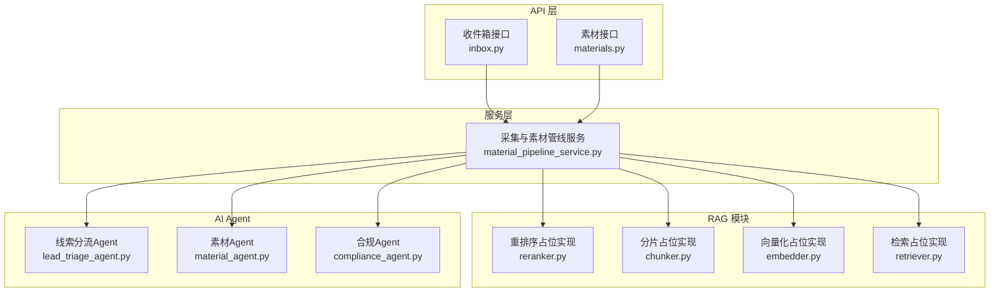
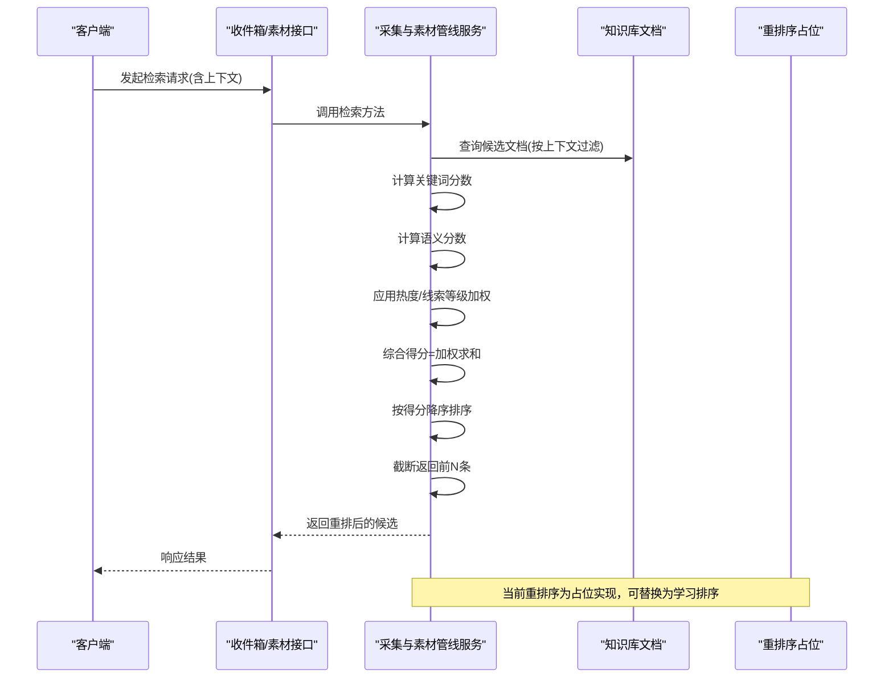
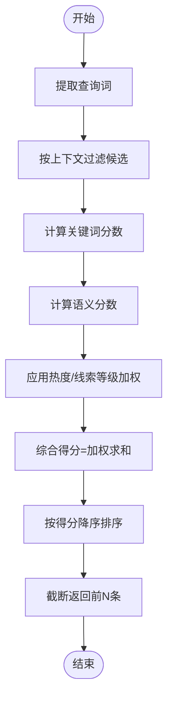
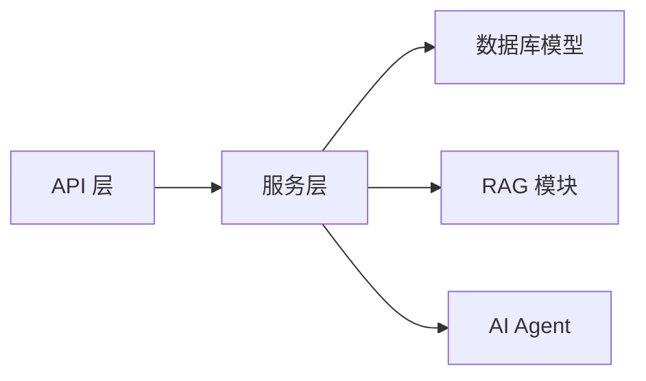

# 结果重排序机制

<cite>
**本文引用的文件**
- [material_pipeline_service.py](file://backend/app/services/collector/material_pipeline_service.py)
- [inbox.py](file://backend/app/api/v1/endpoints/inbox.py)
- [materials.py](file://backend/app/api/v2/endpoints/materials.py)
- [reranker.py](file://backend/app/ai/rag/reranker.py)
- [chunker.py](file://backend/app/ai/rag/chunker.py)
- [embedder.py](file://backend/app/ai/rag/embedder.py)
- [retriever.py](file://backend/app/ai/rag/retriever.py)
- [lead_triage_agent.py](file://backend/app/ai/agents/lead_triage_agent.py)
- [material_agent.py](file://backend/app/ai/agents/material_agent.py)
- [compliance_agent.py](file://backend/app/ai/agents/compliance_agent.py)
</cite>

## 目录
1. [引言](#引言)
2. [项目结构](#项目结构)
3. [核心组件](#核心组件)
4. [架构总览](#架构总览)
5. [详细组件分析](#详细组件分析)
6. [依赖关系分析](#依赖关系分析)
7. [性能考量](#性能考量)
8. [故障排查指南](#故障排查指南)
9. [结论](#结论)
10. [附录](#附录)

## 引言
本技术文档聚焦于“智获客”系统中的“结果重排序机制”。当前仓库中，重排序的核心逻辑集中在采集与素材管线服务中，采用启发式评分与上下文匹配的方式对候选知识文档进行打分与排序，形成最终的参考列表。同时，RAG（检索增强生成）模块提供了占位的重排序接口，为后续引入学习排序或机器学习重排序留出扩展空间。

## 项目结构
围绕重排序机制的关键文件与职责如下：
- 后端服务层：采集与素材管线服务实现了检索候选的筛选、关键词与语义评分、热度与线索等级加权、最终综合得分与排序。
- API 层：提供收件箱与素材列表查询接口，作为外部调用入口。
- RAG 模块：提供检索、分片、向量化与重排序的占位实现，便于未来替换为更复杂的模型重排序。
- AI Agent：线索分流、素材处理与合规审查等辅助能力，间接影响重排序输入质量与后续生成。

图表来源
- [inbox.py:44-84](file://backend/app/api/v1/endpoints/inbox.py#L44-L84)
- [materials.py:151-170](file://backend/app/api/v2/endpoints/materials.py#L151-L170)
- [material_pipeline_service.py:1393-1454](file://backend/app/services/collector/material_pipeline_service.py#L1393-L1454)
- [reranker.py:1-3](file://backend/app/ai/rag/reranker.py#L1-L3)
- [chunker.py:1-3](file://backend/app/ai/rag/chunker.py#L1-L3)
- [embedder.py:1-3](file://backend/app/ai/rag/embedder.py#L1-L3)
- [retriever.py:1-3](file://backend/app/ai/rag/retriever.py#L1-L3)
- [lead_triage_agent.py:1-3](file://backend/app/ai/agents/lead_triage_agent.py#L1-L3)
- [material_agent.py:1-3](file://backend/app/ai/agents/material_agent.py#L1-L3)
- [compliance_agent.py:1-3](file://backend/app/ai/agents/compliance_agent.py#L1-L3)

章节来源
- [inbox.py:44-84](file://backend/app/api/v1/endpoints/inbox.py#L44-L84)
- [materials.py:151-170](file://backend/app/api/v2/endpoints/materials.py#L151-L170)
- [material_pipeline_service.py:1393-1454](file://backend/app/services/collector/material_pipeline_service.py#L1393-L1454)

## 核心组件
- 采集与素材管线服务（AcquisitionIntakeService）
  - 负责从知识库中筛选候选文档，计算关键词与语义相似度，结合素材热度与线索等级进行加权，最终按综合得分降序排列并截断返回。
- RAG 模块
  - 提供检索、分片、向量化与重排序的占位函数，当前实现为恒等返回，便于后续接入学习排序或模型重排序。
- AI Agent
  - 线索分流、素材处理与合规审查等辅助能力，间接提升重排序输入质量与生成阶段的合规性。

章节来源
- [material_pipeline_service.py:1393-1454](file://backend/app/services/collector/material_pipeline_service.py#L1393-L1454)
- [reranker.py:1-3](file://backend/app/ai/rag/reranker.py#L1-L3)
- [lead_triage_agent.py:1-3](file://backend/app/ai/agents/lead_triage_agent.py#L1-L3)
- [material_agent.py:1-3](file://backend/app/ai/agents/material_agent.py#L1-L3)
- [compliance_agent.py:1-3](file://backend/app/ai/agents/compliance_agent.py#L1-L3)

## 架构总览
重排序机制在“检索—评分—排序—截断”的流水线上运行，主要流程如下：
- 输入：查询文本、平台、账号类型、目标受众等上下文。
- 候选：按上下文过滤与时间倒序限制候选数量。
- 评分：关键词命中计数、语义相似度（词集重叠与序列相似度），叠加素材热度与线索等级加权。
- 排序：按综合得分降序，截取前 N 返回。

图表来源
- [inbox.py:44-84](file://backend/app/api/v1/endpoints/inbox.py#L44-L84)
- [materials.py:151-170](file://backend/app/api/v2/endpoints/materials.py#L151-L170)
- [material_pipeline_service.py:1393-1454](file://backend/app/services/collector/material_pipeline_service.py#L1393-L1454)
- [reranker.py:1-3](file://backend/app/ai/rag/reranker.py#L1-L3)

## 详细组件分析

### 采集与素材管线服务（AcquisitionIntakeService）
- 关键评分函数
  - 关键词评分：统计查询词在文档标题/摘要/正文中的命中次数，作为关键词相关性的基础。
  - 语义评分：基于词集重叠与短文本序列相似度的加权组合，衡量查询与文档的语义接近程度。
  - 上下文加权：根据素材的热度与线索等级进行加权，高价值素材获得额外权重。
- 综合得分与排序
  - 综合得分由关键词与语义分数按固定权重相加，并叠加热度与线索等级加权，最终按得分降序排序并截断返回。
- 候选筛选
  - 首先按平台、账号类型、目标受众等结构化条件过滤，若无匹配则回退至平台维度过滤，最后按时间倒序限制候选数量。

图表来源
- [material_pipeline_service.py:1375-1454](file://backend/app/services/collector/material_pipeline_service.py#L1375-L1454)

章节来源
- [material_pipeline_service.py:1375-1454](file://backend/app/services/collector/material_pipeline_service.py#L1375-L1454)

### RAG 模块（占位实现）
- 分片、向量化与检索均为恒等返回，当前不参与实际重排序。
- 重排序占位函数接收候选列表并原样返回，为后续接入学习排序或模型重排序预留接口。

章节来源
- [reranker.py:1-3](file://backend/app/ai/rag/reranker.py#L1-L3)
- [chunker.py:1-3](file://backend/app/ai/rag/chunker.py#L1-L3)
- [embedder.py:1-3](file://backend/app/ai/rag/embedder.py#L1-L3)
- [retriever.py:1-3](file://backend/app/ai/rag/retriever.py#L1-L3)

### AI Agent（辅助能力）
- 线索分流Agent：对线索进行初步分流，减少无关内容进入重排序环节。
- 素材Agent：对素材进行结构化处理，提升后续检索与重排序的输入质量。
- 合规Agent：在生成阶段进行合规审查，间接影响重排序后内容的可用性。

章节来源
- [lead_triage_agent.py:1-3](file://backend/app/ai/agents/lead_triage_agent.py#L1-L3)
- [material_agent.py:1-3](file://backend/app/ai/agents/material_agent.py#L1-L3)
- [compliance_agent.py:1-3](file://backend/app/ai/agents/compliance_agent.py#L1-L3)

## 依赖关系分析
- API 层依赖服务层提供的检索与重排序能力，通过接口参数传递上下文信息。
- 服务层依赖数据库模型与工具函数，完成候选筛选、评分与排序。
- RAG 模块与 AI Agent 为可插拔组件，当前未被服务层直接调用，但为后续扩展提供接口。

图表来源
- [inbox.py:44-84](file://backend/app/api/v1/endpoints/inbox.py#L44-L84)
- [materials.py:151-170](file://backend/app/api/v2/endpoints/materials.py#L151-L170)
- [material_pipeline_service.py:1393-1454](file://backend/app/services/collector/material_pipeline_service.py#L1393-L1454)
- [reranker.py:1-3](file://backend/app/ai/rag/reranker.py#L1-L3)
- [lead_triage_agent.py:1-3](file://backend/app/ai/agents/lead_triage_agent.py#L1-L3)

章节来源
- [inbox.py:44-84](file://backend/app/api/v1/endpoints/inbox.py#L44-L84)
- [materials.py:151-170](file://backend/app/api/v2/endpoints/materials.py#L151-L170)
- [material_pipeline_service.py:1393-1454](file://backend/app/services/collector/material_pipeline_service.py#L1393-L1454)

## 性能考量
- 候选数量控制：按上下文过滤后限制候选数量，降低评分与排序开销。
- 评分计算简化：关键词评分采用命中计数，语义评分采用词集重叠与序列相似度的线性组合，避免复杂向量运算。
- 排序与截断：一次性排序并截断，减少后续处理成本。
- 扩展建议：
  - 引入缓存：对高频查询与候选集合进行缓存，减少重复计算。
  - 并行化：将候选评分与排序过程并行化，提升吞吐。
  - 模型重排序：在保证延迟可控的前提下，逐步引入学习排序或模型重排序以提升准确性。

## 故障排查指南
- 重排序结果为空
  - 检查上下文过滤条件是否过于严格，导致候选为空。
  - 确认候选数量限制是否过小，必要时适当放宽。
- 重排序结果不合理
  - 核对关键词与语义评分权重，确保与业务目标一致。
  - 检查素材热度与线索等级字段是否正确传入。
- 性能瓶颈
  - 关注候选数量与排序规模，必要时增加缓存或并行化。
  - 对评分函数进行基准测试，识别热点路径。

## 结论
当前系统的重排序机制以启发式评分为主，结合关键词命中、语义相似度与素材上下文加权，形成稳定的候选排序。RAG 模块与 AI Agent 为后续引入学习排序与更智能的重排序提供了扩展点。建议在保障性能的前提下，逐步引入模型重排序，并完善评估体系与实时调优策略。

## 附录

### 重排序算法对比与适用性
- 启发式重排序
  - 优点：实现简单、延迟低、可解释性强。
  - 缺点：对复杂语义理解有限，难以适应多变的业务场景。
  - 适用：初期快速上线、规则明确的场景。
- 学习排序（Learning to Rank, LTR）
  - 优点：可利用历史交互数据训练，提升相关性与用户满意度。
  - 缺点：训练成本高、特征工程复杂、上线周期较长。
  - 适用：有足够标注数据与资源的成熟场景。
- 机器学习重排序
  - 优点：可融合多模态特征与上下文，泛化能力强。
  - 缺点：部署与维护复杂，需持续监控与再训练。
  - 适用：对准确性要求极高且具备数据与算力资源的场景。

### 重排序参数配置与调优
- 权重分配
  - 关键词权重：用于强调显式匹配，适合强相关场景。
  - 语义权重：用于捕捉隐式相关性，适合长尾与模糊查询。
  - 热度/线索等级加权：用于突出高价值素材，平衡内容质量与转化潜力。
- 阈值设置
  - 候选数量阈值：控制评分与排序成本，避免过多候选。
  - 得分阈值：剔除低质量候选，提升整体质量。
- 排序优先级
  - 先按综合得分排序，再按时间/热度等次级指标微调。

### 重排序效果评估方法
- 精确率（Precision）：在返回的候选中，真正相关的比例。
- 召回率（Recall）：在所有相关候选中，被成功返回的比例。
- 归一化折损累积增益（NDCG）：综合考虑相关性与排序位置的指标，适用于评估排序质量。