# 语义检索算法

<cite>
**本文引用的文件**
- [retriever.py](file://backend/app/ai/rag/retriever.py)
- [embedder.py](file://backend/app/ai/rag/embedder.py)
- [reranker.py](file://backend/app/ai/rag/reranker.py)
- [chunker.py](file://backend/app/ai/rag/chunker.py)
- [knowledge_api.py](file://backend/app/integrations/volcengine/knowledge_api.py)
- [material_pipeline_service.py](file://backend/app/services/collector/material_pipeline_service.py)
- [models.py](file://backend/app/models/models.py)
- [config.py](file://backend/app/core/config.py)
- [ai_service.py](file://backend/app/services/ai_service.py)
</cite>

## 目录
1. [简介](#简介)
2. [项目结构](#项目结构)
3. [核心组件](#核心组件)
4. [架构总览](#架构总览)
5. [详细组件分析](#详细组件分析)
6. [依赖分析](#依赖分析)
7. [性能考虑](#性能考虑)
8. [故障排查指南](#故障排查指南)
9. [结论](#结论)
10. [附录](#附录)

## 简介
本技术文档围绕“智获客”的语义检索能力进行系统化梳理，重点解释检索算法的设计原理与实现机制，涵盖相似度计算、检索策略与结果排序；详述检索流程的三个阶段：查询向量化、候选文档筛选与相似度评分；对比 BM25、向量检索与混合检索的适用场景与性能特点；给出检索参数配置与调优建议；总结索引构建、缓存与并行处理等性能优化策略，并提供质量评估与错误处理机制。

## 项目结构
从代码库可见，检索相关能力主要分布在以下模块：
- RAG 工具链：文本切分、嵌入、重排与检索接口占位
- 知识库对接：火山引擎知识检索接口
- 素材采集与知识化：采集流水线将内容标准化并生成知识块
- 数据模型：定义知识文档与知识块等检索实体
- 配置：模型与外部服务访问参数
- 大模型服务：提供 LLM 能力，支撑检索后的重排与生成

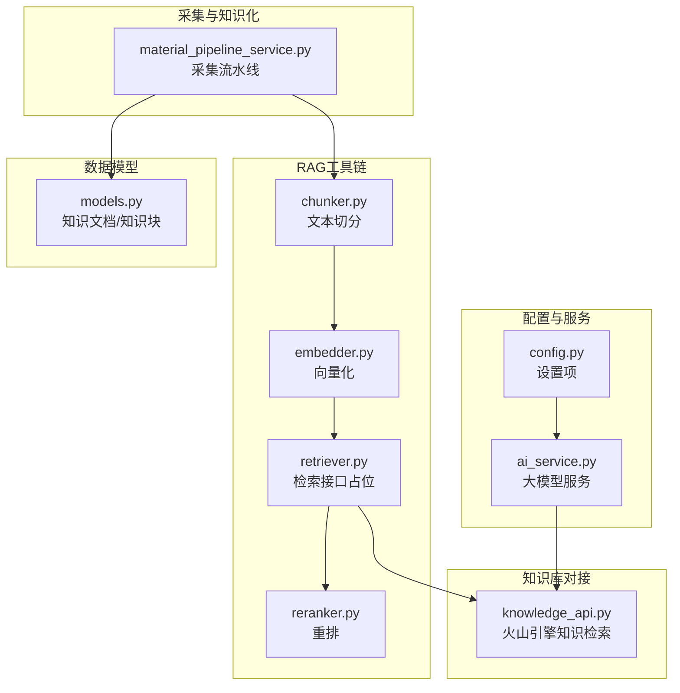

图表来源
- [retriever.py:1-3](file://backend/app/ai/rag/retriever.py#L1-L3)
- [embedder.py:1-3](file://backend/app/ai/rag/embedder.py#L1-L3)
- [reranker.py:1-3](file://backend/app/ai/rag/reranker.py#L1-L3)
- [chunker.py:1-3](file://backend/app/ai/rag/chunker.py#L1-L3)
- [knowledge_api.py:1-4](file://backend/app/integrations/volcengine/knowledge_api.py#L1-L4)
- [material_pipeline_service.py:1-800](file://backend/app/services/collector/material_pipeline_service.py#L1-L800)
- [models.py:642-684](file://backend/app/models/models.py#L642-L684)
- [config.py:71-84](file://backend/app/core/config.py#L71-L84)
- [ai_service.py:15-460](file://backend/app/services/ai_service.py#L15-L460)

章节来源
- [retriever.py:1-3](file://backend/app/ai/rag/retriever.py#L1-L3)
- [embedder.py:1-3](file://backend/app/ai/rag/embedder.py#L1-L3)
- [reranker.py:1-3](file://backend/app/ai/rag/reranker.py#L1-L3)
- [chunker.py:1-3](file://backend/app/ai/rag/chunker.py#L1-L3)
- [knowledge_api.py:1-4](file://backend/app/integrations/volcengine/knowledge_api.py#L1-L4)
- [material_pipeline_service.py:1-800](file://backend/app/services/collector/material_pipeline_service.py#L1-L800)
- [models.py:642-684](file://backend/app/models/models.py#L642-L684)
- [config.py:71-84](file://backend/app/core/config.py#L71-L84)
- [ai_service.py:15-460](file://backend/app/services/ai_service.py#L15-L460)

## 核心组件
- 文本切分：将长文本按段落或长度切分为可向量化的片段
- 向量化：将文本转换为稠密向量表示
- 检索接口：对外提供检索入口（当前为占位）
- 重排：对候选结果进行二次排序
- 知识库对接：调用火山引擎知识检索接口
- 采集流水线：将采集内容标准化、去噪、打标，并生成知识块
- 数据模型：知识文档与知识块的持久化结构
- 配置：模型与外部服务访问参数
- 大模型服务：提供 LLM 能力，支持检索后的内容生成与重排

章节来源
- [chunker.py:1-3](file://backend/app/ai/rag/chunker.py#L1-L3)
- [embedder.py:1-3](file://backend/app/ai/rag/embedder.py#L1-L3)
- [retriever.py:1-3](file://backend/app/ai/rag/retriever.py#L1-L3)
- [reranker.py:1-3](file://backend/app/ai/rag/reranker.py#L1-L3)
- [knowledge_api.py:1-4](file://backend/app/integrations/volcengine/knowledge_api.py#L1-L4)
- [material_pipeline_service.py:1-800](file://backend/app/services/collector/material_pipeline_service.py#L1-L800)
- [models.py:642-684](file://backend/app/models/models.py#L642-L684)
- [config.py:71-84](file://backend/app/core/config.py#L71-L84)
- [ai_service.py:15-460](file://backend/app/services/ai_service.py#L15-L460)

## 架构总览
检索系统以“采集-知识化-检索-重排-应用”为主线，结合外部知识库与本地知识块，形成多源融合的检索能力。

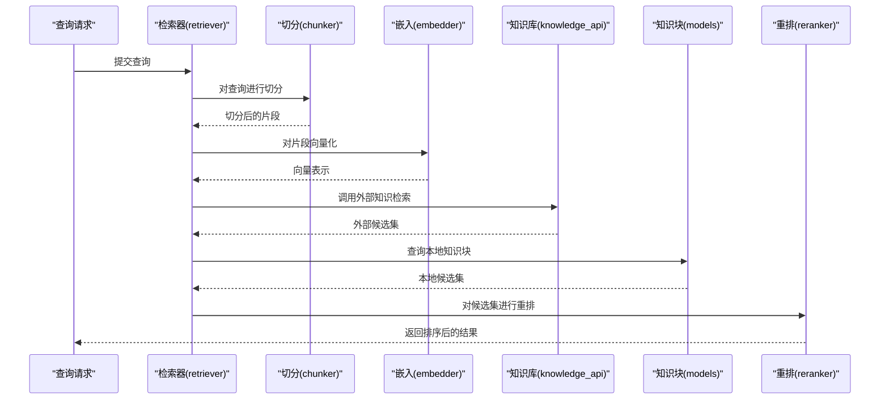

图表来源
- [retriever.py:1-3](file://backend/app/ai/rag/retriever.py#L1-L3)
- [chunker.py:1-3](file://backend/app/ai/rag/chunker.py#L1-L3)
- [embedder.py:1-3](file://backend/app/ai/rag/embedder.py#L1-L3)
- [knowledge_api.py:1-4](file://backend/app/integrations/volcengine/knowledge_api.py#L1-L4)
- [models.py:642-684](file://backend/app/models/models.py#L642-L684)
- [reranker.py:1-3](file://backend/app/ai/rag/reranker.py#L1-L3)

## 详细组件分析

### 组件A：检索器（retriever）
- 当前实现：占位返回空列表
- 设计要点：作为统一检索入口，协调外部知识库与本地知识块；未来应集成查询向量化、相似度计算与候选筛选
- 接口契约：接收查询字符串，返回匹配的知识块 ID 或文档元数据列表

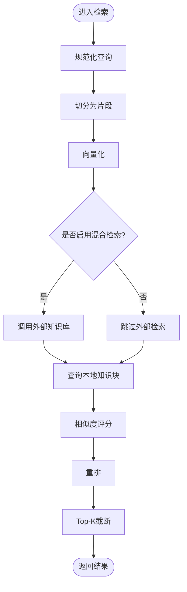

图表来源
- [retriever.py:1-3](file://backend/app/ai/rag/retriever.py#L1-L3)
- [chunker.py:1-3](file://backend/app/ai/rag/chunker.py#L1-L3)
- [embedder.py:1-3](file://backend/app/ai/rag/embedder.py#L1-L3)
- [reranker.py:1-3](file://backend/app/ai/rag/reranker.py#L1-L3)
- [models.py:642-684](file://backend/app/models/models.py#L642-L684)
- [knowledge_api.py:1-4](file://backend/app/integrations/volcengine/knowledge_api.py#L1-L4)

章节来源
- [retriever.py:1-3](file://backend/app/ai/rag/retriever.py#L1-L3)

### 组件B：文本切分（chunker）
- 当前实现：按输入文本直接返回单片段
- 设计要点：支持按段落与长度切分，限制最大片段数量，便于后续向量化与检索
- 复杂度：时间复杂度近似 O(n)，空间复杂度 O(n)

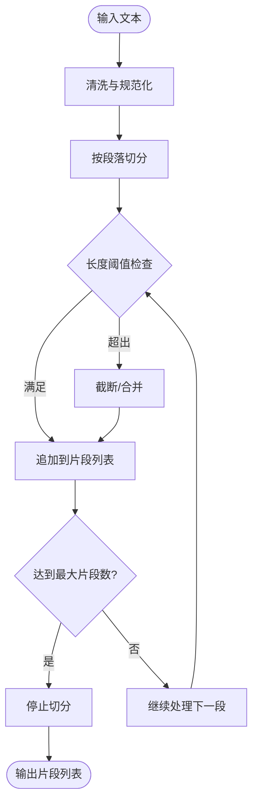

图表来源
- [chunker.py:1-3](file://backend/app/ai/rag/chunker.py#L1-L3)
- [material_pipeline_service.py:371-392](file://backend/app/services/collector/material_pipeline_service.py#L371-L392)

章节来源
- [chunker.py:1-3](file://backend/app/ai/rag/chunker.py#L1-L3)
- [material_pipeline_service.py:371-392](file://backend/app/services/collector/material_pipeline_service.py#L371-L392)

### 组件C：向量化（embedder）
- 当前实现：对空输入返回零向量，非空输入返回固定占位向量
- 设计要点：未来应接入具体嵌入模型，支持批量向量计算与维度归一化
- 复杂度：对每条片段计算向量，时间复杂度 O(m·d)，m 为片段数，d 为向量维度

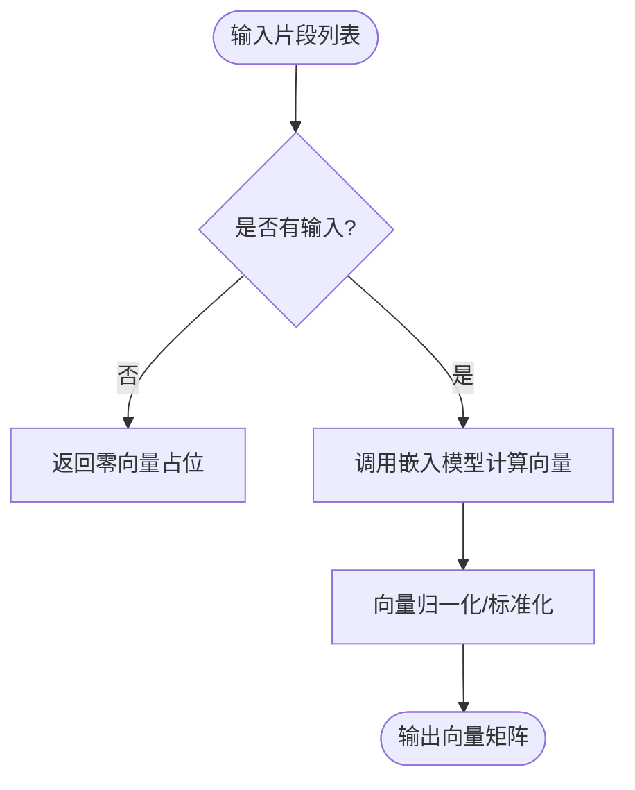

图表来源
- [embedder.py:1-3](file://backend/app/ai/rag/embedder.py#L1-L3)

章节来源
- [embedder.py:1-3](file://backend/app/ai/rag/embedder.py#L1-L3)

### 组件D：重排（reranker）
- 当前实现：直接返回原候选列表
- 设计要点：未来可引入交叉编码器或 LLM 重排，基于查询-文档相关性进行二次排序
- 复杂度：与候选规模成正比，建议批处理与缓存

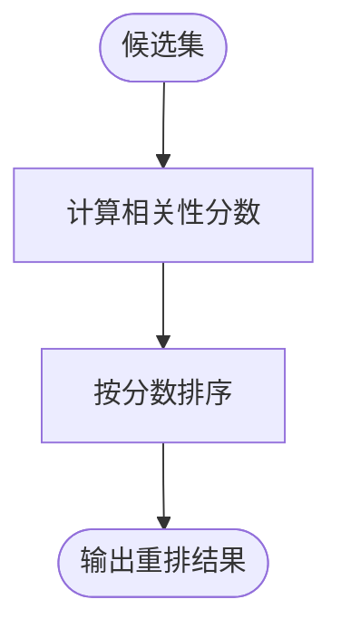

图表来源
- [reranker.py:1-3](file://backend/app/ai/rag/reranker.py#L1-L3)

章节来源
- [reranker.py:1-3](file://backend/app/ai/rag/reranker.py#L1-L3)

### 组件E：知识库对接（knowledge_api）
- 当前实现：占位函数，接收查询并返回空列表
- 设计要点：封装外部知识检索接口，支持限流、超时与错误处理；可与本地知识块合并排序

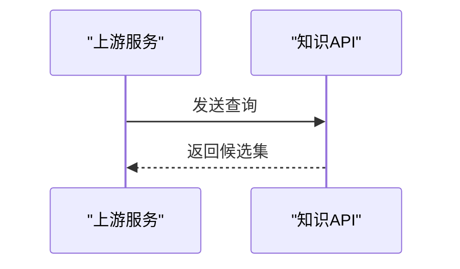

图表来源
- [knowledge_api.py:1-4](file://backend/app/integrations/volcengine/knowledge_api.py#L1-L4)

章节来源
- [knowledge_api.py:1-4](file://backend/app/integrations/volcengine/knowledge_api.py#L1-L4)

### 组件F：采集流水线与知识化（material_pipeline_service）
- 规范化与去噪：清洗 HTML、去除噪声行、标准化文本
- 特征提取：关键词、主题、受众、意图、风险等级
- 知识块生成：将内容切分为固定长度的片段，建立知识块
- 质量与相关性评分：用于后续检索与排序

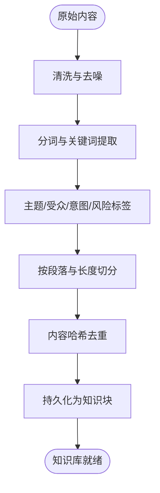

图表来源
- [material_pipeline_service.py:130-190](file://backend/app/services/collector/material_pipeline_service.py#L130-L190)
- [material_pipeline_service.py:215-226](file://backend/app/services/collector/material_pipeline_service.py#L215-L226)
- [material_pipeline_service.py:371-392](file://backend/app/services/collector/material_pipeline_service.py#L371-L392)
- [material_pipeline_service.py:796-800](file://backend/app/services/collector/material_pipeline_service.py#L796-L800)

章节来源
- [material_pipeline_service.py:130-190](file://backend/app/services/collector/material_pipeline_service.py#L130-L190)
- [material_pipeline_service.py:215-226](file://backend/app/services/collector/material_pipeline_service.py#L215-L226)
- [material_pipeline_service.py:371-392](file://backend/app/services/collector/material_pipeline_service.py#L371-L392)
- [material_pipeline_service.py:796-800](file://backend/app/services/collector/material_pipeline_service.py#L796-L800)

### 组件G：数据模型（知识文档与知识块）
- 知识文档：承载平台、主题、摘要、正文等结构化信息
- 知识块：按序号切分的片段，支持关键词标注与检索

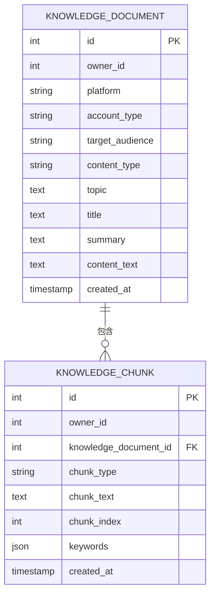

图表来源
- [models.py:642-684](file://backend/app/models/models.py#L642-L684)

章节来源
- [models.py:642-684](file://backend/app/models/models.py#L642-L684)

### 组件H：配置与大模型服务
- 配置：定义本地与云端模型访问参数、超时与限流
- 大模型服务：封装 LLM 调用，支持 Ark 与 Ollama，具备日志与错误处理

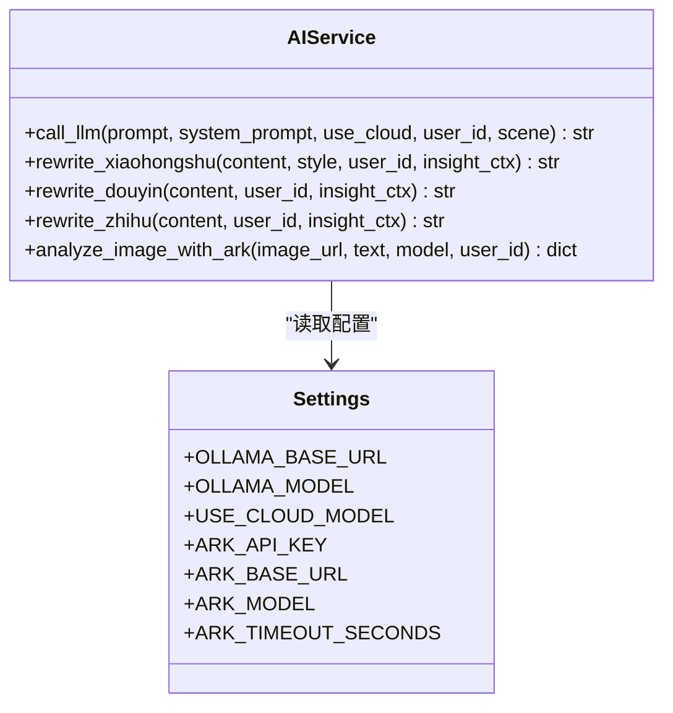

图表来源
- [ai_service.py:15-460](file://backend/app/services/ai_service.py#L15-L460)
- [config.py:71-84](file://backend/app/core/config.py#L71-L84)

章节来源
- [ai_service.py:15-460](file://backend/app/services/ai_service.py#L15-L460)
- [config.py:71-84](file://backend/app/core/config.py#L71-L84)

## 依赖分析
- 检索器依赖于切分器、嵌入器与重排器；同时可调用知识库接口与本地知识块
- 采集流水线依赖清洗与切分逻辑，生成知识块供检索器使用
- 配置与大模型服务为检索后重排与生成提供支撑

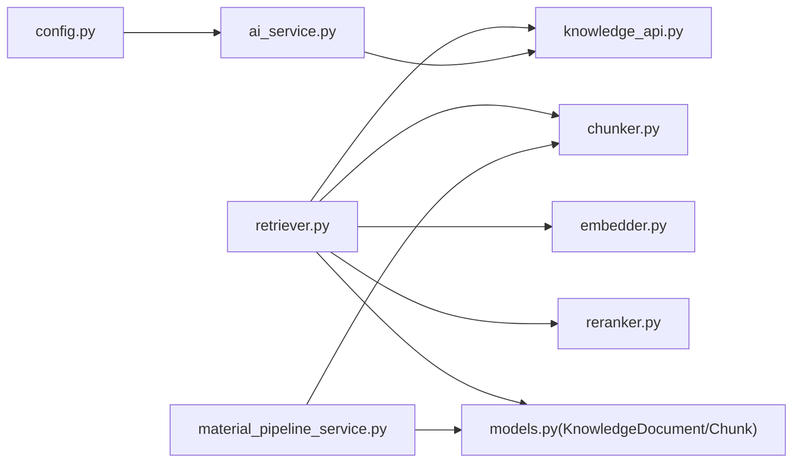

图表来源
- [retriever.py:1-3](file://backend/app/ai/rag/retriever.py#L1-L3)
- [chunker.py:1-3](file://backend/app/ai/rag/chunker.py#L1-L3)
- [embedder.py:1-3](file://backend/app/ai/rag/embedder.py#L1-L3)
- [reranker.py:1-3](file://backend/app/ai/rag/reranker.py#L1-L3)
- [knowledge_api.py:1-4](file://backend/app/integrations/volcengine/knowledge_api.py#L1-L4)
- [material_pipeline_service.py:1-800](file://backend/app/services/collector/material_pipeline_service.py#L1-L800)
- [models.py:642-684](file://backend/app/models/models.py#L642-L684)
- [config.py:71-84](file://backend/app/core/config.py#L71-L84)
- [ai_service.py:15-460](file://backend/app/services/ai_service.py#L15-L460)

章节来源
- [retriever.py:1-3](file://backend/app/ai/rag/retriever.py#L1-L3)
- [chunker.py:1-3](file://backend/app/ai/rag/chunker.py#L1-L3)
- [embedder.py:1-3](file://backend/app/ai/rag/embedder.py#L1-L3)
- [reranker.py:1-3](file://backend/app/ai/rag/reranker.py#L1-L3)
- [knowledge_api.py:1-4](file://backend/app/integrations/volcengine/knowledge_api.py#L1-L4)
- [material_pipeline_service.py:1-800](file://backend/app/services/collector/material_pipeline_service.py#L1-L800)
- [models.py:642-684](file://backend/app/models/models.py#L642-L684)
- [config.py:71-84](file://backend/app/core/config.py#L71-L84)
- [ai_service.py:15-460](file://backend/app/services/ai_service.py#L15-L460)

## 性能考虑
- 索引构建
  - 使用分层倒排索引或向量索引（如 IVF/PQ）加速相似度搜索
  - 对知识块进行预索引，减少在线计算开销
- 缓存机制
  - 查询向量化结果与候选集缓存，降低重复计算
  - 外部知识库响应缓存与限流控制
- 并行处理
  - 批量向量化与相似度计算并行化
  - 重排阶段采用异步队列与并发调度
- 参数调优
  - top-k：根据召回覆盖率与响应时间权衡
  - 相似度阈值：结合业务召回质量动态调整
  - 过滤条件：按平台/受众/风险等级快速筛除低质候选

## 故障排查指南
- 外部知识库调用失败
  - 检查鉴权与网络连通性，确认超时与重试策略
  - 查看 Ark 调用日志，定位状态码与错误信息
- 向量化异常
  - 校验输入文本长度与编码，确保非空与合理长度
  - 检查嵌入模型可用性与版本兼容
- 重排耗时
  - 评估候选规模与重排模型性能，必要时增加缓存与批处理
- 数据一致性
  - 确认知识块更新与检索索引同步
  - 核查内容哈希与去重逻辑

章节来源
- [ai_service.py:132-239](file://backend/app/services/ai_service.py#L132-L239)
- [config.py:76-84](file://backend/app/core/config.py#L76-L84)

## 结论
当前仓库中的检索组件以占位形式存在，但已具备清晰的模块边界与扩展路径。通过完善检索器、引入向量化与重排、打通外部知识库与本地知识块，并配合采集流水线的标准化与切分，可构建高性能、可扩展的语义检索系统。建议优先实现检索器与嵌入器，随后逐步接入重排与缓存优化，最终形成稳定可靠的检索能力。

## 附录
- 相似度计算方法
  - 向量相似度：余弦相似度或内积
  - 文本相似度：BM25（可与向量相似度融合）
- 检索策略
  - 单阶段：仅向量检索或仅 BM25
  - 两阶段：粗排（BM25/关键词）+ 精排（向量+重排）
  - 混合检索：多路召回融合（RRF/加权）
- 结果排序
  - 单路：按相似度分数降序
  - 多路：融合不同来源的排序信号，输出综合得分