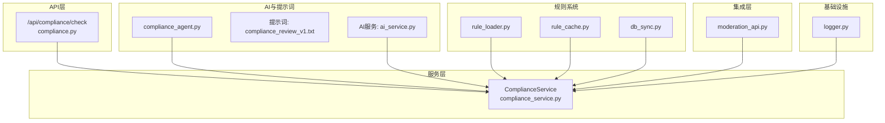
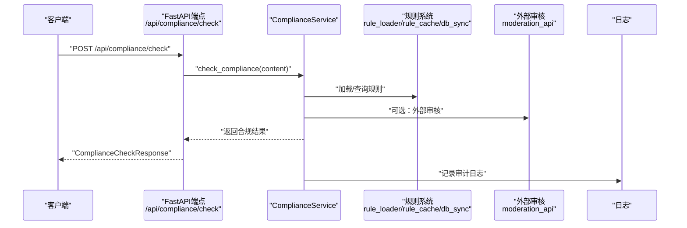
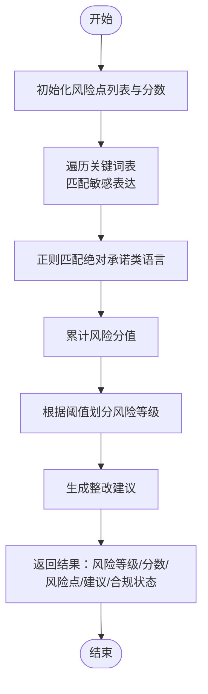
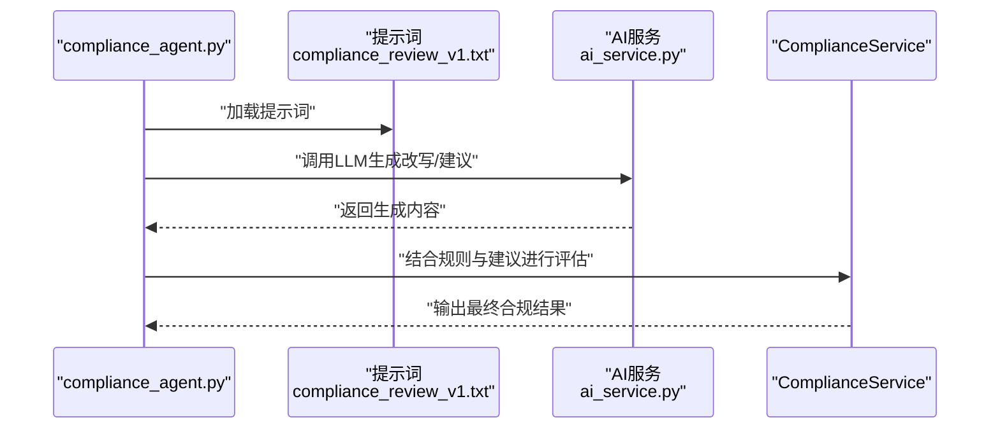
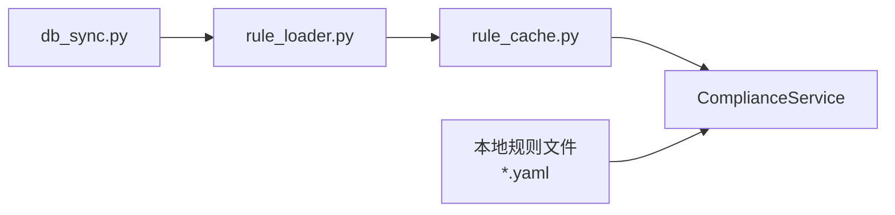
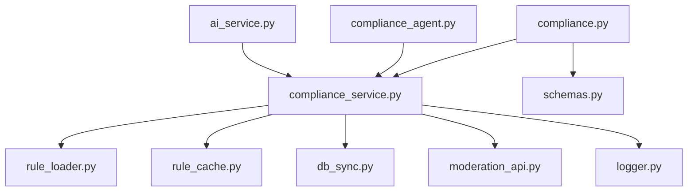

# 合规性检查

<cite>
**本文引用的文件**
- [compliance_service.py](file://backend/app/services/compliance_service.py)
- [compliance.py](file://backend/app/api/endpoints/compliance.py)
- [schemas.py](file://backend/app/schemas/schemas.py)
- [compliance_agent.py](file://backend/app/ai/agents/compliance_agent.py)
- [compliance_review_v1.txt](file://backend/app/ai/prompts/compliance_review_v1.txt)
- [ai_service.py](file://backend/app/services/ai_service.py)
- [moderation_api.py](file://backend/app/integrations/volcengine/moderation_api.py)
- [rule_loader.py](file://backend/app/rules/dynamic/rule_loader.py)
- [rule_cache.py](file://backend/app/rules/dynamic/rule_cache.py)
- [db_sync.py](file://backend/app/rules/sync/db_sync.py)
- [chunker.py](file://backend/app/ai/rag/chunker.py)
- [embedder.py](file://backend/app/ai/rag/embedder.py)
- [logger.py](file://backend/app/core/logger.py)
</cite>

## 目录
1. [简介](#简介)
2. [项目结构](#项目结构)
3. [核心组件](#核心组件)
4. [架构总览](#架构总览)
5. [详细组件分析](#详细组件分析)
6. [依赖分析](#依赖分析)
7. [性能考虑](#性能考虑)
8. [故障排查指南](#故障排查指南)
9. [结论](#结论)
10. [附录](#附录)

## 简介
本技术文档面向“智获客”合规性检查系统，聚焦合规审查算法的实现机制与工作流程，包括政策规则匹配、风险要素识别、合规评分计算、风险等级分类、违规类型识别与整改建议生成。文档还阐述合规Agent的工作流程（内容预处理、规则引擎调用、风险评估），并给出多维度合规检查体系（金融法规、平台政策、行业标准）的落地方式。最后提供配置参数、调用接口、结果解释、合规日志记录与审计追踪、异常处理机制等实用信息。

## 项目结构
合规相关代码主要分布在以下模块：
- API层：提供合规检查接口，负责鉴权与请求转发
- 服务层：实现合规检查算法与评分逻辑
- AI与提示词：为合规Agent提供提示词与LLM调用能力
- 规则系统：本地规则与动态规则加载、缓存与同步
- 集成层：火山引擎文本审核接口适配
- 日志与监控：统一日志获取工具

图表来源
- [compliance.py:11-19](file://backend/app/api/endpoints/compliance.py#L11-L19)
- [compliance_service.py:24-71](file://backend/app/services/compliance_service.py#L24-L71)
- [compliance_agent.py:1-3](file://backend/app/ai/agents/compliance_agent.py#L1-L3)
- [compliance_review_v1.txt:1-1](file://backend/app/ai/prompts/compliance_review_v1.txt#L1-L1)
- [ai_service.py:24-38](file://backend/app/services/ai_service.py#L24-L38)
- [rule_loader.py:1-3](file://backend/app/rules/dynamic/rule_loader.py#L1-L3)
- [rule_cache.py:4-6](file://backend/app/rules/dynamic/rule_cache.py#L4-L6)
- [db_sync.py:1-3](file://backend/app/rules/sync/db_sync.py#L1-L3)
- [moderation_api.py:1-3](file://backend/app/integrations/volcengine/moderation_api.py#L1-L3)
- [logger.py:4-6](file://backend/app/core/logger.py#L4-L6)

章节来源
- [compliance.py:1-20](file://backend/app/api/endpoints/compliance.py#L1-L20)
- [compliance_service.py:1-113](file://backend/app/services/compliance_service.py#L1-L113)
- [schemas.py:149-161](file://backend/app/schemas/schemas.py#L149-L161)

## 核心组件
- 合规服务（ComplianceService）
  - 实现关键词与正则模式匹配，统计风险点与风险分值，输出风险等级、建议与合规状态
- API端点（/api/compliance/check）
  - 提供鉴权校验与请求响应模型，调用合规服务并返回结果
- 请求/响应模型（ComplianceCheckRequest/ComplianceCheckResponse）
  - 定义输入内容与输出字段，确保前后端契约一致
- 合规Agent与提示词
  - 提供提示词模板，配合AI服务进行内容重写与合规优化
- 规则系统
  - 动态规则加载、缓存与数据库同步，支撑多平台规则扩展
- 集成层
  - 火山引擎文本审核接口适配，便于接入外部合规审核能力
- 日志
  - 统一日志获取工具，便于审计与问题定位

章节来源
- [compliance_service.py:5-71](file://backend/app/services/compliance_service.py#L5-L71)
- [compliance.py:11-19](file://backend/app/api/endpoints/compliance.py#L11-L19)
- [schemas.py:149-161](file://backend/app/schemas/schemas.py#L149-L161)
- [compliance_agent.py:1-3](file://backend/app/ai/agents/compliance_agent.py#L1-L3)
- [compliance_review_v1.txt:1-1](file://backend/app/ai/prompts/compliance_review_v1.txt#L1-L1)
- [ai_service.py:24-38](file://backend/app/services/ai_service.py#L24-L38)
- [rule_loader.py:1-3](file://backend/app/rules/dynamic/rule_loader.py#L1-L3)
- [rule_cache.py:4-6](file://backend/app/rules/dynamic/rule_cache.py#L4-L6)
- [db_sync.py:1-3](file://backend/app/rules/sync/db_sync.py#L1-L3)
- [moderation_api.py:1-3](file://backend/app/integrations/volcengine/moderation_api.py#L1-L3)
- [logger.py:4-6](file://backend/app/core/logger.py#L4-L6)

## 架构总览
合规检查系统采用“API → 服务 → 规则/集成 → 日志”的分层设计。API层负责鉴权与请求转发；服务层承担核心算法与评分；规则系统提供动态扩展；集成层对接外部审核能力；日志贯穿全流程用于审计与监控。

图表来源
- [compliance.py:11-19](file://backend/app/api/endpoints/compliance.py#L11-L19)
- [compliance_service.py:24-71](file://backend/app/services/compliance_service.py#L24-L71)
- [rule_loader.py:1-3](file://backend/app/rules/dynamic/rule_loader.py#L1-L3)
- [rule_cache.py:4-6](file://backend/app/rules/dynamic/rule_cache.py#L4-L6)
- [db_sync.py:1-3](file://backend/app/rules/sync/db_sync.py#L1-L3)
- [moderation_api.py:1-3](file://backend/app/integrations/volcengine/moderation_api.py#L1-L3)
- [logger.py:4-6](file://backend/app/core/logger.py#L4-L6)

## 详细组件分析

### 合规服务（ComplianceService）
- 关键职责
  - 风险关键词匹配与计分
  - 绝对承诺类语言的正则识别
  - 风险等级划分与合规状态判定
  - 整改建议生成与逐项纠正
- 数据结构与复杂度
  - 关键词表：O(1)查找，整体扫描O(N)（N为关键词数）
  - 正则匹配：对输入字符串进行多次扫描，复杂度近似O(M×P)，M为文本长度，P为正则数量
  - 建议生成：基于已识别风险点集合去重，时间复杂度O(R)，R为风险点数
- 错误处理
  - 正则匹配失败时跳过该规则，不影响整体流程
  - 建议生成异常回退为兜底建议
- 性能优化建议
  - 对超长文本可先做分块处理（结合RAG组件思路）
  - 缓存热点规则与高频关键词
  - 并行化多正则匹配（注意线程安全）

图表来源
- [compliance_service.py:24-71](file://backend/app/services/compliance_service.py#L24-L71)

章节来源
- [compliance_service.py:5-113](file://backend/app/services/compliance_service.py#L5-L113)

### API端点（/api/compliance/check）
- 职责
  - 接收请求体（内容与类型），鉴权后调用合规服务，返回标准化响应
- 输入输出
  - 请求模型：ComplianceCheckRequest（content, content_type）
  - 响应模型：ComplianceCheckResponse（risk_level, risk_score, risk_points, suggestions, is_compliant）
- 安全与权限
  - 使用依赖注入进行令牌验证与数据库会话管理

章节来源
- [compliance.py:11-19](file://backend/app/api/endpoints/compliance.py#L11-L19)
- [schemas.py:149-161](file://backend/app/schemas/schemas.py#L149-L161)

### 合规Agent与提示词
- Agent入口
  - 提供合规Agent运行函数占位，便于后续接入LLM与提示词
- 提示词
  - 提供合规审核助手的提示词模板，指导识别风险表达并给出替代建议
- AI服务
  - 支持本地Ollama与火山引擎Ark两种推理路径，具备日志与用量统计能力

图表来源
- [compliance_agent.py:1-3](file://backend/app/ai/agents/compliance_agent.py#L1-L3)
- [compliance_review_v1.txt:1-1](file://backend/app/ai/prompts/compliance_review_v1.txt#L1-L1)
- [ai_service.py:24-38](file://backend/app/services/ai_service.py#L24-L38)
- [compliance_service.py:24-71](file://backend/app/services/compliance_service.py#L24-L71)

章节来源
- [compliance_agent.py:1-3](file://backend/app/ai/agents/compliance_agent.py#L1-L3)
- [compliance_review_v1.txt:1-1](file://backend/app/ai/prompts/compliance_review_v1.txt#L1-L1)
- [ai_service.py:24-38](file://backend/app/services/ai_service.py#L24-L38)

### 规则系统（动态/本地）
- 动态规则
  - 规则加载器：从远端或本地加载规则集
  - 规则缓存：内存级缓存，降低重复加载成本
  - 数据库同步：从数据库拉取最新规则版本
- 本地规则
  - 平台规则文件（如抖音、小红书等）作为本地规则基线
- 扩展建议
  - 将ComplianceService与规则系统解耦，通过策略模式或规则引擎适配器接入

图表来源
- [rule_loader.py:1-3](file://backend/app/rules/dynamic/rule_loader.py#L1-L3)
- [rule_cache.py:4-6](file://backend/app/rules/dynamic/rule_cache.py#L4-L6)
- [db_sync.py:1-3](file://backend/app/rules/sync/db_sync.py#L1-L3)
- [compliance_service.py:24-71](file://backend/app/services/compliance_service.py#L24-L71)

章节来源
- [rule_loader.py:1-3](file://backend/app/rules/dynamic/rule_loader.py#L1-L3)
- [rule_cache.py:4-6](file://backend/app/rules/dynamic/rule_cache.py#L4-L6)
- [db_sync.py:1-3](file://backend/app/rules/sync/db_sync.py#L1-L3)

### 外部审核集成（火山引擎Moderation）
- 能力
  - 提供文本审核接口，返回风险等级
- 使用建议
  - 在合规服务中作为可选增强步骤，提升准确性与权威性

章节来源
- [moderation_api.py:1-3](file://backend/app/integrations/volcengine/moderation_api.py#L1-L3)

### 日志与审计
- 日志工具
  - 提供统一日志获取方法，便于在各组件中记录审计事件
- 建议
  - 在合规服务中记录每次检查的输入、规则命中、建议与最终结果，支持回溯与统计

章节来源
- [logger.py:4-6](file://backend/app/core/logger.py#L4-L6)

## 依赖分析
- 组件耦合
  - API端点仅依赖服务层与模型定义，保持低耦合
  - 合规服务独立于规则系统与外部接口，便于替换与扩展
- 外部依赖
  - LLM调用（Ollama/Ark）与HTTP客户端
  - 数据库会话（SQLAlchemy）
- 循环依赖
  - 当前未发现循环依赖迹象

图表来源
- [compliance.py:11-19](file://backend/app/api/endpoints/compliance.py#L11-L19)
- [compliance_service.py:24-71](file://backend/app/services/compliance_service.py#L24-L71)
- [schemas.py:149-161](file://backend/app/schemas/schemas.py#L149-L161)
- [rule_loader.py:1-3](file://backend/app/rules/dynamic/rule_loader.py#L1-L3)
- [rule_cache.py:4-6](file://backend/app/rules/dynamic/rule_cache.py#L4-L6)
- [db_sync.py:1-3](file://backend/app/rules/sync/db_sync.py#L1-L3)
- [moderation_api.py:1-3](file://backend/app/integrations/volcengine/moderation_api.py#L1-L3)
- [logger.py:4-6](file://backend/app/core/logger.py#L4-L6)
- [compliance_agent.py:1-3](file://backend/app/ai/agents/compliance_agent.py#L1-L3)
- [ai_service.py:24-38](file://backend/app/services/ai_service.py#L24-L38)

## 性能考虑
- 文本处理
  - 对超长内容建议分块（chunker）与向量化（embedder）辅助，减少单次处理压力
- 规则匹配
  - 关键词表与正则可缓存，避免重复编译
- 异步与并发
  - LLM调用采用异步HTTP客户端，建议在高并发场景下增加连接池与限流
- 成本控制
  - 外部审核接口按调用次数计费，建议在本地规则无法覆盖时再触发

## 故障排查指南
- 常见问题
  - 关键词未命中：检查输入是否包含变体或上下文干扰
  - 正则误判：调整正则表达式或增加否定条件
  - LLM调用失败：检查Ollama/Ark配置与网络连通性
  - 规则未生效：确认规则缓存与数据库同步状态
- 审计与日志
  - 使用统一日志工具记录请求ID、场景、耗时与用量，便于定位问题
- 建议流程
  - 先本地规则自检，再触发外部审核，最后汇总建议与整改方案

章节来源
- [ai_service.py:132-240](file://backend/app/services/ai_service.py#L132-L240)
- [logger.py:4-6](file://backend/app/core/logger.py#L4-L6)

## 结论
本系统以简洁高效的规则匹配为核心，结合可选的外部审核与AI辅助，形成多维度合规检查能力。通过清晰的分层设计与可扩展的规则系统，能够快速适配金融法规、平台政策与行业标准。建议在生产环境中完善规则缓存、日志审计与异常告警，并持续迭代规则集与提示词，以提升准确率与用户体验。

## 附录

### 接口定义
- 端点
  - POST /api/compliance/check
- 请求体
  - content: string（必填）
  - content_type: string（默认“post”）
- 响应体
  - risk_level: string（low/medium/high）
  - risk_score: number（0-100）
  - risk_points: array（包含type、text、reason、suggestion）
  - suggestions: array（整改建议列表）
  - is_compliant: boolean（是否合规）

章节来源
- [compliance.py:11-19](file://backend/app/api/endpoints/compliance.py#L11-L19)
- [schemas.py:149-161](file://backend/app/schemas/schemas.py#L149-L161)

### 配置参数（示例）
- LLM推理
  - OLLAMA_BASE_URL：本地Ollama服务地址
  - OLLAMA_MODEL：本地模型名称
  - USE_CLOUD_MODEL：是否启用云端模型
  - ARK_API_KEY：火山引擎鉴权密钥
  - ARK_BASE_URL：火山引擎基础URL
  - ARK_MODEL：模型名称
  - ARK_TIMEOUT_SECONDS：请求超时（秒）
- 日志
  - 使用统一日志工具获取Logger实例

章节来源
- [ai_service.py:18-22](file://backend/app/services/ai_service.py#L18-L22)
- [ai_service.py:138-143](file://backend/app/services/ai_service.py#L138-L143)
- [logger.py:4-6](file://backend/app/core/logger.py#L4-L6)

### 风险等级与评分规则
- 风险等级
  - high：风险分值≥50
  - medium：风险分值∈[25,50)
  - low：风险分值<25
- 分值构成
  - 关键词命中：每项+20分
  - 绝对承诺类语言：每项+15分
  - 最终分值上限：100分

章节来源
- [compliance_service.py:57-71](file://backend/app/services/compliance_service.py#L57-L71)

### 违规类型与建议
- 类型
  - absolute_promise：绝对承诺
  - sensitive：敏感金融术语
  - overconfident：过度自信表达
- 建议
  - 使用条件语言替代绝对承诺
  - 替换敏感术语为中性表达
  - 降低自信程度表述
  - 添加免责声明或风险提示

章节来源
- [compliance_service.py:73-94](file://backend/app/services/compliance_service.py#L73-L94)

### 整改建议生成与纠正
- 建议生成
  - 基于已识别风险点集合去重生成
- 文本纠正
  - 提供常见敏感词的替换映射，逐项替换

章节来源
- [compliance_service.py:73-113](file://backend/app/services/compliance_service.py#L73-L113)

### RAG组件（分块与嵌入）
- 分块
  - 将长文本切分为片段，便于后续处理
- 嵌入
  - 生成向量表示，支持检索与相似度计算

章节来源
- [chunker.py:1-3](file://backend/app/ai/rag/chunker.py#L1-L3)
- [embedder.py:1-3](file://backend/app/ai/rag/embedder.py#L1-L3)