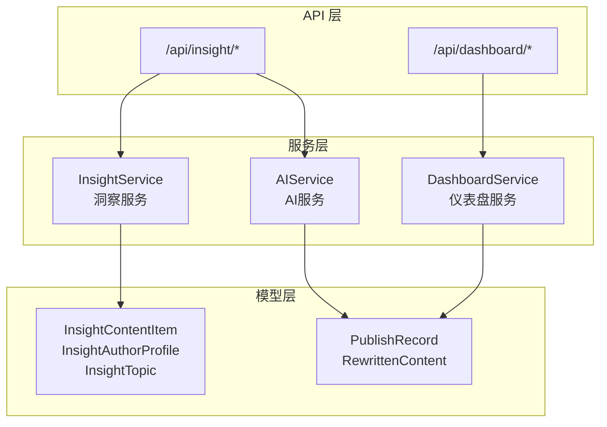
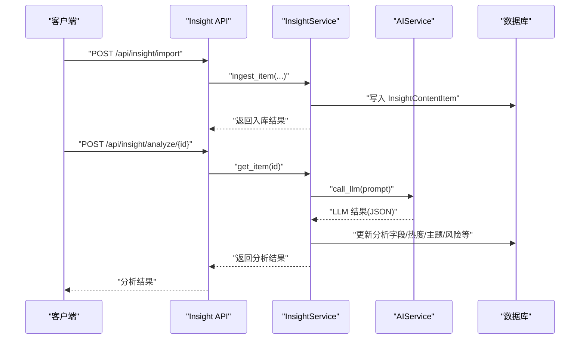
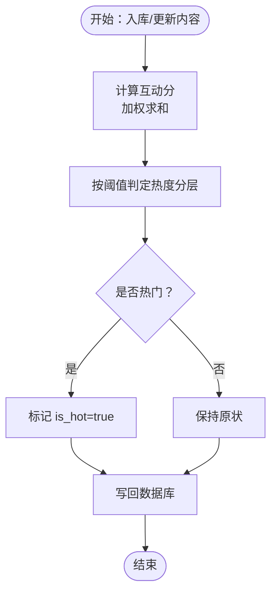
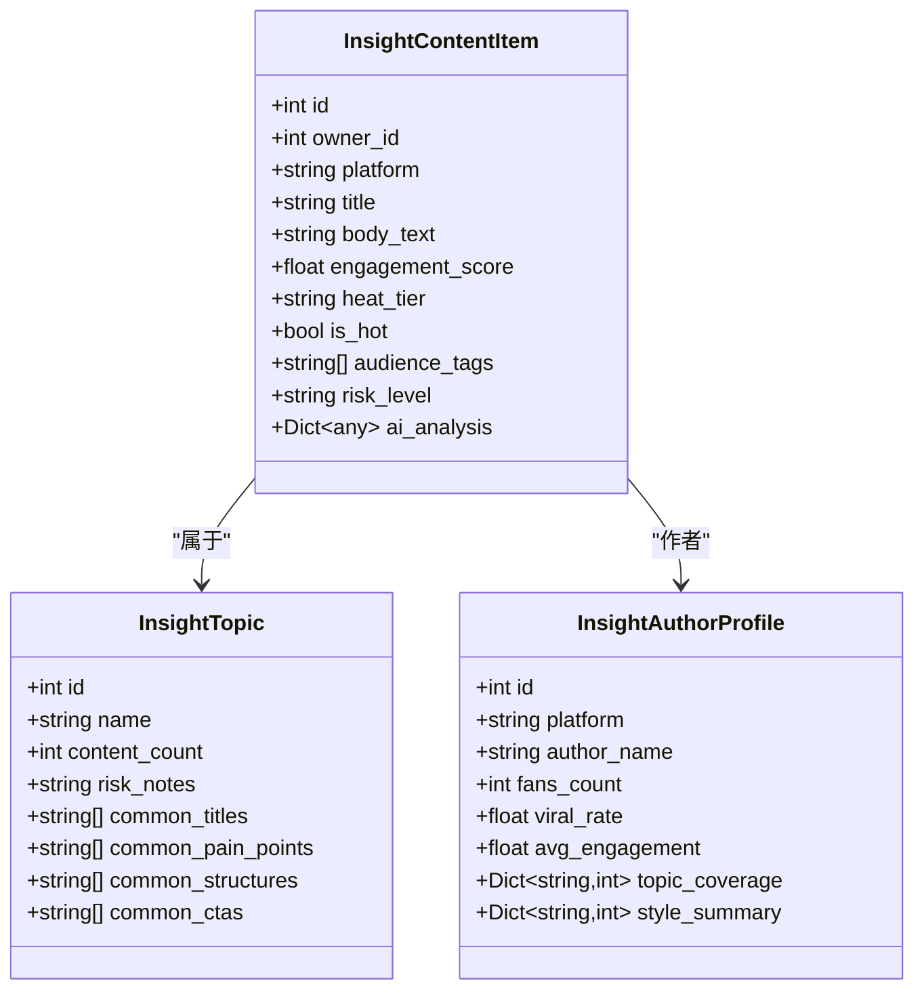
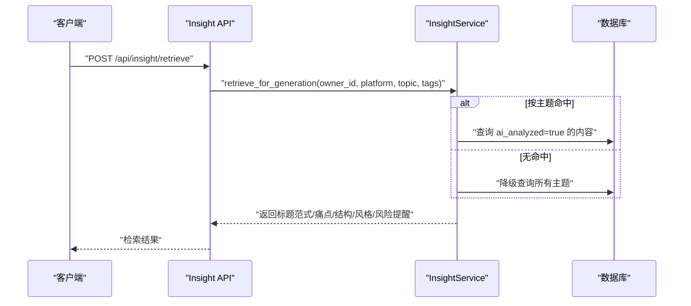
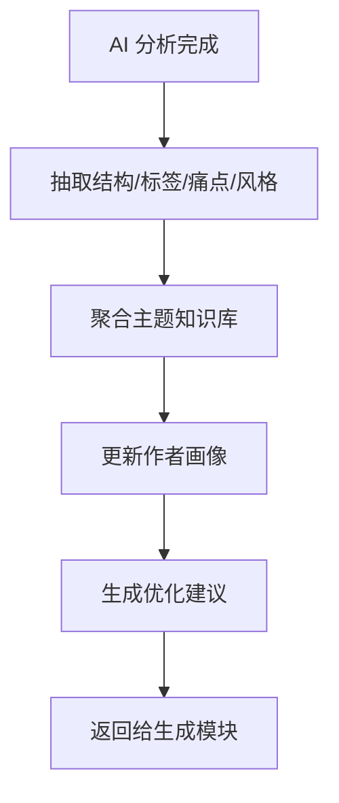
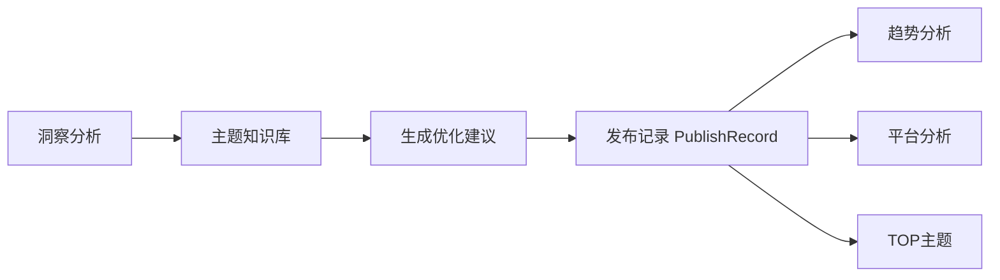
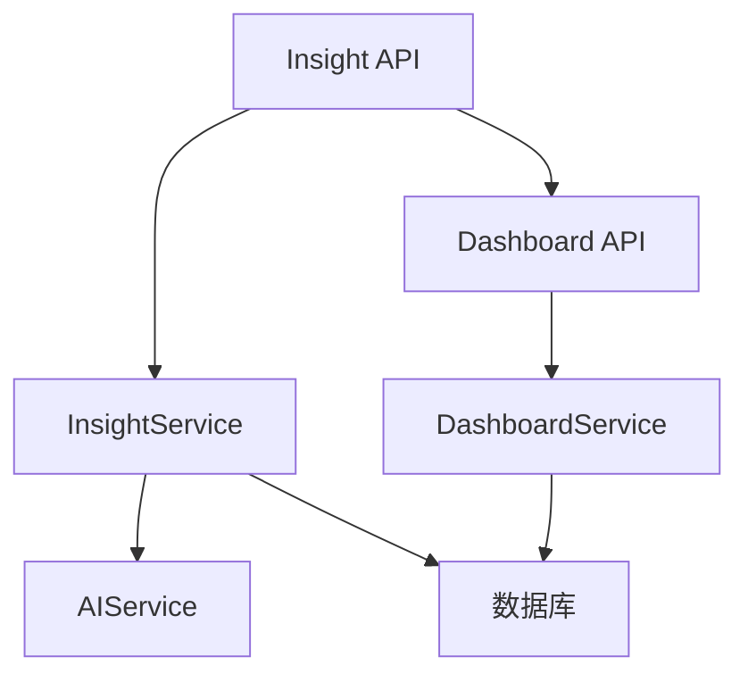

# 智能优化建议

<cite>
**本文引用的文件**
- [backend/app/services/insight_service.py](file://backend/app/services/insight_service.py)
- [backend/app/api/endpoints/insight.py](file://backend/app/api/endpoints/insight.py)
- [backend/app/models/models.py](file://backend/app/models/models.py)
- [backend/app/schemas/schemas.py](file://backend/app/schemas/schemas.py)
- [backend/app/services/ai_service.py](file://backend/app/services/ai_service.py)
- [backend/app/api/endpoints/dashboard.py](file://backend/app/api/endpoints/dashboard.py)
- [backend/app/services/dashboard_service.py](file://backend/app/services/dashboard_service.py)
</cite>

## 目录
1. [简介](#简介)
2. [项目结构](#项目结构)
3. [核心组件](#核心组件)
4. [架构总览](#架构总览)
5. [详细组件分析](#详细组件分析)
6. [依赖分析](#依赖分析)
7. [性能考量](#性能考量)
8. [故障排查指南](#故障排查指南)
9. [结论](#结论)
10. [附录](#附录)

## 简介
本技术文档围绕“智获客智能优化建议系统”的核心能力展开，重点阐释以下方面：
- 智能优化算法实现机制：内容质量评估、受众匹配分析、传播效果预测
- 优化建议生成流程：洞察数据挖掘、最佳实践推荐、个性化优化方案
- 多维度优化指标体系：点击率预测、互动率提升、转化效果改善
- A/B测试集成、效果验证与持续优化机制
- 优化建议的生成逻辑、调用接口与实施指导
- 优化效果追踪、ROI计算与建议有效性评估

系统以“爆款内容采集分析中心”为核心，通过采集、清洗、AI分析、主题/账号聚类与检索召回的五层闭环，形成可复用的知识库与优化建议，支撑文案改写与发布后的效果追踪。

## 项目结构
后端采用 FastAPI + SQLAlchemy 架构，按领域划分模块：
- API 层：定义 REST 接口，负责鉴权、限流与请求转发
- 服务层：封装业务逻辑，如洞察服务、AI服务、仪表盘服务
- 模型层：ORM 映射，定义内容、发布记录、用户等实体
- 端到端流程：采集 → 入库 → AI分析 → 知识库更新 → 检索召回 → 生成优化建议

图表来源
- [backend/app/api/endpoints/insight.py:1-410](file://backend/app/api/endpoints/insight.py#L1-L410)
- [backend/app/services/insight_service.py:1-659](file://backend/app/services/insight_service.py#L1-L659)
- [backend/app/services/ai_service.py:1-200](file://backend/app/services/ai_service.py#L1-L200)
- [backend/app/models/models.py:1-400](file://backend/app/models/models.py#L1-L400)
- [backend/app/api/endpoints/dashboard.py:1-100](file://backend/app/api/endpoints/dashboard.py#L1-L100)
- [backend/app/services/dashboard_service.py:1-200](file://backend/app/services/dashboard_service.py#L1-L200)

章节来源
- [backend/app/api/endpoints/insight.py:1-410](file://backend/app/api/endpoints/insight.py#L1-L410)
- [backend/app/services/insight_service.py:1-659](file://backend/app/services/insight_service.py#L1-L659)
- [backend/app/models/models.py:1-400](file://backend/app/models/models.py#L1-L400)

## 核心组件
- 洞察服务（InsightService）
  - 负责主题管理、账号档案、内容入库、AI分析、检索召回与统计
  - 提供互动分计算、热度分层、主题知识库聚合、作者画像刷新等功能
- AI服务（AIService）
  - 封装本地 Ollama 与火山引擎 Ark Responses 的调用，统一 LLM 接口
  - 记录调用日志，支持场景化调用与失败回退
- 模型与实体
  - InsightContentItem、InsightAuthorProfile、InsightTopic 等洞察相关实体
  - PublishRecord、RewrittenContent 等发布与改写相关实体
- 仪表盘服务（DashboardService）
  - 提供今日汇总、趋势、平台分析、TOP主题、高质量内容、AI调用统计等

章节来源
- [backend/app/services/insight_service.py:57-659](file://backend/app/services/insight_service.py#L57-L659)
- [backend/app/services/ai_service.py:15-200](file://backend/app/services/ai_service.py#L15-L200)
- [backend/app/models/models.py:133-290](file://backend/app/models/models.py#L133-L290)
- [backend/app/services/dashboard_service.py:7-200](file://backend/app/services/dashboard_service.py#L7-L200)

## 架构总览
系统通过 API 端点接收请求，经鉴权与限流后交由服务层处理；洞察服务负责内容与主题的结构化分析，并将分析结果写回数据库；AI服务统一调度 LLM；仪表盘服务基于发布记录进行效果统计与趋势分析。

图表来源
- [backend/app/api/endpoints/insight.py:106-231](file://backend/app/api/endpoints/insight.py#L106-L231)
- [backend/app/services/insight_service.py:183-496](file://backend/app/services/insight_service.py#L183-L496)
- [backend/app/services/ai_service.py:24-91](file://backend/app/services/ai_service.py#L24-L91)

## 详细组件分析

### 内容质量评估与热度分层
- 互动分计算：基于点赞、评论、收藏、分享、播放等指标加权求和，得到内容的互动分
- 热度分层：根据互动分阈值划分为病毒、热、暖、常态四个层级，并标记是否热门
- 入库时即时计算并落库，后续用于排序与筛选

图表来源
- [backend/app/services/insight_service.py:26-54](file://backend/app/services/insight_service.py#L26-L54)
- [backend/app/services/insight_service.py:262-269](file://backend/app/services/insight_service.py#L262-L269)

章节来源
- [backend/app/services/insight_service.py:26-54](file://backend/app/services/insight_service.py#L26-L54)
- [backend/app/services/insight_service.py:262-269](file://backend/app/services/insight_service.py#L262-L269)

### 受众匹配分析与主题知识库
- 受众标签：从 AI 分析结果抽取目标受众标签，支持模糊匹配检索
- 主题管理：创建/查询/获取主题，维护主题下的内容数量与风险提示
- 知识库聚合：按主题聚合标题范式、痛点、结构模板、CTA类型与风格分布
- 作者画像：统计账号的爆款率、平均互动分、主题覆盖与风格分布

图表来源
- [backend/app/models/models.py:133-147](file://backend/app/models/models.py#L133-L147)
- [backend/app/models/models.py:229-257](file://backend/app/models/models.py#L229-L257)
- [backend/app/models/models.py:133-290](file://backend/app/models/models.py#L133-L290)

章节来源
- [backend/app/services/insight_service.py:63-93](file://backend/app/services/insight_service.py#L63-L93)
- [backend/app/services/insight_service.py:137-178](file://backend/app/services/insight_service.py#L137-L178)
- [backend/app/services/insight_service.py:499-547](file://backend/app/services/insight_service.py#L499-L547)

### 传播效果预测与检索召回
- 检索召回：基于平台、主题、受众标签进行过滤，返回标题范式、结构模板、钩子类型、CTA类型、痛点示例与风格汇总
- 降级策略：当按主题检索无结果时，自动降级为跨主题检索
- 风险提醒：结合主题知识库中的风险提示，给出合规建议

图表来源
- [backend/app/api/endpoints/insight.py:379-397](file://backend/app/api/endpoints/insight.py#L379-L397)
- [backend/app/services/insight_service.py:553-638](file://backend/app/services/insight_service.py#L553-L638)

章节来源
- [backend/app/services/insight_service.py:553-638](file://backend/app/services/insight_service.py#L553-L638)
- [backend/app/api/endpoints/insight.py:379-397](file://backend/app/api/endpoints/insight.py#L379-L397)

### 优化建议生成流程
- 数据挖掘：从已分析内容中抽取高频标题范式、痛点、结构模板、CTA类型与风格分布
- 最佳实践推荐：结合主题知识库与作者画像，给出标题公式、钩子类型、情感强度、信息密度等建议
- 个性化优化方案：针对不同平台与受众标签，提供差异化的内容结构与风格建议

图表来源
- [backend/app/services/insight_service.py:422-496](file://backend/app/services/insight_service.py#L422-L496)
- [backend/app/services/insight_service.py:499-547](file://backend/app/services/insight_service.py#L499-L547)
- [backend/app/services/insight_service.py:137-178](file://backend/app/services/insight_service.py#L137-L178)

章节来源
- [backend/app/services/insight_service.py:382-496](file://backend/app/services/insight_service.py#L382-L496)
- [backend/app/services/insight_service.py:499-547](file://backend/app/services/insight_service.py#L499-L547)

### 多维度优化指标体系
- 内容质量：互动分、热度分层、风险等级与风险标志
- 受众匹配：受众标签、主要主题、风格分布
- 传播效果：标题范式、结构模板、钩子类型、CTA类型
- 合规性：风险等级、风险标志、主题风险提示

章节来源
- [backend/app/services/insight_service.py:26-54](file://backend/app/services/insight_service.py#L26-L54)
- [backend/app/services/insight_service.py:438-496](file://backend/app/services/insight_service.py#L438-L496)
- [backend/app/models/models.py:133-147](file://backend/app/models/models.py#L133-L147)

### A/B测试集成、效果验证与持续优化
- 发布记录追踪：发布后收集 views、likes、comments、favorites、shares、private_messages、wechat_adds、leads、valid_leads、conversions 等指标
- 仪表盘统计：提供趋势、平台分析、TOP主题、高质量内容与AI调用统计，辅助效果验证
- 持续优化：基于发布记录与洞察分析，迭代主题知识库与作者画像，形成闭环

图表来源
- [backend/app/models/models.py:259-289](file://backend/app/models/models.py#L259-L289)
- [backend/app/services/dashboard_service.py:38-149](file://backend/app/services/dashboard_service.py#L38-L149)
- [backend/app/api/endpoints/dashboard.py:35-99](file://backend/app/api/endpoints/dashboard.py#L35-L99)

章节来源
- [backend/app/models/models.py:259-289](file://backend/app/models/models.py#L259-L289)
- [backend/app/services/dashboard_service.py:38-149](file://backend/app/services/dashboard_service.py#L38-L149)
- [backend/app/api/endpoints/dashboard.py:35-99](file://backend/app/api/endpoints/dashboard.py#L35-L99)

### 优化建议的生成逻辑、调用接口与实施指导
- 入口接口
  - 导入：POST /api/insight/import、POST /api/insight/import/batch
  - 列表与详情：GET /api/insight/list、GET /api/insight/{id}
  - 删除：DELETE /api/insight/{id}
  - AI分析：POST /api/insight/analyze/{id}、POST /api/insight/analyze/batch
  - 检索召回：POST /api/insight/retrieve
  - 统计：GET /api/insight/stats
- 实施指导
  - 先导入内容，再触发 AI 分析，最后通过检索召回接口获取优化建议
  - 使用受众标签与主题进行精准召回，结合风险提示确保合规
  - 基于仪表盘趋势与平台分析，持续迭代优化策略

章节来源
- [backend/app/api/endpoints/insight.py:65-409](file://backend/app/api/endpoints/insight.py#L65-L409)

### 优化效果追踪、ROI计算与建议有效性评估
- 效果追踪：通过发布记录中的 views、leads、valid_leads、conversions 等指标进行追踪
- ROI计算：建议以“有效线索转化成本”或“有效线索价值”作为衡量，结合趋势与平台分析进行对比
- 建议有效性评估：对比同一主题/风格在不同时间段的转化表现，评估优化建议的有效性

章节来源
- [backend/app/models/models.py:259-289](file://backend/app/models/models.py#L259-L289)
- [backend/app/services/dashboard_service.py:85-149](file://backend/app/services/dashboard_service.py#L85-L149)

## 依赖分析
- API 层依赖服务层与鉴权/限流组件
- 服务层依赖模型层进行数据持久化
- AI 服务依赖外部 LLM（Ollama 或火山引擎 Ark）
- 仪表盘服务依赖发布记录与用户信息进行统计

图表来源
- [backend/app/api/endpoints/insight.py:1-410](file://backend/app/api/endpoints/insight.py#L1-L410)
- [backend/app/services/insight_service.py:1-659](file://backend/app/services/insight_service.py#L1-L659)
- [backend/app/services/ai_service.py:1-200](file://backend/app/services/ai_service.py#L1-L200)
- [backend/app/api/endpoints/dashboard.py:1-100](file://backend/app/api/endpoints/dashboard.py#L1-L100)
- [backend/app/services/dashboard_service.py:1-200](file://backend/app/services/dashboard_service.py#L1-L200)

章节来源
- [backend/app/api/endpoints/insight.py:1-410](file://backend/app/api/endpoints/insight.py#L1-L410)
- [backend/app/services/insight_service.py:1-659](file://backend/app/services/insight_service.py#L1-L659)
- [backend/app/services/ai_service.py:1-200](file://backend/app/services/ai_service.py#L1-L200)
- [backend/app/api/endpoints/dashboard.py:1-100](file://backend/app/api/endpoints/dashboard.py#L1-L100)
- [backend/app/services/dashboard_service.py:1-200](file://backend/app/services/dashboard_service.py#L1-L200)

## 性能考量
- 批量分析限流：对批量 AI 分析设置速率限制，避免瞬时峰值
- 异步处理：批量分析通过后台任务执行，降低请求阻塞
- 数据库查询优化：按平台、主题、热度、搜索条件进行过滤与排序，必要时增加索引
- 缓存与降级：检索召回支持降级策略，保证在部分主题缺失时仍可返回结果

章节来源
- [backend/app/api/endpoints/insight.py:52-58](file://backend/app/api/endpoints/insight.py#L52-L58)
- [backend/app/api/endpoints/insight.py:234-302](file://backend/app/api/endpoints/insight.py#L234-L302)
- [backend/app/services/insight_service.py:586-597](file://backend/app/services/insight_service.py#L586-L597)

## 故障排查指南
- AI 分析失败
  - 检查 LLM 服务可用性（本地 Ollama 或火山引擎 Ark）
  - 查看 AI 调用日志，确认请求参数与模型配置
- 限流与配额
  - 检查批量分析限流配置与 Redis 开关
- 数据一致性
  - 确认主题与作者画像更新逻辑是否正确执行
- 接口错误
  - 使用 GET /api/insight/stats 获取基础统计数据，定位异常范围

章节来源
- [backend/app/services/ai_service.py:132-200](file://backend/app/services/ai_service.py#L132-L200)
- [backend/app/api/endpoints/insight.py:52-58](file://backend/app/api/endpoints/insight.py#L52-L58)
- [backend/app/services/insight_service.py:137-178](file://backend/app/services/insight_service.py#L137-L178)
- [backend/app/api/endpoints/insight.py:404-409](file://backend/app/api/endpoints/insight.py#L404-L409)

## 结论
本系统通过“采集—清洗—AI分析—主题/账号聚类—检索召回”的五层闭环，构建了可复用的主题知识库与作者画像，实现了内容质量评估、受众匹配分析与传播效果预测。配合发布记录与仪表盘统计，形成从洞察到优化再到效果验证的完整链路，支撑持续优化与规模化产出。

## 附录
- 关键实体与字段
  - InsightContentItem：内容主体，包含互动分、热度分层、受众标签、AI分析结果等
  - InsightAuthorProfile：账号档案，包含爆款率、平均互动分、主题覆盖与风格分布
  - InsightTopic：主题实体，包含内容计数与知识库字段（标题范式、痛点、结构、CTA、风格）
  - PublishRecord：发布记录，包含 views、likes、comments、favorites、shares、private_messages、wechat_adds、leads、valid_leads、conversions 等指标
- 建议的扩展方向
  - 引入点击率/转化率预测模型，基于历史数据训练并在线推理
  - 增强 A/B 测试框架，自动化对比不同优化建议的效果差异
  - 完善合规校验与风险评分，提升建议的安全性与稳定性

章节来源
- [backend/app/models/models.py:133-290](file://backend/app/models/models.py#L133-L290)
- [backend/app/schemas/schemas.py:261-300](file://backend/app/schemas/schemas.py#L261-L300)