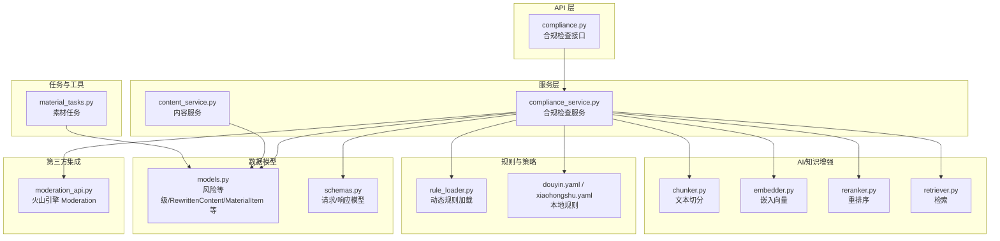
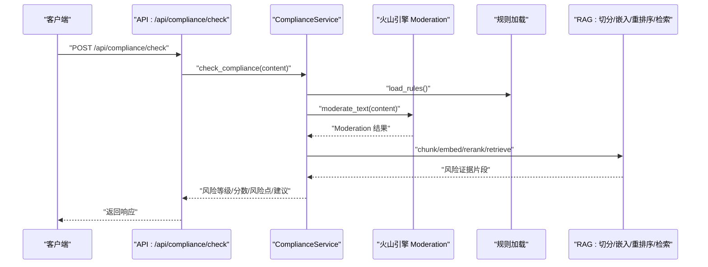
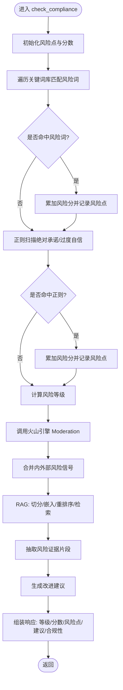
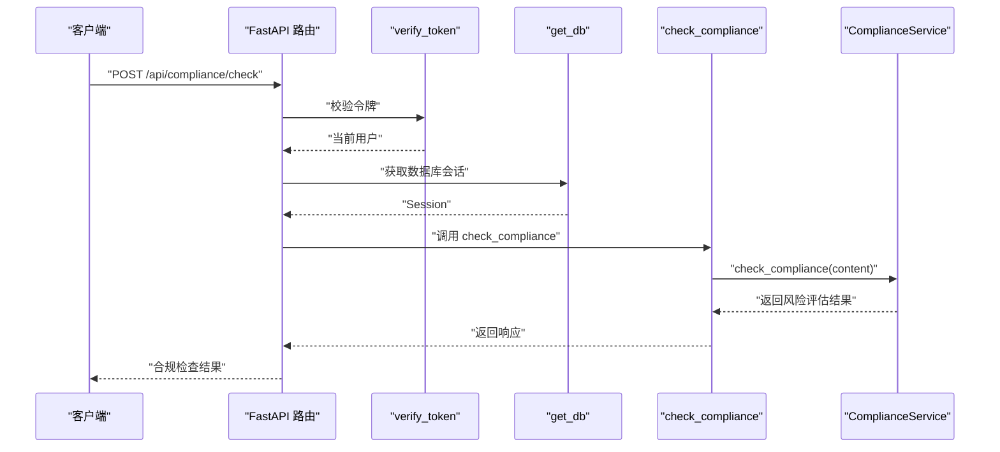
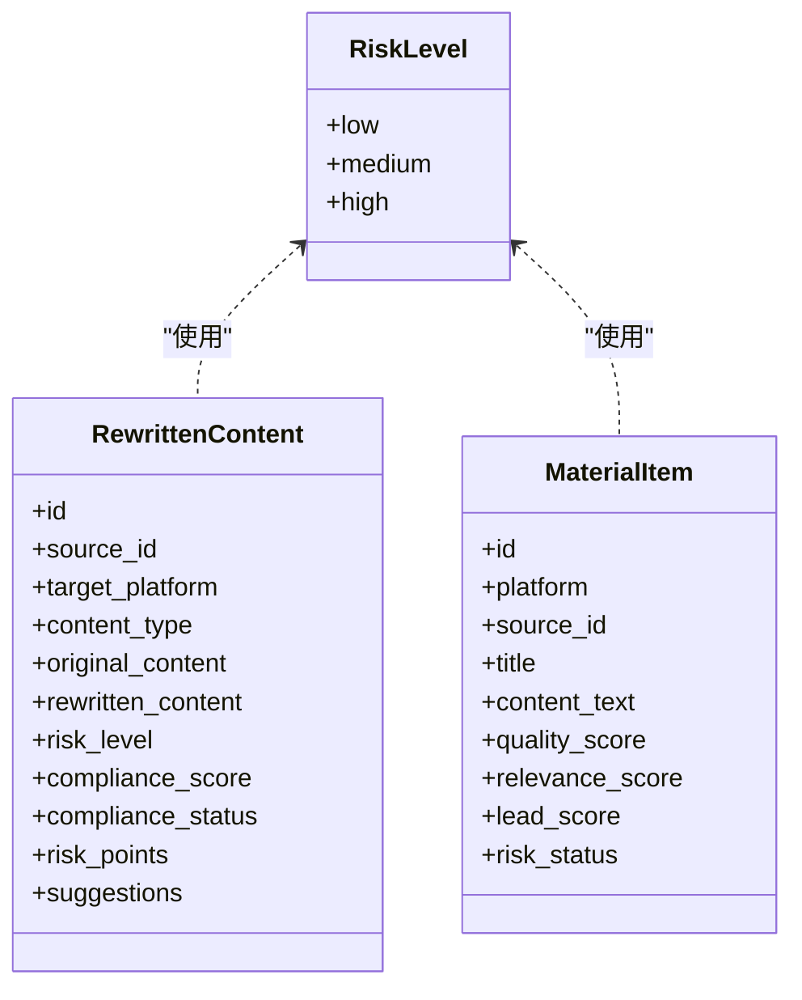
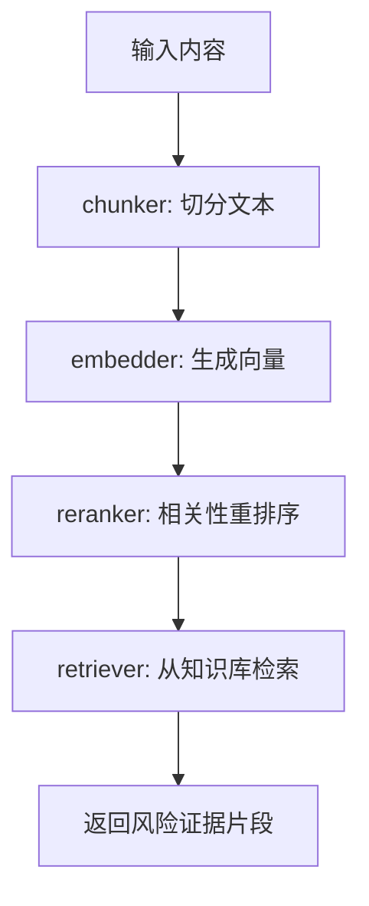
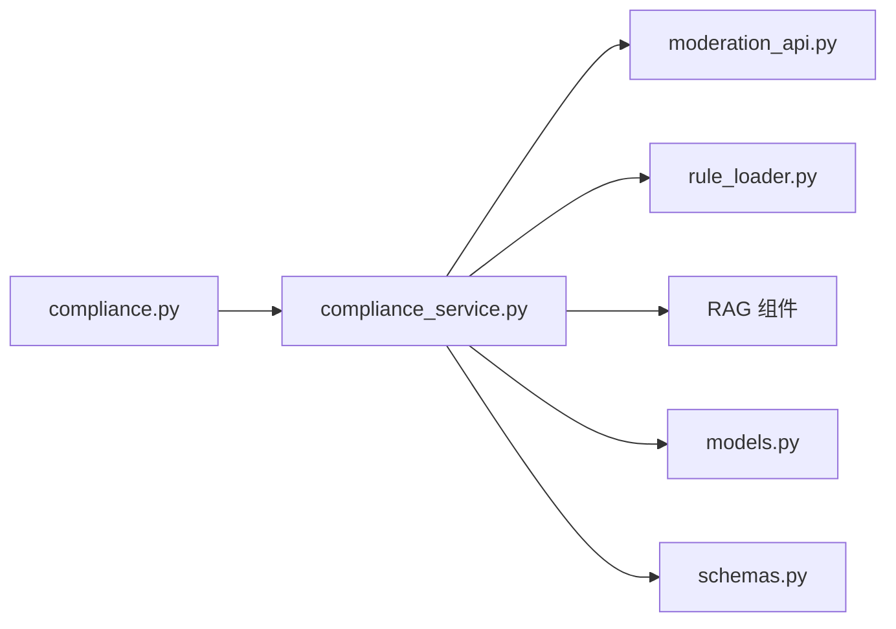
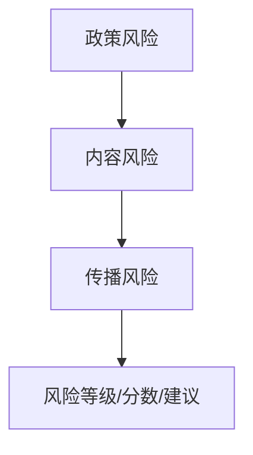

# 风险评估

<cite>
**本文引用的文件**
- [backend/app/services/compliance_service.py](file://backend/app/services/compliance_service.py)
- [backend/app/api/endpoints/compliance.py](file://backend/app/api/endpoints/compliance.py)
- [backend/app/schemas/schemas.py](file://backend/app/schemas/schemas.py)
- [backend/app/models/models.py](file://backend/app/models/models.py)
- [backend/app/ai/rag/chunker.py](file://backend/app/ai/rag/chunker.py)
- [backend/app/ai/rag/embedder.py](file://backend/app/ai/rag/embedder.py)
- [backend/app/ai/rag/reranker.py](file://backend/app/ai/rag/reranker.py)
- [backend/app/ai/rag/retriever.py](file://backend/app/ai/rag/retriever.py)
- [backend/app/integrations/volcengine/moderation_api.py](file://backend/app/integrations/volcengine/moderation_api.py)
- [backend/app/ai/agents/compliance_agent.py](file://backend/app/ai/agents/compliance_agent.py)
- [backend/app/rules/dynamic/rule_loader.py](file://backend/app/rules/dynamic/rule_loader.py)
- [backend/app/rules/local/douyin.yaml](file://backend/app/rules/local/douyin.yaml)
- [backend/app/rules/local/xiaohongshu.yaml](file://backend/app/rules/local/xiaohongshu.yaml)
- [backend/app/services/content_service.py](file://backend/app/services/content_service.py)
- [backend/app/tasks/material_tasks.py](file://backend/app/tasks/material_tasks.py)
</cite>

## 目录
1. [引言](#引言)
2. [项目结构](#项目结构)
3. [核心组件](#核心组件)
4. [架构总览](#架构总览)
5. [详细组件分析](#详细组件分析)
6. [依赖分析](#依赖分析)
7. [性能考虑](#性能考虑)
8. [故障排查指南](#故障排查指南)
9. [结论](#结论)
10. [附录](#附录)

## 引言
本技术文档面向“智获客”风险评估系统，聚焦于风险评估算法设计、RAG检索增强在风险评估中的应用、多层级风险评估体系（政策风险、内容风险、传播风险）、风险权重计算与动态阈值、风险趋势预测、输入参数与评估指标、输出报告格式，以及风险预警、异常检测与人工复核流程。文档基于仓库现有实现进行梳理与扩展说明，帮助研发与运营人员理解系统能力边界与优化方向。

## 项目结构
风险评估相关代码主要分布在以下模块：
- 服务层：合规检查服务与内容服务
- API 层：合规检查接口
- 数据模型：风险等级枚举、重写内容与物料表等
- RAG 组件：文本切分、向量化嵌入、重排序与检索
- 规则与策略：本地规则与动态规则加载
- 第三方集成：火山引擎内容安全 Moderation 接口
- 任务与工具有：素材处理任务调度

图表来源
- [backend/app/api/endpoints/compliance.py:1-20](file://backend/app/api/endpoints/compliance.py#L1-L20)
- [backend/app/services/compliance_service.py:1-113](file://backend/app/services/compliance_service.py#L1-L113)
- [backend/app/services/content_service.py:1-79](file://backend/app/services/content_service.py#L1-L79)
- [backend/app/ai/rag/chunker.py:1-3](file://backend/app/ai/rag/chunker.py#L1-L3)
- [backend/app/ai/rag/embedder.py:1-3](file://backend/app/ai/rag/embedder.py#L1-L3)
- [backend/app/ai/rag/reranker.py:1-3](file://backend/app/ai/rag/reranker.py#L1-L3)
- [backend/app/ai/rag/retriever.py:1-3](file://backend/app/ai/rag/retriever.py#L1-L3)
- [backend/app/integrations/volcengine/moderation_api.py:1-3](file://backend/app/integrations/volcengine/moderation_api.py#L1-L3)
- [backend/app/rules/dynamic/rule_loader.py:1-3](file://backend/app/rules/dynamic/rule_loader.py#L1-L3)
- [backend/app/rules/local/douyin.yaml:1-4](file://backend/app/rules/local/douyin.yaml#L1-L4)
- [backend/app/rules/local/xiaohongshu.yaml:1-4](file://backend/app/rules/local/xiaohongshu.yaml#L1-L4)
- [backend/app/models/models.py:150-182](file://backend/app/models/models.py#L150-L182)
- [backend/app/schemas/schemas.py:150-161](file://backend/app/schemas/schemas.py#L150-L161)
- [backend/app/tasks/material_tasks.py:1-3](file://backend/app/tasks/material_tasks.py#L1-L3)

章节来源
- [backend/app/api/endpoints/compliance.py:1-20](file://backend/app/api/endpoints/compliance.py#L1-L20)
- [backend/app/services/compliance_service.py:1-113](file://backend/app/services/compliance_service.py#L1-L113)
- [backend/app/schemas/schemas.py:150-161](file://backend/app/schemas/schemas.py#L150-L161)
- [backend/app/models/models.py:150-182](file://backend/app/models/models.py#L150-L182)

## 核心组件
- 合规检查服务：基于关键词与正则表达式识别风险点，生成风险等级与建议；可对接第三方 Moderation 接口；支持规则加载与动态调整。
- API 接口：提供合规检查的 HTTP 入口，接收内容文本与类型，返回风险等级、分数、风险点与建议。
- 数据模型与响应：定义风险等级枚举、重写内容与物料项等实体，支撑风险状态持久化与跨模块传递。
- RAG 组件：提供文本切分、嵌入向量、重排序与检索能力，用于从知识库中抽取风险证据。
- 规则与策略：本地 YAML 规则与动态规则加载，支持按平台/受众/账户类型细化风控策略。
- 第三方集成：火山引擎 Moderation 提供内容安全检测能力，作为外部风险信号源。
- 任务与工具：素材任务调度，支撑内容入库与风险标注流程。

章节来源
- [backend/app/services/compliance_service.py:1-113](file://backend/app/services/compliance_service.py#L1-L113)
- [backend/app/api/endpoints/compliance.py:1-20](file://backend/app/api/endpoints/compliance.py#L1-L20)
- [backend/app/schemas/schemas.py:150-161](file://backend/app/schemas/schemas.py#L150-L161)
- [backend/app/models/models.py:150-182](file://backend/app/models/models.py#L150-L182)
- [backend/app/ai/rag/chunker.py:1-3](file://backend/app/ai/rag/chunker.py#L1-L3)
- [backend/app/ai/rag/embedder.py:1-3](file://backend/app/ai/rag/embedder.py#L1-L3)
- [backend/app/ai/rag/reranker.py:1-3](file://backend/app/ai/rag/reranker.py#L1-L3)
- [backend/app/ai/rag/retriever.py:1-3](file://backend/app/ai/rag/retriever.py#L1-L3)
- [backend/app/integrations/volcengine/moderation_api.py:1-3](file://backend/app/integrations/volcengine/moderation_api.py#L1-L3)
- [backend/app/rules/dynamic/rule_loader.py:1-3](file://backend/app/rules/dynamic/rule_loader.py#L1-L3)
- [backend/app/rules/local/douyin.yaml:1-4](file://backend/app/rules/local/douyin.yaml#L1-L4)
- [backend/app/rules/local/xiaohongshu.yaml:1-4](file://backend/app/rules/local/xiaohongshu.yaml#L1-L4)
- [backend/app/tasks/material_tasks.py:1-3](file://backend/app/tasks/material_tasks.py#L1-L3)

## 架构总览
下图展示风险评估在系统中的整体交互路径：客户端调用合规检查接口，服务层执行关键词/正则匹配与第三方 Moderation 检测，并结合规则与 RAG 知识抽取证据，最终返回风险等级与建议。

图表来源
- [backend/app/api/endpoints/compliance.py:11-19](file://backend/app/api/endpoints/compliance.py#L11-L19)
- [backend/app/services/compliance_service.py:24-71](file://backend/app/services/compliance_service.py#L24-L71)
- [backend/app/integrations/volcengine/moderation_api.py:1-3](file://backend/app/integrations/volcengine/moderation_api.py#L1-L3)
- [backend/app/rules/dynamic/rule_loader.py:1-3](file://backend/app/rules/dynamic/rule_loader.py#L1-L3)
- [backend/app/ai/rag/chunker.py:1-3](file://backend/app/ai/rag/chunker.py#L1-L3)
- [backend/app/ai/rag/embedder.py:1-3](file://backend/app/ai/rag/embedder.py#L1-L3)
- [backend/app/ai/rag/reranker.py:1-3](file://backend/app/ai/rag/reranker.py#L1-L3)
- [backend/app/ai/rag/retriever.py:1-3](file://backend/app/ai/rag/retriever.py#L1-L3)

## 详细组件分析

### 合规检查服务（ComplianceService）
- 设计要点
  - 关键词与敏感词库：内置风险关键词集合，匹配即累加风险分值并记录风险点。
  - 正则模式：识别绝对承诺、过度自信等语言特征，按风险类型累加分值。
  - 风险等级：根据总分映射至低/中/高风险等级。
  - 建议生成：基于风险类型汇总改进建议，如使用条件语句、去除敏感术语等。
  - 文本修正：针对特定风险词提供替换建议。
  - 外部检测：调用火山引擎 Moderation 获取第三方风险判断。
  - 规则集成：通过规则加载函数接入动态规则，支持按平台/受众细化策略。
  - RAG 集成：预留文本切分、嵌入、重排序与检索接口，用于抽取知识库中的风险证据。
- 输入参数
  - content: 待检测内容字符串
  - content_type: 内容类型（默认 post）
- 输出指标
  - risk_level: 风险等级（low/medium/high）
  - risk_score: 风险分数（0-100）
  - risk_points: 风险点列表（含类型、原文片段、原因、建议）
  - suggestions: 改进建议列表
  - is_compliant: 是否合规（低风险时为真）
- 复杂度与性能
  - 关键词匹配与正则扫描为线性复杂度，受内容长度与规则数量影响。
  - 建议生成为集合去重，整体线性。
  - 外部 Moderation 调用引入网络延迟，建议异步或缓存结果。
- 错误处理
  - 对空内容返回默认嵌入向量与空检索结果，避免异常传播。
  - API 层对未授权与数据库会话进行统一处理。

图表来源
- [backend/app/services/compliance_service.py:24-94](file://backend/app/services/compliance_service.py#L24-L94)
- [backend/app/integrations/volcengine/moderation_api.py:1-3](file://backend/app/integrations/volcengine/moderation_api.py#L1-L3)
- [backend/app/ai/rag/chunker.py:1-3](file://backend/app/ai/rag/chunker.py#L1-L3)
- [backend/app/ai/rag/embedder.py:1-3](file://backend/app/ai/rag/embedder.py#L1-L3)
- [backend/app/ai/rag/reranker.py:1-3](file://backend/app/ai/rag/reranker.py#L1-L3)
- [backend/app/ai/rag/retriever.py:1-3](file://backend/app/ai/rag/retriever.py#L1-L3)

章节来源
- [backend/app/services/compliance_service.py:1-113](file://backend/app/services/compliance_service.py#L1-L113)
- [backend/app/api/endpoints/compliance.py:11-19](file://backend/app/api/endpoints/compliance.py#L11-L19)
- [backend/app/schemas/schemas.py:150-161](file://backend/app/schemas/schemas.py#L150-L161)

### API 接口（合规检查）
- 路由与鉴权
  - 路由前缀：/api/compliance
  - 端点：/check
  - 鉴权：依赖令牌校验与数据库会话注入
- 请求与响应
  - 请求体：ComplianceCheckRequest（content, content_type）
  - 响应体：ComplianceCheckResponse（risk_level, risk_score, risk_points, suggestions, is_compliant）

图表来源
- [backend/app/api/endpoints/compliance.py:1-20](file://backend/app/api/endpoints/compliance.py#L1-L20)
- [backend/app/services/compliance_service.py:24-71](file://backend/app/services/compliance_service.py#L24-L71)

章节来源
- [backend/app/api/endpoints/compliance.py:1-20](file://backend/app/api/endpoints/compliance.py#L1-L20)

### 数据模型与响应
- 风险等级枚举：low/medium/high
- 重写内容模型：包含原始内容、重写内容、风险等级、合规分数、合规状态、风险点与建议
- 物料项模型：包含平台、来源、标题、内容、质量/相关性/线索评分、风险状态等
- 响应模型：ComplianceCheckResponse（与服务层输出一致）

图表来源
- [backend/app/models/models.py:150-182](file://backend/app/models/models.py#L150-L182)
- [backend/app/models/models.py:584-640](file://backend/app/models/models.py#L584-L640)
- [backend/app/schemas/schemas.py:150-161](file://backend/app/schemas/schemas.py#L150-L161)

章节来源
- [backend/app/models/models.py:150-182](file://backend/app/models/models.py#L150-L182)
- [backend/app/models/models.py:584-640](file://backend/app/models/models.py#L584-L640)
- [backend/app/schemas/schemas.py:150-161](file://backend/app/schemas/schemas.py#L150-L161)

### RAG 检索增强（风险证据抽取）
- 组件职责
  - 文本切分：将长文本拆分为片段
  - 嵌入向量：为片段生成向量表示
  - 重排序：基于相关性对候选片段排序
  - 检索：从知识库中检索与内容最相关的片段
- 应用场景
  - 在合规检查中，抽取知识库中的政策/规则证据，辅助判定风险点
  - 为风险报告提供可追溯的证据链
- 当前实现
  - 组件目前返回占位结果（空列表/默认向量），需结合知识库与向量存储完善

图表来源
- [backend/app/ai/rag/chunker.py:1-3](file://backend/app/ai/rag/chunker.py#L1-L3)
- [backend/app/ai/rag/embedder.py:1-3](file://backend/app/ai/rag/embedder.py#L1-L3)
- [backend/app/ai/rag/reranker.py:1-3](file://backend/app/ai/rag/reranker.py#L1-L3)
- [backend/app/ai/rag/retriever.py:1-3](file://backend/app/ai/rag/retriever.py#L1-L3)

章节来源
- [backend/app/ai/rag/chunker.py:1-3](file://backend/app/ai/rag/chunker.py#L1-L3)
- [backend/app/ai/rag/embedder.py:1-3](file://backend/app/ai/rag/embedder.py#L1-L3)
- [backend/app/ai/rag/reranker.py:1-3](file://backend/app/ai/rag/reranker.py#L1-L3)
- [backend/app/ai/rag/retriever.py:1-3](file://backend/app/ai/rag/retriever.py#L1-L3)

### 规则与策略
- 动态规则加载：通过规则加载函数返回规则字典，便于在服务层动态应用
- 本地规则：按平台（如抖音、小红书）维护规则集，支持版本化管理
- 应用方式：在合规检查中调用规则加载函数，结合关键词/正则与第三方 Moderation 结果综合判定

章节来源
- [backend/app/rules/dynamic/rule_loader.py:1-3](file://backend/app/rules/dynamic/rule_loader.py#L1-L3)
- [backend/app/rules/local/douyin.yaml:1-4](file://backend/app/rules/local/douyin.yaml#L1-L4)
- [backend/app/rules/local/xiaohongshu.yaml:1-4](file://backend/app/rules/local/xiaohongshu.yaml#L1-L4)
- [backend/app/services/compliance_service.py:24-71](file://backend/app/services/compliance_service.py#L24-L71)

### 第三方集成（火山引擎 Moderation）
- 能力概述：提供文本内容安全检测，返回风险等级
- 集成方式：在合规检查服务中调用 Moderation 接口，合并内外部风险信号
- 注意事项：网络调用存在延迟，建议缓存与异步处理

章节来源
- [backend/app/integrations/volcengine/moderation_api.py:1-3](file://backend/app/integrations/volcengine/moderation_api.py#L1-L3)
- [backend/app/services/compliance_service.py:24-71](file://backend/app/services/compliance_service.py#L24-L71)

### 任务与工具
- 素材任务：提供素材处理任务的入口函数，支撑内容入库与风险标注流程
- 与其他模块的关系：与内容服务、合规服务、知识库构建等协同工作

章节来源
- [backend/app/tasks/material_tasks.py:1-3](file://backend/app/tasks/material_tasks.py#L1-L3)
- [backend/app/services/content_service.py:1-79](file://backend/app/services/content_service.py#L1-L79)

## 依赖分析
- 组件耦合
  - API 层仅依赖服务层与安全/数据库依赖，保持薄路由职责
  - 服务层依赖模型、响应模型、第三方接口与规则加载
  - RAG 组件独立，可按需启用
- 外部依赖
  - 火山引擎 Moderation：内容安全检测
  - 规则系统：本地 YAML 与动态加载
- 潜在循环依赖
  - 当前模块间无明显循环依赖

图表来源
- [backend/app/api/endpoints/compliance.py:1-20](file://backend/app/api/endpoints/compliance.py#L1-L20)
- [backend/app/services/compliance_service.py:1-113](file://backend/app/services/compliance_service.py#L1-L113)
- [backend/app/integrations/volcengine/moderation_api.py:1-3](file://backend/app/integrations/volcengine/moderation_api.py#L1-L3)
- [backend/app/rules/dynamic/rule_loader.py:1-3](file://backend/app/rules/dynamic/rule_loader.py#L1-L3)
- [backend/app/ai/rag/chunker.py:1-3](file://backend/app/ai/rag/chunker.py#L1-L3)
- [backend/app/ai/rag/embedder.py:1-3](file://backend/app/ai/rag/embedder.py#L1-L3)
- [backend/app/ai/rag/reranker.py:1-3](file://backend/app/ai/rag/reranker.py#L1-L3)
- [backend/app/ai/rag/retriever.py:1-3](file://backend/app/ai/rag/retriever.py#L1-L3)
- [backend/app/models/models.py:150-182](file://backend/app/models/models.py#L150-L182)
- [backend/app/schemas/schemas.py:150-161](file://backend/app/schemas/schemas.py#L150-L161)

## 性能考虑
- 关键词与正则匹配：线性扫描，建议对规则集进行预编译与索引优化
- 向量化与重排序：批量处理与向量化计算可利用 GPU 或向量化库加速
- 第三方调用：采用连接池、超时控制与重试策略，必要时引入缓存
- 数据库访问：合理使用分页与索引，避免大事务阻塞
- RAG：向量检索可引入近似最近邻（ANN）算法与向量数据库，降低延迟

## 故障排查指南
- API 层常见问题
  - 未授权访问：确认令牌有效性与权限校验逻辑
  - 数据库会话异常：检查 get_db 依赖与连接池配置
- 服务层常见问题
  - 关键词未命中：核对关键词库与正则表达式是否覆盖目标场景
  - 第三方接口失败：检查网络连通性、配额与签名参数
  - RAG 返回空结果：确认知识库构建与向量索引是否正常
- 建议
  - 增加日志埋点与指标监控（请求耗时、命中率、错误码）
  - 对高频调用结果进行缓存，减少重复计算与外部调用

章节来源
- [backend/app/api/endpoints/compliance.py:1-20](file://backend/app/api/endpoints/compliance.py#L1-L20)
- [backend/app/services/compliance_service.py:1-113](file://backend/app/services/compliance_service.py#L1-L113)
- [backend/app/integrations/volcengine/moderation_api.py:1-3](file://backend/app/integrations/volcengine/moderation_api.py#L1-L3)
- [backend/app/ai/rag/chunker.py:1-3](file://backend/app/ai/rag/chunker.py#L1-L3)
- [backend/app/ai/rag/embedder.py:1-3](file://backend/app/ai/rag/embedder.py#L1-L3)
- [backend/app/ai/rag/reranker.py:1-3](file://backend/app/ai/rag/reranker.py#L1-L3)
- [backend/app/ai/rag/retriever.py:1-3](file://backend/app/ai/rag/retriever.py#L1-L3)

## 结论
本系统已具备基础的合规检查能力与可扩展的 RAG 风险证据抽取框架。通过关键词/正则、第三方 Moderation 与规则系统，能够对内容进行多维度风险评估。建议后续完善 RAG 知识库与向量检索、引入动态阈值与趋势预测、强化异常检测与人工复核流程，以形成闭环的风险治理体系。

## 附录

### 风险评估输入参数
- content: 待检测内容字符串
- content_type: 内容类型（默认 post）

章节来源
- [backend/app/schemas/schemas.py:150-153](file://backend/app/schemas/schemas.py#L150-L153)
- [backend/app/api/endpoints/compliance.py:12-14](file://backend/app/api/endpoints/compliance.py#L12-L14)

### 风险评估指标与输出
- 指标
  - risk_level: 风险等级（low/medium/high）
  - risk_score: 风险分数（0-100）
  - risk_points: 风险点列表（类型、原文片段、原因、建议）
  - suggestions: 改进建议列表
  - is_compliant: 是否合规
- 输出格式
  - ComplianceCheckResponse（与服务层输出一致）

章节来源
- [backend/app/schemas/schemas.py:155-161](file://backend/app/schemas/schemas.py#L155-L161)
- [backend/app/services/compliance_service.py:65-71](file://backend/app/services/compliance_service.py#L65-L71)

### 多层级风险评估体系（概念示意）
- 政策风险：基于规则与平台规范，识别违规表述与承诺
- 内容风险：基于关键词/正则与第三方 Moderation，识别敏感/误导信息
- 传播风险：基于内容热度与互动指标（待实现），结合物料项评分

（本图为概念示意，不直接对应具体源码文件）

### 风险权重计算与动态阈值（建议）
- 权重来源：关键词权重、正则权重、第三方 Moderation 权重、规则权重
- 动态阈值：基于历史分布与业务目标自适应调整
- 实现建议：引入统计模型与在线学习，持续优化阈值与权重

（本节为通用建议，不直接对应具体源码文件）

### 风险趋势预测（建议）
- 基于时间序列与内容特征，预测未来风险变化
- 结合外部环境与平台规则变化，提前预警

（本节为通用建议，不直接对应具体源码文件）

### 风险预警机制、异常检测与人工复核流程（建议）
- 预警：达到高风险阈值或异常波动触发
- 异常检测：基于统计与机器学习方法识别异常样本
- 人工复核：高风险样本进入人工复核队列，支持退回/修改/放行

（本节为通用建议，不直接对应具体源码文件）