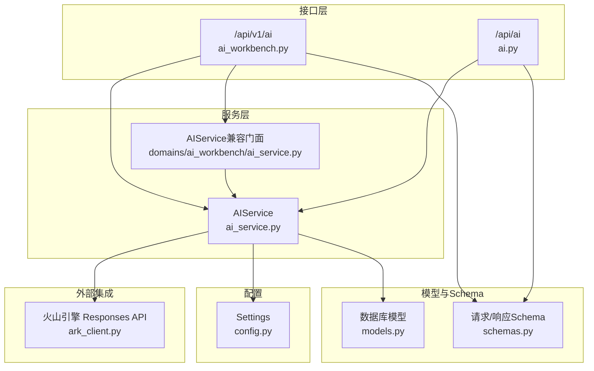
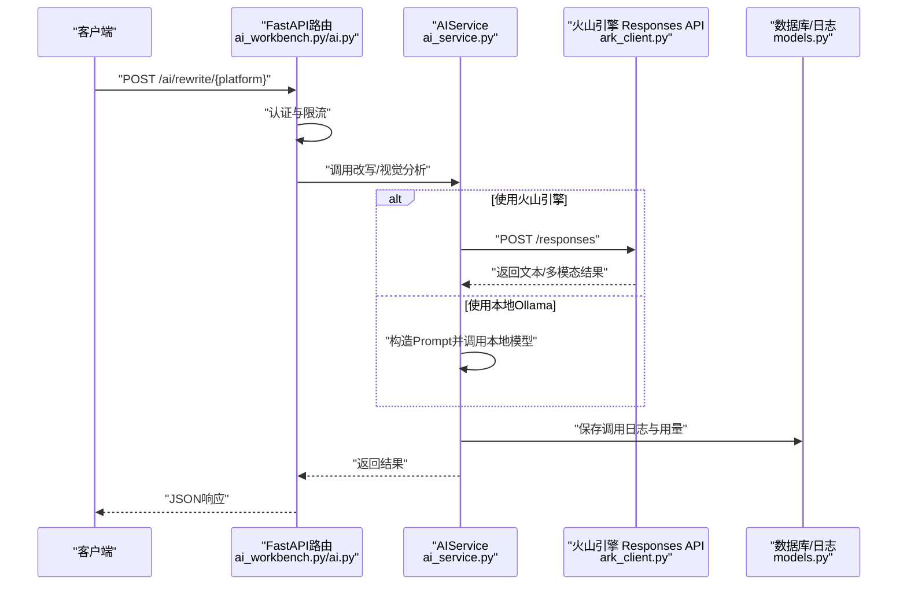
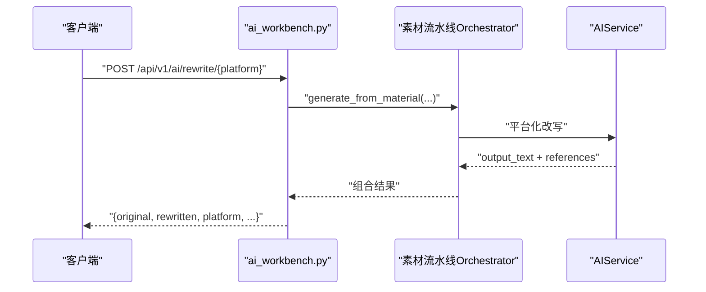
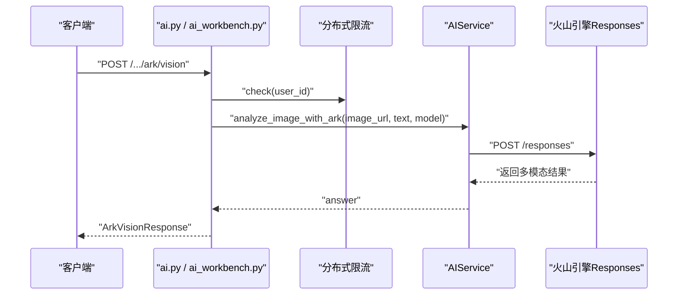
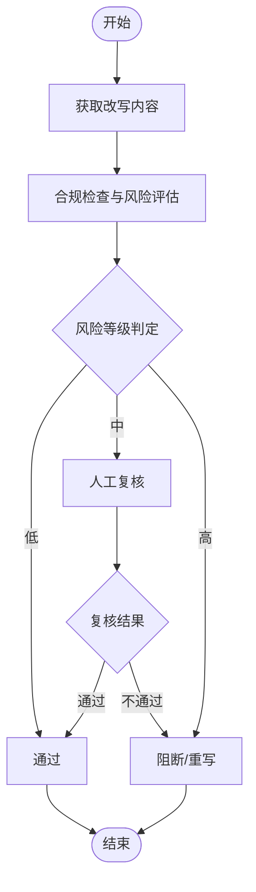
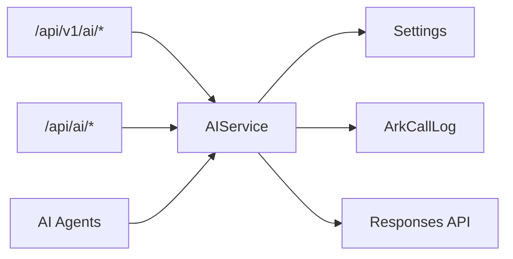

# AI处理接口

<cite>
**本文引用的文件**
- [backend/app/api/endpoints/ai.py](file://backend/app/api/endpoints/ai.py)
- [backend/app/api/v1/endpoints/ai_workbench.py](file://backend/app/api/v1/endpoints/ai_workbench.py)
- [backend/app/services/ai_service.py](file://backend/app/services/ai_service.py)
- [backend/app/schemas/schemas.py](file://backend/app/schemas/schemas.py)
- [backend/app/core/config.py](file://backend/app/core/config.py)
- [backend/app/models/models.py](file://backend/app/models/models.py)
- [backend/app/ai/agents/compliance_agent.py](file://backend/app/ai/agents/compliance_agent.py)
- [backend/app/ai/agents/rewrite_agent.py](file://backend/app/ai/agents/rewrite_agent.py)
- [backend/app/ai/agents/followup_agent.py](file://backend/app/ai/agents/followup_agent.py)
- [backend/app/ai/agents/lead_triage_agent.py](file://backend/app/ai/agents/lead_triage_agent.py)
- [backend/app/ai/agents/material_agent.py](file://backend/app/ai/agents/material_agent.py)
- [backend/app/domains/ai_workbench/ai_service.py](file://backend/app/domains/ai_workbench/ai_service.py)
- [backend/app/integrations/volcengine/ark_client.py](file://backend/app/integrations/volcengine/ark_client.py)
</cite>

## 目录
1. [简介](#简介)
2. [项目结构](#项目结构)
3. [核心组件](#核心组件)
4. [架构总览](#架构总览)
5. [详细组件分析](#详细组件分析)
6. [依赖分析](#依赖分析)
7. [性能考虑](#性能考虑)
8. [故障排查指南](#故障排查指南)
9. [结论](#结论)
10. [附录](#附录)

## 简介
本文件为“智获客”系统的AI处理接口技术文档，覆盖文案改写、图像多模态分析、合规检查与风险评估、智能优化与洞察应用等能力。重点说明不同AI代理（rewrite_agent、compliance_agent等）的调用方式与参数配置，以及AI模型选择、参数调优、输出格式控制的接口规范。同时提供批量处理、异步任务与进度查询的API规范思路，并解释AI服务质量评估、版本控制与性能优化策略。

## 项目结构
围绕AI处理相关的关键模块如下：
- 接口层：v1工作台路由与旧版AI路由
- 服务层：统一的AIService封装LLM调用与火山引擎集成
- 模型与Schema：请求/响应数据结构定义
- 配置层：模型地址、密钥、限流与超时等参数
- AI代理：合规、改写、跟进、线索分流、素材等代理占位实现
- 工作台兼容：v1工作台复用服务层实现

图表来源
- [backend/app/api/v1/endpoints/ai_workbench.py:1-118](file://backend/app/api/v1/endpoints/ai_workbench.py#L1-L118)
- [backend/app/api/endpoints/ai.py:1-103](file://backend/app/api/endpoints/ai.py#L1-L103)
- [backend/app/services/ai_service.py:1-460](file://backend/app/services/ai_service.py#L1-L460)
- [backend/app/domains/ai_workbench/ai_service.py:1-6](file://backend/app/domains/ai_workbench/ai_service.py#L1-L6)
- [backend/app/schemas/schemas.py:110-161](file://backend/app/schemas/schemas.py#L110-L161)
- [backend/app/models/models.py:156-182](file://backend/app/models/models.py#L156-L182)
- [backend/app/core/config.py:71-90](file://backend/app/core/config.py#L71-L90)
- [backend/app/integrations/volcengine/ark_client.py:1-4](file://backend/app/integrations/volcengine/ark_client.py#L1-L4)

章节来源
- [backend/app/api/v1/endpoints/ai_workbench.py:1-118](file://backend/app/api/v1/endpoints/ai_workbench.py#L1-L118)
- [backend/app/api/endpoints/ai.py:1-103](file://backend/app/api/endpoints/ai.py#L1-L103)
- [backend/app/services/ai_service.py:1-460](file://backend/app/services/ai_service.py#L1-L460)
- [backend/app/schemas/schemas.py:110-161](file://backend/app/schemas/schemas.py#L110-L161)
- [backend/app/models/models.py:156-182](file://backend/app/models/models.py#L156-L182)
- [backend/app/core/config.py:71-90](file://backend/app/core/config.py#L71-L90)
- [backend/app/domains/ai_workbench/ai_service.py:1-6](file://backend/app/domains/ai_workbench/ai_service.py#L1-L6)
- [backend/app/integrations/volcengine/ark_client.py:1-4](file://backend/app/integrations/volcengine/ark_client.py#L1-L4)

## 核心组件
- AIService：统一LLM调用入口，支持本地Ollama与火山引擎Cloud两种模式；封装Ark多模态视觉分析、调用日志持久化与用量统计。
- v1工作台路由：提供平台化改写入口（小红书/抖音/知乎），基于素材流水线生成改写内容。
- 旧版AI路由：保留历史接口，现已标记为废弃或迁移提示。
- Schema：定义AIRewriteRequest/AIRewriteResponse、ArkVisionRequest/ArkVisionResponse、合规检查等请求/响应结构。
- 配置：集中管理模型地址、API Key、限流与超时等参数。
- AI代理：compliance_agent、rewrite_agent、followup_agent、lead_triage_agent、material_agent等占位实现，便于后续扩展。

章节来源
- [backend/app/services/ai_service.py:15-460](file://backend/app/services/ai_service.py#L15-L460)
- [backend/app/api/v1/endpoints/ai_workbench.py:28-51](file://backend/app/api/v1/endpoints/ai_workbench.py#L28-L51)
- [backend/app/api/endpoints/ai.py:36-102](file://backend/app/api/endpoints/ai.py#L36-L102)
- [backend/app/schemas/schemas.py:110-161](file://backend/app/schemas/schemas.py#L110-L161)
- [backend/app/core/config.py:71-90](file://backend/app/core/config.py#L71-L90)
- [backend/app/ai/agents/compliance_agent.py:1-3](file://backend/app/ai/agents/compliance_agent.py#L1-L3)
- [backend/app/ai/agents/rewrite_agent.py:1-3](file://backend/app/ai/agents/rewrite_agent.py#L1-L3)
- [backend/app/ai/agents/followup_agent.py:1-3](file://backend/app/ai/agents/followup_agent.py#L1-L3)
- [backend/app/ai/agents/lead_triage_agent.py:1-3](file://backend/app/ai/agents/lead_triage_agent.py#L1-L3)
- [backend/app/ai/agents/material_agent.py:1-3](file://backend/app/ai/agents/material_agent.py#L1-L3)

## 架构总览
AI处理整体流程包括：接口路由接收请求 → 认证与限流 → 服务层调用LLM/Ark → 返回结果并记录用量与延迟。图像多模态分析通过Ark Vision接口完成，文本改写由平台化流水线生成。

图表来源
- [backend/app/api/v1/endpoints/ai_workbench.py:54-78](file://backend/app/api/v1/endpoints/ai_workbench.py#L54-L78)
- [backend/app/api/endpoints/ai.py:87-102](file://backend/app/api/endpoints/ai.py#L87-L102)
- [backend/app/services/ai_service.py:24-130](file://backend/app/services/ai_service.py#L24-L130)
- [backend/app/integrations/volcengine/ark_client.py:1-4](file://backend/app/integrations/volcengine/ark_client.py#L1-L4)
- [backend/app/models/models.py:156-182](file://backend/app/models/models.py#L156-L182)

## 详细组件分析

### 文案改写接口规范
- 路由
  - v1工作台：POST /api/v1/ai/rewrite/{platform}（支持 xiaohongshu、douyin、zhihu）
  - 旧版AI路由：POST /api/ai/rewrite/{platform}（已废弃，返回410并提示迁移路径）
- 请求体
  - AIRewriteRequest：包含 content_id、target_platform、content_type、style、marketing_strength、target_audience、topic_name、audience_tags 等字段
- 处理流程
  - v1工作台通过素材流水线生成改写内容，返回原始内容、改写后内容、平台、是否使用洞察、洞察引用数量与引用列表、生成任务ID
- 输出
  - 返回字典结构，包含 original、rewritten、platform、insight_used、insight_reference_count、references、generation_task_id

图表来源
- [backend/app/api/v1/endpoints/ai_workbench.py:28-51](file://backend/app/api/v1/endpoints/ai_workbench.py#L28-L51)
- [backend/app/schemas/schemas.py:110-134](file://backend/app/schemas/schemas.py#L110-L134)

章节来源
- [backend/app/api/v1/endpoints/ai_workbench.py:54-78](file://backend/app/api/v1/endpoints/ai_workbench.py#L54-L78)
- [backend/app/api/endpoints/ai.py:36-63](file://backend/app/api/endpoints/ai.py#L36-L63)
- [backend/app/schemas/schemas.py:110-134](file://backend/app/schemas/schemas.py#L110-L134)

### 图像多模态分析接口规范
- 路由
  - POST /api/v1/ai/ark/vision（v1工作台）
  - POST /api/ai/ark/vision（旧版AI路由）
- 请求体
  - ArkVisionRequest：image_url、text、model（可选）
- 限流
  - 基于分布式限流器，按用户维度限制调用频率
- 处理流程
  - 组装多模态payload（图片+文本），调用火山引擎Responses API，提取answer并返回
- 输出
  - ArkVisionResponse：model、image_url、text、answer

图表来源
- [backend/app/api/endpoints/ai.py:87-102](file://backend/app/api/endpoints/ai.py#L87-L102)
- [backend/app/api/v1/endpoints/ai_workbench.py:99-113](file://backend/app/api/v1/endpoints/ai_workbench.py#L99-L113)
- [backend/app/services/ai_service.py:93-130](file://backend/app/services/ai_service.py#L93-L130)
- [backend/app/core/config.py:81-82](file://backend/app/core/config.py#L81-L82)

章节来源
- [backend/app/api/endpoints/ai.py:87-102](file://backend/app/api/endpoints/ai.py#L87-L102)
- [backend/app/api/v1/endpoints/ai_workbench.py:99-113](file://backend/app/api/v1/endpoints/ai_workbench.py#L99-L113)
- [backend/app/services/ai_service.py:93-130](file://backend/app/services/ai_service.py#L93-L130)
- [backend/app/core/config.py:81-82](file://backend/app/core/config.py#L81-L82)

### 合规检查与风险评估接口规范
- 路由
  - 旧版AI路由：/api/ai/plugin/collect（已废弃，提示迁移）
- 数据模型
  - RewrittenContent：包含 risk_level、compliance_score、compliance_status、risk_points、suggestions 等字段
- 处理建议
  - 合规检查与风险评估可在改写后流程中进行，结合风险点与建议字段指导人工复核与二次优化

图表来源
- [backend/app/models/models.py:156-182](file://backend/app/models/models.py#L156-L182)

章节来源
- [backend/app/api/endpoints/ai.py:66-84](file://backend/app/api/endpoints/ai.py#L66-L84)
- [backend/app/models/models.py:156-182](file://backend/app/models/models.py#L156-L182)

### AI模型选择与参数调优
- 模型选择
  - 本地模型：Ollama（可通过配置切换模型与基础URL）
  - 云端模型：火山引擎（Ark Responses），需配置API Key与模型名称
- 参数调优
  - AIService内部封装温度、提示词组织与系统提示词，支持按场景（rewrite_xiaohongshu、rewrite_douyin、rewrite_zhihu、vision等）差异化提示
  - 调用超时与限流参数集中配置，便于全局调优
- 输出格式控制
  - 文本改写返回纯文本；多模态分析返回answer字段；结构化抽取返回JSON或原始文本兜底

章节来源
- [backend/app/services/ai_service.py:24-460](file://backend/app/services/ai_service.py#L24-L460)
- [backend/app/core/config.py:71-90](file://backend/app/core/config.py#L71-L90)

### 批量处理、异步任务与进度查询
- 现状
  - 当前接口以同步调用为主，未见显式批量与异步队列实现
- 规范建议
  - 批量：在请求体中增加数组字段，服务层循环处理并聚合结果
  - 异步：引入任务ID与状态查询接口，服务层将耗时操作放入后台队列
  - 进度：通过任务状态（排队/执行/完成/失败）与部分结果返回实现进度反馈
- 与素材流水线对接
  - v1工作台已通过素材流水线Orchestrator实现平台化改写，可作为异步任务的参考实现

章节来源
- [backend/app/api/v1/endpoints/ai_workbench.py:28-51](file://backend/app/api/v1/endpoints/ai_workbench.py#L28-L51)

### AI服务质量评估、版本控制与性能优化
- 质量评估
  - AIService记录调用日志（ArkCallLog），包含模型、endpoint、成功与否、状态码、延迟、token用量等，可用于质量评估与成本分析
- 版本控制
  - 提示词与系统提示词通过独立文件管理（如prompts目录），便于版本化与灰度发布
- 性能优化
  - 限流与超时配置集中管理，避免上游抖动影响下游
  - 日志与用量统计有助于定位慢调用与异常

章节来源
- [backend/app/services/ai_service.py:132-304](file://backend/app/services/ai_service.py#L132-L304)
- [backend/app/models/models.py:156-182](file://backend/app/models/models.py#L156-L182)
- [backend/app/core/config.py:81-82](file://backend/app/core/config.py#L81-L82)

## 依赖分析
- 组件耦合
  - 路由依赖AIService；AIService依赖配置与数据库日志表；图像分析依赖火山引擎Responses API
- 外部依赖
  - 火山引擎Responses API（Ark Responses）、Ollama本地模型
- 代理模块
  - AI代理模块目前为占位实现，后续可注入具体Agent逻辑

图表来源
- [backend/app/api/v1/endpoints/ai_workbench.py:1-118](file://backend/app/api/v1/endpoints/ai_workbench.py#L1-L118)
- [backend/app/api/endpoints/ai.py:1-103](file://backend/app/api/endpoints/ai.py#L1-L103)
- [backend/app/services/ai_service.py:1-460](file://backend/app/services/ai_service.py#L1-L460)
- [backend/app/core/config.py:71-90](file://backend/app/core/config.py#L71-L90)
- [backend/app/models/models.py:156-182](file://backend/app/models/models.py#L156-L182)

章节来源
- [backend/app/api/v1/endpoints/ai_workbench.py:1-118](file://backend/app/api/v1/endpoints/ai_workbench.py#L1-L118)
- [backend/app/api/endpoints/ai.py:1-103](file://backend/app/api/endpoints/ai.py#L1-L103)
- [backend/app/services/ai_service.py:1-460](file://backend/app/services/ai_service.py#L1-L460)
- [backend/app/core/config.py:71-90](file://backend/app/core/config.py#L71-L90)
- [backend/app/models/models.py:156-182](file://backend/app/models/models.py#L156-L182)

## 性能考虑
- 调用链路
  - 优先使用本地Ollama进行快速验证；生产环境推荐火山引擎以获得更强模型能力
- 限流与超时
  - 合理设置每分钟调用次数与窗口；为Ark Responses设置合理超时，避免阻塞
- 日志与监控
  - 利用ArkCallLog记录延迟与token用量，建立SLA与成本基线

## 故障排查指南
- 常见错误
  - 410 废弃接口：旧版AI路由已下线，需迁移至v1工作台或v2接口
  - 429 限流：检查分布式限流配置与Redis连接
  - 5xx 火山引擎错误：检查API Key、模型名称与网络连通性
- 排查步骤
  - 查看服务日志中的ark_request_*记录
  - 核对配置项（ARK_API_KEY、ARK_BASE_URL、ARK_MODEL、ARK_TIMEOUT_SECONDS）
  - 检查数据库ArkCallLog是否正常落库

章节来源
- [backend/app/api/endpoints/ai.py:27-33](file://backend/app/api/endpoints/ai.py#L27-L33)
- [backend/app/services/ai_service.py:132-239](file://backend/app/services/ai_service.py#L132-L239)
- [backend/app/core/config.py:76-84](file://backend/app/core/config.py#L76-L84)

## 结论
本接口体系以AIService为核心，统一了本地与云端模型调用，提供了平台化改写与图像多模态分析能力。建议后续完善批量与异步任务机制，强化合规检查与风险评估流程，并通过提示词版本化与用量日志持续优化AI服务质量与成本控制。

## 附录

### API定义总览
- v1工作台改写
  - 方法：POST
  - 路径：/api/v1/ai/rewrite/{platform}
  - 请求体：AIRewriteRequest
  - 响应：改写结果字典（包含original、rewritten、platform、insight信息等）
- v1工作台图像分析
  - 方法：POST
  - 路径：/api/v1/ai/ark/vision
  - 请求体：ArkVisionRequest
  - 响应：ArkVisionResponse
- 旧版AI路由（废弃）
  - /api/ai/rewrite/{platform}：返回410并提示迁移
  - /api/ai/plugin/collect：返回410并提示迁移

章节来源
- [backend/app/api/v1/endpoints/ai_workbench.py:54-78](file://backend/app/api/v1/endpoints/ai_workbench.py#L54-L78)
- [backend/app/api/v1/endpoints/ai_workbench.py:99-113](file://backend/app/api/v1/endpoints/ai_workbench.py#L99-L113)
- [backend/app/api/endpoints/ai.py:36-63](file://backend/app/api/endpoints/ai.py#L36-L63)
- [backend/app/api/endpoints/ai.py:66-84](file://backend/app/api/endpoints/ai.py#L66-L84)
- [backend/app/schemas/schemas.py:110-161](file://backend/app/schemas/schemas.py#L110-L161)