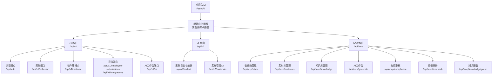
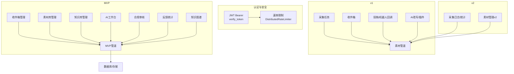
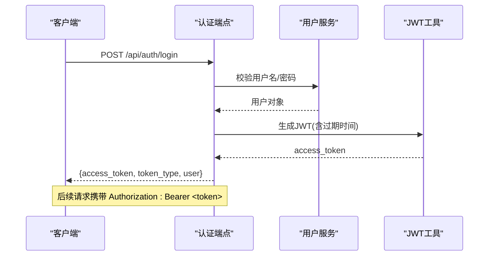
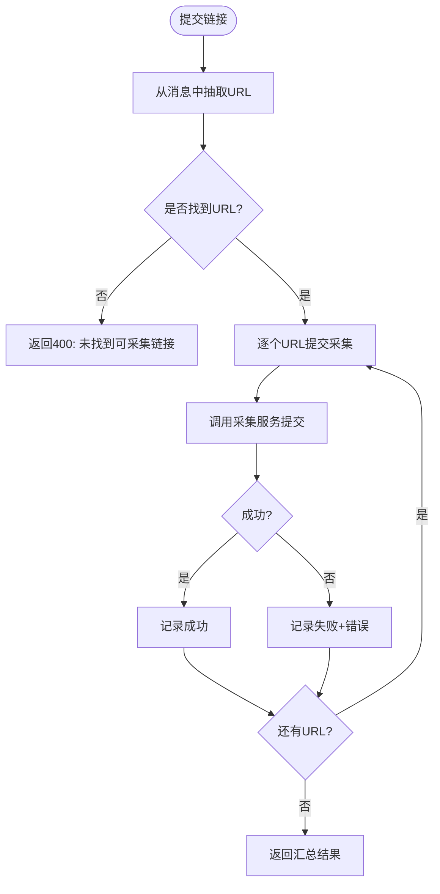
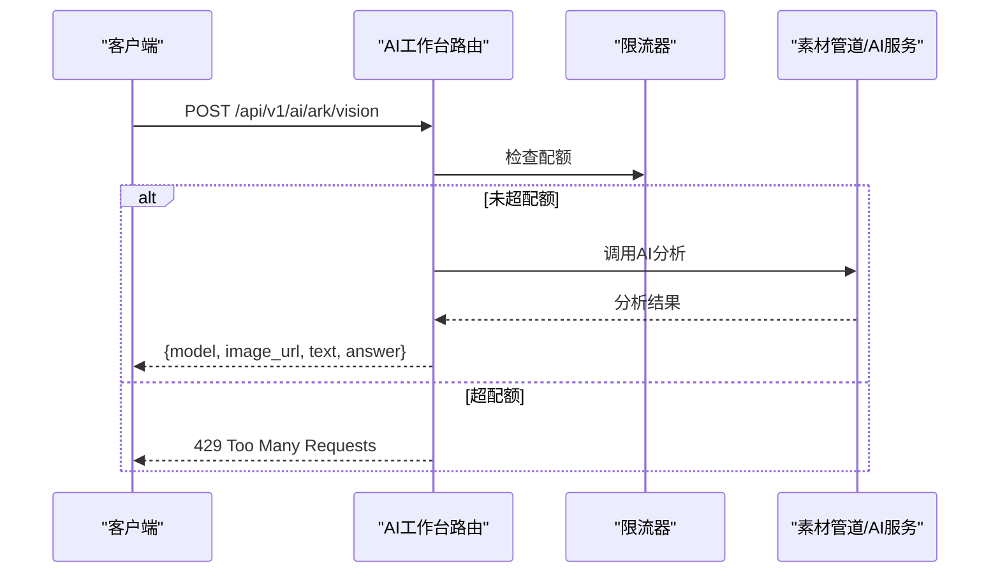
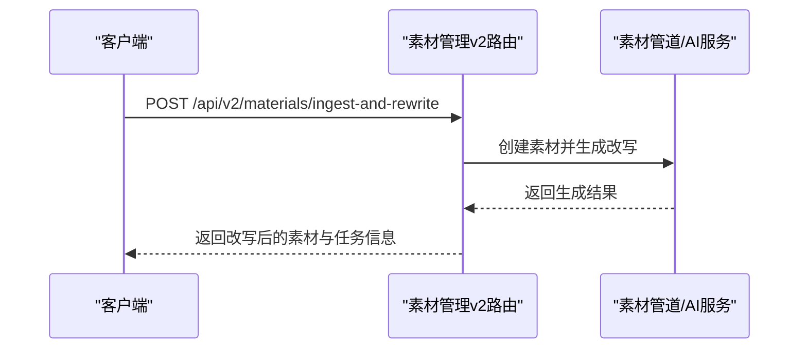
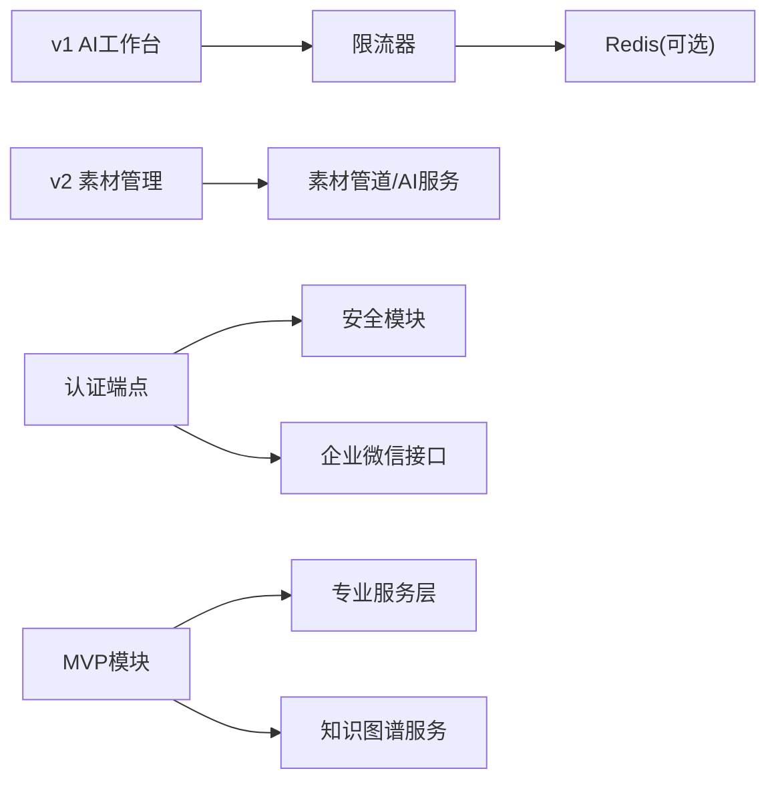

# API接口文档

<cite>
**本文引用的文件**
- [backend/app/api/router.py](file://backend/app/api/router.py)
- [backend/app/api/v1/router.py](file://backend/app/api/v1/router.py)
- [backend/app/api/v2/router.py](file://backend/app/api/v2/router.py)
- [backend/app/api/endpoints/auth.py](file://backend/app/api/endpoints/auth.py)
- [backend/app/api/endpoints/mvp_routes.py](file://backend/app/api/endpoints/mvp_routes.py)
- [backend/app/api/v1/endpoints/ai_workbench.py](file://backend/app/api/v1/endpoints/ai_workbench.py)
- [backend/app/api/v1/endpoints/collect.py](file://backend/app/api/v1/endpoints/collect.py)
- [backend/app/api/v1/endpoints/inbox.py](file://backend/app/api/v1/endpoints/inbox.py)
- [backend/app/api/v1/endpoints/submissions.py](file://backend/app/api/v1/endpoints/submissions.py)
- [backend/app/api/v2/endpoints/collect.py](file://backend/app/api/v2/endpoints/collect.py)
- [backend/app/api/v2/endpoints/materials.py](file://backend/app/api/v2/endpoints/materials.py)
- [backend/app/schemas/schemas.py](file://backend/app/schemas/schemas.py)
- [backend/app/schemas/mvp_schemas.py](file://backend/app/schemas/mvp_schemas.py)
- [backend/app/core/security.py](file://backend/app/core/security.py)
- [backend/app/core/rate_limit.py](file://backend/app/core/rate_limit.py)
- [backend/app/services/user_service.py](file://backend/app/services/user_service.py)
- [backend/app/services/mvp_knowledge_service.py](file://backend/app/services/mvp_knowledge_service.py)
- [backend/app/services/feedback_service.py](file://backend/app/services/feedback_service.py)
- [backend/app/services/knowledge_graph_service.py](file://backend/app/services/knowledge_graph_service.py)
</cite>

## 更新摘要
**变更内容**
- 新增MVP路由模块，包含收件箱、素材库、知识库、AI工作台等完整业务流程
- 新增批量知识构建功能，支持批量从素材构建知识
- 新增物料热切换功能，支持素材爆款状态切换
- 新增合规规则管理功能，支持规则创建、更新、删除和测试
- 新增反馈统计功能，支持反馈收集、统计分析和质量评分
- 新增知识图谱操作功能，支持关系构建、图遍历和增强检索
- 更新现有API端点，增加MVP前缀和增强功能

## 目录
1. [简介](#简介)
2. [项目结构](#项目结构)
3. [核心组件](#核心组件)
4. [架构总览](#架构总览)
5. [详细组件分析](#详细组件分析)
6. [依赖分析](#依赖分析)
7. [性能考量](#性能考量)
8. [故障排查指南](#故障排查指南)
9. [结论](#结论)
10. [附录](#附录)

## 简介
本文件为"智获客"系统的RESTful API接口文档，覆盖认证与授权、版本化路由、端点定义、请求/响应模型、错误处理与状态码、速率限制、安全与调试等。系统采用FastAPI框架，提供多版本API（v1、v2、MVP），并围绕素材采集、收件箱、AI改写、素材管理、发布任务、合规审核、知识图谱等业务域构建。

## 项目结构
- API入口与版本路由
  - 根路由注册器负责聚合所有子路由（v1、v2、MVP及各领域模块）
  - v1路由前缀为/api/v1，v2路由前缀为/api/v2，MVP路由前缀为/api/mvp
- 领域端点
  - 认证：/api/auth
  - v1：采集、素材收件箱、员工投稿、AI工作台、素材管理（v2）
  - v2：采集日志与统计、素材管理（v2）
  - MVP：收件箱、素材库、知识库、AI工作台、合规审核、反馈统计、知识图谱

**图表来源**
- [backend/app/api/router.py:1-36](file://backend/app/api/router.py#L1-L36)
- [backend/app/api/v1/router.py:1-22](file://backend/app/api/v1/router.py#L1-L22)
- [backend/app/api/v2/router.py:1-15](file://backend/app/api/v2/router.py#L1-L15)
- [backend/app/api/endpoints/mvp_routes.py:56](file://backend/app/api/endpoints/mvp_routes.py#L56)

**章节来源**
- [backend/app/api/router.py:1-36](file://backend/app/api/router.py#L1-L36)
- [backend/app/api/v1/router.py:1-22](file://backend/app/api/v1/router.py#L1-L22)
- [backend/app/api/v2/router.py:1-15](file://backend/app/api/v2/router.py#L1-L15)
- [backend/app/api/endpoints/mvp_routes.py:56](file://backend/app/api/endpoints/mvp_routes.py#L56)

## 核心组件
- 认证与授权
  - 使用JWT Bearer令牌进行鉴权，依赖HTTP Bearer方案
  - 支持用户名密码登录、获取当前用户信息、列出活跃用户
  - 支持移动端H5短时效票据签发与兑换
  - 支持企业微信OAuth回调换取令牌
- 速率限制
  - 基于Redis的分布式滑动窗口限流，降级为内存限流
  - 针对特定AI能力（如Ark Vision）进行独立配额控制
- 数据模型与Schema
  - 统一定义请求/响应模型，涵盖认证、素材、发布任务、仪表盘等
  - MVP模块新增完整的业务模型定义
- 服务层
  - 用户服务封装注册、认证、查询逻辑，并处理序列冲突修复
  - MVP知识服务、反馈服务、知识图谱服务等专业服务模块

**章节来源**
- [backend/app/api/endpoints/auth.py:1-280](file://backend/app/api/endpoints/auth.py#L1-L280)
- [backend/app/core/security.py:1-57](file://backend/app/core/security.py#L1-L57)
- [backend/app/core/rate_limit.py:1-108](file://backend/app/core/rate_limit.py#L1-L108)
- [backend/app/schemas/schemas.py:1-800](file://backend/app/schemas/schemas.py#L1-L800)
- [backend/app/schemas/mvp_schemas.py:1-200](file://backend/app/schemas/mvp_schemas.py#L1-L200)
- [backend/app/services/user_service.py:1-177](file://backend/app/services/user_service.py#L1-L177)

## 架构总览
- 版本化路由
  - v1：面向早期采集与素材流程，包含收件箱、采集任务、投稿、AI改写等
  - v2：面向新素材管道与统一管理，包含采集日志、统计、素材管理、AI改写入口
  - MVP：面向完整的内容生产与管理流程，包含收件箱、素材库、知识库、AI工作台、合规审核、反馈统计、知识图谱
- 安全与限流
  - 全局依赖JWT校验，部分高并发能力启用Redis限流
- 服务编排
  - 端点调用服务层或领域编排器（如素材管道、AI服务、知识图谱服务）

**图表来源**
- [backend/app/api/v1/endpoints/collect.py:1-34](file://backend/app/api/v1/endpoints/collect.py#L1-L34)
- [backend/app/api/v1/endpoints/inbox.py:1-165](file://backend/app/api/v1/endpoints/inbox.py#L1-L165)
- [backend/app/api/v1/endpoints/submissions.py:1-88](file://backend/app/api/v1/endpoints/submissions.py#L1-L88)
- [backend/app/api/v1/endpoints/ai_workbench.py:1-118](file://backend/app/api/v1/endpoints/ai_workbench.py#L1-L118)
- [backend/app/api/v2/endpoints/collect.py:1-302](file://backend/app/api/v2/endpoints/collect.py#L1-L302)
- [backend/app/api/v2/endpoints/materials.py:1-386](file://backend/app/api/v2/endpoints/materials.py#L1-L386)
- [backend/app/api/endpoints/mvp_routes.py:681-798](file://backend/app/api/endpoints/mvp_routes.py#L681-L798)

**章节来源**
- [backend/app/api/v1/endpoints/ai_workbench.py:1-118](file://backend/app/api/v1/endpoints/ai_workbench.py#L1-L118)
- [backend/app/core/rate_limit.py:1-108](file://backend/app/core/rate_limit.py#L1-L108)
- [backend/app/api/endpoints/mvp_routes.py:681-798](file://backend/app/api/endpoints/mvp_routes.py#L681-L798)

## 详细组件分析

### 认证与授权（/api/auth）
- 端点概览
  - POST /api/auth/register：注册新用户
  - POST /api/auth/login：用户名密码登录，返回JWT
  - GET /api/auth/me：获取当前登录用户信息
  - GET /api/auth/users/active：列出活跃用户
  - POST /api/auth/mobile-h5/ticket：签发移动端H5短时效票据
  - GET /api/auth/mobile-h5/exchange：用票据兑换Bearer令牌
  - GET /api/auth/wecom/config：返回企业微信OAuth公开配置
  - GET /api/auth/wecom/callback：企业微信OAuth回调换码
  - POST /api/auth/wecom/bind：为当前用户绑定企业微信userid
- 认证方式
  - Bearer JWT：除/oauth/callback外均需携带Authorization: Bearer <token>
  - 移动端H5：通过短期票据换取正式令牌
  - 企业微信：前端引导用户授权后，H5转发code至回调接口
- 错误处理
  - 400：参数错误/无效输入
  - 401：未认证/令牌无效/企业微信code无效
  - 409：绑定冲突（同一企业微信userid已被绑定）
  - 410：旧接口已下线
  - 502/503：外部服务异常/未配置

**图表来源**
- [backend/app/api/endpoints/auth.py:95-118](file://backend/app/api/endpoints/auth.py#L95-L118)
- [backend/app/services/user_service.py:154-165](file://backend/app/services/user_service.py#L154-L165)
- [backend/app/core/security.py:28-39](file://backend/app/core/security.py#L28-L39)

**章节来源**
- [backend/app/api/endpoints/auth.py:1-280](file://backend/app/api/endpoints/auth.py#L1-L280)
- [backend/app/services/user_service.py:1-177](file://backend/app/services/user_service.py#L1-L177)
- [backend/app/core/security.py:1-57](file://backend/app/core/security.py#L1-L57)

### v1 采集与素材（/api/v1）
- 采集任务（POST /api/v1/collector/tasks/keyword）
  - 请求体：平台、关键词、最大条数
  - 响应：任务创建结果
  - 异常：502 外部采集服务失败
- 收件箱（GET/POST/PATCH /api/v1/material）
  - 列表：支持按状态、平台、渠道、关键字、风险状态筛选，分页
  - 手动录入：统一进入review状态
  - 更新状态：按状态机更新pending/review/discard
  - 详情：返回条目详情
  - 基于素材改写：调用素材管道与AI服务生成文案
- 员工投稿（POST /api/v1/employee-submissions/link）
  - 提交链接，返回submission_id与状态
  - 异常：502 链接采集失败
- 企业微信机器人回调（POST /api/v1/integrations/wechat/callback）
  - 从消息中抽取URL，批量提交采集
  - 返回汇总结果（总数、成功数、失败数、明细）

**章节来源**
- [backend/app/api/v1/endpoints/collect.py:1-34](file://backend/app/api/v1/endpoints/collect.py#L1-L34)
- [backend/app/api/v1/endpoints/inbox.py:1-165](file://backend/app/api/v1/endpoints/inbox.py#L1-L165)
- [backend/app/api/v1/endpoints/submissions.py:1-88](file://backend/app/api/v1/endpoints/submissions.py#L1-L88)

### v1 AI工作台（/api/v1/ai）
- 端点
  - POST /api/v1/ai/rewrite/xiaohongshu
  - POST /api/v1/ai/rewrite/douyin
  - POST /api/v1/ai/rewrite/zhihu
  - POST /api/v1/ai/plugin/collect（已下线，410）
  - POST /api/v1/ai/ark/vision（受速率限制）
- 速率限制
  - Ark Vision调用受独立限流器控制，超过配额返回429
- 处理流程
  - 通过素材管道与AI服务生成改写内容，返回原始素材、改写结果、洞察引用等

**图表来源**
- [backend/app/api/v1/endpoints/ai_workbench.py:99-114](file://backend/app/api/v1/endpoints/ai_workbench.py#L99-L114)
- [backend/app/core/rate_limit.py:75-108](file://backend/app/core/rate_limit.py#L75-L108)

**章节来源**
- [backend/app/api/v1/endpoints/ai_workbench.py:1-118](file://backend/app/api/v1/endpoints/ai_workbench.py#L1-L118)
- [backend/app/core/rate_limit.py:1-108](file://backend/app/core/rate_limit.py#L1-L108)

### v2 采集与素材（/api/v2）
- 采集
  - POST /api/v2/collect/extract-from-url：根据URL预提取平台与元数据
  - GET /api/v2/collect/logs：按来源类型筛选采集日志
  - GET /api/v2/collect/stats：统计采集总量、重复数、按平台/状态分布
  - POST /api/v2/collect/ingest-page（已停用，410）
  - POST /api/v2/collect/ingest-spider-xhs（已停用，410）
  - POST /api/v2/collect/ingest-spider-xhs/batch（已停用，410）
- 素材管理v2
  - GET /api/v2/materials：分页列出素材，支持按平台/状态/风险/渠道搜索
  - GET /api/v2/materials/{material_id}：返回素材详情（含知识库、生成任务、变体统计）
  - PATCH /api/v2/materials/{material_id}：更新标题/正文/备注/状态
  - DELETE /api/v2/materials/{material_id}：删除素材
  - POST /api/v2/materials/{material_id}/analyze：重新索引素材
  - POST /api/v2/materials/{material_id}/rewrite：基于素材改写
  - POST /api/v2/materials/ingest-and-rewrite：直接摄入并改写
  - POST /api/v2/materials/{material_id}/generation/{generation_task_id}/adopt：采纳/回滚生成版本

**章节来源**
- [backend/app/api/v2/endpoints/collect.py:1-302](file://backend/app/api/v2/endpoints/collect.py#L1-L302)
- [backend/app/api/v2/endpoints/materials.py:1-386](file://backend/app/api/v2/endpoints/materials.py#L1-L386)

### MVP 收件箱管理（/api/mvp/inbox）
- 端点概览
  - GET /api/mvp/inbox：列出收件箱条目，支持多维筛选和分页
  - GET /api/mvp/inbox/{item_id}：获取单条收件箱条目详情
  - POST /api/mvp/inbox/{item_id}/to-material：将收件箱条目入素材库
  - POST /api/mvp/inbox/{item_id}/mark-hot：标记为爆款
  - POST /api/mvp/inbox/{item_id}/discard：丢弃条目
  - POST /api/mvp/inbox/{item_id}/ignore：忽略条目
  - POST /api/mvp/inbox/{item_id}/clean：单条清洗
  - POST /api/mvp/inbox/batch-clean：批量清洗
  - POST /api/mvp/inbox/{item_id}/screen：单条质量筛选
  - POST /api/mvp/inbox/batch-screen：批量质量筛选
  - POST /api/mvp/inbox/ingest：采集数据入收件箱
  - POST /api/mvp/inbox/batch-to-material：批量入素材库
  - POST /api/mvp/inbox/batch-ignore：批量忽略

**章节来源**
- [backend/app/api/endpoints/mvp_routes.py:60-292](file://backend/app/api/endpoints/mvp_routes.py#L60-L292)

### MVP 素材库管理（/api/mvp/materials）
- 端点概览
  - GET /api/mvp/materials：列出素材，支持多维筛选和分页
  - GET /api/mvp/materials/{material_id}：获取素材详情
  - POST /api/mvp/materials：创建素材
  - POST /api/mvp/materials/{material_id}/build-knowledge：从素材构建知识
  - POST /api/mvp/materials/batch-build-knowledge：批量从素材构建知识
  - POST /api/mvp/materials/{material_id}/to-knowledge：素材入知识库
  - POST /api/mvp/materials/{material_id}/rewrite：爆款仿写
  - POST /api/mvp/materials/{material_id}/toggle-hot：切换爆款状态
  - POST /api/mvp/materials/{material_id}/tags：更新素材标签

**章节来源**
- [backend/app/api/endpoints/mvp_routes.py:294-411](file://backend/app/api/endpoints/mvp_routes.py#L294-L411)

### MVP 知识库管理（/api/mvp/knowledge）
- 端点概览
  - GET /api/mvp/knowledge：列出知识库条目
  - GET /api/mvp/knowledge/{knowledge_id}：获取知识条目详情
  - POST /api/mvp/knowledge/build：从素材构建知识
  - POST /api/mvp/knowledge/search：搜索知识库
  - GET /api/mvp/knowledge/library-stats：获取各分库统计
  - GET /api/mvp/knowledge/library/{library_type}：按分库类型列出知识条目
  - GET /api/mvp/knowledge/libraries：获取各分库统计
  - GET /api/mvp/knowledge/chunks/{knowledge_id}：获取知识切块列表
  - POST /api/mvp/knowledge/reindex：重建知识切块和向量索引
  - GET /api/mvp/raw-contents/auto-pipeline：自动入库Pipeline
  - POST /api/mvp/raw-contents/auto-pipeline：批量自动入库Pipeline

**章节来源**
- [backend/app/api/endpoints/mvp_routes.py:413-721](file://backend/app/api/endpoints/mvp_routes.py#L413-L721)

### MVP AI工作台（/api/mvp/generate）
- 端点概览
  - POST /api/mvp/generate：多版本内容生成
  - POST /api/mvp/generate/final：最终生成（含合规审核）
  - POST /api/mvp/generate/full-pipeline：全流程内容生成

**章节来源**
- [backend/app/api/endpoints/mvp_routes.py:723-798](file://backend/app/api/endpoints/mvp_routes.py#L723-L798)

### MVP 合规审核（/api/mvp/compliance）
- 端点概览
  - POST /api/mvp/compliance/check：合规检查
  - GET /api/mvp/compliance/rules：规则列表
  - POST /api/mvp/compliance/rules：创建规则
  - PUT /api/mvp/compliance/rules/{rule_id}：更新规则
  - DELETE /api/mvp/compliance/rules/{rule_id}：删除规则
  - POST /api/mvp/compliance/test：测试规则

**章节来源**
- [backend/app/api/endpoints/mvp_routes.py:800-897](file://backend/app/api/endpoints/mvp_routes.py#L800-L897)

### MVP 反馈统计（/api/mvp/feedback）
- 端点概览
  - POST /api/mvp/feedback：提交反馈
  - GET /api/mvp/feedback/stats：获取反馈统计
  - GET /api/mvp/knowledge/quality/rankings：获取知识质量排行榜
  - GET /api/mvp/knowledge/quality/suggestions：获取学习建议
  - POST /api/mvp/knowledge/quality/adjust：应用权重调整
  - GET /api/mvp/feedback/tags：获取反馈标签选项

**章节来源**
- [backend/app/api/endpoints/mvp_routes.py:1033-1126](file://backend/app/api/endpoints/mvp_routes.py#L1033-L1126)

### MVP 知识图谱（/api/mvp/knowledge/graph）
- 端点概览
  - POST /api/mvp/knowledge/graph/build：触发全量关系构建
  - POST /api/mvp/knowledge/{knowledge_id}/relations/build：为单条知识构建关系
  - GET /api/mvp/knowledge/{knowledge_id}/related：获取关联知识条目
  - GET /api/mvp/knowledge/graph：获取知识图谱数据
  - GET /api/mvp/knowledge/graph/stats：获取图谱统计信息
  - GET /api/mvp/knowledge/graph/clusters：获取主题聚类
  - GET /api/mvp/knowledge/graph/enhanced-search：图增强检索

**章节来源**
- [backend/app/api/endpoints/mvp_routes.py:1260-1401](file://backend/app/api/endpoints/mvp_routes.py#L1260-L1401)

## 依赖分析
- 组件耦合
  - 端点依赖安全中间件（verify_token）与数据库会话
  - v1 AI工作台对分布式限流器有直接依赖
  - v2素材管理依赖素材管道与AI服务
  - MVP模块包含完整的业务服务层依赖
- 外部依赖
  - 企业微信：获取access_token与用户信息
  - Redis：分布式限流（可选）
  - pgvector：知识图谱向量相似度计算
- 循环依赖
  - 当前结构通过路由聚合避免循环导入

**图表来源**
- [backend/app/api/endpoints/auth.py:44-73](file://backend/app/api/endpoints/auth.py#L44-L73)
- [backend/app/api/v1/endpoints/ai_workbench.py:19-25](file://backend/app/api/v1/endpoints/ai_workbench.py#L19-L25)
- [backend/app/core/rate_limit.py:37-73](file://backend/app/core/rate_limit.py#L37-L73)
- [backend/app/api/endpoints/mvp_routes.py:1260-1401](file://backend/app/api/endpoints/mvp_routes.py#L1260-L1401)

**章节来源**
- [backend/app/api/endpoints/auth.py:1-280](file://backend/app/api/endpoints/auth.py#L1-L280)
- [backend/app/api/v1/endpoints/ai_workbench.py:1-118](file://backend/app/api/v1/endpoints/ai_workbench.py#L1-L118)
- [backend/app/core/rate_limit.py:1-108](file://backend/app/core/rate_limit.py#L1-L108)
- [backend/app/api/endpoints/mvp_routes.py:1260-1401](file://backend/app/api/endpoints/mvp_routes.py#L1260-L1401)

## 性能考量
- 速率限制
  - Ark Vision使用Redis固定窗口计数器，窗口秒数可配置，键前缀可隔离
  - 单节点降级为内存滑动窗口，避免单点故障
- 缓存与幂等
  - 企业微信access_token本地内存缓存，减少外部调用
- 查询优化
  - v2素材列表支持多维过滤与分页上限控制
  - MVP知识库支持分库类型过滤和多维筛选
- I/O与并发
  - v1 AI改写与v2素材改写异步生成，避免阻塞请求
  - MVP知识图谱关系构建支持批量处理
- 向量检索
  - 知识图谱基于pgvector进行相似度计算，支持大规模向量检索

## 故障排查指南
- 认证相关
  - 401 未认证：检查Authorization头是否正确
  - 401 令牌无效/过期：重新登录获取新令牌
  - 企业微信未配置/回调失败：检查配置项与回调地址
- 采集与素材
  - 502 外部采集服务失败：重试或检查上游服务
  - 410 接口已下线：迁移至新接口（如v2 collect ingests）
- 速率限制
  - 429 过于频繁：降低调用频率或提升配额
- MVP模块
  - pgvector扩展不可用：知识图谱向量相似度功能降级
  - 知识库重建失败：检查嵌入模型配置和数据库连接
  - 反馈统计异常：检查反馈表结构和数据完整性
- 常见问题
  - 企业微信code无效：确认code有效且未过期
  - 绑定冲突：确保同一企业微信userid仅绑定一个系统账号

**章节来源**
- [backend/app/api/endpoints/auth.py:209-254](file://backend/app/api/endpoints/auth.py#L209-L254)
- [backend/app/api/v1/endpoints/ai_workbench.py:90-96](file://backend/app/api/v1/endpoints/ai_workbench.py#L90-L96)
- [backend/app/api/v2/endpoints/collect.py:209-242](file://backend/app/api/v2/endpoints/collect.py#L209-L242)
- [backend/app/core/rate_limit.py:30-34](file://backend/app/core/rate_limit.py#L30-L34)
- [backend/app/api/endpoints/mvp_routes.py:1260-1401](file://backend/app/api/endpoints/mvp_routes.py#L1260-L1401)

## 结论
本API体系以版本化路由清晰划分v1、v2与MVP三大模块，结合JWT认证、企业微信OAuth、Redis限流与素材管道编排，形成从采集、收件箱、AI改写到素材管理、合规审核、反馈统计、知识图谱的完整内容生产与管理体系。MVP模块提供了最完整的业务流程支持，建议客户端优先使用MVP端点，并关注已下线接口的迁移提示。

## 附录

### API版本控制、兼容性与迁移
- 版本策略
  - v1：保留早期采集与素材流程，逐步迁移至v2/MVP
  - v2：统一采集日志与素材管理，新增采纳/回滚生成版本能力
  - MVP：提供完整的业务流程支持，包含收件箱、素材库、知识库、AI工作台、合规审核、反馈统计、知识图谱
- 向后兼容
  - 部分v1端点明确标注已下线（410），需迁移
  - v2/MVP提供等价或增强能力，如采集日志、统计、素材详情与改写
- 迁移指南
  - 采集入口：从v1/collector/tasks/keyword迁移至v2/collect/logs与v2/materials
  - 插件采集：v1/plugin/collect已下线，使用v2/collect/ingest-page（若仍需直写，请遵循回填脚本）
  - 改写流程：v1/ai/rewrite与v2/materials/{material_id}/rewrite均可使用，推荐v2以获得更丰富的素材上下文
  - 新功能：MVP模块提供批量知识构建、物料热切换、合规规则管理、反馈统计、知识图谱等新能力

**章节来源**
- [backend/app/api/v1/endpoints/ai_workbench.py:81-96](file://backend/app/api/v1/endpoints/ai_workbench.py#L81-L96)
- [backend/app/api/v2/endpoints/collect.py:200-212](file://backend/app/api/v2/endpoints/collect.py#L200-L212)
- [backend/app/api/endpoints/mvp_routes.py:1128-1258](file://backend/app/api/endpoints/mvp_routes.py#L1128-L1258)

### 认证与授权机制
- JWT Bearer
  - 登录成功返回access_token与用户信息
  - 移动端H5短时效票据用于快速换取正式令牌
  - 企业微信OAuth回调换取系统令牌
- 权限
  - 除/oauth/callback外，均需Bearer令牌
  - 管理员绑定企业微信userid接口需当前登录态

**章节来源**
- [backend/app/api/endpoints/auth.py:134-178](file://backend/app/api/endpoints/auth.py#L134-L178)
- [backend/app/api/endpoints/auth.py:195-254](file://backend/app/api/endpoints/auth.py#L195-L254)
- [backend/app/core/security.py:42-57](file://backend/app/core/security.py#L42-L57)

### 速率限制与安全
- 速率限制
  - Ark Vision：每分钟配额，超限429
  - Redis优先，不可用时降级为内存限流
- 安全
  - 密码哈希采用pbkdf2_sha256与bcrypt兼容
  - 企业微信access_token本地缓存，减少外部调用

**章节来源**
- [backend/app/core/rate_limit.py:75-108](file://backend/app/core/rate_limit.py#L75-L108)
- [backend/app/core/security.py:18-25](file://backend/app/core/security.py#L18-L25)
- [backend/app/api/endpoints/auth.py:44-73](file://backend/app/api/endpoints/auth.py#L44-L73)

### 常见用例与客户端实现要点
- 客户端实现建议
  - 统一设置Authorization: Bearer <token>
  - 采集与改写类请求建议幂等与重试策略
  - v2/MVP端点优先，关注410迁移提示
  - MVP模块建议按业务流程顺序调用：收件箱→素材库→知识库→AI工作台→合规审核→反馈统计
- 用例
  - 采集与改写：先extract-from-url，再ingest-and-rewrite
  - 素材管理：PATCH更新正文，POST adoption采纳版本
  - 批量知识构建：POST /api/mvp/materials/batch-build-knowledge
  - 物料热切换：POST /api/mvp/materials/{material_id}/toggle-hot
  - 合规审核：POST /api/mvp/compliance/test
  - 反馈统计：POST /api/mvp/feedback，GET /api/mvp/feedback/stats
  - 知识图谱：POST /api/mvp/knowledge/graph/build

**章节来源**
- [backend/app/api/v2/endpoints/collect.py:172-197](file://backend/app/api/v2/endpoints/collect.py#L172-L197)
- [backend/app/api/v2/endpoints/materials.py:284-308](file://backend/app/api/v2/endpoints/materials.py#L284-L308)
- [backend/app/api/v2/endpoints/materials.py:311-381](file://backend/app/api/v2/endpoints/materials.py#L311-L381)
- [backend/app/api/endpoints/mvp_routes.py:344-371](file://backend/app/api/endpoints/mvp_routes.py#L344-L371)
- [backend/app/api/endpoints/mvp_routes.py:394-403](file://backend/app/api/endpoints/mvp_routes.py#L394-L403)
- [backend/app/api/endpoints/mvp_routes.py:891-897](file://backend/app/api/endpoints/mvp_routes.py#L891-L897)
- [backend/app/api/endpoints/mvp_routes.py:1060-1074](file://backend/app/api/endpoints/mvp_routes.py#L1060-L1074)
- [backend/app/api/endpoints/mvp_routes.py:1264-1282](file://backend/app/api/endpoints/mvp_routes.py#L1264-L1282)

### SDK使用示例与最佳实践
- SDK建议
  - 封装认证：登录获取token，持久化并自动续期
  - 限流适配：对Ark Vision等接口增加退避重试
  - 错误分类：区分401/404/409/410/429/5xx并做差异化处理
  - 日志与追踪：为每次请求附加trace_id，便于定位
  - MVP模块：按业务流程顺序调用，注意批量操作的错误处理
- 最佳实践
  - 优先使用v2/MVP端点
  - 对批量操作（如微信回调、批量知识构建）采用分批提交与汇总结果
  - 对高并发AI改写请求，合理拆分与排队
  - 知识图谱：定期重建关系，监控pgvector扩展状态
  - 反馈闭环：建立完整的反馈收集与统计分析流程

**章节来源**
- [backend/app/api/endpoints/mvp_routes.py:1128-1258](file://backend/app/api/endpoints/mvp_routes.py#L1128-L1258)
- [backend/app/services/mvp_knowledge_service.py:115-161](file://backend/app/services/mvp_knowledge_service.py#L115-L161)
- [backend/app/services/feedback_service.py:31-84](file://backend/app/services/feedback_service.py#L31-L84)
- [backend/app/services/knowledge_graph_service.py:37-64](file://backend/app/services/knowledge_graph_service.py#L37-L64)