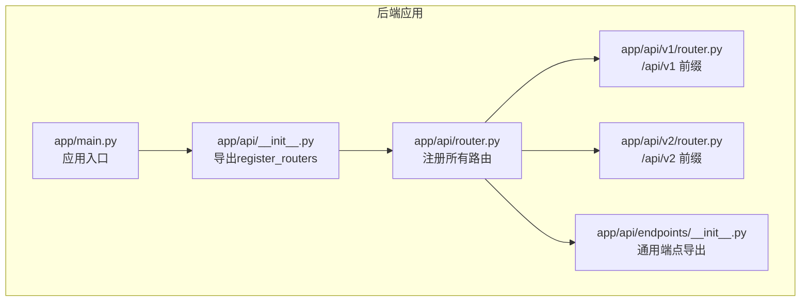
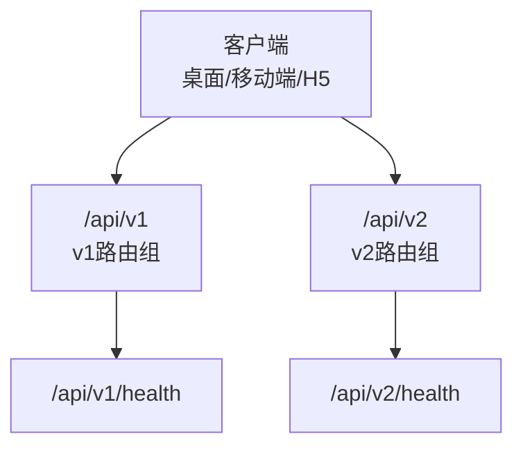
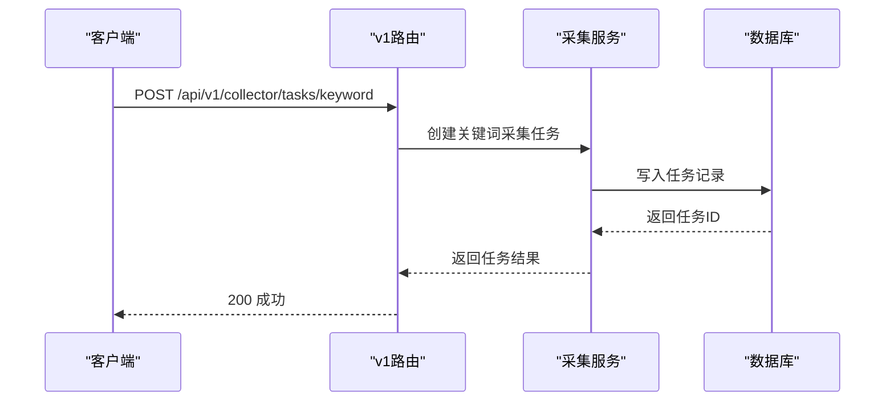
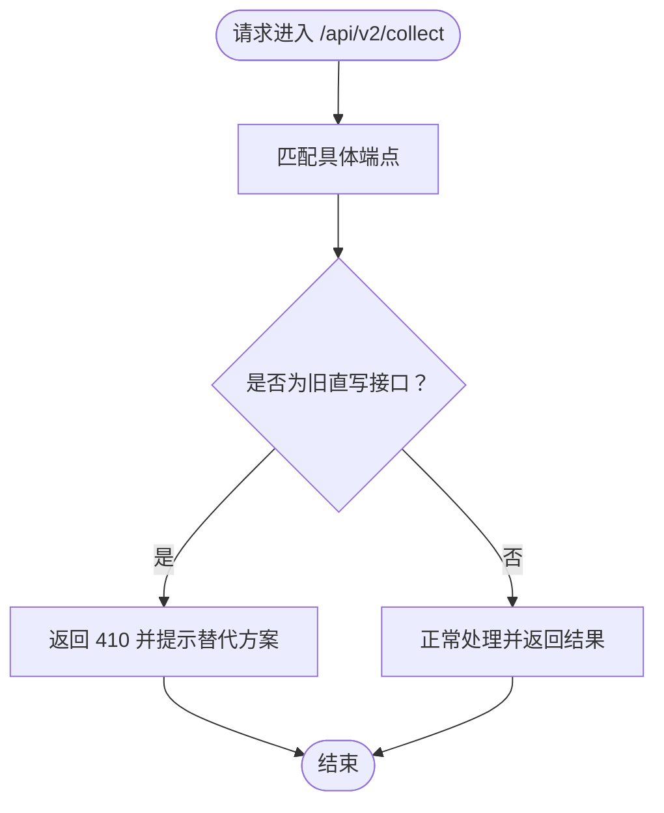
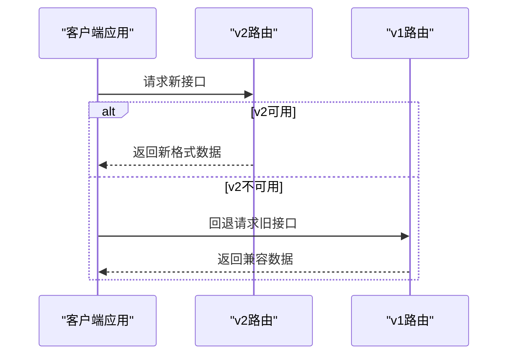
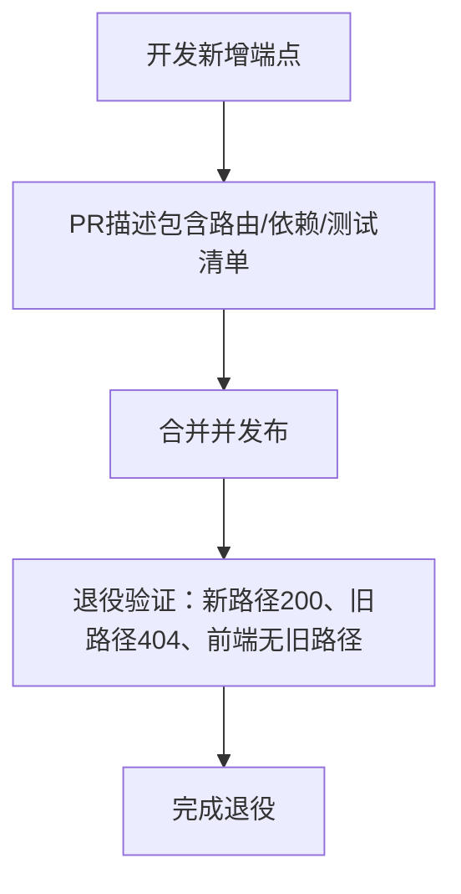
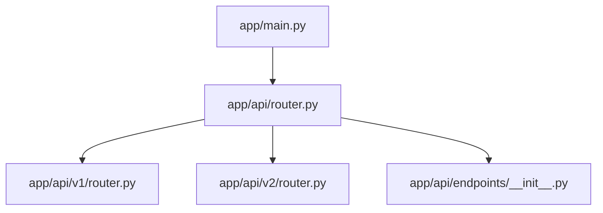

# API版本控制与兼容性

<cite>
**本文引用的文件**
- [backend/app/api/router.py](file://backend/app/api/router.py)
- [backend/app/api/__init__.py](file://backend/app/api/__init__.py)
- [backend/app/api/v1/router.py](file://backend/app/api/v1/router.py)
- [backend/app/api/v2/router.py](file://backend/app/api/v2/router.py)
- [backend/app/api/endpoints/__init__.py](file://backend/app/api/endpoints/__init__.py)
- [backend/app/api/v1/endpoints/collect.py](file://backend/app/api/v1/endpoints/collect.py)
- [backend/app/api/v1/endpoints/inbox.py](file://backend/app/api/v1/endpoints/inbox.py)
- [backend/app/api/v1/endpoints/submissions.py](file://backend/app/api/v1/endpoints/submissions.py)
- [backend/app/api/v1/endpoints/ai_workbench.py](file://backend/app/api/v1/endpoints/ai_workbench.py)
- [backend/app/api/v2/endpoints/collect.py](file://backend/app/api/v2/endpoints/collect.py)
- [backend/app/api/v2/endpoints/materials.py](file://backend/app/api/v2/endpoints/materials.py)
- [docs/architecture/api-v1-routing-policy.md](file://docs/architecture/api-v1-routing-policy.md)
- [desktop/src/api/README.md](file://desktop/src/api/README.md)
- [mobile-h5/src/utils/api-client.js](file://mobile-h5/src/utils/api-client.js)
- [backend/app/main.py](file://backend/app/main.py)
- [backend/app/rules/dynamic/rule_versioning.py](file://backend/app/rules/dynamic/rule_versioning.py)
</cite>

## 目录
1. [引言](#引言)
2. [项目结构](#项目结构)
3. [核心组件](#核心组件)
4. [架构总览](#架构总览)
5. [详细组件分析](#详细组件分析)
6. [依赖分析](#依赖分析)
7. [性能考虑](#性能考虑)
8. [故障排查指南](#故障排查指南)
9. [结论](#结论)
10. [附录](#附录)

## 引言
本文件系统化梳理智获客API版本控制与兼容性体系，覆盖v1与v2版本的演进策略、向后兼容保障、废弃接口处理机制、版本检测与自动降级、客户端适配方案、版本发布流程与测试策略、文档同步最佳实践，以及API变更管理与客户端升级的平滑过渡技术实现。目标是帮助开发者与产品团队在演进过程中保持稳定、可追踪、可回滚与可迁移。

## 项目结构
后端采用FastAPI框架，API路由按版本分层组织：非版本化路由集中于根级路由，v1与v2版本路由分别位于独立包内，并通过统一入口注册到应用实例。v1作为当前主力版本，v2引入了更严格的输入校验、更清晰的数据模型与更明确的废弃接口提示。

图表来源
- [backend/app/main.py:1-4](file://backend/app/main.py#L1-L4)
- [backend/app/api/__init__.py:1-6](file://backend/app/api/__init__.py#L1-L6)
- [backend/app/api/router.py:1-35](file://backend/app/api/router.py#L1-L35)
- [backend/app/api/v1/router.py:1-22](file://backend/app/api/v1/router.py#L1-L22)
- [backend/app/api/v2/router.py:1-15](file://backend/app/api/v2/router.py#L1-L15)
- [backend/app/api/endpoints/__init__.py:1-25](file://backend/app/api/endpoints/__init__.py#L1-L25)

章节来源
- [backend/app/api/router.py:1-35](file://backend/app/api/router.py#L1-L35)
- [backend/app/api/v1/router.py:1-22](file://backend/app/api/v1/router.py#L1-L22)
- [backend/app/api/v2/router.py:1-15](file://backend/app/api/v2/router.py#L1-L15)
- [backend/app/api/__init__.py:1-6](file://backend/app/api/__init__.py#L1-L6)
- [backend/app/api/endpoints/__init__.py:1-25](file://backend/app/api/endpoints/__init__.py#L1-L25)
- [backend/app/main.py:1-4](file://backend/app/main.py#L1-L4)

## 核心组件
- 版本化路由注册器：统一在根级router中注册v1与v2路由，确保版本前缀隔离与健康检查端点可见。
- v1版本：当前主力版本，覆盖采集、素材收件箱、员工提交、AI工作台等能力。
- v2版本：引入更严格的数据模型与更明确的废弃提示，逐步替代旧有直写接口。
- 路由治理规范：明确版本化路由策略、退役流程与回归验证要求，避免旧路径长期残留。

章节来源
- [backend/app/api/router.py:16-35](file://backend/app/api/router.py#L16-L35)
- [backend/app/api/v1/router.py:9-21](file://backend/app/api/v1/router.py#L9-L21)
- [backend/app/api/v2/router.py:6-14](file://backend/app/api/v2/router.py#L6-L14)
- [docs/architecture/api-v1-routing-policy.md:1-38](file://docs/architecture/api-v1-routing-policy.md#L1-L38)

## 架构总览
下图展示API版本控制的整体交互：客户端通过版本前缀访问对应路由；v1作为当前主力，v2提供新能力与废弃提示；路由治理规范约束迁移节奏与退役流程。

图表来源
- [backend/app/api/v1/router.py:19-21](file://backend/app/api/v1/router.py#L19-L21)
- [backend/app/api/v2/router.py:12-14](file://backend/app/api/v2/router.py#L12-L14)

## 详细组件分析

### v1版本能力与演进策略
- 采集任务：关键词采集任务创建，参数校验与异常处理明确。
- 素材收件箱：支持列表、手动录入、状态更新、详情查看与基于素材的改写生成。
- 员工提交：支持链接提交与微信回调批量提交，URL提取与批量处理。
- AI工作台：提供多平台改写入口与图像分析限流，同时对旧插件采集接口进行明确下线提示。

图表来源
- [backend/app/api/v1/endpoints/collect.py:18-34](file://backend/app/api/v1/endpoints/collect.py#L18-L34)

章节来源
- [backend/app/api/v1/endpoints/collect.py:1-34](file://backend/app/api/v1/endpoints/collect.py#L1-L34)
- [backend/app/api/v1/endpoints/inbox.py:40-165](file://backend/app/api/v1/endpoints/inbox.py#L40-L165)
- [backend/app/api/v1/endpoints/submissions.py:31-88](file://backend/app/api/v1/endpoints/submissions.py#L31-L88)
- [backend/app/api/v1/endpoints/ai_workbench.py:54-118](file://backend/app/api/v1/endpoints/ai_workbench.py#L54-L118)

### v2版本能力与废弃接口处理
- 采集与素材：提供URL预提取、日志查询与统计接口；对旧有直写接口统一返回410并给出替代建议。
- 素材管理：提供素材列表、详情、更新、删除、分析、改写、直写改写、采纳/回退等完整生命周期管理。
- 废弃接口策略：对已停用接口返回明确错误码与迁移指引，避免客户端继续依赖。

图表来源
- [backend/app/api/v2/endpoints/collect.py:209-242](file://backend/app/api/v2/endpoints/collect.py#L209-L242)

章节来源
- [backend/app/api/v2/endpoints/collect.py:172-298](file://backend/app/api/v2/endpoints/collect.py#L172-L298)
- [backend/app/api/v2/endpoints/materials.py:151-382](file://backend/app/api/v2/endpoints/materials.py#L151-L382)

### 版本差异、迁移指南与兼容性矩阵
- 路由前缀：v1统一前缀/api/v1，v2统一前缀/api/v2，避免冲突。
- 数据模型：v2引入更严格的输入模型与字段校验，提升接口稳定性。
- 废弃策略：对已停用接口返回410并提供替代路径，确保客户端可感知迁移。
- 迁移建议：
  - 采集：从旧直写迁移至v1员工提交或v2素材管道。
  - 改写：优先使用v2素材管理的改写与采纳流程。
  - 插件采集：迁移至v2采集入口。

兼容性矩阵（示例）

| 组件 | v1可用 | v2可用 | 备注 |
| --- | --- | --- | --- |
| 关键词采集任务 | ✅ | ❌（替代：员工提交/素材管道） |  |
| 员工提交链接 | ✅ | ✅ |  |
| 微信回调批量提交 | ✅ | ✅ |  |
| 旧插件采集 | ❌（410） | ❌（410） | 替代：/api/v2/collect/ingest-page |
| 素材改写与采纳 | ❌（v1为收件箱改写） | ✅ | v2提供更完善流程 |

章节来源
- [docs/architecture/api-v1-routing-policy.md:20-28](file://docs/architecture/api-v1-routing-policy.md#L20-L28)
- [backend/app/api/v1/endpoints/ai_workbench.py:90-96](file://backend/app/api/v1/endpoints/ai_workbench.py#L90-L96)
- [backend/app/api/v2/endpoints/collect.py:209-242](file://backend/app/api/v2/endpoints/collect.py#L209-L242)

### 版本检测、自动降级与客户端适配
- 版本检测：各版本路由均提供健康检查端点，便于客户端探测版本可用性。
- 自动降级：当v2接口不可用时，客户端可回退至v1对应端点；对已废弃接口，客户端应根据410响应提示迁移。
- 客户端适配：
  - 桌面端：API客户端封装落点，便于集中维护版本前缀与错误处理。
  - 移动端/H5：统一的API客户端工具函数，便于在不同平台复用。

图表来源
- [backend/app/api/v1/router.py:19-21](file://backend/app/api/v1/router.py#L19-L21)
- [backend/app/api/v2/router.py:12-14](file://backend/app/api/v2/router.py#L12-L14)

章节来源
- [desktop/src/api/README.md:1-1](file://desktop/src/api/README.md#L1-L1)
- [mobile-h5/src/utils/api-client.js:294-318](file://mobile-h5/src/utils/api-client.js#L294-L318)

### API变更管理、发布流程与测试策略
- 变更管理：遵循路由治理规范，新增端点需在PR中明确路由前缀、依赖域服务与回归测试清单。
- 发布流程：完成v1迁移后，立即从注册链路移除旧路径；退役后验证新路径可用、旧路径404、前端无旧路径跳转。
- 测试策略：至少包含1个新路径200场景与1个旧路径404场景（若存在迁移历史）。

图表来源
- [docs/architecture/api-v1-routing-policy.md:29-37](file://docs/architecture/api-v1-routing-policy.md#L29-L37)

章节来源
- [docs/architecture/api-v1-routing-policy.md:1-38](file://docs/architecture/api-v1-routing-policy.md#L1-L38)

### 规则版本与动态规则
- 规则版本：当前规则版本固定为1，便于在规则系统中进行版本化管理与灰度发布。

章节来源
- [backend/app/rules/dynamic/rule_versioning.py:1-2](file://backend/app/rules/dynamic/rule_versioning.py#L1-L2)

## 依赖分析
- 路由注册：根级router聚合v1与v2路由，确保版本前缀隔离与统一暴露。
- 端点依赖：v1与v2端点依赖安全认证、数据库会话与领域服务，保证一致性与可测试性。
- 前端集成：桌面端与移动端/H5共享API客户端封装，便于版本切换与错误处理统一。

图表来源
- [backend/app/api/router.py:16-35](file://backend/app/api/router.py#L16-L35)
- [backend/app/api/v1/router.py:9-21](file://backend/app/api/v1/router.py#L9-L21)
- [backend/app/api/v2/router.py:6-14](file://backend/app/api/v2/router.py#L6-L14)
- [backend/app/api/endpoints/__init__.py:13-24](file://backend/app/api/endpoints/__init__.py#L13-L24)
- [backend/app/main.py:1-4](file://backend/app/main.py#L1-L4)

章节来源
- [backend/app/api/router.py:1-35](file://backend/app/api/router.py#L1-L35)
- [backend/app/api/v1/router.py:1-22](file://backend/app/api/v1/router.py#L1-L22)
- [backend/app/api/v2/router.py:1-15](file://backend/app/api/v2/router.py#L1-L15)
- [backend/app/api/endpoints/__init__.py:1-25](file://backend/app/api/endpoints/__init__.py#L1-L25)
- [backend/app/main.py:1-4](file://backend/app/main.py#L1-L4)

## 性能考虑
- 路由前缀隔离：版本前缀减少命名冲突，便于缓存与监控。
- 输入校验前置：v2引入更严格的模型校验，降低下游处理开销与异常传播成本。
- 废弃接口快速失败：对已停用接口直接返回410，避免无效请求占用资源。
- 限流与速率控制：AI工作台对高成本操作实施分布式限流，保障系统稳定性。

## 故障排查指南
- 410已停用接口：当收到410错误时，检查替代路径与迁移指引，确认客户端是否仍调用旧接口。
- 旧路径404：退役完成后，旧路径应返回404；如仍可用，检查路由注册链路是否清理。
- 健康检查：通过版本健康端点确认服务可用性，定位网络或认证问题。
- 日志与统计：v2提供采集日志与统计接口，便于排查素材入库与重复率等问题。

章节来源
- [backend/app/api/v2/endpoints/collect.py:209-242](file://backend/app/api/v2/endpoints/collect.py#L209-L242)
- [backend/app/api/v2/router.py:12-14](file://backend/app/api/v2/router.py#L12-L14)
- [backend/app/api/v1/router.py:19-21](file://backend/app/api/v1/router.py#L19-L21)

## 结论
通过版本前缀隔离、严格的路由治理规范、明确的废弃接口策略与客户端适配方案，智获客实现了API的平滑演进与稳定兼容。v1作为当前主力，v2提供新能力与清晰的迁移路径；结合健康检查、限流与退役验证，确保变更可控、可追踪、可回滚。

## 附录
- 版本健康端点：/api/v1/health、/api/v2/health
- 退役验证清单：新路径200、旧路径404、前端无旧路径跳转
- 客户端封装：桌面端与移动端/H5共享API客户端工具