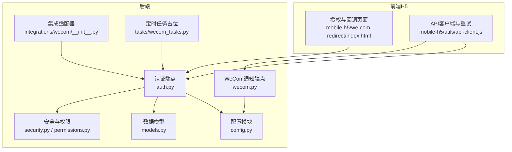
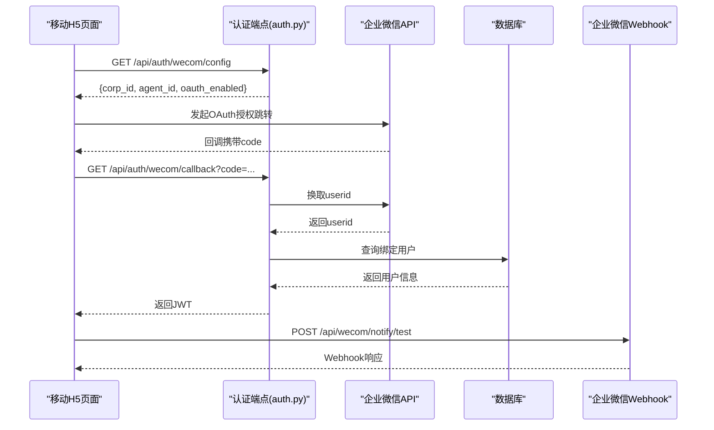
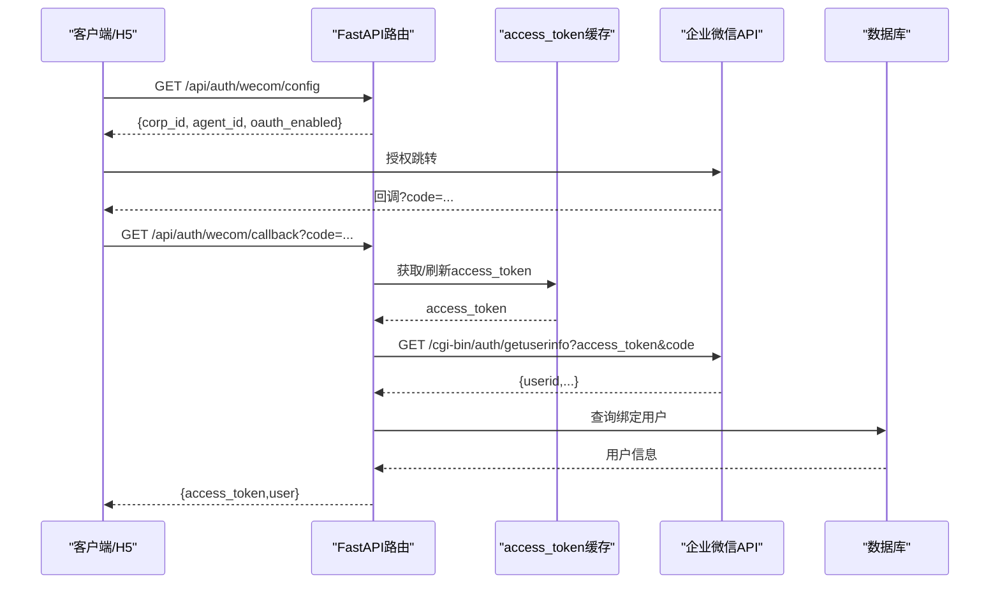
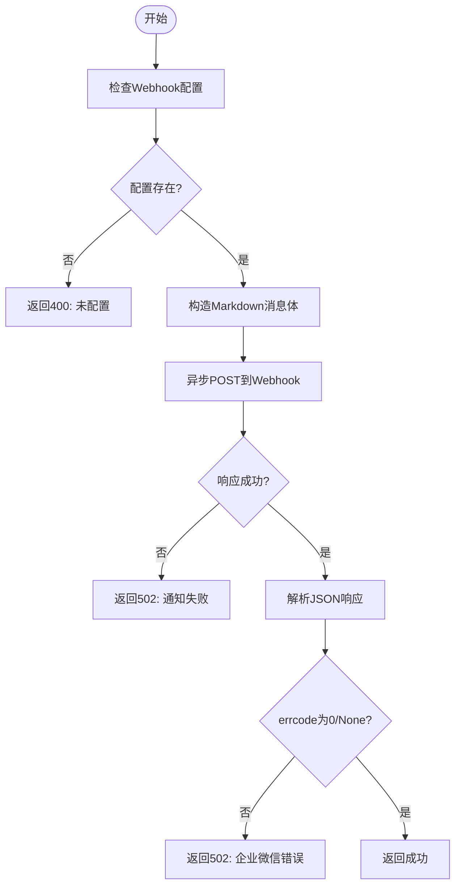
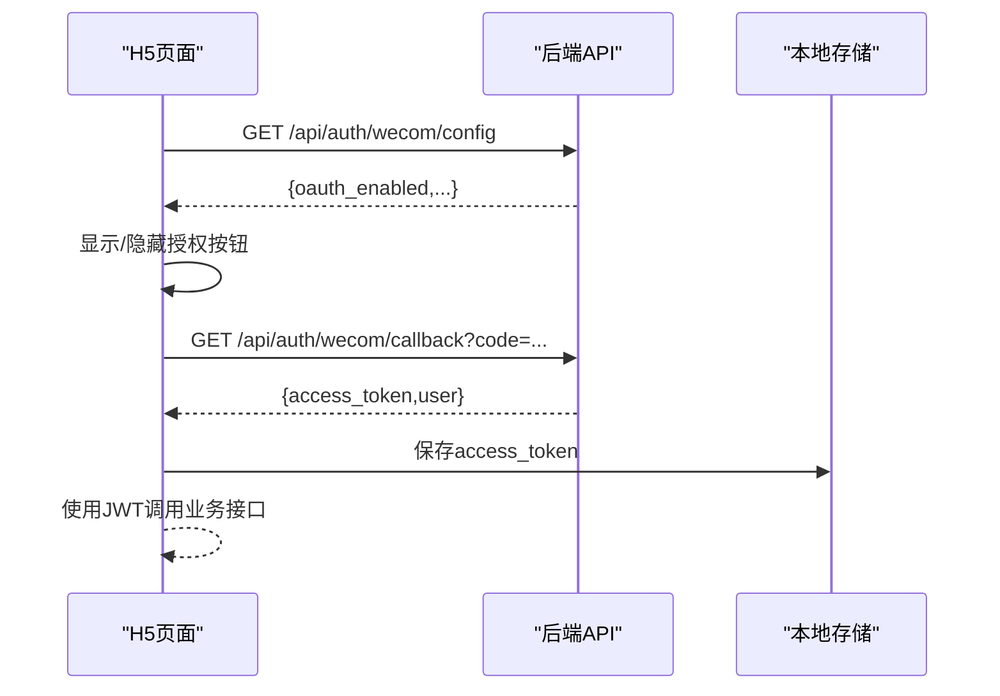
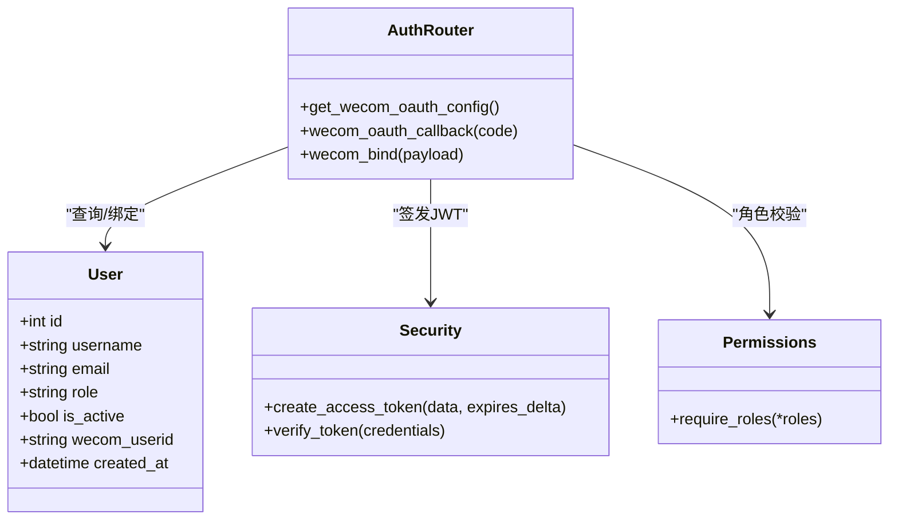
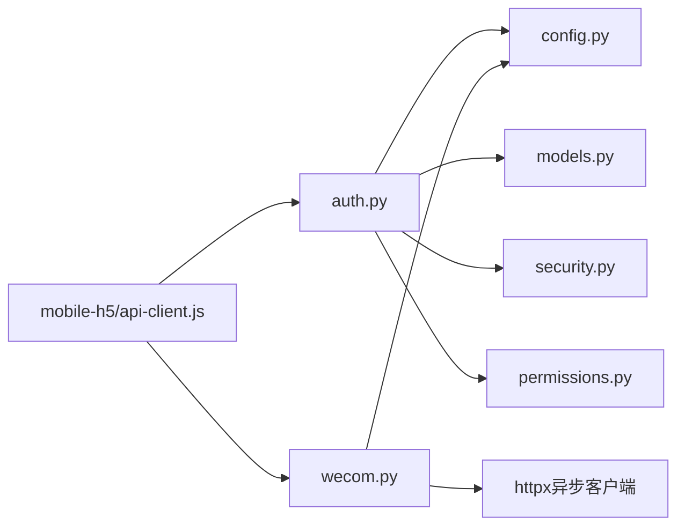

# 企业微信集成接口

<cite>
**本文引用的文件**
- [backend/app/api/endpoints/wecom.py](file://backend/app/api/endpoints/wecom.py)
- [backend/app/api/endpoints/auth.py](file://backend/app/api/endpoints/auth.py)
- [backend/app/schemas/schemas.py](file://backend/app/schemas/schemas.py)
- [backend/app/models/models.py](file://backend/app/models/models.py)
- [backend/app/core/config.py](file://backend/app/core/config.py)
- [backend/app/core/security.py](file://backend/app/core/security.py)
- [backend/app/core/permissions.py](file://backend/app/core/permissions.py)
- [backend/app/integrations/wecom/__init__.py](file://backend/app/integrations/wecom/__init__.py)
- [backend/app/tasks/wecom_tasks.py](file://backend/app/tasks/wecom_tasks.py)
- [mobile-h5/src/pages/wecom-redirect/index.html](file://mobile-h5/src/pages/wecom-redirect/index.html)
- [mobile-h5/src/utils/api-client.js](file://mobile-h5/src/utils/api-client.js)
</cite>

## 目录
1. [简介](#简介)
2. [项目结构](#项目结构)
3. [核心组件](#核心组件)
4. [架构总览](#架构总览)
5. [详细组件分析](#详细组件分析)
6. [依赖关系分析](#依赖关系分析)
7. [性能考虑](#性能考虑)
8. [故障排除指南](#故障排除指南)
9. [结论](#结论)
10. [附录](#附录)

## 简介
本文件为企业微信（WeCom）集成接口的专用API文档，覆盖以下能力：
- 企业微信OAuth认证流程与降级机制
- 用户信息绑定与鉴权
- 企业微信Webhook通知发送
- 移动H5端授权与回调处理
- 权限控制、错误处理、重试策略与安全验证最佳实践

本项目采用FastAPI后端与移动端H5前端协同，通过企业微信开放平台进行用户身份认证，并在后端维护用户角色与绑定关系，确保在企业微信未配置或异常时具备短期票据降级方案。

## 项目结构
后端采用分层架构，WeCom相关逻辑集中在认证端点、配置与模型层：
- 认证端点：提供OAuth配置查询、回调换码、用户绑定等接口
- 配置模块：集中管理企业微信与Webhook相关参数
- 数据模型：扩展用户表以支持企业微信用户标识
- 移动H5前端：提供授权入口、回调处理与提交流程

图表来源
- [backend/app/api/endpoints/auth.py:185-280](file://backend/app/api/endpoints/auth.py#L185-L280)
- [backend/app/api/endpoints/wecom.py:1-49](file://backend/app/api/endpoints/wecom.py#L1-L49)
- [backend/app/core/config.py:43-96](file://backend/app/core/config.py#L43-L96)
- [backend/app/models/models.py:8-27](file://backend/app/models/models.py#L8-L27)
- [backend/app/core/security.py:1-57](file://backend/app/core/security.py#L1-L57)
- [backend/app/core/permissions.py:1-29](file://backend/app/core/permissions.py#L1-L29)
- [backend/app/integrations/wecom/__init__.py:1-2](file://backend/app/integrations/wecom/__init__.py#L1-L2)
- [backend/app/tasks/wecom_tasks.py:1-3](file://backend/app/tasks/wecom_tasks.py#L1-L3)
- [mobile-h5/src/pages/wecom-redirect/index.html:1-251](file://mobile-h5/src/pages/wecom-redirect/index.html#L1-L251)
- [mobile-h5/src/utils/api-client.js:1-271](file://mobile-h5/src/utils/api-client.js#L1-L271)

章节来源
- [backend/app/api/endpoints/auth.py:185-280](file://backend/app/api/endpoints/auth.py#L185-L280)
- [backend/app/api/endpoints/wecom.py:1-49](file://backend/app/api/endpoints/wecom.py#L1-L49)
- [backend/app/core/config.py:43-96](file://backend/app/core/config.py#L43-L96)
- [backend/app/models/models.py:8-27](file://backend/app/models/models.py#L8-L27)
- [mobile-h5/src/pages/wecom-redirect/index.html:1-251](file://mobile-h5/src/pages/wecom-redirect/index.html#L1-L251)
- [mobile-h5/src/utils/api-client.js:1-271](file://mobile-h5/src/utils/api-client.js#L1-L271)

## 核心组件
- 企业微信OAuth配置查询：返回企业ID、应用ID与OAuth开关状态，供前端判断是否显示OAuth入口
- 企业微信OAuth回调换码：接收H5页面传递的code，调用企业微信接口换取userid，并在系统内查找绑定用户，签发JWT
- 企业微信用户绑定：管理员为当前用户绑定企业微信userid，避免重复绑定
- 企业微信Webhook通知：向配置的Webhook地址发送Markdown格式通知，用于系统告警或日志提醒
- 配置与模型：集中管理企业微信参数与用户模型扩展字段
- 安全与权限：基于JWT的令牌签发与校验，以及角色权限控制

章节来源
- [backend/app/api/endpoints/auth.py:185-280](file://backend/app/api/endpoints/auth.py#L185-L280)
- [backend/app/api/endpoints/wecom.py:1-49](file://backend/app/api/endpoints/wecom.py#L1-L49)
- [backend/app/schemas/schemas.py:59-68](file://backend/app/schemas/schemas.py#L59-L68)
- [backend/app/core/config.py:43-96](file://backend/app/core/config.py#L43-L96)
- [backend/app/models/models.py:8-27](file://backend/app/models/models.py#L8-L27)
- [backend/app/core/security.py:28-57](file://backend/app/core/security.py#L28-L57)
- [backend/app/core/permissions.py:9-29](file://backend/app/core/permissions.py#L9-L29)

## 架构总览
下图展示企业微信OAuth与Webhook通知的端到端交互：

图表来源
- [backend/app/api/endpoints/auth.py:185-280](file://backend/app/api/endpoints/auth.py#L185-L280)
- [backend/app/api/endpoints/wecom.py:15-49](file://backend/app/api/endpoints/wecom.py#L15-L49)
- [backend/app/core/config.py:95-96](file://backend/app/core/config.py#L95-L96)

## 详细组件分析

### 企业微信OAuth认证流程
- OAuth配置查询：返回企业ID、应用ID与OAuth开关状态，前端据此决定是否显示OAuth入口
- 回调换码：接收code，调用企业微信接口换取userid，校验有效性后在系统内查找绑定用户，签发JWT
- 用户绑定：管理员为当前用户绑定企业微信userid，避免重复绑定

图表来源
- [backend/app/api/endpoints/auth.py:185-280](file://backend/app/api/endpoints/auth.py#L185-L280)
- [backend/app/core/config.py:43-48](file://backend/app/core/config.py#L43-L48)

章节来源
- [backend/app/api/endpoints/auth.py:185-280](file://backend/app/api/endpoints/auth.py#L185-L280)
- [backend/app/schemas/schemas.py:59-68](file://backend/app/schemas/schemas.py#L59-L68)
- [backend/app/core/config.py:43-48](file://backend/app/core/config.py#L43-L48)

### 企业微信Webhook通知
- 接口：/api/wecom/notify/test
- 功能：向配置的Webhook地址发送Markdown通知，包含用户ID、角色与内容
- 错误处理：配置缺失、请求失败、企业微信返回错误码时统一抛出HTTP 502

图表来源
- [backend/app/api/endpoints/wecom.py:15-49](file://backend/app/api/endpoints/wecom.py#L15-L49)
- [backend/app/core/config.py:95-96](file://backend/app/core/config.py#L95-L96)

章节来源
- [backend/app/api/endpoints/wecom.py:1-49](file://backend/app/api/endpoints/wecom.py#L1-L49)
- [backend/app/core/config.py:95-96](file://backend/app/core/config.py#L95-L96)

### 移动H5端授权与回调
- 授权入口：根据后端OAuth配置动态显示/隐藏企业微信授权按钮
- 回调处理：接收code并调用后端回调接口，成功后保存JWT至本地存储
- 提交流程：通过已授权的JWT访问业务接口（如内容收录）

图表来源
- [mobile-h5/src/pages/wecom-redirect/index.html:1-251](file://mobile-h5/src/pages/wecom-redirect/index.html#L1-L251)
- [mobile-h5/src/utils/api-client.js:107-170](file://mobile-h5/src/utils/api-client.js#L107-L170)
- [backend/app/api/endpoints/auth.py:185-280](file://backend/app/api/endpoints/auth.py#L185-L280)

章节来源
- [mobile-h5/src/pages/wecom-redirect/index.html:1-251](file://mobile-h5/src/pages/wecom-redirect/index.html#L1-L251)
- [mobile-h5/src/utils/api-client.js:107-170](file://mobile-h5/src/utils/api-client.js#L107-L170)
- [backend/app/api/endpoints/auth.py:185-280](file://backend/app/api/endpoints/auth.py#L185-L280)

### 数据模型与权限控制
- 用户模型扩展：新增企业微信用户标识字段，唯一索引防止重复绑定
- 权限控制：基于角色的依赖检查，限制敏感操作（如测试通知）
- 安全机制：JWT签发与校验，密码哈希与校验

图表来源
- [backend/app/models/models.py:8-27](file://backend/app/models/models.py#L8-L27)
- [backend/app/api/endpoints/auth.py:185-280](file://backend/app/api/endpoints/auth.py#L185-L280)
- [backend/app/core/security.py:28-57](file://backend/app/core/security.py#L28-L57)
- [backend/app/core/permissions.py:9-29](file://backend/app/core/permissions.py#L9-L29)

章节来源
- [backend/app/models/models.py:8-27](file://backend/app/models/models.py#L8-L27)
- [backend/app/core/permissions.py:9-29](file://backend/app/core/permissions.py#L9-L29)
- [backend/app/core/security.py:28-57](file://backend/app/core/security.py#L28-L57)

## 依赖关系分析
- 认证端点依赖配置模块读取企业微信参数，依赖数据库模型进行用户绑定查询，依赖安全模块签发JWT
- Webhook通知端点依赖配置模块读取Webhook地址，使用HTTP客户端异步发送
- 前端H5依赖后端OAuth配置与回调接口，内置重试与超时控制

图表来源
- [backend/app/api/endpoints/auth.py:185-280](file://backend/app/api/endpoints/auth.py#L185-L280)
- [backend/app/api/endpoints/wecom.py:1-49](file://backend/app/api/endpoints/wecom.py#L1-L49)
- [backend/app/core/config.py:43-96](file://backend/app/core/config.py#L43-L96)
- [backend/app/models/models.py:8-27](file://backend/app/models/models.py#L8-L27)
- [backend/app/core/security.py:28-57](file://backend/app/core/security.py#L28-L57)
- [backend/app/core/permissions.py:9-29](file://backend/app/core/permissions.py#L9-L29)
- [mobile-h5/src/utils/api-client.js:1-271](file://mobile-h5/src/utils/api-client.js#L1-L271)

章节来源
- [backend/app/api/endpoints/auth.py:185-280](file://backend/app/api/endpoints/auth.py#L185-L280)
- [backend/app/api/endpoints/wecom.py:1-49](file://backend/app/api/endpoints/wecom.py#L1-L49)
- [mobile-h5/src/utils/api-client.js:1-271](file://mobile-h5/src/utils/api-client.js#L1-L271)

## 性能考虑
- 企业微信access_token缓存：在内存中缓存access_token并设置过期时间，减少频繁请求
- 异步HTTP客户端：Webhook通知使用异步客户端，降低阻塞风险
- 前端重试与超时：H5端对可重试状态码进行指数退避重试，避免瞬时错误导致失败
- 数据库索引：用户表的weCom_userid建立唯一索引，加速绑定查询

章节来源
- [backend/app/api/endpoints/auth.py:44-73](file://backend/app/api/endpoints/auth.py#L44-L73)
- [backend/app/api/endpoints/wecom.py:37-43](file://backend/app/api/endpoints/wecom.py#L37-L43)
- [mobile-h5/src/utils/api-client.js:215-267](file://mobile-h5/src/utils/api-client.js#L215-L267)
- [backend/app/models/models.py:18-18](file://backend/app/models/models.py#L18-L18)

## 故障排除指南
- OAuth未配置：当企业微信参数未配置时，回调接口返回服务不可用，前端应提示降级使用短期票据
- code无效或过期：回调接口对errcode进行校验，返回未授权错误，需重新发起授权
- Webhook未配置：测试通知接口返回400，需在配置中填写Webhook地址
- Webhook调用失败：接口返回502，检查企业微信返回的错误码与网络连通性
- 前端401：本地存储的JWT失效或过期，需重新获取授权票据或更新Token
- 可重试状态：408、429与5xx会触发前端重试，建议在网络不稳定环境下适当增加重试次数与超时

章节来源
- [backend/app/api/endpoints/auth.py:209-254](file://backend/app/api/endpoints/auth.py#L209-L254)
- [backend/app/api/endpoints/wecom.py:21-48](file://backend/app/api/endpoints/wecom.py#L21-L48)
- [mobile-h5/src/utils/api-client.js:232-267](file://mobile-h5/src/utils/api-client.js#L232-L267)

## 结论
本项目提供了完整的企业微信集成方案：OAuth认证与降级、用户绑定、Webhook通知与前端授权流程。通过配置化参数与安全机制保障系统稳定性与安全性，配合前端的重试与超时策略，能够在复杂网络环境中可靠运行。建议在生产环境完善监控与日志，持续优化access_token缓存与重试策略。

## 附录

### API定义概览
- 获取OAuth配置
  - 方法：GET
  - 路径：/api/auth/wecom/config
  - 返回：企业ID、应用ID、OAuth开关
- OAuth回调换码
  - 方法：GET
  - 路径：/api/auth/wecom/callback
  - 查询参数：code
  - 返回：JWT与用户信息
- 绑定企业微信用户
  - 方法：POST
  - 路径：/api/auth/wecom/bind
  - 请求体：企业微信用户ID
  - 返回：绑定结果
- 测试通知（Webhook）
  - 方法：POST
  - 路径：/api/wecom/notify/test
  - 请求体：通知内容
  - 返回：企业微信响应

章节来源
- [backend/app/api/endpoints/auth.py:185-280](file://backend/app/api/endpoints/auth.py#L185-L280)
- [backend/app/api/endpoints/wecom.py:15-49](file://backend/app/api/endpoints/wecom.py#L15-L49)
- [backend/app/schemas/schemas.py:66-68](file://backend/app/schemas/schemas.py#L66-L68)