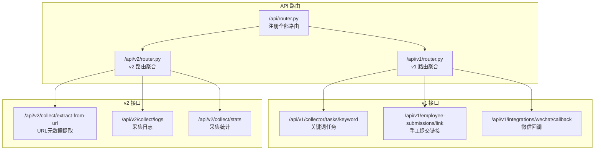
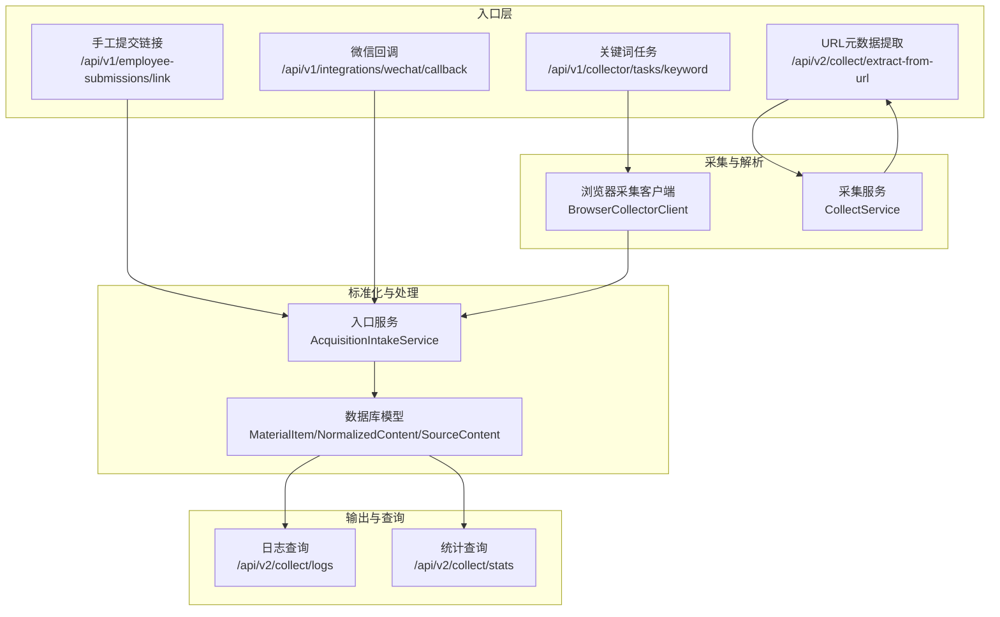
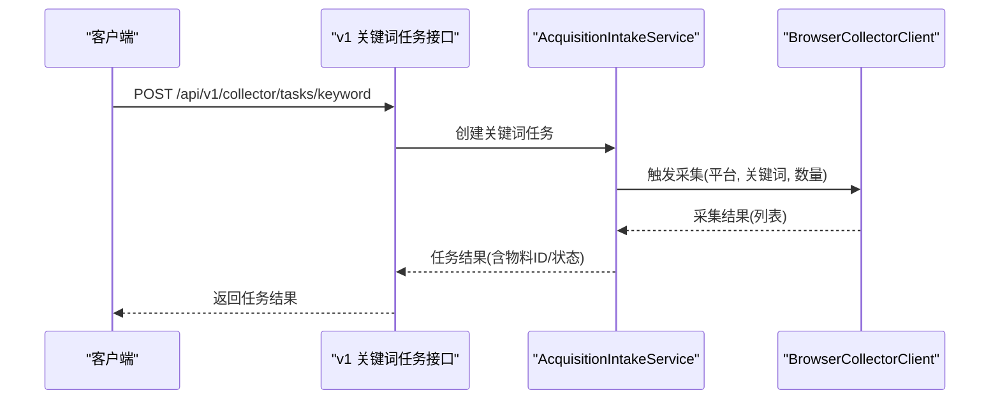
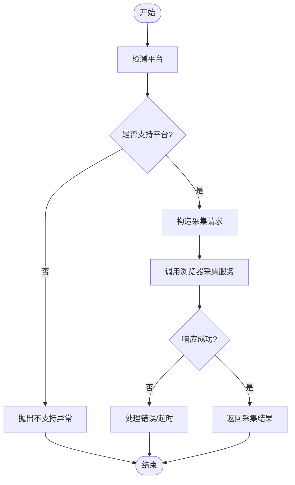
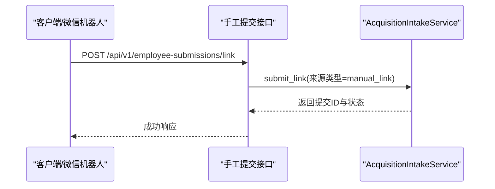
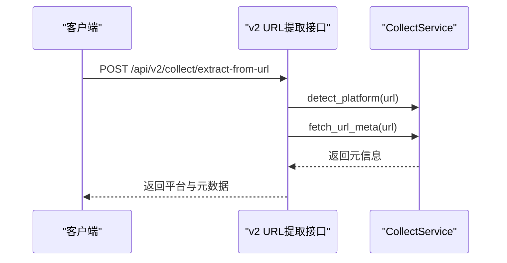
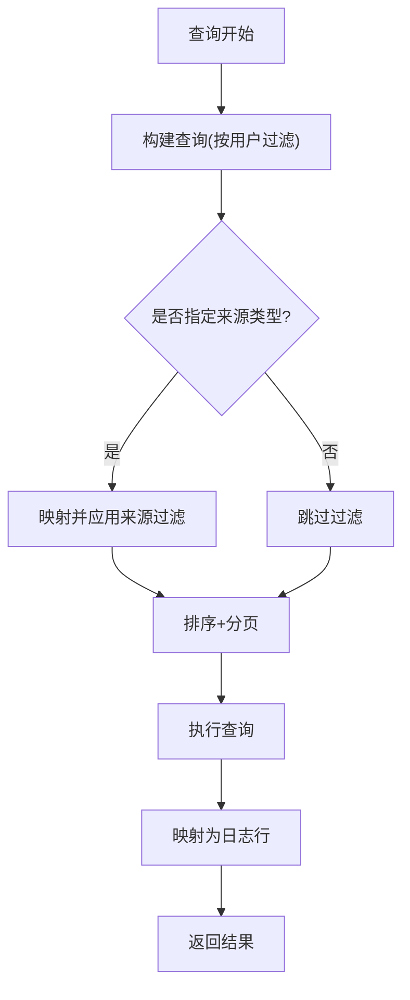
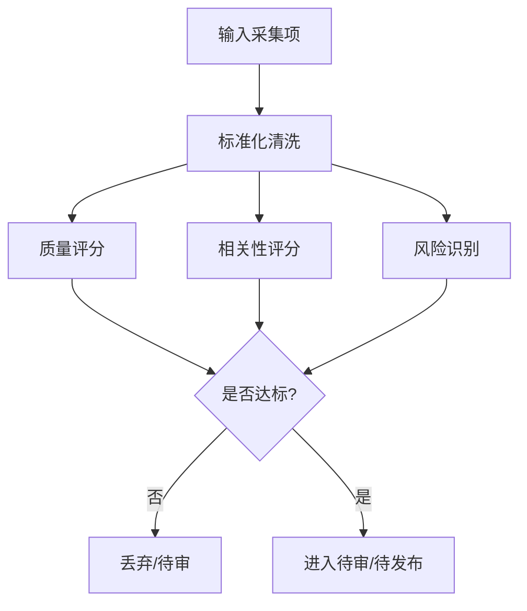
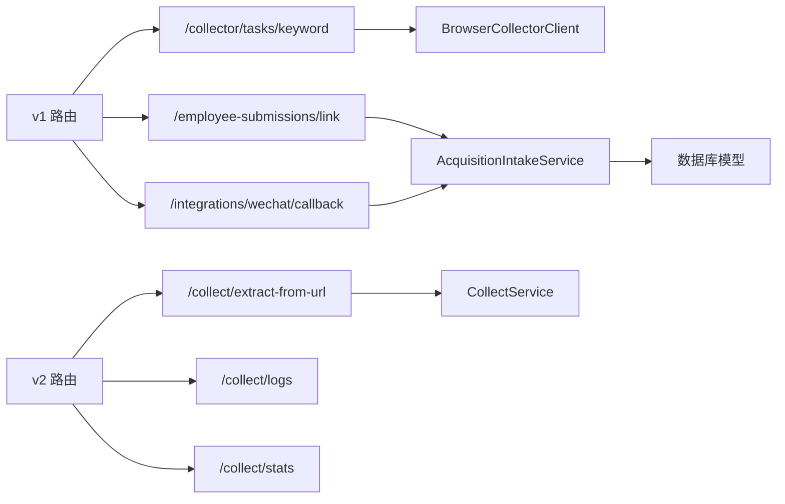

# 内容采集接口

<cite>
**本文引用的文件**
- [backend/app/api/endpoints/collect.py](file://backend/app/api/endpoints/collect.py)
- [backend/app/api/v1/endpoints/collect.py](file://backend/app/api/v1/endpoints/collect.py)
- [backend/app/api/v2/endpoints/collect.py](file://backend/app/api/v2/endpoints/collect.py)
- [backend/app/api/v1/endpoints/submissions.py](file://backend/app/api/v1/endpoints/submissions.py)
- [backend/app/api/router.py](file://backend/app/api/router.py)
- [backend/app/api/v1/router.py](file://backend/app/api/v1/router.py)
- [backend/app/api/v2/router.py](file://backend/app/api/v2/router.py)
- [backend/app/domains/acquisition/collect_service.py](file://backend/app/domains/acquisition/collect_service.py)
- [backend/app/services/collect_service.py](file://backend/app/services/collect_service.py)
- [backend/app/services/collector/intake_service.py](file://backend/app/services/collector/intake_service.py)
- [backend/app/services/collector/material_pipeline_service.py](file://backend/app/services/collector/material_pipeline_service.py)
- [backend/app/services/collector/browser_collector_client.py](file://backend/app/services/collector/browser_collector_client.py)
- [backend/app/models/models.py](file://backend/app/models/models.py)
- [backend/app/rules/local/douyin.yaml](file://backend/app/rules/local/douyin.yaml)
- [backend/app/rules/local/xiaohongshu.yaml](file://backend/app/rules/local/xiaohongshu.yaml)
</cite>

## 目录
1. [简介](#简介)
2. [项目结构](#项目结构)
3. [核心组件](#核心组件)
4. [架构总览](#架构总览)
5. [详细组件分析](#详细组件分析)
6. [依赖分析](#依赖分析)
7. [性能考虑](#性能考虑)
8. [故障排查指南](#故障排查指南)
9. [结论](#结论)
10. [附录](#附录)

## 简介
本文件为“智获客”内容采集接口的权威API文档，覆盖关键词搜索、浏览器插件采集、手工内容提交三大入口，并提供采集任务创建、状态查询、结果获取的完整流程说明。同时，文档阐述内容解析、标准化处理、质量评估、合规审查与AI分析等能力，以及采集规则配置、平台适配、数据格式转换、批量操作、进度监控与错误处理的最佳实践。

## 项目结构
后端采用FastAPI分版本路由组织，采集相关接口主要分布在v1与v2两个版本：
- v1：关键词采集任务、员工手工提交链接、微信机器人回调等
- v2：URL元数据提取、日志与统计查询、旧采集入口迁移指引

图表来源
- [backend/app/api/router.py:1-35](file://backend/app/api/router.py#L1-L35)
- [backend/app/api/v1/router.py:1-22](file://backend/app/api/v1/router.py#L1-L22)
- [backend/app/api/v2/router.py:1-15](file://backend/app/api/v2/router.py#L1-L15)

章节来源
- [backend/app/api/router.py:1-35](file://backend/app/api/router.py#L1-L35)
- [backend/app/api/v1/router.py:1-22](file://backend/app/api/v1/router.py#L1-L22)
- [backend/app/api/v2/router.py:1-15](file://backend/app/api/v2/router.py#L1-L15)

## 核心组件
- 采集服务 CollectService：负责平台识别、URL元数据抓取、自动分类、AI分析等
- 入口服务 AcquisitionIntakeService：负责采集数据的标准化、去重、质量与相关性评分、合规审查、状态决策与物料落库
- 浏览器采集客户端 BrowserCollectorClient：封装浏览器采集服务调用
- 规则系统：本地规则文件用于平台规则扩展与同步

章节来源
- [backend/app/domains/acquisition/collect_service.py:1-285](file://backend/app/domains/acquisition/collect_service.py#L1-L285)
- [backend/app/services/collector/material_pipeline_service.py:1-800](file://backend/app/services/collector/material_pipeline_service.py#L1-L800)
- [backend/app/services/collector/browser_collector_client.py:1-39](file://backend/app/services/collector/browser_collector_client.py#L1-L39)
- [backend/app/services/collect_service.py:1-10](file://backend/app/services/collect_service.py#L1-L10)
- [backend/app/services/collector/intake_service.py:1-3](file://backend/app/services/collector/intake_service.py#L1-L3)
- [backend/app/rules/local/douyin.yaml:1-4](file://backend/app/rules/local/douyin.yaml#L1-L4)
- [backend/app/rules/local/xiaohongshu.yaml:1-4](file://backend/app/rules/local/xiaohongshu.yaml#L1-L4)

## 架构总览
采集链路从“入口”到“标准化/去重/合规/状态决策”，再到“物料落库/知识库构建”，最终支持AI分析与内容资产沉淀。

图表来源
- [backend/app/api/v1/endpoints/collect.py:1-34](file://backend/app/api/v1/endpoints/collect.py#L1-L34)
- [backend/app/api/v1/endpoints/submissions.py:1-88](file://backend/app/api/v1/endpoints/submissions.py#L1-L88)
- [backend/app/api/v2/endpoints/collect.py:1-302](file://backend/app/api/v2/endpoints/collect.py#L1-L302)
- [backend/app/services/collector/browser_collector_client.py:1-39](file://backend/app/services/collector/browser_collector_client.py#L1-L39)
- [backend/app/domains/acquisition/collect_service.py:1-285](file://backend/app/domains/acquisition/collect_service.py#L1-L285)
- [backend/app/services/collector/material_pipeline_service.py:1-800](file://backend/app/services/collector/material_pipeline_service.py#L1-L800)
- [backend/app/models/models.py:1-200](file://backend/app/models/models.py#L1-L200)

## 详细组件分析

### 关键词搜索采集
- 接口：POST /api/v1/collector/tasks/keyword
- 请求体字段
  - platform：字符串，平台标识，长度限制
  - keyword：字符串，关键词
  - max_items：整数，默认20，范围[1,100]
- 返回：创建的任务与采集结果概要
- 处理流程
  - 校验参数
  - 调用采集入口服务创建关键词任务
  - 通过浏览器采集客户端触发采集
  - 标准化、去重、质量与相关性评分、合规审查、状态决策
  - 落库为物料项，支持后续AI分析与知识库构建

图表来源
- [backend/app/api/v1/endpoints/collect.py:1-34](file://backend/app/api/v1/endpoints/collect.py#L1-L34)
- [backend/app/services/collector/browser_collector_client.py:1-39](file://backend/app/services/collector/browser_collector_client.py#L1-L39)
- [backend/app/services/collector/material_pipeline_service.py:1-800](file://backend/app/services/collector/material_pipeline_service.py#L1-L800)

章节来源
- [backend/app/api/v1/endpoints/collect.py:1-34](file://backend/app/api/v1/endpoints/collect.py#L1-L34)
- [backend/app/services/collector/browser_collector_client.py:1-39](file://backend/app/services/collector/browser_collector_client.py#L1-L39)
- [backend/app/services/collector/material_pipeline_service.py:1-800](file://backend/app/services/collector/material_pipeline_service.py#L1-L800)

### 浏览器插件采集
- 适用场景：通过浏览器采集客户端统一调度各平台采集任务
- 关键方法
  - collect_keyword：按关键词采集
  - collect_single_link：按单个链接采集（需识别平台）
- 参数
  - platform：平台标识
  - keyword：关键词或链接
  - max_items：最大条目数
  - need_detail/need_comments/dedup/timeout_sec：采集细节控制
- 错误处理
  - 对于不支持的平台抛出异常
  - 采集超时/失败由客户端统一处理

图表来源
- [backend/app/services/collector/browser_collector_client.py:1-39](file://backend/app/services/collector/browser_collector_client.py#L1-L39)
- [backend/app/domains/acquisition/collect_service.py:1-285](file://backend/app/domains/acquisition/collect_service.py#L1-L285)

章节来源
- [backend/app/services/collector/browser_collector_client.py:1-39](file://backend/app/services/collector/browser_collector_client.py#L1-L39)
- [backend/app/domains/acquisition/collect_service.py:1-285](file://backend/app/domains/acquisition/collect_service.py#L1-L285)

### 手工内容提交
- 接口：POST /api/v1/employee-submissions/link
- 请求体字段
  - url：字符串，链接
  - note：可选，备注
- 返回
  - submission_id：提交ID
  - status：提交状态
- 微信回调接口：POST /api/v1/integrations/wechat/callback
  - 从消息中提取URL，批量提交采集
  - 返回汇总统计

图表来源
- [backend/app/api/v1/endpoints/submissions.py:1-88](file://backend/app/api/v1/endpoints/submissions.py#L1-L88)
- [backend/app/services/collector/material_pipeline_service.py:1-800](file://backend/app/services/collector/material_pipeline_service.py#L1-L800)

章节来源
- [backend/app/api/v1/endpoints/submissions.py:1-88](file://backend/app/api/v1/endpoints/submissions.py#L1-L88)
- [backend/app/services/collector/material_pipeline_service.py:1-800](file://backend/app/services/collector/material_pipeline_service.py#L1-L800)

### URL元数据提取（v2）
- 接口：POST /api/v2/collect/extract-from-url
- 输入
  - url：字符串，必须以http/https开头
- 输出
  - platform/platform_label：识别的平台与中文标签
  - source_url/title/content_preview/author_name：页面元信息
  - metrics/tags/comments_preview：空占位
  - fetch_success/message：提取结果与提示
- 平台识别与元数据抓取由采集服务完成

图表来源
- [backend/app/api/v2/endpoints/collect.py:1-302](file://backend/app/api/v2/endpoints/collect.py#L1-L302)
- [backend/app/domains/acquisition/collect_service.py:1-285](file://backend/app/domains/acquisition/collect_service.py#L1-L285)

章节来源
- [backend/app/api/v2/endpoints/collect.py:1-302](file://backend/app/api/v2/endpoints/collect.py#L1-L302)
- [backend/app/domains/acquisition/collect_service.py:1-285](file://backend/app/domains/acquisition/collect_service.py#L1-L285)

### 采集日志与统计（v2）
- 日志查询：GET /api/v2/collect/logs
  - 支持分页、按来源类型过滤
  - 返回字段：material_id、platform、source_channel、title、source_url、status、risk_status、filter_reason、created_at
- 统计查询：GET /api/v2/collect/stats
  - 返回总数、重复数、按平台与状态的分布

图表来源
- [backend/app/api/v2/endpoints/collect.py:245-264](file://backend/app/api/v2/endpoints/collect.py#L245-L264)
- [backend/app/api/v2/endpoints/collect.py:267-297](file://backend/app/api/v2/endpoints/collect.py#L267-L297)

章节来源
- [backend/app/api/v2/endpoints/collect.py:245-297](file://backend/app/api/v2/endpoints/collect.py#L245-L297)

### 内容解析、标准化处理、质量评估
- 解析与识别
  - 平台识别：基于正则匹配
  - 元数据提取：OG/Twitter/Author/Title等
- 标准化
  - 清洗标题/正文、去除噪声行、HTML清理
  - 字段映射：source_id/source_url/title/author_name/content_text/publish_time/like/comment/favorite/share等
- 质量与相关性评分
  - 质量分：标题/正文长度/封面/时间/作者等维度累计
  - 相关性分：关键词命中、目标术语命中
  - 热度等级：基于互动指标计算
- 合规审查与改写建议
  - 风险词检测与替换
  - 二次合规检查与阻断阈值
- 状态决策
  - 基于风险状态/解析状态/质量/相关性/线索信号进行状态流转

图表来源
- [backend/app/services/collector/material_pipeline_service.py:1-800](file://backend/app/services/collector/material_pipeline_service.py#L1-L800)

章节来源
- [backend/app/services/collector/material_pipeline_service.py:1-800](file://backend/app/services/collector/material_pipeline_service.py#L1-L800)

### 采集规则配置、平台适配、数据格式转换
- 平台识别规则：内置平台正则集合
- 平台标签：中文标签映射
- 数据格式转换
  - URL元数据：标题/描述/作者/站点名清洗与截断
  - Spider_XHS导入：字段映射与截图/视频封面推断
  - 手工提交：统一为标准化结构
- 规则文件：本地规则目录提供平台规则占位，便于扩展与同步

章节来源
- [backend/app/domains/acquisition/collect_service.py:1-285](file://backend/app/domains/acquisition/collect_service.py#L1-L285)
- [backend/app/api/v2/endpoints/collect.py:1-302](file://backend/app/api/v2/endpoints/collect.py#L1-L302)
- [backend/app/rules/local/douyin.yaml:1-4](file://backend/app/rules/local/douyin.yaml#L1-L4)
- [backend/app/rules/local/xiaohongshu.yaml:1-4](file://backend/app/rules/local/xiaohongshu.yaml#L1-L4)

### 批量操作、进度监控、错误处理最佳实践
- 批量操作
  - 微信回调接口支持批量提取URL并逐条提交
  - 返回明细与汇总统计，便于前端展示与重试
- 进度监控
  - 日志接口支持按来源类型过滤与分页
  - 统计接口提供总量与分布
- 错误处理
  - 旧采集入口统一返回410并指引新入口
  - 参数校验失败返回400
  - 采集服务异常统一包装为502

章节来源
- [backend/app/api/endpoints/collect.py:1-20](file://backend/app/api/endpoints/collect.py#L1-L20)
- [backend/app/api/v1/endpoints/submissions.py:51-88](file://backend/app/api/v1/endpoints/submissions.py#L51-L88)
- [backend/app/api/v2/endpoints/collect.py:172-197](file://backend/app/api/v2/endpoints/collect.py#L172-L197)

## 依赖分析
- 版本路由依赖
  - v1 路由聚合 /api/v1 包含采集、提交、集成等子路由
  - v2 路由聚合 /api/v2 包含采集与物料路由
- 服务依赖
  - v1 关键词任务依赖浏览器采集客户端
  - v2 URL提取依赖采集服务
  - 所有采集入口最终汇聚到入口服务进行标准化与落库

图表来源
- [backend/app/api/v1/router.py:1-22](file://backend/app/api/v1/router.py#L1-L22)
- [backend/app/api/v2/router.py:1-15](file://backend/app/api/v2/router.py#L1-L15)
- [backend/app/services/collector/browser_collector_client.py:1-39](file://backend/app/services/collector/browser_collector_client.py#L1-L39)
- [backend/app/domains/acquisition/collect_service.py:1-285](file://backend/app/domains/acquisition/collect_service.py#L1-L285)
- [backend/app/services/collector/material_pipeline_service.py:1-800](file://backend/app/services/collector/material_pipeline_service.py#L1-L800)

章节来源
- [backend/app/api/v1/router.py:1-22](file://backend/app/api/v1/router.py#L1-L22)
- [backend/app/api/v2/router.py:1-15](file://backend/app/api/v2/router.py#L1-L15)

## 性能考虑
- 异步元数据抓取：避免阻塞主线程
- 限流与超时：浏览器采集客户端设置超时与重试策略
- 分页与过滤：日志与统计接口支持分页与来源过滤，降低查询开销
- 去重策略：基于source_id与内容哈希，减少重复入库

## 故障排查指南
- 410 已停用接口
  - ingest-page、ingest-spider-xhs、ingest-spider-xhs/batch 已停用，需迁移至新入口
- 400 参数错误
  - URL必须以http/https开头
- 502 采集服务失败
  - 关键词任务与手工提交均可能因采集服务异常返回
- 平台不支持
  - 单链接采集需识别平台，否则抛出异常

章节来源
- [backend/app/api/v2/endpoints/collect.py:200-242](file://backend/app/api/v2/endpoints/collect.py#L200-L242)
- [backend/app/api/v2/endpoints/collect.py:172-179](file://backend/app/api/v2/endpoints/collect.py#L172-L179)
- [backend/app/api/v1/endpoints/collect.py:24-33](file://backend/app/api/v1/endpoints/collect.py#L24-L33)
- [backend/app/services/collector/browser_collector_client.py:35-39](file://backend/app/services/collector/browser_collector_client.py#L35-L39)

## 结论
本文档梳理了“智获客”的采集入口、处理流程与输出能力，明确了关键词搜索、浏览器插件采集、手工提交的接口规范与最佳实践。通过标准化、质量评估、合规审查与AI分析，实现从原始内容到可用物料的高效转化，并提供日志与统计支撑运营与治理。

## 附录
- 数据模型要点
  - MaterialItem/NormalizedContent/SourceContent：采集物料落库的核心实体
  - ContentAsset：内容资产模型，支持标签、热度、是否爆款等属性
- 平台与类别
  - 平台识别与标签映射由采集服务维护
  - 类别关键词用于自动分类

章节来源
- [backend/app/models/models.py:1-200](file://backend/app/models/models.py#L1-L200)
- [backend/app/domains/acquisition/collect_service.py:1-285](file://backend/app/domains/acquisition/collect_service.py#L1-L285)