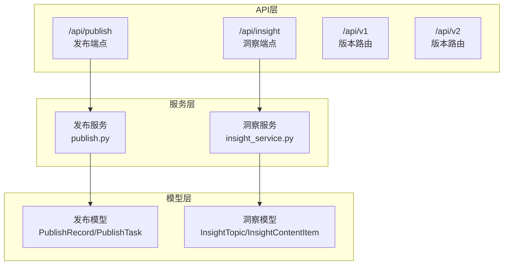
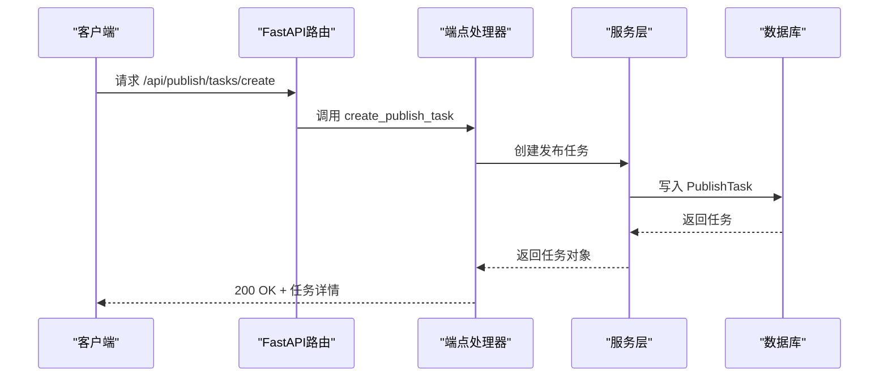
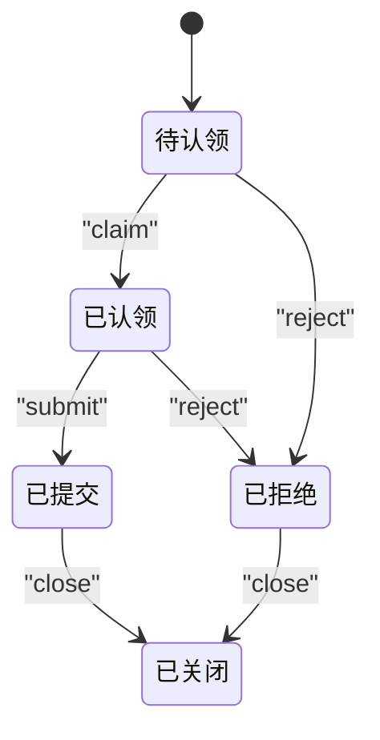
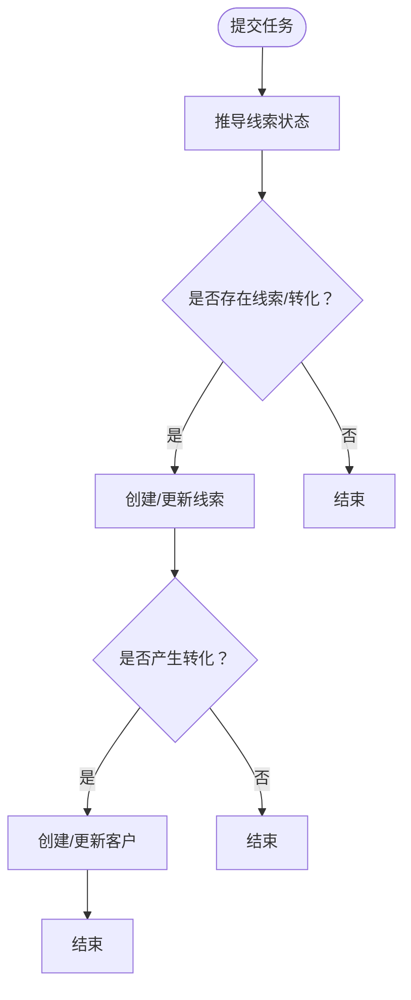
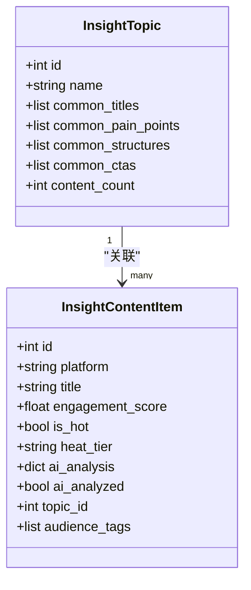
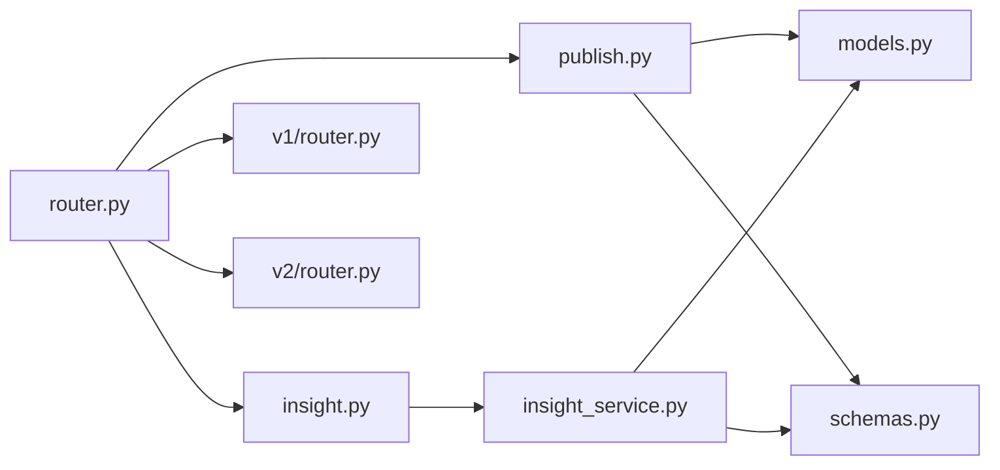

# 发布与洞察接口

<cite>
**本文档引用的文件**
- [backend/app/api/endpoints/publish.py](file://backend/app/api/endpoints/publish.py)
- [backend/app/api/endpoints/insight.py](file://backend/app/api/endpoints/insight.py)
- [backend/app/models/models.py](file://backend/app/models/models.py)
- [backend/app/schemas/schemas.py](file://backend/app/schemas/schemas.py)
- [backend/app/services/insight_service.py](file://backend/app/services/insight_service.py)
- [backend/app/api/router.py](file://backend/app/api/router.py)
- [backend/app/api/v1/router.py](file://backend/app/api/v1/router.py)
- [backend/app/api/v2/router.py](file://backend/app/api/v2/router.py)
</cite>

## 目录
1. [简介](#简介)
2. [项目结构](#项目结构)
3. [核心组件](#核心组件)
4. [架构总览](#架构总览)
5. [详细组件分析](#详细组件分析)
6. [依赖分析](#依赖分析)
7. [性能考虑](#性能考虑)
8. [故障排查指南](#故障排查指南)
9. [结论](#结论)
10. [附录](#附录)

## 简介
本文件面向“智获客”的发布与洞察接口，系统性梳理内容发布管理、效果追踪、数据分析与洞察应用的完整接口规范。重点覆盖：
- 发布任务生命周期：创建、认领、分配、提交、拒绝、关闭与导出
- 发布记录与指标：创建、查询、更新与导出
- 效果追踪与线索转化：任务到线索再到客户的闭环追踪
- 内容洞察：主题管理、内容导入/批量导入、AI分析、检索召回、统计
- 实时监控与历史数据：任务状态统计、内容热力分层、作者画像与主题知识库
- 自定义报表：CSV导出与统计聚合

## 项目结构
后端采用FastAPI + SQLAlchemy架构，路由按功能模块划分，发布与洞察分别在独立的端点模块中实现，并通过统一路由器注册。

图表来源
- [backend/app/api/endpoints/publish.py:27-606](file://backend/app/api/endpoints/publish.py#L27-L606)
- [backend/app/api/endpoints/insight.py:50-410](file://backend/app/api/endpoints/insight.py#L50-L410)
- [backend/app/api/router.py:16-35](file://backend/app/api/router.py#L16-L35)
- [backend/app/api/v1/router.py:9-22](file://backend/app/api/v1/router.py#L9-L22)
- [backend/app/api/v2/router.py:6-15](file://backend/app/api/v2/router.py#L6-L15)

章节来源
- [backend/app/api/router.py:16-35](file://backend/app/api/router.py#L16-L35)

## 核心组件
- 发布端点模块：提供发布任务与记录的创建、查询、更新、状态流转与导出能力
- 洞察端点模块：提供主题管理、内容导入/批量导入、AI分析、检索召回与统计
- 模型与Schema：定义发布与洞察的数据结构、枚举类型与校验规则
- 服务层：封装业务逻辑，如发布任务状态机、洞察内容入库与AI分析

章节来源
- [backend/app/api/endpoints/publish.py:125-606](file://backend/app/api/endpoints/publish.py#L125-L606)
- [backend/app/api/endpoints/insight.py:65-410](file://backend/app/api/endpoints/insight.py#L65-L410)
- [backend/app/models/models.py:259-350](file://backend/app/models/models.py#L259-L350)
- [backend/app/schemas/schemas.py:285-416](file://backend/app/schemas/schemas.py#L285-L416)

## 架构总览
发布与洞察接口遵循“端点-服务-模型”三层结构，统一通过FastAPI路由注册，支持版本化路由（v1/v2）扩展。

图表来源
- [backend/app/api/endpoints/publish.py:149-183](file://backend/app/api/endpoints/publish.py#L149-L183)
- [backend/app/api/router.py:16-35](file://backend/app/api/router.py#L16-L35)

## 详细组件分析

### 发布任务与记录接口
- 任务生命周期
  - 创建：创建任务并记录反馈
  - 认领：仅待认领或被拒的任务可认领
  - 分配：仅任务创建者可分配，已提交/关闭任务不可再分配
  - 提交：写回指标并生成/更新发布记录
  - 拒绝：标记拒绝原因
  - 关闭：结束生命周期并记录关闭原因
  - 导出：管理员/运营可导出CSV
- 记录管理
  - 创建：基于改写内容创建发布记录
  - 列表：按平台过滤、分页查询
  - 查询：按ID查询
  - 更新：更新播放、点赞、评论等指标
- 状态统计：按用户作用域统计任务状态分布

图表来源
- [backend/app/api/endpoints/publish.py:337-540](file://backend/app/api/endpoints/publish.py#L337-L540)

章节来源
- [backend/app/api/endpoints/publish.py:149-606](file://backend/app/api/endpoints/publish.py#L149-L606)
- [backend/app/models/models.py:292-350](file://backend/app/models/models.py#L292-L350)
- [backend/app/schemas/schemas.py:322-416](file://backend/app/schemas/schemas.py#L322-L416)

### 效果追踪与线索转化
- 任务到线索：提交任务后根据指标自动推导线索状态并创建/更新线索
- 线索到客户：当存在转化时自动创建客户并更新客户状态
- 追踪链路：提供任务-发布记录-线索-客户的ID追踪

图表来源
- [backend/app/api/endpoints/publish.py:70-122](file://backend/app/api/endpoints/publish.py#L70-L122)

章节来源
- [backend/app/api/endpoints/publish.py:291-310](file://backend/app/api/endpoints/publish.py#L291-L310)
- [backend/app/models/models.py:200-257](file://backend/app/models/models.py#L200-L257)

### 洞察中心接口
- 主题管理：创建、列出、查询主题
- 内容导入：单条与批量导入，支持去重与主题/作者关联
- 内容列表：按平台、主题、热度、是否AI分析、关键词搜索等多维筛选
- AI分析：单条与批量异步分析，支持速率限制与任务跟踪
- 检索召回：为生成模块提供结构化参考特征（不含原文）
- 统计：内容总量、热点数、已分析数、按平台/热度分层统计

图表来源
- [backend/app/models/models.py:758-800](file://backend/app/models/models.py#L758-L800)
- [backend/app/schemas/schemas.py:798-836](file://backend/app/schemas/schemas.py#L798-L836)

章节来源
- [backend/app/api/endpoints/insight.py:65-410](file://backend/app/api/endpoints/insight.py#L65-L410)
- [backend/app/services/insight_service.py:57-659](file://backend/app/services/insight_service.py#L57-L659)
- [backend/app/models/models.py:758-800](file://backend/app/models/models.py#L758-L800)
- [backend/app/schemas/schemas.py:743-897](file://backend/app/schemas/schemas.py#L743-L897)

### 数据模型与Schema
- 发布模型
  - PublishRecord：发布记录，包含平台、账号、发布时间、发布人与各类指标
  - PublishTask：发布任务，包含任务标题、内容文本、状态、指派、指标与反馈
- 洞察模型
  - InsightTopic：主题，包含常见标题、痛点、结构、CTA与风险提示
  - InsightContentItem：内容项，包含互动数据、热度分层、AI分析结果
- Schema
  - 发布：任务创建、提交、反馈、统计等响应模型
  - 洞察：主题、内容导入、AI分析、检索召回等响应模型

章节来源
- [backend/app/models/models.py:259-350](file://backend/app/models/models.py#L259-L350)
- [backend/app/models/models.py:758-800](file://backend/app/models/models.py#L758-L800)
- [backend/app/schemas/schemas.py:285-416](file://backend/app/schemas/schemas.py#L285-L416)
- [backend/app/schemas/schemas.py:743-897](file://backend/app/schemas/schemas.py#L743-L897)

## 依赖分析
- 路由注册：所有端点模块通过统一路由器注册，支持v1/v2版本路由
- 发布端点依赖：数据库会话、权限校验、模型与Schema
- 洞察端点依赖：数据库会话、分布式限流、AI服务与洞察服务
- 服务层：发布服务与洞察服务封装业务规则，避免端点直接操作数据库

图表来源
- [backend/app/api/router.py:16-35](file://backend/app/api/router.py#L16-L35)
- [backend/app/api/endpoints/publish.py:1-27](file://backend/app/api/endpoints/publish.py#L1-L27)
- [backend/app/api/endpoints/insight.py:26-50](file://backend/app/api/endpoints/insight.py#L26-L50)
- [backend/app/services/insight_service.py:1-22](file://backend/app/services/insight_service.py#L1-L22)

章节来源
- [backend/app/api/router.py:16-35](file://backend/app/api/router.py#L16-L35)
- [backend/app/api/v1/router.py:9-22](file://backend/app/api/v1/router.py#L9-L22)
- [backend/app/api/v2/router.py:6-15](file://backend/app/api/v2/router.py#L6-L15)

## 性能考虑
- 限流与并发
  - 洞察批量AI分析支持分布式限流，避免瞬时高峰导致资源压力
- 查询优化
  - 发布任务与洞察内容均提供分页与过滤参数，建议结合索引字段使用
- 异步处理
  - 批量AI分析通过后台任务执行，避免阻塞主线程
- 导出能力
  - 发布任务CSV导出支持最大数量限制，建议分批导出

## 故障排查指南
- 权限错误
  - 任务认领/分配/提交需满足归属或指派条件，否则返回禁止访问
- 资源不存在
  - 查询任务/记录/内容时若不存在返回404
- 状态异常
  - 仅待认领/被拒任务可认领；已提交/关闭任务不可再分配或认领
- 导出限制
  - 导出CSV受最大行数限制，建议分页或缩小范围

章节来源
- [backend/app/api/endpoints/publish.py:337-540](file://backend/app/api/endpoints/publish.py#L337-L540)
- [backend/app/api/endpoints/insight.py:242-302](file://backend/app/api/endpoints/insight.py#L242-L302)

## 结论
发布与洞察接口以清晰的生命周期与数据模型支撑内容发布、效果追踪与智能洞察。发布端点提供完整的任务管理与指标回写能力，洞察端点提供主题化的内容治理与AI分析闭环。通过版本化路由与服务层抽象，系统具备良好的扩展性与可维护性。

## 附录

### 接口一览与使用示例指引
- 发布任务
  - 创建任务：POST /api/publish/tasks/create
  - 列表：GET /api/publish/tasks/list
  - 认领：POST /api/publish/tasks/{task_id}/claim
  - 分配：POST /api/publish/tasks/{task_id}/assign
  - 提交：POST /api/publish/tasks/{task_id}/submit
  - 拒绝：POST /api/publish/tasks/{task_id}/reject
  - 关闭：POST /api/publish/tasks/{task_id}/close
  - 统计：GET /api/publish/tasks/stats
  - 导出：GET /api/publish/tasks/export/csv
- 发布记录
  - 创建：POST /api/publish/create
  - 列表：GET /api/publish/list
  - 查询：GET /api/publish/{record_id}
  - 更新：PUT /api/publish/{record_id}
- 洞察
  - 主题：POST /api/insight/topics, GET /api/insight/topics, GET /api/insight/topics/{id}
  - 内容：POST /api/insight/import, POST /api/insight/import/batch, GET /api/insight/list, GET /api/insight/{id}, DELETE /api/insight/{id}
  - AI分析：POST /api/insight/analyze/{id}, POST /api/insight/analyze/batch, GET /api/insight/analyze/tasks, GET /api/insight/analyze/tasks/{task_id}
  - 检索：POST /api/insight/retrieve
  - 统计：GET /api/insight/stats

章节来源
- [backend/app/api/endpoints/publish.py:149-606](file://backend/app/api/endpoints/publish.py#L149-L606)
- [backend/app/api/endpoints/insight.py:65-410](file://backend/app/api/endpoints/insight.py#L65-L410)