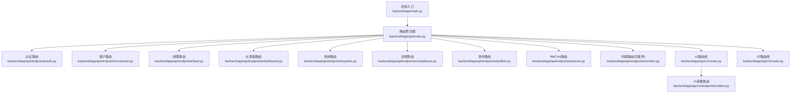
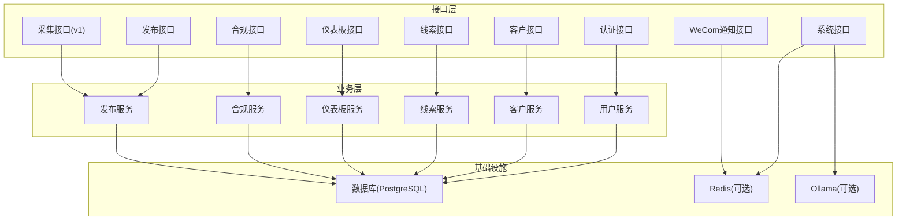
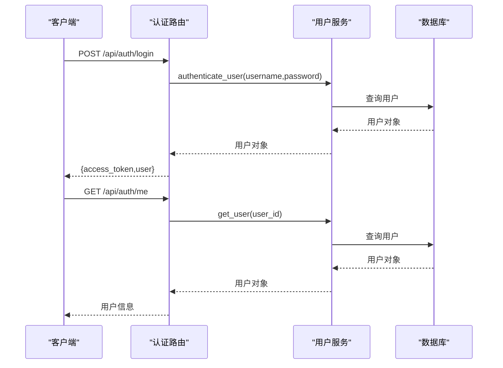
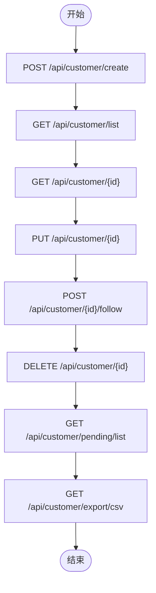
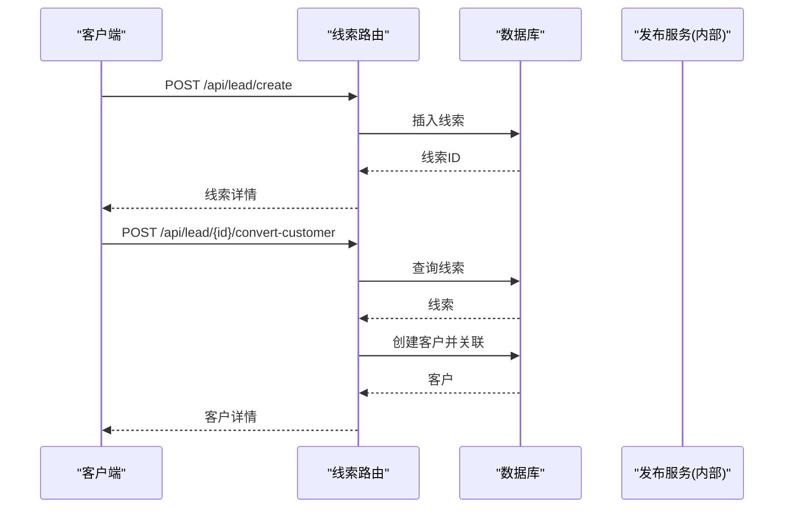
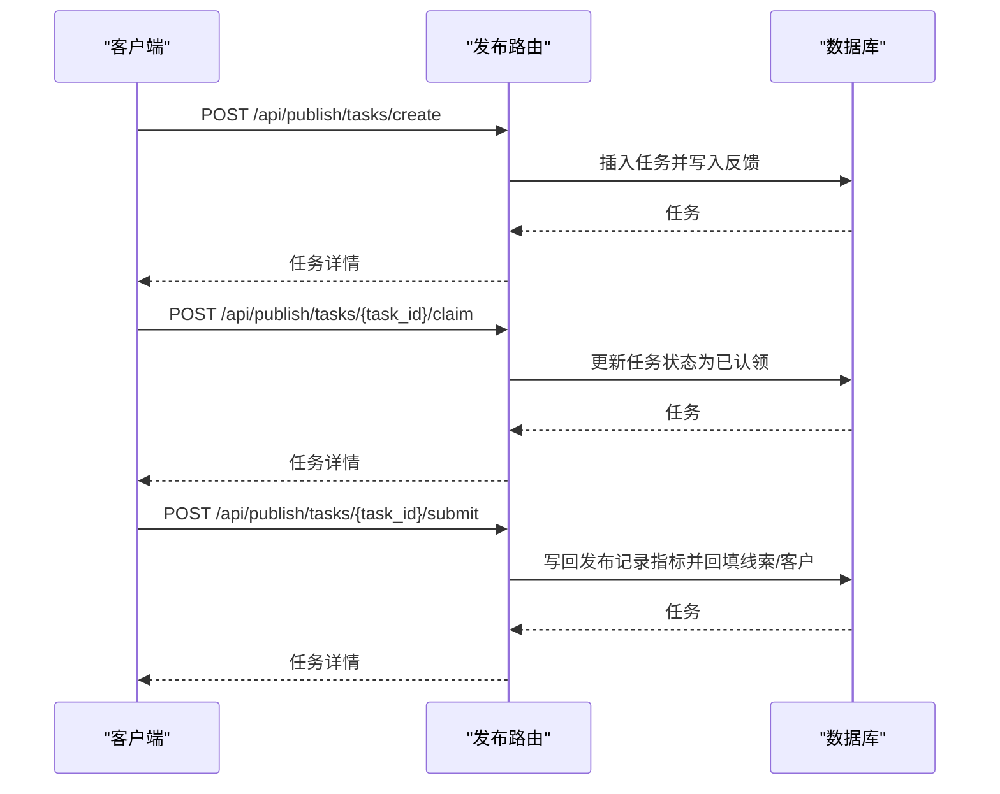
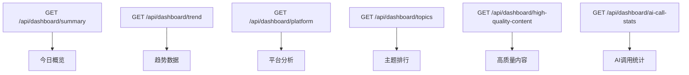
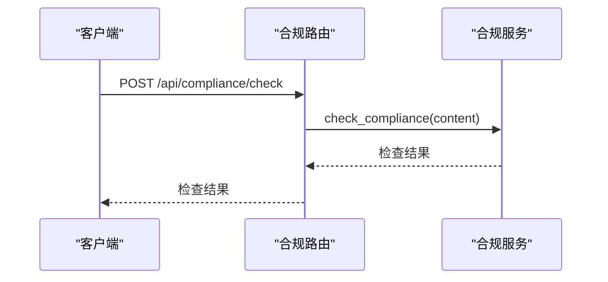
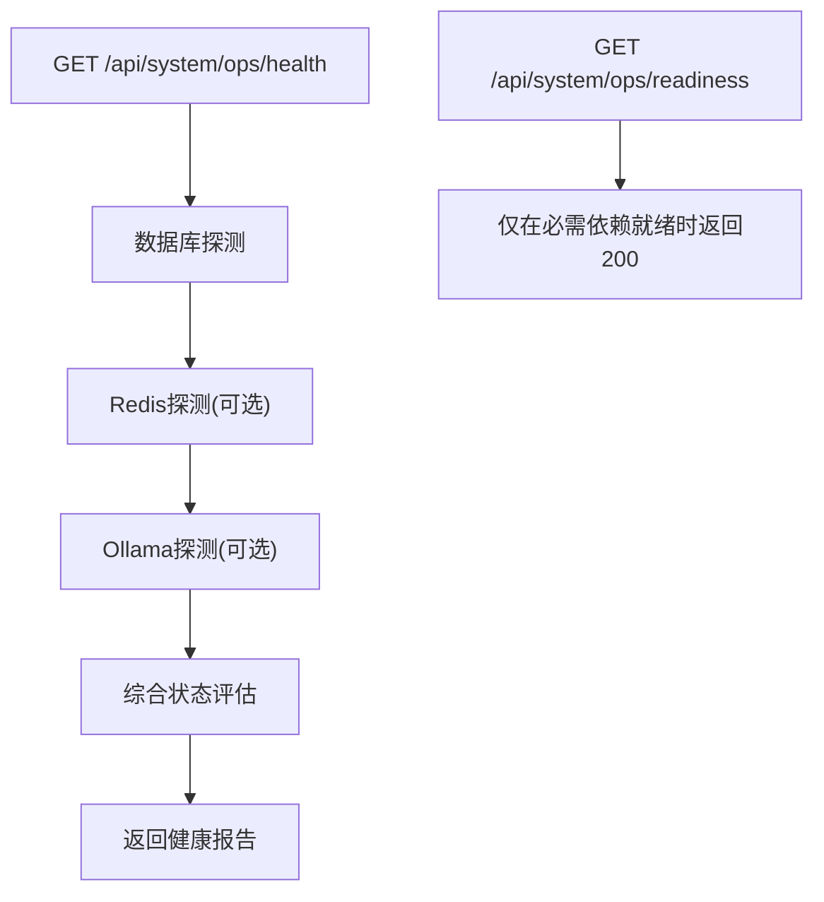
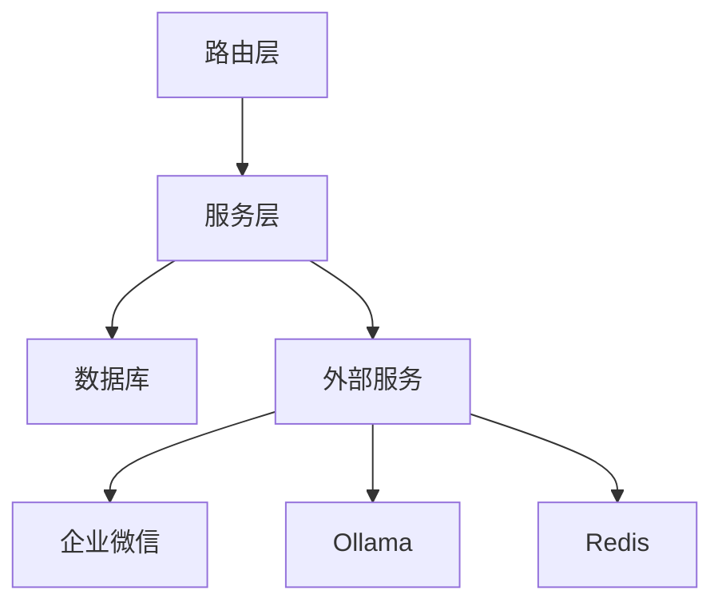

# 管理接口

<cite>
**本文引用的文件**   
- [backend/app/main.py](file://backend/app/main.py)
- [backend/app/api/router.py](file://backend/app/api/router.py)
- [backend/app/api/v1/router.py](file://backend/app/api/v1/router.py)
- [backend/app/api/v2/router.py](file://backend/app/api/v2/router.py)
- [backend/QUICKSTART.md](file://backend/QUICKSTART.md)
- [backend/app/api/endpoints/auth.py](file://backend/app/api/endpoints/auth.py)
- [backend/app/api/endpoints/customer.py](file://backend/app/api/endpoints/customer.py)
- [backend/app/api/endpoints/lead.py](file://backend/app/api/endpoints/lead.py)
- [backend/app/api/endpoints/dashboard.py](file://backend/app/api/endpoints/dashboard.py)
- [backend/app/api/endpoints/system.py](file://backend/app/api/endpoints/system.py)
- [backend/app/api/endpoints/compliance.py](file://backend/app/api/endpoints/compliance.py)
- [backend/app/api/endpoints/publish.py](file://backend/app/api/endpoints/publish.py)
- [backend/app/api/endpoints/wecom.py](file://backend/app/api/endpoints/wecom.py)
- [backend/app/api/endpoints/content.py](file://backend/app/api/endpoints/content.py)
- [backend/app/api/v1/endpoints/collect.py](file://backend/app/api/v1/endpoints/collect.py)
</cite>

## 目录
1. [简介](#简介)
2. [项目结构](#项目结构)
3. [核心组件](#核心组件)
4. [架构总览](#架构总览)
5. [详细组件分析](#详细组件分析)
6. [依赖分析](#依赖分析)
7. [性能考虑](#性能考虑)
8. [故障排查指南](#故障排查指南)
9. [结论](#结论)
10. [附录](#附录)

## 简介
本文件为“智获客”管理接口的全面API文档，覆盖用户管理、权限控制、系统配置、客户信息维护、线索池管理、发布与任务追踪、仪表板数据查询、合规检查、系统监控与健康检查、WeCom通知、以及数据导出与报表生成等能力。文档面向前后端开发者与运维人员，提供接口规范、数据模型、流程图、时序图与最佳实践建议。

## 项目结构
后端基于FastAPI构建，采用模块化路由组织方式：
- 应用入口与路由注册：通过顶层路由聚合器将各模块路由注册到应用实例。
- 版本化路由：v1与v2路由分别承载不同阶段的功能与演进策略。
- 功能路由：认证、客户、线索、仪表板、系统、合规、发布、企业微信通知等。
- 旧接口：内容接口已下线，提供替代路径指引。

图表来源
- [backend/app/main.py:1-4](file://backend/app/main.py#L1-L4)
- [backend/app/api/router.py:1-35](file://backend/app/api/router.py#L1-L35)
- [backend/app/api/v1/router.py:1-22](file://backend/app/api/v1/router.py#L1-L22)
- [backend/app/api/v2/router.py:1-15](file://backend/app/api/v2/router.py#L1-L15)
- [backend/app/api/endpoints/auth.py:1-280](file://backend/app/api/endpoints/auth.py#L1-L280)
- [backend/app/api/endpoints/customer.py:1-148](file://backend/app/api/endpoints/customer.py#L1-L148)
- [backend/app/api/endpoints/lead.py:1-175](file://backend/app/api/endpoints/lead.py#L1-L175)
- [backend/app/api/endpoints/dashboard.py:1-100](file://backend/app/api/endpoints/dashboard.py#L1-L100)
- [backend/app/api/endpoints/system.py:1-171](file://backend/app/api/endpoints/system.py#L1-L171)
- [backend/app/api/endpoints/compliance.py:1-20](file://backend/app/api/endpoints/compliance.py#L1-L20)
- [backend/app/api/endpoints/publish.py:1-606](file://backend/app/api/endpoints/publish.py#L1-L606)
- [backend/app/api/endpoints/wecom.py:1-49](file://backend/app/api/endpoints/wecom.py#L1-L49)
- [backend/app/api/endpoints/content.py:1-19](file://backend/app/api/endpoints/content.py#L1-L19)
- [backend/app/api/v1/endpoints/collect.py:1-34](file://backend/app/api/v1/endpoints/collect.py#L1-L34)

章节来源
- [backend/app/main.py:1-4](file://backend/app/main.py#L1-L4)
- [backend/app/api/router.py:1-35](file://backend/app/api/router.py#L1-L35)
- [backend/QUICKSTART.md:71-105](file://backend/QUICKSTART.md#L71-L105)

## 核心组件
- 应用入口与路由注册
  - 应用入口负责创建FastAPI实例并注册全部路由。
  - 路由聚合器集中include各模块路由，并提供统一健康检查端点。
- 版本化路由
  - v1与v2路由分别挂载子路由，便于演进与兼容。
- 安全与权限
  - 令牌校验中间件用于保护受保护端点。
  - 角色校验装饰器用于限制特定操作的访问范围。
- 服务层
  - 各端点调用对应服务层进行业务处理，保证职责分离。

章节来源
- [backend/app/main.py:1-4](file://backend/app/main.py#L1-L4)
- [backend/app/api/router.py:32-35](file://backend/app/api/router.py#L32-L35)
- [backend/app/api/v1/router.py:19-21](file://backend/app/api/v1/router.py#L19-L21)
- [backend/app/api/v2/router.py:12-14](file://backend/app/api/v2/router.py#L12-L14)

## 架构总览
系统采用分层架构：路由层（APIRouter）、业务层（Services）、数据层（ORM/数据库）。认证与权限贯穿所有受保护端点；系统路由提供健康检查与运行时依赖探测；发布与任务追踪形成闭环，支持从任务到线索再到客户的自动回填。

图表来源
- [backend/app/api/router.py:1-35](file://backend/app/api/router.py#L1-L35)
- [backend/app/api/endpoints/system.py:39-132](file://backend/app/api/endpoints/system.py#L39-L132)
- [backend/app/api/endpoints/publish.py:70-123](file://backend/app/api/endpoints/publish.py#L70-L123)

## 详细组件分析

### 认证与用户管理
- 功能要点
  - 用户注册、登录、获取当前用户信息。
  - 企业微信OAuth回调与绑定。
  - 移动H5短时效票据签发与兑换。
  - 获取活跃用户列表（任务分配选项）。
- 权限与安全
  - 多数端点依赖令牌校验中间件；部分管理端点需管理员或运营角色。
- 数据模型
  - 用户实体包含基础字段与角色标识；企业微信绑定字段用于单点登录。
- 最佳实践
  - 强制使用Bearer Token访问受保护端点。
  - 企业微信配置缺失时返回明确错误，避免误导前端。
  - 短时效票据用于移动端免密登录，注意过期时间与用途约束。

图表来源
- [backend/app/api/endpoints/auth.py:107-118](file://backend/app/api/endpoints/auth.py#L107-L118)
- [backend/app/api/endpoints/auth.py:114-118](file://backend/app/api/endpoints/auth.py#L114-L118)

章节来源
- [backend/app/api/endpoints/auth.py:95-132](file://backend/app/api/endpoints/auth.py#L95-L132)
- [backend/app/api/endpoints/auth.py:185-254](file://backend/app/api/endpoints/auth.py#L185-L254)
- [backend/app/api/endpoints/auth.py:134-179](file://backend/app/api/endpoints/auth.py#L134-L179)

### 客户信息维护与导出
- 功能要点
  - 新增、查询、更新、删除客户。
  - 添加跟进记录。
  - 待跟进客户列表。
  - CSV导出（管理员/运营角色）。
- 权限控制
  - 导出接口要求管理员或运营角色。
- 数据模型
  - 客户实体包含来源平台、标签、意向等级、状态等字段。
- 最佳实践
  - 分页查询使用skip/limit参数，限制最大条数防止资源耗尽。
  - 导出CSV时对字段进行安全转义与分隔符处理。

图表来源
- [backend/app/api/endpoints/customer.py:21-94](file://backend/app/api/endpoints/customer.py#L21-L94)
- [backend/app/api/endpoints/customer.py:97-105](file://backend/app/api/endpoints/customer.py#L97-L105)
- [backend/app/api/endpoints/customer.py:108-147](file://backend/app/api/endpoints/customer.py#L108-L147)

章节来源
- [backend/app/api/endpoints/customer.py:32-44](file://backend/app/api/endpoints/customer.py#L32-L44)
- [backend/app/api/endpoints/customer.py:47-55](file://backend/app/api/endpoints/customer.py#L47-L55)
- [backend/app/api/endpoints/customer.py:58-69](file://backend/app/api/endpoints/customer.py#L58-L69)
- [backend/app/api/endpoints/customer.py:72-83](file://backend/app/api/endpoints/customer.py#L72-L83)
- [backend/app/api/endpoints/customer.py:86-94](file://backend/app/api/endpoints/customer.py#L86-L94)
- [backend/app/api/endpoints/customer.py:97-105](file://backend/app/api/endpoints/customer.py#L97-L105)
- [backend/app/api/endpoints/customer.py:108-147](file://backend/app/api/endpoints/customer.py#L108-L147)

### 线索池管理与转换
- 功能要点
  - 创建线索、列表查询、状态更新、归属人变更、轨迹查询。
  - 将线索转换为客户（自动创建客户并关联）。
- 权限控制
  - 仅线索归属人或拥有相应范围权限的用户可操作。
- 数据模型
  - 线索与客户存在一对多关联，发布任务可回填生成线索。
- 最佳实践
  - 状态机遵循“新建/联系中/有效线索/已转化”等语义。
  - 归属人变更需校验目标用户有效性。

图表来源
- [backend/app/api/endpoints/lead.py:29-39](file://backend/app/api/endpoints/lead.py#L29-L39)
- [backend/app/api/endpoints/lead.py:140-174](file://backend/app/api/endpoints/lead.py#L140-L174)

章节来源
- [backend/app/api/endpoints/lead.py:42-71](file://backend/app/api/endpoints/lead.py#L42-L71)
- [backend/app/api/endpoints/lead.py:74-90](file://backend/app/api/endpoints/lead.py#L74-L90)
- [backend/app/api/endpoints/lead.py:93-114](file://backend/app/api/endpoints/lead.py#L93-L114)
- [backend/app/api/endpoints/lead.py:117-137](file://backend/app/api/endpoints/lead.py#L117-L137)
- [backend/app/api/endpoints/lead.py:140-174](file://backend/app/api/endpoints/lead.py#L140-L174)

### 发布任务与记录管理
- 功能要点
  - 创建发布记录、列表查询、更新指标。
  - 创建发布任务、认领、指派、提交、拒绝、关闭。
  - 任务统计、轨迹追踪、CSV导出。
  - 自动从任务回填生成线索与客户。
- 权限控制
  - 任务操作严格校验归属人或被指派人身份。
  - 导出CSV需管理员/运营角色。
- 数据模型
  - 发布记录与任务、重写内容、线索、客户存在多维关联。
- 最佳实践
  - 提交任务时自动写回发布记录指标，保持数据一致性。
  - 任务生命周期状态机清晰，避免重复操作。

图表来源
- [backend/app/api/endpoints/publish.py:149-183](file://backend/app/api/endpoints/publish.py#L149-L183)
- [backend/app/api/endpoints/publish.py:337-367](file://backend/app/api/endpoints/publish.py#L337-L367)
- [backend/app/api/endpoints/publish.py:407-481](file://backend/app/api/endpoints/publish.py#L407-L481)
- [backend/app/api/endpoints/publish.py:70-123](file://backend/app/api/endpoints/publish.py#L70-L123)

章节来源
- [backend/app/api/endpoints/publish.py:125-146](file://backend/app/api/endpoints/publish.py#L125-L146)
- [backend/app/api/endpoints/publish.py:186-202](file://backend/app/api/endpoints/publish.py#L186-L202)
- [backend/app/api/endpoints/publish.py:205-230](file://backend/app/api/endpoints/publish.py#L205-L230)
- [backend/app/api/endpoints/publish.py:233-259](file://backend/app/api/endpoints/publish.py#L233-L259)
- [backend/app/api/endpoints/publish.py:280-288](file://backend/app/api/endpoints/publish.py#L280-L288)
- [backend/app/api/endpoints/publish.py:291-309](file://backend/app/api/endpoints/publish.py#L291-L309)
- [backend/app/api/endpoints/publish.py:312-334](file://backend/app/api/endpoints/publish.py#L312-L334)
- [backend/app/api/endpoints/publish.py:337-367](file://backend/app/api/endpoints/publish.py#L337-L367)
- [backend/app/api/endpoints/publish.py:370-404](file://backend/app/api/endpoints/publish.py#L370-L404)
- [backend/app/api/endpoints/publish.py:407-481](file://backend/app/api/endpoints/publish.py#L407-L481)
- [backend/app/api/endpoints/publish.py:484-510](file://backend/app/api/endpoints/publish.py#L484-L510)
- [backend/app/api/endpoints/publish.py:513-540](file://backend/app/api/endpoints/publish.py#L513-L540)
- [backend/app/api/endpoints/publish.py:543-605](file://backend/app/api/endpoints/publish.py#L543-L605)

### 仪表板数据查询
- 功能要点
  - 今日概览、趋势数据、平台分析、主题排行、高质量内容、AI调用统计。
- 权限控制
  - 所有端点均需令牌校验。
- 最佳实践
  - 趋势与主题排行限制查询天数与条数，避免超大数据集。
  - AI调用统计支持按用户或全局范围聚合。

图表来源
- [backend/app/api/endpoints/dashboard.py:11-32](file://backend/app/api/endpoints/dashboard.py#L11-L32)
- [backend/app/api/endpoints/dashboard.py:35-46](file://backend/app/api/endpoints/dashboard.py#L35-L46)
- [backend/app/api/endpoints/dashboard.py:49-56](file://backend/app/api/endpoints/dashboard.py#L49-L56)
- [backend/app/api/endpoints/dashboard.py:59-67](file://backend/app/api/endpoints/dashboard.py#L59-L67)
- [backend/app/api/endpoints/dashboard.py:70-78](file://backend/app/api/endpoints/dashboard.py#L70-L78)
- [backend/app/api/endpoints/dashboard.py:81-99](file://backend/app/api/endpoints/dashboard.py#L81-L99)

章节来源
- [backend/app/api/endpoints/dashboard.py:11-32](file://backend/app/api/endpoints/dashboard.py#L11-L32)
- [backend/app/api/endpoints/dashboard.py:35-46](file://backend/app/api/endpoints/dashboard.py#L35-L46)
- [backend/app/api/endpoints/dashboard.py:49-56](file://backend/app/api/endpoints/dashboard.py#L49-L56)
- [backend/app/api/endpoints/dashboard.py:59-67](file://backend/app/api/endpoints/dashboard.py#L59-L67)
- [backend/app/api/endpoints/dashboard.py:70-78](file://backend/app/api/endpoints/dashboard.py#L70-L78)
- [backend/app/api/endpoints/dashboard.py:81-99](file://backend/app/api/endpoints/dashboard.py#L81-L99)

### 合规检查
- 功能要点
  - 对内容进行合规性检查，返回检查结果。
- 权限控制
  - 需要令牌校验。
- 最佳实践
  - 将合规检查前置到内容改写与发布流程中，确保内容安全。

图表来源
- [backend/app/api/endpoints/compliance.py:11-19](file://backend/app/api/endpoints/compliance.py#L11-L19)

章节来源
- [backend/app/api/endpoints/compliance.py:11-19](file://backend/app/api/endpoints/compliance.py#L11-L19)

### 系统监控与健康检查
- 功能要点
  - 版本信息、序列计数快照、数据库/Redis/Ollama健康探测、就绪检查。
- 权限控制
  - 健康检查端点通常不强制要求令牌。
- 最佳实践
  - 就绪检查仅在数据库与Redis可用时返回成功，保障部署稳定性。
  - 健康报告包含运行时配置快照，便于排障。

图表来源
- [backend/app/api/endpoints/system.py:134-161](file://backend/app/api/endpoints/system.py#L134-L161)
- [backend/app/api/endpoints/system.py:164-170](file://backend/app/api/endpoints/system.py#L164-L170)

章节来源
- [backend/app/api/endpoints/system.py:21-30](file://backend/app/api/endpoints/system.py#L21-L30)
- [backend/app/api/endpoints/system.py:33-36](file://backend/app/api/endpoints/system.py#L33-L36)
- [backend/app/api/endpoints/system.py:134-161](file://backend/app/api/endpoints/system.py#L134-L161)
- [backend/app/api/endpoints/system.py:164-170](file://backend/app/api/endpoints/system.py#L164-L170)

### WeCom通知
- 功能要点
  - 管理员/运营角色可发送测试Markdown消息至企业微信群机器人。
- 权限控制
  - 需要管理员或运营角色。
- 最佳实践
  - Webhook地址需在配置中正确设置，失败时返回明确错误。

章节来源
- [backend/app/api/endpoints/wecom.py:15-48](file://backend/app/api/endpoints/wecom.py#L15-L48)

### 采集与素材（v1/v2）
- 功能要点
  - v1：关键词采集任务创建。
  - v2：素材列表、详情、更新、删除、重建知识、AI改写、采集日志等。
- 权限控制
  - 多数端点需要令牌校验。
- 最佳实践
  - 优先使用v2端点，v1端点逐步迁移。

章节来源
- [backend/app/api/v1/endpoints/collect.py:18-33](file://backend/app/api/v1/endpoints/collect.py#L18-L33)
- [backend/QUICKSTART.md:116-128](file://backend/QUICKSTART.md#L116-L128)

### 内容接口（已废弃）
- 状态
  - 已下线，提供替代路径指引。
- 替代方案
  - 素材列表/详情：/api/v2/materials
  - 手动录入：/api/v1/material/inbox/manual
  - 关键词采集：/api/v1/collector/tasks/keyword

章节来源
- [backend/app/api/endpoints/content.py:15-18](file://backend/app/api/endpoints/content.py#L15-L18)
- [backend/QUICKSTART.md:116-128](file://backend/QUICKSTART.md#L116-L128)

## 依赖分析
- 组件耦合
  - 路由层仅依赖服务层与数据库会话，低耦合高内聚。
  - 权限装饰器与令牌校验中间件统一接入，避免重复逻辑。
- 外部依赖
  - 数据库：PostgreSQL（SQLAlchemy ORM）。
  - 缓存：Redis（可选，速率限制与健康探测）。
  - 大模型：Ollama（可选，模型可用性探测）。
- 潜在风险
  - 企业微信OAuth依赖外部API，需做好超时与错误处理。
  - 导出CSV可能产生大文件，需限制导出量与分页策略。

图表来源
- [backend/app/api/endpoints/auth.py:44-73](file://backend/app/api/endpoints/auth.py#L44-L73)
- [backend/app/api/endpoints/system.py:102-131](file://backend/app/api/endpoints/system.py#L102-L131)
- [backend/app/api/endpoints/system.py:62-99](file://backend/app/api/endpoints/system.py#L62-L99)

章节来源
- [backend/app/api/endpoints/auth.py:44-73](file://backend/app/api/endpoints/auth.py#L44-L73)
- [backend/app/api/endpoints/system.py:102-131](file://backend/app/api/endpoints/system.py#L102-L131)
- [backend/app/api/endpoints/system.py:62-99](file://backend/app/api/endpoints/system.py#L62-L99)

## 性能考虑
- 分页与限制
  - 列表查询普遍支持skip/limit，建议默认较小limit并限制最大值，避免一次性拉取过多数据。
- 缓存与异步
  - 企业微信access_token采用内存缓存，降低外部调用频率。
  - WeCom通知使用异步HTTP客户端，提升响应速度。
- 导出优化
  - CSV导出使用流式响应，避免一次性加载全部数据到内存。
- 健康检查
  - 就绪检查仅在关键依赖可用时返回200，有助于Kubernetes等编排系统快速发现异常。

## 故障排查指南
- 认证相关
  - 401/403：检查Authorization头与令牌有效期；确认用户角色满足端点要求。
  - 企业微信OAuth：检查配置项与回调参数，关注外部API返回的错误码。
- 数据库与依赖
  - 健康检查返回degraded：查看数据库/Redis/Ollama探测结果，定位具体依赖问题。
- 导出失败
  - 确认导出角色权限与导出量限制；检查CSV字段编码与分隔符。
- 发布任务
  - 仅待认领/已拒绝任务可认领；已提交/已关闭任务不可再修改；检查归属人与被指派人身份。

章节来源
- [backend/app/api/endpoints/auth.py:209-254](file://backend/app/api/endpoints/auth.py#L209-L254)
- [backend/app/api/endpoints/system.py:134-161](file://backend/app/api/endpoints/system.py#L134-L161)
- [backend/app/api/endpoints/publish.py:344-353](file://backend/app/api/endpoints/publish.py#L344-L353)
- [backend/app/api/endpoints/publish.py:418-422](file://backend/app/api/endpoints/publish.py#L418-L422)

## 结论
本API体系围绕“内容采集—合规检查—内容改写—发布任务—线索转化—客户管理—仪表板”的闭环设计，结合版本化路由与严格的权限控制，既保证了功能演进的灵活性，也确保了系统的安全性与可观测性。建议在生产环境中启用就绪检查与健康报告，配合导出与通知能力，构建完善的运维与监控体系。

## 附录
- 快速参考（节选）
  - 认证：注册、登录、当前用户、活跃用户列表、移动H5票据、企业微信OAuth与绑定。
  - 客户：创建、列表、详情、更新、删除、跟进、待跟进列表、导出CSV。
  - 线索：创建、列表、状态更新、归属人变更、轨迹、转换为客户。
  - 发布：创建记录、列表、详情、更新；创建任务、认领、指派、提交、拒绝、关闭、统计、轨迹、导出CSV。
  - 仪表板：今日概览、趋势、平台分析、主题排行、高质量内容、AI调用统计。
  - 合规：内容合规检查。
  - 系统：版本、序列计数、健康/就绪检查。
  - WeCom：测试通知。
  - 采集：v1关键词任务创建；v2素材管理与日志。

章节来源
- [backend/QUICKSTART.md:107-165](file://backend/QUICKSTART.md#L107-L165)