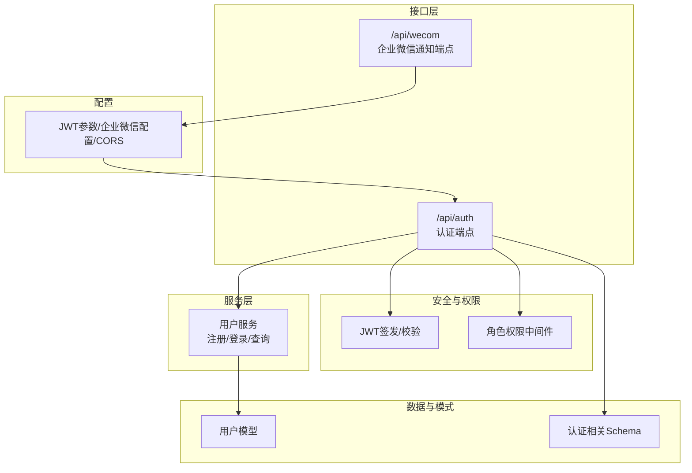
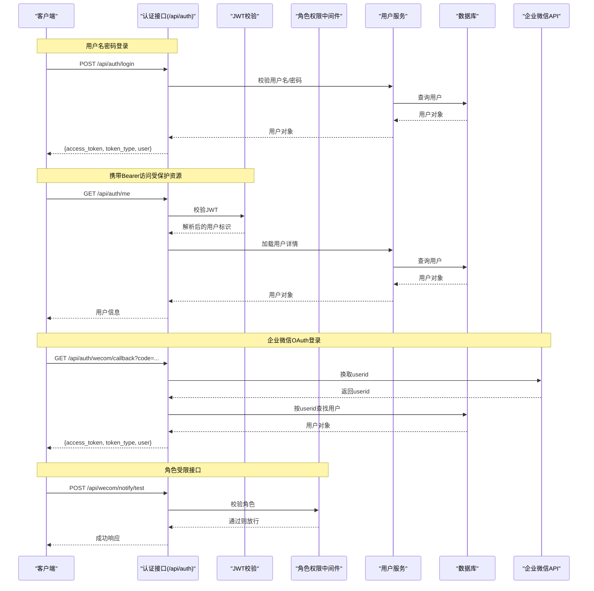
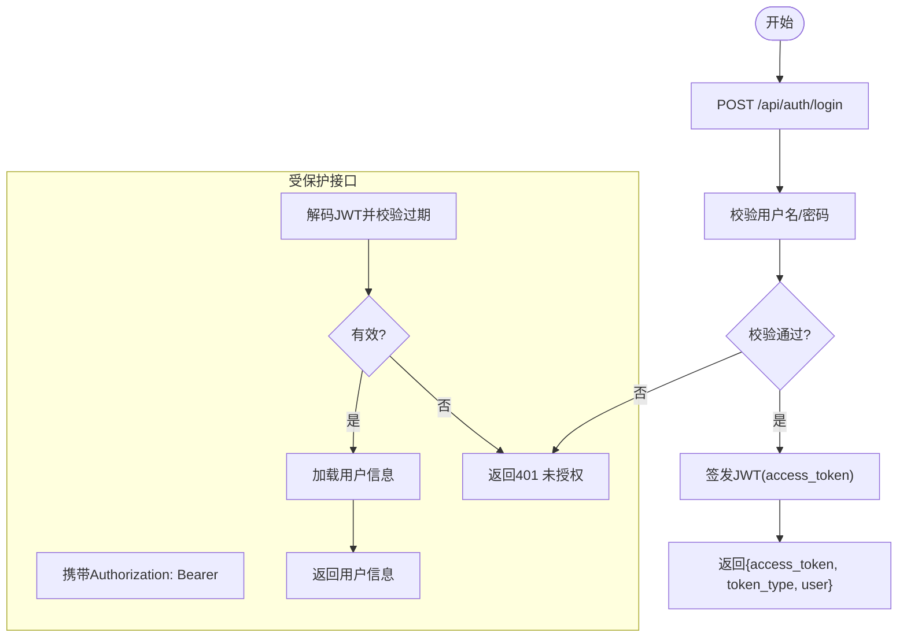
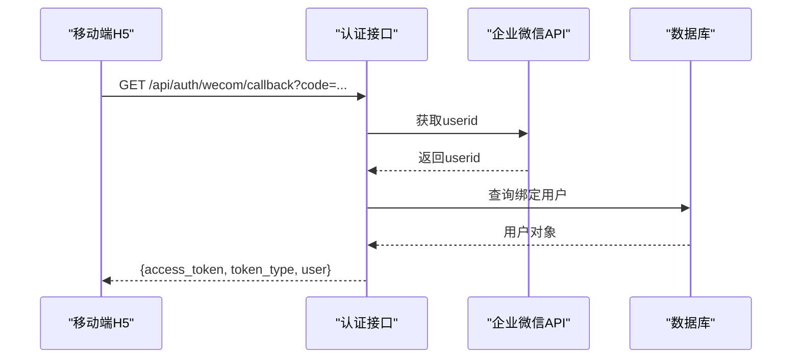
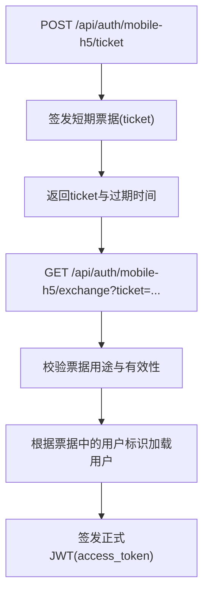
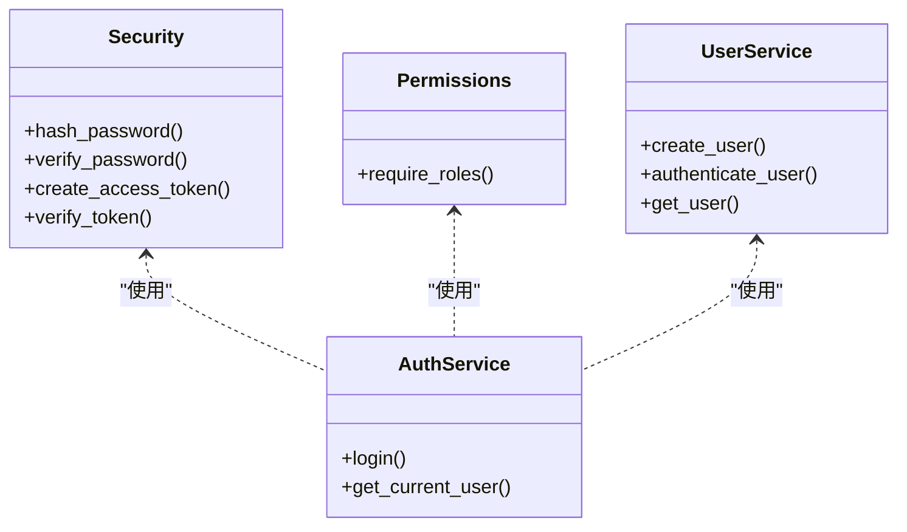
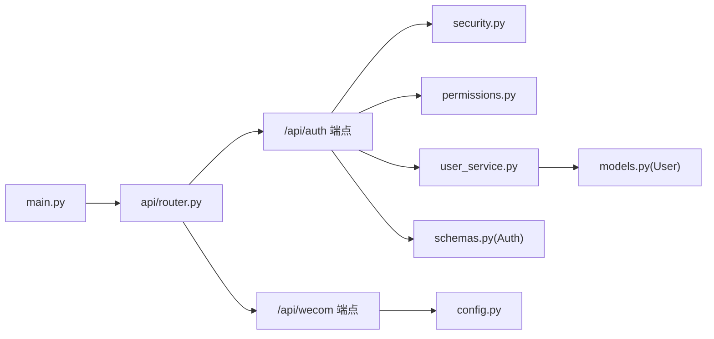

# 认证与授权接口

<cite>
**本文引用的文件**
- [backend/app/api/endpoints/auth.py](file://backend/app/api/endpoints/auth.py)
- [backend/app/api/endpoints/wecom.py](file://backend/app/api/endpoints/wecom.py)
- [backend/app/core/security.py](file://backend/app/core/security.py)
- [backend/app/core/permissions.py](file://backend/app/core/permissions.py)
- [backend/app/services/user_service.py](file://backend/app/services/user_service.py)
- [backend/app/schemas/schemas.py](file://backend/app/schemas/schemas.py)
- [backend/app/models/models.py](file://backend/app/models/models.py)
- [backend/app/core/config.py](file://backend/app/core/config.py)
- [backend/app/api/router.py](file://backend/app/api/router.py)
- [backend/main.py](file://backend/main.py)
- [backend/test_api.py](file://backend/test_api.py)
</cite>

## 目录
1. [简介](#简介)
2. [项目结构](#项目结构)
3. [核心组件](#核心组件)
4. [架构总览](#架构总览)
5. [详细组件分析](#详细组件分析)
6. [依赖关系分析](#依赖关系分析)
7. [性能考量](#性能考量)
8. [故障排查指南](#故障排查指南)
9. [结论](#结论)
10. [附录](#附录)

## 简介
本文件面向“智获客”系统的认证与授权接口，提供从JWT令牌获取、刷新、验证，到企业微信OAuth登录、移动端H5短票据、用户信息查询、角色权限控制与中间件配置的完整技术文档。文档同时涵盖会话管理、令牌过期处理、并发登录控制策略建议，并给出请求/响应示例、错误码说明与安全最佳实践。

## 项目结构
认证相关代码主要分布在以下模块：
- 接口层：认证与企业微信相关路由与端点
- 安全与权限：JWT签发/校验、角色权限中间件
- 服务层：用户业务逻辑（注册、登录、查询）
- 数据模型与模式：用户模型、认证相关Schema
- 配置：JWT参数、企业微信配置、CORS等
- 路由注册：统一挂载各模块路由

**图表来源**
- [backend/app/api/endpoints/auth.py](file://backend/app/api/endpoints/auth.py)
- [backend/app/api/endpoints/wecom.py](file://backend/app/api/endpoints/wecom.py)
- [backend/app/core/security.py](file://backend/app/core/security.py)
- [backend/app/core/permissions.py](file://backend/app/core/permissions.py)
- [backend/app/services/user_service.py](file://backend/app/services/user_service.py)
- [backend/app/schemas/schemas.py](file://backend/app/schemas/schemas.py)
- [backend/app/models/models.py](file://backend/app/models/models.py)
- [backend/app/core/config.py](file://backend/app/core/config.py)

**章节来源**
- [backend/app/api/router.py](file://backend/app/api/router.py)
- [backend/main.py](file://backend/main.py)

## 核心组件
- JWT令牌体系
  - 签发：基于对称算法生成访问令牌，携带用户标识与过期时间
  - 校验：依赖HTTP Bearer头进行解码与过期校验
- 用户认证与会话
  - 用户名+密码登录，返回JWT
  - 当前用户信息查询
  - 移动端H5短票据：用于轻量引导登录，换取正式JWT
- 企业微信OAuth
  - 公开配置查询（决定前端是否显示入口）
  - 回调换码，换取企业微信userid并匹配系统用户，签发JWT
  - 管理员绑定企业微信userid
- 权限控制
  - 基于角色的访问控制（RBAC），支持限定角色访问
- 配置与中间件
  - JWT参数、企业微信参数、CORS跨域
  - FastAPI CORS中间件

**章节来源**
- [backend/app/core/security.py](file://backend/app/core/security.py)
- [backend/app/core/permissions.py](file://backend/app/core/permissions.py)
- [backend/app/api/endpoints/auth.py](file://backend/app/api/endpoints/auth.py)
- [backend/app/api/endpoints/wecom.py](file://backend/app/api/endpoints/wecom.py)
- [backend/app/core/config.py](file://backend/app/core/config.py)

## 架构总览
认证与授权的整体交互如下：

**图表来源**
- [backend/app/api/endpoints/auth.py](file://backend/app/api/endpoints/auth.py)
- [backend/app/api/endpoints/wecom.py](file://backend/app/api/endpoints/wecom.py)
- [backend/app/core/security.py](file://backend/app/core/security.py)
- [backend/app/core/permissions.py](file://backend/app/core/permissions.py)
- [backend/app/services/user_service.py](file://backend/app/services/user_service.py)

## 详细组件分析

### JWT令牌获取与验证
- 令牌获取
  - 登录接口接收用户名与密码，调用用户服务进行校验，成功后签发访问令牌
  - 令牌类型为Bearer，包含用户基本信息
- 令牌验证
  - 通过HTTP Bearer头传递，后端解码并校验过期时间
  - 失败时返回未授权错误
- 令牌刷新
  - 当前实现未提供专用刷新接口；建议采用短期访问令牌+滑动过期策略或引入刷新令牌机制

**图表来源**
- [backend/app/api/endpoints/auth.py](file://backend/app/api/endpoints/auth.py)
- [backend/app/core/security.py](file://backend/app/core/security.py)
- [backend/app/services/user_service.py](file://backend/app/services/user_service.py)

**章节来源**
- [backend/app/api/endpoints/auth.py](file://backend/app/api/endpoints/auth.py)
- [backend/app/core/security.py](file://backend/app/core/security.py)
- [backend/app/services/user_service.py](file://backend/app/services/user_service.py)

### 企业微信OAuth认证流程
- 配置查询
  - 返回企业微信公开配置（CorpId、AgentId、是否启用），前端据此决定是否展示入口
- 回调换码
  - 使用回调参数中的临时code，向企业微信换取userid
  - 根据userid在系统中查找已绑定的用户，签发JWT
- 绑定接口
  - 管理员为当前用户绑定企业微信userid，避免重复绑定

**图表来源**
- [backend/app/api/endpoints/auth.py](file://backend/app/api/endpoints/auth.py)

**章节来源**
- [backend/app/api/endpoints/auth.py](file://backend/app/api/endpoints/auth.py)

### 移动端H5短票据与登录
- 短票据签发
  - 已登录用户签发短期票据，用于H5轻量引导登录
- 票据兑换
  - H5携带短票据向后端兑换正式JWT，用于后续受保护接口访问

**图表来源**
- [backend/app/api/endpoints/auth.py](file://backend/app/api/endpoints/auth.py)

**章节来源**
- [backend/app/api/endpoints/auth.py](file://backend/app/api/endpoints/auth.py)

### 用户登录与登出接口
- 登录
  - POST /api/auth/login
  - 请求体包含用户名与密码
  - 成功返回JWT与用户信息
- 当前用户
  - GET /api/auth/me
  - 需要Bearer令牌，返回当前用户信息
- 登出
  - 当前实现未提供服务端会话失效接口；建议采用黑名单或短期令牌策略

**章节来源**
- [backend/app/api/endpoints/auth.py](file://backend/app/api/endpoints/auth.py)
- [backend/app/services/user_service.py](file://backend/app/services/user_service.py)

### 密码重置机制
- 当前未发现专用密码重置接口
- 建议方案
  - 引入“重置令牌”机制：发送邮件/站内消息，携带一次性令牌，校验通过后允许修改密码
  - 或采用“旧密码校验+新密码”流程

[本节为通用设计建议，不直接分析具体文件]

### 认证中间件与权限验证
- JWT中间件
  - 通过HTTP Bearer头进行令牌解析与校验
- 角色权限中间件
  - 基于用户角色进行访问控制，支持指定角色白名单
- 路由注册
  - 所有认证与权限相关端点通过统一路由器挂载

**图表来源**
- [backend/app/core/security.py](file://backend/app/core/security.py)
- [backend/app/core/permissions.py](file://backend/app/core/permissions.py)
- [backend/app/api/endpoints/auth.py](file://backend/app/api/endpoints/auth.py)
- [backend/app/services/user_service.py](file://backend/app/services/user_service.py)

**章节来源**
- [backend/app/core/security.py](file://backend/app/core/security.py)
- [backend/app/core/permissions.py](file://backend/app/core/permissions.py)
- [backend/app/api/router.py](file://backend/app/api/router.py)

### 会话管理、令牌过期与并发登录控制
- 会话管理
  - 采用无状态JWT，服务端不存储会话；建议结合短期令牌与滑动过期
- 令牌过期
  - 默认访问令牌有效期可配置；过期后需重新登录或引入刷新令牌
- 并发登录控制
  - 当前未实现强制踢下线或并发登录限制
  - 建议方案：引入刷新令牌与令牌黑名单，或基于用户维度限制并发会话数量

**章节来源**
- [backend/app/core/config.py](file://backend/app/core/config.py)
- [backend/app/core/security.py](file://backend/app/core/security.py)

## 依赖关系分析
认证与授权相关模块之间的依赖关系如下：

**图表来源**
- [backend/app/api/endpoints/auth.py](file://backend/app/api/endpoints/auth.py)
- [backend/app/api/endpoints/wecom.py](file://backend/app/api/endpoints/wecom.py)
- [backend/app/core/security.py](file://backend/app/core/security.py)
- [backend/app/core/permissions.py](file://backend/app/core/permissions.py)
- [backend/app/services/user_service.py](file://backend/app/services/user_service.py)
- [backend/app/models/models.py](file://backend/app/models/models.py)
- [backend/app/schemas/schemas.py](file://backend/app/schemas/schemas.py)
- [backend/app/core/config.py](file://backend/app/core/config.py)
- [backend/app/api/router.py](file://backend/app/api/router.py)
- [backend/main.py](file://backend/main.py)

**章节来源**
- [backend/app/api/router.py](file://backend/app/api/router.py)
- [backend/main.py](file://backend/main.py)

## 性能考量
- JWT计算
  - HS256算法开销较低，适合高并发；注意密钥长度与安全性
- 令牌缓存
  - 企业微信access_token采用内存缓存，降低外部调用频率
- 数据库访问
  - 登录与受保护接口均需查询用户，建议在用户表建立索引并使用连接池优化

[本节提供通用指导，不直接分析具体文件]

## 故障排查指南
- 常见错误码与原因
  - 400：用户名或邮箱已存在（注册）、请求参数非法
  - 401：未提供或无效令牌、用户名或密码错误、企业微信code无效或过期
  - 403：角色不足
  - 404：用户不存在
  - 409：企业微信userid已被绑定
  - 422：企业微信未配置
  - 502：企业微信API调用失败
  - 503：企业微信OAuth未配置
- 排查步骤
  - 确认JWT是否正确放入Authorization头
  - 检查企业微信配置项是否齐全
  - 核对用户是否存在且处于激活状态
  - 检查令牌是否过期

**章节来源**
- [backend/app/api/endpoints/auth.py](file://backend/app/api/endpoints/auth.py)
- [backend/app/services/user_service.py](file://backend/app/services/user_service.py)

## 结论
本系统采用无状态JWT作为认证载体，结合角色权限中间件实现基础的RBAC能力；企业微信OAuth提供组织化登录入口。建议后续完善密码重置、刷新令牌、并发登录控制与会话黑名单等能力，进一步提升安全性与用户体验。

## 附录

### 接口定义与示例

- 登录
  - 方法与路径：POST /api/auth/login
  - 请求体：用户名、密码
  - 成功响应：access_token、token_type、user
  - 示例请求/响应路径参考：[backend/test_api.py](file://backend/test_api.py)

- 获取当前用户
  - 方法与路径：GET /api/auth/me
  - 请求头：Authorization: Bearer <token>
  - 成功响应：用户信息

- 企业微信OAuth配置
  - 方法与路径：GET /api/auth/wecom/config
  - 成功响应：corp_id、agent_id、oauth_enabled

- 企业微信OAuth回调
  - 方法与路径：GET /api/auth/wecom/callback?code=...
  - 成功响应：access_token、token_type、user

- 管理员绑定企业微信
  - 方法与路径：POST /api/auth/wecom/bind
  - 请求体：wecom_userid
  - 成功响应：绑定结果

- 发送企业微信测试通知
  - 方法与路径：POST /api/wecom/notify/test
  - 请求体：message
  - 成功响应：ok与结果

**章节来源**
- [backend/app/api/endpoints/auth.py](file://backend/app/api/endpoints/auth.py)
- [backend/app/api/endpoints/wecom.py](file://backend/app/api/endpoints/wecom.py)
- [backend/test_api.py](file://backend/test_api.py)

### 错误码说明
- 400：请求参数错误或违反约束
- 401：未授权（令牌无效/过期、凭证错误）
- 403：权限不足（角色不满足）
- 404：资源不存在
- 409：冲突（如企业微信userid已被绑定）
- 422：数据不可处理（如企业微信未配置）
- 502：上游服务异常（如企业微信API）
- 503：服务不可用（如企业微信OAuth未配置）

**章节来源**
- [backend/app/api/endpoints/auth.py](file://backend/app/api/endpoints/auth.py)
- [backend/app/api/endpoints/wecom.py](file://backend/app/api/endpoints/wecom.py)

### 安全最佳实践
- 密钥管理
  - 使用足够长度的随机密钥，避免使用默认占位值
- 传输安全
  - 仅在HTTPS环境下传输令牌
- 令牌策略
  - 短期访问令牌 + 刷新令牌（建议实现）
  - 滑动过期与必要时强制刷新
- 并发控制
  - 引入令牌黑名单或并发会话上限
- 日志与监控
  - 记录认证事件与异常，设置告警

**章节来源**
- [backend/app/core/config.py](file://backend/app/core/config.py)