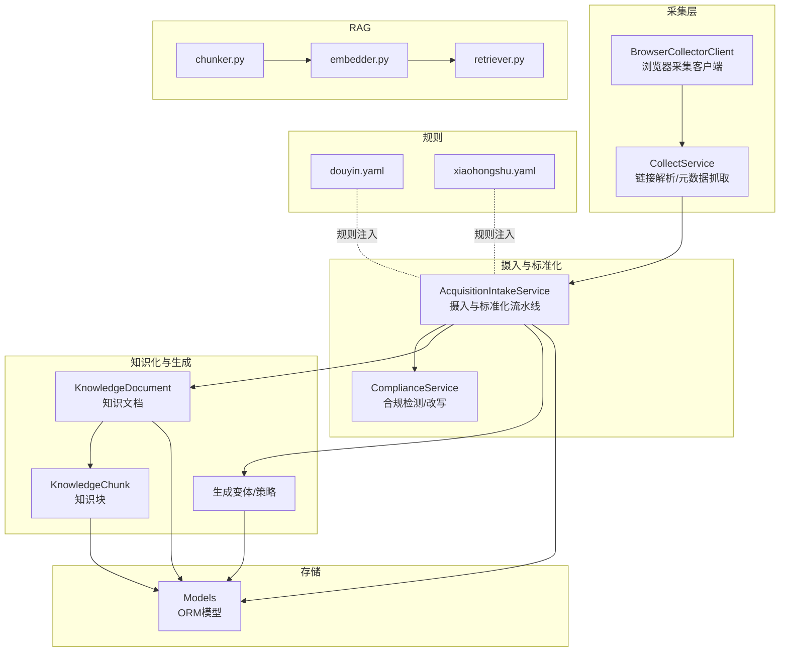
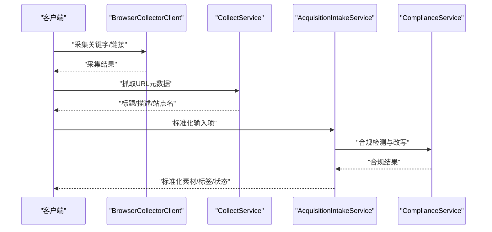
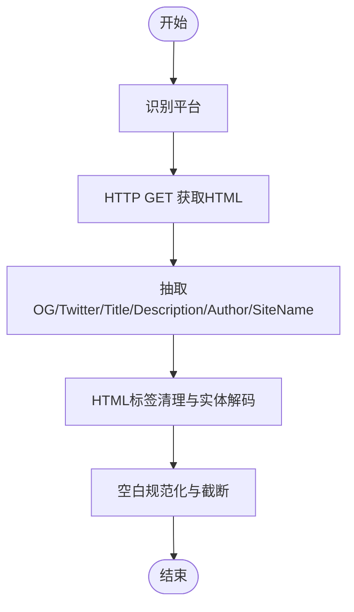
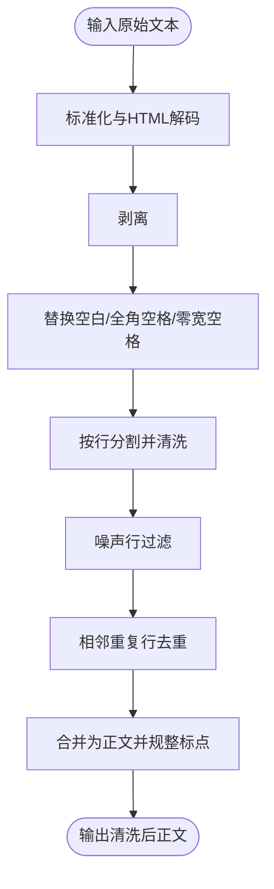
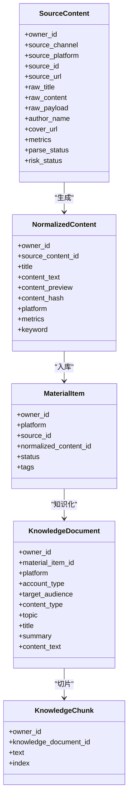
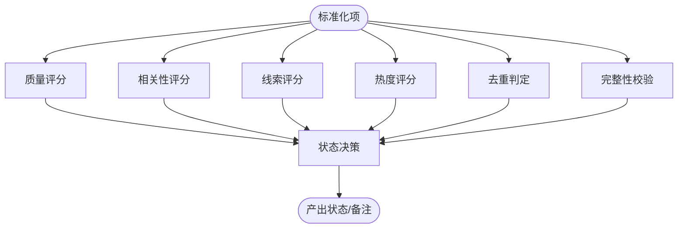
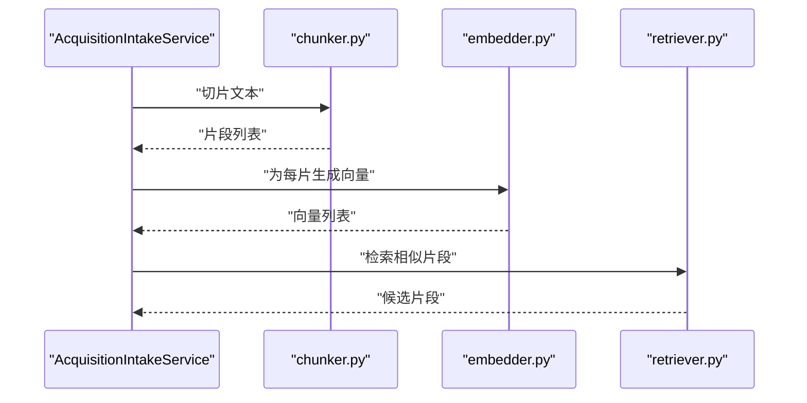
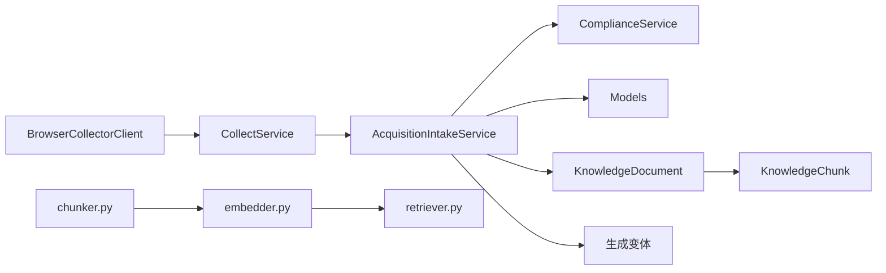

# 内容解析与标准化

<cite>
**本文引用的文件**
- [material_pipeline_service.py](file://backend/app/services/collector/material_pipeline_service.py)
- [collect_service.py](file://backend/app/domains/acquisition/collect_service.py)
- [browser_collector_client.py](file://backend/app/services/collector/browser_collector_client.py)
- [models.py](file://backend/app/models/models.py)
- [chunker.py](file://backend/app/ai/rag/chunker.py)
- [embedder.py](file://backend/app/ai/rag/embedder.py)
- [retriever.py](file://backend/app/ai/rag/retriever.py)
- [douyin.yaml](file://backend/app/rules/local/douyin.yaml)
- [xiaohongshu.yaml](file://backend/app/rules/local/xiaohongshu.yaml)
- [intake_service.py](file://backend/app/services/collector/intake_service.py)
- [compliance_service.py](file://backend/app/services/compliance_service.py)
- [test_main.py](file://backend/test_main.py)
</cite>

## 目录
1. [引言](#引言)
2. [项目结构](#项目结构)
3. [核心组件](#核心组件)
4. [架构总览](#架构总览)
5. [详细组件分析](#详细组件分析)
6. [依赖分析](#依赖分析)
7. [性能考虑](#性能考虑)
8. [故障排查指南](#故障排查指南)
9. [结论](#结论)
10. [附录](#附录)

## 引言
本技术文档面向“智获客内容解析与标准化系统”，聚焦于内容采集、解析、清洗、标准化、质量评估、去重与完整性校验、RAG向量化预处理与检索增强等能力。文档以代码为依据，结合流程图与类图，帮助读者快速理解系统设计、实现细节与最佳实践。

## 项目结构
后端采用分层与领域驱动设计，围绕“采集-摄入-标准化-知识化-生成”的主干流程组织模块：
- domains/acquisition：采集与链接解析、元数据抓取、自动分类
- services/collector：浏览器采集客户端、摄入与标准化流水线
- ai/rag：文本切片、嵌入、检索（占位实现）
- models：ORM模型（含素材、知识文档/块、发布任务等）
- rules/local：平台规则（YAML）
- api/endpoints：对外接口（示例：合规检测）

图表来源
- [browser_collector_client.py:1-40](file://backend/app/services/collector/browser_collector_client.py#L1-L40)
- [collect_service.py:1-285](file://backend/app/domains/acquisition/collect_service.py#L1-L285)
- [material_pipeline_service.py:1-800](file://backend/app/services/collector/material_pipeline_service.py#L1-L800)
- [compliance_service.py:40-78](file://backend/app/services/compliance_service.py#L40-L78)
- [models.py:1-200](file://backend/app/models/models.py#L1-L200)
- [chunker.py:1-3](file://backend/app/ai/rag/chunker.py#L1-L3)
- [embedder.py:1-3](file://backend/app/ai/rag/embedder.py#L1-L3)
- [retriever.py:1-3](file://backend/app/ai/rag/retriever.py#L1-L3)
- [douyin.yaml:1-4](file://backend/app/rules/local/douyin.yaml#L1-L4)
- [xiaohongshu.yaml:1-4](file://backend/app/rules/local/xiaohongshu.yaml#L1-L4)

章节来源
- [browser_collector_client.py:1-40](file://backend/app/services/collector/browser_collector_client.py#L1-L40)
- [collect_service.py:1-285](file://backend/app/domains/acquisition/collect_service.py#L1-L285)
- [material_pipeline_service.py:1-800](file://backend/app/services/collector/material_pipeline_service.py#L1-L800)
- [models.py:1-200](file://backend/app/models/models.py#L1-L200)

## 核心组件
- 浏览器采集客户端：封装采集服务调用，负责关键字/单链接采集与去重
- 链接解析与元数据抓取：平台识别、OG/Twitter/Title描述抽取、HTML文本清洗
- 摄入与标准化流水线：标题/正文清洗、噪声行过滤、去重、质量/相关性/线索/热度评分、标签与主题抽取、合规审查与改写、状态决策
- 知识化与生成：知识文档/块构建、拷贝文案变体生成
- RAG组件：文本切片、嵌入、检索（当前为占位实现）
- ORM模型：支撑素材、知识、发布任务等实体持久化

章节来源
- [browser_collector_client.py:1-40](file://backend/app/services/collector/browser_collector_client.py#L1-L40)
- [collect_service.py:1-285](file://backend/app/domains/acquisition/collect_service.py#L1-L285)
- [material_pipeline_service.py:1-800](file://backend/app/services/collector/material_pipeline_service.py#L1-L800)
- [models.py:1-200](file://backend/app/models/models.py#L1-L200)

## 架构总览
系统以“采集-摄入-标准化-知识化-生成-RAG”为主线，形成闭环：
- 采集层：浏览器采集客户端对接外部采集服务，或直接抓取链接元数据
- 摄入层：统一清洗与标准化，产出结构化素材
- 知识化层：构建知识文档与块，支持检索增强
- 生成层：基于规则与策略生成多版本文案
- RAG层：切片-嵌入-检索（可扩展）

图表来源
- [browser_collector_client.py:1-40](file://backend/app/services/collector/browser_collector_client.py#L1-L40)
- [collect_service.py:119-157](file://backend/app/domains/acquisition/collect_service.py#L119-L157)
- [material_pipeline_service.py:592-627](file://backend/app/services/collector/material_pipeline_service.py#L592-L627)

## 详细组件分析

### HTML解析与元数据识别
- 平台识别：基于URL正则匹配，覆盖主流社交平台
- 元数据抓取：优先OG/Twitter/Title，其次Meta description/author/site_name，最后清理HTML标签与实体
- 清洗策略：去除脚本/样式标签、HTML实体解码、空白规范化

图表来源
- [collect_service.py:78-157](file://backend/app/domains/acquisition/collect_service.py#L78-L157)

章节来源
- [collect_service.py:1-285](file://backend/app/domains/acquisition/collect_service.py#L1-L285)

### 文本提取与清洗
- 标题清洗：去除多余空白、标点规整、长度限制
- 正文清洗：逐行清洗、噪声行过滤、重复行去重、段落合并、标点规整
- 噪声模式：展开/收起、点赞/收藏/分享/评论、作者/时间/来源行、纯URL、纯话题标签

图表来源
- [material_pipeline_service.py:135-190](file://backend/app/services/collector/material_pipeline_service.py#L135-L190)

章节来源
- [material_pipeline_service.py:135-190](file://backend/app/services/collector/material_pipeline_service.py#L135-L190)

### 内容标准化流程
- 字段归一化：平台、标题、正文、作者、封面、发布时间、互动数、解析/风险状态
- 关键字段校验：缺失校验（采集来源需URL）
- 结构化输出：SourceContent/NormalizedContent/MaterialItem/KnowledgeDocument/KnowledgeChunk
- 标签与主题：基于规则抽取话题/意图/人群/热度评分

图表来源
- [material_pipeline_service.py:696-800](file://backend/app/services/collector/material_pipeline_service.py#L696-L800)
- [models.py:1-200](file://backend/app/models/models.py#L1-L200)

章节来源
- [material_pipeline_service.py:229-259](file://backend/app/services/collector/material_pipeline_service.py#L229-L259)
- [material_pipeline_service.py:696-800](file://backend/app/services/collector/material_pipeline_service.py#L696-L800)
- [models.py:1-200](file://backend/app/models/models.py#L1-L200)

### 质量评估、去重与完整性检查
- 质量评分：标题权重20、正文≥80字符+15、正文≥200字符+15、作者+10、发布时间+5、封面+5，上限100
- 相关性评分：关键词命中+30，目标词（贷款/征信/负债等）命中+12，上限100
- 线索评分：意图词命中+20，出现联系方式+20，分级阈值70/35
- 热度评分：收藏/评论/分享/点赞加权求和分级
- 去重策略：优先按source_id精确匹配，其次按content_hash（标题/正文/源URL归一化后哈希）
- 完整性检查：必填字段校验（采集来源需URL）

图表来源
- [material_pipeline_service.py:273-340](file://backend/app/services/collector/material_pipeline_service.py#L273-L340)
- [material_pipeline_service.py:661-693](file://backend/app/services/collector/material_pipeline_service.py#L661-L693)
- [material_pipeline_service.py:262-270](file://backend/app/services/collector/material_pipeline_service.py#L262-L270)

章节来源
- [material_pipeline_service.py:273-340](file://backend/app/services/collector/material_pipeline_service.py#L273-L340)
- [material_pipeline_service.py:661-693](file://backend/app/services/collector/material_pipeline_service.py#L661-L693)
- [material_pipeline_service.py:262-270](file://backend/app/services/collector/material_pipeline_service.py#L262-L270)

### 解析配置参数、处理管道与输出格式
- 采集配置：平台、关键字、最大条数、是否需要详情/评论、去重、超时
- 处理管道：采集→链接解析→元数据抓取→标准化→标签/主题→合规审查→状态决策→入库/知识化
- 输出格式：标准化项字典（含原始payload）、知识文档/块、生成变体（标题/正文/话题标签）、合规报告

章节来源
- [browser_collector_client.py:16-40](file://backend/app/services/collector/browser_collector_client.py#L16-L40)
- [material_pipeline_service.py:229-259](file://backend/app/services/collector/material_pipeline_service.py#L229-L259)
- [material_pipeline_service.py:491-589](file://backend/app/services/collector/material_pipeline_service.py#L491-L589)

### 解析规则配置与自定义处理器
- 平台规则：YAML文件定义平台与规则集合（当前为空，便于扩展）
- 自定义处理器：可在摄入流水线中注入规则（如合规词表），动态加载并应用
- 合规策略：支持自定义阈值与风险词替换

章节来源
- [douyin.yaml:1-4](file://backend/app/rules/local/douyin.yaml#L1-L4)
- [xiaohongshu.yaml:1-4](file://backend/app/rules/local/xiaohongshu.yaml#L1-L4)
- [material_pipeline_service.py:1559-1568](file://backend/app/services/collector/material_pipeline_service.py#L1559-L1568)

### 性能调优指南
- 正则与字符串处理：避免复杂回溯，使用惰性匹配与预编译
- 去重与哈希：优先使用source_id，减少content_hash计算；content_hash仅在无source_id时启用
- 批量入库：flush/commit频率控制，批量提交
- I/O优化：采集与元数据抓取设置合理超时与重定向跟随
- 分页与限流：采集与生成接口增加分页与速率限制

章节来源
- [material_pipeline_service.py:661-693](file://backend/app/services/collector/material_pipeline_service.py#L661-L693)
- [collect_service.py:120-125](file://backend/app/domains/acquisition/collect_service.py#L120-L125)

### 与RAG系统的集成与向量化预处理
- 文本切片：按段落切分，控制每片最大长度，限制最大片数
- 嵌入与检索：当前为占位实现，建议接入本地/云端Embedding模型与向量库
- 知识化：将知识文档切分为知识块，支持检索增强生成

图表来源
- [material_pipeline_service.py:371-392](file://backend/app/services/collector/material_pipeline_service.py#L371-L392)
- [chunker.py:1-3](file://backend/app/ai/rag/chunker.py#L1-L3)
- [embedder.py:1-3](file://backend/app/ai/rag/embedder.py#L1-L3)
- [retriever.py:1-3](file://backend/app/ai/rag/retriever.py#L1-L3)

章节来源
- [material_pipeline_service.py:371-392](file://backend/app/services/collector/material_pipeline_service.py#L371-L392)
- [chunker.py:1-3](file://backend/app/ai/rag/chunker.py#L1-L3)
- [embedder.py:1-3](file://backend/app/ai/rag/embedder.py#L1-L3)
- [retriever.py:1-3](file://backend/app/ai/rag/retriever.py#L1-L3)

## 依赖分析
- 组件内聚：摄入与标准化集中于AcquisitionIntakeService，职责清晰
- 组件耦合：采集与摄入通过统一标准化接口衔接；合规服务独立于摄入，便于替换
- 外部依赖：HTTP客户端、数据库ORM、规则文件

图表来源
- [browser_collector_client.py:1-40](file://backend/app/services/collector/browser_collector_client.py#L1-L40)
- [collect_service.py:1-285](file://backend/app/domains/acquisition/collect_service.py#L1-L285)
- [material_pipeline_service.py:1-800](file://backend/app/services/collector/material_pipeline_service.py#L1-L800)
- [compliance_service.py:40-78](file://backend/app/services/compliance_service.py#L40-L78)
- [models.py:1-200](file://backend/app/models/models.py#L1-L200)
- [chunker.py:1-3](file://backend/app/ai/rag/chunker.py#L1-L3)
- [embedder.py:1-3](file://backend/app/ai/rag/embedder.py#L1-L3)
- [retriever.py:1-3](file://backend/app/ai/rag/retriever.py#L1-L3)

## 性能考虑
- 正则优化：避免贪婪匹配，使用惰性量词；预编译常用模式
- I/O并发：采集与元数据抓取使用异步HTTP客户端
- 数据库事务：批量提交，减少往返
- 缓存与索引：content_hash与source_id建立索引，加速去重
- 日志与监控：对耗时步骤埋点，定位瓶颈

## 故障排查指南
- 采集失败：检查采集服务可达性、超时设置、平台识别是否正确
- 元数据为空：确认页面结构与Meta标签命名，必要时降级至Title
- 标准化异常：检查输入类型与编码，确保文本清洗链路无异常
- 去重误判：核对source_id与content_hash生成逻辑，确认数据库索引
- 合规阻断：调整阈值与自定义风险词，查看风险点与建议

章节来源
- [browser_collector_client.py:16-40](file://backend/app/services/collector/browser_collector_client.py#L16-L40)
- [collect_service.py:119-157](file://backend/app/domains/acquisition/collect_service.py#L119-L157)
- [material_pipeline_service.py:592-627](file://backend/app/services/collector/material_pipeline_service.py#L592-L627)
- [test_main.py:651-683](file://backend/test_main.py#L651-L683)

## 结论
本系统以“摄入-标准化-知识化-生成-RAG”为核心路径，通过严格的文本清洗、评分与去重机制，保障内容质量与一致性；通过规则与策略灵活扩展，满足不同平台与业务场景；RAG组件预留良好扩展空间，便于后续接入高质量向量模型与检索系统。

## 附录
- 示例接口测试：v2接口“采集并改写”流程，验证内容清洗与知识持久化
- 平台规则：douyin/xiaohongshu YAML文件，便于按平台扩展规则

章节来源
- [test_main.py:651-683](file://backend/test_main.py#L651-L683)
- [douyin.yaml:1-4](file://backend/app/rules/local/douyin.yaml#L1-L4)
- [xiaohongshu.yaml:1-4](file://backend/app/rules/local/xiaohongshu.yaml#L1-L4)