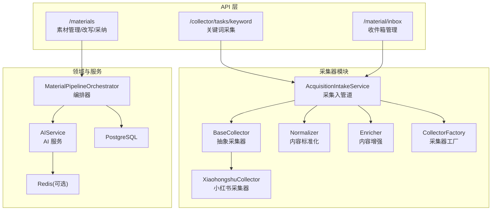
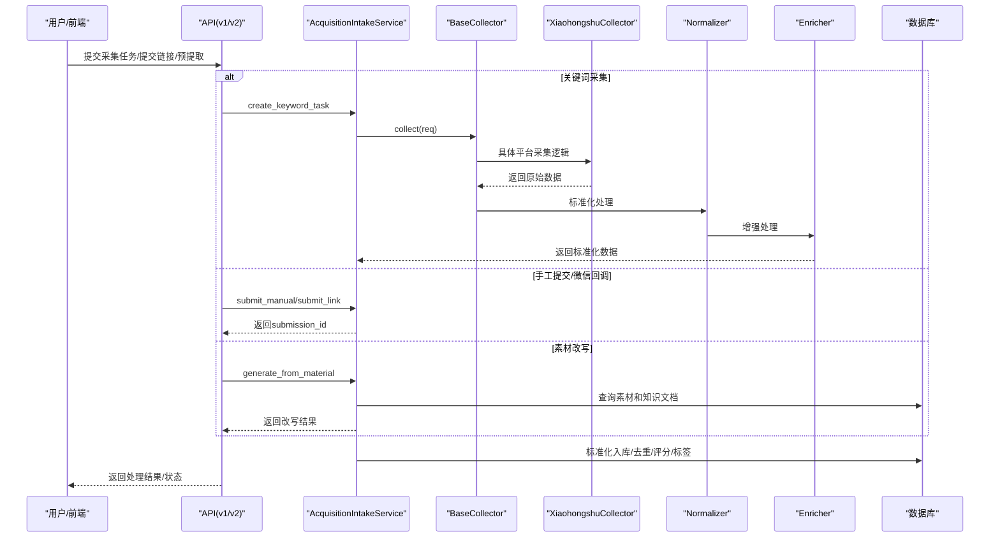
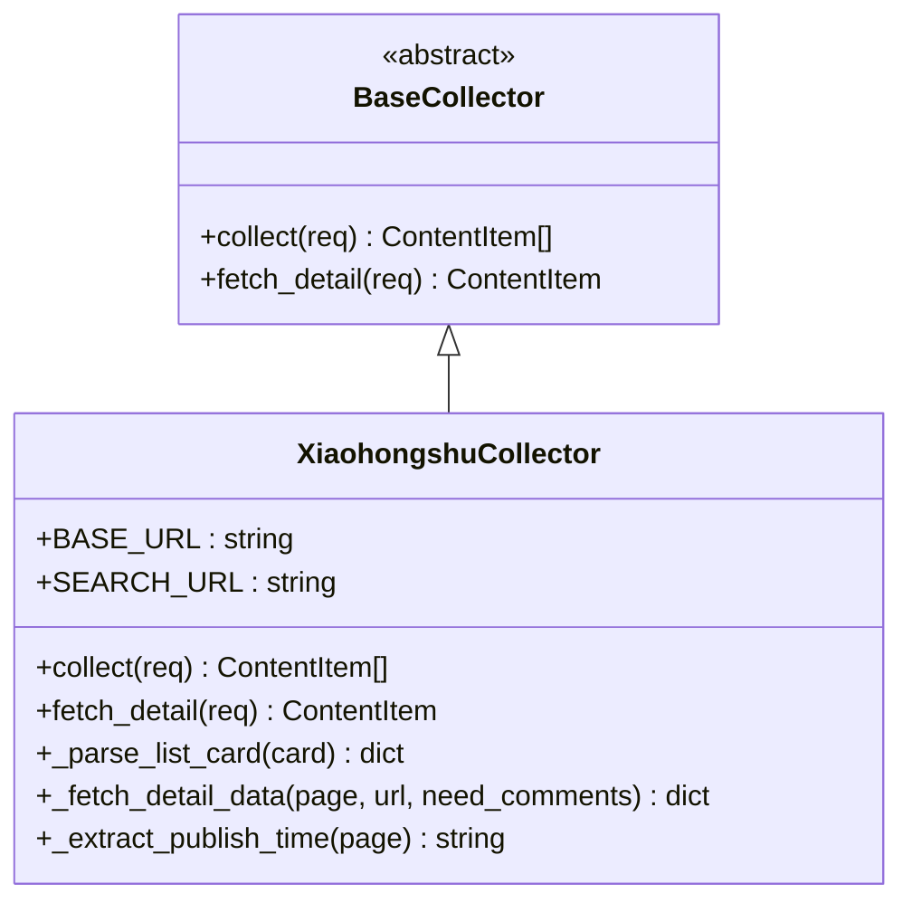
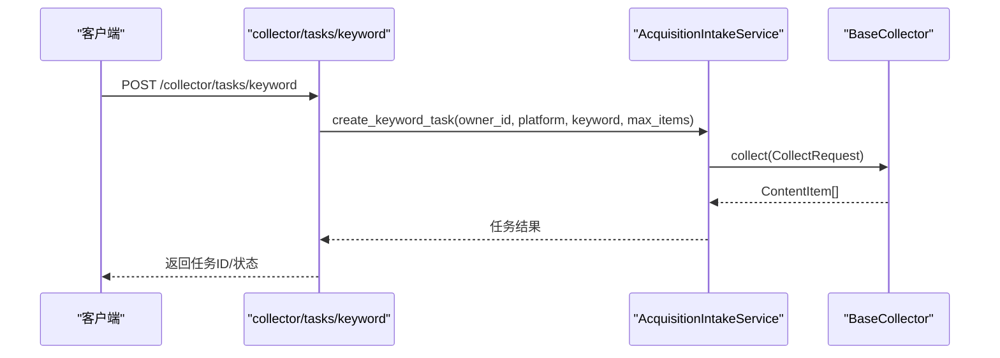
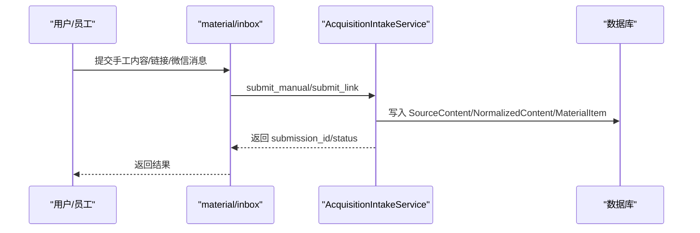
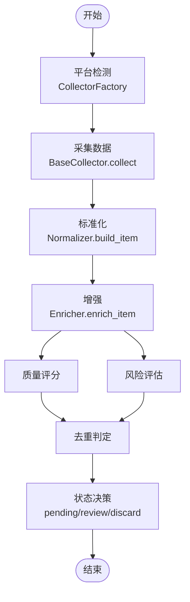
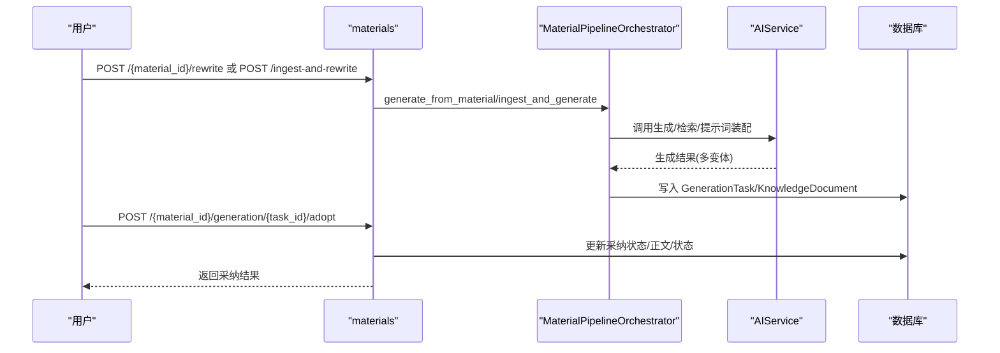
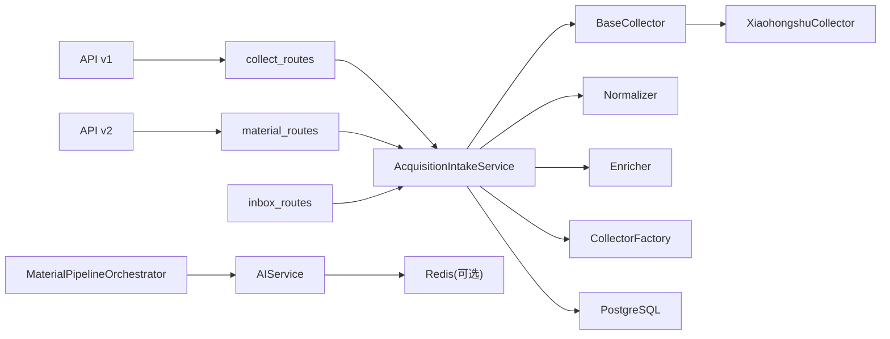

# 内容采集系统

<cite>
**本文引用的文件**
- [backend/README.md](file://backend/README.md)
- [backend/app/main.py](file://backend/app/main.py)
- [backend/app/collector/__init__.py](file://backend/app/collector/__init__.py)
- [backend/app/collector/adapters/base.py](file://backend/app/collector/adapters/base.py)
- [backend/app/collector/parsers/xiaohongshu.py](file://backend/app/collector/parsers/xiaohongshu.py)
- [backend/app/collector/services/normalizer.py](file://backend/app/collector/services/normalizer.py)
- [backend/app/collector/services/enricher.py](file://backend/app/collector/services/enricher.py)
- [backend/app/collector/services/factory.py](file://backend/app/collector/services/factory.py)
- [backend/app/collector/api/collect_routes.py](file://backend/app/collector/api/collect_routes.py)
- [backend/app/collector/api/inbox_routes.py](file://backend/app/collector/api/inbox_routes.py)
- [backend/app/collector/api/material_routes.py](file://backend/app/collector/api/material_routes.py)
- [backend/app/api/v1/endpoints/collect.py](file://backend/app/api/v1/endpoints/collect.py)
- [backend/app/api/v1/endpoints/inbox.py](file://backend/app/api/v1/endpoints/inbox.py)
- [backend/app/api/v1/endpoints/submissions.py](file://backend/app/api/v1/endpoints/submissions.py)
- [backend/app/api/v2/endpoints/collect.py](file://backend/app/api/v2/endpoints/collect.py)
- [backend/app/api/v2/endpoints/materials.py](file://backend/app/api/v2/endpoints/materials.py)
- [backend/app/services/collector/browser_collector_client.py](file://backend/app/services/collector/browser_collector_client.py)
- [backend/app/services/collector/intake_service.py](file://backend/app/services/collector/intake_service.py)
- [backend/app/services/collector/material_pipeline_service.py](file://backend/app/services/collector/material_pipeline_service.py)
- [backend/app/domains/acquisition/collect_service.py](file://backend/app/domains/acquisition/collect_service.py)
- [backend/app/rules/local/douyin.yaml](file://backend/app/rules/local/douyin.yaml)
- [backend/app/rules/local/xiaohongshu.yaml](file://backend/app/rules/local/xiaohongshu.yaml)
- [backend/app/rules/local/xianyu.yaml](file://backend/app/rules/local/xianyu.yaml)
</cite>

## 更新摘要
**所做更改**
- 新增完整的collector模块架构分析，包括适配器、解析器、服务和API组件
- 更新采集器架构图，展示新的模块化设计
- 新增BaseCollector抽象基类和XiaohongshuCollector具体实现
- 新增内容标准化、增强服务和工厂模式
- 更新API路由结构，分离v1和v2版本
- 移除原有的分散式浏览器采集客户端概念

## 目录
1. [简介](#简介)
2. [项目结构](#项目结构)
3. [核心组件](#核心组件)
4. [架构总览](#架构总览)
5. [详细组件分析](#详细组件分析)
6. [依赖关系分析](#依赖关系分析)
7. [性能考虑](#性能考虑)
8. [故障排查指南](#故障排查指南)
9. [结论](#结论)
10. [附录](#附录)

## 简介
本文件为"智获客内容采集系统"的功能文档，聚焦于采集任务管理、浏览器插件集成与手工内容提交的实现细节，系统性阐述内容解析与标准化流程（数据清洗、格式转换、质量评估），采集策略、频率控制与错误处理机制，并给出性能优化、并发控制与资源管理建议。同时提供配置项、参数说明、返回值定义及与其他组件的集成模式，最后总结常见问题与解决方案。

**更新** 本版本重点介绍了全新的collector模块架构，该架构采用模块化设计，将采集功能分解为适配器、解析器、服务和API四个层次，提供了更好的可扩展性和维护性。

## 项目结构
后端采用FastAPI + SQLAlchemy架构，新增了独立的collector模块，将采集功能重新组织为模块化架构。采集核心位于collector模块下，包括适配器层、解析器层、服务层和API层，配合规则库实现从"采集—清洗—标准化—知识—生成"的完整闭环。

**图表来源**
- [backend/app/collector/__init__.py:1-27](file://backend/app/collector/__init__.py#L1-L27)
- [backend/app/collector/adapters/base.py:9-17](file://backend/app/collector/adapters/base.py#L9-L17)
- [backend/app/collector/parsers/xiaohongshu.py:18-399](file://backend/app/collector/parsers/xiaohongshu.py#L18-L399)
- [backend/app/collector/services/normalizer.py:123-163](file://backend/app/collector/services/normalizer.py#L123-L163)
- [backend/app/collector/services/enricher.py:13-47](file://backend/app/collector/services/enricher.py#L13-L47)
- [backend/app/collector/services/factory.py:7-19](file://backend/app/collector/services/factory.py#L7-L19)

**章节来源**
- [backend/README.md:90-172](file://backend/README.md#L90-L172)
- [backend/app/main.py:1-4](file://backend/app/main.py#L1-L4)

## 核心组件
- **采集器适配器层**：BaseCollector定义了统一的采集接口，支持collect和fetch_detail两个核心方法，为不同平台提供统一的抽象。
- **平台解析器**：XiaohongshuCollector实现具体的采集逻辑，包括关键词搜索、详情页面解析、数据提取等功能。
- **内容标准化**：Normalizer负责数据清洗、格式转换和字段规范化，确保输出数据的一致性。
- **内容增强**：Enricher提供质量评分、风险评估、字段完整性检测等增强功能。
- **采集器工厂**：CollectorFactory根据平台类型返回相应的采集器实例，支持未来扩展更多平台。
- **采集入管道**：AcquisitionIntakeService协调整个采集流程，整合标准化、增强和存储功能。
- **API路由层**：分离v1和v2版本的API接口，提供关键词采集、收件箱管理和素材改写等功能。

**章节来源**
- [backend/app/collector/adapters/base.py:9-17](file://backend/app/collector/adapters/base.py#L9-L17)
- [backend/app/collector/parsers/xiaohongshu.py:18-399](file://backend/app/collector/parsers/xiaohongshu.py#L18-L399)
- [backend/app/collector/services/normalizer.py:123-163](file://backend/app/collector/services/normalizer.py#L123-L163)
- [backend/app/collector/services/enricher.py:13-47](file://backend/app/collector/services/enricher.py#L13-L47)
- [backend/app/collector/services/factory.py:7-19](file://backend/app/collector/services/factory.py#L7-L19)

## 架构总览
系统采用模块化架构设计，围绕"采集—标准化—增强—入管道—知识—生成"主线展开。新的collector模块将采集功能解耦为多个层次，每个层次职责明确，便于维护和扩展。

**图表来源**
- [backend/app/collector/api/collect_routes.py:18-34](file://backend/app/collector/api/collect_routes.py#L18-L34)
- [backend/app/collector/api/inbox_routes.py:78-92](file://backend/app/collector/api/inbox_routes.py#L78-L92)
- [backend/app/collector/api/material_routes.py:260-308](file://backend/app/collector/api/material_routes.py#L260-L308)
- [backend/app/collector/adapters/base.py:9-17](file://backend/app/collector/adapters/base.py#L9-L17)
- [backend/app/collector/parsers/xiaohongshu.py:30-101](file://backend/app/collector/parsers/xiaohongshu.py#L30-L101)

## 详细组件分析

### 采集器适配器层
BaseCollector定义了统一的采集接口规范，所有具体的采集器都必须实现这两个核心方法：

- **collect方法**：接收CollectRequest参数，返回ContentItem列表和采集统计信息
- **fetch_detail方法**：接收CollectDetailRequest参数，返回详细的ContentItem内容

这个抽象层确保了不同平台采集器的统一接口，便于扩展新的平台支持。

**章节来源**
- [backend/app/collector/adapters/base.py:9-17](file://backend/app/collector/adapters/base.py#L9-L17)

### XiaohongshuCollector平台解析器
XiaohongshuCollector是小红书平台的具体采集实现，具备以下核心功能：

- **关键词搜索**：通过Playwright模拟浏览器行为，访问小红书搜索页面
- **列表页面解析**：提取笔记卡片信息，包括标题、描述、作者、封面等
- **详情页面抓取**：自动滚动加载更多内容，解析详细信息如正文、发布时间、互动数据
- **数据清洗**：使用正则表达式和字符串处理函数清理和标准化数据
- **异常处理**：完善的错误捕获和处理机制，确保采集过程的稳定性

**图表来源**
- [backend/app/collector/adapters/base.py:9-17](file://backend/app/collector/adapters/base.py#L9-L17)
- [backend/app/collector/parsers/xiaohongshu.py:18-399](file://backend/app/collector/parsers/xiaohongshu.py#L18-L399)

**章节来源**
- [backend/app/collector/parsers/xiaohongshu.py:18-399](file://backend/app/collector/parsers/xiaohongshu.py#L18-L399)

### 内容标准化服务
Normalizer提供全面的数据清洗和标准化功能：

- **文本标准化**：去除特殊字符、合并多余空白、统一编码格式
- **URL标准化**：验证和清理图片URL，去除无效链接
- **数值标准化**：处理带单位的数字（如万、K），转换为标准整数
- **时间标准化**：统一时间格式，处理时区转换
- **标签标准化**：清理和去重标签，支持多种分隔符

**章节来源**
- [backend/app/collector/services/normalizer.py:123-163](file://backend/app/collector/services/normalizer.py#L123-L163)

### 内容增强服务
Enricher提供智能的内容分析和评分功能：

- **字段完整性评分**：基于必填字段的完整程度计算质量分数
- **互动指标分析**：计算参与度得分，评估内容的传播潜力
- **线索识别**：检测联系方式等转化意图信息
- **风险评估**：根据内容质量和完整性评估风险等级
- **状态更新**：自动更新内容的状态和元数据

**章节来源**
- [backend/app/collector/services/enricher.py:13-47](file://backend/app/collector/services/enricher.py#L13-L47)

### 采集器工厂模式
CollectorFactory提供简单的工厂模式实现，支持根据平台类型动态创建相应的采集器实例：

- **平台支持**：目前支持xiaohongshu平台，预留扩展其他平台的空间
- **错误处理**：对不支持的平台抛出明确的错误信息
- **扩展性**：易于添加新的平台采集器，只需在工厂中注册即可

**章节来源**
- [backend/app/collector/services/factory.py:7-19](file://backend/app/collector/services/factory.py#L7-L19)

### 采集任务管理（v1 关键词采集）
- **能力概述**：通过collector模块的新API接口，接收平台、关键词与最大条数，创建采集任务并触发相应的采集器。
- **关键流程**：
  - 参数校验：平台长度、关键词长度、最大条数范围。
  - 调用采集服务：AcquisitionIntakeService.create_keyword_task。
  - 异常处理：捕获异常并返回502。
- **返回值**：任务创建结果（包含任务标识与状态）。
- **错误处理**：平台识别失败、网络超时、采集服务不可用等。

**图表来源**
- [backend/app/collector/api/collect_routes.py:18-34](file://backend/app/collector/api/collect_routes.py#L18-L34)
- [backend/app/collector/adapters/base.py:9-17](file://backend/app/collector/adapters/base.py#L9-L17)

**章节来源**
- [backend/app/collector/api/collect_routes.py:18-34](file://backend/app/collector/api/collect_routes.py#L18-L34)

### 浏览器插件集成
**更新** 新架构中，浏览器插件集成功能已被collector模块完全替代，不再使用独立的BrowserCollectorClient。

新的集成方式：
- 通过BaseCollector接口直接调用平台特定的采集器
- XiaohongshuCollector内部使用Playwright进行浏览器自动化
- 支持关键词采集和单链接采集两种模式
- 自动处理去重、详情获取和异常恢复

**章节来源**
- [backend/app/collector/parsers/xiaohongshu.py:30-101](file://backend/app/collector/parsers/xiaohongshu.py#L30-L101)

### 手工内容提交
- **能力概述**：支持手动录入内容进入收件箱，统一进入review状态等待人工处理；支持员工提交链接与微信回调批量提交。
- **关键流程**：
  - 手工录入：/material/inbox/manual，提交平台、标题、正文、标签与备注，返回submission_id与状态。
  - 员工提交链接：/api/v1/employee-submissions/link，提交URL，返回submission_id与状态。
  - 微信回调：/api/v1/integrations/wechat/callback，从消息中提取URL列表，逐个提交并返回汇总结果。
- **参数说明**：
  - ManualInboxRequest：platform、title、content、tags、note。
  - EmployeeLinkSubmissionRequest：url、note。
  - WechatCallbackRequest：employee_id、message、note。
- **返回值**：统一返回提交结果与状态。

**图表来源**
- [backend/app/collector/api/inbox_routes.py:78-92](file://backend/app/collector/api/inbox_routes.py#L78-L92)
- [backend/app/services/collector/material_pipeline_service.py:696-768](file://backend/app/services/collector/material_pipeline_service.py#L696-L768)

**章节来源**
- [backend/app/collector/api/inbox_routes.py:78-92](file://backend/app/collector/api/inbox_routes.py#L78-L92)

### 内容解析与标准化流程
**更新** 新架构中的内容解析与标准化流程更加模块化：

- **平台识别**：基于BaseCollector接口和CollectorFactory工厂模式识别平台。
- **元数据提取**：XiaohongshuCollector专门处理小红书平台的数据提取。
- **标准化字段**：Normalizer统一清洗标题、正文、作者、封面、发布时间、互动指标等。
- **质量评估**：Enricher基于字段完整性、互动指标、线索识别等维度进行评分。
- **状态决策**：依据parse_status/risk_status/质量评分与来源通道，进入pending/review/discard状态机。

**图表来源**
- [backend/app/collector/services/factory.py:7-19](file://backend/app/collector/services/factory.py#L7-L19)
- [backend/app/collector/adapters/base.py:9-17](file://backend/app/collector/adapters/base.py#L9-L17)
- [backend/app/collector/services/normalizer.py:123-163](file://backend/app/collector/services/normalizer.py#L123-L163)
- [backend/app/collector/services/enricher.py:13-47](file://backend/app/collector/services/enricher.py#L13-L47)

**章节来源**
- [backend/app/collector/services/normalizer.py:123-163](file://backend/app/collector/services/normalizer.py#L123-L163)
- [backend/app/collector/services/enricher.py:13-47](file://backend/app/collector/services/enricher.py#L13-L47)

### 内容改写与采纳（v2 素材管道）
- **能力概述**：基于素材与知识文档检索生成多种文案变体，支持采纳与回滚，更新素材正文并置为待审核。
- **关键流程**：
  - 素材改写：/materials/{material_id}/rewrite，传入目标平台、账号类型、目标人群、任务类型。
  - 入管道即改写：/materials/ingest-and-rewrite，一次性完成采集、标准化、生成与落库。
  - 采纳改写：/materials/{material_id}/generation/{generation_task_id}/adopt，支持采纳与回滚。
- **返回值**：改写任务详情、采纳状态与更新后的素材正文。

**图表来源**
- [backend/app/collector/api/material_routes.py:260-308](file://backend/app/collector/api/material_routes.py#L260-L308)
- [backend/app/collector/api/material_routes.py:311-381](file://backend/app/collector/api/material_routes.py#L311-L381)

**章节来源**
- [backend/app/collector/api/material_routes.py:260-381](file://backend/app/collector/api/material_routes.py#L260-L381)

### URL 预提取（v2）
- **能力概述**：对输入URL进行平台识别与元数据预提取，返回标题、作者、内容预览等。
- **关键流程**：
  - 校验URL完整性。
  - 调用CollectService.detect_platform与fetch_url_meta。
  - 返回平台标识、标签、元数据与提取状态。
- **返回值**：包含平台、标签、标题、内容预览、作者、提取成功标志与提示信息。

**章节来源**
- [backend/app/api/v2/endpoints/collect.py:172-197](file://backend/app/api/v2/endpoints/collect.py#L172-L197)

### 采集策略、频率控制与错误处理
**更新** 新架构下的采集策略更加灵活和模块化：

- **采集策略**：
  - 关键词采集：支持去重与详情拉取，最大条数限制。
  - 单链接采集：自动识别平台，不支持的平台抛出异常。
  - URL预提取：轻量抓取，仅解析必要元信息。
- **频率控制与限流**：
  - 后端提供运维健康检查端点，可用于部署后验证数据库、Redis、Ollama状态。
  - 可通过配置启用Redis分布式限流（Redis不可用时自动降级）。
- **错误处理**：
  - 采集失败：返回502，并携带详细错误信息。
  - URL不完整：返回400。
  - 资源不存在：返回404。
  - 状态机冲突：返回409。

**章节来源**
- [backend/app/collector/api/collect_routes.py:24-34](file://backend/app/collector/api/collect_routes.py#L24-L34)
- [backend/app/collector/parsers/xiaohongshu.py:88-92](file://backend/app/collector/parsers/xiaohongshu.py#L88-L92)

## 依赖关系分析

**图表来源**
- [backend/app/collector/api/collect_routes.py:18-34](file://backend/app/collector/api/collect_routes.py#L18-L34)
- [backend/app/collector/api/material_routes.py:260-308](file://backend/app/collector/api/material_routes.py#L260-L308)
- [backend/app/collector/api/inbox_routes.py:78-92](file://backend/app/collector/api/inbox_routes.py#L78-L92)
- [backend/app/collector/adapters/base.py:9-17](file://backend/app/collector/adapters/base.py#L9-L17)
- [backend/app/collector/parsers/xiaohongshu.py:18-399](file://backend/app/collector/parsers/xiaohongshu.py#L18-L399)

**章节来源**
- [backend/app/collector/__init__.py:1-27](file://backend/app/collector/__init__.py#L1-L27)

## 性能考虑
**更新** 新架构在性能方面有显著改进：

- **模块化设计**：清晰的职责分离减少了不必要的耦合，提高了代码复用率。
- **异步处理**：采集器内部使用Playwright进行异步操作，减少阻塞时间。
- **资源管理**：自动化的浏览器资源管理，确保上下文和页面的正确关闭。
- **缓存策略**：标准化和增强服务支持结果缓存，减少重复计算。
- **并发控制**：通过工厂模式和适配器接口，便于实现并发采集和任务调度。
- **内存优化**：标准化服务对长文本进行智能截断，避免内存溢出。

## 故障排查指南
**更新** 新架构的故障排查更加系统化：

- **采集失败**：
  - 检查BaseCollector接口实现是否正确
  - 验证Playwright环境和浏览器驱动
  - 查看CollectorFactory的平台支持情况
- **数据异常**：
  - 检查Normalizer的标准化规则
  - 验证Enricher的评分算法
  - 确认数据库连接和事务处理
- **API错误**：
  - 使用新的collector API端点进行测试
  - 检查认证和权限配置
  - 验证请求参数的格式和范围
- **性能问题**：
  - 监控采集器的资源使用情况
  - 优化Playwright的等待时间和超时设置
  - 调整并发数量和队列大小

**章节来源**
- [backend/app/collector/parsers/xiaohongshu.py:102-106](file://backend/app/collector/parsers/xiaohongshu.py#L102-L106)
- [backend/app/collector/services/enricher.py:32-44](file://backend/app/collector/services/enricher.py#L32-L44)

## 结论
新架构通过模块化的collector设计，实现了更加清晰、可维护和可扩展的内容采集系统。BaseCollector抽象接口、XiaohongshuCollector具体实现、Normalizer标准化服务、Enricher增强服务和CollectorFactory工厂模式共同构成了完整的采集生态系统。这种设计不仅保持了原有功能的完整性，还为未来的平台扩展和技术升级奠定了坚实基础。

## 附录

### 配置选项与参数说明
**更新** 新架构的配置选项更加丰富：

- **采集器配置**
  - platform：平台标识（支持xiaohongshu等）
  - keyword：关键词（1-255字符）
  - max_items：最大条数（1-100）
  - need_detail：是否需要详情
  - dedup：是否去重
  - timeout_sec：请求超时秒数
- **手工提交**
  - ManualInboxRequest：platform、title、content、tags、note
  - EmployeeLinkSubmissionRequest：url、note
  - WechatCallbackRequest：employee_id、message、note
- **素材改写**
  - MaterialRewriteRequest：target_platform、account_type、target_audience、task_type
  - MaterialIngestAndRewriteRequest：platform、title、content_text、source_url、author_name、tags、note、raw_payload、target_platform、account_type、target_audience、task_type

**章节来源**
- [backend/app/collector/api/collect_routes.py:12-16](file://backend/app/collector/api/collect_routes.py#L12-L16)
- [backend/app/collector/api/inbox_routes.py:16-22](file://backend/app/collector/api/inbox_routes.py#L16-L22)
- [backend/app/collector/api/material_routes.py:25-44](file://backend/app/collector/api/material_routes.py#L25-L44)

### 返回值定义
**更新** 新架构的返回值更加标准化：

- **关键词采集**：任务创建结果（包含任务标识与状态）
- **手工提交**：submission_id与状态
- **URL预提取**：平台、标签、标题、内容预览、作者、提取成功标志与提示信息
- **素材改写**：生成任务详情与变体列表
- **采纳改写**：采纳状态、更新后的素材正文与状态
- **采集结果**：ContentItem列表和采集统计信息

**章节来源**
- [backend/app/collector/adapters/base.py:11-16](file://backend/app/collector/adapters/base.py#L11-L16)
- [backend/app/collector/api/collect_routes.py:24-34](file://backend/app/collector/api/collect_routes.py#L24-L34)

### 平台规则文件
**更新** 新架构支持更多平台的规则扩展：

- **平台规则文件**：用于扩展各平台的规则集，当前示例为空数组，便于后续注入规则
- **扩展支持**：通过CollectorFactory可以轻松添加新的平台支持
- **配置管理**：每个平台的采集规则和参数都可以独立配置

**章节来源**
- [backend/app/collector/services/factory.py:7-19](file://backend/app/collector/services/factory.py#L7-L19)
- [backend/app/rules/local/douyin.yaml:1-4](file://backend/app/rules/local/douyin.yaml#L1-L4)
- [backend/app/rules/local/xiaohongshu.yaml:1-4](file://backend/app/rules/local/xiaohongshu.yaml#L1-L4)
- [backend/app/rules/local/xianyu.yaml:1-4](file://backend/app/rules/local/xianyu.yaml#L1-L4)