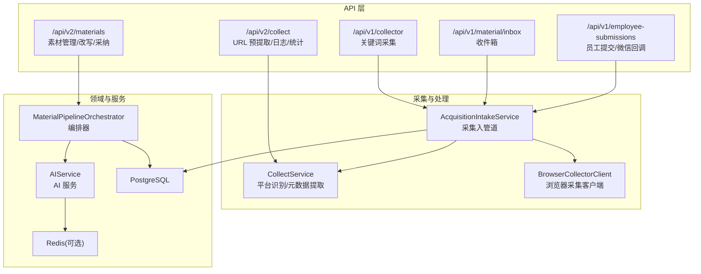
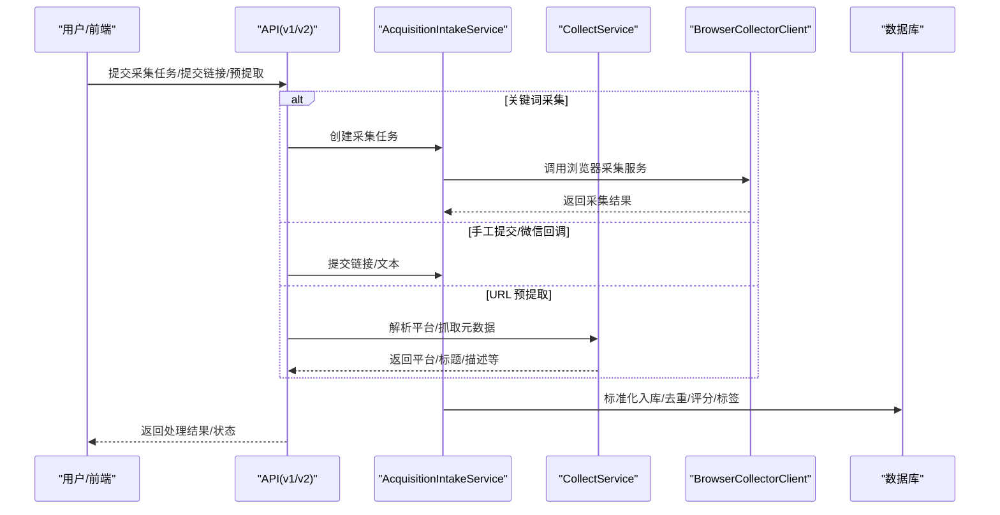
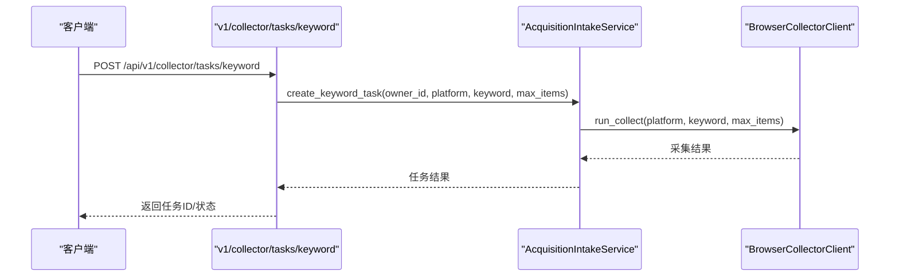
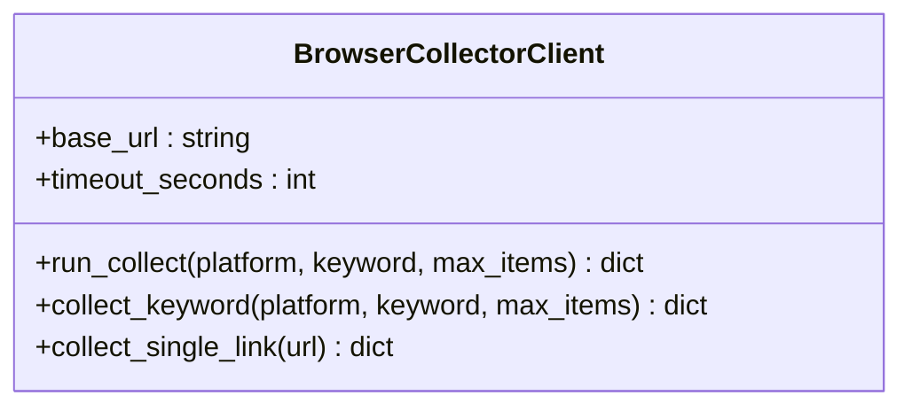
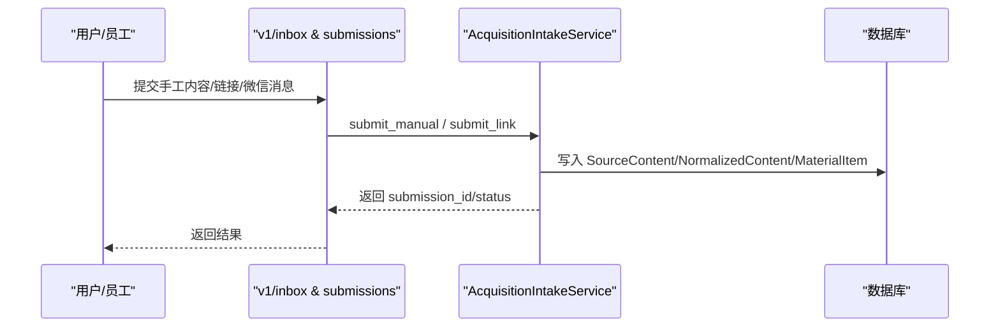
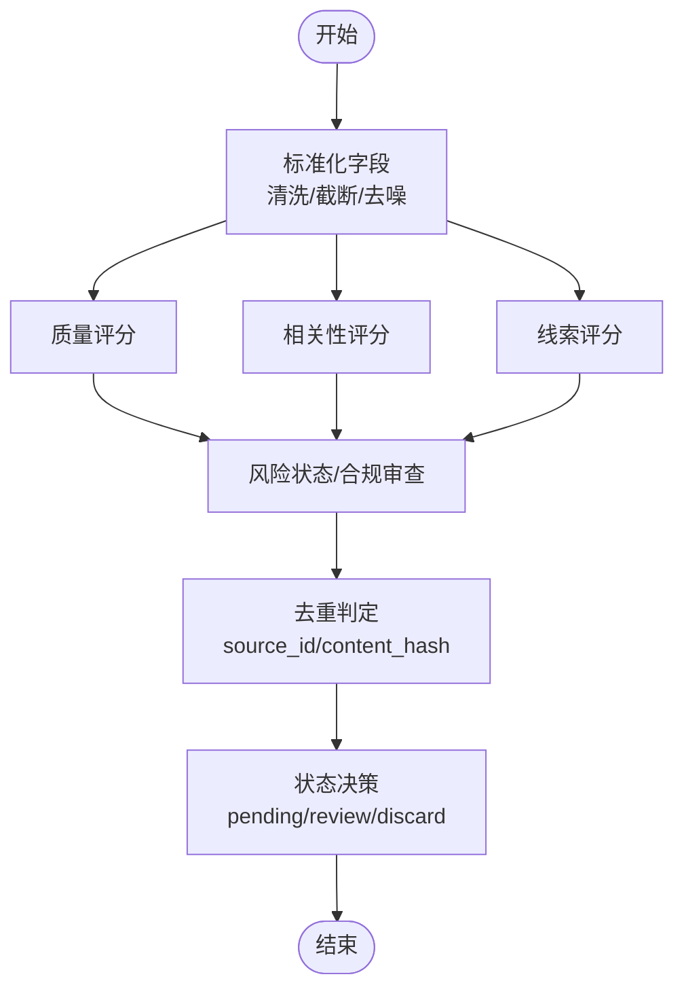
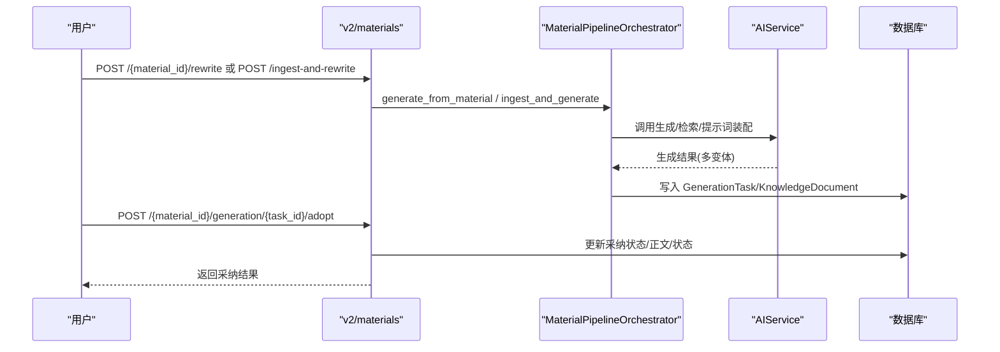
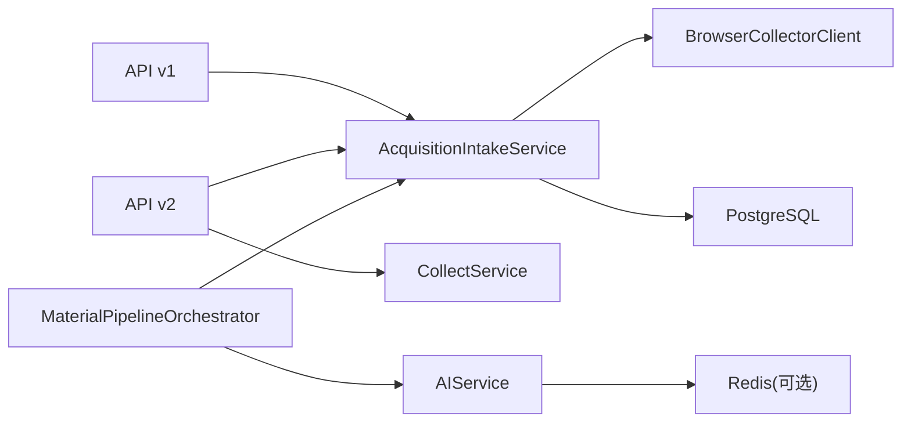

# 内容采集系统

<cite>
**本文引用的文件**
- [backend/README.md](file://backend/README.md)
- [backend/app/main.py](file://backend/app/main.py)
- [backend/app/api/endpoints/collect.py](file://backend/app/api/endpoints/collect.py)
- [backend/app/services/collect_service.py](file://backend/app/services/collect_service.py)
- [backend/app/domains/acquisition/collect_service.py](file://backend/app/domains/acquisition/collect_service.py)
- [backend/app/services/collector/intake_service.py](file://backend/app/services/collector/intake_service.py)
- [backend/app/services/collector/material_pipeline_service.py](file://backend/app/services/collector/material_pipeline_service.py)
- [backend/app/api/v1/endpoints/collect.py](file://backend/app/api/v1/endpoints/collect.py)
- [backend/app/api/v1/endpoints/inbox.py](file://backend/app/api/v1/endpoints/inbox.py)
- [backend/app/api/v1/endpoints/submissions.py](file://backend/app/api/v1/endpoints/submissions.py)
- [backend/app/api/v2/endpoints/collect.py](file://backend/app/api/v2/endpoints/collect.py)
- [backend/app/api/v2/endpoints/materials.py](file://backend/app/api/v2/endpoints/materials.py)
- [backend/app/services/collector/browser_collector_client.py](file://backend/app/services/collector/browser_collector_client.py)
- [backend/app/rules/local/douyin.yaml](file://backend/app/rules/local/douyin.yaml)
- [backend/app/rules/local/xiaohongshu.yaml](file://backend/app/rules/local/xiaohongshu.yaml)
- [backend/app/rules/local/xianyu.yaml](file://backend/app/rules/local/xianyu.yaml)
</cite>

## 目录
1. [简介](#简介)
2. [项目结构](#项目结构)
3. [核心组件](#核心组件)
4. [架构总览](#架构总览)
5. [详细组件分析](#详细组件分析)
6. [依赖关系分析](#依赖关系分析)
7. [性能考虑](#性能考虑)
8. [故障排查指南](#故障排查指南)
9. [结论](#结论)
10. [附录](#附录)

## 简介
本文件为“智获客内容采集系统”的功能文档，聚焦于采集任务管理、浏览器插件集成与手工内容提交的实现细节，系统性阐述内容解析与标准化流程（数据清洗、格式转换、质量评估），采集策略、频率控制与错误处理机制，并给出性能优化、并发控制与资源管理建议。同时提供配置项、参数说明、返回值定义及与其他组件的集成模式，最后总结常见问题与解决方案。

## 项目结构
后端采用 FastAPI + SQLAlchemy 架构，API 层分为 v1 与 v2 两条管线，分别对应旧采集接口与新素材管道；采集核心位于 domains/acquisition 与 services/collector 下，配合浏览器采集客户端与规则库实现从“采集—清洗—标准化—知识—生成”的闭环。

图表来源
- [backend/app/api/v1/endpoints/collect.py:18-33](file://backend/app/api/v1/endpoints/collect.py#L18-L33)
- [backend/app/api/v1/endpoints/inbox.py:73-91](file://backend/app/api/v1/endpoints/inbox.py#L73-L91)
- [backend/app/api/v1/endpoints/submissions.py:31-48](file://backend/app/api/v1/endpoints/submissions.py#L31-L48)
- [backend/app/api/v2/endpoints/collect.py:172-197](file://backend/app/api/v2/endpoints/collect.py#L172-L197)
- [backend/app/api/v2/endpoints/materials.py:284-308](file://backend/app/api/v2/endpoints/materials.py#L284-L308)
- [backend/app/domains/acquisition/collect_service.py:74-285](file://backend/app/domains/acquisition/collect_service.py#L74-L285)
- [backend/app/services/collector/browser_collector_client.py:9-39](file://backend/app/services/collector/browser_collector_client.py#L9-L39)
- [backend/app/services/collector/material_pipeline_service.py:30-800](file://backend/app/services/collector/material_pipeline_service.py#L30-L800)

章节来源
- [backend/README.md:90-172](file://backend/README.md#L90-L172)
- [backend/app/main.py:1-4](file://backend/app/main.py#L1-L4)

## 核心组件
- 平台识别与元数据提取：CollectService 提供平台识别、HTML 元信息抽取、标题/描述/作者清洗与长度限制。
- 采集入管道：AcquisitionIntakeService 实现采集数据的标准化、质量评分、相关性评分、线索评分、热力等级、标签体系、合规审查与重复判定，最终落库并构建知识文档与分块。
- 浏览器采集客户端：BrowserCollectorClient 封装浏览器采集服务的调用，支持关键词采集与单链接采集。
- API 管线：
  - v1：关键词采集任务、收件箱、员工提交与微信回调。
  - v2：URL 预提取、采集日志与统计、素材管理与改写、采纳。

章节来源
- [backend/app/domains/acquisition/collect_service.py:74-285](file://backend/app/domains/acquisition/collect_service.py#L74-L285)
- [backend/app/services/collector/material_pipeline_service.py:30-800](file://backend/app/services/collector/material_pipeline_service.py#L30-L800)
- [backend/app/services/collector/browser_collector_client.py:9-39](file://backend/app/services/collector/browser_collector_client.py#L9-L39)
- [backend/app/api/v1/endpoints/collect.py:18-33](file://backend/app/api/v1/endpoints/collect.py#L18-L33)
- [backend/app/api/v1/endpoints/inbox.py:73-91](file://backend/app/api/v1/endpoints/inbox.py#L73-L91)
- [backend/app/api/v1/endpoints/submissions.py:31-48](file://backend/app/api/v1/endpoints/submissions.py#L31-L48)
- [backend/app/api/v2/endpoints/collect.py:172-197](file://backend/app/api/v2/endpoints/collect.py#L172-L197)
- [backend/app/api/v2/endpoints/materials.py:284-308](file://backend/app/api/v2/endpoints/materials.py#L284-L308)

## 架构总览
系统围绕“采集—清洗—标准化—知识—生成”主线展开，v1 与 v2 API 分别承担不同阶段的入口与能力，采集来源包括关键词任务、员工提交、微信机器人回调与浏览器插件。

图表来源
- [backend/app/api/v1/endpoints/collect.py:18-33](file://backend/app/api/v1/endpoints/collect.py#L18-L33)
- [backend/app/api/v1/endpoints/inbox.py:73-91](file://backend/app/api/v1/endpoints/inbox.py#L73-L91)
- [backend/app/api/v1/endpoints/submissions.py:31-48](file://backend/app/api/v1/endpoints/submissions.py#L31-L48)
- [backend/app/api/v2/endpoints/collect.py:172-197](file://backend/app/api/v2/endpoints/collect.py#L172-L197)
- [backend/app/services/collector/material_pipeline_service.py:30-800](file://backend/app/services/collector/material_pipeline_service.py#L30-L800)
- [backend/app/services/collector/browser_collector_client.py:16-39](file://backend/app/services/collector/browser_collector_client.py#L16-L39)
- [backend/app/domains/acquisition/collect_service.py:118-157](file://backend/app/domains/acquisition/collect_service.py#L118-L157)

## 详细组件分析

### 采集任务管理（v1 关键词采集）
- 能力概述：接收平台、关键词与最大条数，创建采集任务并触发浏览器采集服务。
- 关键流程：
  - 参数校验：平台长度、关键词长度、最大条数范围。
  - 调用采集服务：AcquisitionIntakeService.create_keyword_task。
  - 异常处理：捕获异常并返回 502。
- 返回值：任务创建结果（包含任务标识与状态）。
- 错误处理：平台识别失败、网络超时、采集服务不可用等。

图表来源
- [backend/app/api/v1/endpoints/collect.py:18-33](file://backend/app/api/v1/endpoints/collect.py#L18-L33)
- [backend/app/services/collector/browser_collector_client.py:16-39](file://backend/app/services/collector/browser_collector_client.py#L16-L39)

章节来源
- [backend/app/api/v1/endpoints/collect.py:12-33](file://backend/app/api/v1/endpoints/collect.py#L12-L33)
- [backend/app/services/collector/browser_collector_client.py:16-39](file://backend/app/services/collector/browser_collector_client.py#L16-L39)

### 浏览器插件集成
- 能力概述：通过 BrowserCollectorClient 调用浏览器采集服务，支持关键词采集与单链接采集。
- 关键流程：
  - 构造请求体：包含平台、关键词/URL、最大条数、是否需要详情、是否去重、超时。
  - 发送请求至 /api/collect/run。
  - 返回采集结果并交由采集入管道处理。
- 参数说明：
  - platform：平台标识（如 xiaohongshu、douyin 等）。
  - keyword/url：关键词或完整链接。
  - max_items：最大采集条数（1–100）。
  - need_detail：是否需要详情。
  - dedup：是否去重。
  - timeout_sec：请求超时秒数。
- 返回值：采集结果对象（包含条目列表与状态）。

图表来源
- [backend/app/services/collector/browser_collector_client.py:9-39](file://backend/app/services/collector/browser_collector_client.py#L9-L39)

章节来源
- [backend/app/services/collector/browser_collector_client.py:12-39](file://backend/app/services/collector/browser_collector_client.py#L12-L39)

### 手工内容提交
- 能力概述：支持手动录入内容进入收件箱，统一进入 review 状态等待人工处理；支持员工提交链接与微信回调批量提交。
- 关键流程：
  - 手工录入：/api/v1/material/inbox/manual，提交平台、标题、正文、标签与备注，返回 submission_id 与状态。
  - 员工提交链接：/api/v1/employee-submissions/link，提交 URL，返回 submission_id 与状态。
  - 微信回调：/api/v1/integrations/wechat/callback，从消息中提取 URL 列表，逐个提交并返回汇总结果。
- 参数说明：
  - ManualInboxRequest：platform、title、content、tags、note。
  - EmployeeLinkSubmissionRequest：url、note。
  - WechatCallbackRequest：employee_id、message、note。
- 返回值：统一返回提交结果与状态。

图表来源
- [backend/app/api/v1/endpoints/inbox.py:73-91](file://backend/app/api/v1/endpoints/inbox.py#L73-L91)
- [backend/app/api/v1/endpoints/submissions.py:31-48](file://backend/app/api/v1/endpoints/submissions.py#L31-L48)
- [backend/app/services/collector/material_pipeline_service.py:696-768](file://backend/app/services/collector/material_pipeline_service.py#L696-L768)

章节来源
- [backend/app/api/v1/endpoints/inbox.py:16-91](file://backend/app/api/v1/endpoints/inbox.py#L16-L91)
- [backend/app/api/v1/endpoints/submissions.py:15-87](file://backend/app/api/v1/endpoints/submissions.py#L15-L87)

### 内容解析与标准化流程
- 平台识别：基于正则匹配识别平台（如小红书、抖音、知乎等）。
- 元数据提取：优先抓取 og:title/description/author 等，其次回退到 title 与 twitter:* 标签，清洗 HTML 与实体字符。
- 标准化字段：统一清洗标题、正文、作者、封面、发布时间、互动指标等，生成 content_hash 用于去重。
- 质量评估：根据是否存在标题/正文/作者/封面/时间等维度打分，上限 100。
- 相关性评分：基于关键词与目标词集合计算，上限 100。
- 线索评分：识别“转化意图”关键词与联系方式，分级 low/medium/high。
- 热力等级：基于点赞/评论/收藏/分享计分，分级 low/medium/high。
- 标签体系：话题标签、意图标签、人群标签、风险等级、热度分与原因说明。
- 合规审查：调用合规服务进行初审与纠偏，支持自定义高危词替换，二次复核并判定发布阻断阈值。
- 重复判定：优先按 source_id 匹配，其次按 content_hash 匹配，避免重复入库。
- 状态决策：依据 parse_status/risk_status/质量/相关性/线索评分与来源通道，进入 pending/review/discard 状态机。

图表来源
- [backend/app/services/collector/material_pipeline_service.py:228-259](file://backend/app/services/collector/material_pipeline_service.py#L228-L259)
- [backend/app/services/collector/material_pipeline_service.py:272-302](file://backend/app/services/collector/material_pipeline_service.py#L272-L302)
- [backend/app/services/collector/material_pipeline_service.py:304-340](file://backend/app/services/collector/material_pipeline_service.py#L304-L340)
- [backend/app/services/collector/material_pipeline_service.py:413-469](file://backend/app/services/collector/material_pipeline_service.py#L413-L469)
- [backend/app/services/collector/material_pipeline_service.py:591-627](file://backend/app/services/collector/material_pipeline_service.py#L591-L627)
- [backend/app/services/collector/material_pipeline_service.py:660-693](file://backend/app/services/collector/material_pipeline_service.py#L660-L693)
- [backend/app/services/collector/material_pipeline_service.py:630-658](file://backend/app/services/collector/material_pipeline_service.py#L630-L658)

章节来源
- [backend/app/domains/acquisition/collect_service.py:78-157](file://backend/app/domains/acquisition/collect_service.py#L78-L157)
- [backend/app/services/collector/material_pipeline_service.py:129-190](file://backend/app/services/collector/material_pipeline_service.py#L129-L190)
- [backend/app/services/collector/material_pipeline_service.py:413-469](file://backend/app/services/collector/material_pipeline_service.py#L413-L469)
- [backend/app/services/collector/material_pipeline_service.py:591-627](file://backend/app/services/collector/material_pipeline_service.py#L591-L627)
- [backend/app/services/collector/material_pipeline_service.py:630-658](file://backend/app/services/collector/material_pipeline_service.py#L630-L658)
- [backend/app/services/collector/material_pipeline_service.py:660-693](file://backend/app/services/collector/material_pipeline_service.py#L660-L693)

### 内容改写与采纳（v2 素材管道）
- 能力概述：基于素材与知识文档检索生成多种文案变体，支持采纳与回滚，更新素材正文并置为待审核。
- 关键流程：
  - 素材改写：/api/v2/materials/{material_id}/rewrite，传入目标平台、账号类型、目标人群、任务类型。
  - 入管道即改写：/api/v2/materials/ingest-and-rewrite，一次性完成采集、标准化、生成与落库。
  - 采纳改写：/api/v2/materials/{material_id}/generation/{generation_task_id}/adopt，支持采纳与回滚。
- 返回值：改写任务详情、采纳状态与更新后的素材正文。

图表来源
- [backend/app/api/v2/endpoints/materials.py:260-281](file://backend/app/api/v2/endpoints/materials.py#L260-L281)
- [backend/app/api/v2/endpoints/materials.py:284-308](file://backend/app/api/v2/endpoints/materials.py#L284-L308)
- [backend/app/api/v2/endpoints/materials.py:311-381](file://backend/app/api/v2/endpoints/materials.py#L311-L381)

章节来源
- [backend/app/api/v2/endpoints/materials.py:260-381](file://backend/app/api/v2/endpoints/materials.py#L260-L381)

### URL 预提取（v2）
- 能力概述：对输入 URL 进行平台识别与元数据预提取，返回标题、作者、内容预览等。
- 关键流程：
  - 校验 URL 完整性。
  - 调用 CollectService.detect_platform 与 fetch_url_meta。
  - 返回平台标识、标签、元数据与提取状态。
- 返回值：包含平台、标签、标题、内容预览、作者、提取成功标志与提示信息。

章节来源
- [backend/app/api/v2/endpoints/collect.py:172-197](file://backend/app/api/v2/endpoints/collect.py#L172-L197)
- [backend/app/domains/acquisition/collect_service.py:78-157](file://backend/app/domains/acquisition/collect_service.py#L78-L157)

### 采集策略、频率控制与错误处理
- 采集策略：
  - 关键词采集：支持去重与详情拉取，最大条数限制。
  - 单链接采集：自动识别平台，不支持的平台抛出异常。
  - URL 预提取：轻量抓取，仅解析必要元信息。
- 频率控制与限流：
  - 后端提供运维健康检查端点，可用于部署后验证数据库、Redis、Ollama 状态。
  - 可通过配置启用 Redis 分布式限流（Redis 不可用时自动降级）。
- 错误处理：
  - 采集失败：返回 502，并携带详细错误信息。
  - URL 不完整：返回 400。
  - 资源不存在：返回 404。
  - 状态机冲突：返回 409。

章节来源
- [backend/app/api/v1/endpoints/collect.py:24-33](file://backend/app/api/v1/endpoints/collect.py#L24-L33)
- [backend/app/api/v2/endpoints/collect.py:177-179](file://backend/app/api/v2/endpoints/collect.py#L177-L179)
- [backend/app/api/v1/endpoints/submissions.py:57-59](file://backend/app/api/v1/endpoints/submissions.py#L57-L59)
- [backend/README.md:160-221](file://backend/README.md#L160-L221)

## 依赖关系分析

图表来源
- [backend/app/api/v1/endpoints/collect.py:18-33](file://backend/app/api/v1/endpoints/collect.py#L18-L33)
- [backend/app/api/v2/endpoints/collect.py:172-197](file://backend/app/api/v2/endpoints/collect.py#L172-L197)
- [backend/app/api/v2/endpoints/materials.py:260-308](file://backend/app/api/v2/endpoints/materials.py#L260-L308)
- [backend/app/services/collector/material_pipeline_service.py:30-800](file://backend/app/services/collector/material_pipeline_service.py#L30-L800)
- [backend/app/services/collector/browser_collector_client.py:9-39](file://backend/app/services/collector/browser_collector_client.py#L9-L39)

章节来源
- [backend/app/api/v1/endpoints/inbox.py:150-164](file://backend/app/api/v1/endpoints/inbox.py#L150-L164)
- [backend/app/api/v2/endpoints/materials.py:260-308](file://backend/app/api/v2/endpoints/materials.py#L260-L308)

## 性能考虑
- 并发与异步：
  - URL 元数据抓取采用异步 HTTP 客户端，减少阻塞。
  - 采集任务与改写任务可并行执行，避免串行瓶颈。
- 资源管理：
  - 标准化与清洗采用正则与字符串处理，注意内存占用；对长文本进行截断与分块。
  - 去重优先使用 source_id，其次 content_hash，降低数据库压力。
- 存储与索引：
  - 建议在 owner_id、platform、status、risk_status、created_at 等常用查询字段建立索引。
- 缓存与限流：
  - 对热点平台与关键词可引入缓存层（如 Redis）以降低重复抓取。
  - 启用分布式限流，保障上游采集服务稳定性。

## 故障排查指南
- 常见问题与定位：
  - 采集失败：检查浏览器采集服务可达性、超时配置与网络策略。
  - URL 无法识别：确认 URL 完整性与平台正则覆盖范围。
  - 重复素材：确认 source_id 与 content_hash 是否正确生成。
  - 合规阻断：检查自定义高危词配置与阈值设置。
- 运维健康检查：
  - 通过 /api/system/ops/health 与 /api/system/ops/readiness 验证数据库、Redis、Ollama 状态。
- 日志与追踪：
  - 采集日志可通过 /api/v2/collect/logs 查询，按 source_type 过滤。
  - 统计接口 /api/v2/collect/stats 提供总量、重复数、按平台/状态分布。

章节来源
- [backend/README.md:197-221](file://backend/README.md#L197-L221)
- [backend/app/api/v2/endpoints/collect.py:245-297](file://backend/app/api/v2/endpoints/collect.py#L245-L297)

## 结论
本系统通过清晰的 API 分层与强大的采集入管道，实现了从“采集—清洗—标准化—知识—生成”的完整闭环。v1 与 v2 并行演进，既保证兼容性又逐步引入更完善的素材管理与改写能力。结合合规审查、重复判定与状态机控制，系统在保证内容质量的同时提升了运营效率。

## 附录

### 配置选项与参数说明
- 浏览器采集客户端
  - base_url：浏览器采集服务基础地址。
  - timeout_seconds：请求超时秒数。
- 关键词采集任务
  - platform：平台标识（2–30 字符）。
  - keyword：关键词（1–255 字符）。
  - max_items：最大条数（1–100）。
- 手工提交
  - ManualInboxRequest：platform、title、content、tags、note。
  - EmployeeLinkSubmissionRequest：url、note。
  - WechatCallbackRequest：employee_id、message、note。
- URL 预提取
  - ExtractFromUrlRequest：url。
- 素材改写
  - MaterialRewriteRequest：target_platform、account_type、target_audience、task_type。
  - MaterialIngestAndRewriteRequest：platform、title、content_text、source_url、author_name、tags、note、raw_payload、target_platform、account_type、target_audience、task_type。

章节来源
- [backend/app/services/collector/browser_collector_client.py:12-14](file://backend/app/services/collector/browser_collector_client.py#L12-L14)
- [backend/app/api/v1/endpoints/collect.py:12-15](file://backend/app/api/v1/endpoints/collect.py#L12-L15)
- [backend/app/api/v1/endpoints/inbox.py:16-21](file://backend/app/api/v1/endpoints/inbox.py#L16-L21)
- [backend/app/api/v1/endpoints/submissions.py:15-23](file://backend/app/api/v1/endpoints/submissions.py#L15-L23)
- [backend/app/api/v2/endpoints/collect.py:15-16](file://backend/app/api/v2/endpoints/collect.py#L15-L16)
- [backend/app/api/v2/endpoints/materials.py:25-44](file://backend/app/api/v2/endpoints/materials.py#L25-L44)

### 返回值定义
- 关键词采集：任务创建结果（包含任务标识与状态）。
- 手工提交：submission_id 与状态。
- URL 预提取：平台、标签、标题、内容预览、作者、提取成功标志与提示信息。
- 素材改写：生成任务详情与变体列表。
- 采纳改写：采纳状态、更新后的素材正文与状态。

章节来源
- [backend/app/api/v1/endpoints/collect.py:24-33](file://backend/app/api/v1/endpoints/collect.py#L24-L33)
- [backend/app/api/v1/endpoints/inbox.py:82-91](file://backend/app/api/v1/endpoints/inbox.py#L82-L91)
- [backend/app/api/v2/endpoints/collect.py:184-197](file://backend/app/api/v2/endpoints/collect.py#L184-L197)
- [backend/app/api/v2/endpoints/materials.py:260-308](file://backend/app/api/v2/endpoints/materials.py#L260-L308)

### 平台规则文件
- 平台规则文件（空规则示例）：用于扩展各平台的规则集，当前示例为空数组，便于后续注入规则。

章节来源
- [backend/app/rules/local/douyin.yaml:1-4](file://backend/app/rules/local/douyin.yaml#L1-L4)
- [backend/app/rules/local/xiaohongshu.yaml:1-4](file://backend/app/rules/local/xiaohongshu.yaml#L1-L4)
- [backend/app/rules/local/xianyu.yaml:1-4](file://backend/app/rules/local/xianyu.yaml#L1-L4)