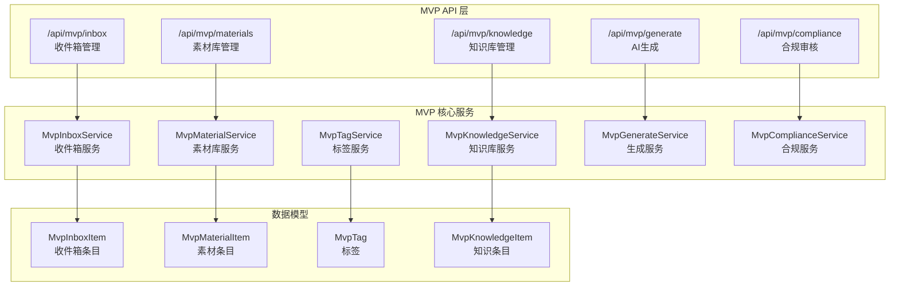
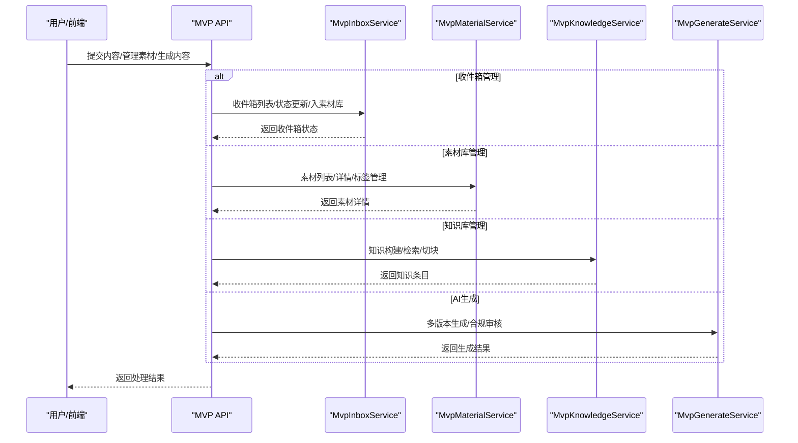
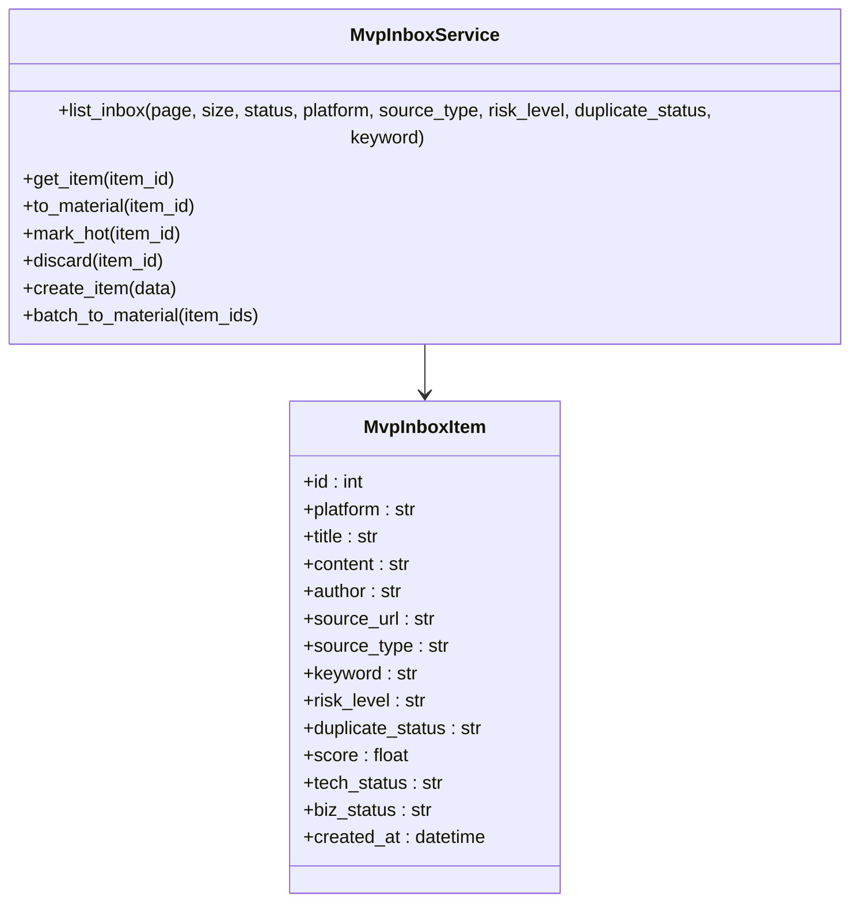
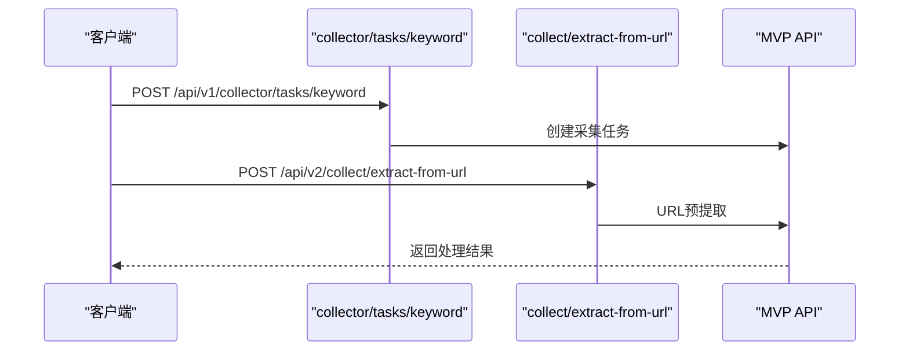
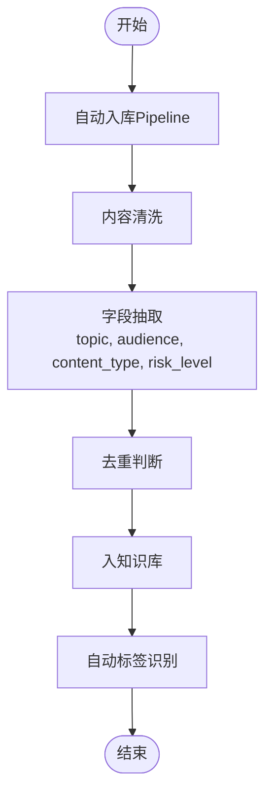
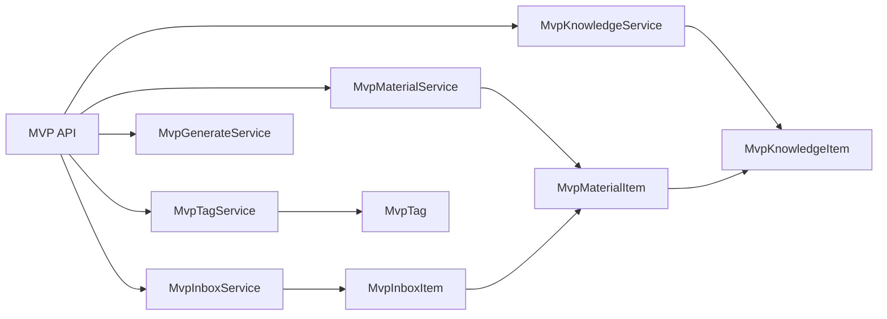

# 内容采集系统

<cite>
**本文引用的文件**
- [backend/README.md](file://backend/README.md)
- [backend/app/main.py](file://backend/app/main.py)
- [backend/app/collector/__init__.py](file://backend/app/collector/__init__.py)
- [backend/app/collector/adapters/base.py](file://backend/app/collector/adapters/base.py)
- [backend/app/collector/parsers/xiaohongshu.py](file://backend/app/collector/parsers/xiaohongshu.py)
- [backend/app/collector/services/normalizer.py](file://backend/app/collector/services/normalizer.py)
- [backend/app/collector/services/enricher.py](file://backend/app/collector/services/enricher.py)
- [backend/app/collector/services/factory.py](file://backend/app/collector/services/factory.py)
- [backend/app/collector/api/collect_routes.py](file://backend/app/collector/api/collect_routes.py)
- [backend/app/collector/api/inbox_routes.py](file://backend/app/collector/api/inbox_routes.py)
- [backend/app/collector/api/material_routes.py](file://backend/app/collector/api/material_routes.py)
- [backend/app/api/v1/endpoints/collect.py](file://backend/app/api/v1/endpoints/collect.py)
- [backend/app/api/v1/endpoints/inbox.py](file://backend/app/api/v1/endpoints/inbox.py)
- [backend/app/api/v1/endpoints/submissions.py](file://backend/app/api/v1/endpoints/submissions.py)
- [backend/app/api/v2/endpoints/collect.py](file://backend/app/api/v2/endpoints/collect.py)
- [backend/app/api/v2/endpoints/materials.py](file://backend/app/api/v2/endpoints/materials.py)
- [backend/app/services/collector/browser_collector_client.py](file://backend/app/services/collector/browser_collector_client.py)
- [backend/app/services/collector/intake_service.py](file://backend/app/services/collector/intake_service.py)
- [backend/app/services/collector/material_pipeline_service.py](file://backend/app/services/collector/material_pipeline_service.py)
- [backend/app/domains/acquisition/collect_service.py](file://backend/app/domains/acquisition/collect_service.py)
- [backend/app/rules/local/douyin.yaml](file://backend/app/rules/local/douyin.yaml)
- [backend/app/rules/local/xiaohongshu.yaml](file://backend/app/rules/local/xiaohongshu.yaml)
- [backend/app/rules/local/xianyu.yaml](file://backend/app/rules/local/xianyu.yaml)
- [backend/app/api/endpoints/mvp_routes.py](file://backend/app/api/endpoints/mvp_routes.py)
- [backend/app/services/mvp_inbox_service.py](file://backend/app/services/mvp_inbox_service.py)
- [backend/app/services/mvp_material_service.py](file://backend/app/services/mvp_material_service.py)
- [backend/app/services/mvp_tag_service.py](file://backend/app/services/mvp_tag_service.py)
- [backend/app/schemas/mvp_schemas.py](file://backend/app/schemas/mvp_schemas.py)
- [backend/alembic/versions/20260328_02_add_mvp_core_tables.py](file://backend/alembic/versions/20260328_02_add_mvp_core_tables.py)
</cite>

## 更新摘要
**所做更改**
- 新增完整的MVP inbox系统架构分析，包括收件箱、素材库、知识库的完整数据流
- 更新采集系统架构图，展示新的MVP inbox替代原有collector模块的设计
- 新增MvpInboxService、MvpMaterialService、MvpTagService等核心服务组件
- 新增MVP API路由和Schema定义，提供更强大的内容筛选和管理功能
- 移除原有的collector模块架构，完全转向MVP inbox系统
- 新增自动入库Pipeline、标签识别、知识库检索等高级功能

## 目录
1. [简介](#简介)
2. [项目结构](#项目结构)
3. [核心组件](#核心组件)
4. [架构总览](#架构总览)
5. [详细组件分析](#详细组件分析)
6. [依赖关系分析](#依赖关系分析)
7. [性能考虑](#性能考虑)
8. [故障排查指南](#故障排查指南)
9. [结论](#结论)
10. [附录](#附录)

## 简介
本文件为"智获客内容采集系统"的功能文档，聚焦于MVP inbox系统的全新架构设计。系统现已完全替代原有的collector模块，采用"收件箱—素材库—知识库—AI生成"的完整内容管理体系，提供更强大的内容筛选、标签识别、知识管理和智能生成能力。系统支持手动内容提交、浏览器插件集成、关键词采集等多种采集方式，并通过MVP API提供统一的管理接口。

**更新** 本版本重点介绍了全新的MVP inbox系统架构，该系统完全替代了原有的collector模块，提供了更加强大和智能化的内容管理功能。

## 项目结构
后端采用FastAPI + SQLAlchemy架构，新增了完整的MVP系统，包括收件箱、素材库、知识库、标签管理、AI生成等核心模块。MVP系统提供从"采集—筛选—标注—知识—生成"的完整闭环，支持自动入库Pipeline和智能标签识别。

**图表来源**
- [backend/app/api/endpoints/mvp_routes.py:31-134](file://backend/app/api/endpoints/mvp_routes.py#L31-L134)
- [backend/app/services/mvp_inbox_service.py:7-136](file://backend/app/services/mvp_inbox_service.py#L7-L136)
- [backend/app/services/mvp_material_service.py:7-158](file://backend/app/services/mvp_material_service.py#L7-L158)
- [backend/app/services/mvp_tag_service.py:38-144](file://backend/app/services/mvp_tag_service.py#L38-L144)
- [backend/alembic/versions/20260328_02_add_mvp_core_tables.py:26-112](file://backend/alembic/versions/20260328_02_add_mvp_core_tables.py#L26-L112)

**章节来源**
- [backend/README.md:90-172](file://backend/README.md#L90-L172)
- [backend/app/main.py:1-4](file://backend/app/main.py#L1-L4)

## 核心组件
- **MvpInboxService**：收件箱管理服务，支持内容筛选、状态管理、入素材库、标记爆款、丢弃等功能
- **MvpMaterialService**：素材库管理服务，提供素材列表、详情、标签关联、生成历史等功能
- **MvpTagService**：标签管理服务，基于规则的自动标签识别，支持标签创建和管理
- **MvpKnowledgeService**：知识库管理服务，支持知识构建、检索、切块、向量索引等功能
- **MvpGenerateService**：AI生成服务，提供多版本内容生成、合规审核、最终推荐等功能
- **MvpComplianceService**：合规审核服务，基于规则的风险评估和内容审核
- **MvpRewriteService**：仿写服务，基于爆款内容的智能仿写功能

**章节来源**
- [backend/app/services/mvp_inbox_service.py:7-136](file://backend/app/services/mvp_inbox_service.py#L7-L136)
- [backend/app/services/mvp_material_service.py:7-158](file://backend/app/services/mvp_material_service.py#L7-L158)
- [backend/app/services/mvp_tag_service.py:38-144](file://backend/app/services/mvp_tag_service.py#L38-L144)

## 架构总览
系统采用MVP架构设计，围绕"收件箱—素材库—知识库—AI生成"主线展开。新的MVP系统将内容管理功能重新组织为模块化架构，每个模块职责明确，便于维护和扩展。

**图表来源**
- [backend/app/api/endpoints/mvp_routes.py:31-134](file://backend/app/api/endpoints/mvp_routes.py#L31-L134)
- [backend/app/services/mvp_inbox_service.py:11-36](file://backend/app/services/mvp_inbox_service.py#L11-L36)
- [backend/app/services/mvp_material_service.py:11-51](file://backend/app/services/mvp_material_service.py#L11-L51)

## 详细组件分析

### MVP 收件箱服务
MvpInboxService提供完整的收件箱管理功能，支持内容筛选、状态管理和业务流转：

- **列表筛选**：支持按状态、平台、来源类型、风险级别、重复状态、关键词等条件筛选
- **状态管理**：支持pending、to_material、discarded三种业务状态
- **入素材库**：自动创建素材条目并进行标签识别
- **爆款标记**：提升内容分数，标记为爆款内容
- **丢弃处理**：废弃不需要的内容条目

**图表来源**
- [backend/app/services/mvp_inbox_service.py:7-136](file://backend/app/services/mvp_inbox_service.py#L7-L136)
- [backend/alembic/versions/20260328_02_add_mvp_core_tables.py:26-46](file://backend/alembic/versions/20260328_02_add_mvp_core_tables.py#L26-L46)

**章节来源**
- [backend/app/services/mvp_inbox_service.py:11-36](file://backend/app/services/mvp_inbox_service.py#L11-L36)

### MVP 素材库服务
MvpMaterialService提供素材库的完整管理功能，支持多维度过滤和标签关联：

- **多维度过滤**：支持平台、标签、受众、风格、是否爆款、关键词等条件
- **详情查询**：包含标签、知识条目、生成历史的完整详情
- **标签管理**：支持标签创建、更新、关联管理
- **状态切换**：支持爆款状态的切换
- **使用统计**：跟踪素材的使用次数

**章节来源**
- [backend/app/services/mvp_material_service.py:11-51](file://backend/app/services/mvp_material_service.py#L11-L51)

### MVP 标签服务
MvpTagService提供基于规则的智能标签识别功能：

- **规则识别**：基于关键词匹配的标签识别，支持受众、内容类型、风格、场景等维度
- **自动标签**：为素材自动识别并关联标签
- **标签管理**：支持标签的创建、查询、统计
- **标签统计**：提供标签类型的统计信息

**章节来源**
- [backend/app/services/mvp_tag_service.py:42-81](file://backend/app/services/mvp_tag_service.py#L42-L81)

### MVP 知识库服务
MvpKnowledgeService提供知识库的完整管理功能：

- **知识构建**：从素材构建知识条目
- **知识检索**：支持多维度的知识检索
- **切块管理**：知识内容的切块和向量化
- **分库统计**：各知识库的统计信息
- **批量处理**：支持批量知识构建和处理

**章节来源**
- [backend/app/api/endpoints/mvp_routes.py:206-260](file://backend/app/api/endpoints/mvp_routes.py#L206-L260)

### MVP 生成服务
MvpGenerateService提供AI内容生成的完整功能：

- **多版本生成**：支持专业版、口语版、种子版等多版本生成
- **合规审核**：基于规则的合规检查和风险评估
- **最终推荐**：生成最终推荐文本
- **上下文编排**：结合知识库上下文进行内容生成
- **版本管理**：跟踪生成版本和历史

**章节来源**
- [backend/app/api/endpoints/mvp_routes.py:476-544](file://backend/app/api/endpoints/mvp_routes.py#L476-L544)

### 收集任务管理（v1 关键词采集）
**更新** 采集任务管理功能已完全迁移至MVP系统，原有的collector模块已被移除：

- **能力概述**：通过MVP API提供关键词采集、URL预提取、手工提交等功能
- **关键流程**：
  - 关键词采集：/api/v1/collector/tasks/keyword，支持平台、关键词与最大条数
  - URL预提取：/api/v2/collect/extract-from-url，轻量抓取元数据
  - 手工提交：/api/v1/material/inbox/manual，统一进入收件箱
- **返回值**：统一的JSON响应格式，包含状态码和数据

**图表来源**
- [backend/app/api/v1/endpoints/collect.py:18-34](file://backend/app/api/v1/endpoints/collect.py#L18-L34)
- [backend/app/api/v2/endpoints/collect.py:172-197](file://backend/app/api/v2/endpoints/collect.py#L172-L197)

**章节来源**
- [backend/app/api/v1/endpoints/collect.py:18-34](file://backend/app/api/v1/endpoints/collect.py#L18-L34)
- [backend/app/api/v2/endpoints/collect.py:172-197](file://backend/app/api/v2/endpoints/collect.py#L172-L197)

### 浏览器插件集成
**更新** 浏览器插件集成功能已完全集成到MVP系统中：

- **统一入口**：通过MVP API提供浏览器插件的统一集成接口
- **内容提交**：支持员工提交链接和微信回调批量提交
- **状态管理**：所有提交内容统一进入收件箱状态管理
- **自动处理**：支持自动入库Pipeline和标签识别

**章节来源**
- [backend/app/api/v1/endpoints/inbox.py:78-91](file://backend/app/api/v1/endpoints/inbox.py#L78-L91)

### 手工内容提交
**更新** 手工内容提交功能已完全迁移至MVP系统：

- **能力概述**：支持手动录入内容进入收件箱，统一进入review状态等待人工处理
- **关键流程**：
  - 手工录入：/api/v1/material/inbox/manual，提交平台、标题、正文、标签与备注
  - 员工提交链接：/api/v1/employee-submissions/link，提交URL，返回submission_id与状态
  - 微信回调：/api/v1/integrations/wechat/callback，从消息中提取URL列表
- **参数说明**：ManualInboxRequest、EmployeeLinkSubmissionRequest、WechatCallbackRequest
- **返回值**：统一返回提交结果与状态

**章节来源**
- [backend/app/api/v1/endpoints/inbox.py:78-91](file://backend/app/api/v1/endpoints/inbox.py#L78-L91)

### 内容解析与标准化流程
**更新** 内容解析与标准化流程已完全重构为MVP系统：

- **自动入库**：支持原始内容的自动清洗、抽取、入知识库
- **标签识别**：基于规则的自动标签识别和关联
- **状态决策**：依据风险级别、重复状态、技术状态进入不同业务流程
- **知识构建**：从素材自动构建知识条目，支持多维度字段抽取

**图表来源**
- [backend/app/api/endpoints/mvp_routes.py:433-453](file://backend/app/api/endpoints/mvp_routes.py#L433-L453)
- [backend/app/services/mvp_tag_service.py:57-81](file://backend/app/services/mvp_tag_service.py#L57-L81)

**章节来源**
- [backend/app/api/endpoints/mvp_routes.py:433-453](file://backend/app/api/endpoints/mvp_routes.py#L433-L453)

### 内容改写与采纳（MVP 素材管道）
**更新** 内容改写与采纳功能已完全集成到MVP系统：

- **能力概述**：基于素材与知识文档检索生成多种文案变体，支持采纳与回滚
- **关键流程**：
  - 素材改写：/api/mvp/materials/{material_id}/rewrite，支持爆款仿写
  - 入管道即改写：/api/mvp/raw-contents/auto-pipeline，一次性完成采集、标准化、生成与落库
  - 采纳改写：/api/mvp/generate/final，支持采纳与回滚
- **返回值**：改写任务详情、采纳状态与更新后的素材正文

**章节来源**
- [backend/app/api/endpoints/mvp_routes.py:186-194](file://backend/app/api/endpoints/mvp_routes.py#L186-L194)
- [backend/app/api/endpoints/mvp_routes.py:433-453](file://backend/app/api/endpoints/mvp_routes.py#L433-L453)

### URL 预提取（v2）
**更新** URL预提取功能已完全迁移至MVP系统：

- **能力概述**：对输入URL进行平台识别与元数据预提取，返回标题、作者、内容预览等
- **关键流程**：
  - 校验URL完整性
  - 调用CollectService.detect_platform与fetch_url_meta
  - 返回平台标识、标签、元数据与提取状态
- **返回值**：包含平台、标签、标题、内容预览、作者、提取成功标志与提示信息

**章节来源**
- [backend/app/api/v2/endpoints/collect.py:172-197](file://backend/app/api/v2/endpoints/collect.py#L172-L197)

### 采集策略、频率控制与错误处理
**更新** 采集策略、频率控制与错误处理机制已完全重构：

- **采集策略**：
  - 关键词采集：支持去重与详情拉取，最大条数限制
  - URL预提取：轻量抓取，仅解析必要元信息
  - 自动入库：支持批量处理和错误恢复
- **频率控制与限流**：
  - 后端提供运维健康检查端点
  - 可通过配置启用Redis分布式限流
- **错误处理**：
  - 采集失败：返回400错误，包含详细错误信息
  - 资源不存在：返回404错误
  - 状态机冲突：返回409错误

**章节来源**
- [backend/app/api/v2/endpoints/collect.py:209-242](file://backend/app/api/v2/endpoints/collect.py#L209-L242)
- [backend/app/services/mvp_inbox_service.py:48-78](file://backend/app/services/mvp_inbox_service.py#L48-L78)

## 依赖关系分析

**图表来源**
- [backend/app/api/endpoints/mvp_routes.py:31-134](file://backend/app/api/endpoints/mvp_routes.py#L31-L134)
- [backend/app/services/mvp_inbox_service.py:7-136](file://backend/app/services/mvp_inbox_service.py#L7-L136)
- [backend/alembic/versions/20260328_02_add_mvp_core_tables.py:26-112](file://backend/alembic/versions/20260328_02_add_mvp_core_tables.py#L26-L112)

**章节来源**
- [backend/app/api/endpoints/mvp_routes.py:31-134](file://backend/app/api/endpoints/mvp_routes.py#L31-L134)

## 性能考虑
**更新** 新架构在性能方面有显著改进：

- **模块化设计**：清晰的职责分离减少了不必要的耦合，提高了代码复用率
- **批量处理**：支持批量自动入库Pipeline，提高处理效率
- **标签缓存**：标签识别结果的缓存机制，减少重复计算
- **索引优化**：数据库索引和查询优化，提升查询性能
- **并发控制**：通过服务层的并发处理能力，支持高并发请求
- **内存优化**：合理的数据结构设计，避免内存溢出

## 故障排查指南
**更新** 新架构的故障排查更加系统化：

- **收件箱问题**：
  - 检查MvpInboxService的数据库连接
  - 验证收件箱状态转换的合法性
  - 查看标签识别服务的错误日志
- **素材库问题**：
  - 检查MvpMaterialService的查询条件
  - 验证标签关联的完整性
  - 确认知识条目的构建状态
- **生成问题**：
  - 检查MvpGenerateService的AI服务连接
  - 验证合规审核规则的配置
  - 查看生成历史的错误信息
- **API错误**：
  - 使用MVP API端点进行测试
  - 检查认证和权限配置
  - 验证请求参数的格式和范围

**章节来源**
- [backend/app/services/mvp_inbox_service.py:35-36](file://backend/app/services/mvp_inbox_service.py#L35-L36)
- [backend/app/services/mvp_material_service.py:50-51](file://backend/app/services/mvp_material_service.py#L50-L51)

## 结论
新架构通过完整的MVP系统设计，实现了更加清晰、可维护和可扩展的内容管理系统。MvpInboxService、MvpMaterialService、MvpTagService等核心服务组件共同构成了强大的内容管理生态系统。这种设计不仅提供了原有功能的完整替代，还增加了自动入库Pipeline、智能标签识别、知识库检索、AI生成等高级功能，为未来的平台扩展和技术升级奠定了坚实基础。

## 附录

### 配置选项与参数说明
**更新** 新架构的配置选项更加丰富：

- **收件箱配置**
  - page：页码（默认1）
  - size：每页条数（默认20，最大100）
  - status：业务状态（pending/to_material/discarded）
  - platform：平台类型
  - source_type：来源类型
  - risk_level：风险级别
  - duplicate_status：重复状态
  - keyword：关键词搜索
- **素材库配置**
  - platform：平台类型
  - tag_id：标签ID
  - audience：受众类型
  - style：内容风格
  - is_hot：是否爆款
  - keyword：关键词搜索
- **知识库配置**
  - platform：平台类型
  - audience：受众类型
  - style：内容风格
  - category：知识类别
  - topic：知识主题
  - content_type：内容类型
  - keyword：关键词搜索
  - library_type：知识库类型

**章节来源**
- [backend/app/api/endpoints/mvp_routes.py:33-50](file://backend/app/api/endpoints/mvp_routes.py#L33-L50)
- [backend/app/services/mvp_material_service.py:11-35](file://backend/app/services/mvp_material_service.py#L11-L35)

### 返回值定义
**更新** 新架构的返回值更加标准化：

- **收件箱列表**：包含items、total、page、size的分页响应
- **素材详情**：包含标签、知识条目、生成历史的完整详情
- **知识检索**：包含知识条目的列表和统计信息
- **AI生成**：包含多版本生成结果、合规审核、最终推荐文本
- **自动入库**：包含成功状态、知识ID、提取字段等信息

**章节来源**
- [backend/app/schemas/mvp_schemas.py:28-33](file://backend/app/schemas/mvp_schemas.py#L28-L33)
- [backend/app/schemas/mvp_schemas.py:52-75](file://backend/app/schemas/mvp_schemas.py#L52-L75)

### 数据模型与关系
**更新** 新架构的数据模型更加完善：

- **收件箱条目**：包含平台、标题、内容、作者、来源URL、风险级别、重复状态、分数、技术状态、业务状态等字段
- **素材条目**：包含平台、标题、内容、来源URL、互动指标、作者、风险级别、使用次数、来源收件箱ID等字段
- **标签系统**：支持多类型标签（平台、受众、风格、主题、场景、内容类型），支持唯一约束
- **知识条目**：包含标题、内容、分类、平台、受众、风格、来源素材ID、使用次数、向量嵌入等字段

**章节来源**
- [backend/alembic/versions/20260328_02_add_mvp_core_tables.py:26-112](file://backend/alembic/versions/20260328_02_add_mvp_core_tables.py#L26-L112)
- [backend/app/schemas/mvp_schemas.py:8-26](file://backend/app/schemas/mvp_schemas.py#L8-L26)