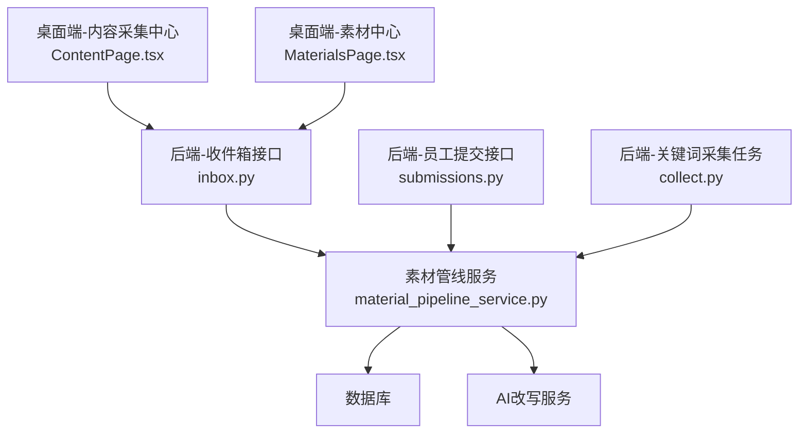
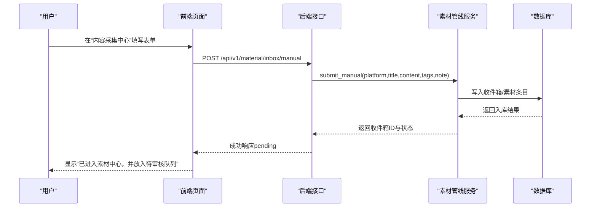
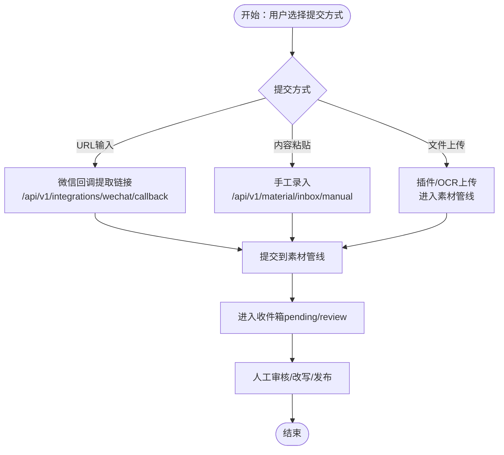
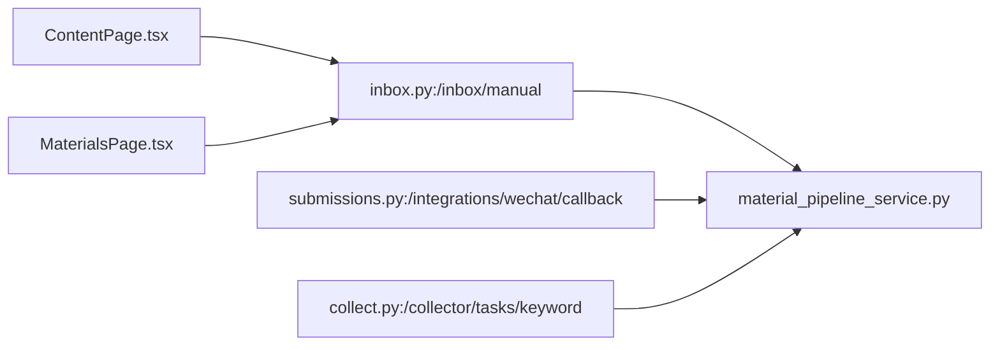

# 手工内容提交

<cite>
**本文引用的文件**
- [backend/app/api/v1/endpoints/inbox.py](file://backend/app/api/v1/endpoints/inbox.py)
- [backend/app/api/v1/endpoints/submissions.py](file://backend/app/api/v1/endpoints/submissions.py)
- [backend/app/api/v1/endpoints/collect.py](file://backend/app/api/v1/endpoints/collect.py)
- [backend/app/schemas/schemas.py](file://backend/app/schemas/schemas.py)
- [backend/app/services/collector/material_pipeline_service.py](file://backend/app/services/collector/material_pipeline_service.py)
- [backend/app/services/collector/intake_service.py](file://backend/app/services/collector/intake_service.py)
- [backend/app/api/endpoints/content.py](file://backend/app/api/endpoints/content.py)
- [desktop/src/pages/ContentPage.tsx](file://desktop/src/pages/ContentPage.tsx)
- [desktop/src/pages/materials/MaterialsPage.tsx](file://desktop/src/pages/materials/MaterialsPage.tsx)
- [backend/test_main.py](file://backend/test_main.py)
</cite>

## 目录
1. [简介](#简介)
2. [项目结构](#项目结构)
3. [核心组件](#核心组件)
4. [架构总览](#架构总览)
5. [详细组件分析](#详细组件分析)
6. [依赖关系分析](#依赖关系分析)
7. [性能考量](#性能考量)
8. [故障排查指南](#故障排查指南)
9. [结论](#结论)
10. [附录](#附录)

## 简介
本操作文档面向“手工内容提交”能力，系统性说明三种提交入口：URL 输入、内容粘贴、文件上传（通过插件或截图OCR）。文档覆盖提交工作流、内容验证规则、格式要求、质量标准、表单设计与字段约束、提交限制与格式支持、用户操作指南、最佳实践以及与自动化采集的协调与冲突处理策略。

## 项目结构
手工内容提交在后端以“素材收件箱”为核心枢纽，统一接收手工录入、链接采集、插件/OCR等多渠道来源的内容，并进入统一的审核与处理流程。前端提供“内容采集中心”页面，支持手工录入与查看素材列表；同时提供“素材中心”页面，展示收件箱状态、支持改写与后续发布。

图表来源
- [desktop/src/pages/ContentPage.tsx:1-118](file://desktop/src/pages/ContentPage.tsx#L1-L118)
- [desktop/src/pages/materials/MaterialsPage.tsx:167-217](file://desktop/src/pages/materials/MaterialsPage.tsx#L167-L217)
- [backend/app/api/v1/endpoints/inbox.py:1-165](file://backend/app/api/v1/endpoints/inbox.py#L1-L165)
- [backend/app/services/collector/material_pipeline_service.py:1148-1188](file://backend/app/services/collector/material_pipeline_service.py#L1148-L1188)

章节来源
- [backend/app/api/v1/endpoints/inbox.py:1-165](file://backend/app/api/v1/endpoints/inbox.py#L1-L165)
- [desktop/src/pages/ContentPage.tsx:1-118](file://desktop/src/pages/ContentPage.tsx#L1-L118)
- [desktop/src/pages/materials/MaterialsPage.tsx:167-217](file://desktop/src/pages/materials/MaterialsPage.tsx#L167-L217)

## 核心组件
- 收件箱接口层：提供手工录入、状态更新、详情查询、基于素材改写等能力。
- 素材管线服务：负责将手工提交内容标准化、去重、合规审查、风险评估与入库。
- 前端页面：内容采集中心用于手工录入；素材中心用于查看收件箱状态与改写。
- 员工提交与关键词采集：支持从微信回调提取链接、批量提交链接，以及关键词采集任务创建。

章节来源
- [backend/app/api/v1/endpoints/inbox.py:16-91](file://backend/app/api/v1/endpoints/inbox.py#L16-L91)
- [backend/app/services/collector/material_pipeline_service.py:1148-1188](file://backend/app/services/collector/material_pipeline_service.py#L1148-L1188)
- [backend/app/api/v1/endpoints/submissions.py:31-87](file://backend/app/api/v1/endpoints/submissions.py#L31-L87)
- [backend/app/api/v1/endpoints/collect.py:18-33](file://backend/app/api/v1/endpoints/collect.py#L18-L33)

## 架构总览
手工内容提交的端到端流程如下：

图表来源
- [desktop/src/pages/ContentPage.tsx:23-46](file://desktop/src/pages/ContentPage.tsx#L23-L46)
- [backend/app/api/v1/endpoints/inbox.py:78-91](file://backend/app/api/v1/endpoints/inbox.py#L78-L91)
- [backend/app/services/collector/material_pipeline_service.py:1171-1188](file://backend/app/services/collector/material_pipeline_service.py#L1171-L1188)

章节来源
- [backend/app/api/v1/endpoints/inbox.py:78-91](file://backend/app/api/v1/endpoints/inbox.py#L78-L91)
- [backend/app/services/collector/material_pipeline_service.py:1171-1188](file://backend/app/services/collector/material_pipeline_service.py#L1171-L1188)

## 详细组件分析

### 组件A：手工录入（URL输入、内容粘贴、文件上传）
- URL输入：通过员工提交接口解析微信回调中的链接，批量提交到素材管线。
- 内容粘贴：通过“内容采集中心”页面提交手工录入，统一进入收件箱。
- 文件上传：通过插件或截图OCR进入素材管线，最终同样进入收件箱进行审核。

图表来源
- [backend/app/api/v1/endpoints/submissions.py:51-87](file://backend/app/api/v1/endpoints/submissions.py#L51-L87)
- [backend/app/api/v1/endpoints/inbox.py:78-91](file://backend/app/api/v1/endpoints/inbox.py#L78-L91)
- [backend/app/services/collector/material_pipeline_service.py:1148-1188](file://backend/app/services/collector/material_pipeline_service.py#L1148-L1188)

章节来源
- [backend/app/api/v1/endpoints/submissions.py:31-87](file://backend/app/api/v1/endpoints/submissions.py#L31-L87)
- [backend/app/api/v1/endpoints/inbox.py:78-91](file://backend/app/api/v1/endpoints/inbox.py#L78-L91)
- [backend/app/services/collector/material_pipeline_service.py:1148-1188](file://backend/app/services/collector/material_pipeline_service.py#L1148-L1188)

### 组件B：提交表单设计与字段约束
- 手工录入表单（内容采集中心）：
  - 平台：下拉选择（小红书、抖音、知乎、咸鱼）
  - 标签：逗号分隔字符串，前端会做去空白与过滤
  - 标题：必填
  - 正文：必填
- 收件箱接口请求体：
  - platform：必填
  - title：必填
  - content：必填
  - tags：数组，默认为空
  - note：可选
- 微信回调请求体：
  - employee_id：可选（若为空则使用当前用户）
  - message：必填，内部会提取其中的URL
  - note：可选

章节来源
- [desktop/src/pages/ContentPage.tsx:54-87](file://desktop/src/pages/ContentPage.tsx#L54-L87)
- [backend/app/api/v1/endpoints/inbox.py:16-21](file://backend/app/api/v1/endpoints/inbox.py#L16-L21)
- [backend/app/api/v1/endpoints/submissions.py:20-23](file://backend/app/api/v1/endpoints/submissions.py#L20-L23)

### 组件C：内容验证规则与质量标准
- 标题长度：建议至少4个字符（前端提示）
- 正文字数：建议至少20个字符（前端提示）
- 正文长度上限：不同平台存在上限，前端会在超过时提示精简
- 标签数量：无硬性上限，但建议合理控制
- 平台支持：小红书、抖音、知乎、咸鱼
- 内容完整性：建议包含标题、正文、必要标签；正文应具备可读性与信息密度

章节来源
- [desktop/src/pages/materials/MaterialsPage.tsx:188-201](file://desktop/src/pages/materials/MaterialsPage.tsx#L188-L201)
- [desktop/src/pages/ContentPage.tsx:58-63](file://desktop/src/pages/ContentPage.tsx#L58-L63)

### 组件D：提交限制与格式支持
- 请求体字段类型与默认值：
  - platform：字符串
  - title/content：字符串
  - tags：数组
  - note：字符串或空
- 字段长度与范围：
  - 平台名称长度有约束
  - 标题/正文/标签/备注等存在最大长度
- 格式支持：
  - 手工录入：纯文本正文
  - 插件/OCR：支持图片OCR提取文本后进入素材管线
- 重复与去重：
  - 素材管线会对重复内容进行识别与标记

章节来源
- [backend/app/schemas/schemas.py:513-528](file://backend/app/schemas/schemas.py#L513-L528)
- [backend/app/schemas/schemas.py:587-612](file://backend/app/schemas/schemas.py#L587-L612)
- [backend/app/services/collector/material_pipeline_service.py:1148-1188](file://backend/app/services/collector/material_pipeline_service.py#L1148-L1188)

### 组件E：与自动化采集的协调与冲突处理
- 协调机制：
  - 手工提交统一进入收件箱，状态为pending/review，等待人工处理或自动流程触发
  - 关键词采集任务创建后，由采集服务抓取并进入素材管线，与手工提交并行运行
- 冲突处理策略：
  - 去重：素材管线对重复内容进行识别与标记
  - 状态机：收件箱支持状态变更（pending/review/discard），人工干预可调整
  - 合规与风险：素材管线内置合规审查与风险评估，不合规内容可能被阻断或降级

章节来源
- [backend/app/api/v1/endpoints/inbox.py:94-116](file://backend/app/api/v1/endpoints/inbox.py#L94-L116)
- [backend/app/api/v1/endpoints/collect.py:18-33](file://backend/app/api/v1/endpoints/collect.py#L18-L33)
- [backend/app/services/collector/material_pipeline_service.py:1641-1671](file://backend/app/services/collector/material_pipeline_service.py#L1641-L1671)

## 依赖关系分析
- 接口依赖：
  - 收件箱接口依赖素材管线服务进行提交与状态管理
  - 员工提交接口依赖素材管线服务进行链接提交
  - 关键词采集接口创建采集任务，间接进入素材管线
- 前端依赖：
  - 内容采集中心页面调用手工录入接口
  - 素材中心页面展示收件箱列表与详情

图表来源
- [desktop/src/pages/ContentPage.tsx:23-46](file://desktop/src/pages/ContentPage.tsx#L23-L46)
- [desktop/src/pages/materials/MaterialsPage.tsx:167-217](file://desktop/src/pages/materials/MaterialsPage.tsx#L167-L217)
- [backend/app/api/v1/endpoints/inbox.py:78-91](file://backend/app/api/v1/endpoints/inbox.py#L78-L91)
- [backend/app/api/v1/endpoints/submissions.py:51-87](file://backend/app/api/v1/endpoints/submissions.py#L51-L87)
- [backend/app/api/v1/endpoints/collect.py:18-33](file://backend/app/api/v1/endpoints/collect.py#L18-L33)
- [backend/app/services/collector/material_pipeline_service.py:1148-1188](file://backend/app/services/collector/material_pipeline_service.py#L1148-L1188)

章节来源
- [backend/app/api/v1/endpoints/inbox.py:78-91](file://backend/app/api/v1/endpoints/inbox.py#L78-L91)
- [backend/app/api/v1/endpoints/submissions.py:51-87](file://backend/app/api/v1/endpoints/submissions.py#L51-L87)
- [backend/app/api/v1/endpoints/collect.py:18-33](file://backend/app/api/v1/endpoints/collect.py#L18-L33)
- [backend/app/services/collector/material_pipeline_service.py:1148-1188](file://backend/app/services/collector/material_pipeline_service.py#L1148-L1188)

## 性能考量
- 前端校验：在提交前进行长度与格式校验，减少无效请求
- 批量处理：微信回调可一次性提取多个URL并批量提交
- 去重与合并：素材管线对重复内容进行识别，降低存储与处理压力
- 状态机：明确的收件箱状态流转，便于监控与优化

## 故障排查指南
- 常见错误与提示：
  - 微信消息中未找到可采集链接：检查消息是否包含有效URL
  - 链接采集失败：检查URL有效性与网络连通性
  - 收件箱状态更新失败：确认目标状态是否符合状态机规则
- 单元测试参考：
  - 手工录入提交后应返回pending状态，并可在收件箱列表中查询
  - 收件箱详情查询需确保权限与存在性

章节来源
- [backend/app/api/v1/endpoints/submissions.py:57-60](file://backend/app/api/v1/endpoints/submissions.py#L57-L60)
- [backend/app/api/v1/endpoints/submissions.py:47-48](file://backend/app/api/v1/endpoints/submissions.py#L47-L48)
- [backend/app/api/v1/endpoints/inbox.py:113-116](file://backend/app/api/v1/endpoints/inbox.py#L113-L116)
- [backend/test_main.py:540-558](file://backend/test_main.py#L540-L558)

## 结论
手工内容提交通过统一的收件箱入口，实现了URL输入、内容粘贴、文件上传等多种方式的整合。配合前端表单约束、素材管线的去重与合规审查，以及与自动化采集的协同，形成高效、可控的内容采集与处理体系。建议在实际使用中遵循表单字段约束与质量标准，充分利用收件箱状态管理与改写能力，提升内容产出效率与质量。

## 附录
- 旧接口迁移提示：旧内容接口已下线，请迁移到新接口路径
- 新接口路径：
  - 列表与详情：/api/v2/materials
  - 手工创建：/api/v1/material/inbox/manual
  - 关键词采集任务：/api/v1/collector/tasks/keyword

章节来源
- [backend/app/api/endpoints/content.py:5-18](file://backend/app/api/endpoints/content.py#L5-L18)