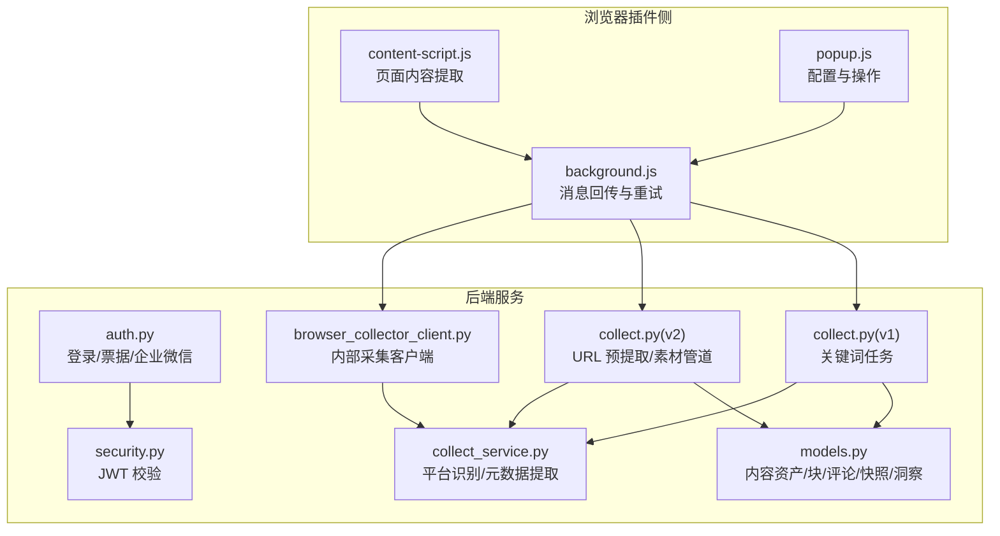
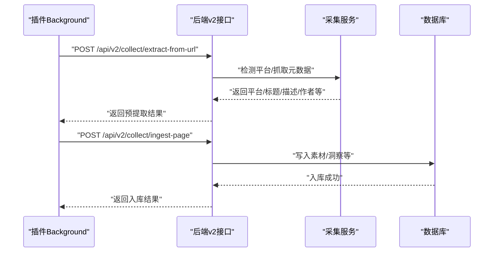
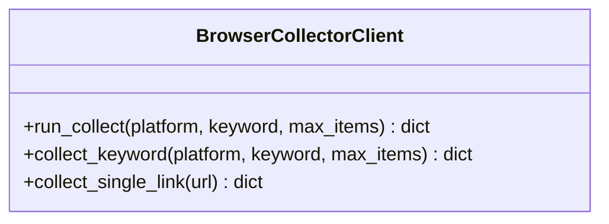
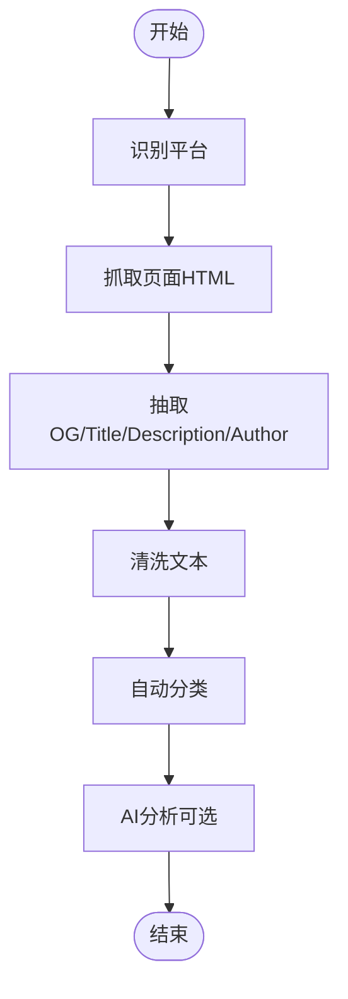
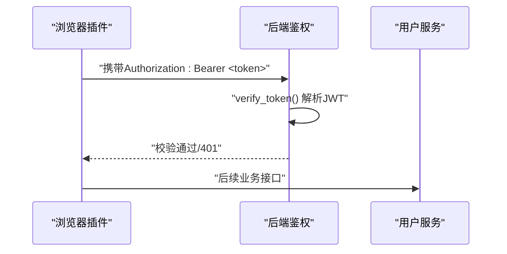
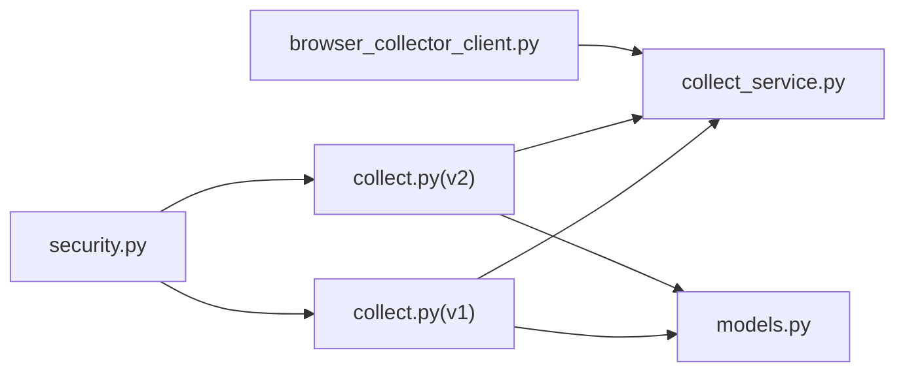

# 浏览器插件集成

<cite>
**本文引用的文件**
- [browser_collector_client.py](file://backend/app/services/collector/browser_collector_client.py)
- [collect.py（v1）](file://backend/app/api/v1/endpoints/collect.py)
- [collect.py（v2）](file://backend/app/api/v2/endpoints/collect.py)
- [collect.py（旧接口弃用）](file://backend/app/api/endpoints/collect.py)
- [collect_service.py](file://backend/app/domains/acquisition/collect_service.py)
- [security.py](file://backend/app/core/security.py)
- [models.py](file://backend/app/models/models.py)
- [浏览器插件联调与回归清单_2026-03-23.md](file://docs/operations/浏览器插件联调与回归清单_2026-03-23.md)
- [采集与素材重构执行任务单_2026-03-24.md](file://docs/architecture/采集与素材重构执行任务单_2026-03-24.md)
- [api-client.js（移动端示例）](file://mobile-h5/src/utils/api-client.js)
- [auth.py](file://backend/app/api/endpoints/auth.py)
- [test_main.py](file://backend/test_main.py)
</cite>

## 目录
1. [简介](#简介)
2. [项目结构](#项目结构)
3. [核心组件](#核心组件)
4. [架构总览](#架构总览)
5. [组件详解](#组件详解)
6. [依赖关系分析](#依赖关系分析)
7. [性能与可靠性](#性能与可靠性)
8. [故障排查指南](#故障排查指南)
9. [结论](#结论)
10. [附录](#附录)

## 简介
本技术文档面向浏览器插件与后端服务的集成，聚焦于插件采集内容的通信协议、数据交换格式、安装与权限配置、内容捕获与提取算法、实时传输策略、API 接口定义与错误码说明，以及开发调试与兼容性测试方法。文档同时覆盖跨域处理、安全校验与性能优化等工程实践。

## 项目结构
围绕浏览器插件集成的相关模块主要分布在后端服务与文档资料中：
- 后端服务层：采集客户端、采集服务、API 路由与安全校验
- 数据模型：内容资产、块、评论、快照、洞察等实体
- 文档与测试：联调清单、架构任务单、单元测试

图表来源
- [browser_collector_client.py:1-40](file://backend/app/services/collector/browser_collector_client.py#L1-L40)
- [collect.py（v1）:1-34](file://backend/app/api/v1/endpoints/collect.py#L1-L34)
- [collect.py（v2）:1-302](file://backend/app/api/v2/endpoints/collect.py#L1-L302)
- [collect.py（旧接口弃用）:1-20](file://backend/app/api/endpoints/collect.py#L1-L20)
- [collect_service.py:1-285](file://backend/app/domains/acquisition/collect_service.py#L1-L285)
- [security.py:1-57](file://backend/app/core/security.py#L1-L57)
- [models.py:1-200](file://backend/app/models/models.py#L1-L200)
- [auth.py:1-280](file://backend/app/api/endpoints/auth.py#L1-L280)

章节来源
- [浏览器插件联调与回归清单_2026-03-23.md:1-56](file://docs/operations/浏览器插件联调与回归清单_2026-03-23.md#L1-L56)
- [采集与素材重构执行任务单_2026-03-24.md:256-266](file://docs/architecture/采集与素材重构执行任务单_2026-03-24.md#L256-L266)

## 核心组件
- 浏览器采集客户端：封装内部采集服务调用，负责向采集服务发送关键词/链接采集请求。
- 采集服务：平台识别、URL 元数据提取、AI 分析与分类、统计聚合。
- API 层（v1/v2）：关键词任务、URL 预提取、素材管道入口与日志统计。
- 安全校验：基于 JWT 的令牌校验与权限控制。
- 数据模型：内容资产、块、评论、快照、洞察等结构化存储。

章节来源
- [browser_collector_client.py:1-40](file://backend/app/services/collector/browser_collector_client.py#L1-L40)
- [collect_service.py:1-285](file://backend/app/domains/acquisition/collect_service.py#L1-L285)
- [collect.py（v1）:1-34](file://backend/app/api/v1/endpoints/collect.py#L1-L34)
- [collect.py（v2）:1-302](file://backend/app/api/v2/endpoints/collect.py#L1-L302)
- [security.py:1-57](file://backend/app/core/security.py#L1-L57)
- [models.py:1-200](file://backend/app/models/models.py#L1-L200)

## 架构总览
浏览器插件通过 background 脚本与后端交互，支持两种采集路径：
- 关键词任务：通过 v1 接口提交关键词采集任务，由采集服务异步处理。
- URL 预提取与素材管道：通过 v2 接口进行 URL 预提取与素材入库，支持日志与统计查询。

图表来源
- [collect.py（v2）:172-213](file://backend/app/api/v2/endpoints/collect.py#L172-L213)
- [collect_service.py:118-158](file://backend/app/domains/acquisition/collect_service.py#L118-L158)
- [models.py:45-148](file://backend/app/models/models.py#L45-L148)

## 组件详解

### 1) 浏览器采集客户端（BrowserCollectorClient）
- 职责：封装内部采集服务调用，统一构造请求负载与超时控制。
- 关键能力：
  - 运行采集：关键词/链接采集，支持去重、超时设置。
  - 单链接采集：根据 URL 自动识别平台并采集单条内容。
- 通信协议：HTTP POST，JSON 负载，使用 httpx 客户端。

图表来源
- [browser_collector_client.py:1-40](file://backend/app/services/collector/browser_collector_client.py#L1-L40)

章节来源
- [browser_collector_client.py:1-40](file://backend/app/services/collector/browser_collector_client.py#L1-L40)

### 2) 采集服务（CollectService）
- 职责：平台识别、URL 元数据提取、自动分类、AI 分析、统计。
- 关键能力：
  - 平台识别：基于正则匹配平台域名。
  - 元数据提取：从 HTML 中抽取 og/title/description/author 等。
  - 自动分类：基于关键词匹配行业类别。
  - AI 分析：调用 LLM 生成标签、热度、爆款原因等。
- 性能特性：异步 HTTP 客户端，带超时与重定向跟随，降低反爬风险。

图表来源
- [collect_service.py:78-158](file://backend/app/domains/acquisition/collect_service.py#L78-L158)

章节来源
- [collect_service.py:1-285](file://backend/app/domains/acquisition/collect_service.py#L1-L285)

### 3) API 接口与数据模型

#### 3.1 v2 接口（推荐）
- URL 预提取：POST /api/v2/collect/extract-from-url
  - 输入：url
  - 输出：平台、平台标签、标题、内容预览、作者、标签、评论预览、抓取结果与消息
- 素材入库（已停用）：POST /api/v2/collect/ingest-page
  - 当前返回 410，提示迁移至新入口
- Spider 小红书导入（已停用）：POST /api/v2/collect/ingest-spider-xhs
  - 当前返回 410，提示使用回填脚本或新素材管道
- 日志与统计：GET /api/v2/collect/logs、GET /api/v2/collect/stats

章节来源
- [collect.py（v2）:172-298](file://backend/app/api/v2/endpoints/collect.py#L172-L298)

#### 3.2 v1 接口（关键词任务）
- 创建关键词任务：POST /api/collector/tasks/keyword
  - 输入：platform、keyword、max_items
  - 输出：任务创建结果（异常时返回 502）

章节来源
- [collect.py（v1）:18-34](file://backend/app/api/v1/endpoints/collect.py#L18-L34)

#### 3.3 旧接口弃用
- 旧 /api/collect/* 路由全部返回 410，并给出替代方案

章节来源
- [collect.py（旧接口弃用）:15-20](file://backend/app/api/endpoints/collect.py#L15-L20)

#### 3.4 数据模型（关键实体）
- 内容资产：标题、内容、作者、发布时间、标签、指标、截图、分类等
- 结构化块：段落/标题块，有序排列
- 评论：评论文本、点赞数、置顶标记、父子关系
- 快照：原始 HTML、截图 URL、页面元信息
- 洞察：高频问题、关键句、主题建议等

```mermaid
erDiagram
CONTENT_ASSET {
int id PK
int owner_id
string platform
string source_url
string content_type
string title
text content
string author
timestamp publish_time
json tags
json metrics
string source_type
string category
}
CONTENT_BLOCK {
int id PK
int content_id FK
string block_type
int block_order
text block_text
}
CONTENT_COMMENT {
int id PK
int content_id FK
int parent_comment_id FK
string commenter_name
text comment_text
int like_count
boolean is_pinned
}
CONTENT_SNAPSHOT {
int id PK
int content_id FK
text raw_html
string screenshot_url
json page_meta_json
timestamp collected_at
}
CONTENT_INSIGHT {
int id PK
int content_id FK
json high_freq_questions_json
json key_sentences_json
string title_pattern
json suggested_topics_json
}
CONTENT_ASSET ||--o{ CONTENT_BLOCK : "包含"
CONTENT_ASSET ||--o{ CONTENT_COMMENT : "包含"
CONTENT_ASSET ||--o{ CONTENT_SNAPSHOT : "包含"
CONTENT_ASSET ||--o{ CONTENT_INSIGHT : "产生"
```

图表来源
- [models.py:45-148](file://backend/app/models/models.py#L45-L148)

### 4) 安全与权限
- 认证方式：Bearer Token（JWT），后端通过 HTTP 头 Authorization 校验
- 校验逻辑：解析 JWT，校验签名与过期时间，提取用户 ID
- 企业微信 OAuth：提供配置查询、回调换取用户信息、绑定接口

图表来源
- [security.py:42-57](file://backend/app/core/security.py#L42-L57)
- [auth.py:107-119](file://backend/app/api/endpoints/auth.py#L107-L119)

章节来源
- [security.py:1-57](file://backend/app/core/security.py#L1-L57)
- [auth.py:1-280](file://backend/app/api/endpoints/auth.py#L1-L280)

### 5) 插件安装、配置与权限
- Manifest v3：插件清单、权限声明
- Content Script：页面上下文脚本，负责内容提取
- Background：后台脚本，负责消息回传、重试与持久化
- Popup：弹出面板，用于配置与操作
- 安装与使用说明：插件根目录 README

章节来源
- [浏览器插件联调与回归清单_2026-03-23.md:6-12](file://docs/operations/浏览器插件联调与回归清单_2026-03-23.md#L6-L12)
- [采集与素材重构执行任务单_2026-03-24.md:256-266](file://docs/architecture/采集与素材重构执行任务单_2026-03-24.md#L256-L266)

### 6) 内容捕获机制与数据提取算法
- 平台识别：基于 URL 正则匹配平台
- 元数据提取：优先 og:* 标签，其次 twitter:* 与标准 meta
- 文本清洗：去除 HTML 标签，规范化空白字符
- 自动分类：关键词匹配行业类别
- AI 分析：提示 LLM 产出结构化 JSON，回填标签、热度、爆款原因等

章节来源
- [collect_service.py:78-158](file://backend/app/domains/acquisition/collect_service.py#L78-L158)

### 7) 实时传输策略
- 插件通过 background 脚本与后端交互，支持失败重试与超时控制
- 移动端示例：提供超时控制、敏感参数清理、最大重试次数等通用策略

章节来源
- [browser_collector_client.py:27-30](file://backend/app/services/collector/browser_collector_client.py#L27-L30)
- [api-client.js（移动端示例）:1-51](file://mobile-h5/src/utils/api-client.js#L1-L51)

### 8) API 接口定义与错误码说明
- 410 Gone：旧接口已停用，返回迁移提示
- 400 Bad Request：URL 缺少协议头
- 502 Bad Gateway：采集服务调用失败（v1）
- 401 Unauthorized：JWT 校验失败
- 404/405：旧路由不存在或方法不支持

章节来源
- [collect.py（v2）:178-179](file://backend/app/api/v2/endpoints/collect.py#L178-L179)
- [collect.py（v1）:32-33](file://backend/app/api/v1/endpoints/collect.py#L32-L33)
- [collect.py（旧接口弃用）:15-20](file://backend/app/api/endpoints/collect.py#L15-L20)
- [test_main.py:346-362](file://backend/test_main.py#L346-L362)

## 依赖关系分析
- 浏览器采集客户端依赖采集服务进行平台识别与元数据提取
- v2 接口依赖采集服务与数据库模型，提供 URL 预提取与素材管道
- v1 接口依赖采集服务与数据库模型，提供关键词任务
- 安全模块贯穿所有受保护接口，提供统一的 JWT 校验

图表来源
- [browser_collector_client.py:1-40](file://backend/app/services/collector/browser_collector_client.py#L1-L40)
- [collect.py（v1）:1-34](file://backend/app/api/v1/endpoints/collect.py#L1-L34)
- [collect.py（v2）:1-302](file://backend/app/api/v2/endpoints/collect.py#L1-L302)
- [collect_service.py:1-285](file://backend/app/domains/acquisition/collect_service.py#L1-L285)
- [models.py:1-200](file://backend/app/models/models.py#L1-L200)
- [security.py:1-57](file://backend/app/core/security.py#L1-L57)

## 性能与可靠性
- 超时与重试：采集客户端与移动端示例均提供超时控制与重试策略
- 反爬策略：使用浏览器 UA、语言与 referer，降低被拦截概率
- 异步抓取：元数据提取采用异步 HTTP 客户端，提升吞吐
- 错误降级：AI 分析失败时回退自动分类

章节来源
- [browser_collector_client.py:27-30](file://backend/app/services/collector/browser_collector_client.py#L27-L30)
- [collect_service.py:121-125](file://backend/app/domains/acquisition/collect_service.py#L121-L125)
- [api-client.js（移动端示例）:1-51](file://mobile-h5/src/utils/api-client.js#L1-L51)

## 故障排查指南
- 插件采集失败
  - 检查后端是否可达与接口是否返回 410（旧接口）
  - 确认 Token 是否有效与过期
  - 观察网络错误与超时情况
- URL 预提取失败
  - 确认 URL 以 http/https 开头
  - 检查平台是否被识别
- 重复采集导致脏数据
  - 使用 v2 素材管道并确保幂等（client_request_id）
- 企业微信登录异常
  - 检查配置项与回调参数有效性

章节来源
- [collect.py（v2）:178-179](file://backend/app/api/v2/endpoints/collect.py#L178-L179)
- [security.py:42-57](file://backend/app/core/security.py#L42-L57)
- [test_main.py:326-362](file://backend/test_main.py#L326-L362)
- [浏览器插件联调与回归清单_2026-03-23.md:41-47](file://docs/operations/浏览器插件联调与回归清单_2026-03-23.md#L41-L47)

## 结论
浏览器插件与后端的集成以 v2 素材管道为核心，结合平台识别、元数据提取与 AI 分析，形成完整的采集-入库-洞察链路。通过严格的权限校验、错误码规范与性能优化策略，保障插件在多浏览器环境下的稳定性与可维护性。

## 附录

### A. 插件开发指南
- 清单与权限：遵循 Manifest v3，声明必要权限
- 内容脚本：在页面上下文提取标题、正文、URL
- 后台脚本：负责消息回传、重试与超时控制
- 弹出面板：提供配置与操作入口
- 安装与使用：参考插件根目录 README

章节来源
- [浏览器插件联调与回归清单_2026-03-23.md:6-12](file://docs/operations/浏览器插件联调与回归清单_2026-03-23.md#L6-L12)
- [采集与素材重构执行任务单_2026-03-24.md:256-266](file://docs/architecture/采集与素材重构执行任务单_2026-03-24.md#L256-L266)

### B. 跨域与安全验证
- 跨域：插件与后端通过标准 HTTP API 通信，遵循浏览器同源策略；后端未见显式 CORS 配置，需确保代理或 Nginx 层正确处理跨域头
- 安全：统一使用 Bearer Token，JWT 校验失败返回 401

章节来源
- [security.py:42-57](file://backend/app/core/security.py#L42-L57)

### C. 兼容性测试
- 浏览器：Chrome/Edge 双浏览器联调，确保内容提取与回传一致
- 数据一致性：核对 plugin_collections、content_assets、insight_content_items 的关联与状态
- 异常回归：网络断开、重复采集、401/429/5xx 场景

章节来源
- [浏览器插件联调与回归清单_2026-03-23.md:21-47](file://docs/operations/浏览器插件联调与回归清单_2026-03-23.md#L21-L47)