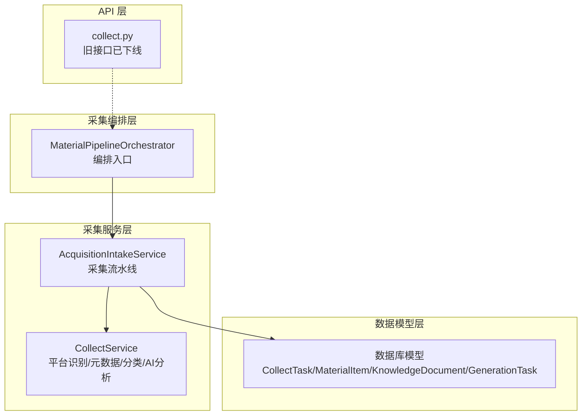
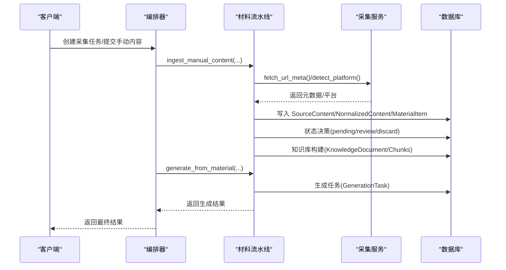
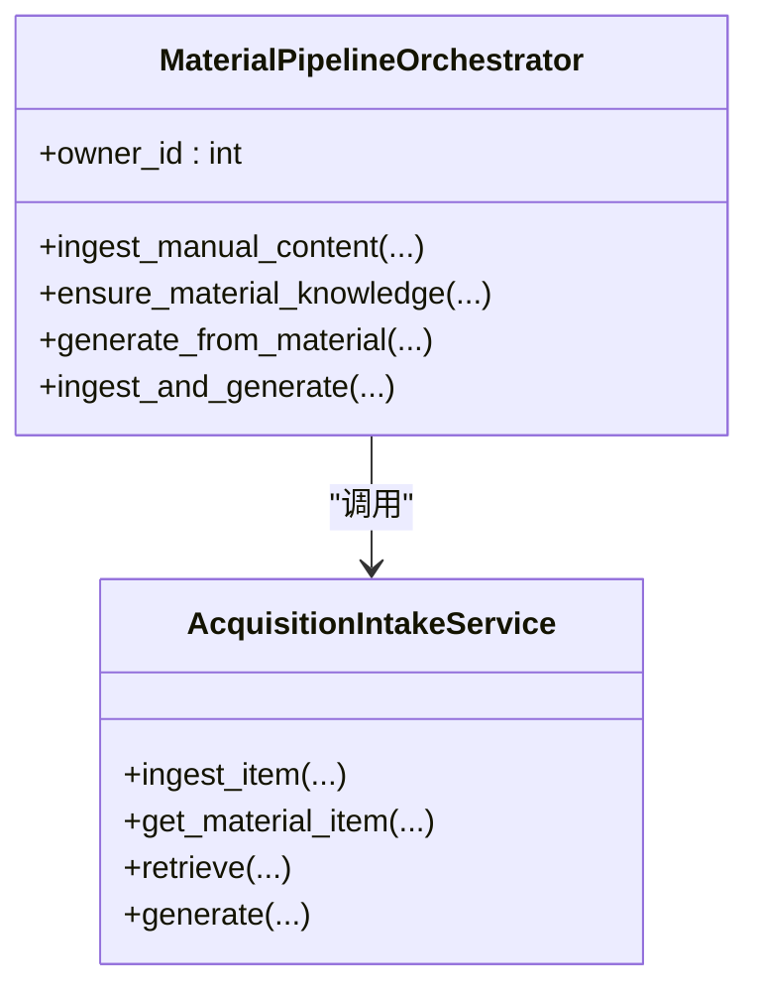
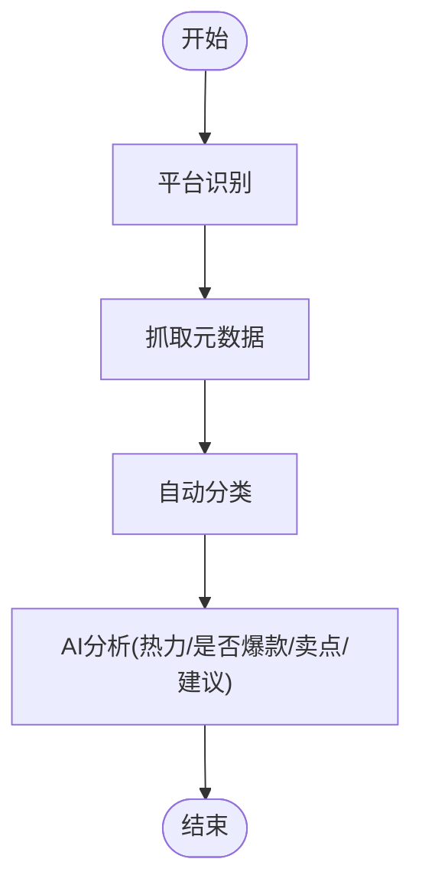
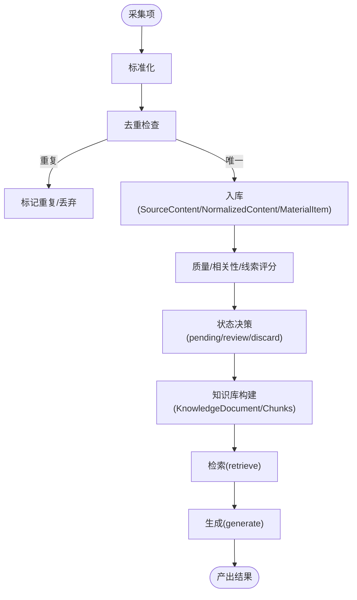
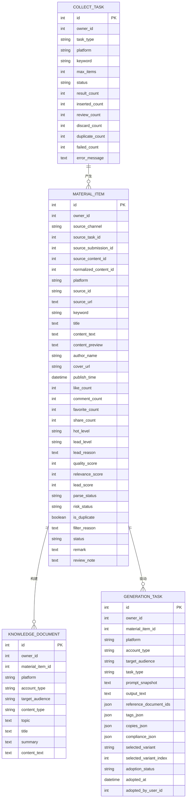
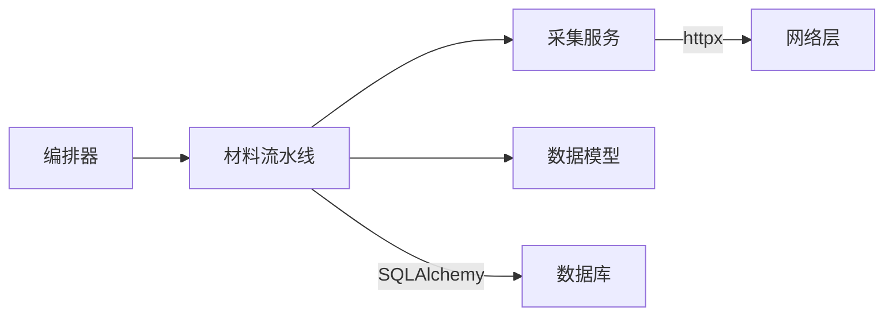
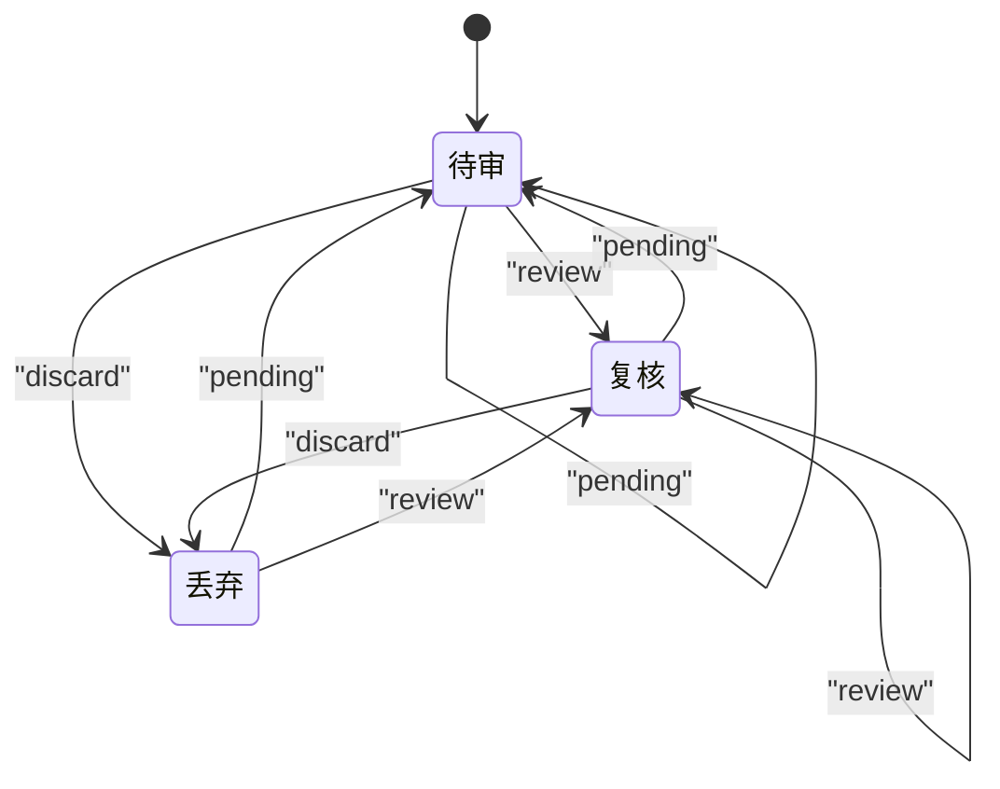

# 采集任务管理

<cite>
**本文引用的文件**
- [backend/app/domains/acquisition/orchestrator.py](file://backend/app/domains/acquisition/orchestrator.py)
- [backend/app/domains/acquisition/collect_service.py](file://backend/app/domains/acquisition/collect_service.py)
- [backend/app/services/collector/material_pipeline_service.py](file://backend/app/services/collector/material_pipeline_service.py)
- [backend/app/models/models.py](file://backend/app/models/models.py)
- [backend/app/api/endpoints/collect.py](file://backend/app/api/endpoints/collect.py)
</cite>

## 目录
1. [简介](#简介)
2. [项目结构](#项目结构)
3. [核心组件](#核心组件)
4. [架构总览](#架构总览)
5. [详细组件分析](#详细组件分析)
6. [依赖分析](#依赖分析)
7. [性能考虑](#性能考虑)
8. [故障排查指南](#故障排查指南)
9. [结论](#结论)
10. [附录](#附录)

## 简介
本文件面向“智获客采集任务管理系统”的功能文档，聚焦于采集任务的生命周期管理（创建、调度、执行、状态跟踪），并结合现有代码实现，系统性阐述任务优先级与并发控制、资源分配、队列管理、重试与失败处理、任务配置参数、执行计划与监控指标，以及与 Celery 任务系统的集成与性能优化策略。文档同时提供任务状态转换图与异常处理示例，并以可视化图表帮助读者快速理解系统架构与数据流。

## 项目结构
围绕采集任务管理的关键模块与文件如下：
- 采集编排器：负责从“采集输入”到“清洗/知识抽取/检索/生成”的端到端编排
- 采集服务：负责平台识别、元数据抓取、自动分类与AI分析
- 材料流水线服务：负责采集项的标准化、去重、入库、状态决策、知识库构建与检索、生成任务触发
- 数据模型：定义采集任务、材料、知识库、生成任务等实体及字段
- API 层：提供采集相关接口（当前旧接口已下线，迁移至新素材管道）

**图表来源**
- [backend/app/domains/acquisition/orchestrator.py:11-174](file://backend/app/domains/acquisition/orchestrator.py#L11-L174)
- [backend/app/domains/acquisition/collect_service.py:74-285](file://backend/app/domains/acquisition/collect_service.py#L74-L285)
- [backend/app/services/collector/material_pipeline_service.py:30-1739](file://backend/app/services/collector/material_pipeline_service.py#L30-L1739)
- [backend/app/models/models.py:413-752](file://backend/app/models/models.py#L413-L752)
- [backend/app/api/endpoints/collect.py:1-20](file://backend/app/api/endpoints/collect.py#L1-L20)

**章节来源**
- [backend/app/domains/acquisition/orchestrator.py:11-174](file://backend/app/domains/acquisition/orchestrator.py#L11-L174)
- [backend/app/domains/acquisition/collect_service.py:74-285](file://backend/app/domains/acquisition/collect_service.py#L74-L285)
- [backend/app/services/collector/material_pipeline_service.py:30-1739](file://backend/app/services/collector/material_pipeline_service.py#L30-L1739)
- [backend/app/models/models.py:413-752](file://backend/app/models/models.py#L413-L752)
- [backend/app/api/endpoints/collect.py:1-20](file://backend/app/api/endpoints/collect.py#L1-L20)

## 核心组件
- 编排器（MaterialPipelineOrchestrator）
  - 提供“手动输入 → 入库 → 知识库构建 → 生成”的统一入口
  - 支持从素材生成文案（rewrite 等任务类型）
- 采集服务（CollectService）
  - 平台识别、URL 元数据抓取、自动分类、AI 分析（热力/是否爆款/卖点/改写建议）
- 材料流水线服务（AcquisitionIntakeService）
  - 采集项标准化、去重、入库、状态决策（pending/review/discard）、知识库重建、检索、生成任务触发
- 数据模型（CollectTask/MaterialItem/KnowledgeDocument/GenerationTask）
  - 采集任务、材料、知识文档、生成任务的持久化结构
- API 层
  - 旧采集接口已下线，迁移至新素材管道

**章节来源**
- [backend/app/domains/acquisition/orchestrator.py:11-174](file://backend/app/domains/acquisition/orchestrator.py#L11-L174)
- [backend/app/domains/acquisition/collect_service.py:74-285](file://backend/app/domains/acquisition/collect_service.py#L74-L285)
- [backend/app/services/collector/material_pipeline_service.py:30-1739](file://backend/app/services/collector/material_pipeline_service.py#L30-L1739)
- [backend/app/models/models.py:413-752](file://backend/app/models/models.py#L413-L752)
- [backend/app/api/endpoints/collect.py:1-20](file://backend/app/api/endpoints/collect.py#L1-L20)

## 架构总览
采集任务管理采用“编排器 + 采集服务 + 材料流水线 + 数据模型”的分层设计。编排器协调采集与生成流程；采集服务负责外部数据的解析与特征提取；材料流水线完成标准化、去重、入库、状态流转与知识库构建；数据模型承载采集任务、材料、知识与生成任务的持久化。

**图表来源**
- [backend/app/domains/acquisition/orchestrator.py:24-174](file://backend/app/domains/acquisition/orchestrator.py#L24-L174)
- [backend/app/services/collector/material_pipeline_service.py:1051-1109](file://backend/app/services/collector/material_pipeline_service.py#L1051-L1109)
- [backend/app/domains/acquisition/collect_service.py:78-158](file://backend/app/domains/acquisition/collect_service.py#L78-L158)
- [backend/app/models/models.py:413-752](file://backend/app/models/models.py#L413-L752)

## 详细组件分析

### 组件A：编排器（MaterialPipelineOrchestrator）
- 职责
  - 手动内容入库（manual_input）
  - 确保知识库存在并一致（reindex）
  - 从素材生成文案（rewrite 等）
  - 统一返回物料与生成结果
- 关键方法
  - ingest_manual_content：标准化并入库
  - ensure_material_knowledge：校验并重建知识库
  - generate_from_material：基于知识库检索与规则生成
  - ingest_and_generate：一键链路（入库+生成）

**图表来源**
- [backend/app/domains/acquisition/orchestrator.py:11-174](file://backend/app/domains/acquisition/orchestrator.py#L11-L174)
- [backend/app/services/collector/material_pipeline_service.py:968-1599](file://backend/app/services/collector/material_pipeline_service.py#L968-L1599)

**章节来源**
- [backend/app/domains/acquisition/orchestrator.py:11-174](file://backend/app/domains/acquisition/orchestrator.py#L11-L174)

### 组件B：采集服务（CollectService）
- 职责
  - 平台识别（正则匹配）
  - URL 元数据抓取（异步 httpx）
  - 自动分类（关键词匹配）
  - AI 分析（JSON 输出，包含标签、分类、热度、是否爆款、卖点、改写建议）
- 关键能力
  - detect_platform：基于正则识别平台
  - fetch_url_meta：提取 og:title/description/author/site_name
  - auto_category：基于关键词分类
  - analyze_with_ai：调用 LLM 生成分析结果

**图表来源**
- [backend/app/domains/acquisition/collect_service.py:78-285](file://backend/app/domains/acquisition/collect_service.py#L78-L285)

**章节来源**
- [backend/app/domains/acquisition/collect_service.py:74-285](file://backend/app/domains/acquisition/collect_service.py#L74-L285)

### 组件C：材料流水线服务（AcquisitionIntakeService）
- 职责
  - 采集项标准化（标题/正文/作者/时间/统计指标/风险/解析状态）
  - 去重（基于 source_id 与内容哈希）
  - 入库（SourceContent → NormalizedContent → MaterialItem）
  - 状态决策（pending/review/discard）
  - 知识库构建（KnowledgeDocument/Chunks）
  - 检索（关键词+语义评分）
  - 生成（加载规则、合规策略、提示词模板，调用 AI 生成）
- 关键流程
  - _process_item：标准化、去重、入库、状态决策
  - _ingest_items：批量入库统计
  - create_keyword_task：创建采集任务并执行
  - submit_link/submit_manual：提交链接/手动内容
  - retrieve/generate：检索与生成

**图表来源**
- [backend/app/services/collector/material_pipeline_service.py:811-918](file://backend/app/services/collector/material_pipeline_service.py#L811-L918)
- [backend/app/services/collector/material_pipeline_service.py:1051-1109](file://backend/app/services/collector/material_pipeline_service.py#L1051-L1109)
- [backend/app/services/collector/material_pipeline_service.py:1392-1454](file://backend/app/services/collector/material_pipeline_service.py#L1392-L1454)
- [backend/app/services/collector/material_pipeline_service.py:1570-1600](file://backend/app/services/collector/material_pipeline_service.py#L1570-L1600)

**章节来源**
- [backend/app/services/collector/material_pipeline_service.py:30-1739](file://backend/app/services/collector/material_pipeline_service.py#L30-L1739)

### 组件D：数据模型（采集任务/材料/知识/生成）
- 采集任务（CollectTask）
  - 字段：owner_id、task_type、platform、keyword、max_items、status、统计计数、错误信息
- 材料项（MaterialItem）
  - 字段：平台、来源、标题/正文/预览、作者、封面、发布时间、统计指标、质量/相关性/线索评分、解析/风险状态、状态、备注、关联知识/生成任务
- 知识文档（KnowledgeDocument）
  - 字段：平台、账号类型、目标人群、内容类型、主题、标题/摘要/正文、关联材料
- 生成任务（GenerationTask）
  - 字段：平台、账号类型、目标人群、任务类型、提示词快照、输出文本、参考文档、标签/变体、合规信息、采纳状态

**图表来源**
- [backend/app/models/models.py:413-752](file://backend/app/models/models.py#L413-L752)

**章节来源**
- [backend/app/models/models.py:413-752](file://backend/app/models/models.py#L413-L752)

### 组件E：API 层（采集接口）
- 旧采集接口已下线，提供替代路径指引（手动创建、关键词任务、素材列表、链接提取）
- 新素材管道接口位于 v1/v2 路由下

**章节来源**
- [backend/app/api/endpoints/collect.py:1-20](file://backend/app/api/endpoints/collect.py#L1-L20)

## 依赖分析
- 组件耦合
  - 编排器依赖材料流水线服务进行入库与生成
  - 材料流水线服务依赖采集服务进行元数据抓取与平台识别
  - 数据模型贯穿采集、知识、生成各环节
- 外部依赖
  - httpx 异步 HTTP 客户端用于元数据抓取
  - SQLAlchemy ORM 用于数据库交互
- 潜在循环依赖
  - 当前模块间为单向依赖，无明显循环

**图表来源**
- [backend/app/domains/acquisition/orchestrator.py:11-174](file://backend/app/domains/acquisition/orchestrator.py#L11-L174)
- [backend/app/services/collector/material_pipeline_service.py:30-1739](file://backend/app/services/collector/material_pipeline_service.py#L30-L1739)
- [backend/app/domains/acquisition/collect_service.py:74-285](file://backend/app/domains/acquisition/collect_service.py#L74-L285)

**章节来源**
- [backend/app/domains/acquisition/orchestrator.py:11-174](file://backend/app/domains/acquisition/orchestrator.py#L11-L174)
- [backend/app/services/collector/material_pipeline_service.py:30-1739](file://backend/app/services/collector/material_pipeline_service.py#L30-L1739)
- [backend/app/domains/acquisition/collect_service.py:74-285](file://backend/app/domains/acquisition/collect_service.py#L74-L285)

## 性能考虑
- 异步抓取
  - 元数据抓取使用异步 httpx，降低 I/O 阻塞
- 批量入库
  - _ingest_items 支持批量处理并一次性提交，减少事务开销
- 索引与查询
  - 关键字段（如 content_hash、platform、status、owner_id）建立索引，加速去重与过滤
- 评分与检索
  - 关键词与语义评分结合，热点与线索等级加权，兼顾召回与排序效率
- 生成策略
  - 通过规则与模板加载，避免重复计算；合规策略可缓存阈值与风险词集合

[本节为通用性能建议，无需特定文件引用]

## 故障排查指南
- 常见异常与处理
  - 素材不存在：在 ensure_material_knowledge/get_material_item 中抛出异常，需确认 material_id 是否正确
  - 采集任务失败：create_keyword_task/submit_link 在异常时更新任务状态与错误信息，检查日志与错误消息
  - 状态不可逆：状态转换表限制仅允许特定状态变更，若报错需回溯前置状态
- 日志与可观测性
  - 元数据抓取失败记录警告日志
  - AI 分析失败回退到自动分类
- 重试与补偿
  - 建议在上游调用层引入幂等与重试（例如基于任务 ID 的去重与指数退避）
  - 对于网络波动导致的 fetch_url_meta 失败，可在 API 层增加重试与降级策略

**章节来源**
- [backend/app/services/collector/material_pipeline_service.py:660-694](file://backend/app/services/collector/material_pipeline_service.py#L660-L694)
- [backend/app/services/collector/material_pipeline_service.py:1051-1109](file://backend/app/services/collector/material_pipeline_service.py#L1051-L1109)
- [backend/app/services/collector/material_pipeline_service.py:1333-1360](file://backend/app/services/collector/material_pipeline_service.py#L1333-L1360)
- [backend/app/domains/acquisition/collect_service.py:118-158](file://backend/app/domains/acquisition/collect_service.py#L118-L158)
- [backend/app/domains/acquisition/collect_service.py:224-285](file://backend/app/domains/acquisition/collect_service.py#L224-L285)

## 结论
本系统通过编排器、采集服务与材料流水线的协同，实现了从采集输入到知识构建与生成的完整闭环。现有实现具备异步抓取、批量入库、评分与检索、合规策略与生成模板等关键能力。建议在生产环境中配合 Celery 实现任务队列与并发控制，并完善重试、限流与监控体系，以进一步提升稳定性与吞吐能力。

[本节为总结性内容，无需特定文件引用]

## 附录

### 任务状态转换图

**图表来源**
- [backend/app/services/collector/material_pipeline_service.py:35-39](file://backend/app/services/collector/material_pipeline_service.py#L35-L39)
- [backend/app/services/collector/material_pipeline_service.py:1333-1360](file://backend/app/services/collector/material_pipeline_service.py#L1333-L1360)

### 任务生命周期与关键节点
- 创建
  - create_keyword_task：创建采集任务并执行
  - submit_link/submit_manual：提交链接/手动内容
- 执行
  - _process_item：标准化、去重、入库、状态决策
  - retrieve：基于关键词与语义评分的检索
  - generate：加载规则/模板/合规策略并生成
- 状态跟踪
  - MaterialItem.status/pending/review/discard
  - CollectTask 统计计数与错误信息

**章节来源**
- [backend/app/services/collector/material_pipeline_service.py:1051-1109](file://backend/app/services/collector/material_pipeline_service.py#L1051-L1109)
- [backend/app/services/collector/material_pipeline_service.py:811-918](file://backend/app/services/collector/material_pipeline_service.py#L811-L918)
- [backend/app/services/collector/material_pipeline_service.py:1392-1454](file://backend/app/services/collector/material_pipeline_service.py#L1392-L1454)
- [backend/app/services/collector/material_pipeline_service.py:1570-1600](file://backend/app/services/collector/material_pipeline_service.py#L1570-L1600)

### 与 Celery 集成与性能优化建议
- 集成建议
  - 将 create_keyword_task/submit_link 等耗时操作异步化，交由 Celery worker 执行
  - 使用任务队列按平台/账号类型分区，实现并发隔离与资源配额
  - 通过任务幂等键（如 content_hash/source_id）避免重复执行
- 性能优化
  - 批量任务批量化提交，减少任务创建开销
  - 合规策略与规则模板缓存，降低重复加载成本
  - 对高并发场景启用速率限制与排队策略，防止下游过载

[本节为概念性建议，无需特定文件引用]