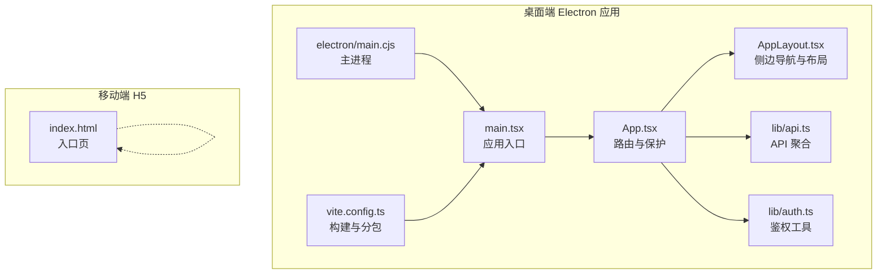
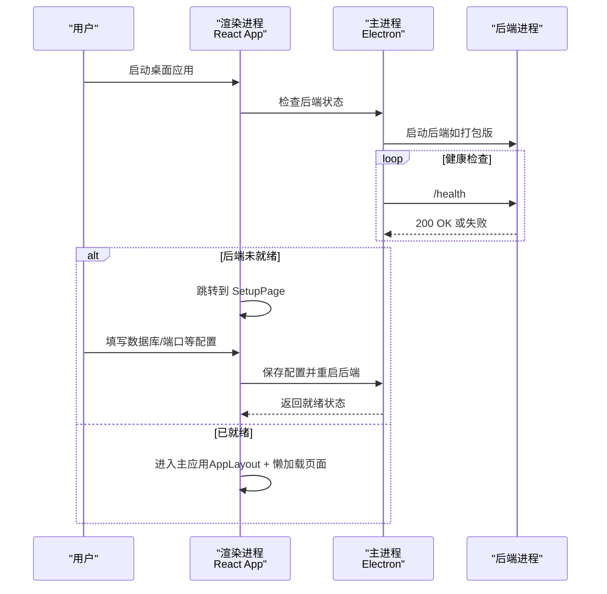
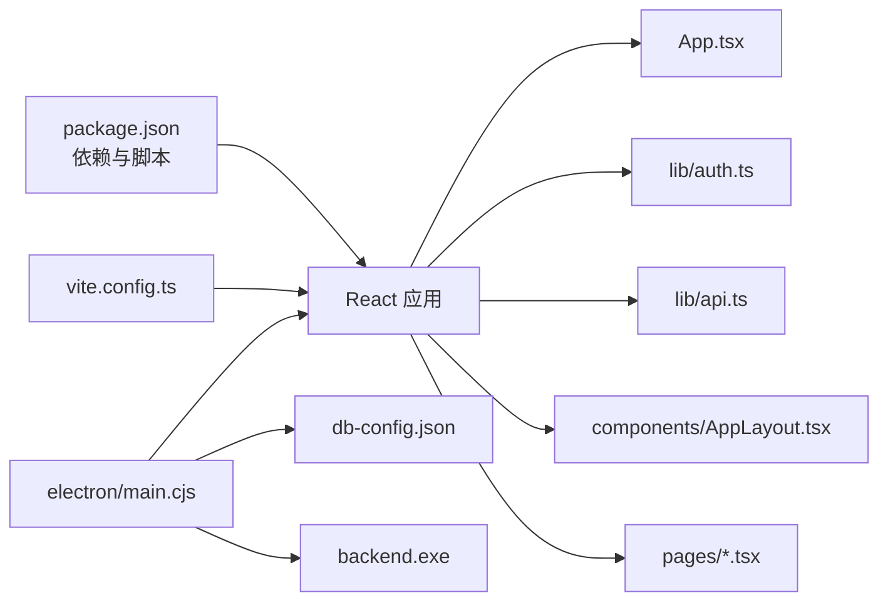

# 前端应用架构

<cite>
**本文引用的文件**
- [desktop/package.json](file://desktop/package.json)
- [desktop/src/main.tsx](file://desktop/src/main.tsx)
- [desktop/src/App.tsx](file://desktop/src/App.tsx)
- [desktop/src/components/AppLayout.tsx](file://desktop/src/components/AppLayout.tsx)
- [desktop/src/lib/api.ts](file://desktop/src/lib/api.ts)
- [desktop/src/lib/auth.ts](file://desktop/src/lib/auth.ts)
- [desktop/src/pages/LoginPage.tsx](file://desktop/src/pages/LoginPage.tsx)
- [desktop/src/pages/SetupPage.tsx](file://desktop/src/pages/SetupPage.tsx)
- [desktop/src/types.ts](file://desktop/src/types.ts)
- [desktop/electron/main.cjs](file://desktop/electron/main.cjs)
- [desktop/vite.config.ts](file://desktop/vite.config.ts)
- [mobile-h5/index.html](file://mobile-h5/index.html)
</cite>

## 目录
1. [简介](#简介)
2. [项目结构](#项目结构)
3. [核心组件](#核心组件)
4. [架构总览](#架构总览)
5. [组件与页面详解](#组件与页面详解)
6. [依赖关系分析](#依赖关系分析)
7. [性能与体验优化](#性能与体验优化)
8. [故障排查指南](#故障排查指南)
9. [结论](#结论)
10. [附录](#附录)

## 简介
本文件面向“智获客”前端应用，系统化梳理其技术架构与实现细节，覆盖以下方面：
- Electron 桌面应用的启动流程、后端进程管理与 IPC 通信
- React 应用的路由、懒加载、布局与状态管理
- 移动端 H5 的设计原则与响应式适配策略
- UI 组件库使用与自定义组件开发规范
- 状态管理最佳实践与数据流设计
- 与后端 API 的集成方式与错误处理机制
- 性能优化、用户体验与跨平台兼容性建议

## 项目结构
前端子项目主要由三部分组成：
- 桌面端 Electron 应用（React + Vite + Zustand）
- 移动端 H5（静态页面集合）
- 共享类型定义（TypeScript 类型）

图表来源
- [desktop/src/main.tsx:1-14](file://desktop/src/main.tsx#L1-L14)
- [desktop/src/App.tsx:1-206](file://desktop/src/App.tsx#L1-L206)
- [desktop/src/components/AppLayout.tsx:1-114](file://desktop/src/components/AppLayout.tsx#L1-L114)
- [desktop/src/lib/api.ts:1-1043](file://desktop/src/lib/api.ts#L1-L1043)
- [desktop/src/lib/auth.ts:1-57](file://desktop/src/lib/auth.ts#L1-L57)
- [desktop/electron/main.cjs:1-195](file://desktop/electron/main.cjs#L1-L195)
- [desktop/vite.config.ts:1-33](file://desktop/vite.config.ts#L1-L33)
- [mobile-h5/index.html:1-41](file://mobile-h5/index.html#L1-L41)

章节来源
- [desktop/package.json:1-88](file://desktop/package.json#L1-L88)
- [desktop/src/main.tsx:1-14](file://desktop/src/main.tsx#L1-L14)
- [desktop/src/App.tsx:1-206](file://desktop/src/App.tsx#L1-L206)
- [desktop/src/components/AppLayout.tsx:1-114](file://desktop/src/components/AppLayout.tsx#L1-L114)
- [desktop/src/lib/api.ts:1-1043](file://desktop/src/lib/api.ts#L1-L1043)
- [desktop/src/lib/auth.ts:1-57](file://desktop/src/lib/auth.ts#L1-L57)
- [desktop/electron/main.cjs:1-195](file://desktop/electron/main.cjs#L1-L195)
- [desktop/vite.config.ts:1-33](file://desktop/vite.config.ts#L1-L33)
- [mobile-h5/index.html:1-41](file://mobile-h5/index.html#L1-L41)

## 核心组件
- 应用入口与路由
  - 入口文件负责挂载 React 应用与路由上下文，渲染根组件。
  - 根组件负责：
    - 在 Electron 环境下进行启动检查（后端就绪判断）、引导至配置页或主应用
    - 使用 Suspense 实现页面级懒加载
    - 提供受保护路由与登出事件监听
- 布局组件
  - 侧边导航按功能模块分组，支持版本信息获取与退出登录
- 鉴权与 API
  - 登录流程、令牌存储与消费重定向路径
  - API 聚合导出，封装后端接口调用
- 主进程（Electron）
  - 管理数据库配置、启动/停止后端进程、健康检查轮询、IPC 交互与窗口创建

章节来源
- [desktop/src/main.tsx:1-14](file://desktop/src/main.tsx#L1-L14)
- [desktop/src/App.tsx:1-206](file://desktop/src/App.tsx#L1-L206)
- [desktop/src/components/AppLayout.tsx:1-114](file://desktop/src/components/AppLayout.tsx#L1-L114)
- [desktop/src/lib/auth.ts:1-57](file://desktop/src/lib/auth.ts#L1-L57)
- [desktop/src/lib/api.ts:1-1043](file://desktop/src/lib/api.ts#L1-L1043)
- [desktop/electron/main.cjs:1-195](file://desktop/electron/main.cjs#L1-L195)

## 架构总览
桌面端采用“Electron 主进程 + React 渲染进程 + 内置后端”的一体化方案。主进程负责：
- 读取/保存数据库配置
- 启动/停止后端可执行文件
- 健康检查与等待后端就绪
- 通过 IPC 对外暴露配置读写与后端状态查询
渲染进程负责：
- 路由与页面懒加载
- 鉴权与登录
- API 调用与数据展示
- 版本信息获取与侧边栏导航

图表来源
- [desktop/src/App.tsx:84-136](file://desktop/src/App.tsx#L84-L136)
- [desktop/src/pages/SetupPage.tsx:61-76](file://desktop/src/pages/SetupPage.tsx#L61-L76)
- [desktop/electron/main.cjs:103-118](file://desktop/electron/main.cjs#L103-L118)
- [desktop/electron/main.cjs:161-170](file://desktop/electron/main.cjs#L161-L170)

## 组件与页面详解

### 应用入口与路由控制
- 入口文件负责创建根节点并包裹路由上下文
- 根组件根据是否运行在 Electron 环境决定启动流程：
  - 非 Electron：直接进入主应用
  - Electron：读取配置、检查后端、就绪则进入主应用，否则进入 SetupPage
- 使用 Suspense 包裹路由，实现页面级懒加载
- 提供受保护路由，未登录自动跳转登录页并保存重定向路径

章节来源
- [desktop/src/main.tsx:1-14](file://desktop/src/main.tsx#L1-L14)
- [desktop/src/App.tsx:1-206](file://desktop/src/App.tsx#L1-L206)

### 布局组件（AppLayout）
- 侧边导航按功能分组，支持图标与徽标
- 顶部显示系统版本信息（从 API 获取）
- 提供退出登录按钮，触发全局登出事件

章节来源
- [desktop/src/components/AppLayout.tsx:1-114](file://desktop/src/components/AppLayout.tsx#L1-L114)

### 登录页（LoginPage）
- 表单输入用户名/密码，调用登录 API
- 成功后设置令牌并消费重定向路径，跳转目标页面
- 失败时展示错误信息

章节来源
- [desktop/src/pages/LoginPage.tsx:1-69](file://desktop/src/pages/LoginPage.tsx#L1-L69)
- [desktop/src/lib/api.ts:11-26](file://desktop/src/lib/api.ts#L11-L26)
- [desktop/src/lib/auth.ts:30-39](file://desktop/src/lib/auth.ts#L30-L39)

### 配置页（SetupPage）
- 展示数据库与后端端口等配置项
- 保存配置并通过 IPC 触发后端重启与健康检查
- 失败时提示错误原因

章节来源
- [desktop/src/pages/SetupPage.tsx:1-198](file://desktop/src/pages/SetupPage.tsx#L1-L198)
- [desktop/electron/main.cjs:147-170](file://desktop/electron/main.cjs#L147-L170)

### API 聚合与类型定义
- API 聚合导出大量接口，涵盖认证、仪表盘、素材、线索、发布、合规、知识库、采集中心等模块
- 类型定义集中于 types.ts，覆盖数据模型、分页、统计、合规、提醒、会话等

章节来源
- [desktop/src/lib/api.ts:1-1043](file://desktop/src/lib/api.ts#L1-L1043)
- [desktop/src/types.ts:1-922](file://desktop/src/types.ts#L1-L922)

### Electron 主进程
- 配置文件读写（用户目录下的 JSON）
- 后端进程启动/停止与环境变量注入
- 健康检查轮询（HTTP 请求 /health）
- IPC 接口：读取配置、保存配置并重启后端、检查后端状态

章节来源
- [desktop/electron/main.cjs:1-195](file://desktop/electron/main.cjs#L1-L195)

### 构建与分包（Vite）
- React 插件启用
- 本地开发/预览服务器端口配置
- Rollup 分包策略：vendor 与 axios 独立打包
- Vitest 环境配置

章节来源
- [desktop/vite.config.ts:1-33](file://desktop/vite.config.ts#L1-L33)

### 移动端 H5 设计原则与适配
- 单页入口 index.html，包含卡片式导航，指向各功能页面
- 响应式布局：基于 viewport meta 与网格布局，适配移动端屏幕
- 建议在同一局域网访问后端，避免跨网段超时

章节来源
- [mobile-h5/index.html:1-41](file://mobile-h5/index.html#L1-L41)

## 依赖关系分析

图表来源
- [desktop/package.json:1-88](file://desktop/package.json#L1-L88)
- [desktop/src/App.tsx:1-206](file://desktop/src/App.tsx#L1-L206)
- [desktop/src/lib/auth.ts:1-57](file://desktop/src/lib/auth.ts#L1-L57)
- [desktop/src/lib/api.ts:1-1043](file://desktop/src/lib/api.ts#L1-L1043)
- [desktop/src/components/AppLayout.tsx:1-114](file://desktop/src/components/AppLayout.tsx#L1-L114)
- [desktop/electron/main.cjs:1-195](file://desktop/electron/main.cjs#L1-L195)
- [desktop/vite.config.ts:1-33](file://desktop/vite.config.ts#L1-L33)

章节来源
- [desktop/package.json:1-88](file://desktop/package.json#L1-L88)
- [desktop/src/App.tsx:1-206](file://desktop/src/App.tsx#L1-L206)
- [desktop/src/lib/auth.ts:1-57](file://desktop/src/lib/auth.ts#L1-L57)
- [desktop/src/lib/api.ts:1-1043](file://desktop/src/lib/api.ts#L1-L1043)
- [desktop/src/components/AppLayout.tsx:1-114](file://desktop/src/components/AppLayout.tsx#L1-L114)
- [desktop/electron/main.cjs:1-195](file://desktop/electron/main.cjs#L1-L195)
- [desktop/vite.config.ts:1-33](file://desktop/vite.config.ts#L1-L33)

## 性能与体验优化
- 代码分割与懒加载
  - 页面级懒加载减少首屏体积，提升启动速度
  - Vite Rollup 分包策略将 vendor 与 axios 独立打包，利于缓存复用
- 构建与预览
  - 严格端口配置避免冲突
  - 预览模式与开发模式分离，便于调试
- Electron 启动体验
  - 后端健康检查轮询，避免立即渲染导致的失败
  - 配置页提供即时反馈，降低用户等待焦虑
- 移动端 H5
  - 单页入口与卡片式导航，减少页面切换开销
  - 建议在局域网访问后端，避免跨网段延迟

章节来源
- [desktop/src/App.tsx:139-203](file://desktop/src/App.tsx#L139-L203)
- [desktop/vite.config.ts:16-25](file://desktop/vite.config.ts#L16-L25)
- [desktop/electron/main.cjs:103-118](file://desktop/electron/main.cjs#L103-L118)
- [mobile-h5/index.html:1-41](file://mobile-h5/index.html#L1-L41)

## 故障排查指南
- 登录失败
  - 检查后端服务状态与网络连通性
  - 查看登录页错误提示与后端返回的错误详情
- 后端未就绪
  - 在配置页保存数据库与端口配置，触发后端重启
  - 观察健康检查轮询是否成功返回 200
- 退出登录
  - 布局组件触发登出事件，清理令牌并派发自定义事件
  - 登录页监听该事件以刷新界面状态
- 构建与开发
  - 确认本地开发/预览端口未被占用
  - 如需 LAN 访问，使用相应脚本并确保防火墙放行

章节来源
- [desktop/src/pages/LoginPage.tsx:14-33](file://desktop/src/pages/LoginPage.tsx#L14-L33)
- [desktop/src/pages/SetupPage.tsx:61-76](file://desktop/src/pages/SetupPage.tsx#L61-L76)
- [desktop/src/components/AppLayout.tsx:104-106](file://desktop/src/components/AppLayout.tsx#L104-L106)
- [desktop/src/lib/auth.ts:19-24](file://desktop/src/lib/auth.ts#L19-L24)
- [desktop/electron/main.cjs:161-170](file://desktop/electron/main.cjs#L161-L170)
- [desktop/vite.config.ts:6-15](file://desktop/vite.config.ts#L6-L15)

## 结论
本项目采用 Electron + React 的混合架构，通过主进程统一管理后端生命周期与配置，渲染进程专注业务逻辑与用户体验。API 聚合与类型定义提升了可维护性；页面懒加载与分包策略优化了性能；移动端 H5 提供轻量入口。整体设计清晰、职责明确，具备良好的扩展性与跨平台兼容性。

## 附录

### 状态管理与数据流设计
- 鉴权状态
  - 令牌存储与消费重定向路径
  - 登出事件派发与路由跳转
- 页面状态
  - 使用 Suspense 与 React.lazy 实现懒加载
  - 布局组件统一承载导航与版本信息
- 数据流
  - 组件通过 API 聚合发起请求
  - 类型定义贯穿请求/响应，保证一致性

章节来源
- [desktop/src/lib/auth.ts:1-57](file://desktop/src/lib/auth.ts#L1-L57)
- [desktop/src/App.tsx:139-203](file://desktop/src/App.tsx#L139-L203)
- [desktop/src/components/AppLayout.tsx:1-114](file://desktop/src/components/AppLayout.tsx#L1-L114)
- [desktop/src/lib/api.ts:1-1043](file://desktop/src/lib/api.ts#L1-L1043)
- [desktop/src/types.ts:1-922](file://desktop/src/types.ts#L1-L922)

### UI 组件库与自定义组件开发规范（建议）
- 组件库选择
  - 建议基于现有样式体系（Tailwind/自定义 CSS）进行扩展
- 自定义组件开发
  - 明确 props 类型与默认值
  - 封装交互与状态，保持单一职责
  - 提供可访问性与键盘导航支持
- 布局与主题
  - 统一字号、间距与颜色变量
  - 为深色主题提供完整支持

[本节为通用指导，不直接分析具体源码文件]