# 前端应用架构

<cite>
**本文引用的文件**
- [desktop/package.json](file://desktop/package.json)
- [desktop/vite.config.ts](file://desktop/vite.config.ts)
- [desktop/src/main.tsx](file://desktop/src/main.tsx)
- [desktop/src/App.tsx](file://desktop/src/App.tsx)
- [desktop/src/components/AppLayout.tsx](file://desktop/src/components/AppLayout.tsx)
- [desktop/src/lib/auth.ts](file://desktop/src/lib/auth.ts)
- [desktop/src/lib/api.ts](file://desktop/src/lib/api.ts)
- [desktop/src/types.ts](file://desktop/src/types.ts)
- [desktop/src/pages/LoginPage.tsx](file://desktop/src/pages/LoginPage.tsx)
- [desktop/src/pages/dashboard/DashboardPage.tsx](file://desktop/src/pages/dashboard/DashboardPage.tsx)
- [desktop/src/pages/SetupPage.tsx](file://desktop/src/pages/SetupPage.tsx)
- [desktop/electron/main.cjs](file://desktop/electron/main.cjs)
- [desktop/src/pages/ai-workbench/MvpWorkbenchPage.tsx](file://desktop/src/pages/ai-workbench/MvpWorkbenchPage.tsx)
- [desktop/src/pages/inbox/MvpInboxPage.tsx](file://desktop/src/pages/inbox/MvpInboxPage.tsx)
- [desktop/src/pages/materials/MvpMaterialsPage.tsx](file://desktop/src/pages/materials/MvpMaterialsPage.tsx)
- [desktop/src/pages/knowledge/MvpKnowledgePage.tsx](file://desktop/src/pages/knowledge/MvpKnowledgePage.tsx)
- [desktop/src/pages/ai-workbench/AIWorkbenchPage.tsx](file://desktop/src/pages/ai-workbench/AIWorkbenchPage.tsx)
- [mobile-h5/index.html](file://mobile-h5/index.html)
- [mobile-h5/src/pages/share-collect/index.html](file://mobile-h5/src/pages/share-collect/index.html)
- [mobile-h5/src/utils/api-client.js](file://mobile-h5/src/utils/api-client.js)
</cite>

## 更新摘要
**所做更改**
- 新增MVP前端界面完整文档，包括AI工作台、收件箱管理、素材库管理、知识库管理等核心页面
- 更新应用路由配置，反映新的MVP页面结构
- 增强布局导航，体现内容生产、知识管理、内容管理、业务管理、管理层的功能分组
- 完善状态管理与数据流分析，涵盖MVP核心业务流程
- 更新API集成与错误处理机制，支持MVP全流程操作

## 目录
1. [引言](#引言)
2. [项目结构](#项目结构)
3. [核心组件](#核心组件)
4. [架构总览](#架构总览)
5. [详细组件分析](#详细组件分析)
6. [MVP前端界面详解](#mvp前端界面详解)
7. [依赖关系分析](#依赖关系分析)
8. [性能考量](#性能考量)
9. [故障排查指南](#故障排查指南)
10. [结论](#结论)
11. [附录](#附录)

## 引言
本技术文档面向"智获客"前端应用，系统化阐述桌面端 Electron 应用与移动端 H5 的整体架构、组件体系、状态管理与复用模式、UI 组件库使用与自定义规范、数据流与 API 集成、错误处理机制、性能优化、用户体验与跨平台兼容性等关键主题。本次更新重点反映了MVP前端界面的完整实现，包括AI工作台、收件箱管理、素材库管理、知识库管理等核心业务页面，为用户提供从内容采集到智能生成的完整工作流程。

## 项目结构
项目采用多入口、多子系统的组织方式：
- 桌面端 Electron 应用（React + Vite）：负责完整的业务功能与桌面体验，内置后端进程管理与自动配置流程。
- 移动端 H5 页面：轻量 HTML+JS 页面，聚焦移动端采集与快捷入口，强调低耦合与快速迭代。
- 共享资源：类型定义与常量枚举等共享模块位于 shared 目录（本仓库未展开具体文件，但被引用）。
- **新增MVP前端界面**：包含AI工作台、收件箱、素材库、知识库等核心业务页面，形成完整的内容生产与管理闭环。

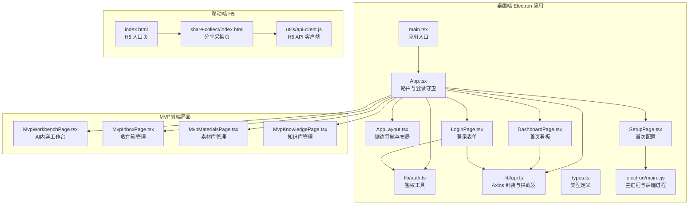

**图表来源**
- [desktop/src/main.tsx:1-14](file://desktop/src/main.tsx#L1-L14)
- [desktop/src/App.tsx:68-194](file://desktop/src/App.tsx#L68-L194)
- [desktop/src/components/AppLayout.tsx:51-104](file://desktop/src/components/AppLayout.tsx#L51-L104)
- [desktop/src/pages/LoginPage.tsx:6-68](file://desktop/src/pages/LoginPage.tsx#L6-L68)
- [desktop/src/pages/dashboard/DashboardPage.tsx:44-216](file://desktop/src/pages/dashboard/DashboardPage.tsx#L44-L216)
- [desktop/src/pages/SetupPage.tsx:18-197](file://desktop/src/pages/SetupPage.tsx#L18-L197)
- [desktop/src/lib/auth.ts:1-38](file://desktop/src/lib/auth.ts#L1-L38)
- [desktop/src/lib/api.ts:1-593](file://desktop/src/lib/api.ts#L1-L593)
- [desktop/src/types.ts:1-329](file://desktop/src/types.ts#L1-L329)
- [desktop/electron/main.cjs:173-195](file://desktop/electron/main.cjs#L173-L195)
- [mobile-h5/index.html:1-41](file://mobile-h5/index.html#L1-L41)
- [mobile-h5/src/pages/share-collect/index.html:1-118](file://mobile-h5/src/pages/share-collect/index.html#L1-L118)
- [mobile-h5/src/utils/api-client.js:1-319](file://mobile-h5/src/utils/api-client.js#L1-L319)

**章节来源**
- [desktop/package.json:1-77](file://desktop/package.json#L1-L77)
- [desktop/vite.config.ts:1-23](file://desktop/vite.config.ts#L1-L23)
- [desktop/src/main.tsx:1-14](file://desktop/src/main.tsx#L1-L14)
- [desktop/src/App.tsx:68-194](file://desktop/src/App.tsx#L68-L194)

## 核心组件
- 应用入口与路由
  - 入口文件负责挂载 React 根节点与路由上下文，并引入全局样式。
  - 应用根组件负责登录守卫、路由切换、桌面端启动流程与页面渲染。
- 布局与导航
  - 侧边栏导航按功能分组，支持活跃态高亮与徽标提示；底部展示版本信息与登出按钮。
  - **新增MVP功能分组**：内容生产（AI中枢、采集中心、AI工作台）、知识管理（知识库）、内容管理（收件箱、素材库）、业务管理（线索管理、客户管理）、管理层（老板看板）。
- 登录与鉴权
  - 本地存储令牌与重定向路径；统一登出事件广播；登录表单提交后消费重定向路径。
- API 与拦截器
  - Axios 实例按运行时动态解析 API 基地址；请求头注入 Bearer Token；401 统一清理令牌并上抛错误。
- 类型系统
  - 以 TypeScript 类型定义贯穿数据模型，确保前后端契约一致与 IDE 提示完善。
  - **新增MVP核心类型**：MvpInboxItem、MvpMaterialItem、MvpKnowledgeItem、MvpTag等。
- 桌面端主进程
  - 负责读取/保存数据库配置、启动/停止后端进程、健康检查轮询、IPC 暴露配置读写与后端状态查询。
- H5 客户端
  - 提供企业微信 OAuth、短期票据换 Token、本地存储配置、请求超时与重试、幂等防抖等能力。

**章节来源**
- [desktop/src/main.tsx:1-14](file://desktop/src/main.tsx#L1-L14)
- [desktop/src/App.tsx:35-194](file://desktop/src/App.tsx#L35-L194)
- [desktop/src/components/AppLayout.tsx:51-104](file://desktop/src/components/AppLayout.tsx#L51-L104)
- [desktop/src/lib/auth.ts:1-38](file://desktop/src/lib/auth.ts#L1-L38)
- [desktop/src/lib/api.ts:1-593](file://desktop/src/lib/api.ts#L1-L593)
- [desktop/src/types.ts:330-458](file://desktop/src/types.ts#L330-L458)
- [desktop/electron/main.cjs:147-170](file://desktop/electron/main.cjs#L147-L170)
- [mobile-h5/src/utils/api-client.js:62-170](file://mobile-h5/src/utils/api-client.js#L62-L170)

## 架构总览
桌面端采用"Electron 主进程 + 渲染进程（React SPA）+ 内置后端"的一体化架构。渲染进程通过 IPC 与主进程交互，完成数据库配置、后端进程生命周期与健康检查；同时通过 Axios 封装与后端 API 通信。移动端 H5 作为独立页面集合，通过统一的 API 客户端与后端交互，支持企业微信 OAuth 与短期票据授权。

```mermaid
graph TB
subgraph "Electron 主进程"
MP["main.cjs<br/>进程管理/IPC/健康检查"]
end
subgraph "渲染进程React SPA"
R_Root["main.tsx"]
R_App["App.tsx"]
R_Layout["AppLayout.tsx"]
R_Auth["lib/auth.ts"]
R_Api["lib/api.ts"]
end
subgraph "后端服务"
BE["后端进程由主进程启动"]
end
subgraph "MVP前端界面"
M_Workbench["AI内容工作台<br/>内容生成与合规检测"]
M_Inbox["收件箱管理<br/>素材筛选与处理"]
M_Materials["素材库管理<br/>素材资产与标签"]
M_Knowledge["知识库管理<br/>知识检索与构建"]
end
subgraph "移动端 H5"
H5_Index["index.html"]
H5_Page["share-collect/index.html"]
H5_Client["utils/api-client.js"]
end
MP <- --> R_App
R_App --> R_Layout
R_App --> R_Auth
R_App --> R_Api
R_Api --> BE
R_App --> M_Workbench
R_App --> M_Inbox
R_App --> M_Materials
R_App --> M_Knowledge
H5_Page --> H5_Client
H5_Client --> BE
```

**图表来源**
- [desktop/electron/main.cjs:173-195](file://desktop/electron/main.cjs#L173-L195)
- [desktop/src/main.tsx:1-14](file://desktop/src/main.tsx#L1-L14)
- [desktop/src/App.tsx:68-194](file://desktop/src/App.tsx#L68-L194)
- [desktop/src/components/AppLayout.tsx:51-104](file://desktop/src/components/AppLayout.tsx#L51-L104)
- [desktop/src/lib/auth.ts:1-38](file://desktop/src/lib/auth.ts#L1-L38)
- [desktop/src/lib/api.ts:1-593](file://desktop/src/lib/api.ts#L1-L593)
- [mobile-h5/index.html:1-41](file://mobile-h5/index.html#L1-L41)
- [mobile-h5/src/pages/share-collect/index.html:1-118](file://mobile-h5/src/pages/share-collect/index.html#L1-L118)
- [mobile-h5/src/utils/api-client.js:189-267](file://mobile-h5/src/utils/api-client.js#L189-L267)

## 详细组件分析

### 桌面端应用启动与路由控制
- 启动阶段
  - 判断是否运行于 Electron 环境，加载数据库配置，解析后端端口并写入本地运行时基地址。
  - 调用后端健康检查，若未就绪则进入首次配置页；否则进入主应用。
- 登录守卫
  - 未登录时记录重定向路径并跳转登录页；监听登出事件进行路由跳转。
- 页面路由
  - **更新** 主应用路由包含仪表盘、采集中心、收件箱、素材库、AI 工作台、合规审核、线索池、客户管理、发布任务等。
  - **新增MVP路由**：/mvp-workbench（AI内容工作台）、/mvp-inbox（收件箱管理）、/mvp-materials（素材库管理）、/knowledge（知识库管理）。

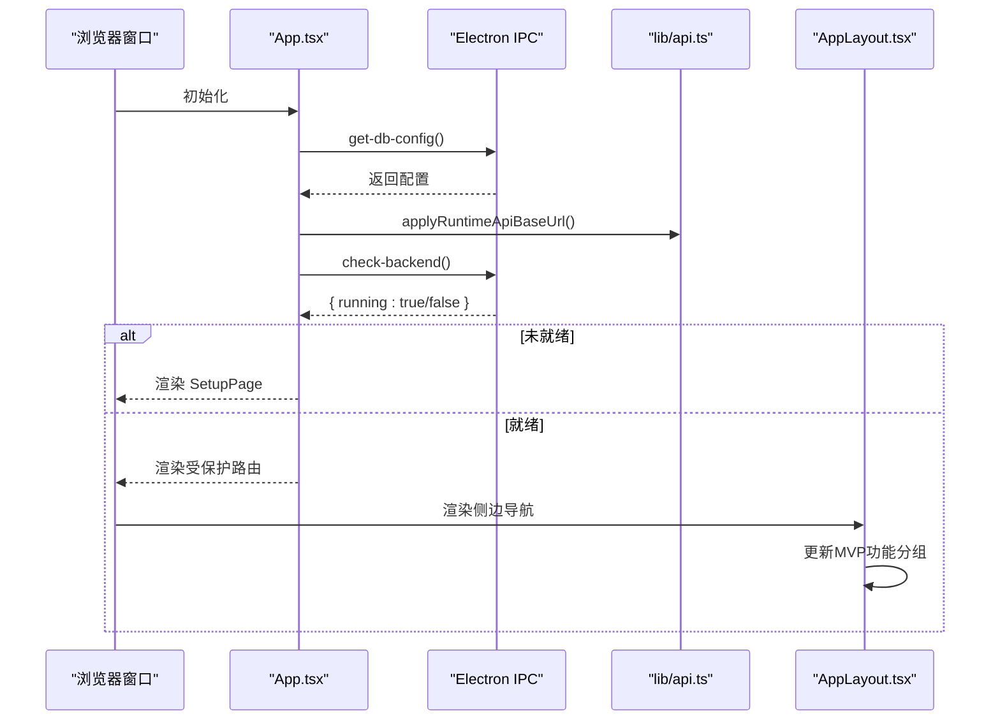

**图表来源**
- [desktop/src/App.tsx:73-94](file://desktop/src/App.tsx#L73-L94)
- [desktop/src/App.tsx:111-121](file://desktop/src/App.tsx#L111-L121)
- [desktop/electron/main.cjs:147-170](file://desktop/electron/main.cjs#L147-L170)
- [desktop/src/lib/api.ts:4-12](file://desktop/src/lib/api.ts#L4-L12)

**章节来源**
- [desktop/src/App.tsx:68-194](file://desktop/src/App.tsx#L68-L194)
- [desktop/src/components/AppLayout.tsx:51-104](file://desktop/src/components/AppLayout.tsx#L51-L104)

### 登录与鉴权流程
- 登录表单
  - 读取用户名/密码，调用登录 API 获取访问令牌，写入本地存储并消费重定向路径。
- 登出与事件广播
  - 清理令牌并触发自定义登出事件，路由监听该事件跳转登录页。
- 令牌注入与 401 处理
  - 请求拦截器自动附加 Authorization 头；响应拦截器对 401 清理令牌并上抛错误。

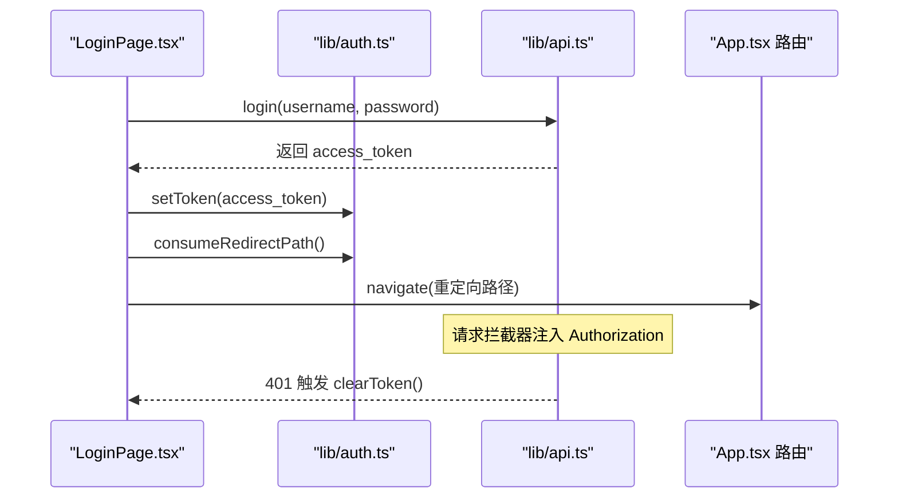

**图表来源**
- [desktop/src/pages/LoginPage.tsx:14-33](file://desktop/src/pages/LoginPage.tsx#L14-L33)
- [desktop/src/lib/auth.ts:9-22](file://desktop/src/lib/auth.ts#L9-L22)
- [desktop/src/lib/api.ts:21-38](file://desktop/src/lib/api.ts#L21-L38)
- [desktop/src/App.tsx:96-104](file://desktop/src/App.tsx#L96-L104)

**章节来源**
- [desktop/src/pages/LoginPage.tsx:6-68](file://desktop/src/pages/LoginPage.tsx#L6-L68)
- [desktop/src/lib/auth.ts:1-38](file://desktop/src/lib/auth.ts#L1-L38)
- [desktop/src/lib/api.ts:1-593](file://desktop/src/lib/api.ts#L1-L593)

### 首次配置与后端进程管理
- 配置项
  - 包含数据库主机、端口、用户、密码、库名、JWT 密钥与后端服务端口。
- 保存与重启
  - 保存配置后通过 IPC 通知主进程，停止旧后端并以新配置启动，随后健康检查。
- 运行时基地址
  - 首次配置页保存后，应用根据配置动态设置 API 基地址，确保后续请求指向正确端口。

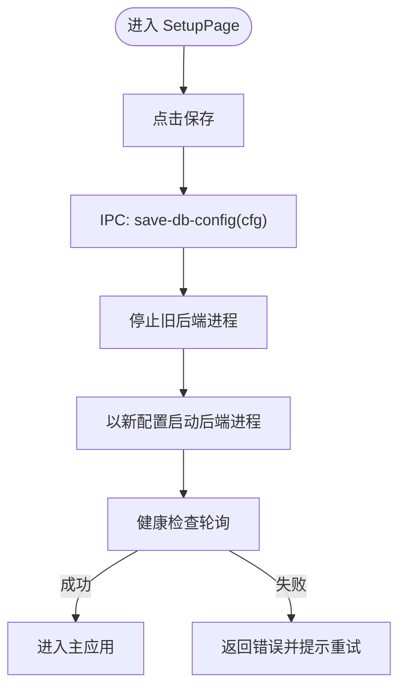

**图表来源**
- [desktop/src/pages/SetupPage.tsx:61-76](file://desktop/src/pages/SetupPage.tsx#L61-L76)
- [desktop/electron/main.cjs:148-160](file://desktop/electron/main.cjs#L148-L160)
- [desktop/src/App.tsx:115-118](file://desktop/src/App.tsx#L115-L118)

**章节来源**
- [desktop/src/pages/SetupPage.tsx:18-197](file://desktop/src/pages/SetupPage.tsx#L18-L197)
- [desktop/electron/main.cjs:147-170](file://desktop/electron/main.cjs#L147-L170)

### 首页看板与数据流
- 并行加载
  - 同步加载仪表盘汇总、趋势与发布任务统计，任一失败不影响其他数据展示。
- 图表与交互
  - 使用 Recharts 展示趋势折线图；点击工作流步骤跳转对应页面。
- 错误处理
  - 统一捕获错误并展示提示，避免页面崩溃。

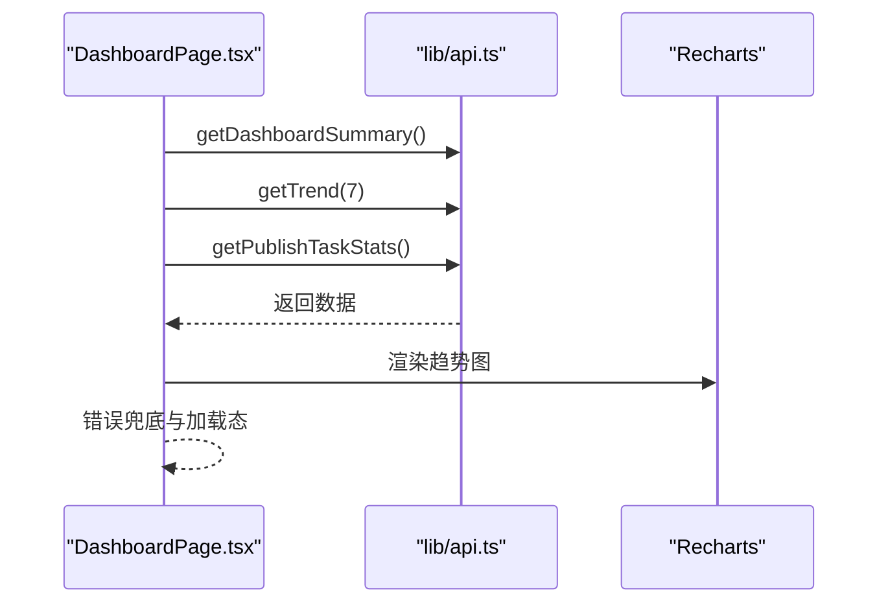

**图表来源**
- [desktop/src/pages/dashboard/DashboardPage.tsx:52-71](file://desktop/src/pages/dashboard/DashboardPage.tsx#L52-L71)
- [desktop/src/lib/api.ts:67-75](file://desktop/src/lib/api.ts#L67-L75)

**章节来源**
- [desktop/src/pages/dashboard/DashboardPage.tsx:44-216](file://desktop/src/pages/dashboard/DashboardPage.tsx#L44-L216)

### 移动端 H5 设计与响应式适配
- 设计原则
  - 以最小可用为目标，聚焦"分享采集、截图 OCR、快捷记录、企微转发承接"四大入口。
  - 采用语义化结构与卡片网格布局，保证在窄屏设备上的可读性与可点触性。
- 响应式策略
  - 使用 viewport 设置与基础栅格布局，配合相对单位与弹性容器适配不同屏幕尺寸。
  - 表单控件与按钮具备合适的触摸目标尺寸，减少误操作。
- 授权与提交
  - 支持企业微信 OAuth 与短期票据两种授权方式；提交前进行必填校验与状态提示。

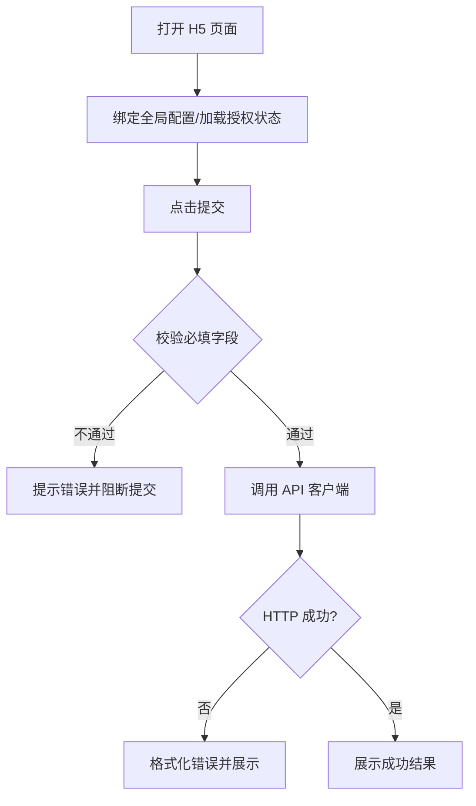

**图表来源**
- [mobile-h5/src/pages/share-collect/index.html:68-114](file://mobile-h5/src/pages/share-collect/index.html#L68-L114)
- [mobile-h5/src/utils/api-client.js:189-267](file://mobile-h5/src/utils/api-client.js#L189-L267)

**章节来源**
- [mobile-h5/index.html:1-41](file://mobile-h5/index.html#L1-L41)
- [mobile-h5/src/pages/share-collect/index.html:1-118](file://mobile-h5/src/pages/share-collect/index.html#L1-L118)
- [mobile-h5/src/utils/api-client.js:1-319](file://mobile-h5/src/utils/api-client.js#L1-L319)

### UI 组件库使用与自定义规范
- 组件库
  - 项目中使用 Recharts 进行数据可视化，满足折线图等图表需求。
- 自定义组件
  - 采用函数式组件与 Hooks 模式，保持组件职责单一、可复用性强。
  - 布局组件（如 AppLayout）集中管理导航与版本信息，便于统一风格与维护。
- 样式与主题
  - 通过全局样式与卡片/网格等通用类名实现一致的视觉语言，避免过度内联样式。

**章节来源**
- [desktop/src/pages/dashboard/DashboardPage.tsx:3-5](file://desktop/src/pages/dashboard/DashboardPage.tsx#L3-L5)
- [desktop/src/components/AppLayout.tsx:51-104](file://desktop/src/components/AppLayout.tsx#L51-L104)

### 状态管理与数据流最佳实践
- 本地状态
  - 页面级状态使用 useState/ useEffect 管理，避免跨层级传递复杂 props。
- 全局状态
  - 当前项目未引入集中式状态库，推荐在需要跨组件共享的数据（如用户信息、全局配置）处引入上下文或轻量状态库，以降低耦合并提升可测试性。
- 数据缓存与去重
  - 对高频请求（如趋势、任务统计）采用并发请求与缓存策略，减少重复请求。
- 错误边界
  - 在页面层捕获错误并展示，避免影响整体应用稳定性。

**章节来源**
- [desktop/src/pages/dashboard/DashboardPage.tsx:44-71](file://desktop/src/pages/dashboard/DashboardPage.tsx#L44-L71)
- [desktop/src/lib/api.ts:30-38](file://desktop/src/lib/api.ts#L30-L38)

### 与后端 API 的集成与错误处理
- 基地址解析
  - 优先使用运行时存储的本地基地址（桌面端），开发/非 Electron 环境回退至构建期环境变量。
- 请求拦截
  - 自动注入 Authorization 头；在每次请求前刷新基地址，确保动态端口生效。
- 响应拦截
  - 401 统一清理令牌并上抛错误，交由上层处理（如路由跳转登录页）。
- H5 端集成
  - 提供统一的 API 调用封装，支持超时、重试、幂等键、敏感参数清理与错误格式化。

**章节来源**
- [desktop/src/lib/api.ts:4-38](file://desktop/src/lib/api.ts#L4-L38)
- [mobile-h5/src/utils/api-client.js:189-267](file://mobile-h5/src/utils/api-client.js#L189-L267)

## MVP前端界面详解

### AI内容工作台（MvpWorkbenchPage）
AI内容工作台是MVP前端的核心页面，提供完整的AI内容生成与合规检测功能：

- **配置参数系统**
  - 平台选择：小红书、抖音、知乎等主流社交平台
  - 账号定位：助贷顾问、中介、科普号等不同角色
  - 目标人群：征信花、负债高、上班族、个体户等细分群体
  - 内容主题：贷款、征信、网贷、公积金等金融相关内容
  - 内容目标：引导私信、引导咨询、促进转化等营销目标
  - 说话口吻：专业严谨、亲切友好、幽默风趣、共情走心、紧迫感等风格
  - AI模型：火山模型、本地模型等不同技术方案

- **生成流程**
  - 用户配置完成后，点击"开始生成"按钮触发内容生成
  - 支持多版本文案生成，包括改写基础版和三种风格版本
  - 实时显示生成进度，提供复制功能便于使用

- **合规检测**
  - 集成合规风险检测功能，自动识别潜在违规内容
  - 提供风险等级显示（低风险、中风险、高风险）
  - 支持自动修正建议和重新生成合规版本

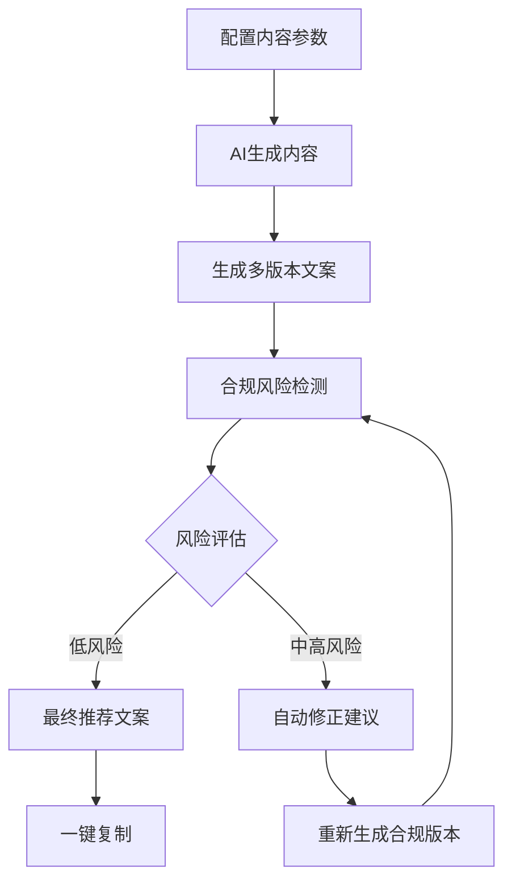

**图表来源**
- [desktop/src/pages/ai-workbench/MvpWorkbenchPage.tsx:116-800](file://desktop/src/pages/ai-workbench/MvpWorkbenchPage.tsx#L116-L800)

**章节来源**
- [desktop/src/pages/ai-workbench/MvpWorkbenchPage.tsx:1-856](file://desktop/src/pages/ai-workbench/MvpWorkbenchPage.tsx#L1-L856)

### 收件箱管理（MvpInboxPage）
收件箱管理页面提供素材筛选与处理功能：

- **筛选系统**
  - 平台筛选：支持小红书、抖音、知乎、微博等平台过滤
  - 状态筛选：待处理、已入素材库、已废弃等业务状态
  - 来源筛选：采集、手动导入等不同内容来源
  - 风险等级：低风险、中风险、高风险等安全等级
  - 重复状态：唯一、疑似重复、重复等质量状态
  - 关键词搜索：支持内容关键词快速检索

- **内容展示**
  - 卡片式布局，支持展开查看完整内容
  - 风险标签、状态标签、评分等可视化标识
  - 平台标识、作者信息、创建时间等元数据展示

- **批量操作**
  - 入素材库：将优质内容直接入库
  - 标记爆款：识别和标记高价值内容
  - 废弃处理：对低质量内容进行废弃

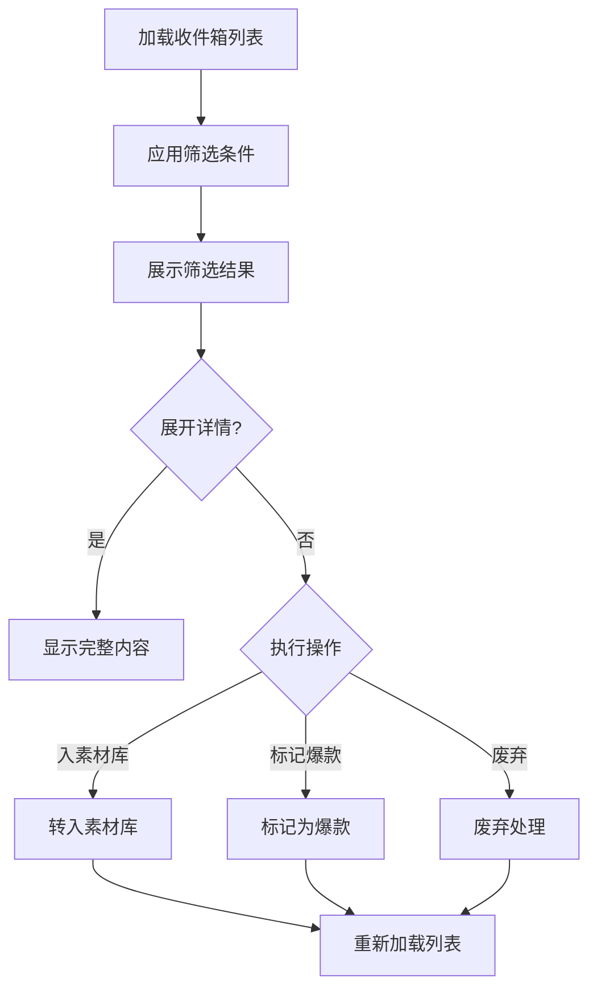

**图表来源**
- [desktop/src/pages/inbox/MvpInboxPage.tsx:108-741](file://desktop/src/pages/inbox/MvpInboxPage.tsx#L108-L741)

**章节来源**
- [desktop/src/pages/inbox/MvpInboxPage.tsx:1-741](file://desktop/src/pages/inbox/MvpInboxPage.tsx#L1-L741)

### 素材库管理（MvpMaterialsPage）
素材库管理页面提供素材资产管理与标签系统：

- **素材列表**
  - 平台过滤：小红书、抖音、知乎、微博等平台筛选
  - 标签管理：支持多维度标签分类和管理
  - 人群定位：负债人群、上班族、个体户等目标受众
  - 风格分类：专业型、口语型、种草型、避坑型等内容风格
  - 爆款标记：支持爆款内容的识别和管理

- **详情面板**
  - 基本信息：标题、平台、作者、链接等元数据
  - 正文内容：完整内容展示和统计信息
  - 标签系统：支持标签的添加、编辑和管理
  - 爆款结构：对爆款内容进行结构化分析

- **操作功能**
  - AI改写：基于AI工作台进行内容改写
  - 转入改写：直接进入改写流程
  - 构建知识：将素材转化为知识库内容
  - 爆款仿写：基于爆款结构进行内容创作
  - 标记管理：支持爆款标记的添加和取消

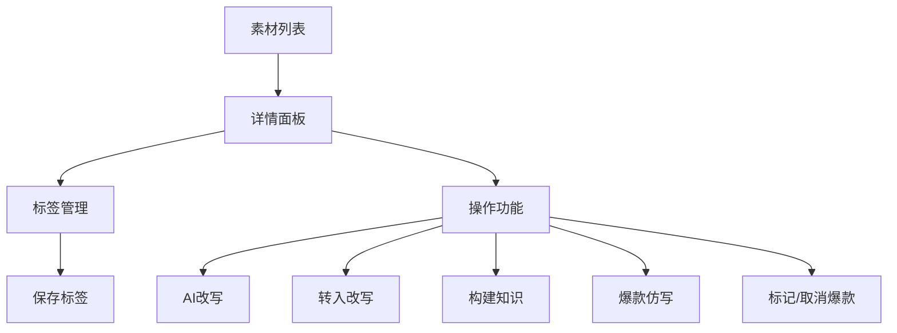

**图表来源**
- [desktop/src/pages/materials/MvpMaterialsPage.tsx:83-576](file://desktop/src/pages/materials/MvpMaterialsPage.tsx#L83-L576)

**章节来源**
- [desktop/src/pages/materials/MvpMaterialsPage.tsx:1-576](file://desktop/src/pages/materials/MvpMaterialsPage.tsx#L1-L576)

### 知识库管理（MvpKnowledgePage）
知识库管理页面提供知识检索与构建功能：

- **知识检索**
  - 平台筛选：支持不同平台的知识内容检索
  - 人群定位：针对不同受众群体的知识内容
  - 风格分类：专业型、口语型、种草型等知识风格
  - 分类管理：贷款知识、行业案例、风险提示、平台策略等分类

- **内容展示**
  - 标题/摘要：支持标题和内容摘要的快速浏览
  - 分类标签：不同颜色标识的知识分类
  - 使用统计：知识内容的使用次数和效果
  - 时间信息：创建时间和更新时间

- **知识详情**
  - 基本信息：标题、分类、平台、人群、风格等元数据
  - 知识内容：完整知识内容的结构化展示
  - 元数据：来源素材、使用次数、创建时间等详细信息
  - 操作功能：去AI工作台生成、查看来源素材、重新构建等

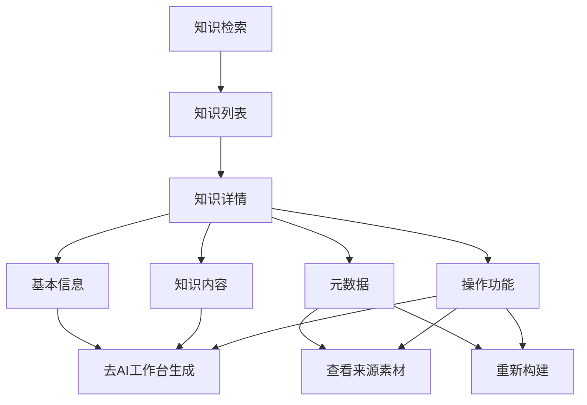

**图表来源**
- [desktop/src/pages/knowledge/MvpKnowledgePage.tsx:76-751](file://desktop/src/pages/knowledge/MvpKnowledgePage.tsx#L76-L751)

**章节来源**
- [desktop/src/pages/knowledge/MvpKnowledgePage.tsx:1-751](file://desktop/src/pages/knowledge/MvpKnowledgePage.tsx#L1-L751)

### 传统AI工作台对比
**更新** 项目中保留了传统的AI工作台页面（AIWorkbenchPage），主要区别在于：
- **MVP工作台**：专注于内容生成、合规检测、素材转换等MVP核心功能
- **传统工作台**：提供更通用的AI改写、图片理解等功能
- **路由区分**：MVP页面使用/mvp-前缀，传统页面使用普通前缀

**章节来源**
- [desktop/src/pages/ai-workbench/AIWorkbenchPage.tsx:1-231](file://desktop/src/pages/ai-workbench/AIWorkbenchPage.tsx#L1-L231)

## 依赖关系分析
- 构建与开发
  - Vite 提供开发服务器与预览，Electron Builder 负责打包与安装包生成。
- 运行时依赖
  - React 生态与 Recharts 用于界面与可视化；Axios 用于 HTTP 通信。
- 桌面端打包
  - 将前端 dist 与 Electron 资源打包，额外拷贝后端可执行文件到指定目录。
- **MVP核心依赖**
  - 新增MVP类型定义与API接口，支持完整的业务流程
  - 集成合规检测、风险评估、标签管理等MVP特有功能

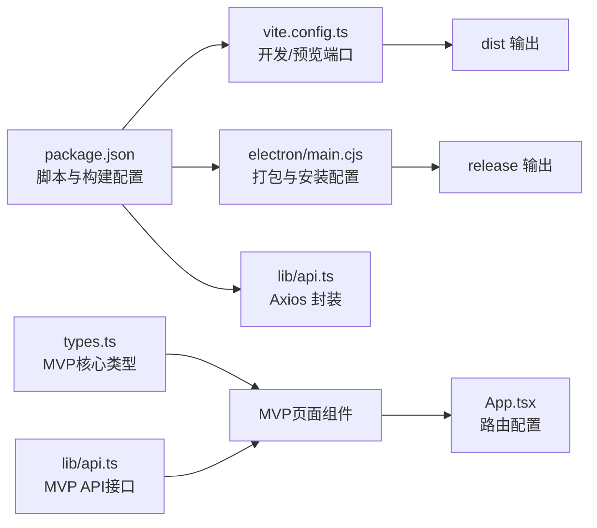

**图表来源**
- [desktop/package.json:8-20](file://desktop/package.json#L8-L20)
- [desktop/vite.config.ts:4-22](file://desktop/vite.config.ts#L4-L22)
- [desktop/electron/main.cjs:42-46](file://desktop/electron/main.cjs#L42-L46)
- [desktop/src/lib/api.ts:16-19](file://desktop/src/lib/api.ts#L16-L19)
- [desktop/src/types.ts:330-458](file://desktop/src/types.ts#L330-L458)

**章节来源**
- [desktop/package.json:1-77](file://desktop/package.json#L1-L77)
- [desktop/vite.config.ts:1-23](file://desktop/vite.config.ts#L1-L23)
- [desktop/electron/main.cjs:45-75](file://desktop/electron/main.cjs#L45-L75)

## 性能考量
- 资源加载
  - 首屏路由懒加载与按需渲染，减少初始包体积。
  - **MVP页面优化**：AI工作台、收件箱、素材库等核心页面采用懒加载策略。
- 请求优化
  - 并发请求聚合与去重，合理设置超时与重试；对长列表采用虚拟滚动与分页。
  - **MVP数据优化**：支持分页加载、筛选缓存、批量操作等性能优化。
- 缓存策略
  - 对静态配置与只读数据进行本地缓存，降低重复请求。
  - **MVP缓存**：标签数据、平台配置、风险等级等静态数据缓存。
- 渲染性能
  - 控制不必要的重渲染，使用 React.memo 与 useMemo/useCallback。
  - **MVP渲染优化**：卡片组件、表格组件、详情面板等采用优化渲染策略。
- 桌面端体验
  - 预加载与健康检查避免白屏；窗口最小尺寸与固定宽高保障可用性。

## 故障排查指南
- 登录失败
  - 检查用户名/密码与后端服务状态；确认 Axios 请求拦截器已注入 Token。
- 401 未授权
  - 清理本地令牌并重新获取；确认后端 JWT 密钥与有效期配置。
- 后端未就绪
  - 查看桌面端健康检查日志；确认数据库配置与端口占用情况。
- H5 授权异常
  - 检查企业微信 OAuth 回调与短期票据有效性；清理敏感查询参数后重试。
- 网络不稳定
  - 调整请求超时与重试次数；在网络离线状态下提示用户恢复连接。
- **MVP功能异常**
  - AI生成失败：检查AI模型配置与后端服务状态
  - 收件箱加载失败：验证筛选条件与网络连接
  - 素材库操作异常：确认权限与数据完整性
  - 知识库检索失败：检查索引状态与搜索关键词

**章节来源**
- [desktop/src/lib/api.ts:30-38](file://desktop/src/lib/api.ts#L30-L38)
- [desktop/electron/main.cjs:104-118](file://desktop/electron/main.cjs#L104-L118)
- [mobile-h5/src/utils/api-client.js:24-38](file://mobile-h5/src/utils/api-client.js#L24-L38)
- [mobile-h5/src/utils/api-client.js:232-267](file://mobile-h5/src/utils/api-client.js#L232-L267)

## 结论
本项目在桌面端实现了"一体化 Electron 应用"，在移动端提供了轻量 H5 入口，二者通过统一的 API 客户端与后端交互。前端采用 React 函数式组件与 Hooks 模式，结合 Axios 拦截器与本地存储实现鉴权与数据流管理。

**更新亮点**：
- 完整的MVP前端界面实现，涵盖AI工作台、收件箱管理、素材库管理、知识库管理等核心业务流程
- 增强的布局导航系统，清晰的功能分组体现业务逻辑
- 完善的MVP类型系统与API接口，支持完整的业务闭环
- 优化的状态管理与数据流设计，提升用户体验与系统性能

建议在后续迭代中引入集中式状态管理与更完善的错误边界，持续优化性能与用户体验。

## 附录
- 开发与构建
  - 开发：同时启动 Vite 与 Electron；预览：本地预览与局域网预览。
  - 打包：构建前端产物并使用 Electron Builder 生成安装包，拷贝后端可执行文件。
- 配置项
  - 桌面端：数据库连接、JWT 密钥、后端端口；H5：API 基地址、Token、超时与重试。
- 类型定义
  - **新增MVP核心类型**：MvpInboxItem、MvpMaterialItem、MvpKnowledgeItem、MvpTag、MvpGenerateRequest等，确保MVP业务流程的前后端契约一致。
- **MVP页面路由**
  - /mvp-workbench：AI内容工作台
  - /mvp-inbox：收件箱管理
  - /mvp-materials：素材库管理
  - /knowledge：知识库管理

**章节来源**
- [desktop/package.json:8-20](file://desktop/package.json#L8-L20)
- [desktop/src/pages/SetupPage.tsx:19-28](file://desktop/src/pages/SetupPage.tsx#L19-L28)
- [mobile-h5/src/utils/api-client.js:62-82](file://mobile-h5/src/utils/api-client.js#L62-L82)
- [desktop/src/types.ts:330-458](file://desktop/src/types.ts#L330-L458)