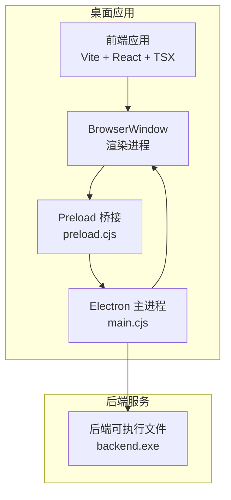
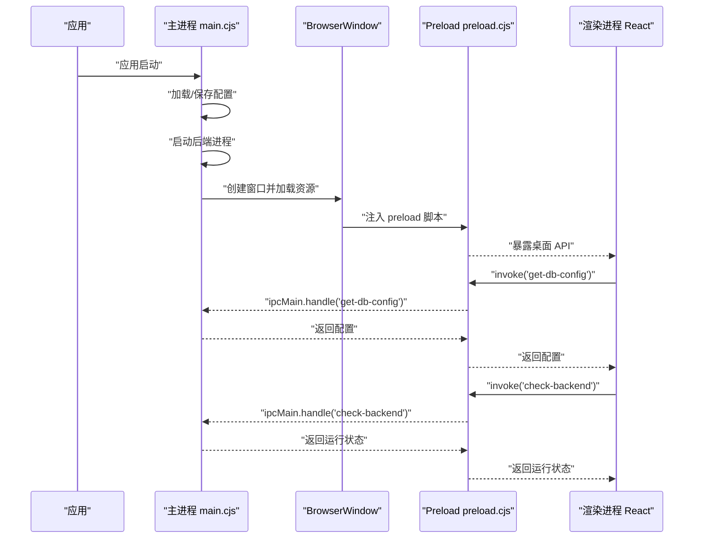
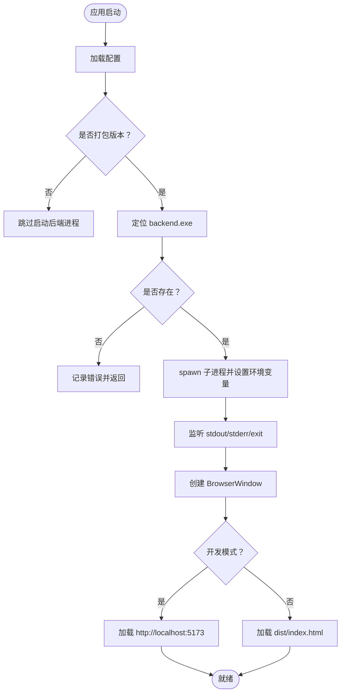
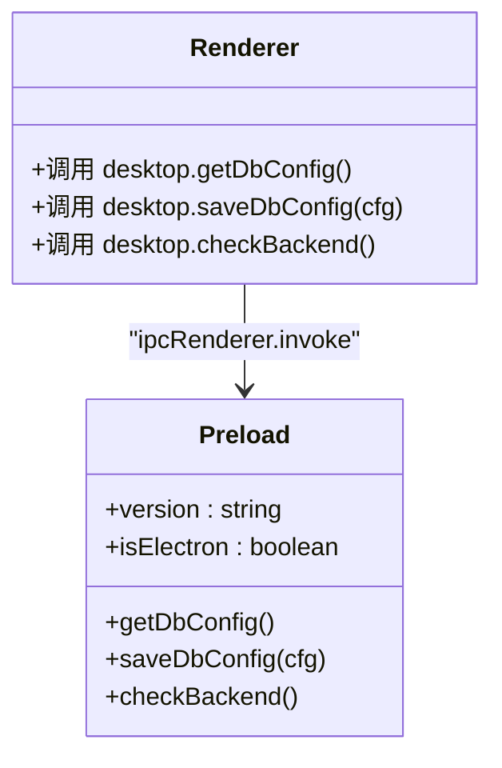
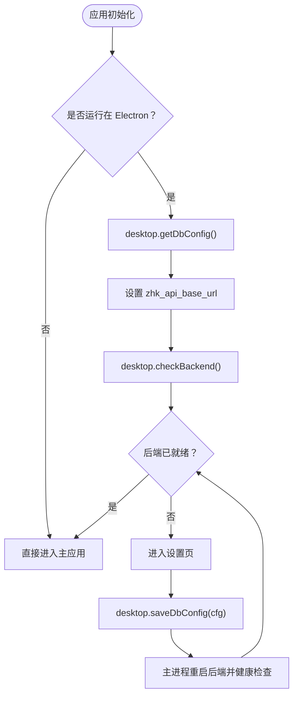
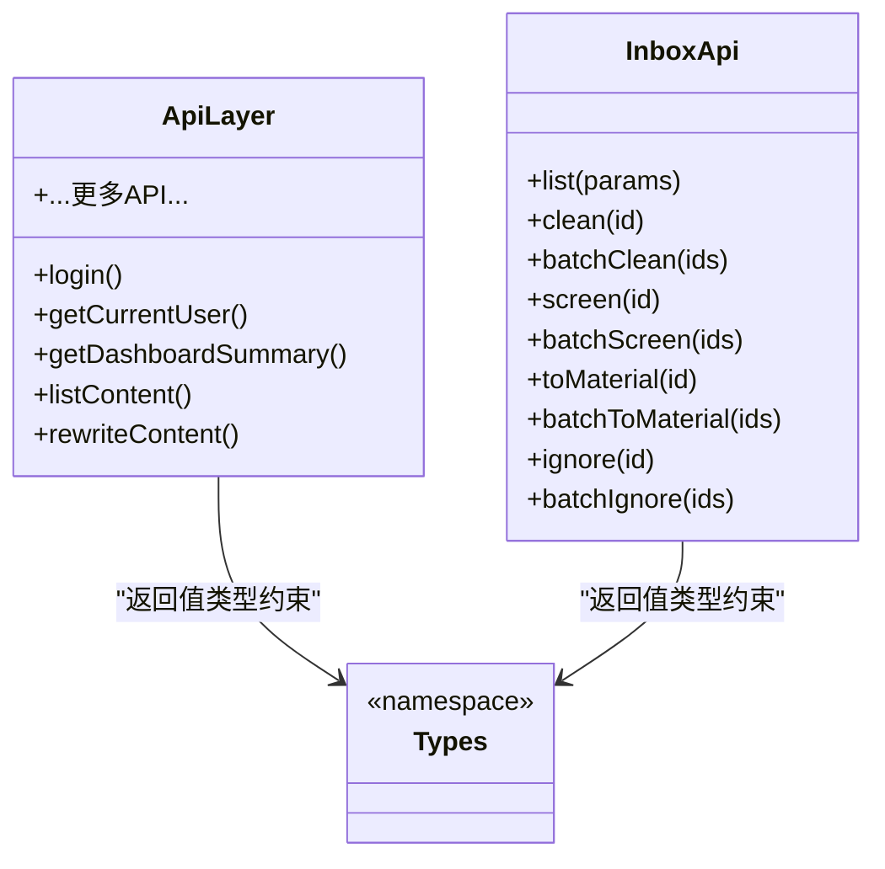
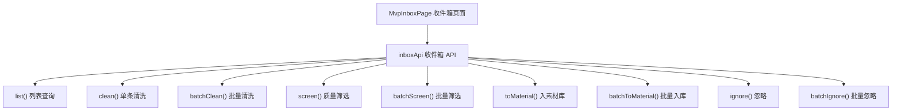
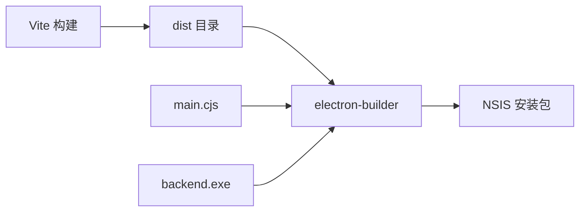
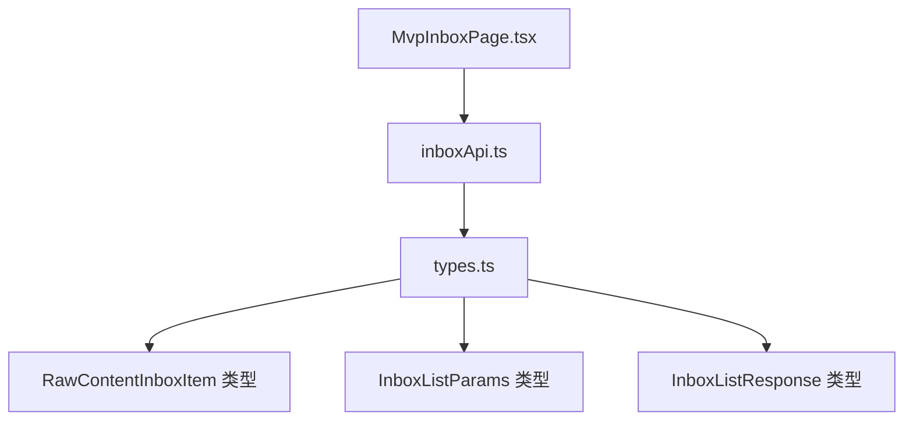

# 桌面应用架构

<cite>
**本文引用的文件**
- [desktop/package.json](file://desktop/package.json)
- [desktop/vite.config.ts](file://desktop/vite.config.ts)
- [desktop/electron/main.cjs](file://desktop/electron/main.cjs)
- [desktop/electron/preload.cjs](file://desktop/electron/preload.cjs)
- [desktop/src/main.tsx](file://desktop/src/main.tsx)
- [desktop/src/App.tsx](file://desktop/src/App.tsx)
- [desktop/src/components/AppLayout.tsx](file://desktop/src/components/AppLayout.tsx)
- [desktop/src/lib/api.ts](file://desktop/src/lib/api.ts)
- [desktop/src/lib/auth.ts](file://desktop/src/lib/auth.ts)
- [desktop/src/types.ts](file://desktop/src/types.ts)
- [desktop/src/pages/SetupPage.tsx](file://desktop/src/pages/SetupPage.tsx)
- [desktop/src/pages/LoginPage.tsx](file://desktop/src/pages/LoginPage.tsx)
- [desktop/src/pages/dashboard/DashboardPage.tsx](file://desktop/src/pages/dashboard/DashboardPage.tsx)
- [desktop/src/api/inboxApi.ts](file://desktop/src/api/inboxApi.ts)
- [desktop/src/pages/inbox/MvpInboxPage.tsx](file://desktop/src/pages/inbox/MvpInboxPage.tsx)
- [desktop/src/pages/inbox/InboxPage.tsx](file://desktop/src/pages/inbox/InboxPage.tsx)
- [desktop/index.html](file://desktop/index.html)
- [desktop/tsconfig.json](file://desktop/tsconfig.json)
</cite>

## 目录
1. [引言](#引言)
2. [项目结构](#项目结构)
3. [核心组件](#核心组件)
4. [架构总览](#架构总览)
5. [详细组件分析](#详细组件分析)
6. [依赖关系分析](#依赖关系分析)
7. [性能考量](#性能考量)
8. [故障排查指南](#故障排查指南)
9. [结论](#结论)
10. [附录](#附录)

## 引言
本技术文档面向"智获客"桌面应用，系统性阐述基于 Electron + React 的混合应用架构设计与实现细节。文档重点覆盖以下方面：
- 主进程与渲染进程的职责划分与协作机制
- React 应用在 Electron 环境中的运行机制（路由、状态管理、组件架构）
- Preload 安全桥接与 IPC 通信模式
- 桌面应用的窗口管理、菜单系统与快捷键处理
- Electron 配置优化与打包部署最佳实践
- 与系统原生功能的集成方式与安全考虑

## 项目结构
桌面端代码位于 desktop 目录，采用"前端 Vite + React + TypeScript + React Router + Axios"与"Electron 主进程 + Preload 桥接"的双层架构：
- 构建与开发：Vite 提供开发服务器与预览，Electron 通过脚本组合并发启动前端与主进程
- 打包与分发：electron-builder 将 Web 构建产物与主进程代码打包为可安装包，并内嵌后端二进制

**更新** 新增 inboxApi.ts API 包装器，提供全面的管道功能 API 覆盖，包括批处理操作和 mock 数据支持

图表来源
- [desktop/electron/main.cjs:120-144](file://desktop/electron/main.cjs#L120-L144)
- [desktop/electron/preload.cjs:1-11](file://desktop/electron/preload.cjs#L1-L11)
- [desktop/package.json:8-20](file://desktop/package.json#L8-L20)

章节来源
- [desktop/package.json:1-77](file://desktop/package.json#L1-L77)
- [desktop/vite.config.ts:1-23](file://desktop/vite.config.ts#L1-L23)
- [desktop/index.html:1-13](file://desktop/index.html#L1-L13)
- [desktop/tsconfig.json:1-19](file://desktop/tsconfig.json#L1-L19)

## 核心组件
- 主进程（Electron）：负责应用生命周期、窗口创建、后端进程管理、IPC 注册与系统交互
- Preload 桥接：通过 contextBridge 暴露受控 API 至渲染进程，隔离 Node.js 能力
- 渲染进程（React）：路由驱动的单页应用，按需加载页面组件，使用自定义 API 层访问后端
- 构建工具链：Vite 提供开发与预览，electron-builder 负责打包与安装包生成
- **新增** inboxApi：专门的收件箱 API 包装器，提供完整的管道功能操作

章节来源
- [desktop/electron/main.cjs:1-195](file://desktop/electron/main.cjs#L1-L195)
- [desktop/electron/preload.cjs:1-11](file://desktop/electron/preload.cjs#L1-L11)
- [desktop/src/main.tsx:1-14](file://desktop/src/main.tsx#L1-L14)
- [desktop/src/App.tsx:1-163](file://desktop/src/App.tsx#L1-L163)
- [desktop/src/api/inboxApi.ts:1-253](file://desktop/src/api/inboxApi.ts#L1-L253)

## 架构总览
Electron 混合应用采用"主进程 + 渲染进程 + Preload 桥接"的经典模式。主进程负责：
- 创建 BrowserWindow 并加载本地 HTML 或开发服务器地址
- 管理后端进程（spawn/kill），健康检查与日志输出
- 注册 IPC 处理函数，提供配置读写、后端状态查询等能力

渲染进程（React）通过 Preload 暴露的桌面 API 完成：
- 首次启动引导：读取/保存数据库配置，检查后端状态，决定进入设置页或主应用
- 登录与鉴权：本地存储 Token，拦截 401 自动登出
- API 访问：统一的 Axios 实例，自动注入 Authorization 与动态 baseURL

**更新** 新增 inboxApi 作为专门的收件箱操作 API，提供批处理能力与 mock 数据支持

图表来源
- [desktop/electron/main.cjs:147-170](file://desktop/electron/main.cjs#L147-L170)
- [desktop/electron/preload.cjs:3-10](file://desktop/electron/preload.cjs#L3-L10)
- [desktop/src/App.tsx:76-97](file://desktop/src/App.tsx#L76-L97)

## 详细组件分析

### 主进程（Electron 主进程）
职责与流程要点：
- 配置管理：读取/保存用户配置至 userData 目录；默认配置包含数据库与后端端口等
- 后端进程管理：根据打包状态选择启动策略；构建环境变量并以子进程方式启动；监听 stdout/stderr；优雅停止
- 健康检查：轮询后端 /health 接口，设定最大等待时间
- 窗口管理：创建 BrowserWindow，启用上下文隔离，禁用 Node 集成；开发模式加载本地 Vite 地址，生产模式加载 dist/index.html
- IPC 注册：提供获取配置、保存配置（含重启后端）、检查后端运行状态等接口

图表来源
- [desktop/electron/main.cjs:23-37](file://desktop/electron/main.cjs#L23-L37)
- [desktop/electron/main.cjs:65-101](file://desktop/electron/main.cjs#L65-L101)
- [desktop/electron/main.cjs:104-118](file://desktop/electron/main.cjs#L104-L118)
- [desktop/electron/main.cjs:123-144](file://desktop/electron/main.cjs#L123-L144)
- [desktop/electron/main.cjs:173-194](file://desktop/electron/main.cjs#L173-L194)

章节来源
- [desktop/electron/main.cjs:1-195](file://desktop/electron/main.cjs#L1-L195)

### Preload 桥接（安全桥接）
职责与流程要点：
- 使用 contextBridge.exposeInMainWorld 暴露受限 API 到渲染进程全局对象 window.desktop
- 仅暴露必要方法：获取配置、保存配置（触发主进程重启后端）、检查后端运行状态
- 渲染进程通过 ipcRenderer.invoke 与主进程进行异步通信

图表来源
- [desktop/electron/preload.cjs:1-11](file://desktop/electron/preload.cjs#L1-L11)
- [desktop/src/App.tsx:80-93](file://desktop/src/App.tsx#L80-L93)

章节来源
- [desktop/electron/preload.cjs:1-11](file://desktop/electron/preload.cjs#L1-L11)

### React 应用（路由、状态与组件）
职责与流程要点：
- 路由：BrowserRouter 包裹，定义多页面路由；登录保护组件对受保护路由生效
- 首次启动引导：在 Electron 环境下，先读取配置并设置运行时 API 基础地址，再检查后端状态，决定进入设置页或主应用
- 登录与鉴权：登录成功写入 Token，消费重定向路径；401 自动清除 Token 并触发登出事件
- 组件架构：侧边导航与主内容区分离，页面组件按功能模块组织

**更新** 新增 MvpInboxPage 收件箱页面，使用 inboxApi 进行管道功能操作

图表来源
- [desktop/src/App.tsx:71-97](file://desktop/src/App.tsx#L71-L97)
- [desktop/src/App.tsx:114-124](file://desktop/src/App.tsx#L114-L124)
- [desktop/src/lib/auth.ts:13-18](file://desktop/src/lib/auth.ts#L13-L18)

章节来源
- [desktop/src/main.tsx:1-14](file://desktop/src/main.tsx#L1-L14)
- [desktop/src/App.tsx:1-163](file://desktop/src/App.tsx#L1-L163)
- [desktop/src/components/AppLayout.tsx:1-108](file://desktop/src/components/AppLayout.tsx#L1-L108)
- [desktop/src/pages/LoginPage.tsx:1-69](file://desktop/src/pages/LoginPage.tsx#L1-L69)
- [desktop/src/pages/SetupPage.tsx:1-198](file://desktop/src/pages/SetupPage.tsx#L1-L198)

### API 层与类型系统
职责与流程要点：
- API 层：统一的 Axios 实例，支持动态 baseURL（Electron 下优先使用运行时设置的本地地址），自动注入 Authorization 头，拦截 401 清除 Token
- 类型系统：集中定义后端返回的数据模型，便于页面组件消费与校验

**更新** 新增 inboxApi.ts，提供专门的收件箱操作 API，包括：
- 列表查询：支持分页、筛选条件
- 单条操作：清洗、质量筛选、入素材库、忽略
- 批量操作：批量清洗、批量质量筛选、批量入素材库、批量忽略
- Mock 数据：当 API 调用失败时提供兜底数据

图表来源
- [desktop/src/lib/api.ts:1-604](file://desktop/src/lib/api.ts#L1-L604)
- [desktop/src/types.ts:1-329](file://desktop/src/types.ts#L1-L329)
- [desktop/src/api/inboxApi.ts:144-250](file://desktop/src/api/inboxApi.ts#L144-L250)

章节来源
- [desktop/src/lib/api.ts:1-604](file://desktop/src/lib/api.ts#L1-L604)
- [desktop/src/types.ts:1-329](file://desktop/src/types.ts#L1-L329)
- [desktop/src/api/inboxApi.ts:1-253](file://desktop/src/api/inboxApi.ts#L1-L253)

### 页面组件示例（收件箱）
职责与流程要点：
- **MvpInboxPage**：全新的收件箱管理页面，使用 inboxApi 进行管道功能操作
- **InboxPage**：原有的素材收件箱页面，使用现有 API 层
- 支持全选/取消全选、批量操作、分页、筛选等功能
- 实时状态更新与操作反馈

**更新** MvpInboxPage 作为新的收件箱管理界面，提供完整的管道功能操作：

图表来源
- [desktop/src/pages/inbox/MvpInboxPage.tsx:146-324](file://desktop/src/pages/inbox/MvpInboxPage.tsx#L146-L324)
- [desktop/src/api/inboxApi.ts:144-250](file://desktop/src/api/inboxApi.ts#L144-L250)

章节来源
- [desktop/src/pages/inbox/MvpInboxPage.tsx:1-868](file://desktop/src/pages/inbox/MvpInboxPage.tsx#L1-L868)
- [desktop/src/pages/inbox/InboxPage.tsx:1-673](file://desktop/src/pages/inbox/InboxPage.tsx#L1-L673)
- [desktop/src/api/inboxApi.ts:1-253](file://desktop/src/api/inboxApi.ts#L1-L253)

### 类型系统增强
职责与流程要点：
- **RawContentInboxItem**：收件箱核心数据结构，包含平台、状态、评分等字段
- **InboxListParams**：列表查询参数，支持分页与多维度筛选
- **InboxListResponse**：列表响应结构，包含数据项与分页信息

**更新** 新增收件箱专用类型定义：

章节来源
- [desktop/src/types.ts:580-629](file://desktop/src/types.ts#L580-L629)

## 依赖关系分析
- 构建与开发
  - Vite 提供开发服务器与预览，严格端口绑定，测试环境使用 jsdom
  - npm 脚本组合并发启动前端与 Electron，生产构建后交由 electron-builder 打包
- 打包与分发
  - electron-builder 配置 appId、产品名、输出目录、额外资源（后端二进制）、NSIS 安装选项

**更新** 新增 inboxApi 依赖关系：

图表来源
- [desktop/vite.config.ts:4-22](file://desktop/vite.config.ts#L4-L22)
- [desktop/package.json:8-20](file://desktop/package.json#L8-L20)
- [desktop/package.json:45-75](file://desktop/package.json#L45-L75)

章节来源
- [desktop/package.json:1-77](file://desktop/package.json#L1-L77)
- [desktop/vite.config.ts:1-23](file://desktop/vite.config.ts#L1-L23)

## 性能考量
- 启动阶段
  - 后端健康检查设置合理超时，避免长时间阻塞
  - 预加载脚本最小化暴露 API，降低上下文隔离风险
- 网络请求
  - 统一 baseURL 与超时控制，减少重复配置
  - 401 自动登出，避免无效重试
  - **新增** inboxApi 提供 mock 数据兜底，提升用户体验
- UI 体验
  - 首屏加载屏与并行数据请求，提升感知性能
  - 图表组件按需渲染，避免不必要的重绘
  - **新增** 收件箱页面支持全选/批量操作，提升批量处理效率

## 故障排查指南
- 后端未就绪
  - 现象：首次启动停留在加载界面或跳转到设置页
  - 排查：确认配置正确、后端二进制存在、端口未被占用；检查主进程日志输出
- IPC 调用失败
  - 现象：渲染进程调用 desktop.* 方法报错
  - 排查：确认 preload 已注入、主进程已注册对应 ipcMain.handle、Electron 版本兼容
- 登录失效
  - 现象：出现 401 并自动登出
  - 排查：检查 Token 是否过期、后端鉴权配置、网络连通性
- 打包后无法启动
  - 现象：安装后无法打开或黑屏
  - 排查：确认 extraResources 正确包含 backend.exe、安装目录权限、防火墙放行
- **新增** 收件箱操作失败
  - 现象：批量操作无响应或报错
  - 排查：检查网络连接、后端服务状态、inboxApi 调用链路

章节来源
- [desktop/electron/main.cjs:104-118](file://desktop/electron/main.cjs#L104-L118)
- [desktop/electron/preload.cjs:1-11](file://desktop/electron/preload.cjs#L1-L11)
- [desktop/src/lib/api.ts:30-38](file://desktop/src/lib/api.ts#L30-L38)
- [desktop/package.json:56-61](file://desktop/package.json#L56-L61)

## 结论
该桌面应用通过清晰的主/渲染进程边界、严格的 Preload 安全桥接与完善的 IPC 通信，实现了 React 应用在 Electron 环境中的稳定运行。结合统一的 API 层与类型系统，以及合理的启动引导与错误处理机制，整体具备良好的可维护性与扩展性。

**更新** 新增的 inboxApi 和 MvpInboxPage 页面显著增强了应用的功能完整性，提供了完整的管道功能操作能力，包括：
- 全面的收件箱操作 API 覆盖
- 批量处理能力，提升工作效率
- Mock 数据支持，改善用户体验
- 专门的收件箱管理界面，提供直观的操作体验

建议在后续迭代中进一步完善菜单系统与快捷键处理、增强日志与监控能力，并持续优化打包体积与启动速度。

## 附录
- 开发与构建
  - 开发：npm run dev 同时启动 Vite 与 Electron
  - 预览：npm run preview
  - 生产构建：npm run build
  - 打包：npm run dist（Windows NSIS）
- TypeScript 配置
  - ESNext 模块解析、严格模式、React JSX 编译等
- **新增** 收件箱 API 使用指南
  - 列表查询：支持分页与多维度筛选
  - 单条操作：清洗、质量筛选、入素材库、忽略
  - 批量操作：批量处理提升效率
  - Mock 数据：API 失败时的兜底方案

章节来源
- [desktop/package.json:8-20](file://desktop/package.json#L8-L20)
- [desktop/tsconfig.json:1-19](file://desktop/tsconfig.json#L1-L19)
- [desktop/src/api/inboxApi.ts:1-253](file://desktop/src/api/inboxApi.ts#L1-L253)
- [desktop/src/pages/inbox/MvpInboxPage.tsx:1-868](file://desktop/src/pages/inbox/MvpInboxPage.tsx#L1-L868)