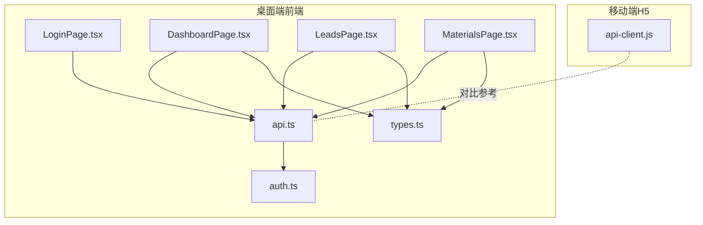
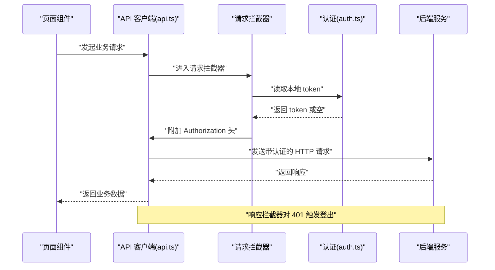
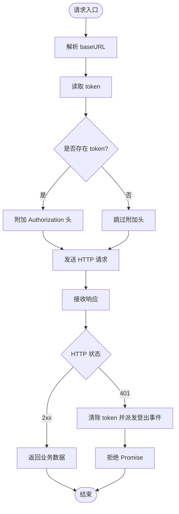
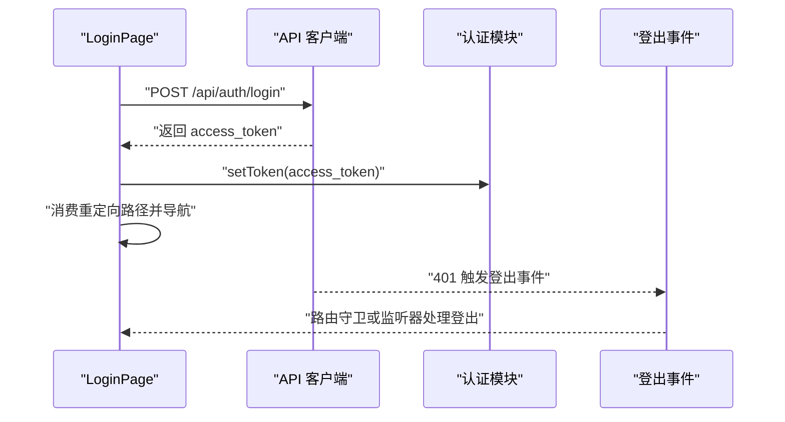
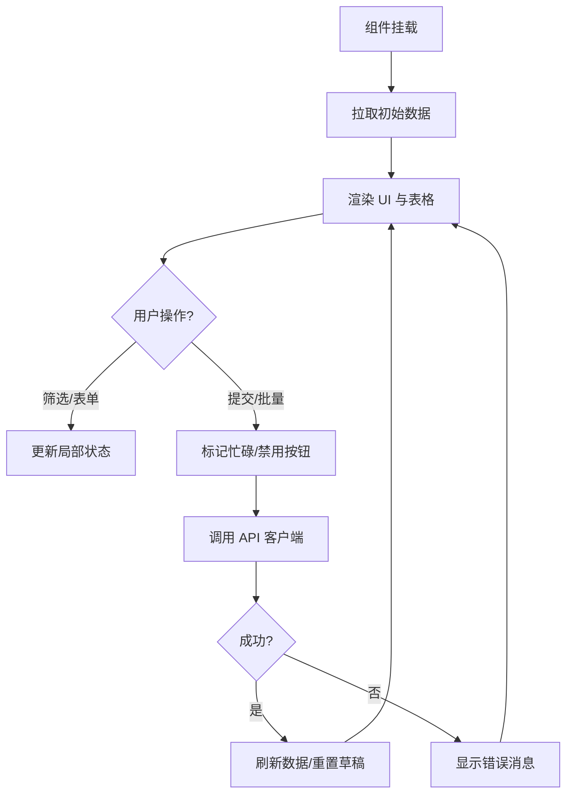
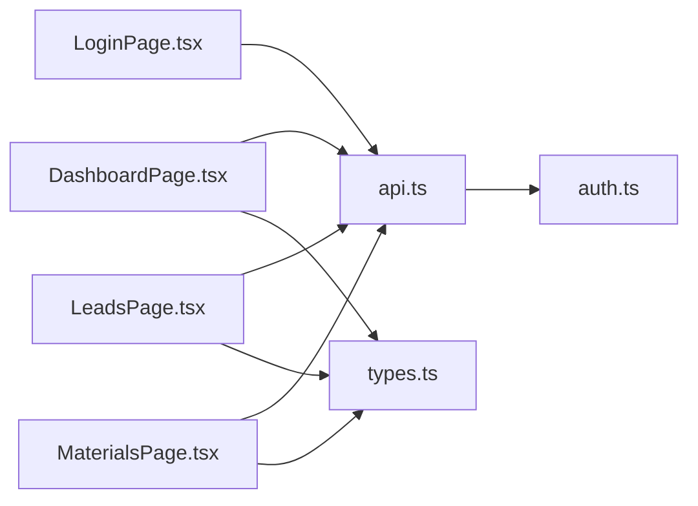

# 状态管理

<cite>
**本文引用的文件**
- [desktop/src/lib/api.ts](file://desktop/src/lib/api.ts)
- [desktop/src/lib/auth.ts](file://desktop/src/lib/auth.ts)
- [desktop/src/types.ts](file://desktop/src/types.ts)
- [desktop/src/pages/LoginPage.tsx](file://desktop/src/pages/LoginPage.tsx)
- [desktop/src/pages/DashboardPage.tsx](file://desktop/src/pages/DashboardPage.tsx)
- [desktop/src/pages/leads/LeadsPage.tsx](file://desktop/src/pages/leads/LeadsPage.tsx)
- [desktop/src/pages/materials/MaterialsPage.tsx](file://desktop/src/pages/materials/MaterialsPage.tsx)
- [mobile-h5/src/utils/api-client.js](file://mobile-h5/src/utils/api-client.js)
</cite>

## 目录
1. [引言](#引言)
2. [项目结构](#项目结构)
3. [核心组件](#核心组件)
4. [架构总览](#架构总览)
5. [详细组件分析](#详细组件分析)
6. [依赖分析](#依赖分析)
7. [性能考虑](#性能考虑)
8. [故障排查指南](#故障排查指南)
9. [结论](#结论)
10. [附录](#附录)

## 引言
本技术文档围绕“智获客”的前端状态管理进行系统性梳理，重点覆盖以下方面：
- 全局状态、局部状态与临时状态的管理策略
- API 客户端设计模式与数据流管理（请求拦截、响应处理、错误处理）
- 认证状态管理（token 存储、过期处理、权限控制）
- 类型系统与 TypeScript 集成最佳实践
- 状态持久化、缓存策略与并发控制
- 状态调试与性能监控方法

## 项目结构
前端采用 React + TypeScript 技术栈，状态管理以函数式组件内的 useState/useEffect 为主，结合自定义 API 客户端与认证模块，形成清晰的职责边界：
- 页面组件负责局部状态与用户交互
- API 客户端封装网络请求与拦截器
- 认证模块统一处理 token 生命周期
- 类型文件集中定义数据模型

图表来源
- [desktop/src/pages/LoginPage.tsx](file://desktop/src/pages/LoginPage.tsx)
- [desktop/src/pages/DashboardPage.tsx](file://desktop/src/pages/DashboardPage.tsx)
- [desktop/src/pages/leads/LeadsPage.tsx](file://desktop/src/pages/leads/LeadsPage.tsx)
- [desktop/src/pages/materials/MaterialsPage.tsx](file://desktop/src/pages/materials/MaterialsPage.tsx)
- [desktop/src/lib/api.ts](file://desktop/src/lib/api.ts)
- [desktop/src/lib/auth.ts](file://desktop/src/lib/auth.ts)
- [desktop/src/types.ts](file://desktop/src/types.ts)
- [mobile-h5/src/utils/api-client.js](file://mobile-h5/src/utils/api-client.js)

章节来源
- [desktop/src/lib/api.ts](file://desktop/src/lib/api.ts)
- [desktop/src/lib/auth.ts](file://desktop/src/lib/auth.ts)
- [desktop/src/types.ts](file://desktop/src/types.ts)
- [desktop/src/pages/LoginPage.tsx](file://desktop/src/pages/LoginPage.tsx)
- [desktop/src/pages/DashboardPage.tsx](file://desktop/src/pages/DashboardPage.tsx)
- [desktop/src/pages/leads/LeadsPage.tsx](file://desktop/src/pages/leads/LeadsPage.tsx)
- [desktop/src/pages/materials/MaterialsPage.tsx](file://desktop/src/pages/materials/MaterialsPage.tsx)
- [mobile-h5/src/utils/api-client.js](file://mobile-h5/src/utils/api-client.js)

## 核心组件
- API 客户端：基于 axios 创建实例，统一设置 baseURL、超时；通过请求拦截器注入 Authorization 头；通过响应拦截器处理 401 统一登出
- 认证模块：localStorage 存取 token，提供登录态判断、重定向路径保存与消费、登出事件派发
- 类型系统：集中定义业务实体类型，如 DashboardSummary、TrendItem、LeadItem、CollectItem 等
- 页面组件：以 useState/useEffect 管理局部状态，按需调用 API 客户端，渲染数据并处理用户交互

章节来源
- [desktop/src/lib/api.ts](file://desktop/src/lib/api.ts)
- [desktop/src/lib/auth.ts](file://desktop/src/lib/auth.ts)
- [desktop/src/types.ts](file://desktop/src/types.ts)

## 架构总览
下图展示从页面到 API 客户端再到后端的整体数据流，以及认证状态如何贯穿请求生命周期。

图表来源
- [desktop/src/lib/api.ts](file://desktop/src/lib/api.ts)
- [desktop/src/lib/auth.ts](file://desktop/src/lib/auth.ts)

## 详细组件分析

### API 客户端设计与数据流
- 实例配置：baseURL 动态解析，支持运行时 Electron 本地覆盖；统一超时时间
- 请求拦截：动态更新 baseURL；从 localStorage 读取 token 注入 Authorization
- 响应拦截：捕获 401 错误并触发清理 token 与登出事件
- 业务封装：按领域拆分导出函数，如登录、仪表盘、素材、线索、发布等接口
- 类型绑定：每个业务函数返回值均与 types.ts 中的类型保持一致，便于上层消费

图表来源
- [desktop/src/lib/api.ts](file://desktop/src/lib/api.ts)
- [desktop/src/lib/auth.ts](file://desktop/src/lib/auth.ts)

章节来源
- [desktop/src/lib/api.ts](file://desktop/src/lib/api.ts)

### 认证状态管理
- token 存储：localStorage 中以固定键名保存访问令牌
- 登录流程：页面组件收集凭据，调用登录接口，成功后写入 token，并根据重定向路径跳转
- 登出策略：响应拦截器检测 401 自动清空 token；同时派发自定义登出事件供全局监听
- 重定向路径：登录前可保存目标路径，登录后消费并跳转，避免重复登录带来的体验割裂

图表来源
- [desktop/src/pages/LoginPage.tsx](file://desktop/src/pages/LoginPage.tsx)
- [desktop/src/lib/api.ts](file://desktop/src/lib/api.ts)
- [desktop/src/lib/auth.ts](file://desktop/src/lib/auth.ts)

章节来源
- [desktop/src/pages/LoginPage.tsx](file://desktop/src/pages/LoginPage.tsx)
- [desktop/src/lib/auth.ts](file://desktop/src/lib/auth.ts)

### 页面级状态管理策略
- 局部状态：各页面组件使用 useState 管理表单、筛选、加载、消息提示等
- 临时状态：如改写过程中的“改写中/重建中”等开关状态，仅在组件内短暂存在
- 数据获取：useEffect 在挂载时拉取初始数据；部分页面支持手动刷新
- 并发控制：通过“忙碌 ID”等手段避免同一行多并发操作导致的 UI 不一致
- 持久化：编辑草稿通过 localStorage 定时持久化，减少用户输入丢失

图表来源
- [desktop/src/pages/DashboardPage.tsx](file://desktop/src/pages/DashboardPage.tsx)
- [desktop/src/pages/leads/LeadsPage.tsx](file://desktop/src/pages/leads/LeadsPage.tsx)
- [desktop/src/pages/materials/MaterialsPage.tsx](file://desktop/src/pages/materials/MaterialsPage.tsx)

章节来源
- [desktop/src/pages/DashboardPage.tsx](file://desktop/src/pages/DashboardPage.tsx)
- [desktop/src/pages/leads/LeadsPage.tsx](file://desktop/src/pages/leads/LeadsPage.tsx)
- [desktop/src/pages/materials/MaterialsPage.tsx](file://desktop/src/pages/materials/MaterialsPage.tsx)

### 类型系统与 TypeScript 集成最佳实践
- 统一的数据模型：types.ts 定义了仪表盘、趋势、线索、素材、发布任务等核心类型
- 接口返回与类型绑定：API 函数返回值与类型严格对应，便于编译期校验
- 可选字段与嵌套对象：对可空字段与复杂嵌套结构进行明确标注，降低运行时风险
- 使用示例：页面组件通过类型约束 props、状态与响应数据，确保数据一致性

章节来源
- [desktop/src/types.ts](file://desktop/src/types.ts)
- [desktop/src/lib/api.ts](file://desktop/src/lib/api.ts)

### 移动端 H5 对比参考
- 移动端 H5 提供了独立的 API 客户端实现，可作为对比参考，验证桌面端状态管理模式的一致性与可移植性

章节来源
- [mobile-h5/src/utils/api-client.js](file://mobile-h5/src/utils/api-client.js)

## 依赖分析
- 组件耦合关系
  - 页面组件依赖 API 客户端与类型定义
  - API 客户端依赖认证模块
  - 认证模块与浏览器环境强相关（localStorage、CustomEvent）
- 外部依赖
  - axios 用于 HTTP 通信
  - react-router-dom 用于路由与导航
  - recharts 用于可视化图表

图表来源
- [desktop/src/pages/LoginPage.tsx](file://desktop/src/pages/LoginPage.tsx)
- [desktop/src/pages/DashboardPage.tsx](file://desktop/src/pages/DashboardPage.tsx)
- [desktop/src/pages/leads/LeadsPage.tsx](file://desktop/src/pages/leads/LeadsPage.tsx)
- [desktop/src/pages/materials/MaterialsPage.tsx](file://desktop/src/pages/materials/MaterialsPage.tsx)
- [desktop/src/lib/api.ts](file://desktop/src/lib/api.ts)
- [desktop/src/lib/auth.ts](file://desktop/src/lib/auth.ts)
- [desktop/src/types.ts](file://desktop/src/types.ts)

章节来源
- [desktop/src/lib/api.ts](file://desktop/src/lib/api.ts)
- [desktop/src/lib/auth.ts](file://desktop/src/lib/auth.ts)
- [desktop/src/types.ts](file://desktop/src/types.ts)
- [desktop/src/pages/LoginPage.tsx](file://desktop/src/pages/LoginPage.tsx)
- [desktop/src/pages/DashboardPage.tsx](file://desktop/src/pages/DashboardPage.tsx)
- [desktop/src/pages/leads/LeadsPage.tsx](file://desktop/src/pages/leads/LeadsPage.tsx)
- [desktop/src/pages/materials/MaterialsPage.tsx](file://desktop/src/pages/materials/MaterialsPage.tsx)

## 性能考虑
- 并发控制
  - 通过“忙碌 ID/按钮禁用”避免同一资源的并发修改
  - 列表刷新采用批量请求合并策略，减少重复渲染
- 缓存与持久化
  - 列表数据可在组件卸载前缓存，进入时优先展示缓存，后台异步刷新
  - 编辑草稿定时持久化，降低输入丢失成本
- 网络优化
  - 请求拦截器统一注入 token，避免重复逻辑
  - 401 自动登出，防止无效请求堆积
- 渲染优化
  - 表格与长列表按需渲染，减少不必要的重绘
  - 图表组件使用响应式容器，避免布局抖动

## 故障排查指南
- 登录失败
  - 检查登录接口返回的错误信息，确认账号密码与后端状态
  - 确认 API baseURL 是否正确，开发环境是否设置了正确的 VITE_API_BASE_URL
- 401 未授权
  - 响应拦截器会自动清除 token 并派发登出事件
  - 检查 localStorage 中 token 是否被意外删除或过期
- 数据不更新
  - 确认页面是否调用了刷新函数或 useEffect 的依赖项是否正确
  - 检查 busy 状态是否导致按钮被禁用
- 类型不匹配
  - 对照 types.ts 中的类型定义，确认 API 返回字段是否符合预期
  - 若后端变更，需同步更新类型定义

章节来源
- [desktop/src/lib/api.ts](file://desktop/src/lib/api.ts)
- [desktop/src/lib/auth.ts](file://desktop/src/lib/auth.ts)
- [desktop/src/types.ts](file://desktop/src/types.ts)

## 结论
本项目在前端层面实现了清晰的状态分层与职责划分：页面组件承担局部状态与交互，API 客户端统一处理网络请求与认证，类型系统保障数据一致性。通过请求/响应拦截器、token 管理与草稿持久化等机制，整体具备良好的可维护性与扩展性。后续可在以下方向持续演进：
- 引入轻量状态库（如 Zustand）管理跨页面共享状态
- 增加请求去重与重试策略
- 加强错误边界与全局异常上报
- 丰富性能监控指标与埋点

## 附录
- 关键实现路径
  - API 客户端与拦截器：[desktop/src/lib/api.ts](file://desktop/src/lib/api.ts)
  - 认证模块：[desktop/src/lib/auth.ts](file://desktop/src/lib/auth.ts)
  - 类型定义：[desktop/src/types.ts](file://desktop/src/types.ts)
  - 登录页面：[desktop/src/pages/LoginPage.tsx](file://desktop/src/pages/LoginPage.tsx)
  - 仪表盘页面：[desktop/src/pages/DashboardPage.tsx](file://desktop/src/pages/DashboardPage.tsx)
  - 线索页面：[desktop/src/pages/leads/LeadsPage.tsx](file://desktop/src/pages/leads/LeadsPage.tsx)
  - 素材页面：[desktop/src/pages/materials/MaterialsPage.tsx](file://desktop/src/pages/materials/MaterialsPage.tsx)
  - 移动端 H5 客户端：[mobile-h5/src/utils/api-client.js](file://mobile-h5/src/utils/api-client.js)