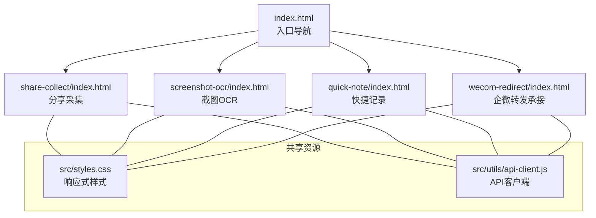
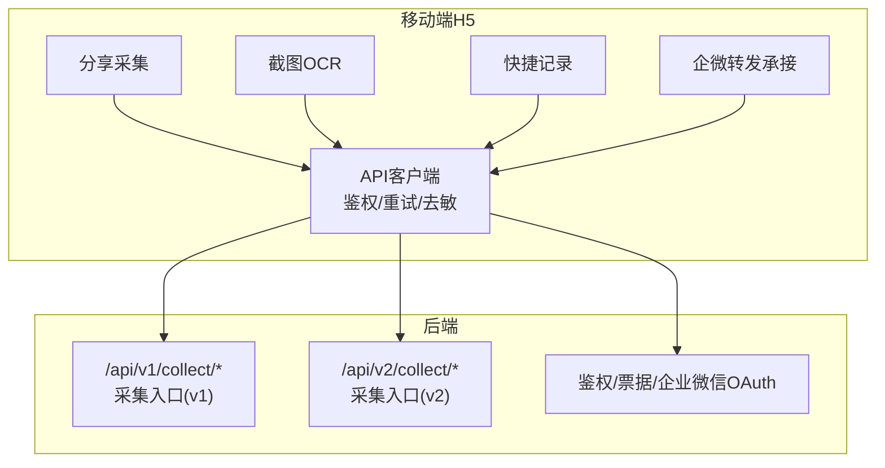
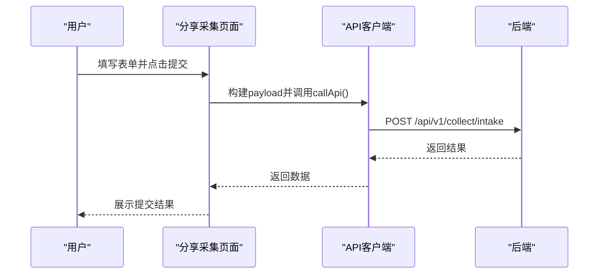
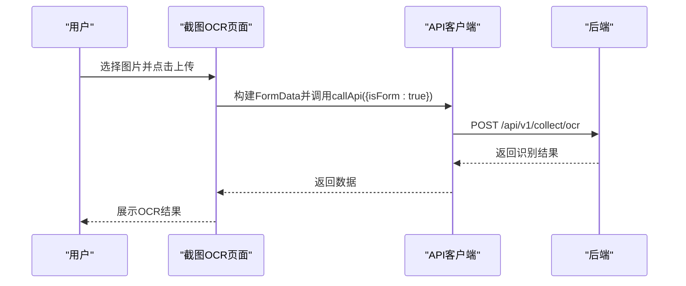
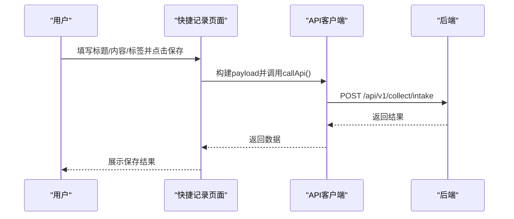
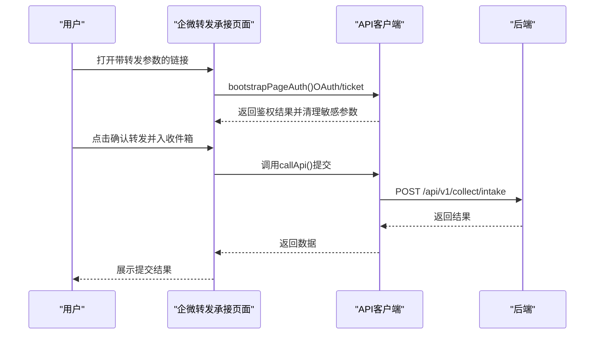
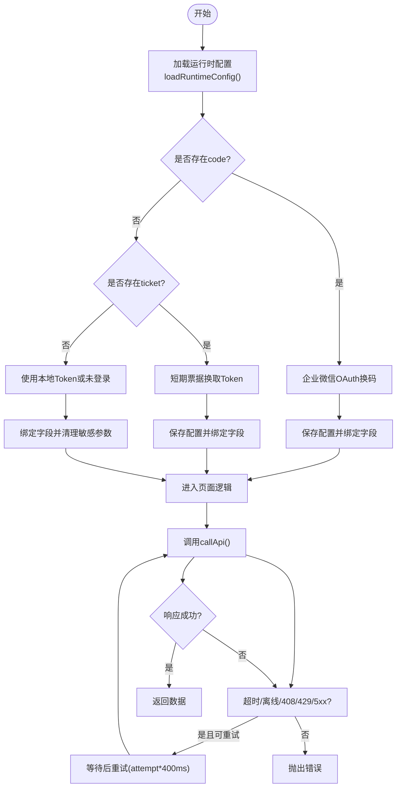
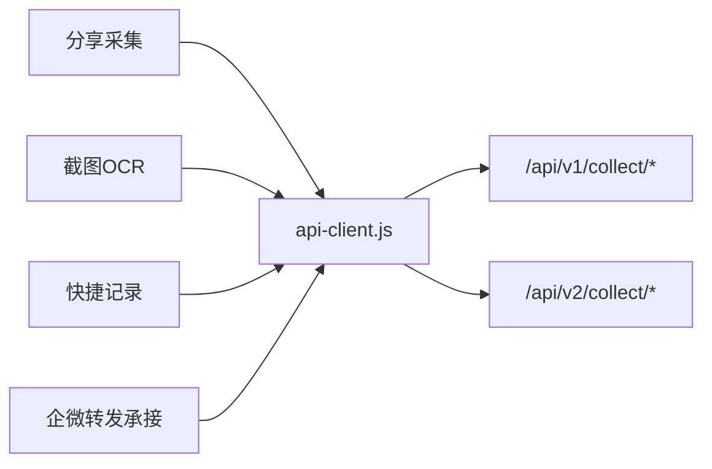

# 移动端H5设计

<cite>
**本文引用的文件**
- [mobile-h5/README.md](file://mobile-h5/README.md)
- [mobile-h5/index.html](file://mobile-h5/index.html)
- [mobile-h5/src/styles.css](file://mobile-h5/src/styles.css)
- [mobile-h5/src/utils/api-client.js](file://mobile-h5/src/utils/api-client.js)
- [mobile-h5/src/pages/share-collect/index.html](file://mobile-h5/src/pages/share-collect/index.html)
- [mobile-h5/src/pages/screenshot-ocr/index.html](file://mobile-h5/src/pages/screenshot-ocr/index.html)
- [mobile-h5/src/pages/quick-note/index.html](file://mobile-h5/src/pages/quick-note/index.html)
- [mobile-h5/src/pages/wecom-redirect/index.html](file://mobile-h5/src/pages/wecom-redirect/index.html)
- [docs/product/business-flow.md](file://docs/product/business-flow.md)
- [docs/product/page-map.md](file://docs/product/page-map.md)
- [backend/app/api/endpoints/collect.py](file://backend/app/api/endpoints/collect.py)
- [backend/app/api/v2/endpoints/collect.py](file://backend/app/api/v2/endpoints/collect.py)
</cite>

## 目录
1. [引言](#引言)
2. [项目结构](#项目结构)
3. [核心组件](#核心组件)
4. [架构总览](#架构总览)
5. [详细组件分析](#详细组件分析)
6. [依赖关系分析](#依赖关系分析)
7. [性能考虑](#性能考虑)
8. [故障排查指南](#故障排查指南)
9. [结论](#结论)
10. [附录](#附录)

## 引言
本设计文档面向“智获客”移动端H5应用，聚焦移动端优先的设计原则与响应式布局策略，系统阐述四大核心页面的功能定位与交互设计：分享采集、截图OCR、快捷记录、企微转发承接；解释移动端API客户端的实现与网络请求优化；总结触摸交互、手势处理与设备兼容的最佳实践；给出移动端性能优化策略（资源压缩、缓存、离线支持）以及与桌面端和移动端的数据同步机制。

## 项目结构
mobile-h5采用纯静态页面方案，无需构建，便于在内网或本地快速调试与部署。页面通过统一的样式表与API客户端模块实现一致的视觉与交互体验。

图表来源
- [mobile-h5/index.html:1-41](file://mobile-h5/index.html#L1-L41)
- [mobile-h5/src/pages/share-collect/index.html:1-118](file://mobile-h5/src/pages/share-collect/index.html#L1-L118)
- [mobile-h5/src/pages/screenshot-ocr/index.html:1-114](file://mobile-h5/src/pages/screenshot-ocr/index.html#L1-L114)
- [mobile-h5/src/pages/quick-note/index.html:1-124](file://mobile-h5/src/pages/quick-note/index.html#L1-L124)
- [mobile-h5/src/pages/wecom-redirect/index.html:1-252](file://mobile-h5/src/pages/wecom-redirect/index.html#L1-L252)
- [mobile-h5/src/styles.css:1-171](file://mobile-h5/src/styles.css#L1-L171)
- [mobile-h5/src/utils/api-client.js:1-319](file://mobile-h5/src/utils/api-client.js#L1-L319)

章节来源
- [mobile-h5/README.md:1-64](file://mobile-h5/README.md#L1-L64)
- [mobile-h5/index.html:1-41](file://mobile-h5/index.html#L1-L41)

## 核心组件
- 统一样式系统：基于CSS变量与clamp/clamp组合的响应式网格布局，确保在不同屏幕尺寸下保持良好的可读性与间距一致性。
- API客户端：封装鉴权、超时控制、指数退避重试、重复提交保护、敏感参数清理、请求幂等标识生成等能力，统一支撑各页面的网络请求。
- 页面配置：支持保存API基础地址、Token、超时与最大重试次数至localStorage，并在页面加载时自动绑定与持久化。

章节来源
- [mobile-h5/src/styles.css:1-171](file://mobile-h5/src/styles.css#L1-L171)
- [mobile-h5/src/utils/api-client.js:62-319](file://mobile-h5/src/utils/api-client.js#L62-L319)

## 架构总览
移动端H5通过统一的API客户端向后端发起请求，后端提供v1/v2采集与素材相关接口。整体数据流遵循“采集 -> 收件箱 -> 素材 -> AI -> 审核 -> 发布 -> 线索 -> 客户 -> 提醒”的业务闭环。

图表来源
- [mobile-h5/src/utils/api-client.js:84-170](file://mobile-h5/src/utils/api-client.js#L84-L170)
- [backend/app/api/v2/endpoints/collect.py:154-302](file://backend/app/api/v2/endpoints/collect.py#L154-L302)
- [docs/product/business-flow.md:1-4](file://docs/product/business-flow.md#L1-L4)

## 详细组件分析

### 分享采集（分享采集）
- 功能定位：将外部平台链接与正文提交到统一采集入口，支持平台、作者、标题、正文、备注等字段。
- 交互设计：表单校验（标题/正文必填）、提交按钮禁用与文案切换、状态面板展示结果或错误。
- 鉴权与幂等：优先使用企业微信OAuth或短期票据换取Bearer Token；提交时携带client_request_id保证弱网重试不重复入收件箱。
- 请求路径：POST /api/v1/collect/intake（source_type=mobile_share）。

图表来源
- [mobile-h5/src/pages/share-collect/index.html:68-114](file://mobile-h5/src/pages/share-collect/index.html#L68-L114)
- [mobile-h5/src/utils/api-client.js:189-267](file://mobile-h5/src/utils/api-client.js#L189-L267)

章节来源
- [mobile-h5/src/pages/share-collect/index.html:1-118](file://mobile-h5/src/pages/share-collect/index.html#L1-L118)

### 截图OCR（截图OCR）
- 功能定位：上传截图进行OCR识别，可选择是否直接入收件箱。
- 交互设计：文件选择、平台/作者/标题/来源链接、是否入收件箱勾选、上传按钮禁用与状态提示。
- 请求路径：POST /api/v1/collect/ocr（multipart/form-data）。

图表来源
- [mobile-h5/src/pages/screenshot-ocr/index.html:67-110](file://mobile-h5/src/pages/screenshot-ocr/index.html#L67-L110)
- [mobile-h5/src/utils/api-client.js:189-267](file://mobile-h5/src/utils/api-client.js#L189-L267)

章节来源
- [mobile-h5/src/pages/screenshot-ocr/index.html:1-114](file://mobile-h5/src/pages/screenshot-ocr/index.html#L1-L114)

### 快捷记录（快捷记录）
- 功能定位：快速保存临时灵感或客户反馈，形成收件箱条目。
- 交互设计：平台、标题、内容、标签（逗号分隔）输入，提交按钮禁用与状态提示。
- 请求路径：POST /api/v1/collect/intake（source_type=paste）。

图表来源
- [mobile-h5/src/pages/quick-note/index.html:66-120](file://mobile-h5/src/pages/quick-note/index.html#L66-L120)
- [mobile-h5/src/utils/api-client.js:189-267](file://mobile-h5/src/utils/api-client.js#L189-L267)

章节来源
- [mobile-h5/src/pages/quick-note/index.html:1-124](file://mobile-h5/src/pages/quick-note/index.html#L1-L124)

### 企微转发承接（wecom-redirect）
- 功能定位：从企业微信转发参数预填表单，二次确认后入库；支持企业微信OAuth登录与短期票据两种鉴权方式。
- 交互设计：URL参数解析与表单预填、OAuth登录按钮动态显示、鉴权状态提示、提交按钮禁用与状态提示。
- 请求路径：POST /api/v1/collect/intake（source_type=wechat_forward）。

图表来源
- [mobile-h5/src/pages/wecom-redirect/index.html:69-146](file://mobile-h5/src/pages/wecom-redirect/index.html#L69-L146)
- [mobile-h5/src/utils/api-client.js:84-170](file://mobile-h5/src/utils/api-client.js#L84-L170)

章节来源
- [mobile-h5/src/pages/wecom-redirect/index.html:1-252](file://mobile-h5/src/pages/wecom-redirect/index.html#L1-L252)

### API客户端（移动端）
- 鉴权流程：优先企业微信OAuth code换码，失败则降级使用短期票据；最后回退到本地localStorage token。
- 网络请求：统一超时控制、指数退避重试（408/429/5xx/超时/离线），401自动清除本地token并提示重新授权。
- 重复提交保护：基于requestKey的请求键集合，防止同一操作并发提交。
- 去敏与安全：自动清理URL中的敏感查询参数（token、ticket等），避免泄露。
- 幂等与状态：生成client_request_id，配合后端幂等承接；提供setButtonBusy/setStatus/setAuthStatus统一状态管理。

图表来源
- [mobile-h5/src/utils/api-client.js:84-170](file://mobile-h5/src/utils/api-client.js#L84-L170)
- [mobile-h5/src/utils/api-client.js:189-267](file://mobile-h5/src/utils/api-client.js#L189-L267)

章节来源
- [mobile-h5/src/utils/api-client.js:1-319](file://mobile-h5/src/utils/api-client.js#L1-L319)

## 依赖关系分析
- 页面对样式：所有页面共享src/styles.css，采用CSS变量与响应式网格布局。
- 页面对API客户端：四个页面均通过import引入api-client.js，复用统一的鉴权、请求与状态管理能力。
- 后端接口：移动端H5主要调用v1采集入口（collect/intake）与OCR接口；v2采集接口已迁移至新素材管道，旧接口已下线。

图表来源
- [mobile-h5/src/pages/share-collect/index.html:51-60](file://mobile-h5/src/pages/share-collect/index.html#L51-L60)
- [mobile-h5/src/pages/screenshot-ocr/index.html:50-59](file://mobile-h5/src/pages/screenshot-ocr/index.html#L50-L59)
- [mobile-h5/src/pages/quick-note/index.html:49-58](file://mobile-h5/src/pages/quick-note/index.html#L49-L58)
- [mobile-h5/src/pages/wecom-redirect/index.html:52-63](file://mobile-h5/src/pages/wecom-redirect/index.html#L52-L63)
- [mobile-h5/src/utils/api-client.js:189-267](file://mobile-h5/src/utils/api-client.js#L189-L267)
- [backend/app/api/v2/endpoints/collect.py:154-302](file://backend/app/api/v2/endpoints/collect.py#L154-L302)

章节来源
- [backend/app/api/endpoints/collect.py:1-20](file://backend/app/api/endpoints/collect.py#L1-L20)
- [backend/app/api/v2/endpoints/collect.py:1-302](file://backend/app/api/v2/endpoints/collect.py#L1-L302)

## 性能考虑
- 资源压缩与缓存
  - 使用现代浏览器默认gzip/br压缩；静态资源建议开启CDN与缓存头（Cache-Control/ETag）。
  - 将样式与脚本合并为最少文件数，减少TCP连接与DNS查找。
- 网络优化
  - 合理设置超时与重试：移动端弱网环境下，建议默认超时≥5000ms，最大重试1-2次。
  - 使用指数退避与抖动（随机增量）降低拥塞风险。
  - 对于上传类（如OCR），建议在前端做体积限制与格式校验，减少无效请求。
- 交互性能
  - 避免长任务阻塞UI，使用requestIdleCallback或Web Workers处理耗时计算。
  - 按需渲染与虚拟滚动（如列表较大时）。
- 离线支持
  - 采用Service Worker与Cache Storage实现关键页面离线可用与缓存回退。
  - 对于非关键请求，提供“网络不可用”提示与重试机制。
- 设备兼容
  - 使用touch-action、-webkit-tap-highlight-color优化触摸反馈。
  - 避免使用过小的点击区域，确保可触达性（≥44px）。
  - 在横屏/竖屏切换时，使用媒体查询与clamp保持布局稳定。

## 故障排查指南
- 鉴权失败
  - 症状：401未授权，状态提示要求重新获取票据或更新Token。
  - 处理：清理本地Token后，使用带ticket的移动链接或企业微信OAuth重新授权。
- 超时与重试
  - 症状：请求超时或频繁429/5xx。
  - 处理：增大超时时间与重试次数；检查后端限流策略与网络质量。
- 重复提交
  - 症状：同一操作多次触发导致重复入收件箱。
  - 处理：确保使用client_request_id与请求键防抖；避免同时点击多个提交按钮。
- 上传失败
  - 症状：OCR上传无响应或报错。
  - 处理：检查文件类型与大小限制；确认FormData构造正确；查看后端OCR服务状态。
- URL参数泄露
  - 症状：地址栏残留敏感参数。
  - 处理：确认已调用清理函数移除token、ticket等参数。

章节来源
- [mobile-h5/src/utils/api-client.js:234-267](file://mobile-h5/src/utils/api-client.js#L234-L267)
- [mobile-h5/src/utils/api-client.js:24-38](file://mobile-h5/src/utils/api-client.js#L24-L38)

## 结论
移动端H5通过统一的API客户端与响应式样式体系，实现了在弱网与多设备场景下的稳定采集能力。四大核心页面覆盖了分享采集、截图OCR、快捷记录与企微转发承接的典型需求；结合鉴权收口、幂等与重试策略，保障了数据一致性与用户体验。建议后续在上传链路增加压缩与断点续传、补齐移动端UAT测试，并逐步接入企业微信真实OAuth映射，提升安全性与可追溯性。

## 附录
- 页面与功能映射
  - 分享采集：/api/v1/collect/intake（source_type=mobile_share）
  - 截图OCR：/api/v1/collect/ocr
  - 快捷记录：/api/v1/collect/intake（source_type=paste）
  - 企微转发承接：/api/v1/collect/intake（source_type=wechat_forward）

- 数据同步与业务闭环
  - 采集 -> 收件箱 -> 素材 -> AI -> 审核 -> 发布 -> 线索 -> 客户 -> 提醒

章节来源
- [docs/product/business-flow.md:1-4](file://docs/product/business-flow.md#L1-L4)
- [docs/product/page-map.md:1-16](file://docs/product/page-map.md#L1-L16)