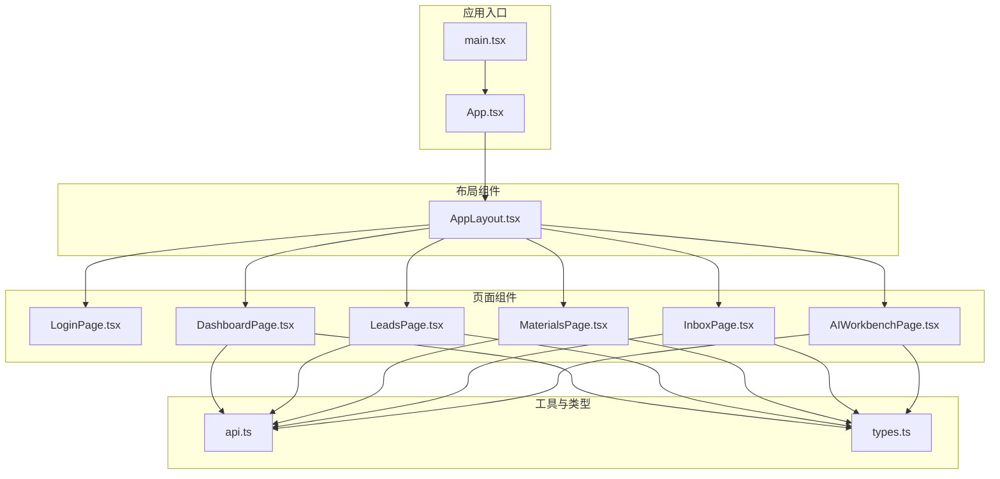
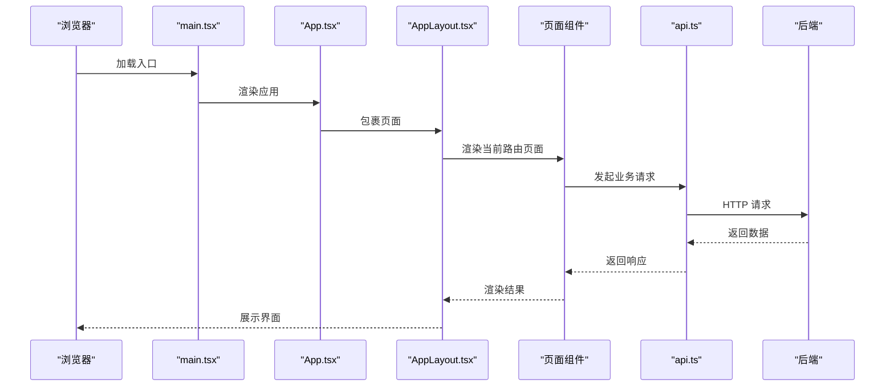
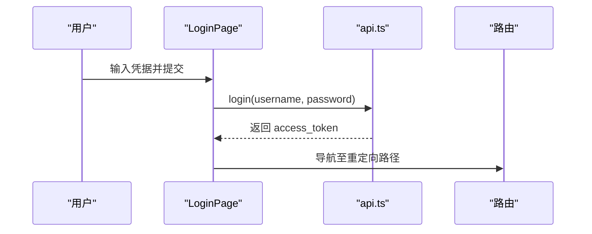
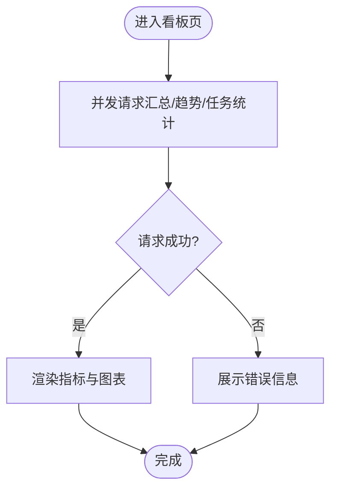
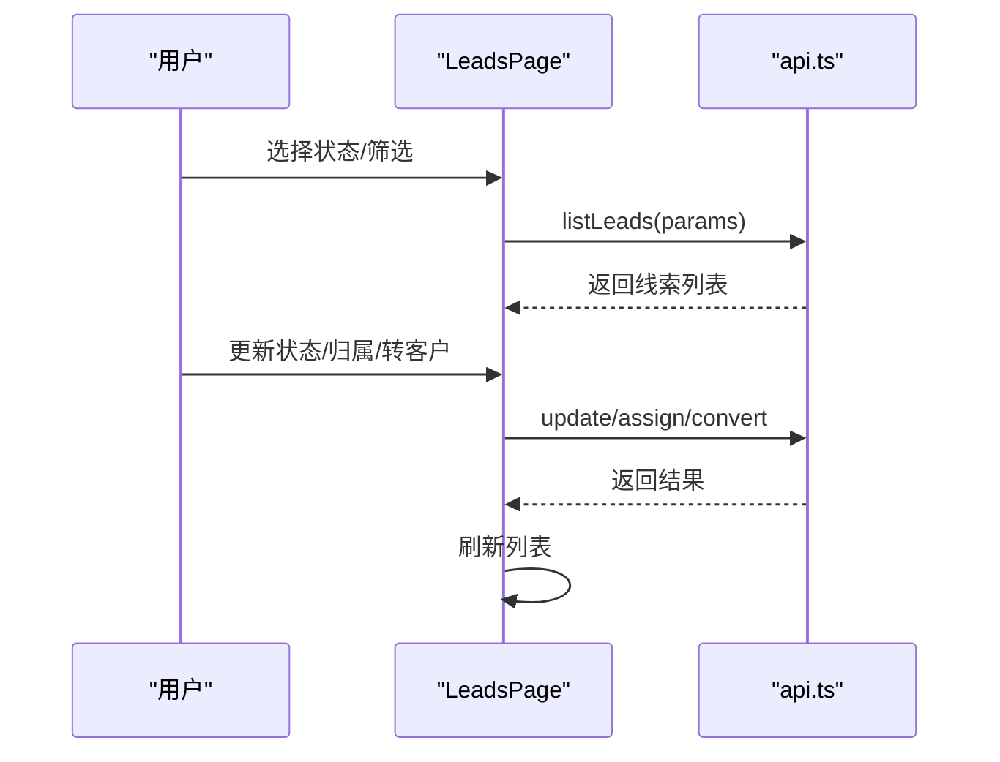
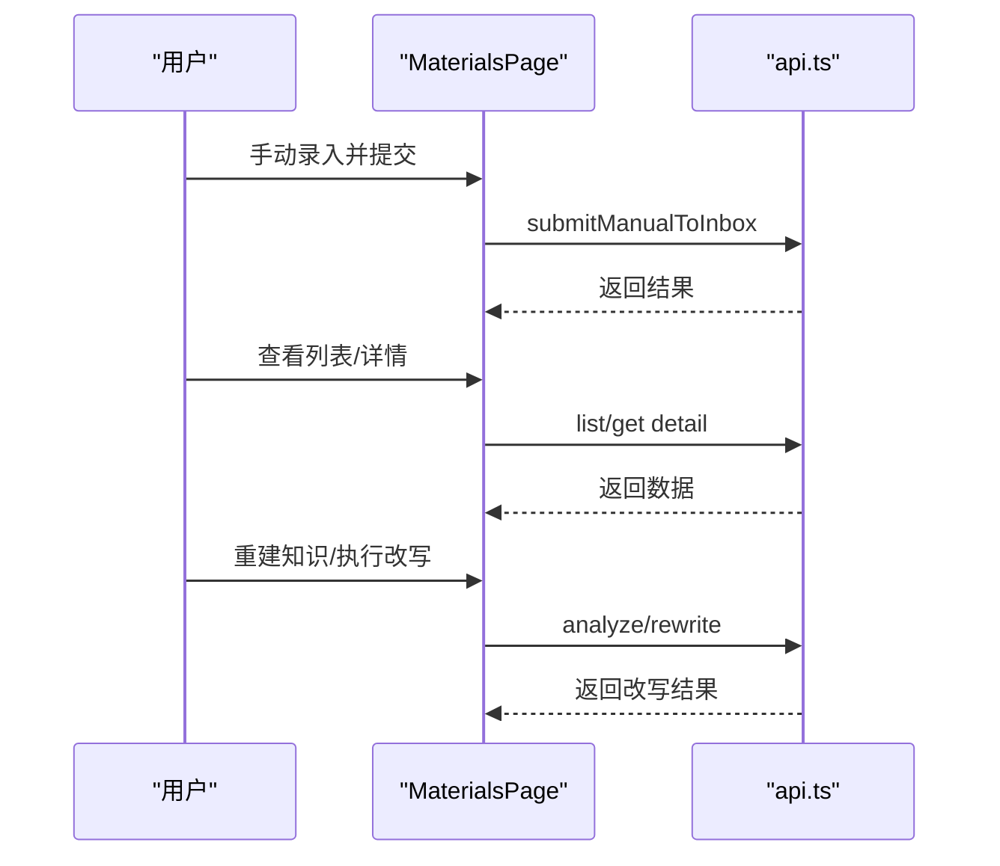
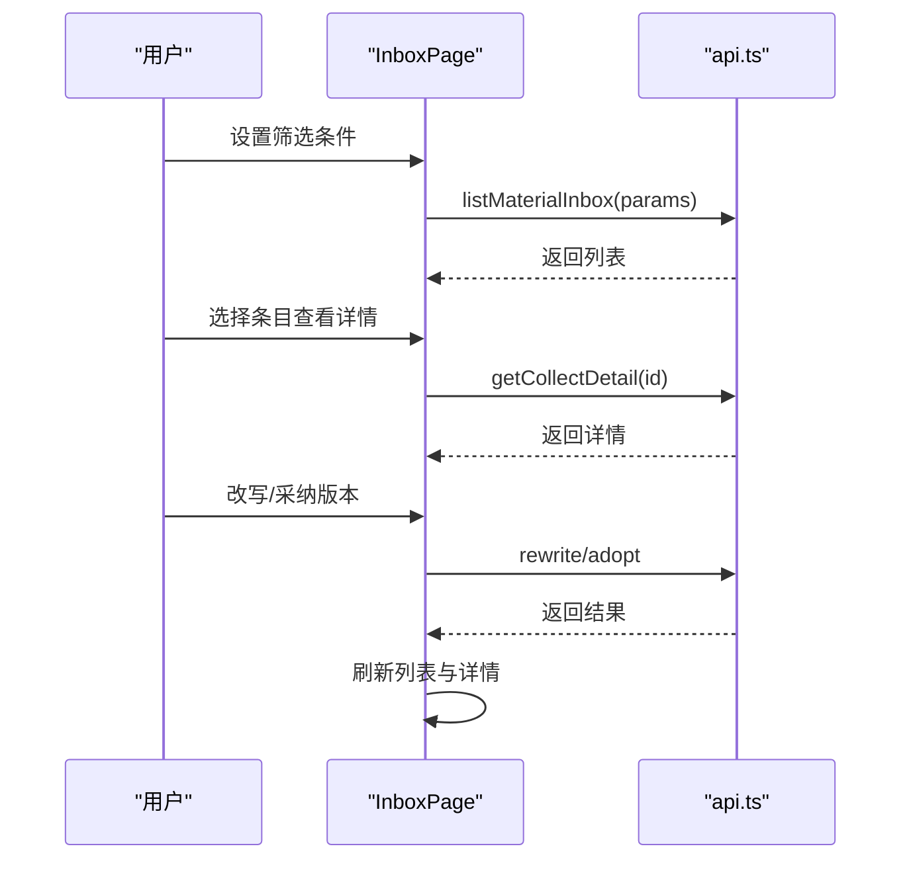
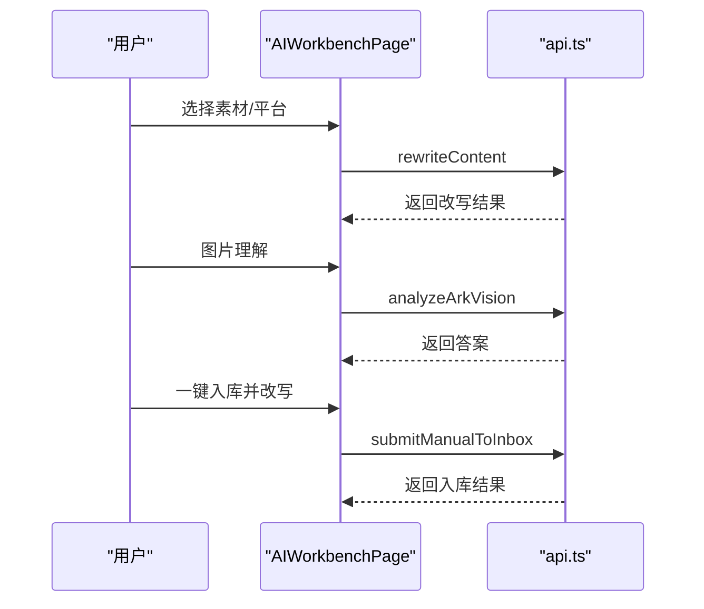
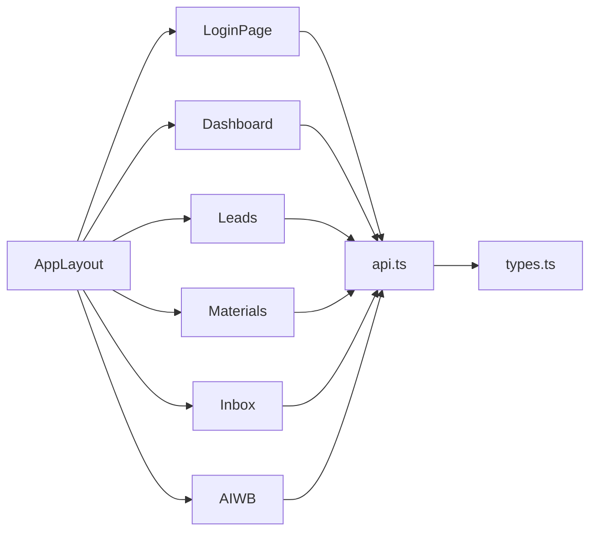

# 组件系统

<cite>
**本文引用的文件**
- [desktop/src/App.tsx](file://desktop/src/App.tsx)
- [desktop/src/main.tsx](file://desktop/src/main.tsx)
- [desktop/src/components/AppLayout.tsx](file://desktop/src/components/AppLayout.tsx)
- [desktop/src/pages/LoginPage.tsx](file://desktop/src/pages/LoginPage.tsx)
- [desktop/src/pages/dashboard/DashboardPage.tsx](file://desktop/src/pages/dashboard/DashboardPage.tsx)
- [desktop/src/pages/leads/LeadsPage.tsx](file://desktop/src/pages/leads/LeadsPage.tsx)
- [desktop/src/pages/materials/MaterialsPage.tsx](file://desktop/src/pages/materials/MaterialsPage.tsx)
- [desktop/src/pages/inbox/InboxPage.tsx](file://desktop/src/pages/inbox/InboxPage.tsx)
- [desktop/src/pages/ai-workbench/AIWorkbenchPage.tsx](file://desktop/src/pages/ai-workbench/AIWorkbenchPage.tsx)
- [desktop/src/lib/api.ts](file://desktop/src/lib/api.ts)
- [desktop/src/types.ts](file://desktop/src/types.ts)
</cite>

## 目录
1. [简介](#简介)
2. [项目结构](#项目结构)
3. [核心组件](#核心组件)
4. [架构总览](#架构总览)
5. [详细组件分析](#详细组件分析)
6. [依赖分析](#依赖分析)
7. [性能考虑](#性能考虑)
8. [故障排查指南](#故障排查指南)
9. [结论](#结论)
10. [附录](#附录)

## 简介
本文件面向“智获客”桌面端前端组件系统，聚焦于React组件的设计模式与复用策略，涵盖布局组件、业务组件、通用组件的分类与使用规范；总结自定义Hook的设计原则与适用场景；阐述组件间通信机制（props传递、上下文共享、事件冒泡）；给出组件测试策略与可维护性设计原则；提供组件库扩展与第三方组件集成方案；解释性能优化与懒加载策略。文档以仓库中的实际代码为依据，配合可视化图表帮助读者快速理解系统架构与实现细节。

## 项目结构
桌面端前端位于 desktop/src 目录，采用路由驱动的页面组织方式，页面组件集中于 pages 子目录，公共布局组件位于 components 子目录，应用入口与路由配置位于根目录。API 封装与类型定义分别位于 lib 与 types 文件中。



**图表来源**
- [desktop/src/main.tsx:1-14](file://desktop/src/main.tsx#L1-L14)
- [desktop/src/App.tsx:1-163](file://desktop/src/App.tsx#L1-L163)
- [desktop/src/components/AppLayout.tsx:1-108](file://desktop/src/components/AppLayout.tsx#L1-L108)
- [desktop/src/pages/LoginPage.tsx:1-69](file://desktop/src/pages/LoginPage.tsx#L1-L69)
- [desktop/src/pages/dashboard/DashboardPage.tsx:1-217](file://desktop/src/pages/dashboard/DashboardPage.tsx#L1-L217)
- [desktop/src/pages/leads/LeadsPage.tsx:1-213](file://desktop/src/pages/leads/LeadsPage.tsx#L1-L213)
- [desktop/src/pages/materials/MaterialsPage.tsx:1-488](file://desktop/src/pages/materials/MaterialsPage.tsx#L1-L488)
- [desktop/src/pages/inbox/InboxPage.tsx:1-673](file://desktop/src/pages/inbox/InboxPage.tsx#L1-L673)
- [desktop/src/pages/ai-workbench/AIWorkbenchPage.tsx:1-231](file://desktop/src/pages/ai-workbench/AIWorkbenchPage.tsx#L1-L231)
- [desktop/src/lib/api.ts:1-604](file://desktop/src/lib/api.ts#L1-L604)
- [desktop/src/types.ts:1-329](file://desktop/src/types.ts#L1-L329)

**章节来源**
- [desktop/src/main.tsx:1-14](file://desktop/src/main.tsx#L1-L14)
- [desktop/src/App.tsx:1-163](file://desktop/src/App.tsx#L1-L163)

## 核心组件
- 应用入口与路由
  - main.tsx 使用 React Router 包裹应用，渲染根节点。
  - App.tsx 定义全局路由、受保护路由、登录态校验、桌面端启动流程与加载屏。
- 布局组件
  - AppLayout.tsx 提供侧边导航、品牌信息、版本展示与登出按钮，作为页面容器。
- 页面组件
  - LoginPage.tsx 实现登录表单与错误提示。
  - DashboardPage.tsx 展示看板数据、趋势图与快捷入口。
  - LeadsPage.tsx 列表化线索管理，支持状态变更、归属与转客户。
  - MaterialsPage.tsx 素材中心，支持手动录入、列表、详情、知识重建与改写。
  - InboxPage.tsx 收件箱，支持筛选、状态变更、改写与版本对比回滚。
  - AIWorkbenchPage.tsx 改写工作台与火山图片理解集成。
- 工具与类型
  - api.ts 封装 axios 实例、请求拦截器、响应拦截器与各业务 API 方法。
  - types.ts 定义看板、素材、收件箱、发布任务、客户、线索等类型。

**章节来源**
- [desktop/src/main.tsx:1-14](file://desktop/src/main.tsx#L1-L14)
- [desktop/src/App.tsx:1-163](file://desktop/src/App.tsx#L1-L163)
- [desktop/src/components/AppLayout.tsx:1-108](file://desktop/src/components/AppLayout.tsx#L1-L108)
- [desktop/src/pages/LoginPage.tsx:1-69](file://desktop/src/pages/LoginPage.tsx#L1-L69)
- [desktop/src/pages/dashboard/DashboardPage.tsx:1-217](file://desktop/src/pages/dashboard/DashboardPage.tsx#L1-L217)
- [desktop/src/pages/leads/LeadsPage.tsx:1-213](file://desktop/src/pages/leads/LeadsPage.tsx#L1-L213)
- [desktop/src/pages/materials/MaterialsPage.tsx:1-488](file://desktop/src/pages/materials/MaterialsPage.tsx#L1-L488)
- [desktop/src/pages/inbox/InboxPage.tsx:1-673](file://desktop/src/pages/inbox/InboxPage.tsx#L1-L673)
- [desktop/src/pages/ai-workbench/AIWorkbenchPage.tsx:1-231](file://desktop/src/pages/ai-workbench/AIWorkbenchPage.tsx#L1-L231)
- [desktop/src/lib/api.ts:1-604](file://desktop/src/lib/api.ts#L1-L604)
- [desktop/src/types.ts:1-329](file://desktop/src/types.ts#L1-L329)

## 架构总览
应用采用“入口 -> 布局 -> 页面”的分层结构，页面组件通过 api.ts 封装的 HTTP 接口与后端交互，类型定义统一于 types.ts。组件间通信主要通过 props 传递与路由状态，部分桌面端特性通过 window.desktop 注入。



**图表来源**
- [desktop/src/main.tsx:1-14](file://desktop/src/main.tsx#L1-L14)
- [desktop/src/App.tsx:1-163](file://desktop/src/App.tsx#L1-L163)
- [desktop/src/components/AppLayout.tsx:1-108](file://desktop/src/components/AppLayout.tsx#L1-L108)
- [desktop/src/lib/api.ts:1-604](file://desktop/src/lib/api.ts#L1-L604)

## 详细组件分析

### 布局组件：AppLayout
- 职责
  - 提供统一侧边导航、品牌信息与版本展示。
  - 通过 NavLink 实现路由激活态样式。
  - 提供登出回调，交由上层处理。
- 设计要点
  - 导航分组与徽标提示，便于功能分区。
  - 版本信息异步加载，避免阻塞首屏。
- 可复用性
  - 作为页面容器，所有页面共享同一布局风格与行为。

```mermaid
classDiagram
class AppLayout {
+props : PropsWithChildren<{ onLogout : () => void }>
+状态 : 版本文本
+方法 : useEffect(加载版本)
+渲染 : 侧边栏 + 主区域
}
```

**图表来源**
- [desktop/src/components/AppLayout.tsx:1-108](file://desktop/src/components/AppLayout.tsx#L1-L108)

**章节来源**
- [desktop/src/components/AppLayout.tsx:1-108](file://desktop/src/components/AppLayout.tsx#L1-L108)

### 登录页：LoginPage
- 职责
  - 表单收集用户名/密码，调用登录接口，设置令牌并重定向。
- 设计要点
  - 表单受控组件，错误信息展示，加载态控制。
  - 重定向路径来自 location.state 或默认路径。
- 可复用性
  - 可作为独立页面复用，若需扩展可拆分出表单与按钮等子组件。



**图表来源**
- [desktop/src/pages/LoginPage.tsx:1-69](file://desktop/src/pages/LoginPage.tsx#L1-L69)
- [desktop/src/lib/api.ts:40-43](file://desktop/src/lib/api.ts#L40-L43)

**章节来源**
- [desktop/src/pages/LoginPage.tsx:1-69](file://desktop/src/pages/LoginPage.tsx#L1-L69)
- [desktop/src/lib/api.ts:40-43](file://desktop/src/lib/api.ts#L40-L43)

### 看板页：DashboardPage
- 职责
  - 加载看板汇总、趋势与发布任务统计，展示核心指标与趋势图。
- 设计要点
  - 并行加载多个接口，统一错误处理与加载态。
  - 使用图表库渲染趋势折线图。
- 可复用性
  - 指标卡片与趋势图可抽象为通用组件，供其他页面复用。



**图表来源**
- [desktop/src/pages/dashboard/DashboardPage.tsx:52-71](file://desktop/src/pages/dashboard/DashboardPage.tsx#L52-L71)

**章节来源**
- [desktop/src/pages/dashboard/DashboardPage.tsx:1-217](file://desktop/src/pages/dashboard/DashboardPage.tsx#L1-L217)

### 线索页：LeadsPage
- 职责
  - 列出线索，支持状态筛选、状态变更、归属操作与转客户。
- 设计要点
  - 使用查询参数控制聚焦线索与来源任务，增强页面间跳转体验。
  - 每次操作后刷新列表，保证数据一致性。
- 可复用性
  - 列表表格与操作按钮可抽取为通用组件，状态枚举与选项可抽取为常量。



**图表来源**
- [desktop/src/pages/leads/LeadsPage.tsx:21-81](file://desktop/src/pages/leads/LeadsPage.tsx#L21-L81)
- [desktop/src/lib/api.ts:245-280](file://desktop/src/lib/api.ts#L245-L280)

**章节来源**
- [desktop/src/pages/leads/LeadsPage.tsx:1-213](file://desktop/src/pages/leads/LeadsPage.tsx#L1-L213)
- [desktop/src/lib/api.ts:245-280](file://desktop/src/lib/api.ts#L245-L280)

### 素材中心：MaterialsPage
- 职责
  - 手动录入素材、列出素材、查看详情、重建知识、执行改写。
- 设计要点
  - 本地草稿持久化，减少输入丢失风险。
  - 详情页多标签切换，支持知识文档、原始载荷与改写记录。
  - 改写结果包含合规性与建议，便于后续采纳。
- 可复用性
  - 表单、标签页、操作按钮等可模块化为通用组件。



**图表来源**
- [desktop/src/pages/materials/MaterialsPage.tsx:188-225](file://desktop/src/pages/materials/MaterialsPage.tsx#L188-L225)
- [desktop/src/lib/api.ts:87-171](file://desktop/src/lib/api.ts#L87-L171)

**章节来源**
- [desktop/src/pages/materials/MaterialsPage.tsx:1-488](file://desktop/src/pages/materials/MaterialsPage.tsx#L1-L488)
- [desktop/src/lib/api.ts:87-171](file://desktop/src/lib/api.ts#L87-L171)

### 收件箱：InboxPage
- 职责
  - 收件箱列表与筛选、状态变更、改写、版本对比与回滚。
- 设计要点
  - 多维度筛选，支持关键词、平台、来源、风险与重复标记。
  - 详情区支持改写三版文案与历史版本对比。
  - 一键采纳版本，更新当前素材正文。
- 可复用性
  - 筛选面板、状态标签、操作按钮可抽取为通用组件。



**图表来源**
- [desktop/src/pages/inbox/InboxPage.tsx:148-259](file://desktop/src/pages/inbox/InboxPage.tsx#L148-L259)
- [desktop/src/lib/api.ts:548-603](file://desktop/src/lib/api.ts#L548-L603)

**章节来源**
- [desktop/src/pages/inbox/InboxPage.tsx:1-673](file://desktop/src/pages/inbox/InboxPage.tsx#L1-L673)
- [desktop/src/lib/api.ts:548-603](file://desktop/src/lib/api.ts#L548-L603)

### AI 工作台：AIWorkbenchPage
- 职责
  - 选择素材、目标平台，发起改写；集成火山图片理解，一键入库并改写。
- 设计要点
  - 素材列表异步加载，改写结果展示参考数量。
  - 图片理解支持模型与问题参数，结果可直接提交入库。
- 可复用性
  - 参数选择器、结果展示区可抽取为通用组件。



**图表来源**
- [desktop/src/pages/ai-workbench/AIWorkbenchPage.tsx:39-103](file://desktop/src/pages/ai-workbench/AIWorkbenchPage.tsx#L39-L103)
- [desktop/src/lib/api.ts:104-119](file://desktop/src/lib/api.ts#L104-L119)
- [desktop/src/lib/api.ts:206-213](file://desktop/src/lib/api.ts#L206-L213)
- [desktop/src/lib/api.ts:87-102](file://desktop/src/lib/api.ts#L87-L102)

**章节来源**
- [desktop/src/pages/ai-workbench/AIWorkbenchPage.tsx:1-231](file://desktop/src/pages/ai-workbench/AIWorkbenchPage.tsx#L1-L231)
- [desktop/src/lib/api.ts:104-119](file://desktop/src/lib/api.ts#L104-L119)
- [desktop/src/lib/api.ts:206-213](file://desktop/src/lib/api.ts#L206-L213)
- [desktop/src/lib/api.ts:87-102](file://desktop/src/lib/api.ts#L87-L102)

## 依赖分析
- 组件耦合
  - 页面组件均依赖 api.ts 的业务方法，类型依赖 types.ts。
  - AppLayout 作为容器组件，被多个页面复用，耦合度低、内聚度高。
- 外部依赖
  - axios 用于网络请求封装。
  - react-router-dom 用于路由与导航。
  - 图表库用于趋势图渲染。
- 潜在循环依赖
  - 当前结构清晰，无明显循环依赖迹象。



**图表来源**
- [desktop/src/lib/api.ts:1-604](file://desktop/src/lib/api.ts#L1-L604)
- [desktop/src/types.ts:1-329](file://desktop/src/types.ts#L1-L329)
- [desktop/src/components/AppLayout.tsx:1-108](file://desktop/src/components/AppLayout.tsx#L1-L108)
- [desktop/src/pages/LoginPage.tsx:1-69](file://desktop/src/pages/LoginPage.tsx#L1-L69)
- [desktop/src/pages/dashboard/DashboardPage.tsx:1-217](file://desktop/src/pages/dashboard/DashboardPage.tsx#L1-L217)
- [desktop/src/pages/leads/LeadsPage.tsx:1-213](file://desktop/src/pages/leads/LeadsPage.tsx#L1-L213)
- [desktop/src/pages/materials/MaterialsPage.tsx:1-488](file://desktop/src/pages/materials/MaterialsPage.tsx#L1-L488)
- [desktop/src/pages/inbox/InboxPage.tsx:1-673](file://desktop/src/pages/inbox/InboxPage.tsx#L1-L673)
- [desktop/src/pages/ai-workbench/AIWorkbenchPage.tsx:1-231](file://desktop/src/pages/ai-workbench/AIWorkbenchPage.tsx#L1-L231)

**章节来源**
- [desktop/src/lib/api.ts:1-604](file://desktop/src/lib/api.ts#L1-L604)
- [desktop/src/types.ts:1-329](file://desktop/src/types.ts#L1-L329)
- [desktop/src/components/AppLayout.tsx:1-108](file://desktop/src/components/AppLayout.tsx#L1-L108)

## 性能考虑
- 数据加载
  - DashboardPage 并行请求多个接口，减少总等待时间。
  - InboxPage 与 LeadsPage 在操作后刷新列表，确保数据一致性。
- 渲染优化
  - 使用 useMemo 缓存计算结果（如 InboxPage 的变体列表）。
  - 表格与长列表采用虚拟滚动或分页策略可进一步优化。
- 网络请求
  - api.ts 统一封装 baseURL 与拦截器，避免重复逻辑。
  - 对高频请求增加缓存策略（如看板指标可短期缓存）。
- 图表与媒体
  - 图表容器使用响应式尺寸，避免重排。
  - 图片资源按需加载，避免阻塞首屏。
- 桌面端特性
  - 通过 window.desktop 注入的环境变量仅在 Electron 下生效，避免在浏览器环境产生额外开销。

[本节为通用性能指导，无需特定文件引用]

## 故障排查指南
- 登录失败
  - 检查后端服务状态与凭据正确性；查看错误信息并重试。
  - 参考：[desktop/src/pages/LoginPage.tsx:14-33](file://desktop/src/pages/LoginPage.tsx#L14-L33)
- 看板数据加载失败
  - 检查网络连通性与接口返回；确认令牌有效性。
  - 参考：[desktop/src/pages/dashboard/DashboardPage.tsx:63-68](file://desktop/src/pages/dashboard/DashboardPage.tsx#L63-L68)
- 素材列表/详情加载失败
  - 检查登录状态与权限；查看错误提示并刷新。
  - 参考：[desktop/src/pages/materials/MaterialsPage.tsx:114-124](file://desktop/src/pages/materials/MaterialsPage.tsx#L114-L124)
- 收件箱操作失败
  - 检查状态变更参数与后端返回；确认任务存在且可操作。
  - 参考：[desktop/src/pages/inbox/InboxPage.tsx:211-226](file://desktop/src/pages/inbox/InboxPage.tsx#L211-L226)
- 图片理解失败
  - 检查图片 URL 可达性与模型参数；查看后端 ARK 配置。
  - 参考：[desktop/src/pages/ai-workbench/AIWorkbenchPage.tsx:59-78](file://desktop/src/pages/ai-workbench/AIWorkbenchPage.tsx#L59-L78)

**章节来源**
- [desktop/src/pages/LoginPage.tsx:14-33](file://desktop/src/pages/LoginPage.tsx#L14-L33)
- [desktop/src/pages/dashboard/DashboardPage.tsx:63-68](file://desktop/src/pages/dashboard/DashboardPage.tsx#L63-L68)
- [desktop/src/pages/materials/MaterialsPage.tsx:114-124](file://desktop/src/pages/materials/MaterialsPage.tsx#L114-L124)
- [desktop/src/pages/inbox/InboxPage.tsx:211-226](file://desktop/src/pages/inbox/InboxPage.tsx#L211-L226)
- [desktop/src/pages/ai-workbench/AIWorkbenchPage.tsx:59-78](file://desktop/src/pages/ai-workbench/AIWorkbenchPage.tsx#L59-L78)

## 结论
该组件系统以清晰的分层与职责划分实现了高内聚、低耦合的页面结构，通过统一的 API 封装与类型定义提升了可维护性与可测试性。建议在现有基础上进一步抽象通用组件、完善单元测试与集成测试、引入懒加载与缓存策略，持续提升用户体验与系统稳定性。

[本节为总结性内容，无需特定文件引用]

## 附录

### 自定义Hook设计原则与场景
- 设计原则
  - 单一职责：每个 Hook 解决一个明确的问题域（如数据获取、状态管理、副作用）。
  - 可复用性：将可复用的逻辑抽离为 Hook，避免在多个组件中重复实现。
  - 易测试：Hook 应尽量依赖注入或可替换的依赖，便于单元测试。
- 典型场景
  - 数据获取：封装列表/详情加载、分页与筛选逻辑。
  - 状态管理：封装本地状态与持久化（如草稿、筛选条件）。
  - 副作用：封装定时器、防抖节流、窗口事件监听等。
- 示例思路（不直接粘贴代码）
  - 列表加载 Hook：接收查询参数、并发请求、错误处理与加载态。
  - 表单状态 Hook：封装受控表单字段、验证与提交流程。
  - 桌面端特性 Hook：封装 window.desktop 调用与事件监听。

[本节为概念性内容，无需特定文件引用]

### 组件间通信机制
- Props 传递
  - AppLayout 向页面传递 onLogout 回调；页面向 API 层传递参数。
- 上下文共享
  - 当前项目未使用 React Context；可在需要跨层级共享状态时引入。
- 事件冒泡
  - 表格行点击、按钮点击等事件在组件内部处理，必要时向上抛出回调。

[本节为概念性内容，无需特定文件引用]

### 组件测试策略与可维护性设计
- 测试策略
  - 单元测试：针对纯函数与 Hook 的边界条件与异常分支。
  - 集成测试：模拟 API 返回，验证页面渲染与交互流程。
  - 端到端测试：覆盖关键业务流程（登录、改写、入库、线索转化）。
- 可维护性设计
  - 类型驱动：所有接口与状态使用 TypeScript 类型约束。
  - 组件拆分：大组件拆分为更小的可复用子组件。
  - 错误边界：在关键页面包裹错误边界，提升健壮性。
  - 日志与监控：对关键 API 调用添加日志与错误上报。

[本节为通用指导，无需特定文件引用]

### 组件库扩展与第三方组件集成
- 扩展指南
  - 抽象通用组件：将表格、表单、弹窗、分页等封装为可配置组件。
  - 规范命名与样式：统一命名空间与样式变量，便于主题定制。
  - 文档与示例：为每个组件提供使用示例与 API 文档。
- 第三方组件集成
  - 图表库：保持响应式容器，避免强制固定尺寸。
  - 表单库：与受控组件结合，避免状态分散。
  - 路由与导航：统一使用 React Router，保持导航一致性。

[本节为通用指导，无需特定文件引用]

### 性能优化与懒加载策略
- 懒加载
  - 页面级懒加载：使用动态 import 将大型页面按需加载。
  - 组件级懒加载：对重型组件（如图表、富文本）按需加载。
- 缓存
  - 列表数据短期缓存，减少重复请求。
  - 本地草稿与筛选条件持久化，提升用户体验。
- 体积优化
  - 按需引入第三方库，移除未使用模块。
  - 图片与静态资源压缩与 CDN 加速。

[本节为通用指导，无需特定文件引用]