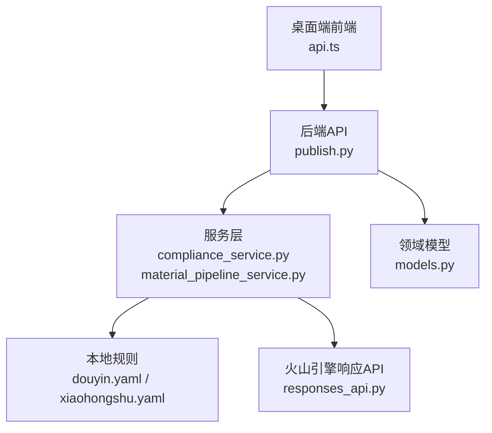
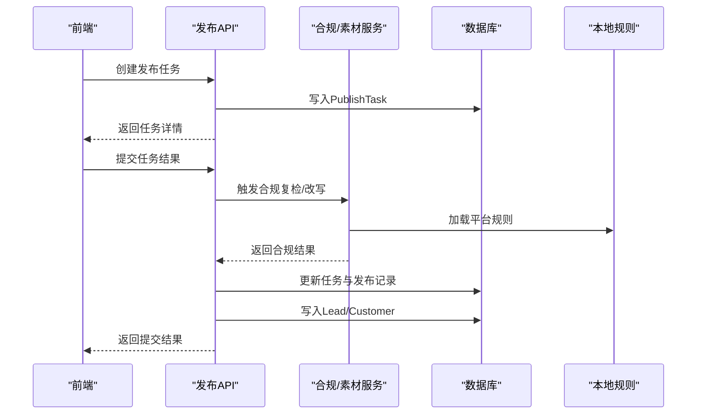
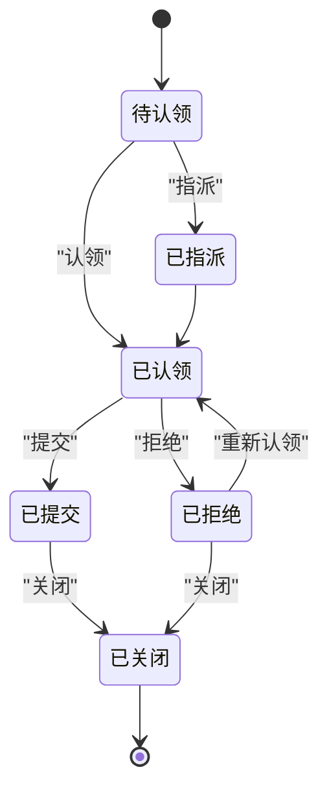
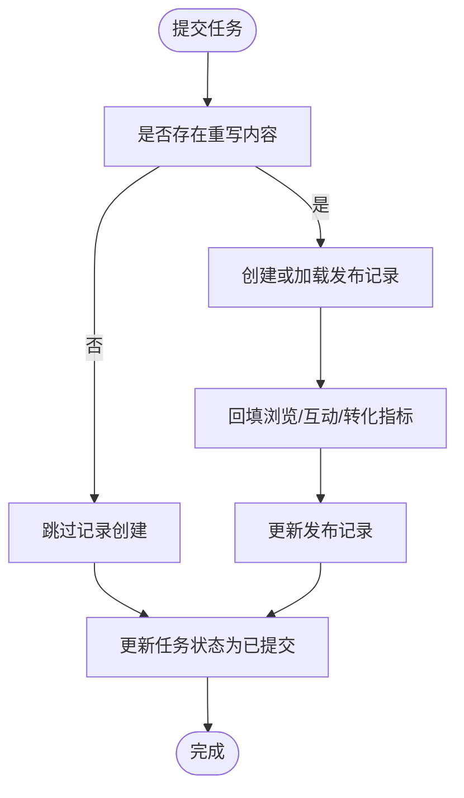
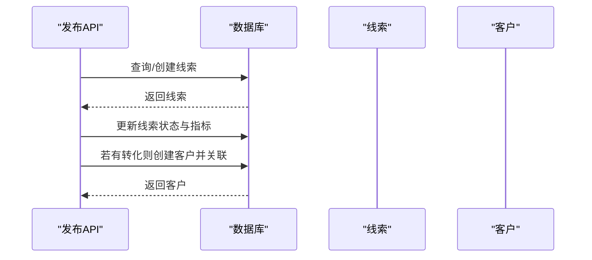
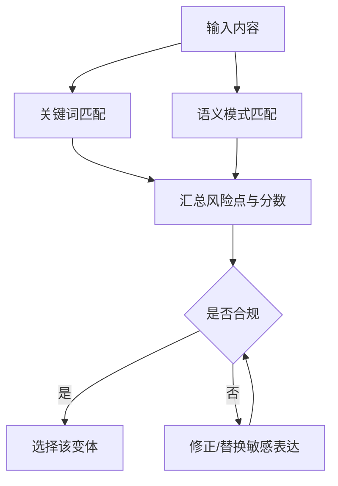
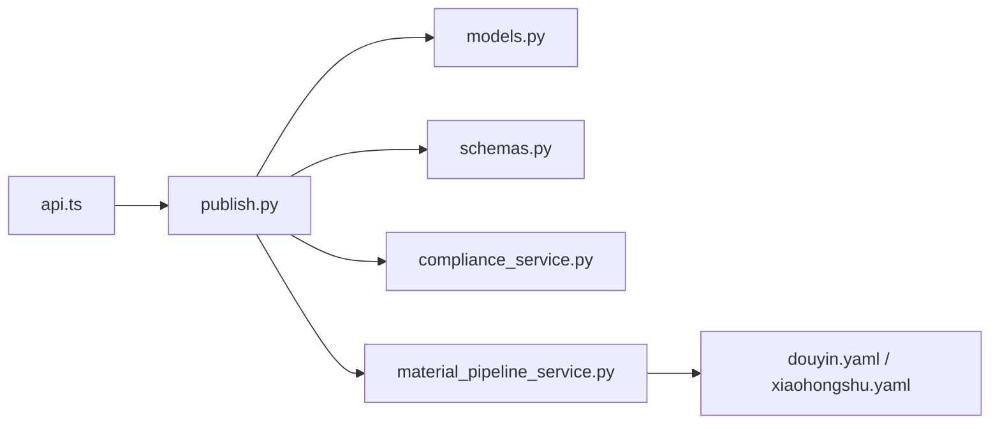

# 内容发布管理

<cite>
**本文引用的文件**
- [publish.py](file://backend/app/api/endpoints/publish.py)
- [models.py](file://backend/app/models/models.py)
- [schemas.py](file://backend/app/schemas/schemas.py)
- [compliance_service.py](file://backend/app/services/compliance_service.py)
- [material_pipeline_service.py](file://backend/app/services/collector/material_pipeline_service.py)
- [rewrite_agent.py](file://backend/app/ai/agents/rewrite_agent.py)
- [douyin.yaml](file://backend/app/rules/local/douyin.yaml)
- [xiaohongshu.yaml](file://backend/app/rules/local/xiaohongshu.yaml)
- [responses_api.py](file://backend/app/integrations/volcengine/responses_api.py)
- [api.ts](file://desktop/src/lib/api.ts)
- [test_main.py](file://backend/test_main.py)
- [test_material_pipeline_postgres_regression.py](file://backend/test_material_pipeline_postgres_regression.py)
</cite>

## 目录
1. [简介](#简介)
2. [项目结构](#项目结构)
3. [核心组件](#核心组件)
4. [架构总览](#架构总览)
5. [详细组件分析](#详细组件分析)
6. [依赖关系分析](#依赖关系分析)
7. [性能考量](#性能考量)
8. [故障排查指南](#故障排查指南)
9. [结论](#结论)
10. [附录](#附录)

## 简介
本技术文档围绕“内容发布管理”能力进行系统化梳理，覆盖从内容创作、合规校验、任务编排、发布执行、指标回填、线索转化到审计追踪的全流程。重点包括：
- 发布任务生命周期与审批流（认领、提交、拒绝、关闭）
- 多渠道发布策略与平台适配（小红书、抖音等）
- 发布状态管理、版本与回溯（任务反馈与追踪）
- 渠道配置与规则加载（本地规则文件）
- 质量检查、合规验证与风险控制
- 权限与角色控制、审计日志
- 发布效果预览、模板管理与批量导出
- 任务调度、并发控制与错误处理（结合现有模型与服务）

## 项目结构
发布管理相关的核心代码分布在后端 API 层、领域模型层、服务层与前端接口封装层：
- 后端 API：发布任务与记录的 CRUD、状态变更、统计与导出
- 领域模型：发布任务、发布记录、重写内容、线索与客户等实体
- 服务层：合规检查、素材管线与改写流程
- 前端封装：发布任务列表、导出、创建与状态统计等接口调用

图表来源
- [publish.py:1-606](file://backend/app/api/endpoints/publish.py#L1-L606)
- [models.py:259-349](file://backend/app/models/models.py#L259-L349)
- [schemas.py:284-416](file://backend/app/schemas/schemas.py#L284-L416)
- [compliance_service.py:1-113](file://backend/app/services/compliance_service.py#L1-L113)
- [material_pipeline_service.py:592-1700](file://backend/app/services/collector/material_pipeline_service.py#L592-L1700)
- [douyin.yaml:1-4](file://backend/app/rules/local/douyin.yaml#L1-L4)
- [xiaohongshu.yaml:1-4](file://backend/app/rules/local/xiaohongshu.yaml#L1-L4)
- [responses_api.py:1-3](file://backend/app/integrations/volcengine/responses_api.py#L1-L3)
- [api.ts:307-360](file://desktop/src/lib/api.ts#L307-L360)

章节来源
- [publish.py:1-606](file://backend/app/api/endpoints/publish.py#L1-L606)
- [models.py:259-349](file://backend/app/models/models.py#L259-L349)
- [schemas.py:284-416](file://backend/app/schemas/schemas.py#L284-L416)
- [api.ts:307-360](file://desktop/src/lib/api.ts#L307-L360)

## 核心组件
- 发布任务（PublishTask）：承载任务生命周期、指标与归属关系
- 发布记录（PublishRecord）：发布后的指标回填与归档
- 重写内容（RewrittenContent）：改写后的适配不同平台的内容载体
- 线索（Lead）与客户（Customer）：发布任务驱动的线索与客户转化
- 任务反馈（PublishTaskFeedback）：任务动作审计与追踪
- 合规服务（ComplianceService）：关键词与语义风险检测
- 素材管线服务（material_pipeline_service）：改写、合规复检与变体选择
- 规则与模板：本地规则文件与提示词模板加载
- 前端接口封装：任务列表、导出、创建与统计

章节来源
- [models.py:259-349](file://backend/app/models/models.py#L259-L349)
- [schemas.py:284-416](file://backend/app/schemas/schemas.py#L284-L416)
- [compliance_service.py:1-113](file://backend/app/services/compliance_service.py#L1-L113)
- [material_pipeline_service.py:592-1700](file://backend/app/services/collector/material_pipeline_service.py#L592-L1700)

## 架构总览
发布管理采用“API-服务-模型-规则”的分层设计：
- API 层负责任务与记录的增删改查、状态流转与导出
- 服务层负责合规校验、改写与变体选择、模板与规则加载
- 模型层定义发布任务、记录、线索、客户与反馈等实体
- 规则层提供平台级合规阈值与敏感词配置
- 前端通过封装好的接口与后端交互

图表来源
- [publish.py:149-183](file://backend/app/api/endpoints/publish.py#L149-L183)
- [publish.py:407-481](file://backend/app/api/endpoints/publish.py#L407-L481)
- [compliance_service.py:24-71](file://backend/app/services/compliance_service.py#L24-L71)
- [material_pipeline_service.py:1536-1664](file://backend/app/services/collector/material_pipeline_service.py#L1536-L1664)
- [douyin.yaml:1-4](file://backend/app/rules/local/douyin.yaml#L1-L4)
- [xiaohongshu.yaml:1-4](file://backend/app/rules/local/xiaohongshu.yaml#L1-L4)

## 详细组件分析

### 发布任务生命周期与审批流
- 支持的状态：pending、claimed、submitted、rejected、closed
- 关键操作：创建、认领、指派、提交、拒绝、关闭
- 访问控制：仅任务创建者或被指派者可操作
- 审计追踪：每次动作写入任务反馈表，支持按任务追踪链路

图表来源
- [publish.py:337-540](file://backend/app/api/endpoints/publish.py#L337-L540)
- [models.py:292-334](file://backend/app/models/models.py#L292-L334)

章节来源
- [publish.py:337-540](file://backend/app/api/endpoints/publish.py#L337-L540)
- [models.py:292-334](file://backend/app/models/models.py#L292-L334)

### 发布记录与指标回填
- 提交任务时，若存在重写内容，会创建或更新发布记录
- 将浏览、点赞、评论、收藏、分享、私信、微信添加、线索、有效线索、转化等指标回填至发布记录
- 支持后续查询与导出

图表来源
- [publish.py:436-467](file://backend/app/api/endpoints/publish.py#L436-L467)

章节来源
- [publish.py:436-467](file://backend/app/api/endpoints/publish.py#L436-L467)

### 线索与客户转化
- 提交任务后，根据任务指标自动创建/更新线索与客户
- 线索状态依据微信添加、线索、有效线索与转化自动推导
- 客户在发生转化时自动创建并关联线索

图表来源
- [publish.py:70-122](file://backend/app/api/endpoints/publish.py#L70-L122)
- [models.py:199-257](file://backend/app/models/models.py#L199-L257)

章节来源
- [publish.py:70-122](file://backend/app/api/endpoints/publish.py#L70-L122)
- [models.py:199-257](file://backend/app/models/models.py#L199-L257)

### 合规检查与风险控制
- 合规服务基于关键词与语义模式检测风险点，计算风险等级与分数
- 素材管线服务在生成变体后再次进行合规复检，选择合规或可修正的变体
- 支持自定义敏感词与阈值，平台级规则通过本地 YAML 文件加载

图表来源
- [compliance_service.py:24-71](file://backend/app/services/compliance_service.py#L24-L71)
- [material_pipeline_service.py:592-1700](file://backend/app/services/collector/material_pipeline_service.py#L592-L1700)
- [douyin.yaml:1-4](file://backend/app/rules/local/douyin.yaml#L1-L4)
- [xiaohongshu.yaml:1-4](file://backend/app/rules/local/xiaohongshu.yaml#L1-L4)

章节来源
- [compliance_service.py:1-113](file://backend/app/services/compliance_service.py#L1-L113)
- [material_pipeline_service.py:592-1700](file://backend/app/services/collector/material_pipeline_service.py#L592-L1700)
- [douyin.yaml:1-4](file://backend/app/rules/local/douyin.yaml#L1-L4)
- [xiaohongshu.yaml:1-4](file://backend/app/rules/local/xiaohongshu.yaml#L1-L4)

### 渠道配置、平台适配与API集成
- 平台枚举：小红书、抖音、知乎、闲鱼、微信等
- 本地规则文件用于加载平台级合规阈值与敏感词
- 火山引擎响应 API 示例用于扩展第三方平台集成

章节来源
- [models.py:29-36](file://backend/app/models/models.py#L29-L36)
- [douyin.yaml:1-4](file://backend/app/rules/local/douyin.yaml#L1-L4)
- [xiaohongshu.yaml:1-4](file://backend/app/rules/local/xiaohongshu.yaml#L1-L4)
- [responses_api.py:1-3](file://backend/app/integrations/volcengine/responses_api.py#L1-L3)

### 权限管理、角色控制与审计日志
- 权限控制：仅任务创建者或被指派者可操作任务
- 角色控制：CSV 导出接口限定为管理员或运营角色
- 审计日志：任务反馈表记录每次动作、备注与载荷

章节来源
- [publish.py:55-57](file://backend/app/api/endpoints/publish.py#L55-L57)
- [publish.py:547-548](file://backend/app/api/endpoints/publish.py#L547-L548)
- [models.py:336-349](file://backend/app/models/models.py#L336-L349)

### 发布效果预览、模板管理与批量发布
- 预览：前端页面展示改写结果与合规状态
- 模板：提示词模板按任务类型、平台、账号类型与受众加载
- 批量：支持 CSV 导出发布任务，便于批量处理与归档

章节来源
- [schemas.py:110-134](file://backend/app/schemas/schemas.py#L110-L134)
- [material_pipeline_service.py:1536-1610](file://backend/app/services/collector/material_pipeline_service.py#L1536-L1610)
- [publish.py:543-605](file://backend/app/api/endpoints/publish.py#L543-L605)
- [api.ts:307-360](file://desktop/src/lib/api.ts#L307-L360)

### 发布任务调度、并发控制与错误处理
- 当前实现以请求驱动为主，未见显式的后台任务调度器代码
- 错误处理：API 层对不存在资源、越权访问、非法状态转换等情况返回明确错误码
- 建议：如需定时发布与并发控制，可在服务层引入任务队列与锁机制

章节来源
- [publish.py:48-57](file://backend/app/api/endpoints/publish.py#L48-L57)
- [publish.py:348-349](file://backend/app/api/endpoints/publish.py#L348-L349)
- [publish.py:495-496](file://backend/app/api/endpoints/publish.py#L495-L496)

## 依赖关系分析
发布管理模块的关键依赖如下：
- API 依赖模型与序列化对象
- 任务提交流程依赖合规服务与素材管线服务
- 合规复检依赖本地规则文件
- 前端通过封装接口与后端交互

图表来源
- [publish.py:1-27](file://backend/app/api/endpoints/publish.py#L1-L27)
- [models.py:259-349](file://backend/app/models/models.py#L259-L349)
- [schemas.py:284-416](file://backend/app/schemas/schemas.py#L284-L416)
- [compliance_service.py:1-113](file://backend/app/services/compliance_service.py#L1-L113)
- [material_pipeline_service.py:592-1700](file://backend/app/services/collector/material_pipeline_service.py#L592-L1700)
- [douyin.yaml:1-4](file://backend/app/rules/local/douyin.yaml#L1-L4)
- [xiaohongshu.yaml:1-4](file://backend/app/rules/local/xiaohongshu.yaml#L1-L4)
- [api.ts:307-360](file://desktop/src/lib/api.ts#L307-L360)

章节来源
- [publish.py:1-27](file://backend/app/api/endpoints/publish.py#L1-L27)
- [models.py:259-349](file://backend/app/models/models.py#L259-L349)
- [schemas.py:284-416](file://backend/app/schemas/schemas.py#L284-L416)
- [compliance_service.py:1-113](file://backend/app/services/compliance_service.py#L1-L113)
- [material_pipeline_service.py:592-1700](file://backend/app/services/collector/material_pipeline_service.py#L592-L1700)
- [douyin.yaml:1-4](file://backend/app/rules/local/douyin.yaml#L1-L4)
- [xiaohongshu.yaml:1-4](file://backend/app/rules/local/xiaohongshu.yaml#L1-L4)
- [api.ts:307-360](file://desktop/src/lib/api.ts#L307-L360)

## 性能考量
- 数据库查询：任务列表与导出使用分页与过滤，建议在高频查询上增加索引（如状态、平台、创建时间）
- 合规复检：正则匹配与字符串替换为 CPU 密集型，建议缓存热点规则与敏感词
- 前端渲染：CSV 导出为内存流式输出，建议限制导出范围与行数
- 并发控制：当前未见后台任务调度，建议引入队列与幂等处理以支撑定时发布与批量任务

## 故障排查指南
- 任务状态异常
  - 现象：无法认领或提交
  - 排查：确认任务状态是否为待认领/已拒绝；检查访问者是否为创建者或被指派人
- 提交后指标未回填
  - 现象：发布记录未更新
  - 排查：确认提交时是否携带重写内容 ID；检查任务提交接口逻辑
- 线索/客户未生成
  - 现象：提交后无线索或客户
  - 排查：确认任务指标是否满足转化条件；检查线索创建逻辑
- 合规不通过
  - 现象：改写后仍显示高风险
  - 排查：检查本地规则阈值与敏感词；确认素材管线复检流程
- 导出失败
  - 现象：CSV 导出为空或报错
  - 排查：确认角色权限；检查查询参数与数据量限制

章节来源
- [publish.py:348-349](file://backend/app/api/endpoints/publish.py#L348-L349)
- [publish.py:495-496](file://backend/app/api/endpoints/publish.py#L495-L496)
- [publish.py:436-467](file://backend/app/api/endpoints/publish.py#L436-L467)
- [test_main.py:739-778](file://backend/test_main.py#L739-L778)
- [test_material_pipeline_postgres_regression.py:723-756](file://backend/test_material_pipeline_postgres_regression.py#L723-L756)

## 结论
内容发布管理以“任务-记录-线索-客户”为主线，结合合规检查与平台规则，实现了从任务创建、认领、提交到指标回填与线索转化的闭环。当前实现具备良好的扩展性，建议后续补充定时发布、并发控制与后台任务调度能力，以支撑更大规模的发布需求。

## 附录
- 前端接口封装示例：任务列表、导出、创建与统计
- 测试用例覆盖：任务生命周期、指标回填与线索生成

章节来源
- [api.ts:307-360](file://desktop/src/lib/api.ts#L307-L360)
- [test_main.py:739-778](file://backend/test_main.py#L739-L778)
- [test_material_pipeline_postgres_regression.py:510-756](file://backend/test_material_pipeline_postgres_regression.py#L510-L756)