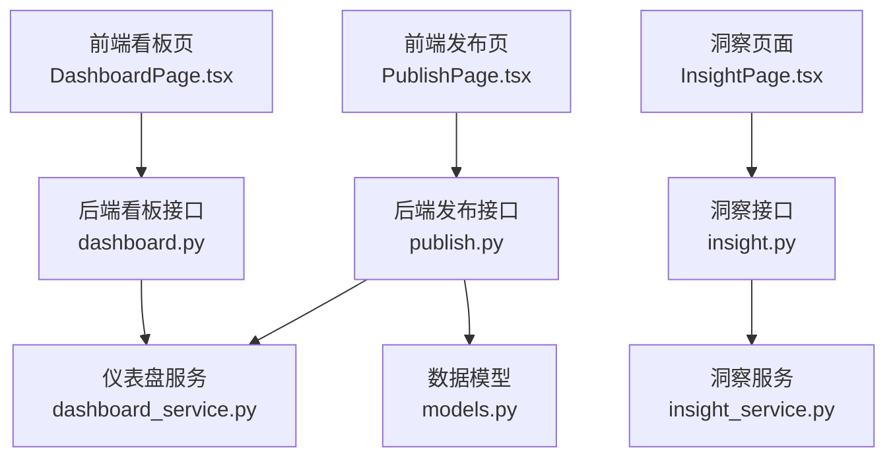
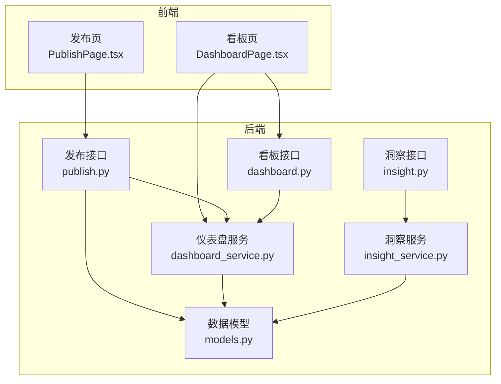
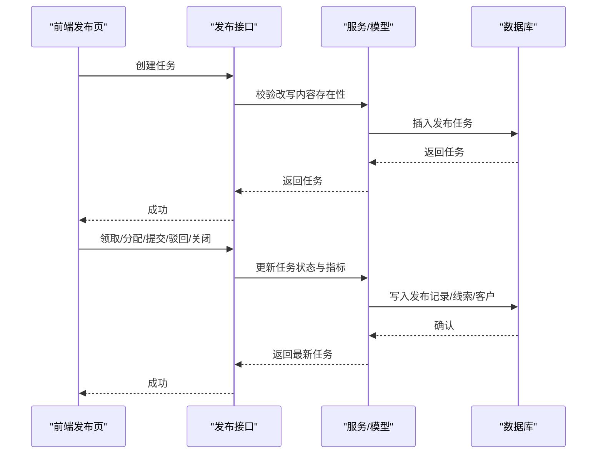
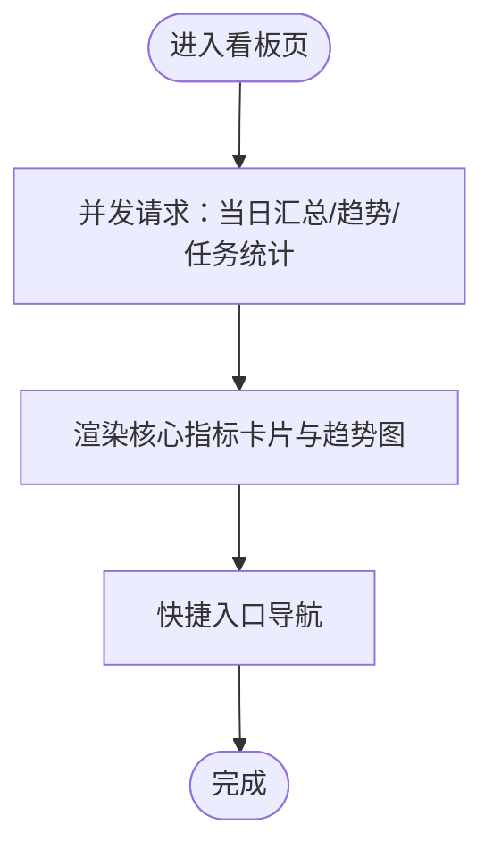
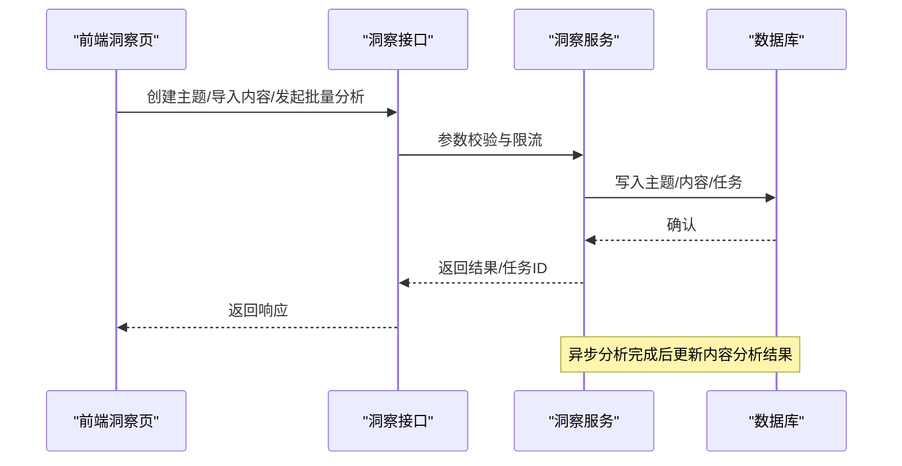
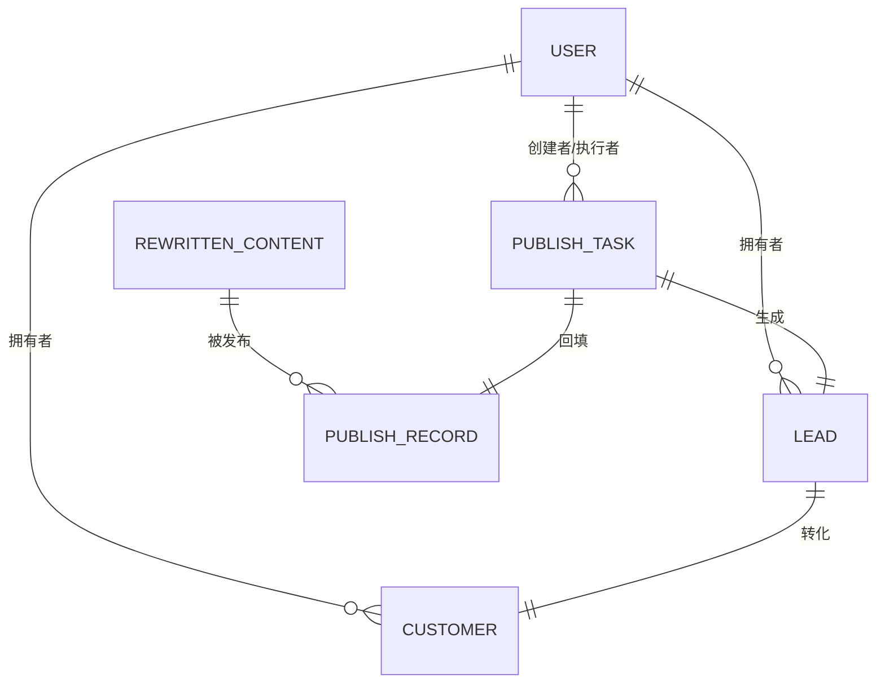
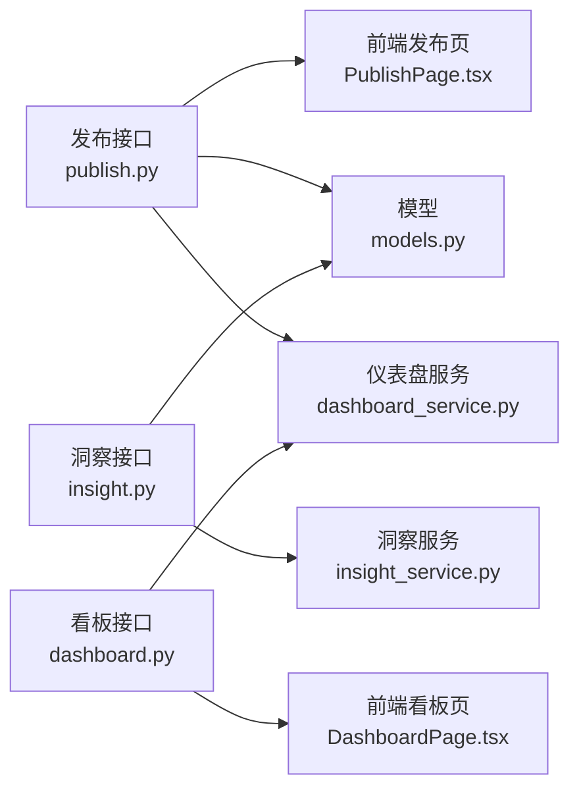

# 发布与分析系统

<cite>
**本文引用的文件**
- [backend/app/api/endpoints/publish.py](file://backend/app/api/endpoints/publish.py)
- [backend/app/services/dashboard_service.py](file://backend/app/services/dashboard_service.py)
- [backend/app/api/endpoints/dashboard.py](file://backend/app/api/endpoints/dashboard.py)
- [backend/app/api/endpoints/insight.py](file://backend/app/api/endpoints/insight.py)
- [backend/app/services/insight_service.py](file://backend/app/services/insight_service.py)
- [backend/app/models/models.py](file://backend/app/models/models.py)
- [backend/app/schemas/schemas.py](file://backend/app/schemas/schemas.py)
- [desktop/src/pages/PublishPage.tsx](file://desktop/src/pages/PublishPage.tsx)
- [desktop/src/pages/dashboard/DashboardPage.tsx](file://desktop/src/pages/dashboard/DashboardPage.tsx)
- [backend/app/rule/local/douyin.yaml](file://backend/app/rules/local/douyin.yaml)
- [backend/app/rule/local/xiaohongshu.yaml](file://backend/app/rules/local/xiaohongshu.yaml)
- [backend/app/rule/local/zhihu.yaml](file://backend/app/rules/local/zhihu.yaml)
</cite>

## 目录
1. [简介](#简介)
2. [项目结构](#项目结构)
3. [核心组件](#核心组件)
4. [架构总览](#架构总览)
5. [详细组件分析](#详细组件分析)
6. [依赖分析](#依赖分析)
7. [性能考虑](#性能考虑)
8. [故障排查指南](#故障排查指南)
9. [结论](#结论)
10. [附录](#附录)

## 简介
本文件面向“智获客发布与分析系统”，围绕内容发布全流程（任务创建、审批与流转、渠道与定时发布、效果追踪与分析、可视化看板与报表导出、策略优化与A/B测试支持、实时监控与异常告警、多维度分析与趋势预测）进行系统化说明。文档以代码为依据，结合前后端页面与服务端接口，帮助研发与运营人员快速理解系统能力与使用方式。

## 项目结构
系统采用前后端分离架构：
- 后端基于 FastAPI，提供 REST 接口与服务层，负责发布任务生命周期、发布记录、仪表盘聚合、洞察分析等。
- 前端采用 React + TypeScript，提供发布任务中心、仪表盘看板、洞察分析等页面。
- 数据模型通过 SQLAlchemy 映射到 PostgreSQL，涵盖用户、内容资产、改写内容、发布记录、发布任务、线索与客户等实体。

图表来源
- [desktop/src/pages/PublishPage.tsx:1-701](file://desktop/src/pages/PublishPage.tsx#L1-L701)
- [backend/app/api/endpoints/publish.py:1-606](file://backend/app/api/endpoints/publish.py#L1-L606)
- [backend/app/api/endpoints/dashboard.py:1-100](file://backend/app/api/endpoints/dashboard.py#L1-L100)
- [backend/app/services/dashboard_service.py:1-209](file://backend/app/services/dashboard_service.py#L1-L209)
- [backend/app/api/endpoints/insight.py:1-410](file://backend/app/api/endpoints/insight.py#L1-L410)
- [backend/app/services/insight_service.py:1-200](file://backend/app/services/insight_service.py#L1-L200)
- [backend/app/models/models.py:1-400](file://backend/app/models/models.py#L1-L400)

章节来源
- [backend/app/api/endpoints/publish.py:1-606](file://backend/app/api/endpoints/publish.py#L1-L606)
- [backend/app/api/endpoints/dashboard.py:1-100](file://backend/app/api/endpoints/dashboard.py#L1-L100)
- [backend/app/api/endpoints/insight.py:1-410](file://backend/app/api/endpoints/insight.py#L1-L410)
- [desktop/src/pages/PublishPage.tsx:1-701](file://desktop/src/pages/PublishPage.tsx#L1-L701)
- [desktop/src/pages/dashboard/DashboardPage.tsx:1-217](file://desktop/src/pages/dashboard/DashboardPage.tsx#L1-L217)

## 核心组件
- 发布任务中心：支持任务创建、领取、分配、提交、驳回、关闭与导出；自动回填发布记录与线索/客户。
- 仪表盘看板：提供当日汇总、趋势图、平台分析、高价值内容、AI调用统计等。
- 洞察分析：内容采集、主题管理、账号画像、检索召回与批量AI分析。
- 数据模型：统一支撑发布记录、任务、线索、客户、改写内容等实体。

章节来源
- [backend/app/api/endpoints/publish.py:125-606](file://backend/app/api/endpoints/publish.py#L125-L606)
- [backend/app/services/dashboard_service.py:7-209](file://backend/app/services/dashboard_service.py#L7-L209)
- [backend/app/api/endpoints/insight.py:65-410](file://backend/app/api/endpoints/insight.py#L65-L410)
- [backend/app/models/models.py:259-350](file://backend/app/models/models.py#L259-L350)

## 架构总览
系统采用“接口层-服务层-数据模型-前端页面”的分层设计，接口层负责鉴权、参数校验与响应封装；服务层承担业务逻辑与聚合统计；数据模型定义实体关系；前端页面通过 API 进行交互。

图表来源
- [desktop/src/pages/PublishPage.tsx:1-701](file://desktop/src/pages/PublishPage.tsx#L1-L701)
- [desktop/src/pages/dashboard/DashboardPage.tsx:1-217](file://desktop/src/pages/dashboard/DashboardPage.tsx#L1-L217)
- [backend/app/api/endpoints/publish.py:1-606](file://backend/app/api/endpoints/publish.py#L1-L606)
- [backend/app/api/endpoints/dashboard.py:1-100](file://backend/app/api/endpoints/dashboard.py#L1-L100)
- [backend/app/api/endpoints/insight.py:1-410](file://backend/app/api/endpoints/insight.py#L1-L410)
- [backend/app/services/dashboard_service.py:1-209](file://backend/app/services/dashboard_service.py#L1-L209)
- [backend/app/services/insight_service.py:1-200](file://backend/app/services/insight_service.py#L1-L200)
- [backend/app/models/models.py:1-400](file://backend/app/models/models.py#L1-L400)

## 详细组件分析

### 发布任务中心（任务生命周期与效果追踪）
- 任务创建：支持指定改写内容ID、平台、账号、标题与内容文本。
- 任务流转：领取、分配/改派、提交（回填指标）、驳回、关闭；每个动作记录反馈。
- 效果追踪：提交时自动写入发布记录（浏览、点赞、评论、收藏、转发、私信、加微、线索、有效线索、转化），并同步回填线索与客户。
- 导出：管理员/运营可按状态与平台导出任务CSV。

图表来源
- [backend/app/api/endpoints/publish.py:149-541](file://backend/app/api/endpoints/publish.py#L149-L541)
- [backend/app/models/models.py:292-350](file://backend/app/models/models.py#L292-L350)

章节来源
- [backend/app/api/endpoints/publish.py:125-606](file://backend/app/api/endpoints/publish.py#L125-L606)
- [backend/app/models/models.py:259-350](file://backend/app/models/models.py#L259-L350)
- [desktop/src/pages/PublishPage.tsx:108-294](file://desktop/src/pages/PublishPage.tsx#L108-L294)

### 仪表盘看板（可视化与交互）
- 当日汇总：新增客户、加微、线索、有效线索、转化。
- 趋势图：最近N日的发布量与关键指标趋势。
- 平台分析：按平台统计发布次数与转化。
- 高价值内容：筛选有加微且有效线索高的内容组合。
- AI调用统计：按日与用户聚合调用量、失败率、Token消耗与延迟。

图表来源
- [desktop/src/pages/dashboard/DashboardPage.tsx:52-71](file://desktop/src/pages/dashboard/DashboardPage.tsx#L52-L71)
- [backend/app/api/endpoints/dashboard.py:11-99](file://backend/app/api/endpoints/dashboard.py#L11-L99)
- [backend/app/services/dashboard_service.py:9-61](file://backend/app/services/dashboard_service.py#L9-L61)

章节来源
- [backend/app/api/endpoints/dashboard.py:11-99](file://backend/app/api/endpoints/dashboard.py#L11-L99)
- [backend/app/services/dashboard_service.py:7-209](file://backend/app/services/dashboard_service.py#L7-L209)
- [desktop/src/pages/dashboard/DashboardPage.tsx:44-217](file://desktop/src/pages/dashboard/DashboardPage.tsx#L44-L217)

### 洞察分析中心（采集、主题与检索召回）
- 主题管理：创建/列出/查询主题，用于内容分类与知识沉淀。
- 内容导入：支持单条与批量导入，包含平台、标题、正文、作者、互动指标等。
- AI分析：单条与批量异步分析，支持限流与任务跟踪。
- 检索召回：为生成模块提供结构化参考特征（标题公式/痛点/结构/风格）。

图表来源
- [backend/app/api/endpoints/insight.py:65-342](file://backend/app/api/endpoints/insight.py#L65-L342)
- [backend/app/services/insight_service.py:57-200](file://backend/app/services/insight_service.py#L57-L200)

章节来源
- [backend/app/api/endpoints/insight.py:65-410](file://backend/app/api/endpoints/insight.py#L65-L410)
- [backend/app/services/insight_service.py:1-200](file://backend/app/services/insight_service.py#L1-L200)

### 数据模型与关系
- 发布记录（PublishRecord）：承载各平台发布后的指标，与改写内容关联。
- 发布任务（PublishTask）：任务生命周期与指标，支持分配与反馈记录。
- 线索（Lead）与客户（Customer）：从任务回填生成线索，必要时转化为客户。
- 改写内容（RewrittenContent）：内容改写产物，承载合规状态与风险评分。

图表来源
- [backend/app/models/models.py:200-289](file://backend/app/models/models.py#L200-L289)

章节来源
- [backend/app/models/models.py:200-289](file://backend/app/models/models.py#L200-L289)

### 报表导出与自定义报告
- 发布任务导出：支持按状态与平台筛选，导出CSV文件，便于离线分析与二次加工。
- 自定义报告：前端可基于看板数据进行二次聚合与可视化扩展（如按主题、作者、平台等维度）。

章节来源
- [backend/app/api/endpoints/publish.py:543-606](file://backend/app/api/endpoints/publish.py#L543-L606)
- [desktop/src/pages/PublishPage.tsx:277-294](file://desktop/src/pages/PublishPage.tsx#L277-L294)

### 审批机制与渠道选择
- 审批与流转：通过任务状态机控制（待发布、已领取、已提交、已驳回、已关闭），支持分配/改派与反馈记录。
- 渠道选择：任务创建时指定平台与账号，发布记录与指标随渠道变化而聚合分析。

章节来源
- [backend/app/api/endpoints/publish.py:337-541](file://backend/app/api/endpoints/publish.py#L337-L541)
- [backend/app/schemas/schemas.py:322-400](file://backend/app/schemas/schemas.py#L322-L400)

### 定时发布与效果追踪
- 定时发布：任务支持到期时间字段，前端可据此进行排期与提醒。
- 效果追踪：提交任务时自动写入发布记录，回填浏览、互动、加微、线索、转化等指标，并生成线索/客户。

章节来源
- [backend/app/models/models.py:292-329](file://backend/app/models/models.py#L292-L329)
- [backend/app/api/endpoints/publish.py:407-481](file://backend/app/api/endpoints/publish.py#L407-L481)

### 可视化实现与交互设计
- 看板页：核心指标卡片、趋势折线图、工作流闭环图、快捷入口。
- 发布页：任务概览、创建面板、列表筛选、分配/改派、回填面板、导出按钮。

章节来源
- [desktop/src/pages/dashboard/DashboardPage.tsx:44-217](file://desktop/src/pages/dashboard/DashboardPage.tsx#L44-L217)
- [desktop/src/pages/PublishPage.tsx:28-701](file://desktop/src/pages/PublishPage.tsx#L28-L701)

### 报表生成功能与导出格式
- CSV导出：发布任务支持按条件导出，字段包含平台、账号、标题、状态、执行人、指标与时间戳。
- 自定义报告：前端可对看板数据进行二次聚合与图表化展示。

章节来源
- [backend/app/api/endpoints/publish.py:543-606](file://backend/app/api/endpoints/publish.py#L543-L606)

### 发布策略优化与A/B测试支持
- 策略优化：通过平台分析、主题TOP、高价值内容与AI调用统计，识别高转化路径与内容风格。
- A/B测试：可在洞察模块中对不同风格/主题的内容进行对比分析，结合发布任务回填指标评估效果。

章节来源
- [backend/app/services/dashboard_service.py:64-149](file://backend/app/services/dashboard_service.py#L64-L149)
- [backend/app/api/endpoints/insight.py:379-397](file://backend/app/api/endpoints/insight.py#L379-L397)

### 实时监控、异常告警与性能指标
- 性能指标：看板提供AI调用延迟、Token消耗与失败率，便于评估服务稳定性与成本。
- 异常告警：可基于任务状态异常（如长时间未提交）、发布指标异常（如零互动）触发预警。
- 监控建议：结合看板趋势与任务统计，建立阈值告警与人工复核机制。

章节来源
- [backend/app/services/dashboard_service.py:151-209](file://backend/app/services/dashboard_service.py#L151-L209)
- [backend/app/api/endpoints/dashboard.py:81-99](file://backend/app/api/endpoints/dashboard.py#L81-L99)

### 多维度分析、趋势预测与业务洞察
- 多维度：平台、主题、作者、内容类型、受众标签等。
- 趋势预测：基于历史趋势图进行简单外推，辅助排期与资源规划。
- 业务洞察：高价值内容与主题TOP榜单、账号画像与风格分布，指导内容策略与素材复用。

章节来源
- [backend/app/services/dashboard_service.py:85-149](file://backend/app/services/dashboard_service.py#L85-L149)
- [backend/app/services/insight_service.py:98-178](file://backend/app/services/insight_service.py#L98-L178)

## 依赖分析
- 接口与服务耦合：发布接口依赖服务层与模型层；看板接口依赖仪表盘服务；洞察接口依赖洞察服务。
- 前后端交互：前端页面通过API进行数据读取与写入，接口层负责鉴权与参数校验。
- 规则与平台：本地规则文件定义平台规则占位，便于后续扩展。

图表来源
- [backend/app/api/endpoints/publish.py:1-606](file://backend/app/api/endpoints/publish.py#L1-L606)
- [backend/app/api/endpoints/dashboard.py:1-100](file://backend/app/api/endpoints/dashboard.py#L1-L100)
- [backend/app/api/endpoints/insight.py:1-410](file://backend/app/api/endpoints/insight.py#L1-L410)
- [backend/app/services/dashboard_service.py:1-209](file://backend/app/services/dashboard_service.py#L1-L209)
- [backend/app/services/insight_service.py:1-200](file://backend/app/services/insight_service.py#L1-L200)
- [backend/app/models/models.py:1-400](file://backend/app/models/models.py#L1-L400)
- [desktop/src/pages/PublishPage.tsx:1-701](file://desktop/src/pages/PublishPage.tsx#L1-L701)
- [desktop/src/pages/dashboard/DashboardPage.tsx:1-217](file://desktop/src/pages/dashboard/DashboardPage.tsx#L1-L217)

章节来源
- [backend/app/api/endpoints/publish.py:1-606](file://backend/app/api/endpoints/publish.py#L1-L606)
- [backend/app/api/endpoints/dashboard.py:1-100](file://backend/app/api/endpoints/dashboard.py#L1-L100)
- [backend/app/api/endpoints/insight.py:1-410](file://backend/app/api/endpoints/insight.py#L1-L410)
- [backend/app/services/dashboard_service.py:1-209](file://backend/app/services/dashboard_service.py#L1-L209)
- [backend/app/services/insight_service.py:1-200](file://backend/app/services/insight_service.py#L1-L200)
- [backend/app/models/models.py:1-400](file://backend/app/models/models.py#L1-L400)
- [desktop/src/pages/PublishPage.tsx:1-701](file://desktop/src/pages/PublishPage.tsx#L1-L701)
- [desktop/src/pages/dashboard/DashboardPage.tsx:1-217](file://desktop/src/pages/dashboard/DashboardPage.tsx#L1-L217)

## 性能考虑
- 查询优化：看板趋势与平台分析采用聚合查询，建议在相关字段上建立索引以提升性能。
- 批量分析：洞察批量分析使用后台任务与限流，避免瞬时高峰冲击。
- 前端渲染：看板趋势图使用轻量图表库，建议对大数据集进行分页与懒加载。
- 缓存策略：可对高频看板数据设置短期缓存，降低数据库压力。

## 故障排查指南
- 任务状态异常：确认任务是否被正确领取/分配/提交，检查反馈记录与状态机约束。
- 发布记录缺失：检查提交流程是否成功写入发布记录，核对改写内容ID与平台信息。
- 指标为空：检查前端回填字段是否正确传递，核对数据库字段映射。
- 导出失败：确认筛选条件与权限，检查接口返回的错误信息。
- AI分析未完成：检查任务状态与限流配置，关注失败条目与重试策略。

章节来源
- [backend/app/api/endpoints/publish.py:337-541](file://backend/app/api/endpoints/publish.py#L337-L541)
- [backend/app/api/endpoints/insight.py:234-302](file://backend/app/api/endpoints/insight.py#L234-L302)

## 结论
本系统以“发布任务中心+洞察分析+仪表盘看板”为核心，形成从内容采集、改写、发布、追踪到分析与优化的闭环。通过清晰的任务状态机、完善的指标体系与可视化看板，能够有效支撑内容营销的规模化运作与持续优化。建议在现有基础上进一步完善A/B测试框架、异常告警与规则引擎，以提升策略迭代效率与系统稳定性。

## 附录
- 平台规则文件：本地规则文件为平台规则占位，便于后续扩展与治理。

章节来源
- [backend/app/rule/local/douyin.yaml:1-4](file://backend/app/rules/local/douyin.yaml#L1-L4)
- [backend/app/rule/local/xiaohongshu.yaml:1-4](file://backend/app/rules/local/xiaohongshu.yaml#L1-L4)
- [backend/app/rule/local/zhihu.yaml:1-4](file://backend/app/rules/local/zhihu.yaml#L1-L4)