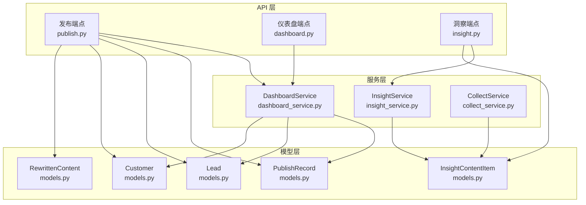
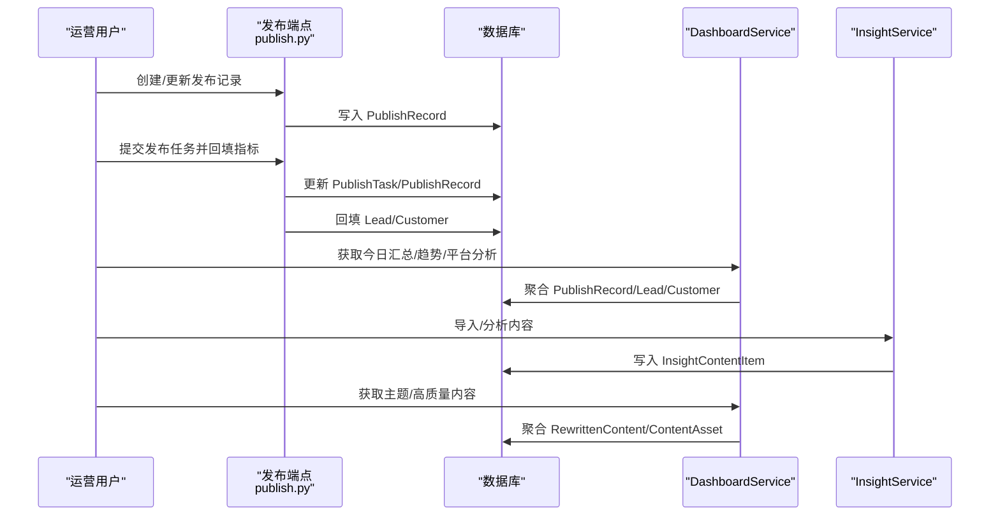
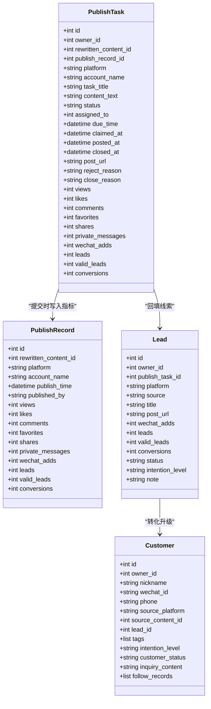
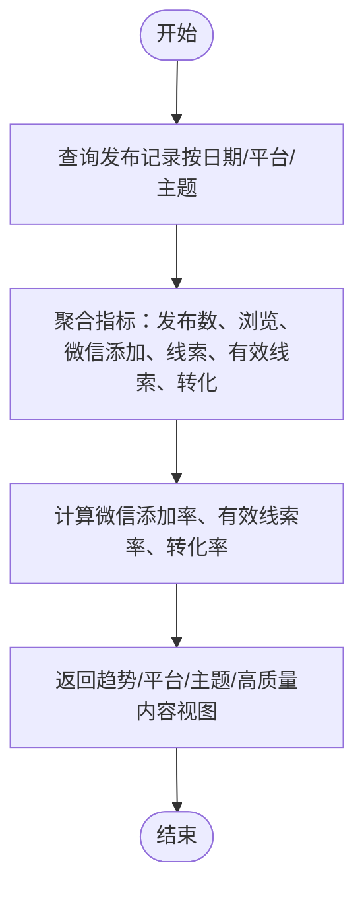
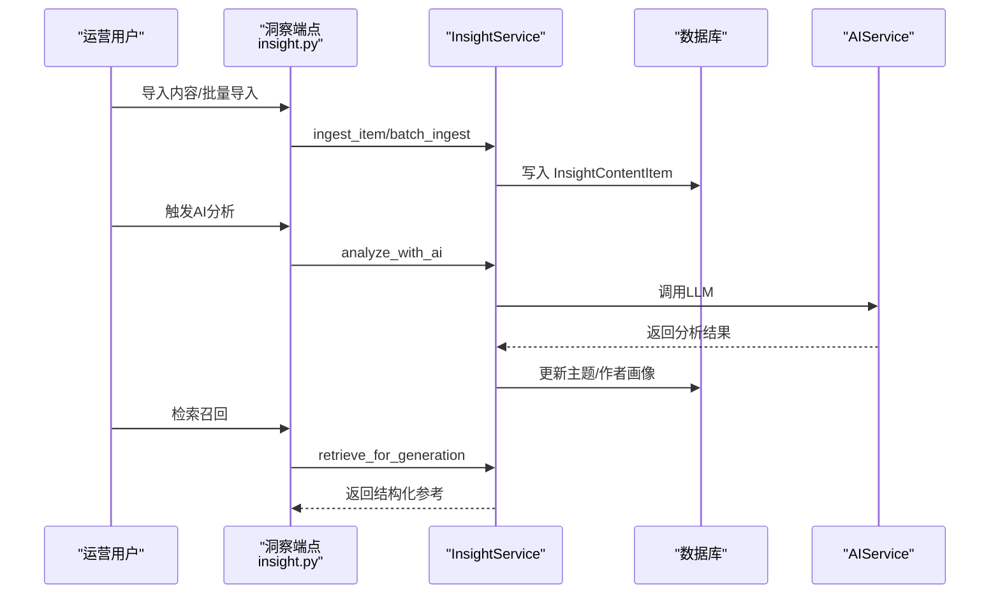
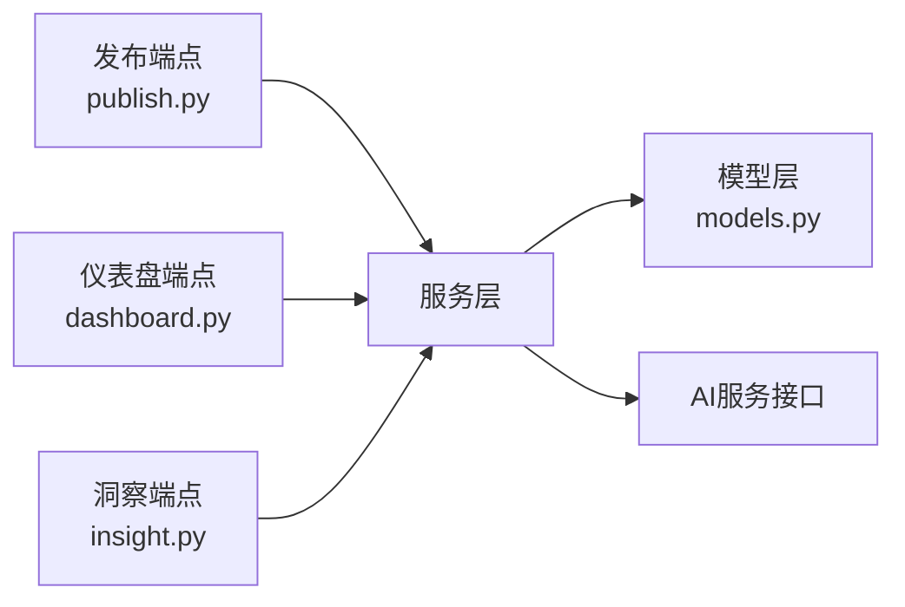
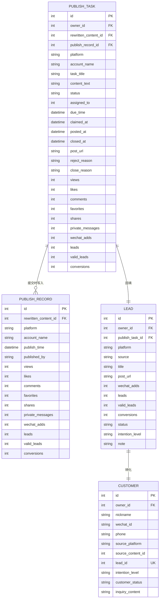

# 发布效果追踪

<cite>
**本文引用的文件**
- [backend/app/api/endpoints/publish.py](file://backend/app/api/endpoints/publish.py)
- [backend/app/models/models.py](file://backend/app/models/models.py)
- [backend/app/schemas/schemas.py](file://backend/app/schemas/schemas.py)
- [backend/app/services/dashboard_service.py](file://backend/app/services/dashboard_service.py)
- [backend/app/api/endpoints/dashboard.py](file://backend/app/api/endpoints/dashboard.py)
- [backend/app/api/endpoints/insight.py](file://backend/app/api/endpoints/insight.py)
- [backend/app/services/insight_service.py](file://backend/app/services/insight_service.py)
- [backend/app/domains/acquisition/collect_service.py](file://backend/app/domains/acquisition/collect_service.py)
- [backend/app/tasks/stats_tasks.py](file://backend/app/tasks/stats_tasks.py)
</cite>

## 目录
1. [简介](#简介)
2. [项目结构](#项目结构)
3. [核心组件](#核心组件)
4. [架构总览](#架构总览)
5. [详细组件分析](#详细组件分析)
6. [依赖分析](#依赖分析)
7. [性能考量](#性能考量)
8. [故障排查指南](#故障排查指南)
9. [结论](#结论)
10. [附录](#附录)

## 简介
本技术文档面向“智获客发布效果追踪系统”，围绕发布数据的采集、处理、存储与分析进行系统化梳理，重点覆盖以下方面：
- 发布数据采集机制：点击、互动、转化等关键指标的来源与落库路径
- 实时与历史数据：如何在数据库中组织与查询，以及趋势与聚合策略
- 多维度分析：按时间、平台、主题等维度的对比与洞察
- 异常检测与数据清洗：基于业务规则与字段约束的质量保障
- 数据可视化与报告：仪表盘接口与导出能力
- A/B测试支持与统计显著性：当前系统能力边界与扩展建议

## 项目结构
后端采用 FastAPI + SQLAlchemy 架构，核心模块包括：
- API 层：发布、仪表盘、洞察等端点
- 服务层：业务逻辑封装（如仪表盘聚合、洞察分析）
- 模型层：数据库实体定义（发布记录、线索、客户、重写内容等）
- 领域服务：素材采集与解析（平台识别、元数据抓取、AI分析）

**图示来源**
- [backend/app/api/endpoints/publish.py](file://backend/app/api/endpoints/publish.py)
- [backend/app/api/endpoints/dashboard.py](file://backend/app/api/endpoints/dashboard.py)
- [backend/app/api/endpoints/insight.py](file://backend/app/api/endpoints/insight.py)
- [backend/app/services/dashboard_service.py](file://backend/app/services/dashboard_service.py)
- [backend/app/services/insight_service.py](file://backend/app/services/insight_service.py)
- [backend/app/domains/acquisition/collect_service.py](file://backend/app/domains/acquisition/collect_service.py)
- [backend/app/models/models.py](file://backend/app/models/models.py)

**章节来源**
- [backend/app/api/endpoints/publish.py](file://backend/app/api/endpoints/publish.py)
- [backend/app/api/endpoints/dashboard.py](file://backend/app/api/endpoints/dashboard.py)
- [backend/app/api/endpoints/insight.py](file://backend/app/api/endpoints/insight.py)
- [backend/app/services/dashboard_service.py](file://backend/app/services/dashboard_service.py)
- [backend/app/services/insight_service.py](file://backend/app/services/insight_service.py)
- [backend/app/domains/acquisition/collect_service.py](file://backend/app/domains/acquisition/collect_service.py)
- [backend/app/models/models.py](file://backend/app/models/models.py)

## 核心组件
- 发布记录与任务
  - 发布记录表记录各平台发布后的基础互动与转化指标；发布任务表用于工作流跟踪与回填线索/客户
- 线索与客户
  - 通过发布任务回填线索，再根据线索状态与转化情况自动升级为客户
- 仪表盘服务
  - 提供当日汇总、趋势、平台分析、主题表现、高质量内容、AI调用统计等聚合视图
- 洞察服务
  - 内容采集、去重、AI分析、主题/作者画像、检索召回
- 素材采集服务
  - 平台识别、元数据抓取、自动分类、AI分析

**章节来源**
- [backend/app/models/models.py](file://backend/app/models/models.py)
- [backend/app/services/dashboard_service.py](file://backend/app/services/dashboard_service.py)
- [backend/app/services/insight_service.py](file://backend/app/services/insight_service.py)
- [backend/app/domains/acquisition/collect_service.py](file://backend/app/domains/acquisition/collect_service.py)

## 架构总览
系统以“发布任务/记录”为核心入口，将平台互动与转化数据写入发布记录，并通过任务回填线索与客户，形成“发布—线索—客户”的闭环。仪表盘服务对发布记录进行多维聚合，洞察服务负责内容侧的采集与分析。

**图示来源**
- [backend/app/api/endpoints/publish.py](file://backend/app/api/endpoints/publish.py)
- [backend/app/services/dashboard_service.py](file://backend/app/services/dashboard_service.py)
- [backend/app/services/insight_service.py](file://backend/app/services/insight_service.py)
- [backend/app/models/models.py](file://backend/app/models/models.py)

## 详细组件分析

### 发布记录与任务（发布效果追踪核心）
- 数据模型
  - 发布记录：包含平台、账号、发布时间、发布者、基础互动与转化指标
  - 发布任务：包含任务标题、平台、账号、状态、分配与提交流程、指标字段
  - 线索与客户：由任务回填，状态随转化推进
- 关键流程
  - 创建发布记录：校验重写内容存在性后写入
  - 提交发布任务：将任务指标同步至发布记录，同时回填线索与客户
  - 任务生命周期：创建、认领、指派、提交、拒绝、关闭
- 指标字段
  - 基础互动：浏览、点赞、评论、收藏、分享、私信
  - 转化链路：微信添加、线索、有效线索、转化

**图示来源**
- [backend/app/models/models.py](file://backend/app/models/models.py)

**章节来源**
- [backend/app/api/endpoints/publish.py](file://backend/app/api/endpoints/publish.py)
- [backend/app/models/models.py](file://backend/app/models/models.py)
- [backend/app/schemas/schemas.py](file://backend/app/schemas/schemas.py)

### 仪表盘与趋势分析
- 当日汇总：新客户、微信添加、线索、有效线索、转化
- 趋势：近N日每日发布数量与各项指标累计
- 平台分析：按平台统计发布数量与转化
- 主题表现：按主题统计发布次数、浏览、微信添加、有效线索，并计算微信添加率与有效线索率
- 高质量内容：筛选有微信添加且有效线索高的内容组合
- AI调用统计：按日与用户聚合调用量、失败率、Token消耗与延迟

**图示来源**
- [backend/app/services/dashboard_service.py](file://backend/app/services/dashboard_service.py)
- [backend/app/api/endpoints/dashboard.py](file://backend/app/api/endpoints/dashboard.py)

**章节来源**
- [backend/app/services/dashboard_service.py](file://backend/app/services/dashboard_service.py)
- [backend/app/api/endpoints/dashboard.py](file://backend/app/api/endpoints/dashboard.py)

### 洞察与内容分析
- 内容采集：支持手动、链接解析、插件上传等多通道，去重与元数据抽取
- AI分析：对内容进行主题、受众、结构、钩子、语气、CTA、风险等级等分析
- 主题/作者画像：维护主题知识库与账号风格、爆款率、平均互动分
- 检索召回：为生成模块提供结构化参考特征，避免直接复制

**图示来源**
- [backend/app/api/endpoints/insight.py](file://backend/app/api/endpoints/insight.py)
- [backend/app/services/insight_service.py](file://backend/app/services/insight_service.py)
- [backend/app/models/models.py](file://backend/app/models/models.py)

**章节来源**
- [backend/app/api/endpoints/insight.py](file://backend/app/api/endpoints/insight.py)
- [backend/app/services/insight_service.py](file://backend/app/services/insight_service.py)
- [backend/app/models/models.py](file://backend/app/models/models.py)

### 素材采集与解析
- 平台识别：基于URL正则识别平台并映射中文标签
- 元数据抓取：从HTML中抽取OG/Twitter/Title等字段
- 自动分类：基于关键词匹配贷款/金融获客相关主题
- AI分析：对内容进行标签、分类、热度、是否爆款、卖点与改写建议

**章节来源**
- [backend/app/domains/acquisition/collect_service.py](file://backend/app/domains/acquisition/collect_service.py)

### 数据导出与报告
- 发布任务导出：CSV导出任务列表，包含平台、账号、状态、指标与时间
- 仪表盘报告：按日趋势、平台、主题、高质量内容等维度生成可视化数据

**章节来源**
- [backend/app/api/endpoints/publish.py](file://backend/app/api/endpoints/publish.py)
- [backend/app/api/endpoints/dashboard.py](file://backend/app/api/endpoints/dashboard.py)

### A/B测试支持与统计显著性
- 当前能力：系统未提供专门的A/B实验设计、分桶与显著性检验接口
- 建议扩展：引入实验分组标记、对照组/实验组指标对比、统计显著性计算与可视化

**章节来源**
- [backend/app/api/endpoints/publish.py](file://backend/app/api/endpoints/publish.py)
- [backend/app/api/endpoints/dashboard.py](file://backend/app/api/endpoints/dashboard.py)

## 依赖分析
- API 依赖服务层：发布端点依赖任务/记录写入与线索客户回填；仪表盘端点依赖聚合服务；洞察端点依赖分析服务
- 服务层依赖模型层：所有聚合与分析均基于SQLAlchemy ORM对数据库进行查询与统计
- 领域服务与外部AI：洞察与素材采集服务通过统一的AI服务接口调用大模型，返回结构化分析结果

**图示来源**
- [backend/app/api/endpoints/publish.py](file://backend/app/api/endpoints/publish.py)
- [backend/app/api/endpoints/dashboard.py](file://backend/app/api/endpoints/dashboard.py)
- [backend/app/api/endpoints/insight.py](file://backend/app/api/endpoints/insight.py)
- [backend/app/services/dashboard_service.py](file://backend/app/services/dashboard_service.py)
- [backend/app/services/insight_service.py](file://backend/app/services/insight_service.py)
- [backend/app/models/models.py](file://backend/app/models/models.py)

**章节来源**
- [backend/app/api/endpoints/publish.py](file://backend/app/api/endpoints/publish.py)
- [backend/app/api/endpoints/dashboard.py](file://backend/app/api/endpoints/dashboard.py)
- [backend/app/api/endpoints/insight.py](file://backend/app/api/endpoints/insight.py)
- [backend/app/services/dashboard_service.py](file://backend/app/services/dashboard_service.py)
- [backend/app/services/insight_service.py](file://backend/app/services/insight_service.py)
- [backend/app/models/models.py](file://backend/app/models/models.py)

## 性能考量
- 聚合查询优化：仪表盘聚合涉及多表连接与分组统计，建议在常用过滤字段（如平台、日期、用户ID）建立索引
- 分页与限制：列表接口默认限制每页数量，避免一次性返回过多数据
- 批量导入与分析：洞察批量导入与AI分析应配合限流与异步队列，避免阻塞主线程
- 缓存策略：对高频读取的聚合视图可考虑Redis缓存短期热点数据

[本节为通用指导，无需特定文件引用]

## 故障排查指南
- 发布任务状态异常
  - 确认任务状态流转是否符合预期（仅待认领/已拒绝可认领；仅进行中可提交；已关闭不可再操作）
  - 检查任务归属与权限校验
- 指标缺失或为零
  - 核对提交流程是否正确将任务指标同步至发布记录
  - 检查字段映射与空值处理
- 线索/客户未回填
  - 校验任务中的转化指标是否满足状态推断条件
  - 确认客户关联逻辑与去重策略
- 导出数据为空
  - 检查过滤参数（状态、平台、时间范围）与权限范围
- 洞察分析失败
  - 查看AI调用日志与错误信息，确认提示词与输入长度限制

**章节来源**
- [backend/app/api/endpoints/publish.py](file://backend/app/api/endpoints/publish.py)
- [backend/app/api/endpoints/insight.py](file://backend/app/api/endpoints/insight.py)
- [backend/app/services/insight_service.py](file://backend/app/services/insight_service.py)

## 结论
本系统以“发布任务/记录”为核心，结合线索与客户的回填机制，实现了从发布到转化的闭环追踪。仪表盘服务提供了多维度的聚合视图，洞察服务支撑内容侧的采集与分析。当前系统在数据导出、可视化与A/B测试方面具备基础能力，建议后续增强统计显著性与实验设计能力，以更好地支持数据驱动的决策与优化。

[本节为总结性内容，无需特定文件引用]

## 附录

### 关键指标定义与计算
- 微信添加率 = 微信添加 / 浏览（若浏览为0，按约定返回0）
- 有效线索率 = 有效线索 / 微信添加（若微信添加为0，按约定返回0）
- 转化率 = 转化 / 有效线索（若有效线索为0，按约定返回0）

**章节来源**
- [backend/app/services/dashboard_service.py](file://backend/app/services/dashboard_service.py)

### 数据模型概览（ER）

**图示来源**
- [backend/app/models/models.py](file://backend/app/models/models.py)