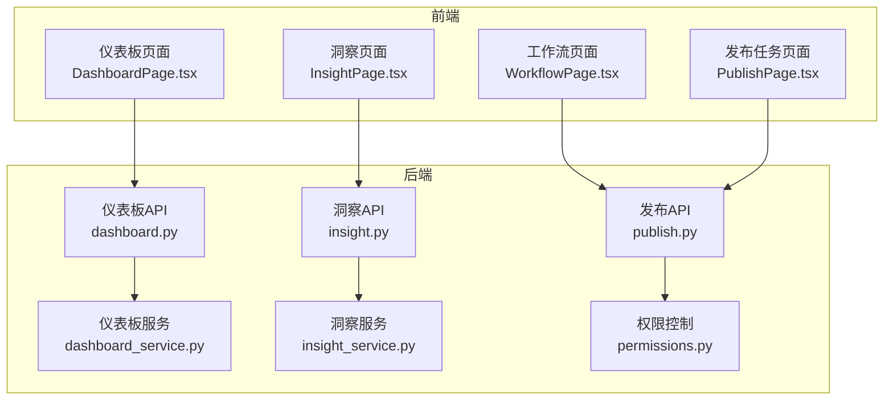
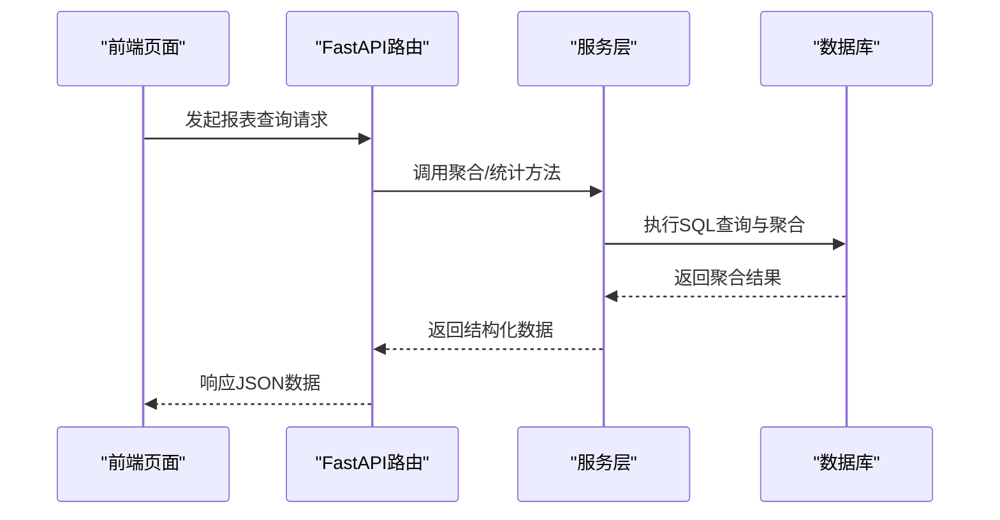
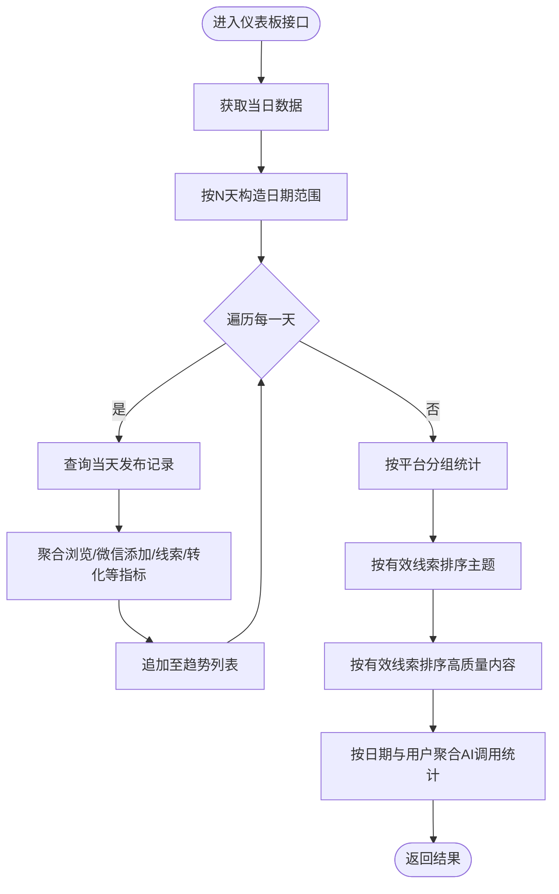
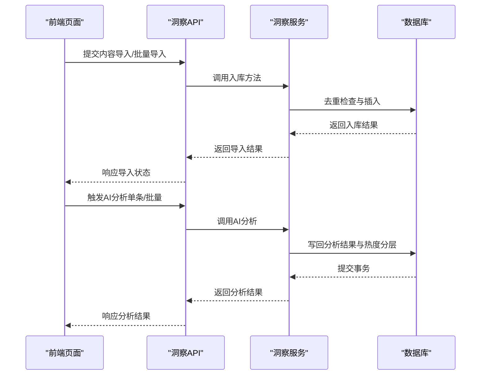
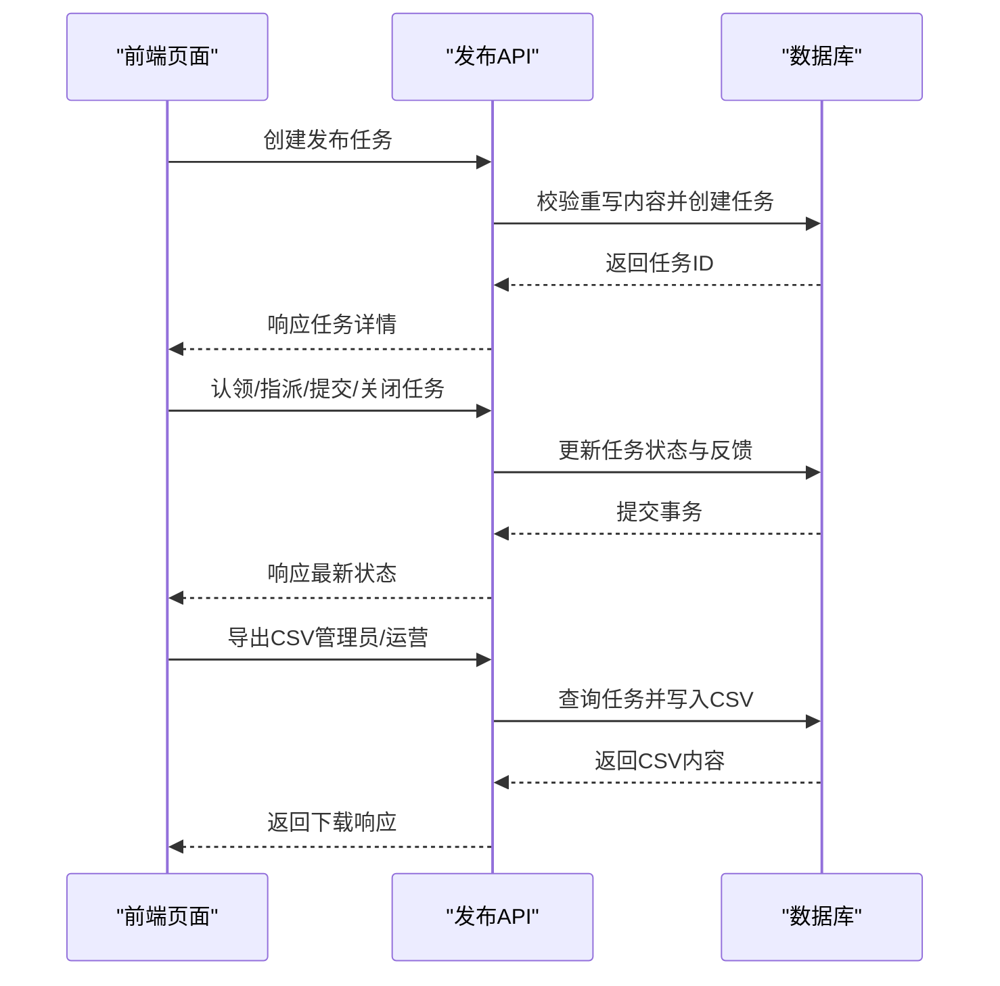
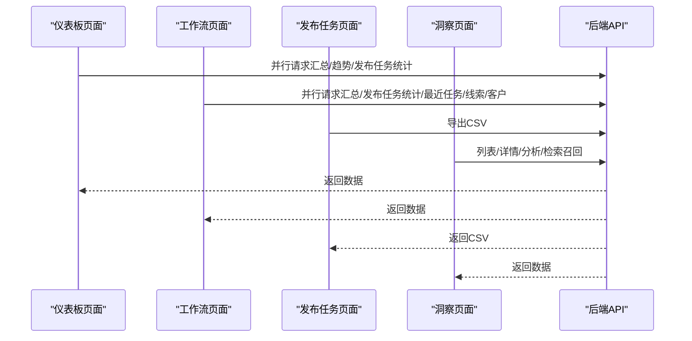
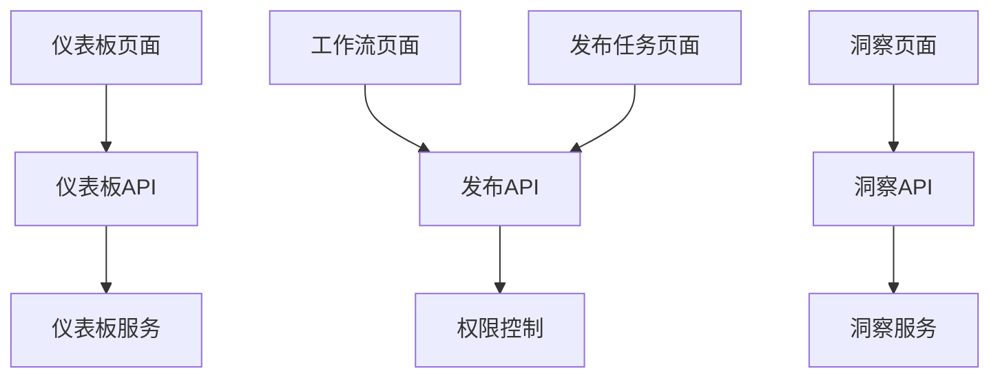

# 报表生成系统

<cite>
**本文引用的文件**
- [backend/app/api/endpoints/dashboard.py](file://backend/app/api/endpoints/dashboard.py)
- [backend/app/services/dashboard_service.py](file://backend/app/services/dashboard_service.py)
- [backend/app/api/endpoints/insight.py](file://backend/app/api/endpoints/insight.py)
- [backend/app/services/insight_service.py](file://backend/app/services/insight_service.py)
- [backend/app/api/endpoints/publish.py](file://backend/app/api/endpoints/publish.py)
- [backend/app/core/permissions.py](file://backend/app/core/permissions.py)
- [backend/alembic/versions/20260327_02_add_material_knowledge_pipeline.py](file://backend/alembic/versions/20260327_02_add_material_knowledge_pipeline.py)
- [backend/app/services/collector/material_pipeline_service.py](file://backend/app/services/collector/material_pipeline_service.py)
- [desktop/src/pages/PublishPage.tsx](file://desktop/src/pages/PublishPage.tsx)
- [desktop/src/pages/dashboard/DashboardPage.tsx](file://desktop/src/pages/dashboard/DashboardPage.tsx)
- [desktop/src/pages/WorkflowPage.tsx](file://desktop/src/pages/WorkflowPage.tsx)
- [desktop/src/pages/InsightPage.tsx](file://desktop/src/pages/InsightPage.tsx)
</cite>

## 目录
1. [简介](#简介)
2. [项目结构](#项目结构)
3. [核心组件](#核心组件)
4. [架构总览](#架构总览)
5. [详细组件分析](#详细组件分析)
6. [依赖分析](#依赖分析)
7. [性能考虑](#性能考虑)
8. [故障排查指南](#故障排查指南)
9. [结论](#结论)
10. [附录](#附录)

## 简介
本文件面向“智获客报表生成系统”，围绕现有代码库梳理与报表相关的功能边界，重点覆盖以下方面：
- 报表数据来源与指标：发布任务、发布记录、线索与客户转化、内容洞察与热度分析、AI调用统计等
- 报表查询与聚合：按天趋势、平台分析、热点主题、高质量内容、AI调用统计等
- 数据导出能力：CSV导出接口
- 权限与安全：角色校验与访问控制
- 前端集成：仪表板、工作流、发布任务与洞察页面的数据展示与交互

需要特别说明的是：当前仓库未发现专门的“报表模板引擎”或“PDF/Excel/HTML导出渲染器”实现。本文在“报表格式支持”“模板系统设计”“自动化分发”等章节以概念性说明为主，旨在为后续扩展提供参考路径。

## 项目结构
后端采用 FastAPI + SQLAlchemy 架构，前端为 React/Vite 应用。与报表生成相关的关键模块如下：
- 后端 API 层：仪表板、洞察、发布任务与记录
- 后端服务层：数据聚合、统计计算、AI调用统计
- 前端页面：仪表板、工作流、发布任务、洞察分析
- 权限控制：基于角色的访问控制
- 数据模型：发布记录、发布任务、线索、客户、内容洞察项等

**图表来源**
- [backend/app/api/endpoints/dashboard.py:1-100](file://backend/app/api/endpoints/dashboard.py#L1-L100)
- [backend/app/services/dashboard_service.py:1-209](file://backend/app/services/dashboard_service.py#L1-L209)
- [backend/app/api/endpoints/insight.py:1-410](file://backend/app/api/endpoints/insight.py#L1-L410)
- [backend/app/services/insight_service.py:1-659](file://backend/app/services/insight_service.py#L1-L659)
- [backend/app/api/endpoints/publish.py:1-606](file://backend/app/api/endpoints/publish.py#L1-L606)
- [backend/app/core/permissions.py:1-29](file://backend/app/core/permissions.py#L1-L29)
- [desktop/src/pages/dashboard/DashboardPage.tsx:44-68](file://desktop/src/pages/dashboard/DashboardPage.tsx#L44-L68)
- [desktop/src/pages/WorkflowPage.tsx:46-185](file://desktop/src/pages/WorkflowPage.tsx#L46-L185)
- [desktop/src/pages/PublishPage.tsx:283-326](file://desktop/src/pages/PublishPage.tsx#L283-L326)
- [desktop/src/pages/InsightPage.tsx:50-100](file://desktop/src/pages/InsightPage.tsx#L50-L100)

**章节来源**
- [backend/app/api/endpoints/dashboard.py:1-100](file://backend/app/api/endpoints/dashboard.py#L1-L100)
- [backend/app/services/dashboard_service.py:1-209](file://backend/app/services/dashboard_service.py#L1-L209)
- [backend/app/api/endpoints/insight.py:1-410](file://backend/app/api/endpoints/insight.py#L1-L410)
- [backend/app/services/insight_service.py:1-659](file://backend/app/services/insight_service.py#L1-L659)
- [backend/app/api/endpoints/publish.py:1-606](file://backend/app/api/endpoints/publish.py#L1-L606)
- [backend/app/core/permissions.py:1-29](file://backend/app/core/permissions.py#L1-L29)
- [desktop/src/pages/dashboard/DashboardPage.tsx:44-68](file://desktop/src/pages/dashboard/DashboardPage.tsx#L44-L68)
- [desktop/src/pages/WorkflowPage.tsx:46-185](file://desktop/src/pages/WorkflowPage.tsx#L46-L185)
- [desktop/src/pages/PublishPage.tsx:283-326](file://desktop/src/pages/PublishPage.tsx#L283-L326)
- [desktop/src/pages/InsightPage.tsx:50-100](file://desktop/src/pages/InsightPage.tsx#L50-L100)

## 核心组件
- 仪表板服务：提供当日汇总、趋势分析、平台分析、热点主题、高质量内容、AI调用统计等聚合指标
- 洞察服务：内容导入、批量导入、AI分析、检索召回、统计与作者画像
- 发布服务：发布任务生命周期管理、发布记录创建与更新、CSV导出
- 权限控制：基于角色的访问控制，用于限制导出等敏感操作
- 前端页面：仪表板、工作流、发布任务、洞察分析页面的数据展示与交互

**章节来源**
- [backend/app/services/dashboard_service.py:7-209](file://backend/app/services/dashboard_service.py#L7-L209)
- [backend/app/services/insight_service.py:57-659](file://backend/app/services/insight_service.py#L57-L659)
- [backend/app/api/endpoints/publish.py:543-606](file://backend/app/api/endpoints/publish.py#L543-L606)
- [backend/app/core/permissions.py:9-29](file://backend/app/core/permissions.py#L9-L29)
- [desktop/src/pages/dashboard/DashboardPage.tsx:44-68](file://desktop/src/pages/dashboard/DashboardPage.tsx#L44-L68)
- [desktop/src/pages/WorkflowPage.tsx:46-185](file://desktop/src/pages/WorkflowPage.tsx#L46-L185)
- [desktop/src/pages/PublishPage.tsx:283-326](file://desktop/src/pages/PublishPage.tsx#L283-L326)
- [desktop/src/pages/InsightPage.tsx:50-100](file://desktop/src/pages/InsightPage.tsx#L50-L100)

## 架构总览
后端通过 API Router 将前端请求路由到对应的服务层，服务层使用 SQLAlchemy 进行数据聚合与统计，最终返回给前端页面进行可视化展示。权限控制贯穿于部分敏感接口（如导出）。

**图表来源**
- [backend/app/api/endpoints/dashboard.py:11-46](file://backend/app/api/endpoints/dashboard.py#L11-L46)
- [backend/app/services/dashboard_service.py:37-61](file://backend/app/services/dashboard_service.py#L37-L61)
- [backend/app/api/endpoints/insight.py:161-186](file://backend/app/api/endpoints/insight.py#L161-L186)
- [backend/app/services/insight_service.py:302-334](file://backend/app/services/insight_service.py#L302-L334)
- [backend/app/api/endpoints/publish.py:186-203](file://backend/app/api/endpoints/publish.py#L186-L203)

## 详细组件分析

### 仪表板组件分析
- 功能职责：提供当日汇总、趋势分析、平台分析、热点主题、高质量内容、AI调用统计
- 关键接口：
  - 获取当日汇总：统计新客户、微信添加、线索、有效线索、转化数
  - 获取趋势数据：按日期聚合发布次数、浏览量、私信、微信添加、线索、有效线索、转化
  - 获取平台分析：按平台统计发布次数与转化
  - 获取热点主题：按有效线索排序的主题TOP
  - 获取高质量内容：按有效线索排序的内容TOP
  - 获取AI调用统计：按日期与用户聚合调用量、失败率、Token消耗、延迟
- 性能特点：基于SQL聚合，时间复杂度与数据量线性相关；趋势与平台分析通过循环构造日期范围，注意窗口大小对性能影响

**图表来源**
- [backend/app/services/dashboard_service.py:37-84](file://backend/app/services/dashboard_service.py#L37-L84)
- [backend/app/api/endpoints/dashboard.py:35-85](file://backend/app/api/endpoints/dashboard.py#L35-L85)

**章节来源**
- [backend/app/api/endpoints/dashboard.py:11-85](file://backend/app/api/endpoints/dashboard.py#L11-L85)
- [backend/app/services/dashboard_service.py:7-209](file://backend/app/services/dashboard_service.py#L7-L209)

### 洞察组件分析
- 功能职责：内容导入、批量导入、AI分析、检索召回、统计与作者画像
- 关键接口：
  - 主题管理：创建、列出、详情
  - 内容导入：单条与批量导入，去重与热度分层
  - 内容列表与详情：多维筛选、搜索
  - AI分析：异步批量分析，失败不中断
  - 检索召回：为生成模块提供结构化参考特征
  - 统计：总数、热点数、已分析数、按平台与热度分层统计
- 性能特点：批量导入采用逐条入库并记录跳过数量；AI分析通过异步任务队列执行，避免阻塞；检索召回支持降级策略（不限平台）

**图表来源**
- [backend/app/api/endpoints/insight.py:106-155](file://backend/app/api/endpoints/insight.py#L106-L155)
- [backend/app/services/insight_service.py:183-280](file://backend/app/services/insight_service.py#L183-L280)
- [backend/app/api/endpoints/insight.py:216-302](file://backend/app/api/endpoints/insight.py#L216-L302)
- [backend/app/services/insight_service.py:382-497](file://backend/app/services/insight_service.py#L382-L497)

**章节来源**
- [backend/app/api/endpoints/insight.py:65-302](file://backend/app/api/endpoints/insight.py#L65-L302)
- [backend/app/services/insight_service.py:57-659](file://backend/app/services/insight_service.py#L57-L659)

### 发布组件分析
- 功能职责：发布任务生命周期管理（创建、指派、认领、提交、拒绝、关闭）、发布记录创建与更新、CSV导出
- 关键接口：
  - 创建发布任务：校验重写内容存在性
  - 列表与统计：按状态、平台、负责人筛选
  - 任务跟踪：返回任务→线索→客户的链路ID
  - CSV导出：管理员/运营可导出当前作用域的任务数据
- 安全与权限：导出接口使用角色校验，仅允许管理员/运营角色访问

**图表来源**
- [backend/app/api/endpoints/publish.py:149-184](file://backend/app/api/endpoints/publish.py#L149-L184)
- [backend/app/api/endpoints/publish.py:337-482](file://backend/app/api/endpoints/publish.py#L337-L482)
- [backend/app/api/endpoints/publish.py:543-606](file://backend/app/api/endpoints/publish.py#L543-L606)
- [backend/app/core/permissions.py:9-29](file://backend/app/core/permissions.py#L9-L29)

**章节来源**
- [backend/app/api/endpoints/publish.py:149-606](file://backend/app/api/endpoints/publish.py#L149-L606)
- [backend/app/core/permissions.py:9-29](file://backend/app/core/permissions.py#L9-L29)

### 前端页面与数据流
- 仪表板页面：并行拉取汇总、趋势与发布任务统计，异常统一处理
- 工作流页面：并行拉取汇总、发布任务统计、最近任务/线索/客户，支持链路追踪
- 发布任务页面：导出CSV并触发浏览器下载
- 洞察页面：展示平台与热度等级标签、风险等级颜色等

**图表来源**
- [desktop/src/pages/dashboard/DashboardPage.tsx:52-68](file://desktop/src/pages/dashboard/DashboardPage.tsx#L52-L68)
- [desktop/src/pages/WorkflowPage.tsx:50-70](file://desktop/src/pages/WorkflowPage.tsx#L50-L70)
- [desktop/src/pages/PublishPage.tsx:283-326](file://desktop/src/pages/PublishPage.tsx#L283-L326)
- [desktop/src/pages/InsightPage.tsx:50-100](file://desktop/src/pages/InsightPage.tsx#L50-L100)

**章节来源**
- [desktop/src/pages/dashboard/DashboardPage.tsx:44-68](file://desktop/src/pages/dashboard/DashboardPage.tsx#L44-L68)
- [desktop/src/pages/WorkflowPage.tsx:46-185](file://desktop/src/pages/WorkflowPage.tsx#L46-L185)
- [desktop/src/pages/PublishPage.tsx:283-326](file://desktop/src/pages/PublishPage.tsx#L283-L326)
- [desktop/src/pages/InsightPage.tsx:50-100](file://desktop/src/pages/InsightPage.tsx#L50-L100)

## 依赖分析
- API 层依赖服务层进行数据聚合与统计
- 服务层依赖 SQLAlchemy 进行数据库查询与聚合
- 权限控制模块为部分敏感接口提供角色校验
- 前端页面通过 API 路由与后端交互

**图表来源**
- [backend/app/api/endpoints/dashboard.py:1-100](file://backend/app/api/endpoints/dashboard.py#L1-L100)
- [backend/app/services/dashboard_service.py:1-209](file://backend/app/services/dashboard_service.py#L1-L209)
- [backend/app/api/endpoints/insight.py:1-410](file://backend/app/api/endpoints/insight.py#L1-L410)
- [backend/app/services/insight_service.py:1-659](file://backend/app/services/insight_service.py#L1-L659)
- [backend/app/api/endpoints/publish.py:1-606](file://backend/app/api/endpoints/publish.py#L1-L606)
- [backend/app/core/permissions.py:1-29](file://backend/app/core/permissions.py#L1-L29)
- [desktop/src/pages/dashboard/DashboardPage.tsx:44-68](file://desktop/src/pages/dashboard/DashboardPage.tsx#L44-L68)
- [desktop/src/pages/WorkflowPage.tsx:46-185](file://desktop/src/pages/WorkflowPage.tsx#L46-L185)
- [desktop/src/pages/PublishPage.tsx:283-326](file://desktop/src/pages/PublishPage.tsx#L283-L326)
- [desktop/src/pages/InsightPage.tsx:50-100](file://desktop/src/pages/InsightPage.tsx#L50-L100)

**章节来源**
- [backend/app/api/endpoints/dashboard.py:1-100](file://backend/app/api/endpoints/dashboard.py#L1-L100)
- [backend/app/services/dashboard_service.py:1-209](file://backend/app/services/dashboard_service.py#L1-L209)
- [backend/app/api/endpoints/insight.py:1-410](file://backend/app/api/endpoints/insight.py#L1-L410)
- [backend/app/services/insight_service.py:1-659](file://backend/app/services/insight_service.py#L1-L659)
- [backend/app/api/endpoints/publish.py:1-606](file://backend/app/api/endpoints/publish.py#L1-L606)
- [backend/app/core/permissions.py:1-29](file://backend/app/core/permissions.py#L1-L29)

## 性能考虑
- SQL聚合：仪表板与洞察服务大量使用 group_by、sum、count 等聚合函数，建议在相关字段上建立索引以提升查询性能
- 时间窗口：趋势分析按N天构造日期范围并逐日查询，窗口过大时需关注查询成本
- 异步分析：洞察批量分析通过后台任务执行，避免阻塞主线程
- 导出限制：CSV导出设置最大导出条数与角色限制，防止大查询导致资源耗尽
- 缓存策略：当前未见显式缓存实现，可在高频报表接口引入Redis缓存（如按日期/用户维度），并设置合理TTL

[本节为通用性能建议，不直接分析具体文件]

## 故障排查指南
- 权限错误：导出CSV返回403，确认当前用户是否具备管理员/运营角色
- 资源不存在：发布任务/记录不存在返回404，确认ID与作用域
- 状态约束：任务状态非预期导致操作失败（如已关闭/已拒绝的任务不可再次指派/认领/提交），需先重置状态
- 数据异常：导出CSV为空或字段缺失，检查查询条件与最大导出条数限制

**章节来源**
- [backend/app/api/endpoints/publish.py:543-606](file://backend/app/api/endpoints/publish.py#L543-L606)
- [backend/app/api/endpoints/publish.py:337-482](file://backend/app/api/endpoints/publish.py#L337-L482)
- [backend/app/core/permissions.py:9-29](file://backend/app/core/permissions.py#L9-L29)

## 结论
当前系统已具备完善的报表数据来源与查询能力，涵盖发布任务、发布记录、线索与客户转化、内容洞察与热度分析、AI调用统计等关键指标，并通过前端页面实现可视化展示。导出能力以CSV为主，权限控制覆盖敏感操作。若需进一步完善报表体系，建议在后续迭代中引入：
- 报表模板系统：支持参数化模板、样式定制与多格式导出（PDF/Excel/HTML）
- 自动化分发：定时任务与邮件发送
- 权限与审计：细粒度权限与访问日志
- 性能优化：缓存与并发处理

[本节为总结性内容，不直接分析具体文件]

## 附录

### 报表数据源与指标映射
- 发布任务与记录：任务状态、平台、账号、指标（浏览、点赞、评论、收藏、分享、私信、微信添加、线索、有效线索、转化）
- 线索与客户：来源、状态、意向等级、转化
- 内容洞察：平台、热度分层、主题、作者画像、AI分析结果
- AI调用：调用量、失败率、Token消耗、延迟

**章节来源**
- [backend/app/api/endpoints/publish.py:149-482](file://backend/app/api/endpoints/publish.py#L149-L482)
- [backend/app/services/dashboard_service.py:7-209](file://backend/app/services/dashboard_service.py#L7-L209)
- [backend/app/services/insight_service.py:57-659](file://backend/app/services/insight_service.py#L57-L659)

### 模板系统与格式支持（概念性说明）
- 模板编辑器：基于富文本/低代码拖拽的可视化编辑器，支持参数占位符与条件渲染
- 参数配置：支持日期范围、平台、主题、用户等动态参数
- 样式定制：内置主题与CSS变量，支持品牌色与字体配置
- 多格式导出：PDF（打印友好）、Excel（表格与图表）、CSV（原始数据）、HTML（嵌入式报告）
- 自动化分发：定时任务触发生成与邮件发送，支持订阅与分组推送
- 权限与审计：角色驱动的模板访问与生成权限，记录生成日志与审计轨迹

[本节为概念性说明，不直接分析具体文件]

### 自定义报表开发与API接口
- 自定义报表：通过参数化查询与模板组合，支持跨模块数据拼装
- API接口：RESTful风格，鉴权与限流结合，支持批量与异步任务
- 第三方集成：对接邮件服务、对象存储与外部报表平台

[本节为概念性说明，不直接分析具体文件]