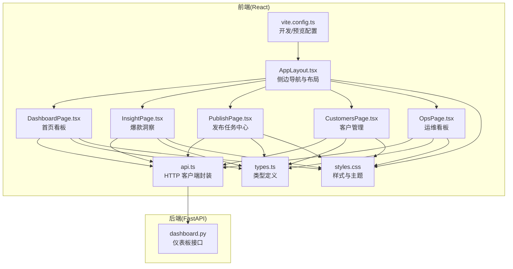
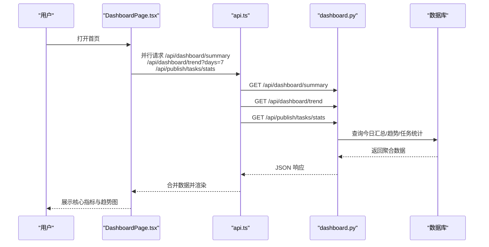
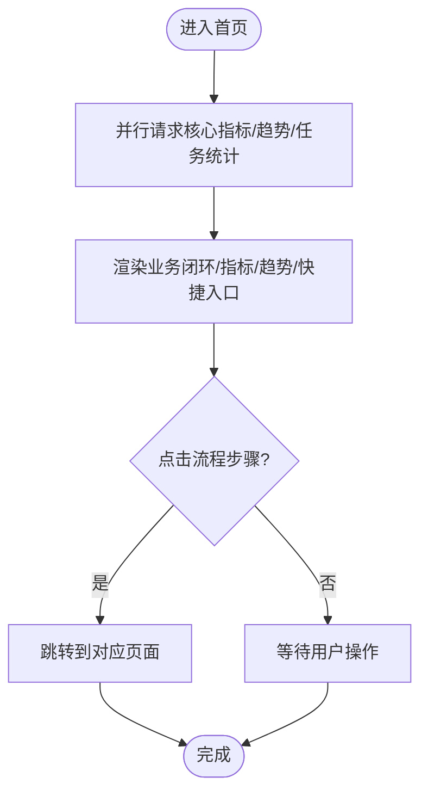
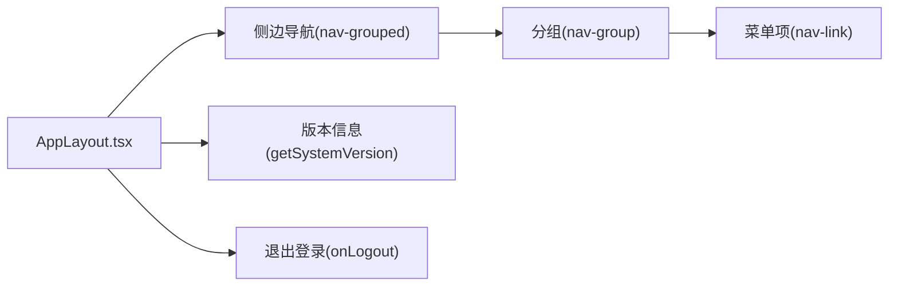
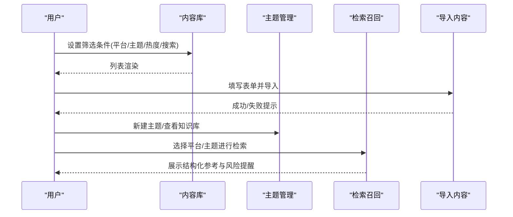
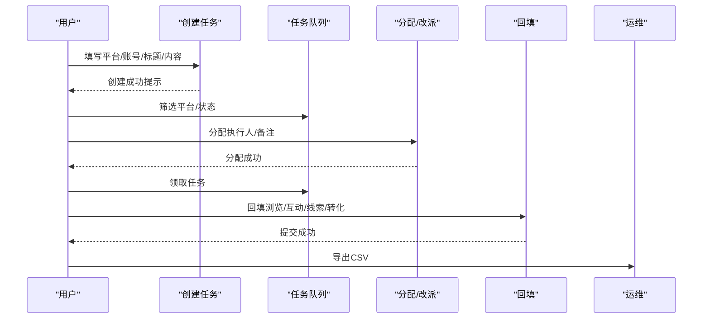
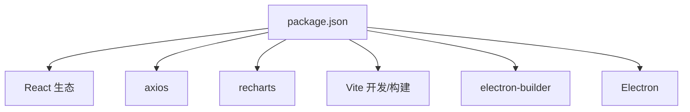

# 数据分析仪表板

<cite>
**本文引用的文件**   
- [DashboardPage.tsx](file://desktop/src/pages/dashboard/DashboardPage.tsx)
- [AppLayout.tsx](file://desktop/src/components/AppLayout.tsx)
- [types.ts](file://desktop/src/types.ts)
- [api.ts](file://desktop/src/lib/api.ts)
- [styles.css](file://desktop/src/styles.css)
- [vite.config.ts](file://desktop/vite.config.ts)
- [package.json](file://desktop/package.json)
- [dashboard.py](file://backend/app/api/endpoints/dashboard.py)
- [InsightPage.tsx](file://desktop/src/pages/InsightPage.tsx)
- [PublishPage.tsx](file://desktop/src/pages/PublishPage.tsx)
- [CustomersPage.tsx](file://desktop/src/pages/CustomersPage.tsx)
- [OpsPage.tsx](file://desktop/src/pages/OpsPage.tsx)
</cite>

## 目录
1. [简介](#简介)
2. [项目结构](#项目结构)
3. [核心组件](#核心组件)
4. [架构总览](#架构总览)
5. [详细组件分析](#详细组件分析)
6. [依赖分析](#依赖分析)
7. [性能考虑](#性能考虑)
8. [故障排查指南](#故障排查指南)
9. [结论](#结论)
10. [附录](#附录)

## 简介
本文件面向“智获客数据分析仪表板”的用户与开发者，系统性梳理前端仪表板的界面设计、布局结构、交互模式与数据驱动逻辑，并结合后端接口，给出图表实现、实时更新、缓存优化、自定义视图、指标筛选、钻取分析、响应式与主题、无障碍支持、数据导出与分享、个性化配置与团队协作、业务洞察与预警等完整方案。文档以代码为依据，辅以可视化图示，帮助非技术读者也能理解系统运作方式。

## 项目结构
前端采用 React + Vite 构建，使用 Recharts 进行图表渲染；后端基于 FastAPI 提供仪表板相关接口。项目通过 Electron 打包为桌面应用，同时支持 Web 预览。

**图表来源**
- [AppLayout.tsx:51-107](file://desktop/src/components/AppLayout.tsx#L51-L107)
- [DashboardPage.tsx:44-216](file://desktop/src/pages/dashboard/DashboardPage.tsx#L44-L216)
- [InsightPage.tsx:656-856](file://desktop/src/pages/InsightPage.tsx#L656-L856)
- [PublishPage.tsx:28-701](file://desktop/src/pages/PublishPage.tsx#L28-L701)
- [CustomersPage.tsx:6-157](file://desktop/src/pages/CustomersPage.tsx#L6-L157)
- [OpsPage.tsx:18-270](file://desktop/src/pages/OpsPage.tsx#L18-L270)
- [api.ts:1-604](file://desktop/src/lib/api.ts#L1-L604)
- [types.ts:1-329](file://desktop/src/types.ts#L1-L329)
- [styles.css:1-666](file://desktop/src/styles.css#L1-L666)
- [vite.config.ts:1-23](file://desktop/vite.config.ts#L1-L23)
- [dashboard.py:1-100](file://backend/app/api/endpoints/dashboard.py#L1-L100)

**章节来源**
- [AppLayout.tsx:1-108](file://desktop/src/components/AppLayout.tsx#L1-L108)
- [DashboardPage.tsx:1-217](file://desktop/src/pages/dashboard/DashboardPage.tsx#L1-L217)
- [api.ts:1-604](file://desktop/src/lib/api.ts#L1-L604)
- [types.ts:1-329](file://desktop/src/types.ts#L1-L329)
- [styles.css:1-666](file://desktop/src/styles.css#L1-L666)
- [vite.config.ts:1-23](file://desktop/vite.config.ts#L1-L23)
- [package.json:1-77](file://desktop/package.json#L1-L77)
- [dashboard.py:1-100](file://backend/app/api/endpoints/dashboard.py#L1-L100)

## 核心组件
- 仪表板首页(DashboardPage)
  - 加载核心指标、趋势图、快捷入口与业务闭环流程图
  - 使用 Promise.all 并行请求多个接口，提升首屏速度
  - 折线图展示最近7天线索趋势
- 应用布局(AppLayout)
  - 侧边导航分组、徽标提示、版本信息显示
  - 支持路由激活态样式
- 图表与数据模型(types)
  - 定义 DashboardSummary、TrendItem、PublishTaskStats 等类型
  - 为图表组件提供数据契约
- API 客户端(api)
  - 统一封装 axios，支持 Electron 本地运行时覆盖后端地址
  - 自动注入 Authorization 头，统一 401 处理
  - 提供 dashboard、insight、publish、customer、ops 等模块化接口
- 样式与主题(styles)
  - CSS 变量定义品牌色、背景与圆角
  - 响应式网格布局，移动端适配
  - 卡片、按钮、表格、状态点等通用组件样式
- 运维看板(OpsPage)
  - 系统健康状态、版本信息、AI 调用统计与每日明细
  - 每 30 秒自动刷新
- 发布任务中心(PublishPage)
  - 任务概览、创建、分配/改派、领取、回填、驳回、关闭、导出
  - 支持 CSV 导出
- 爆款洞察(InsightPage)
  - 内容库、主题管理、检索召回、导入内容
  - 支持筛选、搜索、AI 分析、删除
- 客户管理(CustomersPage)
  - 新增客户、列表展示、CSV 导出

**章节来源**
- [DashboardPage.tsx:44-216](file://desktop/src/pages/dashboard/DashboardPage.tsx#L44-L216)
- [AppLayout.tsx:51-107](file://desktop/src/components/AppLayout.tsx#L51-L107)
- [types.ts:1-329](file://desktop/src/types.ts#L1-L329)
- [api.ts:67-344](file://desktop/src/lib/api.ts#L67-L344)
- [styles.css:1-666](file://desktop/src/styles.css#L1-L666)
- [OpsPage.tsx:18-270](file://desktop/src/pages/OpsPage.tsx#L18-L270)
- [PublishPage.tsx:28-701](file://desktop/src/pages/PublishPage.tsx#L28-L701)
- [InsightPage.tsx:656-856](file://desktop/src/pages/InsightPage.tsx#L656-L856)
- [CustomersPage.tsx:6-157](file://desktop/src/pages/CustomersPage.tsx#L6-L157)

## 架构总览
前端通过 api.ts 统一调用后端 REST 接口，仪表板数据由后端 dashboard.py 提供。系统支持 Electron 本地运行与 Web 预览，开发服务器与预览端口在 vite.config.ts 中配置。

**图表来源**
- [DashboardPage.tsx:52-71](file://desktop/src/pages/dashboard/DashboardPage.tsx#L52-L71)
- [api.ts:67-75](file://desktop/src/lib/api.ts#L67-L75)
- [dashboard.py:11-46](file://backend/app/api/endpoints/dashboard.py#L11-L46)

**章节来源**
- [DashboardPage.tsx:52-71](file://desktop/src/pages/dashboard/DashboardPage.tsx#L52-L71)
- [api.ts:1-604](file://desktop/src/lib/api.ts#L1-L604)
- [dashboard.py:1-100](file://backend/app/api/endpoints/dashboard.py#L1-L100)
- [vite.config.ts:4-22](file://desktop/vite.config.ts#L4-L22)

## 详细组件分析

### 仪表板首页(DashboardPage)
- 设计理念
  - 以“业务闭环”为主线，串联采集、AI处理、发布、线索、客户五大环节
  - 顶部升级横幅突出系统能力迭代
  - 快捷入口直达关键业务路径
- 布局结构
  - 升级横幅、业务闭环流程图、核心指标卡片网格、快捷入口网格、趋势折线图
- 交互模式
  - 点击流程步骤跳转对应页面
  - 加载态与错误态提示
- 图表实现
  - 使用 Recharts 的 LineChart、XAxis、YAxis、Tooltip、ResponsiveContainer
  - 数据字段：date、total_leads、total_valid_leads
- 实时与刷新
  - 首屏一次性拉取所有数据，后续可通过页面内操作触发重新加载
- 缓存优化
  - 当前未实现前端缓存策略，建议对趋势与任务统计增加内存缓存与失效控制
- 自定义视图与筛选
  - 当前未提供视图保存与筛选持久化，可在趋势图与任务列表处扩展
- 钻取分析
  - 业务闭环各节点可点击跳转，形成链路钻取
- 响应式与主题
  - 采用 CSS Grid 与媒体查询，移动端自适应
  - 主题色通过 CSS 变量统一管理
- 无障碍支持
  - 使用语义化标签与可聚焦元素，建议补充键盘导航与屏幕阅读器友好属性
- 数据导出与分享
  - 仪表板本身未内置导出，可在任务中心与客户管理中复用导出能力
- 业务洞察与预警
  - 可在趋势图上叠加阈值线与告警标记，结合后端指标扩展

**图表来源**
- [DashboardPage.tsx:52-71](file://desktop/src/pages/dashboard/DashboardPage.tsx#L52-L71)
- [DashboardPage.tsx:90-139](file://desktop/src/pages/dashboard/DashboardPage.tsx#L90-L139)

**章节来源**
- [DashboardPage.tsx:44-216](file://desktop/src/pages/dashboard/DashboardPage.tsx#L44-L216)
- [types.ts:1-329](file://desktop/src/types.ts#L1-L329)
- [styles.css:413-468](file://desktop/src/styles.css#L413-L468)

### 应用布局(AppLayout)
- 导航分组清晰，支持徽标提示
- 版本信息通过 API 获取并展示
- 侧边栏支持滚动与响应式折叠

**图表来源**
- [AppLayout.tsx:51-107](file://desktop/src/components/AppLayout.tsx#L51-L107)
- [api.ts:471-474](file://desktop/src/lib/api.ts#L471-L474)

**章节来源**
- [AppLayout.tsx:51-107](file://desktop/src/components/AppLayout.tsx#L51-L107)
- [api.ts:471-474](file://desktop/src/lib/api.ts#L471-L474)

### 爆款洞察(InsightPage)
- 功能要点
  - 内容库：平台/主题/热度/关键词筛选与搜索
  - 主题管理：新建主题、查看主题知识库
  - 检索召回：按平台与主题检索上下文特征
  - 导入内容：手动导入并回填基础指标
- 图表与交互
  - 使用标签(Tag)、度量徽章(MetricBadge)、热力等级颜色区分
  - AI 分析与删除操作
- 数据模型
  - InsightItem、InsightTopic、Stats 等类型支撑页面渲染

**图表来源**
- [InsightPage.tsx:656-856](file://desktop/src/pages/InsightPage.tsx#L656-L856)
- [types.ts:14-72](file://desktop/src/types.ts#L14-L72)

**章节来源**
- [InsightPage.tsx:1-856](file://desktop/src/pages/InsightPage.tsx#L1-L856)
- [types.ts:14-72](file://desktop/src/types.ts#L14-L72)

### 发布任务中心(PublishPage)
- 功能要点
  - 任务概览：总任务、待发布、已提交、已关闭
  - 创建任务：选择平台、账号、标题、内容与可选改写内容ID
  - 任务队列：平台/状态筛选、分配/改派、领取、回填、驳回、关闭、查看链路、导出CSV
- 数据模型
  - PublishTask、PublishTaskStats、UserSummary

**图表来源**
- [PublishPage.tsx:28-701](file://desktop/src/pages/PublishPage.tsx#L28-L701)
- [types.ts:259-298](file://desktop/src/types.ts#L259-L298)

**章节来源**
- [PublishPage.tsx:28-701](file://desktop/src/pages/PublishPage.tsx#L28-L701)
- [types.ts:259-298](file://desktop/src/types.ts#L259-L298)

### 客户管理(CustomersPage)
- 功能要点
  - 新增客户：昵称、微信号、来源平台、意向等级、标签
  - 列表展示与 CSV 导出
- 链路跳转
  - 通过 URL 参数从线索跳转定位客户

**章节来源**
- [CustomersPage.tsx:6-157](file://desktop/src/pages/CustomersPage.tsx#L6-L157)

### 运维看板(OpsPage)
- 功能要点
  - 系统健康状态：整体状态、数据库、缓存、版本
  - AI 调用统计：总调用、失败次数、Token 消耗、平均延迟
  - 每日明细：失败率、延迟等
  - 每 30 秒自动刷新
- 数据模型
  - AICallStatsResponse

**章节来源**
- [OpsPage.tsx:18-270](file://desktop/src/pages/OpsPage.tsx#L18-L270)
- [types.ts:35-39](file://desktop/src/types.ts#L35-L39)

## 依赖分析
- 前端依赖
  - React、react-router-dom、recharts、axios
  - 开发依赖：@vitejs/plugin-react、electron、electron-builder、vitest 等
- 构建与打包
  - Vite 开发服务器与预览端口配置
  - Electron 打包，包含后端二进制资源

**图表来源**
- [package.json:21-77](file://desktop/package.json#L21-L77)
- [vite.config.ts:1-23](file://desktop/vite.config.ts#L1-L23)

**章节来源**
- [package.json:1-77](file://desktop/package.json#L1-L77)
- [vite.config.ts:1-23](file://desktop/vite.config.ts#L1-L23)

## 性能考虑
- 首屏加载
  - Dashboard 首屏使用 Promise.all 并行请求，减少总等待时间
- 图表渲染
  - Recharts 在大数据集时建议分页或采样，避免 DOM 过载
- 缓存策略
  - 对趋势与任务统计增加内存缓存与失效控制，减少重复请求
- 网络层
  - axios 统一拦截器处理 401，避免重复鉴权请求
- 打包优化
  - 使用 Vite 默认优化与 Tree Shaking；生产环境启用压缩

[本节为通用指导，无需特定文件引用]

## 故障排查指南
- 登录态异常
  - 401 自动清除 Token，需重新登录
- 看板数据加载失败
  - Dashboard 首屏错误提示，检查后端接口可用性
- 运维看板刷新失败
  - OpsPage 统一错误提示与手动刷新按钮
- 任务导出失败
  - PublishPage 导出 CSV 异常提示，确认后端接口返回 Blob

**章节来源**
- [api.ts:30-38](file://desktop/src/lib/api.ts#L30-L38)
- [DashboardPage.tsx:145-149](file://desktop/src/pages/dashboard/DashboardPage.tsx#L145-L149)
- [OpsPage.tsx:37-42](file://desktop/src/pages/OpsPage.tsx#L37-L42)
- [PublishPage.tsx:277-294](file://desktop/src/pages/PublishPage.tsx#L277-L294)

## 结论
该仪表板以“业务闭环”为核心设计理念，通过清晰的布局与交互，将采集、AI、发布、线索与客户管理串联起来。前端采用 React + Recharts，后端提供稳定 REST 接口，具备良好的可扩展性。建议后续在缓存、筛选持久化、自定义视图、导出与分享、主题切换与无障碍方面持续增强，以满足更复杂的业务需求与用户体验。

[本节为总结性内容，无需特定文件引用]

## 附录

### 数据模型与图表字段对照
- DashboardSummary
  - 今日新增客户、今日加微数、今日线索数、今日有效线索、今日转化、待跟进数量、待审核数量
- TrendItem
  - 日期、发布数、总浏览、总私信、总加微、总线索、总有效线索、总转化
- PublishTaskStats
  - 总数、待发布、已领取、已提交、已驳回、已关闭

**章节来源**
- [types.ts:1-329](file://desktop/src/types.ts#L1-L329)

### 后端接口一览
- 仪表板
  - GET /api/dashboard/summary
  - GET /api/dashboard/trend
  - GET /api/dashboard/platform
  - GET /api/dashboard/topics
  - GET /api/dashboard/high-quality-content
  - GET /api/dashboard/ai-call-stats
- 其他模块
  - 发布任务、客户、洞察、系统健康等接口详见 api.ts 中对应函数注释

**章节来源**
- [dashboard.py:1-100](file://backend/app/api/endpoints/dashboard.py#L1-L100)
- [api.ts:67-604](file://desktop/src/lib/api.ts#L67-L604)