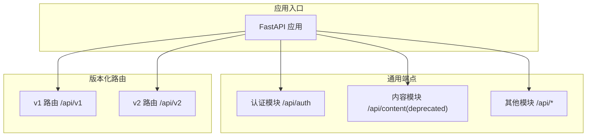
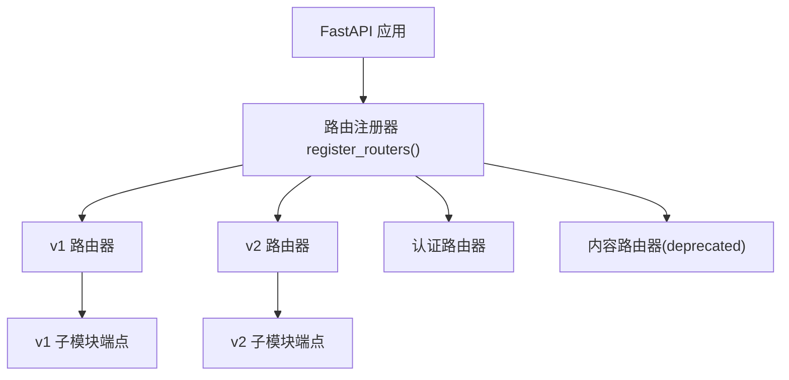
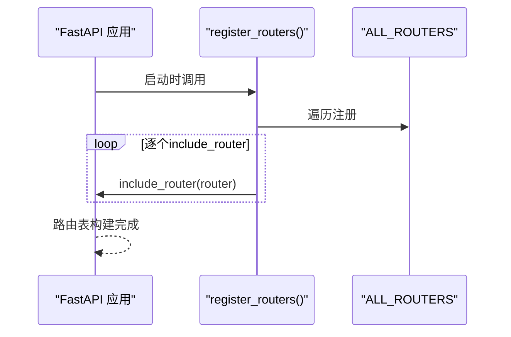
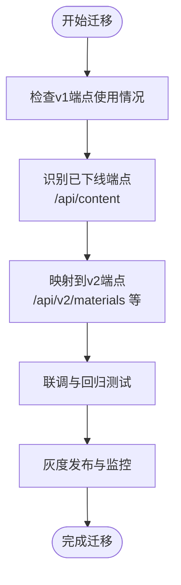
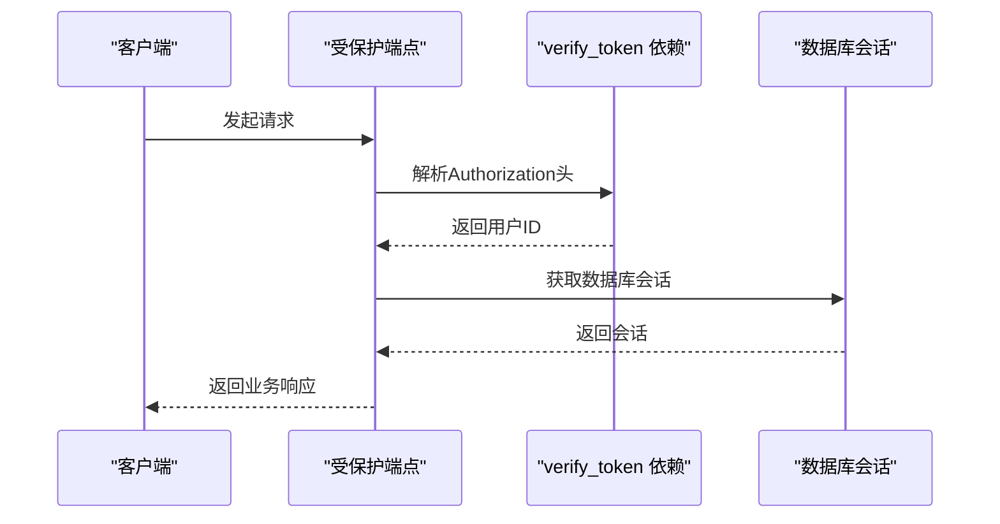
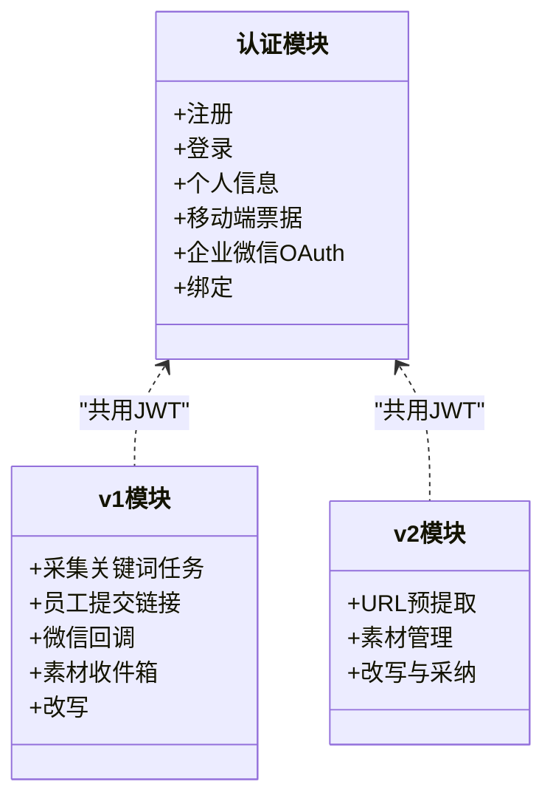
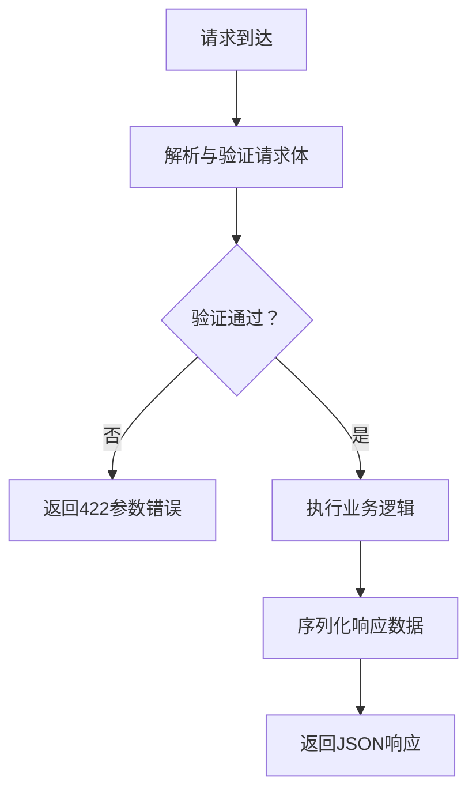
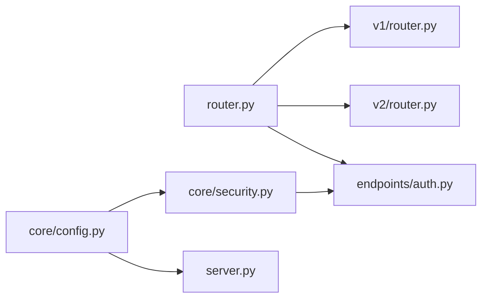

# API路由系统

<cite>
**本文引用的文件**
- [backend/app/api/router.py](file://backend/app/api/router.py)
- [backend/app/api/v1/router.py](file://backend/app/api/v1/router.py)
- [backend/app/api/v2/router.py](file://backend/app/api/v2/router.py)
- [backend/app/api/endpoints/auth.py](file://backend/app/api/endpoints/auth.py)
- [backend/app/api/endpoints/content.py](file://backend/app/api/endpoints/content.py)
- [backend/app/api/v1/endpoints/collect.py](file://backend/app/api/v1/endpoints/collect.py)
- [backend/app/api/v2/endpoints/collect.py](file://backend/app/api/v2/endpoints/collect.py)
- [backend/app/api/v2/endpoints/materials.py](file://backend/app/api/v2/endpoints/materials.py)
- [backend/app/api/v1/endpoints/submissions.py](file://backend/app/api/v1/endpoints/submissions.py)
- [backend/app/api/v1/endpoints/inbox.py](file://backend/app/api/v1/endpoints/inbox.py)
- [backend/app/api/v1/endpoints/copy.py](file://backend/app/api/v1/endpoints/copy.py)
- [backend/app/core/security.py](file://backend/app/core/security.py)
- [backend/app/core/config.py](file://backend/app/core/config.py)
- [backend/server.py](file://backend/server.py)
</cite>

## 目录
1. [简介](#简介)
2. [项目结构](#项目结构)
3. [核心组件](#核心组件)
4. [架构总览](#架构总览)
5. [详细组件分析](#详细组件分析)
6. [依赖分析](#依赖分析)
7. [性能考虑](#性能考虑)
8. [故障排查指南](#故障排查指南)
9. [结论](#结论)
10. [附录](#附录)

## 简介
本文件为“智获客”API路由系统的全面技术文档，聚焦于路由注册机制、URL模式设计原则、版本化路由策略（v1与v2）、路由中间件与执行顺序、端点组织结构（认证、内容、管理等模块）、路由参数验证与请求体序列化、响应格式化机制、性能优化与缓存策略、错误处理模式，以及路由调试与监控指标建议。文档旨在帮助开发者与运维人员快速理解并高效维护API路由体系。

## 项目结构
后端采用FastAPI框架，路由层位于app/api目录，分为通用端点与版本化子路由两部分：
- 通用端点：认证、内容、合规、客户、线索、发布、仪表盘、洞察、系统、企业微信等模块，挂载在根路由上。
- 版本化路由：v1与v2分别提供独立前缀与标签，内部再细分子模块端点。

图表来源
- [backend/app/api/router.py:1-35](file://backend/app/api/router.py#L1-L35)
- [backend/app/api/v1/router.py:1-22](file://backend/app/api/v1/router.py#L1-L22)
- [backend/app/api/v2/router.py:1-15](file://backend/app/api/v2/router.py#L1-L15)

章节来源
- [backend/app/api/router.py:1-35](file://backend/app/api/router.py#L1-L35)
- [backend/app/api/v1/router.py:1-22](file://backend/app/api/v1/router.py#L1-L22)
- [backend/app/api/v2/router.py:1-15](file://backend/app/api/v2/router.py#L1-L15)

## 核心组件
- 路由注册器：集中注册所有端点与版本化路由，确保启动时一次性加载。
- 版本化路由：v1与v2各自定义前缀与标签，并包含子模块端点。
- 安全中间件：通过依赖注入实现JWT校验，贯穿所有受保护端点。
- 配置中心：集中管理密钥、CORS、速率限制、AI模型等运行参数。

章节来源
- [backend/app/api/router.py:32-35](file://backend/app/api/router.py#L32-L35)
- [backend/app/api/v1/router.py:9-16](file://backend/app/api/v1/router.py#L9-L16)
- [backend/app/api/v2/router.py:6-9](file://backend/app/api/v2/router.py#L6-L9)
- [backend/app/core/security.py:42-57](file://backend/app/core/security.py#L42-L57)
- [backend/app/core/config.py:15-103](file://backend/app/core/config.py#L15-L103)

## 架构总览
路由系统采用“主路由聚合 + 版本化子路由 + 端点模块”的分层设计。主路由负责全局注册，版本化路由负责版本隔离与命名空间，端点模块负责具体业务逻辑与数据模型。

图表来源
- [backend/app/api/router.py:32-35](file://backend/app/api/router.py#L32-L35)
- [backend/app/api/v1/router.py:11-16](file://backend/app/api/v1/router.py#L11-L16)
- [backend/app/api/v2/router.py:8-9](file://backend/app/api/v2/router.py#L8-L9)

## 详细组件分析

### 路由注册机制与URL模式设计
- 注册流程：通过register_routers遍历ALL_ROUTERS并逐个include_router，保证统一注册与顺序可控。
- URL前缀与标签：v1与v2分别以/api/v1与/api/v2作为前缀，并设置对应标签，便于OpenAPI文档与版本追踪。
- 通用端点：如/auth、/content等，采用模块化前缀与标签，清晰区分业务域。

图表来源
- [backend/app/api/router.py:32-35](file://backend/app/api/router.py#L32-L35)

章节来源
- [backend/app/api/router.py:16-29](file://backend/app/api/router.py#L16-L29)
- [backend/app/api/v1/router.py:9-16](file://backend/app/api/v1/router.py#L9-L16)
- [backend/app/api/v2/router.py:6-9](file://backend/app/api/v2/router.py#L6-L9)

### 版本化路由策略：v1与v2差异与迁移路径
- v1路由：包含采集、素材收件箱、提交、复制文案等模块，强调传统采集与人工处理流程。
- v2路由：聚焦新版素材管理与改写能力，提供更丰富的查询、更新、采纳与生成接口。
- 迁移路径：
  - 内容模块：/api/content已下线，迁移至/api/v2/materials、/api/v1/material/inbox/manual、/api/v1/collector/tasks/keyword。
  - 采集入口：/api/v2/collect提供URL预提取与日志统计，旧采集直写接口已停用。
  - 改写与生成：/api/v2/materials提供统一的素材查询、更新、改写与采纳流程。

图表来源
- [backend/app/api/endpoints/content.py:5-18](file://backend/app/api/endpoints/content.py#L5-L18)
- [backend/app/api/v2/endpoints/materials.py:151-196](file://backend/app/api/v2/endpoints/materials.py#L151-L196)
- [backend/app/api/v2/endpoints/collect.py:172-197](file://backend/app/api/v2/endpoints/collect.py#L172-L197)
- [backend/app/api/v1/endpoints/inbox.py:40-70](file://backend/app/api/v1/endpoints/inbox.py#L40-L70)
- [backend/app/api/v1/endpoints/collect.py:18-33](file://backend/app/api/v1/endpoints/collect.py#L18-L33)

章节来源
- [backend/app/api/endpoints/content.py:1-19](file://backend/app/api/endpoints/content.py#L1-L19)
- [backend/app/api/v2/endpoints/materials.py:1-386](file://backend/app/api/v2/endpoints/materials.py#L1-L386)
- [backend/app/api/v2/endpoints/collect.py:1-302](file://backend/app/api/v2/endpoints/collect.py#L1-L302)
- [backend/app/api/v1/endpoints/inbox.py:1-165](file://backend/app/api/v1/endpoints/inbox.py#L1-L165)
- [backend/app/api/v1/endpoints/collect.py:1-34](file://backend/app/api/v1/endpoints/collect.py#L1-L34)

### 路由中间件与执行顺序
- 认证中间件：通过依赖注入verify_token实现JWT校验，所有受保护端点均依赖该依赖。
- 执行顺序：FastAPI依赖解析遵循函数签名顺序，verify_token在前，数据库会话在后，确保鉴权优先。
- 企业微信OAuth：在认证模块中提供独立回调与绑定接口，不依赖常规JWT流程。

图表来源
- [backend/app/core/security.py:42-57](file://backend/app/core/security.py#L42-L57)
- [backend/app/api/endpoints/auth.py:114-118](file://backend/app/api/endpoints/auth.py#L114-L118)
- [backend/app/api/v1/endpoints/collect.py:21-22](file://backend/app/api/v1/endpoints/collect.py#L21-L22)

章节来源
- [backend/app/core/security.py:1-57](file://backend/app/core/security.py#L1-L57)
- [backend/app/api/endpoints/auth.py:1-280](file://backend/app/api/endpoints/auth.py#L1-L280)

### 端点组织结构：认证、内容、管理等模块
- 认证模块：提供注册、登录、个人信息、移动端票据签发与兑换、企业微信OAuth配置与回调、绑定等功能。
- 内容模块：v1的旧内容接口已下线，提示迁移至v2与v1相应端点。
- v1模块：采集关键词任务、员工提交链接、微信机器人回调、素材收件箱、改写等。
- v2模块：采集URL预提取、素材列表/详情/更新/删除、分析与改写、采纳生成结果等。

图表来源
- [backend/app/api/endpoints/auth.py:27-280](file://backend/app/api/endpoints/auth.py#L27-L280)
- [backend/app/api/v1/endpoints/collect.py:9-34](file://backend/app/api/v1/endpoints/collect.py#L9-L34)
- [backend/app/api/v1/endpoints/submissions.py:11-88](file://backend/app/api/v1/endpoints/submissions.py#L11-L88)
- [backend/app/api/v1/endpoints/inbox.py:13-165](file://backend/app/api/v1/endpoints/inbox.py#L13-L165)
- [backend/app/api/v2/endpoints/collect.py:154-302](file://backend/app/api/v2/endpoints/collect.py#L154-L302)
- [backend/app/api/v2/endpoints/materials.py:52-386](file://backend/app/api/v2/endpoints/materials.py#L52-L386)

章节来源
- [backend/app/api/endpoints/auth.py:1-280](file://backend/app/api/endpoints/auth.py#L1-L280)
- [backend/app/api/endpoints/content.py:1-19](file://backend/app/api/endpoints/content.py#L1-L19)
- [backend/app/api/v1/endpoints/collect.py:1-34](file://backend/app/api/v1/endpoints/collect.py#L1-L34)
- [backend/app/api/v1/endpoints/submissions.py:1-88](file://backend/app/api/v1/endpoints/submissions.py#L1-L88)
- [backend/app/api/v1/endpoints/inbox.py:1-165](file://backend/app/api/v1/endpoints/inbox.py#L1-L165)
- [backend/app/api/v2/endpoints/collect.py:1-302](file://backend/app/api/v2/endpoints/collect.py#L1-L302)
- [backend/app/api/v2/endpoints/materials.py:1-386](file://backend/app/api/v2/endpoints/materials.py#L1-L386)

### 路由参数验证、请求体序列化与响应格式化
- 参数验证：广泛使用Pydantic模型进行字段长度、类型与范围约束，如v1采集关键词任务的平台与关键字长度、最大数量限制。
- 请求体序列化：v2采集与素材管理端点定义了丰富的输入模型，涵盖块文本、评论、快照、爬虫数据等复杂结构。
- 响应格式化：统一返回字典结构，包含业务数据与状态信息；v2物料详情包含知识库与生成任务的嵌套结构。

图表来源
- [backend/app/api/v1/endpoints/collect.py:12-16](file://backend/app/api/v1/endpoints/collect.py#L12-L16)
- [backend/app/api/v2/endpoints/collect.py:39-56](file://backend/app/api/v2/endpoints/collect.py#L39-L56)
- [backend/app/api/v2/endpoints/materials.py:17-45](file://backend/app/api/v2/endpoints/materials.py#L17-L45)

章节来源
- [backend/app/api/v1/endpoints/collect.py:1-34](file://backend/app/api/v1/endpoints/collect.py#L1-L34)
- [backend/app/api/v2/endpoints/collect.py:1-302](file://backend/app/api/v2/endpoints/collect.py#L1-L302)
- [backend/app/api/v2/endpoints/materials.py:1-386](file://backend/app/api/v2/endpoints/materials.py#L1-L386)

### 错误处理模式
- 统一异常：对第三方服务调用失败返回502，对资源不存在返回404，对状态冲突返回409，对无效令牌返回401。
- 下线与停用：对已下线或停用接口返回410，并给出替代方案与迁移指引。
- 企业微信OAuth：对未配置或无效code返回503/401，确保前端可正确降级。

章节来源
- [backend/app/api/v1/endpoints/collect.py:32-33](file://backend/app/api/v1/endpoints/collect.py#L32-L33)
- [backend/app/api/v2/endpoints/collect.py:209-212](file://backend/app/api/v2/endpoints/collect.py#L209-L212)
- [backend/app/api/v2/endpoints/collect.py:224-242](file://backend/app/api/v2/endpoints/collect.py#L224-L242)
- [backend/app/api/endpoints/content.py:16-18](file://backend/app/api/endpoints/content.py#L16-L18)
- [backend/app/api/endpoints/auth.py:209-213](file://backend/app/api/endpoints/auth.py#L209-L213)

## 依赖分析
- 路由注册：router.py集中引入各模块与版本化路由，避免分散注册带来的遗漏。
- 安全依赖：security.py提供JWT编解码与密码哈希，verify_token作为全局依赖被广泛使用。
- 配置依赖：config.py集中管理密钥、CORS、速率限制、AI模型等，确保运行时一致性。

图表来源
- [backend/app/api/router.py:1-35](file://backend/app/api/router.py#L1-L35)
- [backend/app/api/v1/router.py:1-22](file://backend/app/api/v1/router.py#L1-L22)
- [backend/app/api/v2/router.py:1-15](file://backend/app/api/v2/router.py#L1-L15)
- [backend/app/core/security.py:1-57](file://backend/app/core/security.py#L1-L57)
- [backend/app/core/config.py:1-103](file://backend/app/core/config.py#L1-L103)
- [backend/server.py:1-30](file://backend/server.py#L1-L30)

章节来源
- [backend/app/api/router.py:1-35](file://backend/app/api/router.py#L1-L35)
- [backend/app/core/security.py:1-57](file://backend/app/core/security.py#L1-L57)
- [backend/app/core/config.py:1-103](file://backend/app/core/config.py#L1-L103)
- [backend/server.py:1-30](file://backend/server.py#L1-L30)

## 性能考虑
- 路由注册：一次性include_router，避免重复扫描与动态拼接带来的开销。
- 缓存策略：企业微信access_token采用本地内存缓存，降低外部调用频率与延迟。
- 数据库查询：v2物料列表与统计接口使用分页与聚合查询，控制单次响应规模。
- 速率限制：通过Redis分布式限流与配置项控制，避免热点端点过载。
- 日志与监控：建议结合中间件记录请求耗时、状态码分布与错误率，配合指标系统进行告警。

章节来源
- [backend/app/api/endpoints/auth.py:44-73](file://backend/app/api/endpoints/auth.py#L44-L73)
- [backend/app/api/v2/endpoints/materials.py:151-177](file://backend/app/api/v2/endpoints/materials.py#L151-L177)
- [backend/app/api/v2/endpoints/materials.py:267-297](file://backend/app/api/v2/endpoints/materials.py#L267-L297)
- [backend/app/core/config.py:86-90](file://backend/app/core/config.py#L86-L90)

## 故障排查指南
- 认证失败：检查Authorization头格式与JWT签名算法，确认密钥配置正确且未使用默认占位值。
- CORS跨域：生产环境禁止使用通配符，核对CORS_ORIGINS配置。
- 企业微信OAuth：确认corp_id/agent_id/agent_secret配置完整，回调地址与前端跳转一致。
- 接口下线：根据410响应中的替代路径迁移至v2或v1对应端点。
- 采集失败：检查浏览器采集服务地址与超时配置，关注网络连通性与第三方平台限制。

章节来源
- [backend/app/core/security.py:42-57](file://backend/app/core/security.py#L42-L57)
- [backend/app/core/config.py:55-69](file://backend/app/core/config.py#L55-L69)
- [backend/app/api/endpoints/auth.py:185-254](file://backend/app/api/endpoints/auth.py#L185-L254)
- [backend/app/api/endpoints/content.py:16-18](file://backend/app/api/endpoints/content.py#L16-L18)
- [backend/app/core/config.py:98-100](file://backend/app/core/config.py#L98-L100)

## 结论
本路由系统通过清晰的版本化设计与模块化组织，实现了从v1到v2的平滑演进。统一的认证中间件与严格的参数验证保障了安全性与稳定性。建议在生产环境中强化监控与告警，持续优化缓存与限流策略，确保高并发下的稳定表现。

## 附录
- 启动与部署：通过server.py启动Uvicorn服务，默认监听HOST与PORT环境变量，打包模式禁用reload。
- 配置要点：务必替换默认密钥，生产环境严格配置CORS白名单，合理设置Redis限流参数。

章节来源
- [backend/server.py:18-29](file://backend/server.py#L18-L29)
- [backend/app/core/config.py:55-69](file://backend/app/core/config.py#L55-L69)
- [backend/app/core/config.py:86-90](file://backend/app/core/config.py#L86-L90)