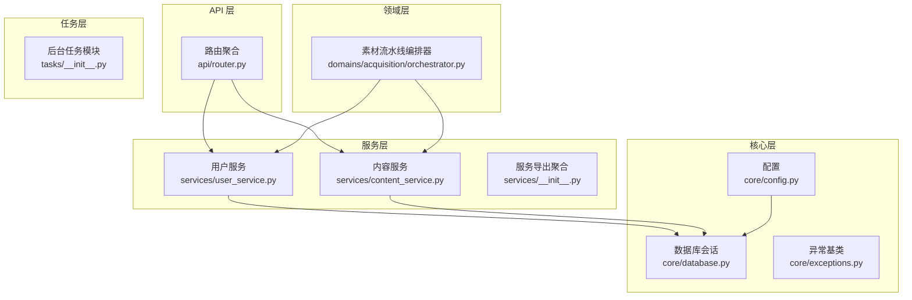
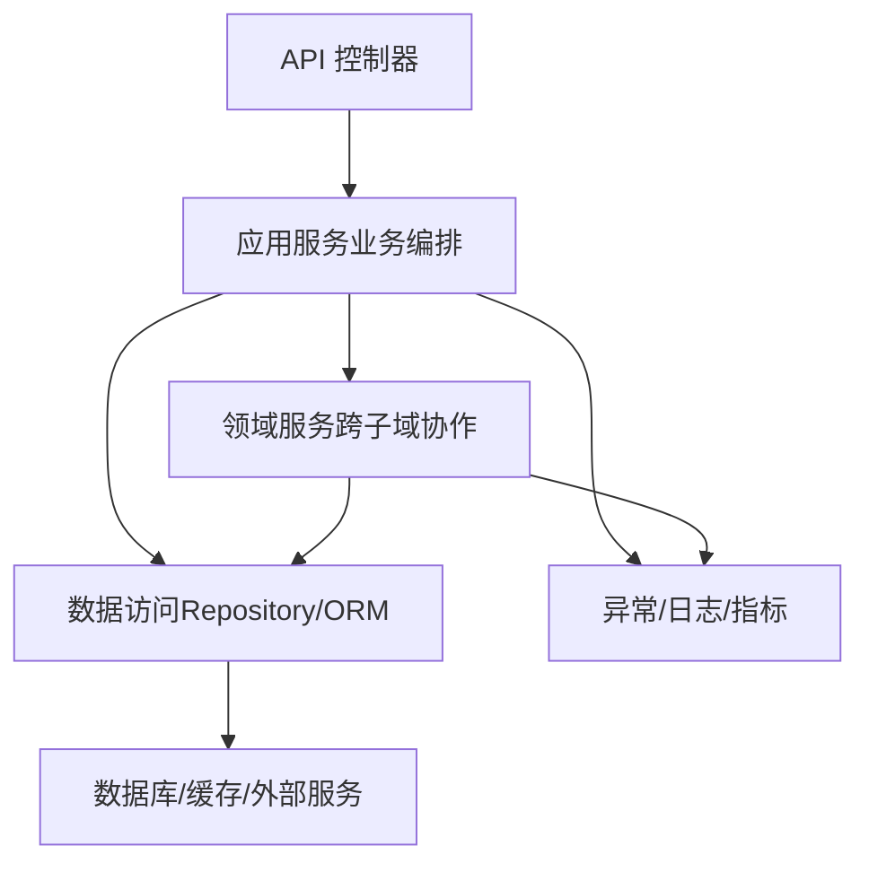
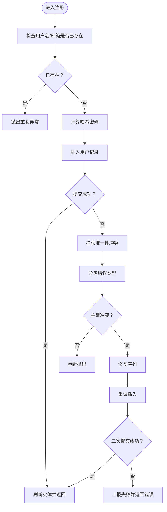
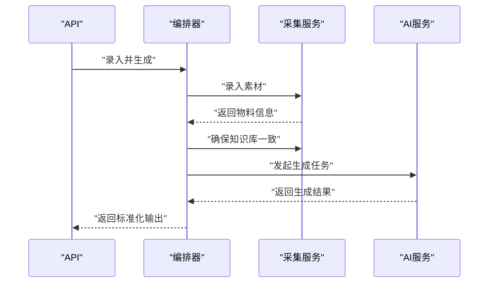
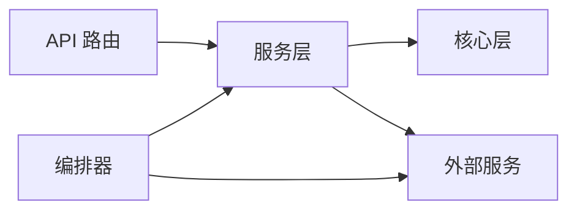
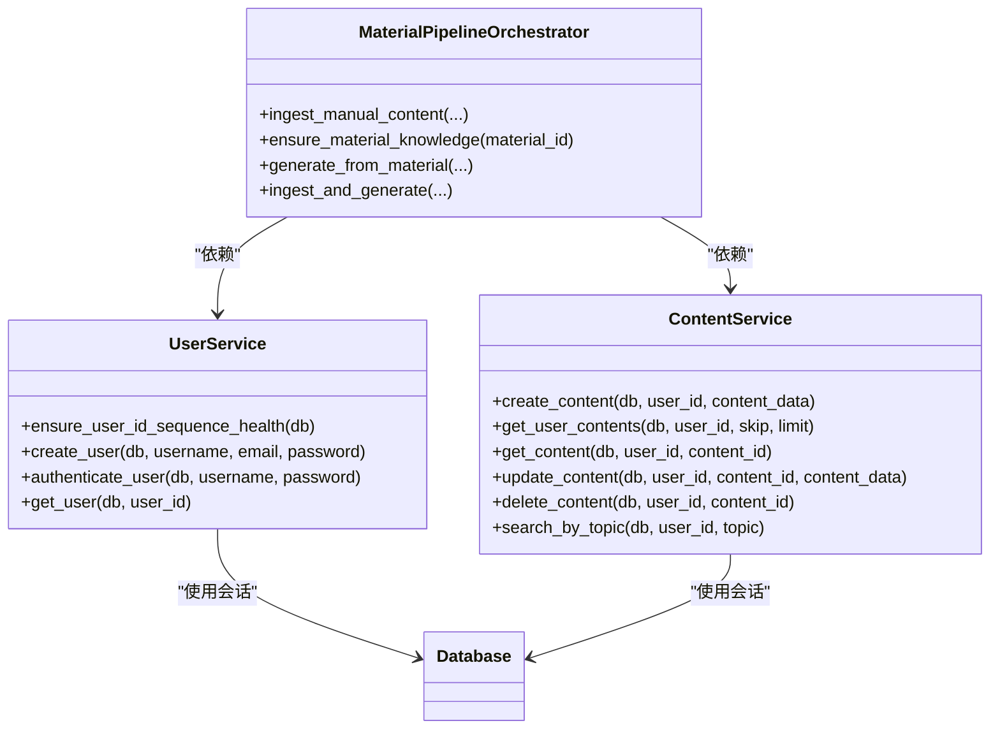

# 业务逻辑层

<cite>
**本文引用的文件**
- [backend/app/main.py](file://backend/app/main.py)
- [backend/app/__init__.py](file://backend/app/__init__.py)
- [backend/app/api/router.py](file://backend/app/api/router.py)
- [backend/app/core/config.py](file://backend/app/core/config.py)
- [backend/app/core/database.py](file://backend/app/core/database.py)
- [backend/app/core/exceptions.py](file://backend/app/core/exceptions.py)
- [backend/app/services/__init__.py](file://backend/app/services/__init__.py)
- [backend/app/services/user_service.py](file://backend/app/services/user_service.py)
- [backend/app/services/content_service.py](file://backend/app/services/content_service.py)
- [backend/app/domains/acquisition/orchestrator.py](file://backend/app/domains/acquisition/orchestrator.py)
- [backend/app/tasks/__init__.py](file://backend/app/tasks/__init__.py)
</cite>

## 目录
1. [引言](#引言)
2. [项目结构](#项目结构)
3. [核心组件](#核心组件)
4. [架构总览](#架构总览)
5. [详细组件分析](#详细组件分析)
6. [依赖分析](#依赖分析)
7. [性能考虑](#性能考虑)
8. [故障排查指南](#故障排查指南)
9. [结论](#结论)
10. [附录](#附录)

## 引言
本文件面向“智获客”业务逻辑层，系统性梳理服务层设计模式与职责划分，覆盖领域服务、应用服务与基础设施服务；阐明采集与素材生成的编排与状态管理；解释依赖注入与接口抽象原则；给出事务管理、并发控制与异常处理机制；并提供测试策略与性能监控建议，以及微服务化与模块解耦的最佳实践。

## 项目结构
后端采用分层与按域组织相结合的方式：API 路由层负责请求入口与版本路由聚合；核心层提供配置、数据库会话、异常与指标等基础设施；服务层封装业务能力；领域层以编排器为核心协调多服务；任务层承载后台作业。

图示来源
- [backend/app/api/router.py:1-35](file://backend/app/api/router.py#L1-L35)
- [backend/app/core/config.py:1-103](file://backend/app/core/config.py#L1-L103)
- [backend/app/core/database.py:1-29](file://backend/app/core/database.py#L1-L29)
- [backend/app/services/user_service.py:1-177](file://backend/app/services/user_service.py#L1-L177)
- [backend/app/services/content_service.py:1-79](file://backend/app/services/content_service.py#L1-L79)
- [backend/app/services/__init__.py:1-19](file://backend/app/services/__init__.py#L1-L19)
- [backend/app/domains/acquisition/orchestrator.py:1-174](file://backend/app/domains/acquisition/orchestrator.py#L1-L174)
- [backend/app/tasks/__init__.py:1-2](file://backend/app/tasks/__init__.py#L1-L2)

章节来源
- [backend/app/api/router.py:1-35](file://backend/app/api/router.py#L1-L35)
- [backend/app/core/config.py:1-103](file://backend/app/core/config.py#L1-L103)
- [backend/app/core/database.py:1-29](file://backend/app/core/database.py#L1-L29)
- [backend/app/services/__init__.py:1-19](file://backend/app/services/__init__.py#L1-L19)

## 核心组件
- 配置与环境
  - 使用 Pydantic Settings 管理数据库、JWT、CORS、AI 模型、火山引擎、Redis 限流、上传大小与浏览器采集器等配置项，并内置安全校验与生产限制。
- 数据库与会话
  - 基于 SQLAlchemy 创建连接池、会话工厂与模型基类，提供 get_db 依赖注入函数，支持自动 ping 与溢出控制。
- 异常体系
  - 定义应用层异常基类与领域校验异常，便于上层统一捕获与转换。
- 服务导出
  - 统一导出核心业务服务，便于 API 层按需注入与调用。

章节来源
- [backend/app/core/config.py:1-103](file://backend/app/core/config.py#L1-L103)
- [backend/app/core/database.py:1-29](file://backend/app/core/database.py#L1-L29)
- [backend/app/core/exceptions.py:1-7](file://backend/app/core/exceptions.py#L1-L7)
- [backend/app/services/__init__.py:1-19](file://backend/app/services/__init__.py#L1-L19)

## 架构总览
服务层遵循“应用服务编排 + 领域服务协作”的模式：
- 应用服务（API 层）接收请求，进行参数校验与鉴权，随后调用服务层。
- 服务层封装业务规则与数据访问，提供幂等、可重试与可观测的能力。
- 领域服务（如编排器）组合多个服务与外部集成点，形成端到端的业务流程。
- 基础设施服务（数据库、缓存、限流、日志、指标）通过依赖注入贯穿各层。

## 详细组件分析

### 用户服务（UserService）
- 职责
  - 用户注册、认证、查询；启动时修复序列；对唯一性冲突进行分类与恢复。
- 关键点
  - 注册阶段捕获唯一性约束冲突，尝试修复序列后重试；失败则上报并返回错误。
  - 认证基于哈希密码验证；查询不存在时抛出未找到异常。
- 事务与并发
  - 单次操作在独立事务中提交或回滚；序列修复与重试为幂等保障。
- 异常与可观测
  - 对序列修复过程计数与日志记录，便于运维观测。

图示来源
- [backend/app/services/user_service.py:61-152](file://backend/app/services/user_service.py#L61-L152)

章节来源
- [backend/app/services/user_service.py:1-177](file://backend/app/services/user_service.py#L1-L177)

### 内容服务（ContentService）
- 职责
  - 内容资产的创建、查询、更新、删除与主题检索。
- 关键点
  - 所有读写均基于当前用户所有权过滤，确保数据隔离。
  - 更新采用部分字段更新策略，避免覆盖未变更字段。
- 事务与并发
  - 单条记录操作在独立事务内完成，保证一致性。
- 异常与可观测
  - 未找到资源时抛出未找到异常，便于 API 层统一处理。

章节来源
- [backend/app/services/content_service.py:1-79](file://backend/app/services/content_service.py#L1-L79)

### 素材流水线编排器（MaterialPipelineOrchestrator）
- 职责
  - 提供从“采集/录入 → 清洗 → 知识库 → 检索 → 生成”的单一入口，协调 AI 与采集服务。
- 关键点
  - 支持手动录入与直接生成；自检知识库一致性并触发重建；根据素材推断账号类型与受众。
  - 生成阶段异步调用采集服务的生成流程，返回标准化结果。
- 事务与并发
  - 编排器本身不直接开启长事务；各步骤在各自服务内管理事务。
- 异常与可观测
  - 对缺失素材与不一致情况抛出明确错误；生成结果包含物料与任务标识，便于追踪。

图示来源
- [backend/app/domains/acquisition/orchestrator.py:24-173](file://backend/app/domains/acquisition/orchestrator.py#L24-L173)

章节来源
- [backend/app/domains/acquisition/orchestrator.py:1-174](file://backend/app/domains/acquisition/orchestrator.py#L1-L174)

### API 路由与版本聚合
- 职责
  - 将认证、内容、合规、客户、线索、发布、仪表盘、洞察、系统、企业微信等路由注册到应用实例，并聚合 v1/v2 版本路由。
- 关键点
  - 统一注册入口，便于扩展新模块与版本。

章节来源
- [backend/app/api/router.py:1-35](file://backend/app/api/router.py#L1-L35)

### 依赖注入与接口抽象
- 依赖注入
  - 数据库会话通过 get_db 提供；服务构造函数注入 Session 与可选的 AI 服务实例，便于测试替换。
- 接口抽象
  - 服务层以方法为接口边界，避免直接暴露 ORM 细节；编排器通过服务契约组合能力，降低耦合。

章节来源
- [backend/app/core/database.py:22-28](file://backend/app/core/database.py#L22-L28)
- [backend/app/domains/acquisition/orchestrator.py:14-22](file://backend/app/domains/acquisition/orchestrator.py#L14-L22)

## 依赖分析
- 组件耦合
  - API 层仅依赖服务层；服务层依赖核心层（配置、数据库、异常）；编排器依赖服务层与采集/AI 服务。
- 外部依赖
  - 数据库（PostgreSQL）、缓存（Redis）、外部模型服务（火山引擎/本地 Ollama）。
- 循环依赖
  - 当前结构未见循环导入；服务间通过编排器间接协作。

图示来源
- [backend/app/api/router.py:32-35](file://backend/app/api/router.py#L32-L35)
- [backend/app/services/user_service.py:1-177](file://backend/app/services/user_service.py#L1-L177)
- [backend/app/services/content_service.py:1-79](file://backend/app/services/content_service.py#L1-L79)
- [backend/app/domains/acquisition/orchestrator.py:1-174](file://backend/app/domains/acquisition/orchestrator.py#L1-L174)
- [backend/app/core/config.py:76-100](file://backend/app/core/config.py#L76-L100)

## 性能考虑
- 连接池与会话
  - 合理设置连接池大小与溢出，避免高并发下的连接争用；启用 pre_ping 保障连接可用性。
- 事务范围
  - 将短事务用于高频写入路径；批量写入合并提交，减少锁竞争。
- 并发控制
  - 使用分布式限流（Redis）与速率限制配置，防止外部服务过载。
- 查询优化
  - 对高频查询添加索引与分页；避免 N+1 查询；必要时引入只读副本。
- 异步与后台任务
  - 将耗时任务下沉至后台队列（参考 tasks 目录），缩短请求延迟。
- 观测与告警
  - 为关键路径埋点指标与日志，结合慢查询与错误率监控，持续优化。

## 故障排查指南
- 用户注册失败
  - 若出现唯一性冲突，优先检查序列修复流程与重试逻辑；确认数据库约束与日志计数。
- 素材生成异常
  - 检查知识库一致性校验与重建流程；核对生成任务返回与引用信息。
- 数据库连接问题
  - 查看连接池配置与 pre_ping 设置；确认主机、端口与凭据。
- 外部服务限流
  - 根据速率限制配置调整调用频率；必要时启用退避重试。

章节来源
- [backend/app/services/user_service.py:101-152](file://backend/app/services/user_service.py#L101-L152)
- [backend/app/domains/acquisition/orchestrator.py:66-95](file://backend/app/domains/acquisition/orchestrator.py#L66-L95)
- [backend/app/core/config.py:86-90](file://backend/app/core/config.py#L86-L90)

## 结论
该业务逻辑层以清晰的分层与按域组织实现了高内聚低耦合：应用服务编排业务流程，领域服务协同跨子域能力，基础设施服务提供稳定支撑。通过依赖注入与接口抽象，系统具备良好的可测试性与可演进性；配合事务、并发与异常治理，能够满足生产稳定性要求。后续可在微服务化与模块解耦方面进一步细化边界与契约，提升整体弹性与可维护性。

## 附录
- 代码级依赖图（服务层）

图示来源
- [backend/app/services/user_service.py:24-177](file://backend/app/services/user_service.py#L24-L177)
- [backend/app/services/content_service.py:8-79](file://backend/app/services/content_service.py#L8-L79)
- [backend/app/domains/acquisition/orchestrator.py:11-174](file://backend/app/domains/acquisition/orchestrator.py#L11-L174)