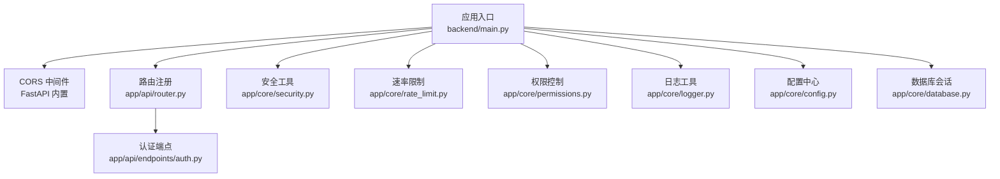
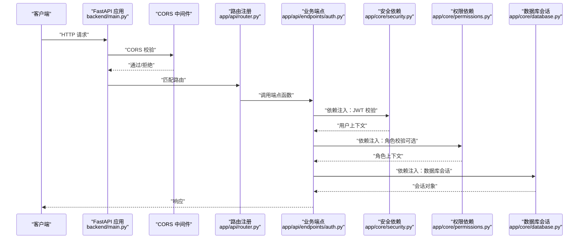
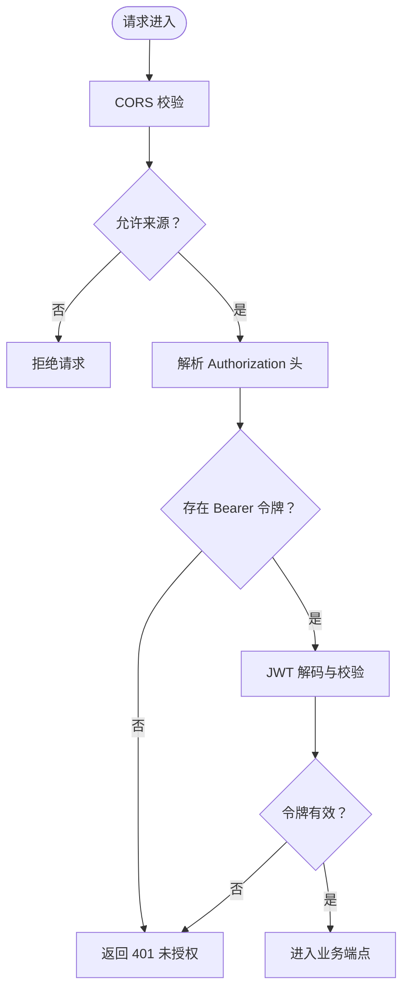
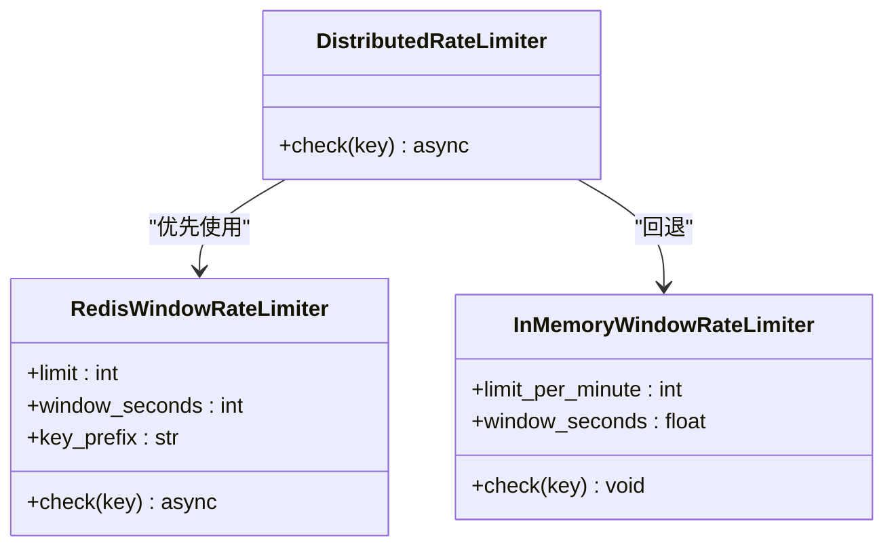
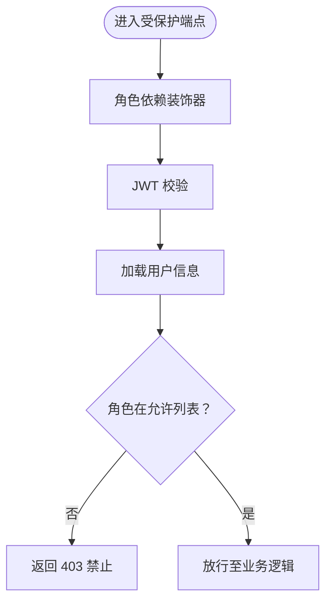
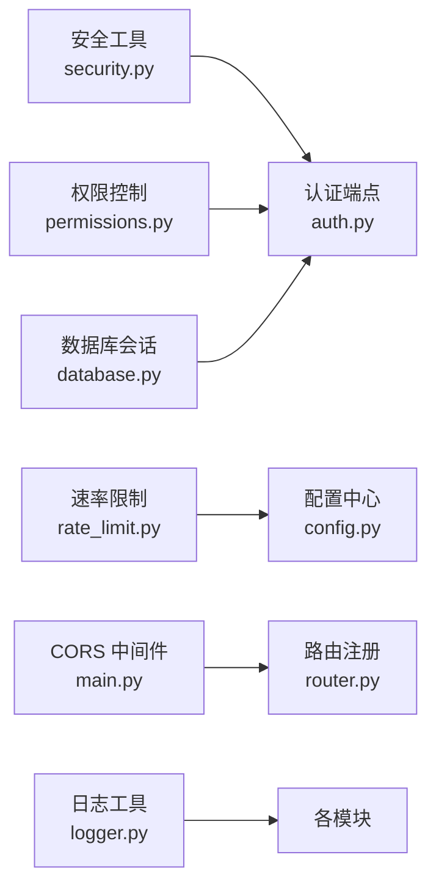

# 中间件与拦截器

<cite>
**本文引用的文件**
- [main.py](file://backend/main.py)
- [app/core/security.py](file://backend/app/core/security.py)
- [app/core/rate_limit.py](file://backend/app/core/rate_limit.py)
- [app/core/logger.py](file://backend/app/core/logger.py)
- [app/core/permissions.py](file://backend/app/core/permissions.py)
- [app/core/config.py](file://backend/app/core/config.py)
- [app/core/database.py](file://backend/app/core/database.py)
- [app/api/router.py](file://backend/app/api/router.py)
- [app/api/endpoints/auth.py](file://backend/app/api/endpoints/auth.py)
- [app/core/exceptions.py](file://backend/app/core/exceptions.py)
</cite>

## 目录
1. [简介](#简介)
2. [项目结构](#项目结构)
3. [核心组件](#核心组件)
4. [架构总览](#架构总览)
5. [详细组件分析](#详细组件分析)
6. [依赖分析](#依赖分析)
7. [性能考虑](#性能考虑)
8. [故障排查指南](#故障排查指南)
9. [结论](#结论)
10. [附录](#附录)

## 简介
本文件面向“智获客”后端中间件与拦截器体系，系统性梳理并解释以下能力：
- 安全中间件：JWT 令牌验证、CORS 配置、跨站攻击防护思路
- 速率限制中间件：滑动窗口与分布式计数两种实现及回退策略
- 日志中间件：结构化日志记录与审计追踪机制
- 权限控制中间件：基于角色的访问控制（RBAC）与动态权限检查
- 请求预处理、响应后处理与异常拦截的完整流程
- 性能优化与调试技巧
- 自定义中间件的开发模式与集成方法

## 项目结构
后端采用 FastAPI 应用入口集中管理中间件与路由注册，核心中间件与工具位于 app/core 下，业务路由通过 app/api/router.py 注册。

图表来源
- [main.py:46-65](file://backend/main.py#L46-L65)
- [app/api/router.py:32-35](file://backend/app/api/router.py#L32-L35)
- [app/api/endpoints/auth.py:114-118](file://backend/app/api/endpoints/auth.py#L114-L118)

章节来源
- [main.py:46-65](file://backend/main.py#L46-L65)
- [app/api/router.py:32-35](file://backend/app/api/router.py#L32-L35)

## 核心组件
- 安全中间件（JWT 验证与密码哈希）
  - 提供密码哈希与校验、JWT 签发与解码、Bearer 令牌校验依赖
  - 令牌解析失败或主体为空时统一抛出 401
- CORS 中间件（FastAPI 内置）
  - 基于配置项动态设置允许来源、凭证与头/方法
- 速率限制中间件（滑动窗口与 Redis 分布式）
  - 内存滑动窗口（单进程）、Redis 固定窗口计数（分布式）
  - 支持 Redis 不可用时的内存回退
- 权限控制中间件（RBAC）
  - 角色依赖装饰器，按角色白名单校验，支持动态权限检查
- 日志中间件（结构化日志与审计）
  - 统一日志器工厂，便于在各层输出结构化日志与审计事件
- 异常与数据库
  - 自定义异常基类与数据库会话依赖，支撑统一异常处理与事务管理

章节来源
- [app/core/security.py:18-57](file://backend/app/core/security.py#L18-L57)
- [main.py:59-65](file://backend/main.py#L59-L65)
- [app/core/rate_limit.py:16-108](file://backend/app/core/rate_limit.py#L16-L108)
- [app/core/permissions.py:9-30](file://backend/app/core/permissions.py#L9-L30)
- [app/core/logger.py:4-6](file://backend/app/core/logger.py#L4-L6)
- [app/core/exceptions.py:1-7](file://backend/app/core/exceptions.py#L1-L7)
- [app/core/database.py:22-29](file://backend/app/core/database.py#L22-L29)

## 架构总览
下图展示从请求进入应用到路由处理、中间件与依赖注入的整体流程。

图表来源
- [main.py:46-65](file://backend/main.py#L46-L65)
- [app/api/router.py:32-35](file://backend/app/api/router.py#L32-L35)
- [app/api/endpoints/auth.py:114-118](file://backend/app/api/endpoints/auth.py#L114-L118)
- [app/core/security.py:42-57](file://backend/app/core/security.py#L42-L57)
- [app/core/permissions.py:12-27](file://backend/app/core/permissions.py#L12-L27)
- [app/core/database.py:22-29](file://backend/app/core/database.py#L22-L29)

## 详细组件分析

### 安全中间件：JWT 令牌验证、CORS 配置与跨站防护
- JWT 令牌验证
  - 依赖 HTTP Bearer 头，解码失败或缺少主体字段时返回 401
  - 支持移动端 H5 票据签发与兑换，区分用途避免滥用
- CORS 配置
  - 允许来源、方法与头均可配置；当允许所有来源时禁用凭证
  - 生产环境禁止通配来源，确保白名单严格
- 跨站攻击防护思路
  - 使用受控来源白名单与凭证策略，结合 JWT 无状态特性降低 CSRF 风险
  - 建议配合 SameSite Cookie 与 HSTS（如反向代理层启用）

图表来源
- [main.py:59-65](file://backend/main.py#L59-L65)
- [app/core/security.py:42-57](file://backend/app/core/security.py#L42-L57)

章节来源
- [app/core/security.py:18-57](file://backend/app/core/security.py#L18-L57)
- [app/api/endpoints/auth.py:134-178](file://backend/app/api/endpoints/auth.py#L134-L178)
- [main.py:59-65](file://backend/main.py#L59-L65)
- [app/core/config.py:49-69](file://backend/app/core/config.py#L49-L69)

### 速率限制中间件：滑动窗口与分布式计数
- 内存滑动窗口（单机）
  - 使用线程锁保护队列，移除过期事件后比较长度与限额
  - 超限时抛出 429，提示“调用过于频繁”
- Redis 分布式计数（多节点）
  - 固定时间桶计数，首次写入设置过期时间
  - 异常时抛出运行时错误，便于上层捕获
- 分布式优先策略与回退
  - 优先使用 Redis；不可用时回退到内存滑动窗口，并记录告警日志

图表来源
- [app/core/rate_limit.py:16-108](file://backend/app/core/rate_limit.py#L16-L108)

章节来源
- [app/core/rate_limit.py:16-108](file://backend/app/core/rate_limit.py#L16-L108)
- [app/core/config.py:86-89](file://backend/app/core/config.py#L86-L89)

### 日志中间件：结构化日志记录与审计追踪
- 日志器工厂
  - 提供按模块命名的日志器，便于在中间件、服务层与端点统一输出
- 审计建议
  - 在关键端点（如登录、权限变更、敏感操作）记录结构化事件
  - 结合请求 ID 与用户上下文，形成可追溯的审计轨迹

章节来源
- [app/core/logger.py:4-6](file://backend/app/core/logger.py#L4-L6)

### 权限控制中间件：RBAC 实现与动态权限检查
- 角色依赖装饰器
  - 通过 verify_token 获取用户上下文，查询数据库获取角色
  - 角色不匹配时返回 403；支持动态角色白名单
- 动态权限检查
  - 可在端点层组合角色依赖与其他业务规则，实现细粒度权限控制

图表来源
- [app/core/permissions.py:9-30](file://backend/app/core/permissions.py#L9-L30)
- [app/core/security.py:42-57](file://backend/app/core/security.py#L42-L57)

章节来源
- [app/core/permissions.py:9-30](file://backend/app/core/permissions.py#L9-L30)
- [app/core/database.py:22-29](file://backend/app/core/database.py#L22-L29)

### 请求预处理、响应后处理与异常拦截
- 请求预处理
  - CORS 校验在路由前执行
  - 依赖注入链：JWT 校验 → 数据库会话 → 角色校验（可选）
- 响应后处理
  - FastAPI 默认将业务返回序列化为 JSON；可在端点层统一包装响应结构
- 异常拦截
  - 401/403/429 等由依赖与限流器直接抛出
  - 自定义异常基类用于领域错误分类，便于统一处理

章节来源
- [app/core/security.py:42-57](file://backend/app/core/security.py#L42-L57)
- [app/core/rate_limit.py:30-34](file://backend/app/core/rate_limit.py#L30-L34)
- [app/core/permissions.py:17-22](file://backend/app/core/permissions.py#L17-L22)
- [app/core/exceptions.py:1-7](file://backend/app/core/exceptions.py#L1-L7)

## 依赖分析
- 组件耦合
  - 安全与权限依赖共享 verify_token，形成统一的用户上下文入口
  - 速率限制器对 Redis 的可选依赖，保证单机与分布式场景的兼容
  - 日志器工厂为横切关注点，低耦合接入各模块
- 外部依赖
  - FastAPI 内置 CORS
  - Redis（可选）用于分布式限流
  - 数据库会话依赖 SQLAlchemy

图表来源
- [app/core/security.py:42-57](file://backend/app/core/security.py#L42-L57)
- [app/core/permissions.py:12-27](file://backend/app/core/permissions.py#L12-L27)
- [app/core/rate_limit.py:86-108](file://backend/app/core/rate_limit.py#L86-L108)
- [app/core/config.py:86-89](file://backend/app/core/config.py#L86-L89)
- [main.py:59-65](file://backend/main.py#L59-L65)
- [app/api/router.py:32-35](file://backend/app/api/router.py#L32-L35)
- [app/core/logger.py:4-6](file://backend/app/core/logger.py#L4-L6)
- [app/core/database.py:22-29](file://backend/app/core/database.py#L22-L29)

## 性能考虑
- 速率限制
  - 单机部署优先使用内存滑动窗口；多实例部署务必启用 Redis 并配置键前缀
  - 合理设置窗口与限额，避免频繁 GC 与锁竞争
- CORS
  - 生产环境避免通配来源，减少浏览器预检次数
- 日志
  - 使用结构化日志，避免在热路径中进行昂贵格式化
- 数据库
  - 控制会话生命周期，及时关闭连接，避免连接池耗尽

## 故障排查指南
- CORS 相关
  - 症状：跨域请求被拒绝
  - 排查：核对配置中的允许来源、凭证策略与请求头/方法
- JWT 相关
  - 症状：401 未授权
  - 排查：确认 Bearer 头格式、令牌签名算法与密钥一致、主体字段存在且可转换为整数
- 速率限制
  - 症状：429 过于频繁
  - 排查：检查 Redis 是否可用、键前缀与窗口配置、客户端重试策略
- 权限不足
  - 症状：403 禁止
  - 排查：确认用户角色、端点所需角色白名单与数据库角色字段

章节来源
- [main.py:59-65](file://backend/main.py#L59-L65)
- [app/core/security.py:42-57](file://backend/app/core/security.py#L42-L57)
- [app/core/rate_limit.py:64-72](file://backend/app/core/rate_limit.py#L64-L72)
- [app/core/permissions.py:17-22](file://backend/app/core/permissions.py#L17-L22)

## 结论
本系统通过内置 CORS、JWT 验证、RBAC 权限与可选 Redis 速率限制，构建了安全、可控且可扩展的中间件体系。建议在生产环境中：
- 明确 CORS 白名单，禁用通配来源
- 为 SECRET_KEY 设置强密钥并定期轮换
- 为分布式限流启用 Redis 并监控其健康
- 在关键端点引入结构化日志与审计事件
- 通过依赖注入与装饰器实现统一的请求预处理与异常拦截

## 附录
- 自定义中间件开发模式与集成方法
  - 开发模式
    - 以依赖注入为核心：将通用逻辑封装为依赖函数，复用 FastAPI 的依赖解析与生命周期
    - 将横切关注点（鉴权、限流、日志）下沉为独立模块，保持端点简洁
  - 集成方法
    - 在应用入口添加中间件或通过依赖注入实现“伪中间件”
    - 对于需要全局拦截的异常，可在应用层注册异常处理器，统一返回结构化错误