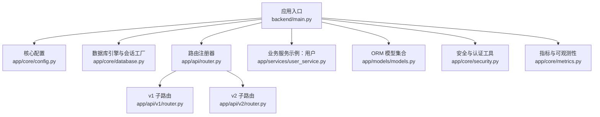
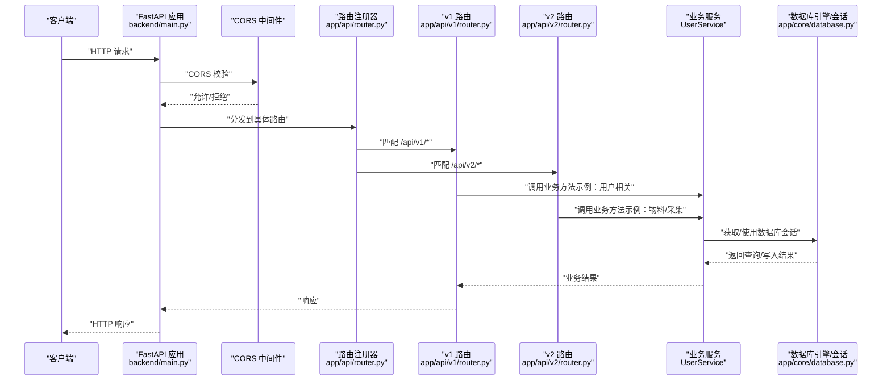
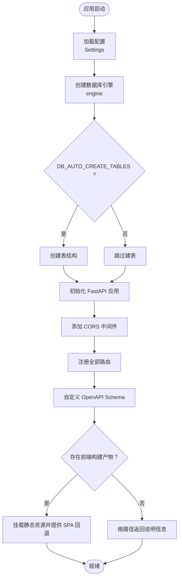
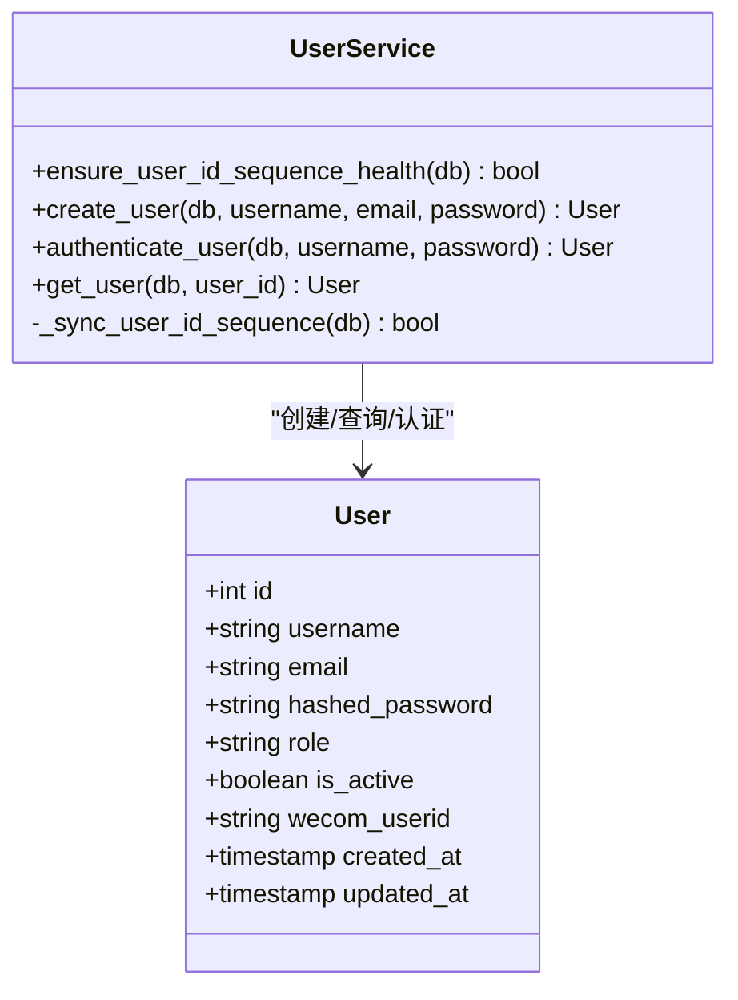
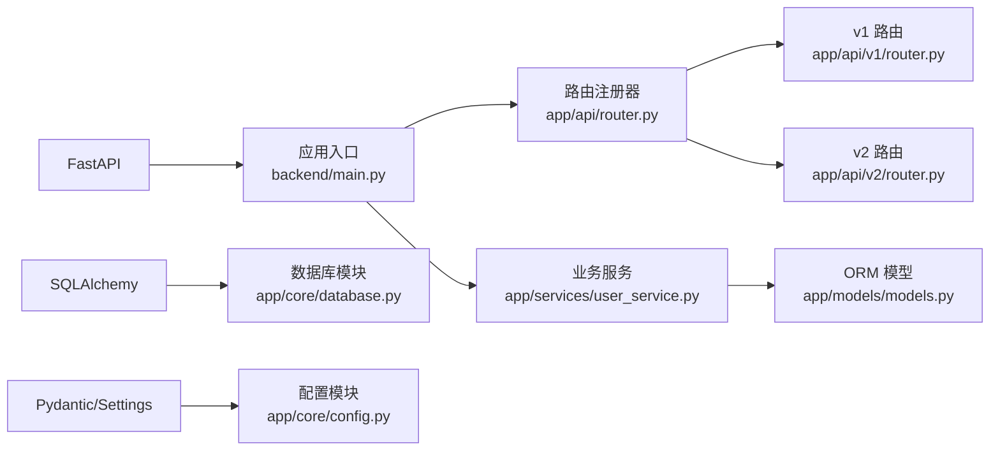

# 后端服务架构

<cite>
**本文引用的文件**
- [main.py](file://backend/main.py)
- [app/main.py](file://backend/app/main.py)
- [pyproject.toml](file://backend/pyproject.toml)
- [README.md](file://backend/README.md)
- [app/core/config.py](file://backend/app/core/config.py)
- [app/core/database.py](file://backend/app/core/database.py)
- [app/core/security.py](file://backend/app/core/security.py)
- [app/core/metrics.py](file://backend/app/core/metrics.py)
- [app/api/router.py](file://backend/app/api/router.py)
- [app/api/v1/router.py](file://backend/app/api/v1/router.py)
- [app/api/v2/router.py](file://backend/app/api/v2/router.py)
- [app/models/models.py](file://backend/app/models/models.py)
- [app/services/user_service.py](file://backend/app/services/user_service.py)
</cite>

## 目录
1. [简介](#简介)
2. [项目结构](#项目结构)
3. [核心组件](#核心组件)
4. [架构总览](#架构总览)
5. [组件详解](#组件详解)
6. [依赖关系分析](#依赖关系分析)
7. [性能考量](#性能考量)
8. [故障排查指南](#故障排查指南)
9. [结论](#结论)
10. [附录](#附录)

## 简介
本文件面向“智获客”后端服务，系统化梳理基于 FastAPI 的应用初始化流程、配置与生命周期管理、API 路由体系、数据库连接与 ORM 设计、业务服务层组织与依赖注入模式、安全与 CORS、健康检查机制，并给出性能优化与监控指标建议。文档兼顾技术细节与可读性，帮助开发者快速理解并高效维护系统。

## 项目结构
后端采用模块化分层组织：核心配置与基础设施位于 core，API 路由与版本化子路由位于 api，业务模型与服务位于 models 与 services，入口应用位于根目录 main.py。整体遵循“配置—基础设施—路由—服务—模型”的分层结构，便于扩展与维护。



图表来源
- [main.py:46-68](file://backend/main.py#L46-L68)
- [app/api/router.py:32-35](file://backend/app/api/router.py#L32-L35)
- [app/api/v1/router.py:9-16](file://backend/app/api/v1/router.py#L9-L16)
- [app/api/v2/router.py:6-9](file://backend/app/api/v2/router.py#L6-L9)
- [app/core/config.py:15-103](file://backend/app/core/config.py#L15-L103)
- [app/core/database.py:1-29](file://backend/app/core/database.py#L1-L29)
- [app/core/security.py:1-57](file://backend/app/core/security.py#L1-L57)
- [app/core/metrics.py:1-44](file://backend/app/core/metrics.py#L1-L44)
- [app/models/models.py:1-800](file://backend/app/models/models.py#L1-L800)
- [app/services/user_service.py:24-177](file://backend/app/services/user_service.py#L24-L177)

章节来源
- [README.md:90-107](file://backend/README.md#L90-L107)
- [pyproject.toml:1-47](file://backend/pyproject.toml#L1-L47)

## 核心组件
- 应用入口与生命周期：通过 lifespan 在启动阶段执行最佳努力的健康检查，随后进入请求处理。
- 配置管理：基于 pydantic-settings 的 Settings 类集中管理数据库、JWT、CORS、AI 模型、限流、上传等配置项。
- 数据库与会话：SQLAlchemy 引擎与 sessionmaker 提供连接池与会话管理，支持 pre_ping 与溢出控制。
- 安全与认证：基于 passlib 的密码哈希与 python-jose 的 JWT 签发与校验，HTTP Bearer 授权方案。
- 路由系统：统一注册器集中 include 各模块路由，支持 v1/v2 版本化路由与健康检查端点。
- 业务服务：以 UserService 为例，封装用户创建、认证、序列对齐与错误分类处理。
- 指标与可观测性：提供用户序列修复与启动对齐的线程安全计数器与快照接口。

章节来源
- [main.py:22-36](file://backend/main.py#L22-L36)
- [app/core/config.py:15-103](file://backend/app/core/config.py#L15-L103)
- [app/core/database.py:1-29](file://backend/app/core/database.py#L1-L29)
- [app/core/security.py:1-57](file://backend/app/core/security.py#L1-L57)
- [app/api/router.py:32-35](file://backend/app/api/router.py#L32-L35)
- [app/api/v1/router.py:9-16](file://backend/app/api/v1/router.py#L9-L16)
- [app/api/v2/router.py:6-9](file://backend/app/api/v2/router.py#L6-L9)
- [app/services/user_service.py:24-177](file://backend/app/services/user_service.py#L24-L177)
- [app/core/metrics.py:1-44](file://backend/app/core/metrics.py#L1-L44)

## 架构总览
下图展示从请求进入至响应返回的关键路径，涵盖 CORS、路由分发、依赖注入、数据库会话与业务服务调用。



图表来源
- [main.py:53-68](file://backend/main.py#L53-L68)
- [app/api/router.py:32-35](file://backend/app/api/router.py#L32-L35)
- [app/api/v1/router.py:9-16](file://backend/app/api/v1/router.py#L9-L16)
- [app/api/v2/router.py:6-9](file://backend/app/api/v2/router.py#L6-L9)
- [app/services/user_service.py:61-91](file://backend/app/services/user_service.py#L61-L91)
- [app/core/database.py:22-29](file://backend/app/core/database.py#L22-L29)

## 组件详解

### 应用初始化与生命周期管理
- 初始化步骤
  - 解析配置：加载 .env 并校验敏感参数（如 SECRET_KEY 长度与强度）。
  - 数据库准备：根据配置创建引擎与会话工厂；可选在启动时自动建表。
  - CORS 中间件：依据 CORS_ORIGINS 动态决定是否允许凭据。
  - 路由注册：统一 include 所有路由模块。
  - OpenAPI 自定义：替换 logo 与补充信息。
  - 前端静态资源：若存在桌面前端构建产物，挂载静态资源并提供 SPA 回退。
- 生命周期钩子
  - lifespan 在启动前执行健康检查：对用户 ID 序列进行对齐与修复尝试，记录指标并打印异常日志。
  - 应用退出时自动关闭会话，避免资源泄漏。



图表来源
- [main.py:22-36](file://backend/main.py#L22-L36)
- [main.py:46-68](file://backend/main.py#L46-L68)
- [main.py:71-107](file://backend/main.py#L71-L107)
- [main.py:111-127](file://backend/main.py#L111-L127)

章节来源
- [main.py:22-36](file://backend/main.py#L22-L36)
- [main.py:46-68](file://backend/main.py#L46-L68)
- [main.py:71-107](file://backend/main.py#L71-L107)
- [main.py:111-127](file://backend/main.py#L111-L127)

### 配置管理与安全策略
- 配置项要点
  - 项目与调试：API_TITLE、API_VERSION、DEBUG。
  - 数据库：DATABASE_URL、主机/端口/用户/密码、DB_AUTO_CREATE_TABLES、用户序列健康检查开关。
  - JWT：SECRET_KEY（强制长度≥32且非默认占位）、ALGORITHM、ACCESS_TOKEN_EXPIRE_MINUTES、移动端票据过期。
  - CORS：CORS_ORIGINS 白名单，生产禁止使用通配符。
  - AI 与火山引擎：本地 Ollama 与云端 Ark 配置、超时、限流窗口与速率。
  - Redis 分布式限流：USE_REDIS_RATE_LIMIT、REDIS_URL、键前缀。
  - 文件上传：MAX_UPLOAD_SIZE、UPLOAD_DIR。
  - 企业微信：可选 OAuth 参数与 Webhook。
  - 浏览器采集：BROWSER_COLLECTOR_BASE_URL、超时。
- 安全策略
  - 密码哈希：pbkdf2_sha256 为主，兼容 bcrypt。
  - JWT：签发与解码，校验失败统一抛出 401。
  - Bearer 授权：HTTP Bearer 方案，凭据在 Header 中传递。

章节来源
- [app/core/config.py:15-103](file://backend/app/core/config.py#L15-L103)
- [app/core/security.py:1-57](file://backend/app/core/security.py#L1-L57)

### 数据库连接管理与 ORM 模型
- 连接与会话
  - 引擎参数：echo（DEBUG 控制）、pool_pre_ping、pool_size、max_overflow。
  - 会话工厂：autocommit=false、autoflush=false，每次请求生成独立会话并通过依赖注入提供。
  - 会话生命周期：yield 返回，finally 关闭，避免泄漏。
- ORM 模型设计
  - 用户、内容资产、评论、快照、洞察、重写内容、线索、客户、发布记录、任务、采集任务、物料入库、知识文档与块、规则与提示词、生成任务等。
  - 关系与级联：合理使用 ForeignKey、relationship、级联删除与孤儿对象处理。
  - 枚举类型：平台类型、内容类型、风险等级、意向等级、客户状态、任务状态等。
  - 索引与约束：对高频查询字段建立索引，必要时使用唯一约束保证数据一致性。

```mermaid
erDiagram
USER {
int id PK
string username UK
string email UK
string hashed_password
string role
boolean is_active
string wecom_userid UK
timestamp created_at
timestamp updated_at
}
CONTENT_ASSET {
int id PK
int owner_id FK
string platform
string source_url
string content_type
string title
text content
string author
timestamp publish_time
json tags
json comments_keywords
json top_comments
json metrics
float heat_score
boolean is_viral
string source_type
string category
text manual_note
json screenshots
timestamp created_at
timestamp updated_at
}
REWRITTEN_CONTENT {
int id PK
int source_id FK
string target_platform
string content_type
text original_content
text rewritten_content
string risk_level
float compliance_score
string compliance_status
json risk_points
json suggestions
timestamp created_at
timestamp updated_at
}
PUBLISH_RECORD {
int id PK
int rewritten_content_id FK
string platform
string account_name
timestamp publish_time
string published_by
int views
int likes
int comments
int favorites
int shares
int private_messages
int wechat_adds
int leads
int valid_leads
int conversions
timestamp created_at
timestamp updated_at
}
LEAD {
int id PK
int owner_id FK
int publish_task_id FK
string platform
string source
string title
string post_url
int wechat_adds
int leads
int valid_leads
int conversions
string status
string intention_level
text note
timestamp created_at
timestamp updated_at
}
CUSTOMER {
int id PK
int owner_id FK
string nickname
string wechat_id
string phone
string source_platform
int source_content_id
int lead_id UK FK
json tags
string intention_level
string customer_status
text inquiry_content
json follow_records
timestamp created_at
timestamp updated_at
}
PUBLISH_TASK {
int id PK
int owner_id FK
int rewritten_content_id FK
int publish_record_id FK
string platform
string account_name
string task_title
text content_text
string status
int assigned_to
timestamp due_time
timestamp claimed_at
timestamp posted_at
timestamp closed_at
string post_url
text reject_reason
text close_reason
int views
int likes
int comments
int favorites
int shares
int private_messages
int wechat_adds
int leads
int valid_leads
int conversions
timestamp created_at
timestamp updated_at
}
MATERIAL_ITEM {
int id PK
int owner_id FK
int source_content_id FK
int normalized_content_id FK
string source_channel
int source_task_id FK
int source_submission_id FK
int submitted_by_employee_id FK
string platform
string source_id
text source_url
string keyword
text title
text content_text
text content_preview
string author_name
string cover_url
timestamp publish_time
int like_count
int comment_count
int favorite_count
int share_count
string hot_level
string lead_level
text lead_reason
int quality_score
int relevance_score
int lead_score
string parse_status
string risk_status
boolean is_duplicate
text filter_reason
string status
text remark
text review_note
timestamp created_at
timestamp updated_at
}
KNOWLEDGE_DOCUMENT {
int id PK
int owner_id FK
int material_item_id FK
string platform
string account_type
string target_audience
string content_type
text topic
text title
text summary
text content_text
timestamp created_at
}
KNOWLEDGE_CHUNK {
int id PK
int owner_id FK
int knowledge_document_id FK
string chunk_type
text chunk_text
int chunk_index
json keywords
timestamp created_at
}
GENERATION_TASK {
int id PK
int owner_id FK
int material_item_id FK
string platform
string account_type
string target_audience
string task_type
text prompt_snapshot
text output_text
json reference_document_ids
json tags_json
json copies_json
json compliance_json
string selected_variant
int selected_variant_index
string adoption_status
timestamp adopted_at
int adopted_by_user_id FK
timestamp created_at
}
USER ||--o{ CONTENT_ASSET : "拥有"
USER ||--o{ LEAD : "拥有"
USER ||--o{ CUSTOMER : "拥有"
CONTENT_ASSET ||--o{ REWRITTEN_CONTENT : "被重写"
REWRITTEN_CONTENT ||--o{ PUBLISH_RECORD : "生成发布记录"
USER ||--o{ PUBLISH_TASK : "拥有"
MATERIAL_ITEM ||--o{ KNOWLEDGE_DOCUMENT : "产生知识文档"
KNOWLEDGE_DOCUMENT ||--o{ KNOWLEDGE_CHUNK : "拆分为块"
MATERIAL_ITEM ||--o{ GENERATION_TASK : "驱动生成"
```

图表来源
- [app/models/models.py:8-800](file://backend/app/models/models.py#L8-L800)

章节来源
- [app/core/database.py:1-29](file://backend/app/core/database.py#L1-L29)
- [app/models/models.py:1-800](file://backend/app/models/models.py#L1-L800)

### API 路由系统与中间件
- 路由注册机制
  - 统一注册器：集中导入各模块路由并 include 到应用，减少分散配置。
  - 版本化路由：v1 与 v2 子路由分别挂载不同业务域，便于演进与兼容。
- 中间件配置
  - CORS：根据 CORS_ORIGINS 自动决定是否允许凭据，满足 Starlette 要求。
  - 健康检查：根路径与版本路由提供健康端点，便于运维探测。
- 前端集成
  - 若存在桌面前端构建产物，挂载静态资源并提供 SPA 回退，确保单页应用正常运行。

章节来源
- [app/api/router.py:32-35](file://backend/app/api/router.py#L32-L35)
- [app/api/v1/router.py:9-16](file://backend/app/api/v1/router.py#L9-L16)
- [app/api/v2/router.py:6-9](file://backend/app/api/v2/router.py#L6-L9)
- [main.py:53-68](file://backend/main.py#L53-L68)
- [main.py:71-107](file://backend/main.py#L71-L107)

### 业务逻辑层与依赖注入
- 依赖注入模式
  - 数据库会话通过依赖注入提供：每个请求生成独立 Session，使用完即关闭。
  - 路由层通过依赖注入调用业务服务，服务层再操作 ORM 模型。
- 业务服务示例：UserService
  - 用户创建：先查重，再哈希密码，插入数据库；捕获唯一约束冲突时进行序列修复并重试一次。
  - 认证：查询用户并校验密码，失败返回 401。
  - 序列健康：启动时对 users.id 序列进行对齐与修复，记录指标并打印异常日志。
- 错误分类与处理：对用户创建的完整性错误进行分类，区分用户名/邮箱冲突与主键冲突，后者触发序列修复流程。



图表来源
- [app/services/user_service.py:24-177](file://backend/app/services/user_service.py#L24-L177)
- [app/models/models.py:8-27](file://backend/app/models/models.py#L8-L27)

章节来源
- [app/services/user_service.py:24-177](file://backend/app/services/user_service.py#L24-L177)
- [app/core/database.py:22-29](file://backend/app/core/database.py#L22-L29)

### 安全配置与 CORS
- CORS
  - 允许来源来自配置白名单；当包含通配符时不允许携带凭据，生产环境禁止使用通配符。
- JWT
  - 签发与解码：使用 SECRET_KEY 与 ALGORITHM；过期时间可配置；校验失败统一 401。
- 密码安全
  - 使用 pbkdf2_sha256 作为默认算法，兼容 bcrypt，确保历史哈希可验证。

章节来源
- [main.py:53-65](file://backend/main.py#L53-L65)
- [app/core/config.py:49-69](file://backend/app/core/config.py#L49-L69)
- [app/core/security.py:18-57](file://backend/app/core/security.py#L18-L57)

### 健康检查机制
- 应用级健康检查：/health 返回状态与用户序列指标快照。
- 版本路由健康检查：/api/v1/health 与 /api/v2/health 返回版本信息。
- 运维健康检查：README 提供 /api/system/ops/health 与 /api/system/ops/readiness 的调用示例，用于验证数据库、Redis、Ollama 状态。

章节来源
- [main.py:71-77](file://backend/main.py#L71-L77)
- [app/api/v1/router.py:19-21](file://backend/app/api/v1/router.py#L19-L21)
- [app/api/v2/router.py:12-14](file://backend/app/api/v2/router.py#L12-L14)
- [README.md:197-200](file://backend/README.md#L197-L200)

## 依赖关系分析
- 外部依赖
  - FastAPI、Uvicorn、SQLAlchemy、Alembic、Pydantic、Pydantic-settings、python-jose、passlib、bcrypt、aiohttp、httpx、pytest、python-dotenv、ollama、redis、pillow、pytesseract 等。
- 内部耦合
  - 应用入口依赖配置、数据库、路由注册器与业务服务；路由注册器依赖各模块子路由；业务服务依赖 ORM 模型与数据库会话。
- 潜在循环依赖
  - 通过“入口依赖注册器，注册器依赖子路由，子路由不反向依赖入口”的方式避免循环导入。



图表来源
- [pyproject.toml:7-31](file://backend/pyproject.toml#L7-L31)
- [main.py:11-16](file://backend/main.py#L11-L16)
- [app/api/router.py:1-35](file://backend/app/api/router.py#L1-L35)
- [app/api/v1/router.py:1-22](file://backend/app/api/v1/router.py#L1-L22)
- [app/api/v2/router.py:1-15](file://backend/app/api/v2/router.py#L1-L15)
- [app/core/config.py:1-103](file://backend/app/core/config.py#L1-L103)
- [app/core/database.py:1-29](file://backend/app/core/database.py#L1-L29)
- [app/services/user_service.py:1-177](file://backend/app/services/user_service.py#L1-L177)
- [app/models/models.py:1-800](file://backend/app/models/models.py#L1-L800)

章节来源
- [pyproject.toml:7-31](file://backend/pyproject.toml#L7-L31)

## 性能考量
- 数据库连接池
  - 合理设置 pool_size 与 max_overflow，结合 pool_pre_ping 提升连接稳定性。
  - 严格使用依赖注入的会话生命周期，避免长事务与连接泄漏。
- ORM 查询
  - 对高频查询字段建立索引；避免 N+1 查询，使用 select_related/joinedload。
  - 批量写入与批量查询，减少往返次数。
- 限流与并发
  - Redis 分布式限流开启时，注意键空间与过期策略；降级场景下进程内限流作为后备。
- 前端静态资源
  - 静态资源缓存友好头，减少带宽与服务器压力。
- 日志与指标
  - 结合用户序列修复指标与业务关键路径埋点，持续观察延迟与错误率。

## 故障排查指南
- 启动失败或健康检查异常
  - 检查 DATABASE_URL 与数据库连通性；确认 DB_AUTO_CREATE_TABLES 与 Alembic 迁移状态。
  - 查看 lifespan 中用户序列健康检查日志，关注序列修复尝试与失败计数。
- CORS 问题
  - 确认 CORS_ORIGINS 是否包含正确来源；生产环境不得使用通配符。
- 认证失败
  - 核对 SECRET_KEY 长度与强度；检查 JWT 签发与解码流程。
- 用户注册失败
  - 关注唯一约束冲突与主键冲突的错误分类；查看序列修复重试日志。
- 运维健康检查
  - 使用 README 中提供的 /api/system/ops/health 与 /api/system/ops/readiness 验证数据库、Redis、Ollama 状态。

章节来源
- [main.py:22-36](file://backend/main.py#L22-L36)
- [app/core/config.py:49-69](file://backend/app/core/config.py#L49-L69)
- [app/core/security.py:42-57](file://backend/app/core/security.py#L42-L57)
- [app/services/user_service.py:101-152](file://backend/app/services/user_service.py#L101-L152)
- [README.md:197-200](file://backend/README.md#L197-L200)

## 结论
该后端服务以 FastAPI 为核心，结合 SQLAlchemy ORM 与模块化分层架构，实现了清晰的配置、路由、服务与数据层边界。通过 lifespan 健康检查、CORS 中间件、JWT 安全与版本化路由，系统具备良好的可维护性与可扩展性。建议在生产环境中强化限流、监控与日志策略，持续优化数据库索引与查询路径，保障高并发下的稳定性与性能。

## 附录
- 快速启动与 API 文档
  - 参考 README 的 Docker 与本地运行说明，访问 /docs 与 /redoc 查看 API 文档。
- 生产部署要点
  - 使用 docker-compose.prod.yml；设置 DEBUG=False、HTTPS、CORS 源与强密钥；部署后执行健康检查端点。

章节来源
- [README.md:16-27](file://backend/README.md#L16-L27)
- [README.md:81-86](file://backend/README.md#L81-L86)
- [README.md:212-222](file://backend/README.md#L212-L222)